<!-- README.md is generated from README.Rmd. Please edit that file -->

# MODELAGEM COMPUTACIONAL DA CONCENTRAÇÃO ATMOSFÉRICA DE CO<sub>2</sub> e CH<sub>4</sub> NO BRASIL CENTRAL

**Resumo**: As mudanças climáticas globais são uma preocupação mundial
constante, sendo a principal causa o aumento da concentração de gases de
efeito estufa (GEE) na atmosfera, especialmente o dióxido de carbono
(CO<sub>2</sub>) e o metano (CH<sub>4</sub>). Para implementar medidas
eficientes de mitigação das emissões de GEE, é fundamental compreender a
dinâmica desses gases na atmosfera e estabelecer relações com outras
variáveis associadas ao sistema solo-planta-atmosfera. Nesse contexto,
diversos esforços têm sido realizados para aprimorar as técnicas de
monitoramento de GEE em escala global e regional. Esta proposta tem como
objetivo descrever a variabilidade espaçotemporal das concentrações
atmosféricas de CO<sub>2</sub> e CH<sub>4</sub> em áreas do Brasil
Central, identificando fontes e possíveis sumidouros desses gases ao
longo dos anos de 2015 a 2023. Serão adquiridos dados das concentrações
atmosféricas de CO<sub>2</sub> (X<sub>CO2</sub>) e CH<sub>4</sub>
(X<sub>CH4</sub>) a partir dos sensores orbitais GOSAT e OCO-2. Em
adição, dados das variáveis climáticas serão obtidos na plataforma da
Agência Espacial Americana (NASA). Para todos os setores emissores de
GEE, os dados serão obtidos a partir dos relatórios da plataforma
Climate TRACE, coalizão sem fins lucrativos capaz de rastrear e fornecer
informações sobre as emissões de GEE globalmente. A aquisição dos dados
será sistematizada para redução das diferenças entre as resoluções
espaciais dos dados de sensoriamento remoto, com posterior remoção da
tendência mundial de X<sub>CO2</sub> e X<sub>CH4</sub>. Para exploração
dos dados adquiridos, serão utilizadas técnicas exploratórias
multivariadas e análise geoestatística, implementadas em linguagem R. A
interrelação entre as variáveis analisadas será descrita por de
reconhecimento de padrão, que incluíram análises de agrupamento
hierárquico e não-hierárquico, análise de componentes principais
associadas aos padrões de variabilidade espacial. Espera-se que essa
abordagem contribua para melhorar a compreensão da dinâmica dos gases de
efeito estufa na atmosfera e suas interações com variáveis climáticas e
de uso da terra no Brasil Central, auxiliando na formulação de políticas
públicas voltadas para a mitigação das emissões de GEE e,
principalmente, a adaptação às mudanças climáticas.

**Objetivo**: Analisar a variabilidade espaçotemporal das concentrações
atmosféricas de CO<sub>2</sub> e CH<sub>4</sub> em áreas do Brasil
Central, identificando fontes e possíveis sumidouros desses gases ao
longo dos anos de 2015 a 2023, bem como suas relações com índices
vegetativos e climáticos, por meio de dados de GOSAT, OCO-2 e Climate
TRACE.

## 👨‍🔬 Autores

- **Pedro Henrique Marucio de Oliveira**  
  Graduando em Agronomia - FCAV/Unesp  
  Email: [pedro.marucio@unesp.br](mailto:pedro.marucio@unesp.b)

- **Prof. Dr. Alan Rodrigo Panosso**  
  Coorientador — Departamento de Ciências Exatas - FCAV/Unesp  
  Email: <alan.panosso@unesp.br>

## 📁 Etapas do Projeto

Os scripts abaixo foram desenvolvidos em RMarkdown e estão disponíveis
em formato HTML:

- **Aquisição e download dos dados brutos**
  - [GOSAT](https://data.ceda.ac.uk/neodc/gosat/data/ch4/nceov1.0/CH4_GOS_OCPR/):
    Dados de concentração de CH<sub>4</sub> 2009 a 2021  
  - [OCO-2](https://disc.gsfc.nasa.gov): Dados de concentração de
    XCO<sub>2</sub>
    (<https://disc.gsfc.nasa.gov/datasets/OCO2_L2_Lite_FP_11.2r/summary?keywords=OCO2>)
    e SIF (<a
    href="https://disc.gsfc.nasa.gov/datasets/OCO2_L2_Lite_SIF_11r/summary?keywords=OCO2\"
    class="uri">https://disc.gsfc.nasa.gov/datasets/OCO2_L2_Lite_SIF_11r/summary?keywords=OCO2\</a>
  - [Climate TRACE](https://climatetrace.org/): Dados de emissões de GEE
    de 2015 a 2022  
  - [AppEEARS](https://appeears.earthdatacloud.nasa.gov/task/point):
    Variáveis climáticas e vegetativas  
  - [nasapower](https://power.larc.nasa.gov/): Variáveis climáticas
    (Temperatura; precipitação; radiação solar; umidade relativa;
    velocidade do vento e pressão) de 2015 a 2024  
  - [DETER](https://terrabrasilis.dpi.inpe.br/downloads/): Dados de
    focos de fogo (cicatriz de queimadas)  
  - [Desmatamento - INPE - PRODES - Plataforma
    Terrabrasilis](https://terrabrasilis.dpi.inpe.br/geonetwork/srv/eng/catalog.search#/metadata/fe02f2bf-2cc0-49d5-ab72-a3954f997408):
    Dados sobre desmatamento de 31/07/2000 a 30/07/2023  
- **Dados adicionais adquiridos (não utilizados no trabalho)**
  - [NASA](https://climate.nasa.gov/): Dados climáticos  
  - [NASA-FIRMS](https://firms.modaps.eosdis.nasa.gov): Dados de focos
    de incêndio de 2015 a 2025  
  - [BDQUEIMADAS](https://terrabrasilis.dpi.inpe.br/queimadas/bdqueimadas/#exportar-dados):
    Dados de focos de incêndio de 2015 a 2025  
  - [Programa Queimadas - INPE - Plataforma
    Terrabrasilis](https://terrabrasilis.dpi.inpe.br/queimadas/portal/):
    Dados de focos de queimadas x Supressão da vegetação nativa de
    08/2018 a 01/2025 & Dados de focos de fogo ativo de 1998 a
    21/01/2025  

## 🧹 Faxina e Tratamento [script_geral](https://arpanosso.github.io//projeto-oliveiraphm//01_faxina_tratamento_dados.html)

Nessa etapa foi realizada a faxina, filtragem e organização inicial dos
dados. Os dados de concentração atmosférica de dióxido de carbono (XCO2)
e metano (XCH4) foram devidamente processados e filtrados para o
território brasileiro, incluindo:

Filtro geográfico (apenas medições dentro do Brasil);  
Controle de qualidade (baseado nos flags de qualidade dos dados
originais);  
Organização por regiões (Norte, Nordeste, Sudeste, Sul e Centro-Oeste);

### 🔗 Scripts de tratamentos e Links para Download dos dados processados:

| Script de Tratamento | Dados Processados Para Download |
|:--:|:--:|
| [nasa-xco2](https://arpanosso.github.io//projeto-oliveiraphm//nasa-xco2.html) | ⬇️ [nasa-xco2.rds](https://drive.google.com/file/d/1sVsLvBLxUB1YbqWyDUg177Eua2oREvgH/view?usp=sharing) |
| [gosat-xch4](https://arpanosso.github.io//projeto-oliveiraphm//gosat-xch4.html) | ⬇️ [gosat-xch4.rds](https://drive.google.com/file/d/1Rj-jcHOblEEb1ARMyJ1Jyfo4wCJnGliB/view?usp=drive_link) |
| [oco2-sif](https://arpanosso.github.io//projeto-oliveiraphm//oco2-sif.html) | ⬇️ [oco2-sif.rds](https://drive.google.com/file/d/1c4WlEmgnwu7R_ENjzMTTg2a4mP1IaiG_/view?usp=sharing) |
| [appeears-modis](https://arpanosso.github.io//projeto-oliveiraphm//appeears-modis.html) | ⬇️ [appeears-modis.rds](https://drive.google.com/file/d/15bpg2r2_XSWveyWrFu6oumt79UUlxzJr/view?usp=sharing) |
| [emissions-sources](https://arpanosso.github.io//projeto-oliveiraphm//emissions-sources.html) | ⬇️ [emissions-sources.rds](https://drive.google.com/file/d/17erldRlIlTiB5sVtLWjsv4E--zZ3gmH-/view?usp=sharing) |
| [nasa-power](https://arpanosso.github.io//projeto-oliveiraphm//nasa-xco2.html) | ⬇️ [nasa-power.rds](https://drive.google.com/file/d/13_PR3bQ9-ga_Wiv7jEv-GhYpAJwhmyTN/view?usp=sharing) |
| [prodes-deforestation](https://arpanosso.github.io//projeto-oliveiraphm//prodes-deforestation.html) | ⬇️ [prodes-deforestation.rds](https://drive.google.com/file/d/1X4KJ_XK3GRcrwNCwWVEihJQBMGb72Z3S/view?usp=sharing) |
| [deter-queimadas](https://arpanosso.github.io//projeto-oliveiraphm//deter-queimadas.html) | ⬇️ [deter-queimadas.rds](https://drive.google.com/file/d/1cmikkge6MtLJXuPBYeV-ZuMYoaNKP967/view?usp=sharing) |
| [nasa-firms](https://arpanosso.github.io//projeto-oliveiraphm//nasa-firms.html) | ⬇️ [nasa-firms.rds](https://drive.google.com/file/d/1aMsbg35-QRBs-xiS8jl6lQ6feUySxM3e/view?usp=sharing) |

Formato dos arquivos:

> .rds (formato nativo do R para rápido carregamento)

> salve os arquivos na pasta `data` do seu projeto

#### 🛠️ Pré-processameto [script](https://arpanosso.github.io//projeto-oliveiraphm//02_preprocessamento.html)

#### ⛓️ Incorporação das bases

[script](adicionar%20link)

### 🛠 Preparação dos dados para análise.

``` r
library(tidyverse)
library(dplyr)
library(purrr) # criar funções
library(tibble)
library(corrplot)
library(vegan)
library(stringi)
source("R/my-function.R") 
#> List of polygons loaded [list_pol]
```

#### Definindo estados

``` r
my_states <- c("MS","MT","GO","DF")
```

## 💨 Entrada com todas as bases atualizadas com os setores `base_completa_setores.rds`

``` r
base_completa_setores <- read_rds('data/base_completa_setores.rds')

# # NA na base toda
# sum(is.na(base_completa_setores))
# 
# # NA por coluna
# sapply(base_completa_setores, function(x) sum(is.na(x)))
```

## 💨 Entrada com todas as bases atualizadas com os subsetores `base_completa_subsetores.rds`

``` r
base_completa_subset <- read_rds('data/base_completa_subsetores.rds')
```

# 🔎 Análises

<!--
### 🧮 Estatística descritiva
&#10;
``` r
# variavel <- "xco2" # opcional (mudar variavel)
&#10;# Criar vetor com as variáveis
variaveis <- base_completa_setores |>
  select(-year, -state, -city_ref) |>
  names()
&#10;# names(base_completa_setores) # ver colunas
&#10;# Função de loop sobre as variáveis para facilitar processo
for (variavel in variaveis) {
  cat("Processando:", variavel, "\n")  # feedback
&#10;# df <- base_completa_setores |>
#   filter(state != 'DF') |> 
#   group_by(year,state) |>
#   summarise(
#     N = sum(!is.na(.data[[variavel]]), na.rm = TRUE), # observações
#     MIN = min(.data[[variavel]], na.rm = TRUE), # valor mínimo
#     MEAN = mean(.data[[variavel]], na.rm = TRUE), # média
#     MEDIAN = median(.data[[variavel]], na.rm = TRUE), # mediana
#     MAX = max(.data[[variavel]], na.rm = TRUE), # valor máximo
#     VARIANCIA  = var(.data[[variavel]], na.rm = TRUE),
#     STD_DV = sd(.data[[variavel]], na.rm = TRUE), # desvio padrão
#     CV = 100*STD_DV/MEAN, # coeficiete de variação
#     SKW = agricolae::skewness(.data[[variavel]]), #
#     KRT = agricolae::kurtosis(.data[[variavel]]), #
#   )
&#10;# Salvar
# writexl::write_xlsx(df, paste0("output/estat-descritiva-",variavel,"_.xlsx"))
&#10;}
&#10;```
&#10;### 📊 Histogramas
&#10;
``` r
variavel <- "xco2" # mudar
&#10;# base resumida
base_completa_setores |>
  ggplot(aes(x=.data[[variavel]])) +
  geom_histogram(color="black",fill="gray",
                 bins = 30) +
  facet_wrap(~year, scales = "free") +
  theme_bw()
```
&#10;
``` r
base_completa |>
  mutate(
  fct_year = fct_rev(as.factor(year)),
  ) |>
  ggplot(aes(y=fct_year)) +
  ggridges::geom_density_ridges(rel_min_height = 0.03,
                      aes(x=.data[[variavel]], fill=state),
                      alpha = .6, color = "black"
  ) +
  scale_fill_viridis_d() +
  ggridges::theme_ridges() +
  theme(
    legend.position = "top"
  ) +
  labs(fill="")
```
-->

### 🔄 Atualização da Base - Cáculo da Anomalia

``` r
base_completa_set <- base_completa_setores |> 
  group_by(year) |> 
  mutate(anomalia_xco2 = xco2 - median(xco2,na.rm=TRUE),
         anomalia_xch4 = xch4 - median(xch4, na.rm=TRUE)) |> 
  dplyr::ungroup() |> 
  relocate(year:city_ref, xco2, anomalia_xco2, xch4, anomalia_xch4, sif_757, temperatura, umidade, precipitacao, pressao, radiacao, vento,media_fpar:media_ndvi, desmatamento,area_queimada) |> 
    select(-media_et) |> 
  rename(queimada = area_queimada, 
         fpar = media_fpar,
         lai = media_lai,
         evi = media_evi,
         ndvi = media_ndvi)
```

### 🔎 Análise de correlação - entre setores

``` r
mc_set <- cor(base_completa_set |>
            select(florestas_e_uso_da_terra:edificacoes, -operacoes_de_combustiveis_fosseis), use = "pairwise.complete.obs")
corrplot(mc_set,method = "color",
         outline = TRUE,
         type = "upper",
         addgrid.col = "darkgray",cl.pos = "r", tl.col = "black",
         tl.cex = .7, cl.cex = 1,  bg="azure2",
         # diag = FALSE,
         # addCoef.col = "black",
         cl.ratio = 0.2,
         cl.length = 5,
         number.cex = 0.8
) 
```

### 🔎 Análise de correlação - total

``` r
mc <- cor(base_completa_set |>
                select(anomalia_xco2:queimada, -xch4, -evi,-ndvi), use = "pairwise.complete.obs") # "complete.obs" descarta totalemnte linha com qualquer NA
corrplot(mc,method = "color",
         outline = TRUE,
         type = "upper",
         addgrid.col = "darkgray",cl.pos = "r", tl.col = "black",
         tl.cex = .8, cl.cex = 1,  bg="azure2",
         # diag = FALSE,
         # addCoef.col = "black",
         cl.ratio = 0.2,
         cl.length = 5,
         number.cex = 0.8
) 
```

### 🔎 Análise de correlação - ANO

``` r
ngrp <- rep(3,9) # c(3,3,3,4,4,5,3,4, -) 
for( i in 2015:2023){
  # Análise de correlação
  base_aux <- base_completa_set |>
    filter(year == i) |> 
    select(xco2:desmatamento, -evi, -ndvi,-xco2,-xch4, -temperatura,-sif_757) 
  
  municipios <-base_completa_set |>
    filter(year == i) |> 
    pull(city_ref)
  
  mc <- cor(base_aux,use = "pairwise.complete.obs")
  fc <- !is.na(mc[1,])
  fl <- !is.na(mc[,1])
  mc <- mc[fc,fl]
  mc <- mc[1:5,-(1:5)]
  corrplot(mc,method = "color",
           outline = TRUE,
           addgrid.col = "darkgray",cl.pos = "r", tl.col = "black",
           tl.cex = 1, cl.cex = 1,  bg="azure2",
           # diag = FALSE,
           addCoef.col = "black",
           cl.ratio = 0.2,
           cl.length = 5,
           number.cex = 0.8) 
  
  # Análise de agrupamento
  da_pad <- decostand(base_aux[,fc] |> 
                        mutate(across(everything(), ~replace_na(., 0))),  # invés de passar NA = 0, não podemos passar a mediana do estado?
                      method = "standardize",
                      na.rm=TRUE)
  da_pad_euc <- vegdist(da_pad,"euclidean") 
  da_pad_euc_ward<-hclust(da_pad_euc, method="ward.D")
  da_pad_euc_ward$labels <- municipios
  grupo<-cutree(da_pad_euc_ward,ngrp[i-2014]) #### numero de agrupamentos
  d <- da_pad_euc_ward$height
  d_corte <- d[which(d |> diff() == max(diff(d)))]
  plot(da_pad_euc_ward, 
       ylab="Distância Euclidiana",
       xlab="Acessos", hang=-1,
       col="blue", las=1,
       cex=.6,lwd=1.5);box();abline(h=d_corte*1.15)
  
  # Mapaeamento dos Grupos
  plot_map_group <- municipality |> 
    mutate(
      name_muni = stri_trans_general(tolower(name_muni), "Latin-ASCII"),
      name_muni = trimws(name_muni)
    )  |> 
    filter(abbrev_state %in% my_states) |> 
    left_join(
      data.frame(
        name_muni = names(grupo),
        grupo = as_factor(grupo)
      ),by = "name_muni", relationship = "many-to-many"
    ) |> drop_na() |>      
    ggplot() +
    geom_sf(aes(fill=grupo), color="transparent",
            size=.05, show.legend = TRUE)  +
    geom_sf(data=municipality |> filter(abbrev_state %in% my_states), fill="transparent", size=3, show.legend = FALSE) +
    theme_bw() +
    theme(
      axis.text.x = element_text(size = rel(.9), color = "black"),
      axis.title.x = element_text(size = rel(1.1), color = "black"),
      axis.text.y = element_text(size = rel(.9), color = "black"),
      axis.title.y = element_text(size = rel(1.1), color = "black"),
      legend.text = element_text(size = rel(1), color = "black"),
      legend.title = element_text(face = 'bold', size = rel(1.2))
    ) +
    labs(fill = 'Agrupamento',
         x = 'Longitude',
         y = 'Latitude') +
    scale_fill_viridis_d()
  print(plot_map_group)
  
  pca <-  prcomp(da_pad,scale.=TRUE)
  # Autovalores
  eig<-pca$sdev^2
  print("==== Autovalores ====")
  print(round(eig,3))
  print("==== % da variância explicada ====")
  ve<-eig/sum(eig)
  print(round(ve,4))
  print("==== % da variância explicada acumulada ====")
  print(round(cumsum(ve),4)*100)
  print("==== Poder Discriminante ====")
  mcor<-cor(da_pad,pca$x)
  corrplot(mcor)
  
  pc1V<-cor(da_pad,pca$x)[,1]/sd(cor(da_pad,pca$x)[,1])
  pc2V<-cor(da_pad,pca$x)[,2]/sd(cor(da_pad,pca$x)[,2])
  pc3V<-cor(da_pad,pca$x)[,3]/sd(cor(da_pad,pca$x)[,3])
  pc1c<-pca$x[,1]/sd(pca$x[,1])
  pc2c<-pca$x[,2]/sd(pca$x[,2])
  pc3c<-pca$x[,3]/sd(pca$x[,3])
  nv<-ncol(mcor) # número de variáveis utilizadas na análise
      
  # gráfico biplot
  bip<-data.frame(pc1c,pc2c,pc3c,grupo)
  texto <- data.frame(
    x = pc1V,
    y = pc2V,
    z = pc3V,
    label = rownames(mcor)
  )
  for(k in 1:ngrp[i-2014]){
    cat(paste0("[Grupo ",k,"]:\n"), paste(municipios[grupo==k],collapse = "; "))
    cat("\n\n")
  }
  
  bi_plot <- bip |> 
    ggplot(aes(x=pc1c,y=pc2c,colour = as_factor(grupo))) +
    geom_point(size = 3) +
    theme_minimal() +
    # scale_shape_manual(values=16:18)+
    # scale_color_manual(values=c("#009E73", "#D55E00")) + #"#999999",
    # annotate(geom="text", x=pc1c, y=pc2c, label=cultivar,
    #             color="black",size=.25)+
    geom_vline(aes(xintercept=0),
               color="black", size=1)+
    geom_hline(aes(yintercept=0),
               color="black", size=1)+
    annotate(geom="segment",
             x=rep(0,nv),
             xend=texto$x,
             y=rep(0,nv),
             yend=texto$y,color="black",lwd=.5)+
    geom_label(data=texto,aes(x=x,y=y,label=label),
               color="black",angle=0,fontface="bold",size=3,fill="white")+
    labs(x=paste("CP1 (",round(100*ve[1],2),"%)",sep=""),
         y=paste("CP2 (",round(100*ve[2],2),"%)",sep=""),
         color="",shape="")+
    theme(legend.position = "top")+
    scale_color_viridis_d() #+
    # xlim(min(pc1c)*1.5,max(pc1c)*1.5) 
  print(bi_plot)
  
  print("==== Tabela da correlação dos atributos com cada PC ====")
      ck<-sum(pca$sdev^2>=0.98)
      tabelapca<-vector()
      for( l in 1:ck) tabelapca<-cbind(tabelapca,mcor[,l])
      colnames(tabelapca)<-paste(rep(c("PC"),ck),1:ck,sep="")
      pcat<-round(tabelapca,3)
      tabelapca<-tabelapca[order(abs(tabelapca[,1])),]
      print(tabelapca)
}
```

## 🗺️ Mapa de EMISSÃO TOTAL - setores

``` r
# Remover outliers 
# Criando vetor com os municipios que são outliers, nos anos em que são outliers
  # observação: é possível fazer um replace dos valores para estes outliers com a média dos anos seguintes (2021 a 2025)
remov_out <- base_completa_set |> filter(
  state %in% my_states) |>
  # select(-florestas_e_uso_da_terra) |> 
  pivot_longer(
    cols = florestas_e_uso_da_terra:edificacoes,
    names_to = "setor",
    values_to = "emission"
  ) |> 
  group_by(year, state, city_ref) |> 
  summarise(
    emission = sum(emission/1e6, na.rm = TRUE)
  ) |> 
  arrange(desc(emission)) |> 
  head(11) |> 
  pull(city_ref, year)

# Criando vetor para extrair os municipios de todos os tipos de emissões, possibilitando a padronização dos nomes para evitar outliers aparecendo
municipios <- base_completa_set |>
  mutate(
    city_ref = stri_trans_general(tolower(city_ref), "Latin-ASCII"),
    city_ref = trimws(city_ref)) |>
  pull(city_ref) |> unique()

padrao_municipios <- paste0(municipios, collapse = "|") 

# Gerando mapa
map(2015:2023,~{municipality |> 
    mutate(
      name_muni = stri_trans_general(tolower(name_muni), "Latin-ASCII"),
      name_muni = trimws(name_muni)
    )  |> 
    filter(abbrev_state %in% my_states) |> 
    left_join(
      data.frame(
      base_completa_set |> 
        #remover edificacoes por estar presente só na nova base
        select(-edificacoes) |>
        mutate(florestas_e_uso_da_terra = florestas_e_uso_da_terra>0) |> 
        filter(year == .x,
               !(city_ref %in% remov_out)) |> 
        pivot_longer(
          cols = florestas_e_uso_da_terra:extracao_mineral, # não considera edificacoes porque só tem na base 2021 a 2025, e devido remoções, o de florestas 
          names_to = "setor",
          values_to = "emission"
        ) |> 
        group_by(year, state, city_ref) |> 
        summarise(
          emission = sum(emission, na.rm = TRUE)
        ) |> 
        select(state:emission) |> 
        rename(name_muni = city_ref)
       ),by = "name_muni", relationship = "many-to-many"
    ) |> drop_na() |>
    ggplot() +
    geom_sf(aes(fill=emission/1e6), color="transparent",
            size=.05, show.legend = TRUE)  +
    geom_sf(data=municipality |> filter(abbrev_state %in% my_states), fill="transparent", size=3, show.legend = FALSE) +
    theme_bw() +
    theme(
      axis.text.x = element_text(size = rel(.9), color = "black"),
      axis.title.x = element_text(size = rel(1.1), color = "black"),
      axis.text.y = element_text(size = rel(.9), color = "black"),
      axis.title.y = element_text(size = rel(1.1), color = "black"),
      legend.text = element_text(size = rel(1), color = "black"),
      legend.title = element_text(face = 'bold', size = rel(1.2))
    ) +
    labs(fill = 'Agrupamento',
         x = 'Longitude',
         y = 'Latitude') +
    scale_fill_viridis_c()})
#> [[1]]
```

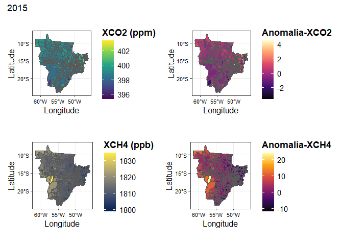<!-- -->

    #> 
    #> [[2]]

<!-- -->

    #> 
    #> [[3]]

<!-- -->

    #> 
    #> [[4]]

<!-- -->

    #> 
    #> [[5]]

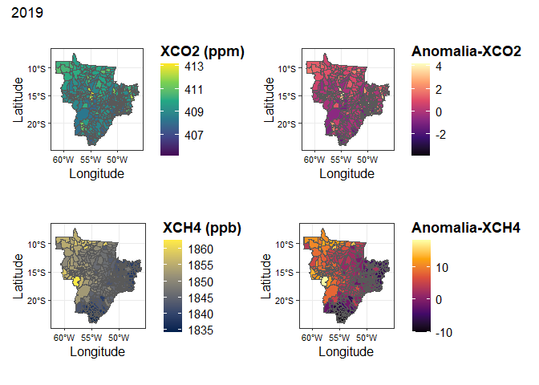<!-- -->

    #> 
    #> [[6]]

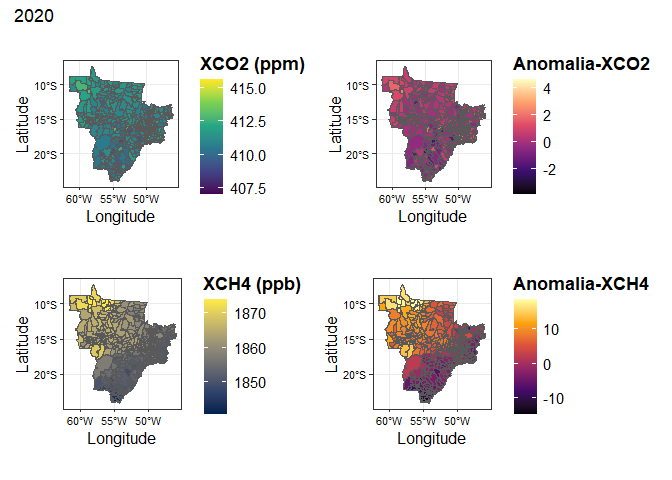<!-- -->

    #> 
    #> [[7]]

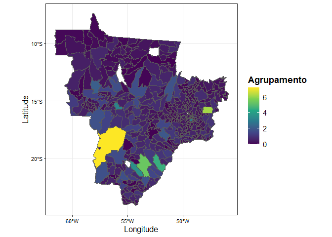<!-- -->

    #> 
    #> [[8]]

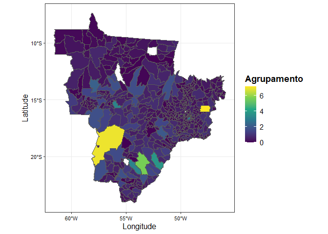<!-- -->

    #> 
    #> [[9]]

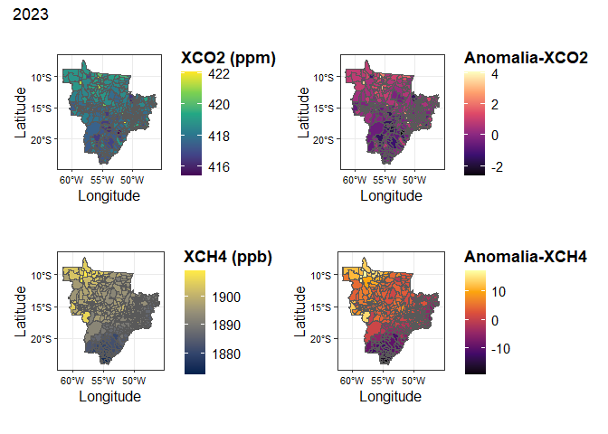<!-- -->

#### 🗺️ Mapa de EMISSÃO TOTAL - setores - Criando classe de emissão

``` r
map(2015:2023,~{municipality |> 
    mutate(
      name_muni = stri_trans_general(tolower(name_muni), "Latin-ASCII"),
      name_muni = trimws(name_muni)
    )  |> 
    filter(abbrev_state %in% my_states) |> 
    left_join(
      data.frame(
      base_completa_set |> 
        #remover edificacoes por estar presente só na nova base
        select(-edificacoes) |>
        mutate(florestas_e_uso_da_terra = florestas_e_uso_da_terra>0) |> 
        filter(year == .x,
               !(city_ref %in% remov_out)) |> 
        pivot_longer(
          cols = florestas_e_uso_da_terra:extracao_mineral, #remove edificacoes porque só tem na base 2021 a 2023 
          names_to = "setor",
          values_to = "emission"
        ) |> 
        group_by(year, state, city_ref) |> 
        summarise(
          emission = sum(emission, na.rm = TRUE)
        ) |> 
        select(state:emission) |> 
        rename(name_muni = city_ref)
       ),by = "name_muni", relationship = "many-to-many"
    ) |> drop_na() |>  
    mutate(
       classe_emissao = case_when(
       emission <1e6 ~ ' <  1 Mton',
       emission <2e6 ~ ' <  2 Mton',
       emission >=2e6 ~ '>= 2 Mton'
     )
    ) |> 
    ggplot() +
    geom_sf(aes(fill=classe_emissao), color="transparent",
            size=.05, show.legend = TRUE)  +
    geom_sf(data=municipality |> filter(abbrev_state %in% my_states), fill="transparent", size=3, show.legend = FALSE) +
    theme_bw() +
    labs(fill = 'Classe de emissão',
         x = 'Longitude',
         y = 'Latitude') +
    scale_fill_viridis_d()})
#> [[1]]
```

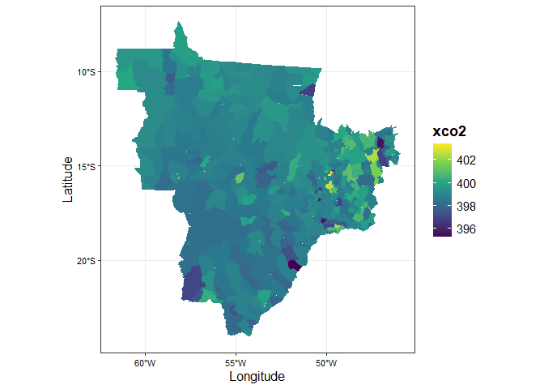<!-- -->

    #> 
    #> [[2]]

<!-- -->

    #> 
    #> [[3]]

<!-- -->

    #> 
    #> [[4]]

<!-- -->

    #> 
    #> [[5]]

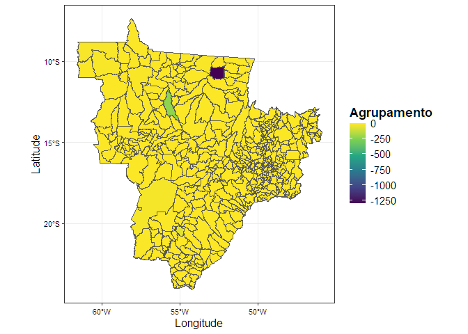<!-- -->

    #> 
    #> [[6]]

<!-- -->

    #> 
    #> [[7]]

<!-- -->

    #> 
    #> [[8]]

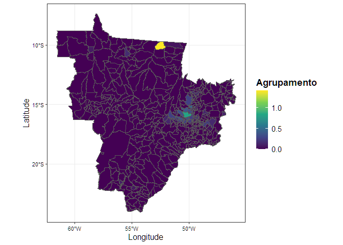<!-- -->

    #> 
    #> [[9]]

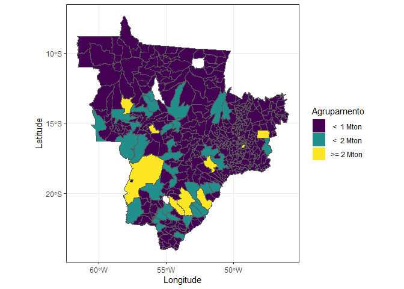<!-- --> \#### 🗺️
Mapa de EMISSÃO TOTAL - escolher setor

``` r
setor = "agricultura" #mudar
# setor = c("agricultura", "florestas_e_uso_da_terra") #escolher mais de 1 setor...

# Gerando mapa
map(2015:2025,~{municipality |> 
    mutate(
      name_muni = stri_trans_general(tolower(name_muni), "Latin-ASCII"),
      name_muni = trimws(name_muni)
    )  |> 
    filter(abbrev_state %in% my_states) |> 
    left_join(
      data.frame(
      base_completa_set |> 
        filter(year == .x,
               !(city_ref %in% remov_out)) |> 
        pivot_longer(
          cols = setor, 
          names_to = "setor",
          values_to = "emission"
        ) |> 
        group_by(year, state, city_ref) |> 
        summarise(
          emission = sum(emission, na.rm = TRUE)
        ) |> 
        select(state:emission) |> 
        rename(name_muni = city_ref)
       ),by = "name_muni", relationship = "many-to-many"
    ) |> drop_na() |>  
    mutate(
       classe_emissao = case_when(
       emission <1e6 ~ ' <  1 Mton',
       emission <2e6 ~ ' <  2 Mton',
       emission >=2e6 ~ '>= 2 Mton'
     )
    ) |> 
    ggplot() +
    geom_sf(aes(fill=classe_emissao), color="transparent",
            size=.05, show.legend = TRUE)  +
    geom_sf(data=municipality |> filter(abbrev_state %in% my_states), fill="transparent", size=3, show.legend = FALSE) +
    theme_bw() +
    labs(fill = 'Agrupamento',
         x = 'Longitude',
         y = 'Latitude') +
    scale_fill_viridis_d()})
#> [[1]]
```

<!-- -->

    #> 
    #> [[2]]

<!-- -->

    #> 
    #> [[3]]

<!-- -->

    #> 
    #> [[4]]

<!-- -->

    #> 
    #> [[5]]

<!-- -->

    #> 
    #> [[6]]

<!-- -->

    #> 
    #> [[7]]

<!-- -->

    #> 
    #> [[8]]

<!-- -->

    #> 
    #> [[9]]

<!-- -->

    #> 
    #> [[10]]

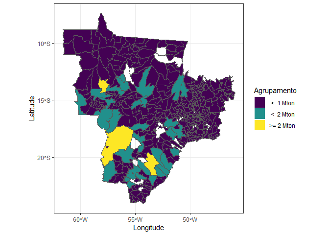<!-- -->

    #> 
    #> [[11]]

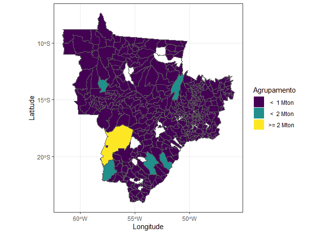<!-- -->

## 🗺️ Mapa de EMISSÃO TOTAL - subsetores

Aparentemente, muitos subsetores (não consegui ver quais são todos)
estão com suas metodologias alteradas. e isso esta gerando divergência
entre os mapas

``` r
map(2015:2023,~{municipality |> 
    mutate(
      name_muni = stri_trans_general(tolower(name_muni), "Latin-ASCII"),
      name_muni = trimws(name_muni)
    )  |> 
    filter(abbrev_state %in% my_states) |> 
    left_join(
      data.frame(
      base_completa_subset |> 
        # mutate(
          # Valores não positivos para essas colunas de remoção recebem 0
            # Isso pois alguns subsetores contém remoções e emissões juntas
  #   uso_liquido_de_terras_florestais = ifelse(uso_liquido_de_terras_florestais > 0, uso_liquido_de_terras_florestais, 0),
  #   uso_liquido_de_areas_arbustivas_e_gramineas = ifelse(uso_liquido_de_areas_arbustivas_e_gramineas > 0, uso_liquido_de_areas_arbustivas_e_gramineas, 0),
  #   uso_liquido_de_areas_umidas = ifelse(uso_liquido_de_areas_umidas > 0, uso_liquido_de_areas_umidas, 0)
  # ) |>
    # Removendo subsetores que contém remoções
        select(-remocoes_de_carbono_sequestro,
               -uso_liquido_de_terras_florestais, -uso_liquido_de_areas_arbustivas_e_gramineas, -uso_liquido_de_areas_umidas) |>
        filter(year == .x,
               !(city_ref %in% remov_out)) |> 
        pivot_longer(
          cols = degradacao_em_terras_florestais:tratamento_e_descarte_de_efluentes_industriais,
          names_to = "subsetor",
          values_to = "emission"
        ) |> 
        group_by(year, state, city_ref) |> 
        summarise(
          emission = sum(emission, na.rm = TRUE)
        ) |> 
        select(state:emission) |> 
        rename(name_muni = city_ref)
       ),by = "name_muni", relationship = "many-to-many"
    ) |> drop_na() |>      
    ggplot() +
    geom_sf(aes(fill=emission/1e6), color="transparent",
            size=.05, show.legend = TRUE)  +
    geom_sf(data=municipality |> filter(abbrev_state %in% my_states), fill="transparent", size=3, show.legend = FALSE) +
    theme_bw() +
    theme(
      axis.text.x = element_text(size = rel(.9), color = "black"),
      axis.title.x = element_text(size = rel(1.1), color = "black"),
      axis.text.y = element_text(size = rel(.9), color = "black"),
      axis.title.y = element_text(size = rel(1.1), color = "black"),
      legend.text = element_text(size = rel(1), color = "black"),
      legend.title = element_text(face = 'bold', size = rel(1.2))
    ) +
    labs(fill = 'Agrupamento',
         x = 'Longitude',
         y = 'Latitude') +
    scale_fill_viridis_c()})
#> [[1]]
```

<!-- -->

    #> 
    #> [[2]]

<!-- -->

    #> 
    #> [[3]]

<!-- -->

    #> 
    #> [[4]]

<!-- -->

    #> 
    #> [[5]]

<!-- -->

    #> 
    #> [[6]]

<!-- -->

    #> 
    #> [[7]]

<!-- -->

    #> 
    #> [[8]]

<!-- -->

    #> 
    #> [[9]]

<!-- -->

#### 🗺️ Mapa de EMISSÃO TOTAL - subsetores - Criando classe de emissão

``` r
map(2015:2023,~{municipality |> 
    mutate(
      name_muni = stri_trans_general(tolower(name_muni), "Latin-ASCII"),
      name_muni = trimws(name_muni)
    )  |> 
    filter(abbrev_state %in% my_states) |> 
    left_join(
      data.frame(
      base_completa_subset |> 
        mutate(
          # Valores não positivos para essas colunas de remoção recebem 0
            # Isso pois alguns subsetores contém remoções e emissões juntas
    uso_liquido_de_terras_florestais = ifelse(uso_liquido_de_terras_florestais > 0, uso_liquido_de_terras_florestais, 0),
    uso_liquido_de_areas_arbustivas_e_gramineas = ifelse(uso_liquido_de_areas_arbustivas_e_gramineas > 0, uso_liquido_de_areas_arbustivas_e_gramineas, 0),
    uso_liquido_de_areas_umidas = ifelse(uso_liquido_de_areas_umidas > 0, uso_liquido_de_areas_umidas, 0)
  ) |>
    # Removendo subsetores que contém remoções
        # select(-remocoes_de_carbono_sequestro,
        #        -uso_liquido_de_terras_florestais, -uso_liquido_de_areas_arbustivas_e_gramineas, -uso_liquido_de_areas_umidas) |>
        filter(year == .x,
               !(city_ref %in% remov_out)) |> 
        pivot_longer(
          cols = degradacao_em_terras_florestais:tratamento_e_descarte_de_efluentes_industriais,
          names_to = "setor",
          values_to = "emission"
        ) |> 
        group_by(year, state, city_ref) |> 
        summarise(
          emission = sum(emission, na.rm = TRUE)
        ) |> 
        select(state:emission) |> 
        rename(name_muni = city_ref)
       ),by = "name_muni", relationship = "many-to-many"
    ) |> drop_na() |>  
    mutate(
       classe_emissao = case_when(
       emission <1e6 ~ ' <  1 Mton',
       emission <2e6 ~ ' <  2 Mton',
       emission >=2e6 ~ '>= 2 Mton'
     )
    ) |> 
    ggplot() +
    geom_sf(aes(fill=classe_emissao), color="transparent",
            size=.05, show.legend = TRUE)  +
    geom_sf(data=municipality |> filter(abbrev_state %in% my_states), fill="transparent", size=3, show.legend = FALSE) +
    theme_bw() +
    labs(fill = 'Classe de emissão',
         x = 'Longitude',
         y = 'Latitude') +
    scale_fill_viridis_d()})
#> [[1]]
```

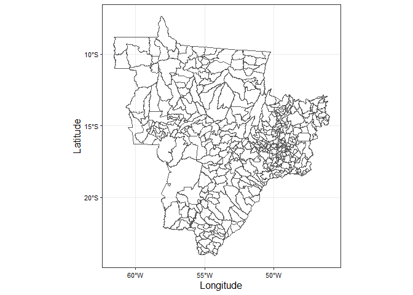<!-- -->

    #> 
    #> [[2]]

<!-- -->

    #> 
    #> [[3]]

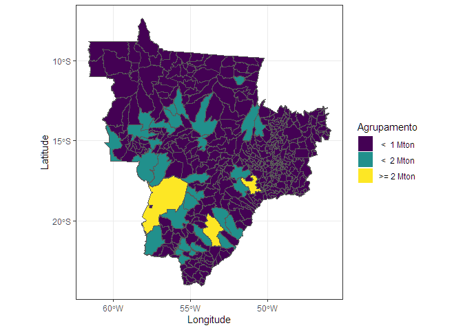<!-- -->

    #> 
    #> [[4]]

<!-- -->

    #> 
    #> [[5]]

<!-- -->

    #> 
    #> [[6]]

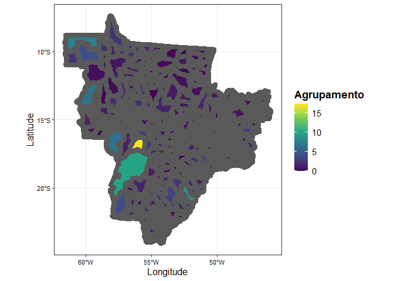<!-- -->

    #> 
    #> [[7]]

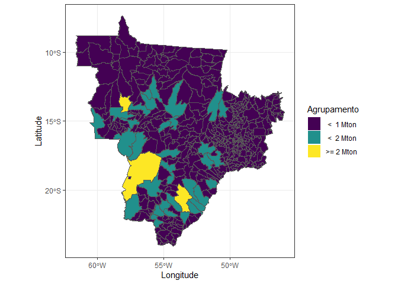<!-- -->

    #> 
    #> [[8]]

<!-- -->

    #> 
    #> [[9]]

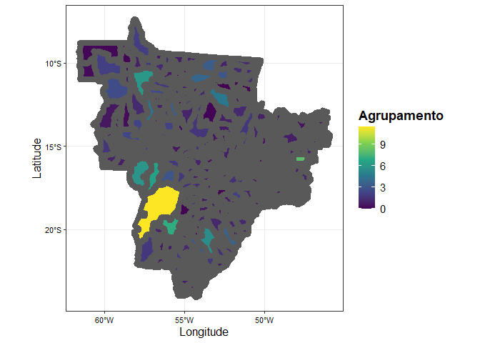<!-- -->

## 🗺️ SETOR/SUBSETOR DE MAIOR EMISSÃO DA CIDADE

``` r
# Unindo as bases climate TRACE
  # Feito caso queira visualizar os setores e subsetores de maior emissão em um mesmo mapa
# base_completa_ct <- base_completa_set |> 
#   select(year:city_ref, florestas_e_uso_da_terra:edificacoes) |> 
#   full_join(base_completa_subset |> 
#               select(year:city_ref, degradacao_em_terras_florestais:tratamento_e_descarte_de_efluentes_industriais),
#             by = c("year", "city_ref", "state"))

map(2015:2023,~{municipality |> 
    mutate(
      name_muni = stri_trans_general(tolower(name_muni), "Latin-ASCII"),
      name_muni = trimws(name_muni)
    )  |> 
    filter(abbrev_state %in% my_states) |> 
    left_join(
      data.frame(
        base_completa_set |> # substituir por "base_completa_ct", caso queira visualizar ambos ao mesmo tempo, e ajustar linhas abaixo (select, cols e names_to)
          # Removendo setores que contém remoções
            # Ressalta-se que "florestas_e_uso_da_terra" contém emissões relevantes, por isso deve-se fazer um mutate e selecioanr valores positivos
          mutate(
          ifelse(florestas_e_uso_da_terra >0, florestas_e_uso_da_terra, 0)
          ) |> 
          # Removendo subsetores que contém remoções
          # select(-remocoes_de_carbono_sequestro,
          #        -uso_liquido_de_terras_florestais, -uso_liquido_de_areas_arbustivas_e_gramineas, -uso_liquido_de_areas_umidas) |>
          filter(year == .x) |> 
          pivot_longer(
            cols = agricultura:extracao_mineral,
            names_to = "setores",
            values_to = "emission"
          ) |> 
          group_by(year, state, city_ref) |> 
          mutate(
            max_emission = max(emission,na.rm = TRUE),
            s_max_emission = ifelse(emission == max_emission,setores,NA)
          ) |> 
          filter(!is.na(s_max_emission)) |> 
          select(state:s_max_emission) |> 
          rename(name_muni = city_ref)
      ),by = "name_muni", relationship = "many-to-many"
    ) |> drop_na() |>
    ggplot() +
    geom_sf(aes(fill=s_max_emission), color="transparent",
            size=.05, show.legend = TRUE)  +
    geom_sf(data=municipality |> filter(abbrev_state %in% my_states), fill="transparent", size=3, show.legend = FALSE) +
    theme_bw() +
    theme(
      axis.text.x = element_text(size = rel(.9), color = "black"),
      axis.title.x = element_text(size = rel(1.1), color = "black"),
      axis.text.y = element_text(size = rel(.9), color = "black"),
      axis.title.y = element_text(size = rel(1.1), color = "black"),
      legend.text = element_text(size = rel(1), color = "black"),
      legend.title = element_text(face = 'bold', size = rel(1.2))
    ) +
    labs(fill = 'Agrupamento',
         x = 'Longitude',
         y = 'Latitude') +
    scale_fill_viridis_d()})
#> [[1]]
```

<!-- -->

    #> 
    #> [[2]]

<!-- -->

    #> 
    #> [[3]]

<!-- -->

    #> 
    #> [[4]]

<!-- -->

    #> 
    #> [[5]]

<!-- -->

    #> 
    #> [[6]]

<!-- -->

    #> 
    #> [[7]]

<!-- -->

    #> 
    #> [[8]]

<!-- -->

    #> 
    #> [[9]]

<!-- -->

## 🗺 Mapa de REMOÇÃO

Vale ressaltar que a nova metodologia do climate TRACE subdivide o
subsetor de *remocoes_de_carbono_sequestro* (as remoções) em 3 novos
subsetores:

*uso_liquido_de_terras_florestais*
*uso_liquido_de_areas_arbustivas_e_gramineas*
*uso_liquido_de_areas_umidas*

``` r
# Primeiramente, é necessário passar os valores da coluna "remocoes_de_carbono_sequestro" da nova base do climate TRACE para negativos, para tornar a análise visual entre os mapas iguais:
  # 2 formas:
  # 1.
    # base_completa_subset |> 
    #   mutate(remocoes_de_carbono_sequestro = case_when(
    #     remocoes_de_carbono_sequestro < 0 ~ remocoes_de_carbono_sequestro*-1))
  # 2. Maior garantia, pois torna todos os valores absolutos positivos
      base_completa_subset |>
        mutate(remocoes_de_carbono_sequestro = -abs(remocoes_de_carbono_sequestro)) |>  select(year,city_ref,remocoes_de_carbono_sequestro,uso_liquido_de_terras_florestais,uso_liquido_de_areas_arbustivas_e_gramineas,uso_liquido_de_areas_umidas)
#>      year                                              city_ref
#> 1    2015                                              brasilia
#> 2    2015                                       abadia de goias
#> 3    2015                                             abadiania
#> 4    2015                                               acreuna
#> 5    2015                                              alexania
#> 6    2015                                              aloandia
#> 7    2015                                        alto horizonte
#> 8    2015                                 alto paraiso de goias
#> 9    2015                                     alvorada do norte
#> 10   2015                                             amaralina
#> 11   2015                                   americano do brasil
#> 12   2015                                          amorinopolis
#> 13   2015                                               anicuns
#> 14   2015                                              anapolis
#> 15   2015                                  aparecida de goiania
#> 16   2015                                                 apore
#> 17   2015                                             aragarcas
#> 18   2015                                            aragoiania
#> 19   2015                                             araguapaz
#> 20   2015                                               arapora
#> 21   2015                                                 aracu
#> 22   2015                                            arenopolis
#> 23   2015                                                aruana
#> 24   2015                                            aurilandia
#> 25   2015                                                baliza
#> 26   2015                                            barro alto
#> 27   2015                                   bela vista de goias
#> 28   2015                                   bom jardim de goias
#> 29   2015                                    bom jesus de goias
#> 30   2015                                          bonfinopolis
#> 31   2015                                             bonopolis
#> 32   2015                                          brazabrantes
#> 33   2015                                              britania
#> 34   2015                                         buriti alegre
#> 35   2015                                         buritinopolis
#> 36   2015                                            cabeceiras
#> 37   2015                                        cachoeira alta
#> 38   2015                                    cachoeira de goias
#> 39   2015                                     cachoeira dourada
#> 40   2015                                             caiaponia
#> 41   2015                                          caldas novas
#> 42   2015                                            caldazinha
#> 43   2015                                    campestre de goias
#> 44   2015                                             campinacu
#> 45   2015                                            campinorte
#> 46   2015                                 campo alegre de goias
#> 47   2015                                  campo limpo de goias
#> 48   2015                                          campos belos
#> 49   2015                                         campos verdes
#> 50   2015                                    carmo do rio verde
#> 51   2015                                           castelandia
#> 52   2015                                               catalao
#> 53   2015                                               caturai
#> 54   2015                                            cavalcante
#> 55   2015                                                  cacu
#> 56   2015                                                 ceres
#> 57   2015                                              cezarina
#> 58   2015                                       chapadao do ceu
#> 59   2015                                      cidade ocidental
#> 60   2015                                   cocalzinho de goias
#> 61   2015                                        colinas do sul
#> 62   2015                                            corumbaiba
#> 63   2015                                      corumba de goias
#> 64   2015                                            cristalina
#> 65   2015                                        cristianopolis
#> 66   2015                                                crixas
#> 67   2015                                              crominia
#> 68   2015                                       corrego do ouro
#> 69   2015                                          damianopolis
#> 70   2015                                            damolandia
#> 71   2015                                           davinopolis
#> 72   2015                                               diorama
#> 73   2015                                  divinopolis de goias
#> 74   2015                                           doverlandia
#> 75   2015                                              edealina
#> 76   2015                                                 edeia
#> 77   2015                                                 faina
#> 78   2015                                          fazenda nova
#> 79   2015                                          firminopolis
#> 80   2015                                       flores de goias
#> 81   2015                                               formosa
#> 82   2015                                               formoso
#> 83   2015                                    gameleira de goias
#> 84   2015                                             goiandira
#> 85   2015                                              goianira
#> 86   2015                                           goianapolis
#> 87   2015                                             goianesia
#> 88   2015                                              goiatuba
#> 89   2015                                                 goias
#> 90   2015                                               goiania
#> 91   2015                                           gouvelandia
#> 92   2015                                                 guapo
#> 93   2015                                      guarani de goias
#> 94   2015                                              guaraita
#> 95   2015                                              guarinos
#> 96   2015                                              heitorai
#> 97   2015                                             hidrolina
#> 98   2015                                           hidrolandia
#> 99   2015                                               iaciara
#> 100  2015                                          inaciolandia
#> 101  2015                                               indiara
#> 102  2015                                               inhumas
#> 103  2015                                               ipameri
#> 104  2015                                     ipiranga de goias
#> 105  2015                                                 ipora
#> 106  2015                                           israelandia
#> 107  2015                                              itaberai
#> 108  2015                                              itaguari
#> 109  2015                                              itaguaru
#> 110  2015                                                 itaja
#> 111  2015                                               itapaci
#> 112  2015                                            itapirapua
#> 113  2015                                            itapuranga
#> 114  2015                                               itaruma
#> 115  2015                                                itaucu
#> 116  2015                                             itumbiara
#> 117  2015                                             ivolandia
#> 118  2015                                               jandaia
#> 119  2015                                               jaragua
#> 120  2015                                                 jatai
#> 121  2015                                               jaupaci
#> 122  2015                                             jesupolis
#> 123  2015                                              joviania
#> 124  2015                                               jussara
#> 125  2015                                           lagoa santa
#> 126  2015                                   leopoldo de bulhoes
#> 127  2015                                              luziania
#> 128  2015                                           mairipotaba
#> 129  2015                                                mambai
#> 130  2015                                             mara rosa
#> 131  2015                                              marzagao
#> 132  2015                                             matrincha
#> 133  2015                                           maurilandia
#> 134  2015                                       mimoso de goias
#> 135  2015                                                minacu
#> 136  2015                                              mineiros
#> 137  2015                                               moipora
#> 138  2015                                 monte alegre de goias
#> 139  2015                                montes claros de goias
#> 140  2015                                            montividiu
#> 141  2015                                   montividiu do norte
#> 142  2015                                             morrinhos
#> 143  2015                                  morro agudo de goias
#> 144  2015                                            mossamedes
#> 145  2015                                           mozarlandia
#> 146  2015                                            mundo novo
#> 147  2015                                           mutunopolis
#> 148  2015                                               nazario
#> 149  2015                                             neropolis
#> 150  2015                                           niquelandia
#> 151  2015                                          nova america
#> 152  2015                                           nova crixas
#> 153  2015                                           nova gloria
#> 154  2015                                  nova iguacu de goias
#> 155  2015                                             nova roma
#> 156  2015                                           nova veneza
#> 157  2015                                           novo brasil
#> 158  2015                                             novo gama
#> 159  2015                                         novo planalto
#> 160  2015                                               orizona
#> 161  2015                                                 other
#> 162  2015                                   ouro verde de goias
#> 163  2015                                               ouvidor
#> 164  2015                                        padre bernardo
#> 165  2015                                    palestina de goias
#> 166  2015                                    palmeiras de goias
#> 167  2015                                               palmelo
#> 168  2015                                                panama
#> 169  2015                                          paranaiguara
#> 170  2015                                                parana
#> 171  2015                                               parauna
#> 172  2015                                            perolandia
#> 173  2015                                    petrolina de goias
#> 174  2015                                        pilar de goias
#> 175  2015                                           piracanjuba
#> 176  2015                                              piranhas
#> 177  2015                                           pirenopolis
#> 178  2015                                            planaltina
#> 179  2015                                             pontalina
#> 180  2015                                             porangatu
#> 181  2015                                             porteirao
#> 182  2015                                           portelandia
#> 183  2015                                                 posse
#> 184  2015                                       professor jamil
#> 185  2015                                          quirinopolis
#> 186  2015                                                rialma
#> 187  2015                                            rianapolis
#> 188  2015                                            rio quente
#> 189  2015                                             rio verde
#> 190  2015                                             rubiataba
#> 191  2015                                         sanclerlandia
#> 192  2015                                santa barbara de goias
#> 193  2015                                   santa cruz de goias
#> 194  2015                                     santa fe de goias
#> 195  2015                                 santa helena de goias
#> 196  2015                                          santa isabel
#> 197  2015                            santa rita do novo destino
#> 198  2015                                   santa rosa de goias
#> 199  2015                                 santa tereza de goias
#> 200  2015                              santa terezinha de goias
#> 201  2015                                santo antonio da barra
#> 202  2015                                santo antonio de goias
#> 203  2015                           santo antonio do descoberto
#> 204  2015                                        senador canedo
#> 205  2015                                          serranopolis
#> 206  2015                                              silvania
#> 207  2015                                            simolandia
#> 208  2015                                          sao domingos
#> 209  2015                                sao francisco de goias
#> 210  2015                                    sao joao d'alianca
#> 211  2015                                   sao joao da parauna
#> 212  2015                              sao luis de montes belos
#> 213  2015                                     sao luiz do norte
#> 214  2015                                sao miguel do araguaia
#> 215  2015                            sao miguel do passa quatro
#> 216  2015                                          sao patricio
#> 217  2015                                             sao simao
#> 218  2015                                        sitio d'abadia
#> 219  2015                                     taquaral de goias
#> 220  2015                                     teresina de goias
#> 221  2015                                  terezopolis de goias
#> 222  2015                                              trindade
#> 223  2015                                               trombas
#> 224  2015                                          tres ranchos
#> 225  2015                                           turvelandia
#> 226  2015                                              turvania
#> 227  2015                                              uirapuru
#> 228  2015                                                uruana
#> 229  2015                                                uruacu
#> 230  2015                                                urutai
#> 231  2015                                   valparaiso de goias
#> 232  2015                                                varjao
#> 233  2015                                            vianopolis
#> 234  2015                                        vicentinopolis
#> 235  2015                                              vila boa
#> 236  2015                                         vila propicio
#> 237  2015                                    agua fria de goias
#> 238  2015                                            agua limpa
#> 239  2015                                 aguas lindas de goias
#> 240  2015                                           alcinopolis
#> 241  2015                                               amambai
#> 242  2015                                             anastacio
#> 243  2015                                          anaurilandia
#> 244  2015                                              angelica
#> 245  2015                                          antonio joao
#> 246  2015                                  aparecida do taboado
#> 247  2015                                            aquidauana
#> 248  2015                                          aral moreira
#> 249  2015                                          bandeirantes
#> 250  2015                                            bataguassu
#> 251  2015                                             bataypora
#> 252  2015                                            bela vista
#> 253  2015                                             bodoquena
#> 254  2015                                                bonito
#> 255  2015                                           brasilandia
#> 256  2015                                               caarapo
#> 257  2015                                               camapua
#> 258  2015                                          campo grande
#> 259  2015                                               caracol
#> 260  2015                                           cassilandia
#> 261  2015                                       chapadao do sul
#> 262  2015                                             corguinho
#> 263  2015                                      coronel sapucaia
#> 264  2015                                               corumba
#> 265  2015                                            costa rica
#> 266  2015                                                 coxim
#> 267  2015                                            deodapolis
#> 268  2015                                 dois irmaos do buriti
#> 269  2015                                             douradina
#> 270  2015                                              dourados
#> 271  2015                                             figueirao
#> 272  2015                                         fatima do sul
#> 273  2015                                    gloria de dourados
#> 274  2015                                  guia lopes da laguna
#> 275  2015                                              iguatemi
#> 276  2015                                             inocencia
#> 277  2015                                               itapora
#> 278  2015                                             itaquirai
#> 279  2015                                              ivinhema
#> 280  2015                                             jaraguari
#> 281  2015                                                jardim
#> 282  2015                                                 jatei
#> 283  2015                                                  juti
#> 284  2015                                               ladario
#> 285  2015                                         laguna carapa
#> 286  2015                                              maracaju
#> 287  2015                                               miranda
#> 288  2015                                            mundo novo
#> 289  2015                                               navirai
#> 290  2015                                               nioaque
#> 291  2015                                  nova alvorada do sul
#> 292  2015                                        nova andradina
#> 293  2015                                 novo horizonte do sul
#> 294  2015                                             paranaiba
#> 295  2015                                              paranhos
#> 296  2015                                           pedro gomes
#> 297  2015                                            ponta pora
#> 298  2015                                        porto murtinho
#> 299  2015                                    ribas do rio pardo
#> 300  2015                                         rio brilhante
#> 301  2015                                             rio negro
#> 302  2015                              rio verde de mato grosso
#> 303  2015                                               rochedo
#> 304  2015                                   santa rita do pardo
#> 305  2015                                              selviria
#> 306  2015                                           sete quedas
#> 307  2015                                           sidrolandia
#> 308  2015                                                sonora
#> 309  2015                                  sao gabriel do oeste
#> 310  2015                                                tacuru
#> 311  2015                                            taquarussu
#> 312  2015                                               terenos
#> 313  2015                                           tres lagoas
#> 314  2015                                            agua clara
#> 315  2015                                              acorizal
#> 316  2015                                         alta floresta
#> 317  2015                                         alto araguaia
#> 318  2015                                        alto boa vista
#> 319  2015                                           alto garcas
#> 320  2015                                         alto paraguai
#> 321  2015                                          alto taquari
#> 322  2015                                               apiacas
#> 323  2015                                                  apui
#> 324  2015                                            araguaiana
#> 325  2015                                            araputanga
#> 326  2015                                            arenapolis
#> 327  2015                                              aripuana
#> 328  2015                                                aruana
#> 329  2015                                       barra do bugres
#> 330  2015                                       barra do garcas
#> 331  2015                                      barao de melgaco
#> 332  2015                                 bom jesus do araguaia
#> 333  2015                                             brasnorte
#> 334  2015                                          campinapolis
#> 335  2015                                 campo novo do parecis
#> 336  2015                                           campo verde
#> 337  2015                                       campos de julio
#> 338  2015                                    canabrava do norte
#> 339  2015                                              canarana
#> 340  2015                                              carlinda
#> 341  2015                                           castanheira
#> 342  2015                                 chapada dos guimaraes
#> 343  2015                                               claudia
#> 344  2015                                             cocalinho
#> 345  2015                                               colniza
#> 346  2015                                               colider
#> 347  2015                                              comodoro
#> 348  2015                                              confresa
#> 349  2015                                     conquista d'oeste
#> 350  2015                                            cotriguacu
#> 351  2015                                                cuiaba
#> 352  2015                                           curvelandia
#> 353  2015                                               caceres
#> 354  2015                                                denise
#> 355  2015                                            diamantino
#> 356  2015                                            dom aquino
#> 357  2015                                           feliz natal
#> 358  2015                                 figueiropolis d'oeste
#> 359  2015                                       gaucha do norte
#> 360  2015                                      general carneiro
#> 361  2015                                        gloria d'oeste
#> 362  2015                                     guaranta do norte
#> 363  2015                                            guiratinga
#> 364  2015                                              indiavai
#> 365  2015                                     ipiranga do norte
#> 366  2015                                             itanhanga
#> 367  2015                                                itauba
#> 368  2015                                              itiquira
#> 369  2015                                               jaciara
#> 370  2015                                                 jauru
#> 371  2015                                                 juara
#> 372  2015                                               juruena
#> 373  2015                                            juscimeira
#> 374  2015                                                 juina
#> 375  2015                                       lambari d'oeste
#> 376  2015                                    lucas do rio verde
#> 377  2015                                               luciara
#> 378  2015                                    machadinho d'oeste
#> 379  2015                                           marcelandia
#> 380  2015                                                matupa
#> 381  2015                                                nobres
#> 382  2015                           nossa senhora do livramento
#> 383  2015                                     nova bandeirantes
#> 384  2015                                      nova brasilandia
#> 385  2015                                   nova canaa do norte
#> 386  2015                                          nova guarita
#> 387  2015                                          nova lacerda
#> 388  2015                                       nova marilandia
#> 389  2015                                          nova maringa
#> 390  2015                                      nova monte verde
#> 391  2015                                            nova mutum
#> 392  2015                                           nova nazare
#> 393  2015                                          nova olimpia
#> 394  2015                                     nova santa helena
#> 395  2015                                          nova ubirata
#> 396  2015                                        nova xavantina
#> 397  2015                                         novo aripuana
#> 398  2015                               novo horizonte do norte
#> 399  2015                                            novo mundo
#> 400  2015                                    novo santo antonio
#> 401  2015                                      novo sao joaquim
#> 402  2015                                                 other
#> 403  2015                                           paranatinga
#> 404  2015                                             paranaita
#> 405  2015                                           pedra preta
#> 406  2015                                    peixoto de azevedo
#> 407  2015                                     planalto da serra
#> 408  2015                                                pocone
#> 409  2015                                    pontal do araguaia
#> 410  2015                                          ponte branca
#> 411  2015                                      pontes e lacerda
#> 412  2015                                 porto alegre do norte
#> 413  2015                                     porto dos gauchos
#> 414  2015                                      porto esperidiao
#> 415  2015                                         porto estrela
#> 416  2015                                               poxoreo
#> 417  2015                                    primavera do leste
#> 418  2015                                             querencia
#> 419  2015                                    reserva do cabacal
#> 420  2015                                  ribeirao cascalheira
#> 421  2015                                         ribeiraozinho
#> 422  2015                                           rondolandia
#> 423  2015                                          rondonopolis
#> 424  2015                                         rosario oeste
#> 425  2015                                          salto do ceu
#> 426  2015                                          santa carmem
#> 427  2015                                   santa cruz do xingu
#> 428  2015                               santa rita do trivelato
#> 429  2015                                       santa terezinha
#> 430  2015                                          santo afonso
#> 431  2015                                santo antonio do leste
#> 432  2015                             santo antonio do leverger
#> 433  2015                                               sapezal
#> 434  2015                                    serra nova dourada
#> 435  2015                                                 sinop
#> 436  2015                                               sorriso
#> 437  2015                                 sao felix do araguaia
#> 438  2015                                      sao jose do povo
#> 439  2015                                 sao jose do rio claro
#> 440  2015                                     sao jose do xingu
#> 441  2015                            sao jose dos quatro marcos
#> 442  2015                                     sao pedro da cipa
#> 443  2015                                              tabapora
#> 444  2015                                      tangara da serra
#> 445  2015                                               tapurah
#> 446  2015                                   terra nova do norte
#> 447  2015                                               tesouro
#> 448  2015                                             torixoreu
#> 449  2015                                          uniao do sul
#> 450  2015                                  vale de sao domingos
#> 451  2015                                                  vera
#> 452  2015                      vila bela da santissima trindade
#> 453  2015                                             vila rica
#> 454  2015                                         varzea grande
#> 455  2015                                              agua boa
#> 456  2016                                              brasilia
#> 457  2016                                       abadia de goias
#> 458  2016                                             abadiania
#> 459  2016                                               acreuna
#> 460  2016                                              alexania
#> 461  2016                                              aloandia
#> 462  2016                                        alto horizonte
#> 463  2016                                 alto paraiso de goias
#> 464  2016                                     alvorada do norte
#> 465  2016                                             amaralina
#> 466  2016                                   americano do brasil
#> 467  2016                                          amorinopolis
#> 468  2016                                               anicuns
#> 469  2016                                              anapolis
#> 470  2016                                  aparecida de goiania
#> 471  2016                                                 apore
#> 472  2016                                             aragarcas
#> 473  2016                                            aragoiania
#> 474  2016                                             araguapaz
#> 475  2016                                            arenopolis
#> 476  2016                                                aruana
#> 477  2016                                            aurilandia
#> 478  2016                                          avelinopolis
#> 479  2016                                                baliza
#> 480  2016                                            barro alto
#> 481  2016                                   bela vista de goias
#> 482  2016                                   bom jardim de goias
#> 483  2016                                    bom jesus de goias
#> 484  2016                                          bonfinopolis
#> 485  2016                                             bonopolis
#> 486  2016                                          brazabrantes
#> 487  2016                                              britania
#> 488  2016                                         buriti alegre
#> 489  2016                                         buritinopolis
#> 490  2016                                            cabeceiras
#> 491  2016                                        cachoeira alta
#> 492  2016                                    cachoeira de goias
#> 493  2016                                     cachoeira dourada
#> 494  2016                                             caiaponia
#> 495  2016                                          caldas novas
#> 496  2016                                            caldazinha
#> 497  2016                                    campestre de goias
#> 498  2016                                             campinacu
#> 499  2016                                            campinorte
#> 500  2016                                 campo alegre de goias
#> 501  2016                                  campo limpo de goias
#> 502  2016                                          campos belos
#> 503  2016                                         campos verdes
#> 504  2016                                    carmo do rio verde
#> 505  2016                                           castelandia
#> 506  2016                                               catalao
#> 507  2016                                               caturai
#> 508  2016                                            cavalcante
#> 509  2016                                                  cacu
#> 510  2016                                                 ceres
#> 511  2016                                              cezarina
#> 512  2016                                       chapadao do ceu
#> 513  2016                                      cidade ocidental
#> 514  2016                                   cocalzinho de goias
#> 515  2016                                        colinas do sul
#> 516  2016                                            corumbaiba
#> 517  2016                                      corumba de goias
#> 518  2016                                            cristalina
#> 519  2016                                        cristianopolis
#> 520  2016                                                crixas
#> 521  2016                                              crominia
#> 522  2016                                       corrego do ouro
#> 523  2016                                          damianopolis
#> 524  2016                                            damolandia
#> 525  2016                                           davinopolis
#> 526  2016                                               diorama
#> 527  2016                                  divinopolis de goias
#> 528  2016                                           doverlandia
#> 529  2016                                              edealina
#> 530  2016                                                 edeia
#> 531  2016                                                 faina
#> 532  2016                                          fazenda nova
#> 533  2016                                          firminopolis
#> 534  2016                                       flores de goias
#> 535  2016                                               formosa
#> 536  2016                                               formoso
#> 537  2016                                    gameleira de goias
#> 538  2016                                             goiandira
#> 539  2016                                              goianira
#> 540  2016                                           goianapolis
#> 541  2016                                             goianesia
#> 542  2016                                              goiatuba
#> 543  2016                                                 goias
#> 544  2016                                               goiania
#> 545  2016                                           gouvelandia
#> 546  2016                                                 guapo
#> 547  2016                                      guarani de goias
#> 548  2016                                              guaraita
#> 549  2016                                              guarinos
#> 550  2016                                              heitorai
#> 551  2016                                             hidrolina
#> 552  2016                                           hidrolandia
#> 553  2016                                               iaciara
#> 554  2016                                          inaciolandia
#> 555  2016                                               indiara
#> 556  2016                                               inhumas
#> 557  2016                                               ipameri
#> 558  2016                                     ipiranga de goias
#> 559  2016                                                 ipora
#> 560  2016                                           israelandia
#> 561  2016                                              itaberai
#> 562  2016                                              itaguari
#> 563  2016                                              itaguaru
#> 564  2016                                                 itaja
#> 565  2016                                               itapaci
#> 566  2016                                            itapirapua
#> 567  2016                                            itapuranga
#> 568  2016                                               itaruma
#> 569  2016                                                itaucu
#> 570  2016                                             itumbiara
#> 571  2016                                             ivolandia
#> 572  2016                                               jandaia
#> 573  2016                                               jaragua
#> 574  2016                                                 jatai
#> 575  2016                                               jaupaci
#> 576  2016                                             jesupolis
#> 577  2016                                              joviania
#> 578  2016                                               jussara
#> 579  2016                                           lagoa santa
#> 580  2016                                   leopoldo de bulhoes
#> 581  2016                                              luziania
#> 582  2016                                           mairipotaba
#> 583  2016                                                mambai
#> 584  2016                                             mara rosa
#> 585  2016                                              marzagao
#> 586  2016                                             matrincha
#> 587  2016                                           maurilandia
#> 588  2016                                       mimoso de goias
#> 589  2016                                                minacu
#> 590  2016                                              mineiros
#> 591  2016                                               moipora
#> 592  2016                                 monte alegre de goias
#> 593  2016                                montes claros de goias
#> 594  2016                                            montividiu
#> 595  2016                                   montividiu do norte
#> 596  2016                                             morrinhos
#> 597  2016                                  morro agudo de goias
#> 598  2016                                            mossamedes
#> 599  2016                                           mozarlandia
#> 600  2016                                            mundo novo
#> 601  2016                                           mutunopolis
#> 602  2016                                               nazario
#> 603  2016                                             neropolis
#> 604  2016                                           niquelandia
#> 605  2016                                          nova america
#> 606  2016                                           nova crixas
#> 607  2016                                           nova gloria
#> 608  2016                                  nova iguacu de goias
#> 609  2016                                             nova roma
#> 610  2016                                           nova veneza
#> 611  2016                                           novo brasil
#> 612  2016                                             novo gama
#> 613  2016                                         novo planalto
#> 614  2016                                               orizona
#> 615  2016                                                 other
#> 616  2016                                   ouro verde de goias
#> 617  2016                                        padre bernardo
#> 618  2016                                    palestina de goias
#> 619  2016                                    palmeiras de goias
#> 620  2016                                               palmelo
#> 621  2016                                                panama
#> 622  2016                                          paranaiguara
#> 623  2016                                                parana
#> 624  2016                                               parauna
#> 625  2016                                            perolandia
#> 626  2016                                    petrolina de goias
#> 627  2016                                        pilar de goias
#> 628  2016                                           piracanjuba
#> 629  2016                                              piranhas
#> 630  2016                                           pirenopolis
#> 631  2016                                            planaltina
#> 632  2016                                             pontalina
#> 633  2016                                             porangatu
#> 634  2016                                             porteirao
#> 635  2016                                           portelandia
#> 636  2016                                                 posse
#> 637  2016                                       professor jamil
#> 638  2016                                          quirinopolis
#> 639  2016                                                rialma
#> 640  2016                                            rianapolis
#> 641  2016                                            rio quente
#> 642  2016                                             rio verde
#> 643  2016                                             rubiataba
#> 644  2016                                         sanclerlandia
#> 645  2016                                santa barbara de goias
#> 646  2016                                   santa cruz de goias
#> 647  2016                                     santa fe de goias
#> 648  2016                                 santa helena de goias
#> 649  2016                                          santa isabel
#> 650  2016                            santa rita do novo destino
#> 651  2016                                   santa rosa de goias
#> 652  2016                                 santa tereza de goias
#> 653  2016                              santa terezinha de goias
#> 654  2016                                santo antonio da barra
#> 655  2016                                santo antonio de goias
#> 656  2016                           santo antonio do descoberto
#> 657  2016                                        senador canedo
#> 658  2016                                          serranopolis
#> 659  2016                                              silvania
#> 660  2016                                            simolandia
#> 661  2016                                          sao domingos
#> 662  2016                                sao francisco de goias
#> 663  2016                                    sao joao d'alianca
#> 664  2016                                   sao joao da parauna
#> 665  2016                              sao luis de montes belos
#> 666  2016                                     sao luiz do norte
#> 667  2016                                sao miguel do araguaia
#> 668  2016                            sao miguel do passa quatro
#> 669  2016                                          sao patricio
#> 670  2016                                             sao simao
#> 671  2016                                        sitio d'abadia
#> 672  2016                                     taquaral de goias
#> 673  2016                                     teresina de goias
#> 674  2016                                  terezopolis de goias
#> 675  2016                                              trindade
#> 676  2016                                               trombas
#> 677  2016                                          tres ranchos
#> 678  2016                                           turvelandia
#> 679  2016                                              turvania
#> 680  2016                                              uirapuru
#> 681  2016                                                uruana
#> 682  2016                                                uruacu
#> 683  2016                                                urutai
#> 684  2016                                   valparaiso de goias
#> 685  2016                                                varjao
#> 686  2016                                            vianopolis
#> 687  2016                                        vicentinopolis
#> 688  2016                                              vila boa
#> 689  2016                                         vila propicio
#> 690  2016                                    agua fria de goias
#> 691  2016                                            agua limpa
#> 692  2016                                           alcinopolis
#> 693  2016                                               amambai
#> 694  2016                                             anastacio
#> 695  2016                                          anaurilandia
#> 696  2016                                              angelica
#> 697  2016                                          antonio joao
#> 698  2016                                  aparecida do taboado
#> 699  2016                                            aquidauana
#> 700  2016                                          aral moreira
#> 701  2016                                          bandeirantes
#> 702  2016                                            bataguassu
#> 703  2016                                             bataypora
#> 704  2016                                            bela vista
#> 705  2016                                             bodoquena
#> 706  2016                                                bonito
#> 707  2016                                           brasilandia
#> 708  2016                                               caarapo
#> 709  2016                                               camapua
#> 710  2016                                          campo grande
#> 711  2016                                               caracol
#> 712  2016                                           cassilandia
#> 713  2016                                       chapadao do sul
#> 714  2016                                             corguinho
#> 715  2016                                      coronel sapucaia
#> 716  2016                                               corumba
#> 717  2016                                            costa rica
#> 718  2016                                                 coxim
#> 719  2016                                            deodapolis
#> 720  2016                                 dois irmaos do buriti
#> 721  2016                                             douradina
#> 722  2016                                              dourados
#> 723  2016                                              eldorado
#> 724  2016                                             figueirao
#> 725  2016                                         fatima do sul
#> 726  2016                                    gloria de dourados
#> 727  2016                                  guia lopes da laguna
#> 728  2016                                              iguatemi
#> 729  2016                                             inocencia
#> 730  2016                                               itapora
#> 731  2016                                             itaquirai
#> 732  2016                                              ivinhema
#> 733  2016                                                japora
#> 734  2016                                             jaraguari
#> 735  2016                                                jardim
#> 736  2016                                                 jatei
#> 737  2016                                                  juti
#> 738  2016                                               ladario
#> 739  2016                                         laguna carapa
#> 740  2016                                              maracaju
#> 741  2016                                               miranda
#> 742  2016                                            mundo novo
#> 743  2016                                               navirai
#> 744  2016                                               nioaque
#> 745  2016                                  nova alvorada do sul
#> 746  2016                                        nova andradina
#> 747  2016                                 novo horizonte do sul
#> 748  2016                                                 other
#> 749  2016                                             paranaiba
#> 750  2016                                              paranhos
#> 751  2016                                           pedro gomes
#> 752  2016                                            ponta pora
#> 753  2016                                        porto murtinho
#> 754  2016                                    ribas do rio pardo
#> 755  2016                                         rio brilhante
#> 756  2016                                             rio negro
#> 757  2016                              rio verde de mato grosso
#> 758  2016                                               rochedo
#> 759  2016                                   santa rita do pardo
#> 760  2016                                              selviria
#> 761  2016                                           sete quedas
#> 762  2016                                           sidrolandia
#> 763  2016                                                sonora
#> 764  2016                                  sao gabriel do oeste
#> 765  2016                                                tacuru
#> 766  2016                                            taquarussu
#> 767  2016                                               terenos
#> 768  2016                                           tres lagoas
#> 769  2016                                             vicentina
#> 770  2016                                            agua clara
#> 771  2016                                              acorizal
#> 772  2016                                         alta floresta
#> 773  2016                                              altamira
#> 774  2016                                         alto araguaia
#> 775  2016                                        alto boa vista
#> 776  2016                                           alto garcas
#> 777  2016                                         alto paraguai
#> 778  2016                                          alto taquari
#> 779  2016                                               apiacas
#> 780  2016                                                  apui
#> 781  2016                                            araguaiana
#> 782  2016                                            araputanga
#> 783  2016                                            arenapolis
#> 784  2016                                              aripuana
#> 785  2016                                       barra do bugres
#> 786  2016                                       barra do garcas
#> 787  2016                                      barao de melgaco
#> 788  2016                                 bom jesus do araguaia
#> 789  2016                                             brasnorte
#> 790  2016                                          campinapolis
#> 791  2016                                 campo novo do parecis
#> 792  2016                                           campo verde
#> 793  2016                                       campos de julio
#> 794  2016                                    canabrava do norte
#> 795  2016                                              canarana
#> 796  2016                                              carlinda
#> 797  2016                                           castanheira
#> 798  2016                                 chapada dos guimaraes
#> 799  2016                                               claudia
#> 800  2016                                             cocalinho
#> 801  2016                                               colniza
#> 802  2016                                               colider
#> 803  2016                                              comodoro
#> 804  2016                                              confresa
#> 805  2016                                     conquista d'oeste
#> 806  2016                                            cotriguacu
#> 807  2016                                                cuiaba
#> 808  2016                                           curvelandia
#> 809  2016                                               caceres
#> 810  2016                                                denise
#> 811  2016                                            diamantino
#> 812  2016                                            dom aquino
#> 813  2016                                           feliz natal
#> 814  2016                                 figueiropolis d'oeste
#> 815  2016                                       gaucha do norte
#> 816  2016                                      general carneiro
#> 817  2016                                        gloria d'oeste
#> 818  2016                                     guaranta do norte
#> 819  2016                                            guiratinga
#> 820  2016                                              indiavai
#> 821  2016                                     ipiranga do norte
#> 822  2016                                             itanhanga
#> 823  2016                                                itauba
#> 824  2016                                              itiquira
#> 825  2016                                          jacareacanga
#> 826  2016                                               jaciara
#> 827  2016                                                 jauru
#> 828  2016                                                 juara
#> 829  2016                                               juruena
#> 830  2016                                            juscimeira
#> 831  2016                                                 juina
#> 832  2016                                       lambari d'oeste
#> 833  2016                                    lucas do rio verde
#> 834  2016                                               luciara
#> 835  2016                                           marcelandia
#> 836  2016                                                matupa
#> 837  2016                                      mirassol d'oeste
#> 838  2016                                                nobres
#> 839  2016                           nossa senhora do livramento
#> 840  2016                                     nova bandeirantes
#> 841  2016                                      nova brasilandia
#> 842  2016                                   nova canaa do norte
#> 843  2016                                          nova guarita
#> 844  2016                                          nova lacerda
#> 845  2016                                       nova marilandia
#> 846  2016                                          nova maringa
#> 847  2016                                      nova monte verde
#> 848  2016                                            nova mutum
#> 849  2016                                           nova nazare
#> 850  2016                                          nova olimpia
#> 851  2016                                     nova santa helena
#> 852  2016                                          nova ubirata
#> 853  2016                                        nova xavantina
#> 854  2016                                         novo aripuana
#> 855  2016                               novo horizonte do norte
#> 856  2016                                            novo mundo
#> 857  2016                                    novo santo antonio
#> 858  2016                                      novo sao joaquim
#> 859  2016                                                 other
#> 860  2016                                           paranatinga
#> 861  2016                                             paranaita
#> 862  2016                                           pedra preta
#> 863  2016                                    peixoto de azevedo
#> 864  2016                                     planalto da serra
#> 865  2016                                                pocone
#> 866  2016                                    pontal do araguaia
#> 867  2016                                          ponte branca
#> 868  2016                                      pontes e lacerda
#> 869  2016                                 porto alegre do norte
#> 870  2016                                     porto dos gauchos
#> 871  2016                                      porto esperidiao
#> 872  2016                                         porto estrela
#> 873  2016                                               poxoreo
#> 874  2016                                    primavera do leste
#> 875  2016                                             querencia
#> 876  2016                                    reserva do cabacal
#> 877  2016                                  ribeirao cascalheira
#> 878  2016                                         ribeiraozinho
#> 879  2016                                           rondolandia
#> 880  2016                                          rondonopolis
#> 881  2016                                         rosario oeste
#> 882  2016                                          salto do ceu
#> 883  2016                                          santa carmem
#> 884  2016                                   santa cruz do xingu
#> 885  2016                               santa rita do trivelato
#> 886  2016                                       santa terezinha
#> 887  2016                                   santana do araguaia
#> 888  2016                                          santo afonso
#> 889  2016                                santo antonio do leste
#> 890  2016                             santo antonio do leverger
#> 891  2016                                               sapezal
#> 892  2016                                    serra nova dourada
#> 893  2016                                                 sinop
#> 894  2016                                               sorriso
#> 895  2016                                 sao felix do araguaia
#> 896  2016                                    sao felix do xingu
#> 897  2016                                      sao jose do povo
#> 898  2016                                 sao jose do rio claro
#> 899  2016                                     sao jose do xingu
#> 900  2016                            sao jose dos quatro marcos
#> 901  2016                                     sao pedro da cipa
#> 902  2016                                              tabapora
#> 903  2016                                      tangara da serra
#> 904  2016                                               tapurah
#> 905  2016                                   terra nova do norte
#> 906  2016                                               tesouro
#> 907  2016                                             torixoreu
#> 908  2016                                          uniao do sul
#> 909  2016                                  vale de sao domingos
#> 910  2016                                                  vera
#> 911  2016                      vila bela da santissima trindade
#> 912  2016                                             vila rica
#> 913  2016                                         varzea grande
#> 914  2016                                              agua boa
#> 915  2017                                              brasilia
#> 916  2017                                       abadia de goias
#> 917  2017                                             abadiania
#> 918  2017                                               acreuna
#> 919  2017                                              alexania
#> 920  2017                                              aloandia
#> 921  2017                                        alto horizonte
#> 922  2017                                 alto paraiso de goias
#> 923  2017                                     alvorada do norte
#> 924  2017                                             amaralina
#> 925  2017                                          amorinopolis
#> 926  2017                                               anicuns
#> 927  2017                                              anapolis
#> 928  2017                                  aparecida de goiania
#> 929  2017                                                 apore
#> 930  2017                                             aragarcas
#> 931  2017                                            aragoiania
#> 932  2017                                             araguapaz
#> 933  2017                                            arenopolis
#> 934  2017                                                aruana
#> 935  2017                                            aurilandia
#> 936  2017                                                baliza
#> 937  2017                                            barro alto
#> 938  2017                                   bela vista de goias
#> 939  2017                                   bom jardim de goias
#> 940  2017                                    bom jesus de goias
#> 941  2017                                          bonfinopolis
#> 942  2017                                             bonopolis
#> 943  2017                                          brazabrantes
#> 944  2017                                              britania
#> 945  2017                                         buriti alegre
#> 946  2017                                       buriti de goias
#> 947  2017                                         buritinopolis
#> 948  2017                                            cabeceiras
#> 949  2017                                        cachoeira alta
#> 950  2017                                    cachoeira de goias
#> 951  2017                                     cachoeira dourada
#> 952  2017                                             caiaponia
#> 953  2017                                          caldas novas
#> 954  2017                                            caldazinha
#> 955  2017                                             campinacu
#> 956  2017                                            campinorte
#> 957  2017                                 campo alegre de goias
#> 958  2017                                  campo limpo de goias
#> 959  2017                                          campos belos
#> 960  2017                                         campos verdes
#> 961  2017                                    carmo do rio verde
#> 962  2017                                           castelandia
#> 963  2017                                               catalao
#> 964  2017                                               caturai
#> 965  2017                                            cavalcante
#> 966  2017                                                  cacu
#> 967  2017                                                 ceres
#> 968  2017                                              cezarina
#> 969  2017                                       chapadao do ceu
#> 970  2017                                      cidade ocidental
#> 971  2017                                   cocalzinho de goias
#> 972  2017                                        colinas do sul
#> 973  2017                                            corumbaiba
#> 974  2017                                      corumba de goias
#> 975  2017                                            cristalina
#> 976  2017                                        cristianopolis
#> 977  2017                                                crixas
#> 978  2017                                              crominia
#> 979  2017                                       corrego do ouro
#> 980  2017                                          damianopolis
#> 981  2017                                            damolandia
#> 982  2017                                           davinopolis
#> 983  2017                                               diorama
#> 984  2017                                  divinopolis de goias
#> 985  2017                                           doverlandia
#> 986  2017                                              edealina
#> 987  2017                                                 edeia
#> 988  2017                                                 faina
#> 989  2017                                          fazenda nova
#> 990  2017                                          firminopolis
#> 991  2017                                       flores de goias
#> 992  2017                                               formosa
#> 993  2017                                               formoso
#> 994  2017                                    gameleira de goias
#> 995  2017                                             goiandira
#> 996  2017                                              goianira
#> 997  2017                                           goianapolis
#> 998  2017                                             goianesia
#> 999  2017                                              goiatuba
#> 1000 2017                                                 goias
#> 1001 2017                                               goiania
#> 1002 2017                                           gouvelandia
#> 1003 2017                                                 guapo
#> 1004 2017                                      guarani de goias
#> 1005 2017                                              guarinos
#> 1006 2017                                              heitorai
#> 1007 2017                                             hidrolina
#> 1008 2017                                           hidrolandia
#> 1009 2017                                               iaciara
#> 1010 2017                                          inaciolandia
#> 1011 2017                                               indiara
#> 1012 2017                                               inhumas
#> 1013 2017                                               ipameri
#> 1014 2017                                     ipiranga de goias
#> 1015 2017                                                 ipora
#> 1016 2017                                           israelandia
#> 1017 2017                                              itaberai
#> 1018 2017                                              itaguari
#> 1019 2017                                              itaguaru
#> 1020 2017                                                 itaja
#> 1021 2017                                               itapaci
#> 1022 2017                                            itapirapua
#> 1023 2017                                            itapuranga
#> 1024 2017                                               itaruma
#> 1025 2017                                                itaucu
#> 1026 2017                                             itumbiara
#> 1027 2017                                             ivolandia
#> 1028 2017                                               jandaia
#> 1029 2017                                               jaragua
#> 1030 2017                                                 jatai
#> 1031 2017                                               jaupaci
#> 1032 2017                                             jesupolis
#> 1033 2017                                              joviania
#> 1034 2017                                               jussara
#> 1035 2017                                   leopoldo de bulhoes
#> 1036 2017                                              luziania
#> 1037 2017                                           mairipotaba
#> 1038 2017                                                mambai
#> 1039 2017                                             mara rosa
#> 1040 2017                                              marzagao
#> 1041 2017                                             matrincha
#> 1042 2017                                           maurilandia
#> 1043 2017                                       mimoso de goias
#> 1044 2017                                                minacu
#> 1045 2017                                              mineiros
#> 1046 2017                                               moipora
#> 1047 2017                                 monte alegre de goias
#> 1048 2017                                montes claros de goias
#> 1049 2017                                            montividiu
#> 1050 2017                                   montividiu do norte
#> 1051 2017                                             morrinhos
#> 1052 2017                                            mossamedes
#> 1053 2017                                           mozarlandia
#> 1054 2017                                            mundo novo
#> 1055 2017                                           mutunopolis
#> 1056 2017                                               nazario
#> 1057 2017                                             neropolis
#> 1058 2017                                           niquelandia
#> 1059 2017                                          nova america
#> 1060 2017                                           nova crixas
#> 1061 2017                                           nova gloria
#> 1062 2017                                  nova iguacu de goias
#> 1063 2017                                             nova roma
#> 1064 2017                                           nova veneza
#> 1065 2017                                           novo brasil
#> 1066 2017                                         novo planalto
#> 1067 2017                                               orizona
#> 1068 2017                                                 other
#> 1069 2017                                   ouro verde de goias
#> 1070 2017                                               ouvidor
#> 1071 2017                                        padre bernardo
#> 1072 2017                                    palestina de goias
#> 1073 2017                                    palmeiras de goias
#> 1074 2017                                               palmelo
#> 1075 2017                                                panama
#> 1076 2017                                          paranaiguara
#> 1077 2017                                                parana
#> 1078 2017                                               parauna
#> 1079 2017                                            perolandia
#> 1080 2017                                    petrolina de goias
#> 1081 2017                                        pilar de goias
#> 1082 2017                                           piracanjuba
#> 1083 2017                                              piranhas
#> 1084 2017                                           pirenopolis
#> 1085 2017                                            planaltina
#> 1086 2017                                             pontalina
#> 1087 2017                                             porangatu
#> 1088 2017                                             porteirao
#> 1089 2017                                           portelandia
#> 1090 2017                                                 posse
#> 1091 2017                                       professor jamil
#> 1092 2017                                          quirinopolis
#> 1093 2017                                                rialma
#> 1094 2017                                            rianapolis
#> 1095 2017                                            rio quente
#> 1096 2017                                             rio verde
#> 1097 2017                                             rubiataba
#> 1098 2017                                         sanclerlandia
#> 1099 2017                                santa barbara de goias
#> 1100 2017                                   santa cruz de goias
#> 1101 2017                                     santa fe de goias
#> 1102 2017                                 santa helena de goias
#> 1103 2017                                          santa isabel
#> 1104 2017                            santa rita do novo destino
#> 1105 2017                                   santa rosa de goias
#> 1106 2017                                 santa tereza de goias
#> 1107 2017                              santa terezinha de goias
#> 1108 2017                                santo antonio da barra
#> 1109 2017                                santo antonio de goias
#> 1110 2017                           santo antonio do descoberto
#> 1111 2017                                        senador canedo
#> 1112 2017                                          serranopolis
#> 1113 2017                                              silvania
#> 1114 2017                                            simolandia
#> 1115 2017                                          sao domingos
#> 1116 2017                                sao francisco de goias
#> 1117 2017                                    sao joao d'alianca
#> 1118 2017                                   sao joao da parauna
#> 1119 2017                              sao luis de montes belos
#> 1120 2017                                     sao luiz do norte
#> 1121 2017                                sao miguel do araguaia
#> 1122 2017                            sao miguel do passa quatro
#> 1123 2017                                          sao patricio
#> 1124 2017                                             sao simao
#> 1125 2017                                        sitio d'abadia
#> 1126 2017                                     taquaral de goias
#> 1127 2017                                     teresina de goias
#> 1128 2017                                  terezopolis de goias
#> 1129 2017                                              trindade
#> 1130 2017                                               trombas
#> 1131 2017                                          tres ranchos
#> 1132 2017                                           turvelandia
#> 1133 2017                                              turvania
#> 1134 2017                                              uirapuru
#> 1135 2017                                                uruana
#> 1136 2017                                                uruacu
#> 1137 2017                                                urutai
#> 1138 2017                                                varjao
#> 1139 2017                                            vianopolis
#> 1140 2017                                        vicentinopolis
#> 1141 2017                                              vila boa
#> 1142 2017                                         vila propicio
#> 1143 2017                                    agua fria de goias
#> 1144 2017                                            agua limpa
#> 1145 2017                                 aguas lindas de goias
#> 1146 2017                                           alcinopolis
#> 1147 2017                                               amambai
#> 1148 2017                                             anastacio
#> 1149 2017                                          anaurilandia
#> 1150 2017                                              angelica
#> 1151 2017                                          antonio joao
#> 1152 2017                                  aparecida do taboado
#> 1153 2017                                            aquidauana
#> 1154 2017                                          aral moreira
#> 1155 2017                                          bandeirantes
#> 1156 2017                                            bataguassu
#> 1157 2017                                             bataypora
#> 1158 2017                                            bela vista
#> 1159 2017                                             bodoquena
#> 1160 2017                                                bonito
#> 1161 2017                                           brasilandia
#> 1162 2017                                               caarapo
#> 1163 2017                                               camapua
#> 1164 2017                                          campo grande
#> 1165 2017                                               caracol
#> 1166 2017                                           cassilandia
#> 1167 2017                                       chapadao do sul
#> 1168 2017                                             corguinho
#> 1169 2017                                      coronel sapucaia
#> 1170 2017                                               corumba
#> 1171 2017                                            costa rica
#> 1172 2017                                                 coxim
#> 1173 2017                                            deodapolis
#> 1174 2017                                 dois irmaos do buriti
#> 1175 2017                                             douradina
#> 1176 2017                                              dourados
#> 1177 2017                                             figueirao
#> 1178 2017                                         fatima do sul
#> 1179 2017                                    gloria de dourados
#> 1180 2017                                  guia lopes da laguna
#> 1181 2017                                              iguatemi
#> 1182 2017                                             inocencia
#> 1183 2017                                               itapora
#> 1184 2017                                             itaquirai
#> 1185 2017                                              ivinhema
#> 1186 2017                                                japora
#> 1187 2017                                             jaraguari
#> 1188 2017                                                jardim
#> 1189 2017                                                 jatei
#> 1190 2017                                               ladario
#> 1191 2017                                         laguna carapa
#> 1192 2017                                              maracaju
#> 1193 2017                                               miranda
#> 1194 2017                                            mundo novo
#> 1195 2017                                               navirai
#> 1196 2017                                               nioaque
#> 1197 2017                                  nova alvorada do sul
#> 1198 2017                                        nova andradina
#> 1199 2017                                 novo horizonte do sul
#> 1200 2017                                                 other
#> 1201 2017                                             paranaiba
#> 1202 2017                                              paranhos
#> 1203 2017                                           pedro gomes
#> 1204 2017                                            ponta pora
#> 1205 2017                                        porto murtinho
#> 1206 2017                                    ribas do rio pardo
#> 1207 2017                                         rio brilhante
#> 1208 2017                                             rio negro
#> 1209 2017                              rio verde de mato grosso
#> 1210 2017                                               rochedo
#> 1211 2017                                   santa rita do pardo
#> 1212 2017                                              selviria
#> 1213 2017                                           sete quedas
#> 1214 2017                                           sidrolandia
#> 1215 2017                                                sonora
#> 1216 2017                                  sao gabriel do oeste
#> 1217 2017                                                tacuru
#> 1218 2017                                            taquarussu
#> 1219 2017                                               terenos
#> 1220 2017                                           tres lagoas
#> 1221 2017                                            agua clara
#> 1222 2017                                              acorizal
#> 1223 2017                                         alta floresta
#> 1224 2017                                         alto araguaia
#> 1225 2017                                        alto boa vista
#> 1226 2017                                           alto garcas
#> 1227 2017                                         alto paraguai
#> 1228 2017                                          alto taquari
#> 1229 2017                                               apiacas
#> 1230 2017                                                  apui
#> 1231 2017                                            araguaiana
#> 1232 2017                                            araputanga
#> 1233 2017                                            arenapolis
#> 1234 2017                                              aripuana
#> 1235 2017                                       barra do bugres
#> 1236 2017                                       barra do garcas
#> 1237 2017                                      barao de melgaco
#> 1238 2017                                 bom jesus do araguaia
#> 1239 2017                                             brasnorte
#> 1240 2017                                          campinapolis
#> 1241 2017                                 campo novo do parecis
#> 1242 2017                                           campo verde
#> 1243 2017                                       campos de julio
#> 1244 2017                                    canabrava do norte
#> 1245 2017                                              canarana
#> 1246 2017                                              carlinda
#> 1247 2017                                           castanheira
#> 1248 2017                                 chapada dos guimaraes
#> 1249 2017                                               claudia
#> 1250 2017                                             cocalinho
#> 1251 2017                                               colniza
#> 1252 2017                                               colider
#> 1253 2017                                              comodoro
#> 1254 2017                                              confresa
#> 1255 2017                                     conquista d'oeste
#> 1256 2017                                            cotriguacu
#> 1257 2017                                                cuiaba
#> 1258 2017                                           curvelandia
#> 1259 2017                                               caceres
#> 1260 2017                                                denise
#> 1261 2017                                            diamantino
#> 1262 2017                                            dom aquino
#> 1263 2017                                           feliz natal
#> 1264 2017                                 figueiropolis d'oeste
#> 1265 2017                                       gaucha do norte
#> 1266 2017                                      general carneiro
#> 1267 2017                                        gloria d'oeste
#> 1268 2017                                     guaranta do norte
#> 1269 2017                                            guiratinga
#> 1270 2017                                              indiavai
#> 1271 2017                                     ipiranga do norte
#> 1272 2017                                             itanhanga
#> 1273 2017                                                itauba
#> 1274 2017                                              itiquira
#> 1275 2017                                               jaciara
#> 1276 2017                                                 jauru
#> 1277 2017                                                 juara
#> 1278 2017                                               juruena
#> 1279 2017                                            juscimeira
#> 1280 2017                                                 juina
#> 1281 2017                                       lambari d'oeste
#> 1282 2017                                    lucas do rio verde
#> 1283 2017                                               luciara
#> 1284 2017                                           marcelandia
#> 1285 2017                                                matupa
#> 1286 2017                                                nobres
#> 1287 2017                                           nortelandia
#> 1288 2017                           nossa senhora do livramento
#> 1289 2017                                     nova bandeirantes
#> 1290 2017                                      nova brasilandia
#> 1291 2017                                   nova canaa do norte
#> 1292 2017                                          nova guarita
#> 1293 2017                                          nova lacerda
#> 1294 2017                                       nova marilandia
#> 1295 2017                                          nova maringa
#> 1296 2017                                      nova monte verde
#> 1297 2017                                            nova mutum
#> 1298 2017                                           nova nazare
#> 1299 2017                                          nova olimpia
#> 1300 2017                                     nova santa helena
#> 1301 2017                                          nova ubirata
#> 1302 2017                                        nova xavantina
#> 1303 2017                               novo horizonte do norte
#> 1304 2017                                            novo mundo
#> 1305 2017                                        novo progresso
#> 1306 2017                                    novo santo antonio
#> 1307 2017                                      novo sao joaquim
#> 1308 2017                                                 other
#> 1309 2017                                           paranatinga
#> 1310 2017                                             paranaita
#> 1311 2017                                           pedra preta
#> 1312 2017                                    peixoto de azevedo
#> 1313 2017                                     planalto da serra
#> 1314 2017                                                pocone
#> 1315 2017                                    pontal do araguaia
#> 1316 2017                                          ponte branca
#> 1317 2017                                      pontes e lacerda
#> 1318 2017                                 porto alegre do norte
#> 1319 2017                                     porto dos gauchos
#> 1320 2017                                      porto esperidiao
#> 1321 2017                                         porto estrela
#> 1322 2017                                               poxoreo
#> 1323 2017                                    primavera do leste
#> 1324 2017                                             querencia
#> 1325 2017                                    reserva do cabacal
#> 1326 2017                                  ribeirao cascalheira
#> 1327 2017                                         ribeiraozinho
#> 1328 2017                                           rondolandia
#> 1329 2017                                          rondonopolis
#> 1330 2017                                         rosario oeste
#> 1331 2017                                          salto do ceu
#> 1332 2017                                          santa carmem
#> 1333 2017                                   santa cruz do xingu
#> 1334 2017                               santa rita do trivelato
#> 1335 2017                                       santa terezinha
#> 1336 2017                                   santana do araguaia
#> 1337 2017                                          santo afonso
#> 1338 2017                                santo antonio do leste
#> 1339 2017                             santo antonio do leverger
#> 1340 2017                                               sapezal
#> 1341 2017                                    serra nova dourada
#> 1342 2017                                                 sinop
#> 1343 2017                                               sorriso
#> 1344 2017                                 sao felix do araguaia
#> 1345 2017                                      sao jose do povo
#> 1346 2017                                 sao jose do rio claro
#> 1347 2017                                     sao jose do xingu
#> 1348 2017                            sao jose dos quatro marcos
#> 1349 2017                                              tabapora
#> 1350 2017                                      tangara da serra
#> 1351 2017                                               tapurah
#> 1352 2017                                   terra nova do norte
#> 1353 2017                                               tesouro
#> 1354 2017                                             torixoreu
#> 1355 2017                                          uniao do sul
#> 1356 2017                                  vale de sao domingos
#> 1357 2017                                                  vera
#> 1358 2017                      vila bela da santissima trindade
#> 1359 2017                                             vila rica
#> 1360 2017                                         varzea grande
#> 1361 2017                                              agua boa
#> 1362 2018                                              brasilia
#> 1363 2018                                             abadiania
#> 1364 2018                                               acreuna
#> 1365 2018                                              alexania
#> 1366 2018                                              aloandia
#> 1367 2018                                        alto horizonte
#> 1368 2018                                 alto paraiso de goias
#> 1369 2018                                     alvorada do norte
#> 1370 2018                                             amaralina
#> 1371 2018                                   americano do brasil
#> 1372 2018                                          amorinopolis
#> 1373 2018                                               anicuns
#> 1374 2018                                              anapolis
#> 1375 2018                                  aparecida de goiania
#> 1376 2018                                                 apore
#> 1377 2018                                             aragarcas
#> 1378 2018                                             araguapaz
#> 1379 2018                                            arenopolis
#> 1380 2018                                                aruana
#> 1381 2018                                            aurilandia
#> 1382 2018                                                baliza
#> 1383 2018                                            barro alto
#> 1384 2018                                   bela vista de goias
#> 1385 2018                                   bom jardim de goias
#> 1386 2018                                    bom jesus de goias
#> 1387 2018                                          bonfinopolis
#> 1388 2018                                             bonopolis
#> 1389 2018                                          brazabrantes
#> 1390 2018                                              britania
#> 1391 2018                                         buriti alegre
#> 1392 2018                                       buriti de goias
#> 1393 2018                                         buritinopolis
#> 1394 2018                                            cabeceiras
#> 1395 2018                                        cachoeira alta
#> 1396 2018                                    cachoeira de goias
#> 1397 2018                                     cachoeira dourada
#> 1398 2018                                             caiaponia
#> 1399 2018                                          caldas novas
#> 1400 2018                                            caldazinha
#> 1401 2018                                    campestre de goias
#> 1402 2018                                             campinacu
#> 1403 2018                                            campinorte
#> 1404 2018                                 campo alegre de goias
#> 1405 2018                                  campo limpo de goias
#> 1406 2018                                          campos belos
#> 1407 2018                                         campos verdes
#> 1408 2018                                    carmo do rio verde
#> 1409 2018                                           castelandia
#> 1410 2018                                               catalao
#> 1411 2018                                            cavalcante
#> 1412 2018                                                  cacu
#> 1413 2018                                                 ceres
#> 1414 2018                                              cezarina
#> 1415 2018                                       chapadao do ceu
#> 1416 2018                                      cidade ocidental
#> 1417 2018                                   cocalzinho de goias
#> 1418 2018                                        colinas do sul
#> 1419 2018                                            corumbaiba
#> 1420 2018                                      corumba de goias
#> 1421 2018                                            cristalina
#> 1422 2018                                        cristianopolis
#> 1423 2018                                                crixas
#> 1424 2018                                              crominia
#> 1425 2018                                                cumari
#> 1426 2018                                       corrego do ouro
#> 1427 2018                                          damianopolis
#> 1428 2018                                            damolandia
#> 1429 2018                                           davinopolis
#> 1430 2018                                               diorama
#> 1431 2018                                  divinopolis de goias
#> 1432 2018                                           doverlandia
#> 1433 2018                                              edealina
#> 1434 2018                                                 edeia
#> 1435 2018                                                 faina
#> 1436 2018                                          fazenda nova
#> 1437 2018                                          firminopolis
#> 1438 2018                                       flores de goias
#> 1439 2018                                               formosa
#> 1440 2018                                               formoso
#> 1441 2018                                    gameleira de goias
#> 1442 2018                                             goiandira
#> 1443 2018                                              goianira
#> 1444 2018                                           goianapolis
#> 1445 2018                                             goianesia
#> 1446 2018                                              goiatuba
#> 1447 2018                                                 goias
#> 1448 2018                                               goiania
#> 1449 2018                                           gouvelandia
#> 1450 2018                                                 guapo
#> 1451 2018                                      guarani de goias
#> 1452 2018                                              guarinos
#> 1453 2018                                             hidrolina
#> 1454 2018                                           hidrolandia
#> 1455 2018                                               iaciara
#> 1456 2018                                          inaciolandia
#> 1457 2018                                               indiara
#> 1458 2018                                               inhumas
#> 1459 2018                                               ipameri
#> 1460 2018                                     ipiranga de goias
#> 1461 2018                                                 ipora
#> 1462 2018                                           israelandia
#> 1463 2018                                              itaberai
#> 1464 2018                                              itaguaru
#> 1465 2018                                                 itaja
#> 1466 2018                                               itapaci
#> 1467 2018                                            itapirapua
#> 1468 2018                                            itapuranga
#> 1469 2018                                               itaruma
#> 1470 2018                                                itaucu
#> 1471 2018                                             itumbiara
#> 1472 2018                                             ivolandia
#> 1473 2018                                               jandaia
#> 1474 2018                                               jaragua
#> 1475 2018                                                 jatai
#> 1476 2018                                               jaupaci
#> 1477 2018                                             jesupolis
#> 1478 2018                                              joviania
#> 1479 2018                                               jussara
#> 1480 2018                                   leopoldo de bulhoes
#> 1481 2018                                              luziania
#> 1482 2018                                           mairipotaba
#> 1483 2018                                                mambai
#> 1484 2018                                             mara rosa
#> 1485 2018                                              marzagao
#> 1486 2018                                             matrincha
#> 1487 2018                                           maurilandia
#> 1488 2018                                       mimoso de goias
#> 1489 2018                                                minacu
#> 1490 2018                                              mineiros
#> 1491 2018                                               moipora
#> 1492 2018                                 monte alegre de goias
#> 1493 2018                                montes claros de goias
#> 1494 2018                                            montividiu
#> 1495 2018                                   montividiu do norte
#> 1496 2018                                             morrinhos
#> 1497 2018                                  morro agudo de goias
#> 1498 2018                                            mossamedes
#> 1499 2018                                           mozarlandia
#> 1500 2018                                            mundo novo
#> 1501 2018                                           mutunopolis
#> 1502 2018                                               nazario
#> 1503 2018                                             neropolis
#> 1504 2018                                           niquelandia
#> 1505 2018                                          nova america
#> 1506 2018                                           nova crixas
#> 1507 2018                                           nova gloria
#> 1508 2018                                  nova iguacu de goias
#> 1509 2018                                             nova roma
#> 1510 2018                                           nova veneza
#> 1511 2018                                           novo brasil
#> 1512 2018                                         novo planalto
#> 1513 2018                                               orizona
#> 1514 2018                                                 other
#> 1515 2018                                   ouro verde de goias
#> 1516 2018                                        padre bernardo
#> 1517 2018                                    palestina de goias
#> 1518 2018                                    palmeiras de goias
#> 1519 2018                                               palmelo
#> 1520 2018                                                panama
#> 1521 2018                                          paranaiguara
#> 1522 2018                                                parana
#> 1523 2018                                               parauna
#> 1524 2018                                            perolandia
#> 1525 2018                                    petrolina de goias
#> 1526 2018                                        pilar de goias
#> 1527 2018                                           piracanjuba
#> 1528 2018                                              piranhas
#> 1529 2018                                           pirenopolis
#> 1530 2018                                            planaltina
#> 1531 2018                                             pontalina
#> 1532 2018                                             porangatu
#> 1533 2018                                             porteirao
#> 1534 2018                                           portelandia
#> 1535 2018                                                 posse
#> 1536 2018                                       professor jamil
#> 1537 2018                                          quirinopolis
#> 1538 2018                                                rialma
#> 1539 2018                                            rianapolis
#> 1540 2018                                            rio quente
#> 1541 2018                                             rio verde
#> 1542 2018                                             rubiataba
#> 1543 2018                                         sanclerlandia
#> 1544 2018                                santa barbara de goias
#> 1545 2018                                   santa cruz de goias
#> 1546 2018                                     santa fe de goias
#> 1547 2018                                 santa helena de goias
#> 1548 2018                                          santa isabel
#> 1549 2018                            santa rita do novo destino
#> 1550 2018                                   santa rosa de goias
#> 1551 2018                                 santa tereza de goias
#> 1552 2018                              santa terezinha de goias
#> 1553 2018                                santo antonio da barra
#> 1554 2018                                santo antonio de goias
#> 1555 2018                           santo antonio do descoberto
#> 1556 2018                                        senador canedo
#> 1557 2018                                          serranopolis
#> 1558 2018                                              silvania
#> 1559 2018                                            simolandia
#> 1560 2018                                          sao domingos
#> 1561 2018                                sao francisco de goias
#> 1562 2018                                    sao joao d'alianca
#> 1563 2018                                   sao joao da parauna
#> 1564 2018                              sao luis de montes belos
#> 1565 2018                                     sao luiz do norte
#> 1566 2018                                sao miguel do araguaia
#> 1567 2018                            sao miguel do passa quatro
#> 1568 2018                                             sao simao
#> 1569 2018                                        sitio d'abadia
#> 1570 2018                                     taquaral de goias
#> 1571 2018                                     teresina de goias
#> 1572 2018                                  terezopolis de goias
#> 1573 2018                                              trindade
#> 1574 2018                                               trombas
#> 1575 2018                                          tres ranchos
#> 1576 2018                                           turvelandia
#> 1577 2018                                              turvania
#> 1578 2018                                              uirapuru
#> 1579 2018                                                uruana
#> 1580 2018                                                uruacu
#> 1581 2018                                                urutai
#> 1582 2018                                                varjao
#> 1583 2018                                            vianopolis
#> 1584 2018                                        vicentinopolis
#> 1585 2018                                              vila boa
#> 1586 2018                                         vila propicio
#> 1587 2018                                    agua fria de goias
#> 1588 2018                                            agua limpa
#> 1589 2018                                           alcinopolis
#> 1590 2018                                               amambai
#> 1591 2018                                             anastacio
#> 1592 2018                                          anaurilandia
#> 1593 2018                                              angelica
#> 1594 2018                                          antonio joao
#> 1595 2018                                  aparecida do taboado
#> 1596 2018                                            aquidauana
#> 1597 2018                                          aral moreira
#> 1598 2018                                          bandeirantes
#> 1599 2018                                            bataguassu
#> 1600 2018                                             bataypora
#> 1601 2018                                            bela vista
#> 1602 2018                                             bodoquena
#> 1603 2018                                                bonito
#> 1604 2018                                           brasilandia
#> 1605 2018                                               caarapo
#> 1606 2018                                               camapua
#> 1607 2018                                          campo grande
#> 1608 2018                                               caracol
#> 1609 2018                                           cassilandia
#> 1610 2018                                       chapadao do sul
#> 1611 2018                                             corguinho
#> 1612 2018                                      coronel sapucaia
#> 1613 2018                                               corumba
#> 1614 2018                                            costa rica
#> 1615 2018                                                 coxim
#> 1616 2018                                            deodapolis
#> 1617 2018                                 dois irmaos do buriti
#> 1618 2018                                             douradina
#> 1619 2018                                              dourados
#> 1620 2018                                              eldorado
#> 1621 2018                                             figueirao
#> 1622 2018                                         fatima do sul
#> 1623 2018                                    gloria de dourados
#> 1624 2018                                  guia lopes da laguna
#> 1625 2018                                              iguatemi
#> 1626 2018                                             inocencia
#> 1627 2018                                               itapora
#> 1628 2018                                             itaquirai
#> 1629 2018                                              ivinhema
#> 1630 2018                                                japora
#> 1631 2018                                             jaraguari
#> 1632 2018                                                jardim
#> 1633 2018                                                 jatei
#> 1634 2018                                                  juti
#> 1635 2018                                               ladario
#> 1636 2018                                         laguna carapa
#> 1637 2018                                              maracaju
#> 1638 2018                                               miranda
#> 1639 2018                                            mundo novo
#> 1640 2018                                               navirai
#> 1641 2018                                               nioaque
#> 1642 2018                                  nova alvorada do sul
#> 1643 2018                                        nova andradina
#> 1644 2018                                 novo horizonte do sul
#> 1645 2018                                             paranaiba
#> 1646 2018                                              paranhos
#> 1647 2018                                           pedro gomes
#> 1648 2018                                            ponta pora
#> 1649 2018                                        porto murtinho
#> 1650 2018                                    ribas do rio pardo
#> 1651 2018                                         rio brilhante
#> 1652 2018                                             rio negro
#> 1653 2018                              rio verde de mato grosso
#> 1654 2018                                               rochedo
#> 1655 2018                                   santa rita do pardo
#> 1656 2018                                              selviria
#> 1657 2018                                           sete quedas
#> 1658 2018                                           sidrolandia
#> 1659 2018                                                sonora
#> 1660 2018                                  sao gabriel do oeste
#> 1661 2018                                                tacuru
#> 1662 2018                                            taquarussu
#> 1663 2018                                               terenos
#> 1664 2018                                           tres lagoas
#> 1665 2018                                            agua clara
#> 1666 2018                                              acorizal
#> 1667 2018                                         alta floresta
#> 1668 2018                                         alto araguaia
#> 1669 2018                                        alto boa vista
#> 1670 2018                                           alto garcas
#> 1671 2018                                         alto paraguai
#> 1672 2018                                          alto taquari
#> 1673 2018                                               apiacas
#> 1674 2018                                            araguaiana
#> 1675 2018                                            araputanga
#> 1676 2018                                            arenapolis
#> 1677 2018                                              aripuana
#> 1678 2018                                       barra do bugres
#> 1679 2018                                       barra do garcas
#> 1680 2018                                      barao de melgaco
#> 1681 2018                                 bom jesus do araguaia
#> 1682 2018                                             brasnorte
#> 1683 2018                                          campinapolis
#> 1684 2018                                 campo novo do parecis
#> 1685 2018                                           campo verde
#> 1686 2018                                       campos de julio
#> 1687 2018                                    canabrava do norte
#> 1688 2018                                              canarana
#> 1689 2018                                              carlinda
#> 1690 2018                                           castanheira
#> 1691 2018                                 chapada dos guimaraes
#> 1692 2018                                               claudia
#> 1693 2018                                             cocalinho
#> 1694 2018                                               colniza
#> 1695 2018                                               colider
#> 1696 2018                                              comodoro
#> 1697 2018                                              confresa
#> 1698 2018                                     conquista d'oeste
#> 1699 2018                                            cotriguacu
#> 1700 2018                                                cuiaba
#> 1701 2018                                           curvelandia
#> 1702 2018                                               caceres
#> 1703 2018                                                denise
#> 1704 2018                                            diamantino
#> 1705 2018                                            dom aquino
#> 1706 2018                                           feliz natal
#> 1707 2018                                 figueiropolis d'oeste
#> 1708 2018                                       gaucha do norte
#> 1709 2018                                      general carneiro
#> 1710 2018                                        gloria d'oeste
#> 1711 2018                                     guaranta do norte
#> 1712 2018                                            guiratinga
#> 1713 2018                                              indiavai
#> 1714 2018                                     ipiranga do norte
#> 1715 2018                                             itanhanga
#> 1716 2018                                                itauba
#> 1717 2018                                              itiquira
#> 1718 2018                                               jaciara
#> 1719 2018                                               jangada
#> 1720 2018                                                 jauru
#> 1721 2018                                                 juara
#> 1722 2018                                               juruena
#> 1723 2018                                            juscimeira
#> 1724 2018                                                 juina
#> 1725 2018                                       lambari d'oeste
#> 1726 2018                                    lucas do rio verde
#> 1727 2018                                               luciara
#> 1728 2018                                           marcelandia
#> 1729 2018                                                matupa
#> 1730 2018                                                nobres
#> 1731 2018                                           nortelandia
#> 1732 2018                           nossa senhora do livramento
#> 1733 2018                                     nova bandeirantes
#> 1734 2018                                      nova brasilandia
#> 1735 2018                                   nova canaa do norte
#> 1736 2018                                          nova guarita
#> 1737 2018                                          nova lacerda
#> 1738 2018                                       nova marilandia
#> 1739 2018                                          nova maringa
#> 1740 2018                                      nova monte verde
#> 1741 2018                                            nova mutum
#> 1742 2018                                           nova nazare
#> 1743 2018                                          nova olimpia
#> 1744 2018                                     nova santa helena
#> 1745 2018                                          nova ubirata
#> 1746 2018                                        nova xavantina
#> 1747 2018                               novo horizonte do norte
#> 1748 2018                                            novo mundo
#> 1749 2018                                        novo progresso
#> 1750 2018                                    novo santo antonio
#> 1751 2018                                      novo sao joaquim
#> 1752 2018                                                 other
#> 1753 2018                                           paranatinga
#> 1754 2018                                             paranaita
#> 1755 2018                                           pedra preta
#> 1756 2018                                    peixoto de azevedo
#> 1757 2018                                     planalto da serra
#> 1758 2018                                                pocone
#> 1759 2018                                    pontal do araguaia
#> 1760 2018                                          ponte branca
#> 1761 2018                                      pontes e lacerda
#> 1762 2018                                 porto alegre do norte
#> 1763 2018                                     porto dos gauchos
#> 1764 2018                                      porto esperidiao
#> 1765 2018                                         porto estrela
#> 1766 2018                                               poxoreo
#> 1767 2018                                    primavera do leste
#> 1768 2018                                             querencia
#> 1769 2018                                    reserva do cabacal
#> 1770 2018                                  ribeirao cascalheira
#> 1771 2018                                         ribeiraozinho
#> 1772 2018                                           rondolandia
#> 1773 2018                                          rondonopolis
#> 1774 2018                                         rosario oeste
#> 1775 2018                                          salto do ceu
#> 1776 2018                                          santa carmem
#> 1777 2018                                   santa cruz do xingu
#> 1778 2018                               santa rita do trivelato
#> 1779 2018                                       santa terezinha
#> 1780 2018                                          santo afonso
#> 1781 2018                                santo antonio do leste
#> 1782 2018                             santo antonio do leverger
#> 1783 2018                                               sapezal
#> 1784 2018                                    serra nova dourada
#> 1785 2018                                                 sinop
#> 1786 2018                                               sorriso
#> 1787 2018                                 sao felix do araguaia
#> 1788 2018                                    sao felix do xingu
#> 1789 2018                                      sao jose do povo
#> 1790 2018                                 sao jose do rio claro
#> 1791 2018                                     sao jose do xingu
#> 1792 2018                            sao jose dos quatro marcos
#> 1793 2018                                     sao pedro da cipa
#> 1794 2018                                              tabapora
#> 1795 2018                                      tangara da serra
#> 1796 2018                                               tapurah
#> 1797 2018                                   terra nova do norte
#> 1798 2018                                               tesouro
#> 1799 2018                                             torixoreu
#> 1800 2018                                          uniao do sul
#> 1801 2018                                  vale de sao domingos
#> 1802 2018                                                  vera
#> 1803 2018                      vila bela da santissima trindade
#> 1804 2018                                             vila rica
#> 1805 2018                                         varzea grande
#> 1806 2018                                              agua boa
#> 1807 2019                                              brasilia
#> 1808 2019                                       abadia de goias
#> 1809 2019                                             abadiania
#> 1810 2019                                               acreuna
#> 1811 2019                                              alexania
#> 1812 2019                                              aloandia
#> 1813 2019                                        alto horizonte
#> 1814 2019                                 alto paraiso de goias
#> 1815 2019                                     alvorada do norte
#> 1816 2019                                             amaralina
#> 1817 2019                                   americano do brasil
#> 1818 2019                                          amorinopolis
#> 1819 2019                                               anicuns
#> 1820 2019                                              anapolis
#> 1821 2019                                  aparecida de goiania
#> 1822 2019                                                 apore
#> 1823 2019                                             aragarcas
#> 1824 2019                                            aragoiania
#> 1825 2019                                             araguapaz
#> 1826 2019                                                 aracu
#> 1827 2019                                            arenopolis
#> 1828 2019                                                aruana
#> 1829 2019                                            aurilandia
#> 1830 2019                                                baliza
#> 1831 2019                                            barro alto
#> 1832 2019                                   bela vista de goias
#> 1833 2019                                   bom jardim de goias
#> 1834 2019                                    bom jesus de goias
#> 1835 2019                                          bonfinopolis
#> 1836 2019                                             bonopolis
#> 1837 2019                                          brazabrantes
#> 1838 2019                                              britania
#> 1839 2019                                         buriti alegre
#> 1840 2019                                         buritinopolis
#> 1841 2019                                            cabeceiras
#> 1842 2019                                        cachoeira alta
#> 1843 2019                                    cachoeira de goias
#> 1844 2019                                     cachoeira dourada
#> 1845 2019                                             caiaponia
#> 1846 2019                                          caldas novas
#> 1847 2019                                            caldazinha
#> 1848 2019                                             campinacu
#> 1849 2019                                            campinorte
#> 1850 2019                                 campo alegre de goias
#> 1851 2019                                  campo limpo de goias
#> 1852 2019                                          campos belos
#> 1853 2019                                         campos verdes
#> 1854 2019                                    carmo do rio verde
#> 1855 2019                                           castelandia
#> 1856 2019                                               catalao
#> 1857 2019                                            cavalcante
#> 1858 2019                                                  cacu
#> 1859 2019                                                 ceres
#> 1860 2019                                              cezarina
#> 1861 2019                                       chapadao do ceu
#> 1862 2019                                      cidade ocidental
#> 1863 2019                                   cocalzinho de goias
#> 1864 2019                                        colinas do sul
#> 1865 2019                                            corumbaiba
#> 1866 2019                                      corumba de goias
#> 1867 2019                                            cristalina
#> 1868 2019                                                crixas
#> 1869 2019                                              crominia
#> 1870 2019                                       corrego do ouro
#> 1871 2019                                          damianopolis
#> 1872 2019                                            damolandia
#> 1873 2019                                           davinopolis
#> 1874 2019                                               diorama
#> 1875 2019                                  divinopolis de goias
#> 1876 2019                                           doverlandia
#> 1877 2019                                              edealina
#> 1878 2019                                                 edeia
#> 1879 2019                                                 faina
#> 1880 2019                                          fazenda nova
#> 1881 2019                                       flores de goias
#> 1882 2019                                               formosa
#> 1883 2019                                               formoso
#> 1884 2019                                    gameleira de goias
#> 1885 2019                                             goiandira
#> 1886 2019                                              goianira
#> 1887 2019                                           goianapolis
#> 1888 2019                                             goianesia
#> 1889 2019                                              goiatuba
#> 1890 2019                                                 goias
#> 1891 2019                                               goiania
#> 1892 2019                                           gouvelandia
#> 1893 2019                                                 guapo
#> 1894 2019                                      guarani de goias
#> 1895 2019                                              guaraita
#> 1896 2019                                              guarinos
#> 1897 2019                                              heitorai
#> 1898 2019                                             hidrolina
#> 1899 2019                                           hidrolandia
#> 1900 2019                                               iaciara
#> 1901 2019                                          inaciolandia
#> 1902 2019                                               indiara
#> 1903 2019                                               inhumas
#> 1904 2019                                               ipameri
#> 1905 2019                                     ipiranga de goias
#> 1906 2019                                                 ipora
#> 1907 2019                                           israelandia
#> 1908 2019                                              itaberai
#> 1909 2019                                              itaguari
#> 1910 2019                                              itaguaru
#> 1911 2019                                                 itaja
#> 1912 2019                                               itapaci
#> 1913 2019                                            itapirapua
#> 1914 2019                                            itapuranga
#> 1915 2019                                               itaruma
#> 1916 2019                                                itaucu
#> 1917 2019                                             itumbiara
#> 1918 2019                                             ivolandia
#> 1919 2019                                               jandaia
#> 1920 2019                                               jaragua
#> 1921 2019                                                 jatai
#> 1922 2019                                               jaupaci
#> 1923 2019                                             jesupolis
#> 1924 2019                                              joviania
#> 1925 2019                                               jussara
#> 1926 2019                                   leopoldo de bulhoes
#> 1927 2019                                              luziania
#> 1928 2019                                           mairipotaba
#> 1929 2019                                                mambai
#> 1930 2019                                             mara rosa
#> 1931 2019                                              marzagao
#> 1932 2019                                             matrincha
#> 1933 2019                                           maurilandia
#> 1934 2019                                       mimoso de goias
#> 1935 2019                                                minacu
#> 1936 2019                                              mineiros
#> 1937 2019                                               moipora
#> 1938 2019                                 monte alegre de goias
#> 1939 2019                                montes claros de goias
#> 1940 2019                                            montividiu
#> 1941 2019                                   montividiu do norte
#> 1942 2019                                             morrinhos
#> 1943 2019                                  morro agudo de goias
#> 1944 2019                                            mossamedes
#> 1945 2019                                           mozarlandia
#> 1946 2019                                            mundo novo
#> 1947 2019                                               nazario
#> 1948 2019                                             neropolis
#> 1949 2019                                           niquelandia
#> 1950 2019                                          nova america
#> 1951 2019                                           nova crixas
#> 1952 2019                                           nova gloria
#> 1953 2019                                  nova iguacu de goias
#> 1954 2019                                             nova roma
#> 1955 2019                                           nova veneza
#> 1956 2019                                           novo brasil
#> 1957 2019                                             novo gama
#> 1958 2019                                         novo planalto
#> 1959 2019                                               orizona
#> 1960 2019                                                 other
#> 1961 2019                                   ouro verde de goias
#> 1962 2019                                               ouvidor
#> 1963 2019                                        padre bernardo
#> 1964 2019                                    palestina de goias
#> 1965 2019                                    palmeiras de goias
#> 1966 2019                                               palmelo
#> 1967 2019                                                panama
#> 1968 2019                                          paranaiguara
#> 1969 2019                                                parana
#> 1970 2019                                               parauna
#> 1971 2019                                            perolandia
#> 1972 2019                                    petrolina de goias
#> 1973 2019                                        pilar de goias
#> 1974 2019                                           piracanjuba
#> 1975 2019                                              piranhas
#> 1976 2019                                           pirenopolis
#> 1977 2019                                            planaltina
#> 1978 2019                                             pontalina
#> 1979 2019                                             porangatu
#> 1980 2019                                             porteirao
#> 1981 2019                                           portelandia
#> 1982 2019                                                 posse
#> 1983 2019                                       professor jamil
#> 1984 2019                                          quirinopolis
#> 1985 2019                                                rialma
#> 1986 2019                                            rianapolis
#> 1987 2019                                            rio quente
#> 1988 2019                                             rio verde
#> 1989 2019                                             rubiataba
#> 1990 2019                                santa barbara de goias
#> 1991 2019                                     santa fe de goias
#> 1992 2019                                 santa helena de goias
#> 1993 2019                                          santa isabel
#> 1994 2019                                santa rita do araguaia
#> 1995 2019                            santa rita do novo destino
#> 1996 2019                                   santa rosa de goias
#> 1997 2019                                 santa tereza de goias
#> 1998 2019                              santa terezinha de goias
#> 1999 2019                                santo antonio da barra
#> 2000 2019                                santo antonio de goias
#> 2001 2019                           santo antonio do descoberto
#> 2002 2019                                        senador canedo
#> 2003 2019                                          serranopolis
#> 2004 2019                                              silvania
#> 2005 2019                                            simolandia
#> 2006 2019                                          sao domingos
#> 2007 2019                                sao francisco de goias
#> 2008 2019                                    sao joao d'alianca
#> 2009 2019                                   sao joao da parauna
#> 2010 2019                              sao luis de montes belos
#> 2011 2019                                     sao luiz do norte
#> 2012 2019                                sao miguel do araguaia
#> 2013 2019                            sao miguel do passa quatro
#> 2014 2019                                          sao patricio
#> 2015 2019                                             sao simao
#> 2016 2019                                        sitio d'abadia
#> 2017 2019                                     taquaral de goias
#> 2018 2019                                     teresina de goias
#> 2019 2019                                  terezopolis de goias
#> 2020 2019                                              trindade
#> 2021 2019                                               trombas
#> 2022 2019                                          tres ranchos
#> 2023 2019                                           turvelandia
#> 2024 2019                                              turvania
#> 2025 2019                                              uirapuru
#> 2026 2019                                                uruana
#> 2027 2019                                                uruacu
#> 2028 2019                                                urutai
#> 2029 2019                                                varjao
#> 2030 2019                                            vianopolis
#> 2031 2019                                        vicentinopolis
#> 2032 2019                                              vila boa
#> 2033 2019                                         vila propicio
#> 2034 2019                                    agua fria de goias
#> 2035 2019                                            agua limpa
#> 2036 2019                                 aguas lindas de goias
#> 2037 2019                                           alcinopolis
#> 2038 2019                                               amambai
#> 2039 2019                                             anastacio
#> 2040 2019                                          anaurilandia
#> 2041 2019                                              angelica
#> 2042 2019                                          antonio joao
#> 2043 2019                                  aparecida do taboado
#> 2044 2019                                            aquidauana
#> 2045 2019                                          aral moreira
#> 2046 2019                                          bandeirantes
#> 2047 2019                                            bataguassu
#> 2048 2019                                             bataypora
#> 2049 2019                                            bela vista
#> 2050 2019                                             bodoquena
#> 2051 2019                                                bonito
#> 2052 2019                                           brasilandia
#> 2053 2019                                               caarapo
#> 2054 2019                                               camapua
#> 2055 2019                                          campo grande
#> 2056 2019                                               caracol
#> 2057 2019                                           cassilandia
#> 2058 2019                                       chapadao do sul
#> 2059 2019                                             corguinho
#> 2060 2019                                      coronel sapucaia
#> 2061 2019                                               corumba
#> 2062 2019                                            costa rica
#> 2063 2019                                                 coxim
#> 2064 2019                                            deodapolis
#> 2065 2019                                 dois irmaos do buriti
#> 2066 2019                                             douradina
#> 2067 2019                                              dourados
#> 2068 2019                                              eldorado
#> 2069 2019                                             figueirao
#> 2070 2019                                         fatima do sul
#> 2071 2019                                    gloria de dourados
#> 2072 2019                                  guia lopes da laguna
#> 2073 2019                                              iguatemi
#> 2074 2019                                             inocencia
#> 2075 2019                                               itapora
#> 2076 2019                                             itaquirai
#> 2077 2019                                              ivinhema
#> 2078 2019                                                japora
#> 2079 2019                                             jaraguari
#> 2080 2019                                                jardim
#> 2081 2019                                                 jatei
#> 2082 2019                                                  juti
#> 2083 2019                                               ladario
#> 2084 2019                                         laguna carapa
#> 2085 2019                                              maracaju
#> 2086 2019                                               miranda
#> 2087 2019                                            mundo novo
#> 2088 2019                                               navirai
#> 2089 2019                                               nioaque
#> 2090 2019                                  nova alvorada do sul
#> 2091 2019                                        nova andradina
#> 2092 2019                                 novo horizonte do sul
#> 2093 2019                                             paranaiba
#> 2094 2019                                              paranhos
#> 2095 2019                                           pedro gomes
#> 2096 2019                                            ponta pora
#> 2097 2019                                        porto murtinho
#> 2098 2019                                    ribas do rio pardo
#> 2099 2019                                         rio brilhante
#> 2100 2019                                             rio negro
#> 2101 2019                              rio verde de mato grosso
#> 2102 2019                                               rochedo
#> 2103 2019                                   santa rita do pardo
#> 2104 2019                                              selviria
#> 2105 2019                                           sete quedas
#> 2106 2019                                           sidrolandia
#> 2107 2019                                                sonora
#> 2108 2019                                  sao gabriel do oeste
#> 2109 2019                                                tacuru
#> 2110 2019                                            taquarussu
#> 2111 2019                                               terenos
#> 2112 2019                                           tres lagoas
#> 2113 2019                                             vicentina
#> 2114 2019                                            agua clara
#> 2115 2019                                              acorizal
#> 2116 2019                                         alta floresta
#> 2117 2019                                         alto araguaia
#> 2118 2019                                        alto boa vista
#> 2119 2019                                           alto garcas
#> 2120 2019                                         alto paraguai
#> 2121 2019                                          alto taquari
#> 2122 2019                                               apiacas
#> 2123 2019                                            araguaiana
#> 2124 2019                                            araguainha
#> 2125 2019                                            araputanga
#> 2126 2019                                            arenapolis
#> 2127 2019                                              aripuana
#> 2128 2019                                       barra do bugres
#> 2129 2019                                       barra do garcas
#> 2130 2019                                      barao de melgaco
#> 2131 2019                                 bom jesus do araguaia
#> 2132 2019                                             brasnorte
#> 2133 2019                                          campinapolis
#> 2134 2019                                 campo novo do parecis
#> 2135 2019                                           campo verde
#> 2136 2019                                       campos de julio
#> 2137 2019                                    canabrava do norte
#> 2138 2019                                              canarana
#> 2139 2019                                              carlinda
#> 2140 2019                                           castanheira
#> 2141 2019                                 chapada dos guimaraes
#> 2142 2019                                               claudia
#> 2143 2019                                             cocalinho
#> 2144 2019                                               colniza
#> 2145 2019                                               colider
#> 2146 2019                                              comodoro
#> 2147 2019                                              confresa
#> 2148 2019                                     conquista d'oeste
#> 2149 2019                                            cotriguacu
#> 2150 2019                                                cuiaba
#> 2151 2019                                           curvelandia
#> 2152 2019                                               caceres
#> 2153 2019                                                denise
#> 2154 2019                                            diamantino
#> 2155 2019                                            dom aquino
#> 2156 2019                                           feliz natal
#> 2157 2019                                 figueiropolis d'oeste
#> 2158 2019                                       gaucha do norte
#> 2159 2019                                      general carneiro
#> 2160 2019                                        gloria d'oeste
#> 2161 2019                                     guaranta do norte
#> 2162 2019                                            guiratinga
#> 2163 2019                                              indiavai
#> 2164 2019                                     ipiranga do norte
#> 2165 2019                                             itanhanga
#> 2166 2019                                                itauba
#> 2167 2019                                              itiquira
#> 2168 2019                                               jaciara
#> 2169 2019                                                 jauru
#> 2170 2019                                                 juara
#> 2171 2019                                               juruena
#> 2172 2019                                            juscimeira
#> 2173 2019                                                 juina
#> 2174 2019                                       lambari d'oeste
#> 2175 2019                                    lucas do rio verde
#> 2176 2019                                               luciara
#> 2177 2019                                           marcelandia
#> 2178 2019                                                matupa
#> 2179 2019                                                nobres
#> 2180 2019                           nossa senhora do livramento
#> 2181 2019                                     nova bandeirantes
#> 2182 2019                                      nova brasilandia
#> 2183 2019                                   nova canaa do norte
#> 2184 2019                                          nova guarita
#> 2185 2019                                          nova lacerda
#> 2186 2019                                       nova marilandia
#> 2187 2019                                          nova maringa
#> 2188 2019                                      nova monte verde
#> 2189 2019                                            nova mutum
#> 2190 2019                                           nova nazare
#> 2191 2019                                          nova olimpia
#> 2192 2019                                     nova santa helena
#> 2193 2019                                          nova ubirata
#> 2194 2019                                        nova xavantina
#> 2195 2019                               novo horizonte do norte
#> 2196 2019                                            novo mundo
#> 2197 2019                                        novo progresso
#> 2198 2019                                    novo santo antonio
#> 2199 2019                                      novo sao joaquim
#> 2200 2019                                                 other
#> 2201 2019                                           paranatinga
#> 2202 2019                                             paranaita
#> 2203 2019                                           pedra preta
#> 2204 2019                                    peixoto de azevedo
#> 2205 2019                                     planalto da serra
#> 2206 2019                                                pocone
#> 2207 2019                                    pontal do araguaia
#> 2208 2019                                          ponte branca
#> 2209 2019                                      pontes e lacerda
#> 2210 2019                                 porto alegre do norte
#> 2211 2019                                     porto dos gauchos
#> 2212 2019                                      porto esperidiao
#> 2213 2019                                         porto estrela
#> 2214 2019                                               poxoreo
#> 2215 2019                                    primavera do leste
#> 2216 2019                                             querencia
#> 2217 2019                                    reserva do cabacal
#> 2218 2019                                  ribeirao cascalheira
#> 2219 2019                                         ribeiraozinho
#> 2220 2019                                           rondolandia
#> 2221 2019                                          rondonopolis
#> 2222 2019                                         rosario oeste
#> 2223 2019                                          salto do ceu
#> 2224 2019                                          santa carmem
#> 2225 2019                                   santa cruz do xingu
#> 2226 2019                               santa rita do trivelato
#> 2227 2019                                       santa terezinha
#> 2228 2019                                   santana do araguaia
#> 2229 2019                                          santo afonso
#> 2230 2019                                santo antonio do leste
#> 2231 2019                             santo antonio do leverger
#> 2232 2019                                               sapezal
#> 2233 2019                                    serra nova dourada
#> 2234 2019                                                 sinop
#> 2235 2019                                               sorriso
#> 2236 2019                                 sao felix do araguaia
#> 2237 2019                                      sao jose do povo
#> 2238 2019                                 sao jose do rio claro
#> 2239 2019                                     sao jose do xingu
#> 2240 2019                            sao jose dos quatro marcos
#> 2241 2019                                     sao pedro da cipa
#> 2242 2019                                              tabapora
#> 2243 2019                                      tangara da serra
#> 2244 2019                                               tapurah
#> 2245 2019                                   terra nova do norte
#> 2246 2019                                               tesouro
#> 2247 2019                                             torixoreu
#> 2248 2019                                          uniao do sul
#> 2249 2019                                  vale de sao domingos
#> 2250 2019                                                  vera
#> 2251 2019                      vila bela da santissima trindade
#> 2252 2019                                             vila rica
#> 2253 2019                                         varzea grande
#> 2254 2019                                              agua boa
#> 2255 2020                                              brasilia
#> 2256 2020                                       abadia de goias
#> 2257 2020                                             abadiania
#> 2258 2020                                               acreuna
#> 2259 2020                                             adelandia
#> 2260 2020                                              alexania
#> 2261 2020                                              aloandia
#> 2262 2020                                        alto horizonte
#> 2263 2020                                 alto paraiso de goias
#> 2264 2020                                     alvorada do norte
#> 2265 2020                                             amaralina
#> 2266 2020                                   americano do brasil
#> 2267 2020                                          amorinopolis
#> 2268 2020                                               anicuns
#> 2269 2020                                              anapolis
#> 2270 2020                                  aparecida de goiania
#> 2271 2020                                 aparecida do rio doce
#> 2272 2020                                                 apore
#> 2273 2020                                             aragarcas
#> 2274 2020                                             araguapaz
#> 2275 2020                                                 aracu
#> 2276 2020                                            arenopolis
#> 2277 2020                                                aruana
#> 2278 2020                                            aurilandia
#> 2279 2020                                          avelinopolis
#> 2280 2020                                                baliza
#> 2281 2020                                            barro alto
#> 2282 2020                                   bela vista de goias
#> 2283 2020                                   bom jardim de goias
#> 2284 2020                                    bom jesus de goias
#> 2285 2020                                          bonfinopolis
#> 2286 2020                                             bonopolis
#> 2287 2020                                          brazabrantes
#> 2288 2020                                              britania
#> 2289 2020                                         buriti alegre
#> 2290 2020                                       buriti de goias
#> 2291 2020                                         buritinopolis
#> 2292 2020                                            cabeceiras
#> 2293 2020                                        cachoeira alta
#> 2294 2020                                    cachoeira de goias
#> 2295 2020                                     cachoeira dourada
#> 2296 2020                                             caiaponia
#> 2297 2020                                          caldas novas
#> 2298 2020                                            caldazinha
#> 2299 2020                                    campestre de goias
#> 2300 2020                                             campinacu
#> 2301 2020                                            campinorte
#> 2302 2020                                 campo alegre de goias
#> 2303 2020                                  campo limpo de goias
#> 2304 2020                                          campos belos
#> 2305 2020                                         campos verdes
#> 2306 2020                                    carmo do rio verde
#> 2307 2020                                           castelandia
#> 2308 2020                                               catalao
#> 2309 2020                                               caturai
#> 2310 2020                                            cavalcante
#> 2311 2020                                                  cacu
#> 2312 2020                                                 ceres
#> 2313 2020                                              cezarina
#> 2314 2020                                       chapadao do ceu
#> 2315 2020                                      cidade ocidental
#> 2316 2020                                   cocalzinho de goias
#> 2317 2020                                        colinas do sul
#> 2318 2020                                            corumbaiba
#> 2319 2020                                      corumba de goias
#> 2320 2020                                            cristalina
#> 2321 2020                                        cristianopolis
#> 2322 2020                                                crixas
#> 2323 2020                                              crominia
#> 2324 2020                                       corrego do ouro
#> 2325 2020                                          damianopolis
#> 2326 2020                                            damolandia
#> 2327 2020                                           davinopolis
#> 2328 2020                                               diorama
#> 2329 2020                                  divinopolis de goias
#> 2330 2020                                           doverlandia
#> 2331 2020                                              edealina
#> 2332 2020                                                 edeia
#> 2333 2020                                      estrela do norte
#> 2334 2020                                                 faina
#> 2335 2020                                          fazenda nova
#> 2336 2020                                          firminopolis
#> 2337 2020                                       flores de goias
#> 2338 2020                                               formosa
#> 2339 2020                                               formoso
#> 2340 2020                                    gameleira de goias
#> 2341 2020                                             goiandira
#> 2342 2020                                              goianira
#> 2343 2020                                           goianapolis
#> 2344 2020                                             goianesia
#> 2345 2020                                              goiatuba
#> 2346 2020                                                 goias
#> 2347 2020                                               goiania
#> 2348 2020                                           gouvelandia
#> 2349 2020                                                 guapo
#> 2350 2020                                      guarani de goias
#> 2351 2020                                              guaraita
#> 2352 2020                                              guarinos
#> 2353 2020                                              heitorai
#> 2354 2020                                             hidrolina
#> 2355 2020                                           hidrolandia
#> 2356 2020                                               iaciara
#> 2357 2020                                          inaciolandia
#> 2358 2020                                               indiara
#> 2359 2020                                               inhumas
#> 2360 2020                                               ipameri
#> 2361 2020                                     ipiranga de goias
#> 2362 2020                                                 ipora
#> 2363 2020                                           israelandia
#> 2364 2020                                              itaberai
#> 2365 2020                                              itaguari
#> 2366 2020                                              itaguaru
#> 2367 2020                                                 itaja
#> 2368 2020                                               itapaci
#> 2369 2020                                            itapirapua
#> 2370 2020                                            itapuranga
#> 2371 2020                                               itaruma
#> 2372 2020                                                itaucu
#> 2373 2020                                             itumbiara
#> 2374 2020                                             ivolandia
#> 2375 2020                                               jandaia
#> 2376 2020                                               jaragua
#> 2377 2020                                                 jatai
#> 2378 2020                                               jaupaci
#> 2379 2020                                             jesupolis
#> 2380 2020                                              joviania
#> 2381 2020                                               jussara
#> 2382 2020                                           lagoa santa
#> 2383 2020                                   leopoldo de bulhoes
#> 2384 2020                                              luziania
#> 2385 2020                                           mairipotaba
#> 2386 2020                                                mambai
#> 2387 2020                                             mara rosa
#> 2388 2020                                              marzagao
#> 2389 2020                                             matrincha
#> 2390 2020                                           maurilandia
#> 2391 2020                                       mimoso de goias
#> 2392 2020                                                minacu
#> 2393 2020                                              mineiros
#> 2394 2020                                               moipora
#> 2395 2020                                 monte alegre de goias
#> 2396 2020                                montes claros de goias
#> 2397 2020                                            montividiu
#> 2398 2020                                   montividiu do norte
#> 2399 2020                                             morrinhos
#> 2400 2020                                  morro agudo de goias
#> 2401 2020                                            mossamedes
#> 2402 2020                                           mozarlandia
#> 2403 2020                                            mundo novo
#> 2404 2020                                           mutunopolis
#> 2405 2020                                               nazario
#> 2406 2020                                             neropolis
#> 2407 2020                                           niquelandia
#> 2408 2020                                          nova america
#> 2409 2020                                           nova crixas
#> 2410 2020                                           nova gloria
#> 2411 2020                                  nova iguacu de goias
#> 2412 2020                                             nova roma
#> 2413 2020                                           nova veneza
#> 2414 2020                                           novo brasil
#> 2415 2020                                             novo gama
#> 2416 2020                                         novo planalto
#> 2417 2020                                               orizona
#> 2418 2020                                                 other
#> 2419 2020                                   ouro verde de goias
#> 2420 2020                                               ouvidor
#> 2421 2020                                        padre bernardo
#> 2422 2020                                    palestina de goias
#> 2423 2020                                    palmeiras de goias
#> 2424 2020                                               palmelo
#> 2425 2020                                          palminopolis
#> 2426 2020                                                panama
#> 2427 2020                                          paranaiguara
#> 2428 2020                                                parana
#> 2429 2020                                               parauna
#> 2430 2020                                            perolandia
#> 2431 2020                                    petrolina de goias
#> 2432 2020                                        pilar de goias
#> 2433 2020                                           piracanjuba
#> 2434 2020                                              piranhas
#> 2435 2020                                           pirenopolis
#> 2436 2020                                          pires do rio
#> 2437 2020                                            planaltina
#> 2438 2020                                             pontalina
#> 2439 2020                                             porangatu
#> 2440 2020                                             porteirao
#> 2441 2020                                           portelandia
#> 2442 2020                                                 posse
#> 2443 2020                                       professor jamil
#> 2444 2020                                          quirinopolis
#> 2445 2020                                                rialma
#> 2446 2020                                            rianapolis
#> 2447 2020                                            rio quente
#> 2448 2020                                             rio verde
#> 2449 2020                                             rubiataba
#> 2450 2020                                         sanclerlandia
#> 2451 2020                                santa barbara de goias
#> 2452 2020                                   santa cruz de goias
#> 2453 2020                                     santa fe de goias
#> 2454 2020                                 santa helena de goias
#> 2455 2020                                          santa isabel
#> 2456 2020                                santa rita do araguaia
#> 2457 2020                            santa rita do novo destino
#> 2458 2020                                   santa rosa de goias
#> 2459 2020                                 santa tereza de goias
#> 2460 2020                              santa terezinha de goias
#> 2461 2020                                santo antonio da barra
#> 2462 2020                                santo antonio de goias
#> 2463 2020                           santo antonio do descoberto
#> 2464 2020                                        senador canedo
#> 2465 2020                                          serranopolis
#> 2466 2020                                              silvania
#> 2467 2020                                            simolandia
#> 2468 2020                                          sao domingos
#> 2469 2020                                sao francisco de goias
#> 2470 2020                                    sao joao d'alianca
#> 2471 2020                                   sao joao da parauna
#> 2472 2020                              sao luis de montes belos
#> 2473 2020                                     sao luiz do norte
#> 2474 2020                                sao miguel do araguaia
#> 2475 2020                            sao miguel do passa quatro
#> 2476 2020                                          sao patricio
#> 2477 2020                                             sao simao
#> 2478 2020                                        sitio d'abadia
#> 2479 2020                                     taquaral de goias
#> 2480 2020                                     teresina de goias
#> 2481 2020                                  terezopolis de goias
#> 2482 2020                                              trindade
#> 2483 2020                                               trombas
#> 2484 2020                                          tres ranchos
#> 2485 2020                                           turvelandia
#> 2486 2020                                              turvania
#> 2487 2020                                              uirapuru
#> 2488 2020                                                uruana
#> 2489 2020                                                uruacu
#> 2490 2020                                                urutai
#> 2491 2020                                   valparaiso de goias
#> 2492 2020                                                varjao
#> 2493 2020                                            vianopolis
#> 2494 2020                                        vicentinopolis
#> 2495 2020                                              vila boa
#> 2496 2020                                         vila propicio
#> 2497 2020                                    agua fria de goias
#> 2498 2020                                            agua limpa
#> 2499 2020                                 aguas lindas de goias
#> 2500 2020                                           alcinopolis
#> 2501 2020                                               amambai
#> 2502 2020                                             anastacio
#> 2503 2020                                          anaurilandia
#> 2504 2020                                              angelica
#> 2505 2020                                          antonio joao
#> 2506 2020                                  aparecida do taboado
#> 2507 2020                                            aquidauana
#> 2508 2020                                          aral moreira
#> 2509 2020                                          bandeirantes
#> 2510 2020                                            bataguassu
#> 2511 2020                                             bataypora
#> 2512 2020                                            bela vista
#> 2513 2020                                             bodoquena
#> 2514 2020                                                bonito
#> 2515 2020                                           brasilandia
#> 2516 2020                                               caarapo
#> 2517 2020                                               camapua
#> 2518 2020                                          campo grande
#> 2519 2020                                               caracol
#> 2520 2020                                           cassilandia
#> 2521 2020                                       chapadao do sul
#> 2522 2020                                             corguinho
#> 2523 2020                                      coronel sapucaia
#> 2524 2020                                               corumba
#> 2525 2020                                            costa rica
#> 2526 2020                                                 coxim
#> 2527 2020                                            deodapolis
#> 2528 2020                                 dois irmaos do buriti
#> 2529 2020                                             douradina
#> 2530 2020                                              dourados
#> 2531 2020                                              eldorado
#> 2532 2020                                             figueirao
#> 2533 2020                                         fatima do sul
#> 2534 2020                                    gloria de dourados
#> 2535 2020                                  guia lopes da laguna
#> 2536 2020                                              iguatemi
#> 2537 2020                                             inocencia
#> 2538 2020                                               itapora
#> 2539 2020                                             itaquirai
#> 2540 2020                                              ivinhema
#> 2541 2020                                                japora
#> 2542 2020                                             jaraguari
#> 2543 2020                                                jardim
#> 2544 2020                                                 jatei
#> 2545 2020                                                  juti
#> 2546 2020                                               ladario
#> 2547 2020                                         laguna carapa
#> 2548 2020                                              maracaju
#> 2549 2020                                               miranda
#> 2550 2020                                            mundo novo
#> 2551 2020                                               navirai
#> 2552 2020                                               nioaque
#> 2553 2020                                  nova alvorada do sul
#> 2554 2020                                        nova andradina
#> 2555 2020                                 novo horizonte do sul
#> 2556 2020                                                 other
#> 2557 2020                                             paranaiba
#> 2558 2020                                              paranhos
#> 2559 2020                                           pedro gomes
#> 2560 2020                                            ponta pora
#> 2561 2020                                        porto murtinho
#> 2562 2020                                    ribas do rio pardo
#> 2563 2020                                         rio brilhante
#> 2564 2020                                             rio negro
#> 2565 2020                              rio verde de mato grosso
#> 2566 2020                                               rochedo
#> 2567 2020                                   santa rita do pardo
#> 2568 2020                                              selviria
#> 2569 2020                                           sete quedas
#> 2570 2020                                           sidrolandia
#> 2571 2020                                                sonora
#> 2572 2020                                  sao gabriel do oeste
#> 2573 2020                                                tacuru
#> 2574 2020                                            taquarussu
#> 2575 2020                                               terenos
#> 2576 2020                                           tres lagoas
#> 2577 2020                                             vicentina
#> 2578 2020                                            agua clara
#> 2579 2020                                              acorizal
#> 2580 2020                                         alta floresta
#> 2581 2020                                         alto araguaia
#> 2582 2020                                        alto boa vista
#> 2583 2020                                           alto garcas
#> 2584 2020                                         alto paraguai
#> 2585 2020                                          alto taquari
#> 2586 2020                                               apiacas
#> 2587 2020                                            araguaiana
#> 2588 2020                                            araguainha
#> 2589 2020                                            araputanga
#> 2590 2020                                            arenapolis
#> 2591 2020                                              aripuana
#> 2592 2020                                       barra do bugres
#> 2593 2020                                       barra do garcas
#> 2594 2020                                      barao de melgaco
#> 2595 2020                                 bom jesus do araguaia
#> 2596 2020                                             brasnorte
#> 2597 2020                                          campinapolis
#> 2598 2020                                 campo novo do parecis
#> 2599 2020                                           campo verde
#> 2600 2020                                       campos de julio
#> 2601 2020                                    canabrava do norte
#> 2602 2020                                              canarana
#> 2603 2020                                              carlinda
#> 2604 2020                                           castanheira
#> 2605 2020                                 chapada dos guimaraes
#> 2606 2020                                               claudia
#> 2607 2020                                             cocalinho
#> 2608 2020                                               colniza
#> 2609 2020                                               colider
#> 2610 2020                                              comodoro
#> 2611 2020                                              confresa
#> 2612 2020                                     conquista d'oeste
#> 2613 2020                                            cotriguacu
#> 2614 2020                                                cuiaba
#> 2615 2020                                           curvelandia
#> 2616 2020                                               caceres
#> 2617 2020                                                denise
#> 2618 2020                                            diamantino
#> 2619 2020                                            dom aquino
#> 2620 2020                                           feliz natal
#> 2621 2020                                 figueiropolis d'oeste
#> 2622 2020                                       gaucha do norte
#> 2623 2020                                      general carneiro
#> 2624 2020                                        gloria d'oeste
#> 2625 2020                                     guaranta do norte
#> 2626 2020                                            guiratinga
#> 2627 2020                                              indiavai
#> 2628 2020                                     ipiranga do norte
#> 2629 2020                                             itanhanga
#> 2630 2020                                                itauba
#> 2631 2020                                              itiquira
#> 2632 2020                                               jaciara
#> 2633 2020                                               jangada
#> 2634 2020                                                 jauru
#> 2635 2020                                                 juara
#> 2636 2020                                               juruena
#> 2637 2020                                            juscimeira
#> 2638 2020                                                 juina
#> 2639 2020                                       lambari d'oeste
#> 2640 2020                                    lucas do rio verde
#> 2641 2020                                               luciara
#> 2642 2020                                           marcelandia
#> 2643 2020                                                matupa
#> 2644 2020                                      mirassol d'oeste
#> 2645 2020                                                nobres
#> 2646 2020                                           nortelandia
#> 2647 2020                           nossa senhora do livramento
#> 2648 2020                                     nova bandeirantes
#> 2649 2020                                      nova brasilandia
#> 2650 2020                                   nova canaa do norte
#> 2651 2020                                          nova guarita
#> 2652 2020                                          nova lacerda
#> 2653 2020                                       nova marilandia
#> 2654 2020                                          nova maringa
#> 2655 2020                                      nova monte verde
#> 2656 2020                                            nova mutum
#> 2657 2020                                           nova nazare
#> 2658 2020                                          nova olimpia
#> 2659 2020                                     nova santa helena
#> 2660 2020                                          nova ubirata
#> 2661 2020                                        nova xavantina
#> 2662 2020                               novo horizonte do norte
#> 2663 2020                                            novo mundo
#> 2664 2020                                        novo progresso
#> 2665 2020                                    novo santo antonio
#> 2666 2020                                      novo sao joaquim
#> 2667 2020                                                 other
#> 2668 2020                                           paranatinga
#> 2669 2020                                             paranaita
#> 2670 2020                                           pedra preta
#> 2671 2020                                    peixoto de azevedo
#> 2672 2020                                     planalto da serra
#> 2673 2020                                                pocone
#> 2674 2020                                    pontal do araguaia
#> 2675 2020                                          ponte branca
#> 2676 2020                                      pontes e lacerda
#> 2677 2020                                 porto alegre do norte
#> 2678 2020                                     porto dos gauchos
#> 2679 2020                                      porto esperidiao
#> 2680 2020                                         porto estrela
#> 2681 2020                                               poxoreo
#> 2682 2020                                    primavera do leste
#> 2683 2020                                             querencia
#> 2684 2020                                    reserva do cabacal
#> 2685 2020                                  ribeirao cascalheira
#> 2686 2020                                         ribeiraozinho
#> 2687 2020                                           rondolandia
#> 2688 2020                                          rondonopolis
#> 2689 2020                                         rosario oeste
#> 2690 2020                                          salto do ceu
#> 2691 2020                                          santa carmem
#> 2692 2020                                   santa cruz do xingu
#> 2693 2020                               santa rita do trivelato
#> 2694 2020                                       santa terezinha
#> 2695 2020                                          santo afonso
#> 2696 2020                                santo antonio do leste
#> 2697 2020                             santo antonio do leverger
#> 2698 2020                                               sapezal
#> 2699 2020                                    serra nova dourada
#> 2700 2020                                                 sinop
#> 2701 2020                                               sorriso
#> 2702 2020                                 sao felix do araguaia
#> 2703 2020                                      sao jose do povo
#> 2704 2020                                 sao jose do rio claro
#> 2705 2020                                     sao jose do xingu
#> 2706 2020                            sao jose dos quatro marcos
#> 2707 2020                                     sao pedro da cipa
#> 2708 2020                                              tabapora
#> 2709 2020                                      tangara da serra
#> 2710 2020                                               tapurah
#> 2711 2020                                   terra nova do norte
#> 2712 2020                                               tesouro
#> 2713 2020                                             torixoreu
#> 2714 2020                                          uniao do sul
#> 2715 2020                                  vale de sao domingos
#> 2716 2020                                                  vera
#> 2717 2020                      vila bela da santissima trindade
#> 2718 2020                                             vila rica
#> 2719 2020                                         varzea grande
#> 2720 2020                                              agua boa
#> 2721 2021                                              brasilia
#> 2722 2021                                       abadia de goias
#> 2723 2021                                             abadiania
#> 2724 2021                                               acreuna
#> 2725 2021                                             adelandia
#> 2726 2021                                              alexania
#> 2727 2021                                              aloandia
#> 2728 2021                                        alto horizonte
#> 2729 2021                                 alto paraiso de goias
#> 2730 2021                                     alvorada do norte
#> 2731 2021                                             amaralina
#> 2732 2021                                   americano do brasil
#> 2733 2021                                          amorinopolis
#> 2734 2021                                            anhanguera
#> 2735 2021                                               anicuns
#> 2736 2021                                              anapolis
#> 2737 2021                                  aparecida de goiania
#> 2738 2021                                 aparecida do rio doce
#> 2739 2021                                                 apore
#> 2740 2021                                             aragarcas
#> 2741 2021                                            aragoiania
#> 2742 2021                                             araguapaz
#> 2743 2021                                                 aracu
#> 2744 2021                                            arenopolis
#> 2745 2021                                                aruana
#> 2746 2021                                            aurilandia
#> 2747 2021                                          avelinopolis
#> 2748 2021                                                baliza
#> 2749 2021                                            barro alto
#> 2750 2021                                   bela vista de goias
#> 2751 2021                                   bom jardim de goias
#> 2752 2021                                    bom jesus de goias
#> 2753 2021                                          bonfinopolis
#> 2754 2021                                             bonopolis
#> 2755 2021                                          brazabrantes
#> 2756 2021                                              britania
#> 2757 2021                                         buriti alegre
#> 2758 2021                                       buriti de goias
#> 2759 2021                                         buritinopolis
#> 2760 2021                                            cabeceiras
#> 2761 2021                                        cachoeira alta
#> 2762 2021                                    cachoeira de goias
#> 2763 2021                                     cachoeira dourada
#> 2764 2021                                             caiaponia
#> 2765 2021                                          caldas novas
#> 2766 2021                                            caldazinha
#> 2767 2021                                    campestre de goias
#> 2768 2021                                             campinacu
#> 2769 2021                                            campinorte
#> 2770 2021                                 campo alegre de goias
#> 2771 2021                                  campo limpo de goias
#> 2772 2021                                          campos belos
#> 2773 2021                                         campos verdes
#> 2774 2021                                    carmo do rio verde
#> 2775 2021                                           castelandia
#> 2776 2021                                               catalao
#> 2777 2021                                               caturai
#> 2778 2021                                            cavalcante
#> 2779 2021                                                  cacu
#> 2780 2021                                                 ceres
#> 2781 2021                                              cezarina
#> 2782 2021                                       chapadao do ceu
#> 2783 2021                                      cidade ocidental
#> 2784 2021                                   cocalzinho de goias
#> 2785 2021                                        colinas do sul
#> 2786 2021                                            corumbaiba
#> 2787 2021                                      corumba de goias
#> 2788 2021                                            cristalina
#> 2789 2021                                        cristianopolis
#> 2790 2021                                                crixas
#> 2791 2021                                              crominia
#> 2792 2021                                                cumari
#> 2793 2021                                       corrego do ouro
#> 2794 2021                                          damianopolis
#> 2795 2021                                           davinopolis
#> 2796 2021                                               diorama
#> 2797 2021                                  divinopolis de goias
#> 2798 2021                                           doverlandia
#> 2799 2021                                              edealina
#> 2800 2021                                                 edeia
#> 2801 2021                                      estrela do norte
#> 2802 2021                                                 faina
#> 2803 2021                                          fazenda nova
#> 2804 2021                                          firminopolis
#> 2805 2021                                       flores de goias
#> 2806 2021                                               formosa
#> 2807 2021                                               formoso
#> 2808 2021                                    gameleira de goias
#> 2809 2021                                             goiandira
#> 2810 2021                                              goianira
#> 2811 2021                                           goianapolis
#> 2812 2021                                             goianesia
#> 2813 2021                                              goiatuba
#> 2814 2021                                                 goias
#> 2815 2021                                               goiania
#> 2816 2021                                           gouvelandia
#> 2817 2021                                                 guapo
#> 2818 2021                                      guarani de goias
#> 2819 2021                                              guaraita
#> 2820 2021                                              guarinos
#> 2821 2021                                              heitorai
#> 2822 2021                                             hidrolina
#> 2823 2021                                           hidrolandia
#> 2824 2021                                               iaciara
#> 2825 2021                                          inaciolandia
#> 2826 2021                                               indiara
#> 2827 2021                                               inhumas
#> 2828 2021                                               ipameri
#> 2829 2021                                     ipiranga de goias
#> 2830 2021                                                 ipora
#> 2831 2021                                           israelandia
#> 2832 2021                                              itaberai
#> 2833 2021                                              itaguari
#> 2834 2021                                              itaguaru
#> 2835 2021                                                 itaja
#> 2836 2021                                               itapaci
#> 2837 2021                                            itapirapua
#> 2838 2021                                            itapuranga
#> 2839 2021                                               itaruma
#> 2840 2021                                                itaucu
#> 2841 2021                                             itumbiara
#> 2842 2021                                             ivolandia
#> 2843 2021                                               jandaia
#> 2844 2021                                               jaragua
#> 2845 2021                                                 jatai
#> 2846 2021                                               jaupaci
#> 2847 2021                                             jesupolis
#> 2848 2021                                              joviania
#> 2849 2021                                               jussara
#> 2850 2021                                           lagoa santa
#> 2851 2021                                   leopoldo de bulhoes
#> 2852 2021                                              luziania
#> 2853 2021                                           mairipotaba
#> 2854 2021                                                mambai
#> 2855 2021                                             mara rosa
#> 2856 2021                                              marzagao
#> 2857 2021                                             matrincha
#> 2858 2021                                           maurilandia
#> 2859 2021                                       mimoso de goias
#> 2860 2021                                                minacu
#> 2861 2021                                              mineiros
#> 2862 2021                                               moipora
#> 2863 2021                                 monte alegre de goias
#> 2864 2021                                montes claros de goias
#> 2865 2021                                            montividiu
#> 2866 2021                                   montividiu do norte
#> 2867 2021                                             morrinhos
#> 2868 2021                                  morro agudo de goias
#> 2869 2021                                            mossamedes
#> 2870 2021                                           mozarlandia
#> 2871 2021                                            mundo novo
#> 2872 2021                                           mutunopolis
#> 2873 2021                                               nazario
#> 2874 2021                                             neropolis
#> 2875 2021                                           niquelandia
#> 2876 2021                                          nova america
#> 2877 2021                                           nova aurora
#> 2878 2021                                           nova crixas
#> 2879 2021                                           nova gloria
#> 2880 2021                                  nova iguacu de goias
#> 2881 2021                                             nova roma
#> 2882 2021                                           nova veneza
#> 2883 2021                                           novo brasil
#> 2884 2021                                             novo gama
#> 2885 2021                                         novo planalto
#> 2886 2021                                               orizona
#> 2887 2021                                                 other
#> 2888 2021                                   ouro verde de goias
#> 2889 2021                                               ouvidor
#> 2890 2021                                        padre bernardo
#> 2891 2021                                    palestina de goias
#> 2892 2021                                    palmeiras de goias
#> 2893 2021                                               palmelo
#> 2894 2021                                          palminopolis
#> 2895 2021                                                panama
#> 2896 2021                                          paranaiguara
#> 2897 2021                                                parana
#> 2898 2021                                               parauna
#> 2899 2021                                            perolandia
#> 2900 2021                                    petrolina de goias
#> 2901 2021                                        pilar de goias
#> 2902 2021                                           piracanjuba
#> 2903 2021                                              piranhas
#> 2904 2021                                           pirenopolis
#> 2905 2021                                          pires do rio
#> 2906 2021                                            planaltina
#> 2907 2021                                             pontalina
#> 2908 2021                                             porangatu
#> 2909 2021                                             porteirao
#> 2910 2021                                           portelandia
#> 2911 2021                                                 posse
#> 2912 2021                                       professor jamil
#> 2913 2021                                          quirinopolis
#> 2914 2021                                                rialma
#> 2915 2021                                            rianapolis
#> 2916 2021                                            rio quente
#> 2917 2021                                             rio verde
#> 2918 2021                                             rubiataba
#> 2919 2021                                         sanclerlandia
#> 2920 2021                                santa barbara de goias
#> 2921 2021                                   santa cruz de goias
#> 2922 2021                                     santa fe de goias
#> 2923 2021                                 santa helena de goias
#> 2924 2021                                          santa isabel
#> 2925 2021                            santa rita do novo destino
#> 2926 2021                                   santa rosa de goias
#> 2927 2021                                 santa tereza de goias
#> 2928 2021                              santa terezinha de goias
#> 2929 2021                                santo antonio da barra
#> 2930 2021                                santo antonio de goias
#> 2931 2021                           santo antonio do descoberto
#> 2932 2021                                        senador canedo
#> 2933 2021                                          serranopolis
#> 2934 2021                                              silvania
#> 2935 2021                                            simolandia
#> 2936 2021                                          sao domingos
#> 2937 2021                                sao francisco de goias
#> 2938 2021                                    sao joao d'alianca
#> 2939 2021                                   sao joao da parauna
#> 2940 2021                              sao luis de montes belos
#> 2941 2021                                     sao luiz do norte
#> 2942 2021                                sao miguel do araguaia
#> 2943 2021                            sao miguel do passa quatro
#> 2944 2021                                          sao patricio
#> 2945 2021                                             sao simao
#> 2946 2021                                        sitio d'abadia
#> 2947 2021                                     taquaral de goias
#> 2948 2021                                     teresina de goias
#> 2949 2021                                  terezopolis de goias
#> 2950 2021                                              trindade
#> 2951 2021                                               trombas
#> 2952 2021                                          tres ranchos
#> 2953 2021                                           turvelandia
#> 2954 2021                                              turvania
#> 2955 2021                                              uirapuru
#> 2956 2021                                                uruana
#> 2957 2021                                                uruacu
#> 2958 2021                                                urutai
#> 2959 2021                                                varjao
#> 2960 2021                                            vianopolis
#> 2961 2021                                        vicentinopolis
#> 2962 2021                                              vila boa
#> 2963 2021                                         vila propicio
#> 2964 2021                                    agua fria de goias
#> 2965 2021                                            agua limpa
#> 2966 2021                                 aguas lindas de goias
#> 2967 2021                                           alcinopolis
#> 2968 2021                                               amambai
#> 2969 2021                                             anastacio
#> 2970 2021                                          anaurilandia
#> 2971 2021                                              angelica
#> 2972 2021                                          antonio joao
#> 2973 2021                                  aparecida do taboado
#> 2974 2021                                            aquidauana
#> 2975 2021                                          aral moreira
#> 2976 2021                                          bandeirantes
#> 2977 2021                                            bataguassu
#> 2978 2021                                             bataypora
#> 2979 2021                                            bela vista
#> 2980 2021                                             bodoquena
#> 2981 2021                                                bonito
#> 2982 2021                                           brasilandia
#> 2983 2021                                               caarapo
#> 2984 2021                                               camapua
#> 2985 2021                                          campo grande
#> 2986 2021                                               caracol
#> 2987 2021                                           cassilandia
#> 2988 2021                                       chapadao do sul
#> 2989 2021                                             corguinho
#> 2990 2021                                      coronel sapucaia
#> 2991 2021                                               corumba
#> 2992 2021                                            costa rica
#> 2993 2021                                                 coxim
#> 2994 2021                                            deodapolis
#> 2995 2021                                 dois irmaos do buriti
#> 2996 2021                                             douradina
#> 2997 2021                                              dourados
#> 2998 2021                                              eldorado
#> 2999 2021                                             figueirao
#> 3000 2021                                         fatima do sul
#> 3001 2021                                    gloria de dourados
#> 3002 2021                                  guia lopes da laguna
#> 3003 2021                                              iguatemi
#> 3004 2021                                             inocencia
#> 3005 2021                                               itapora
#> 3006 2021                                             itaquirai
#> 3007 2021                                              ivinhema
#> 3008 2021                                                japora
#> 3009 2021                                             jaraguari
#> 3010 2021                                                jardim
#> 3011 2021                                                 jatei
#> 3012 2021                                                  juti
#> 3013 2021                                               ladario
#> 3014 2021                                         laguna carapa
#> 3015 2021                                              maracaju
#> 3016 2021                                               miranda
#> 3017 2021                                            mundo novo
#> 3018 2021                                               navirai
#> 3019 2021                                               nioaque
#> 3020 2021                                  nova alvorada do sul
#> 3021 2021                                        nova andradina
#> 3022 2021                                 novo horizonte do sul
#> 3023 2021                                                 other
#> 3024 2021                                             paranaiba
#> 3025 2021                                              paranhos
#> 3026 2021                                           pedro gomes
#> 3027 2021                                            ponta pora
#> 3028 2021                                        porto murtinho
#> 3029 2021                                    ribas do rio pardo
#> 3030 2021                                         rio brilhante
#> 3031 2021                                             rio negro
#> 3032 2021                              rio verde de mato grosso
#> 3033 2021                                               rochedo
#> 3034 2021                                   santa rita do pardo
#> 3035 2021                                              selviria
#> 3036 2021                                           sete quedas
#> 3037 2021                                           sidrolandia
#> 3038 2021                                                sonora
#> 3039 2021                                  sao gabriel do oeste
#> 3040 2021                                                tacuru
#> 3041 2021                                            taquarussu
#> 3042 2021                                               terenos
#> 3043 2021                                           tres lagoas
#> 3044 2021                                            agua clara
#> 3045 2021                                              acorizal
#> 3046 2021                                         alta floresta
#> 3047 2021                                              altamira
#> 3048 2021                                         alto araguaia
#> 3049 2021                                        alto boa vista
#> 3050 2021                                           alto garcas
#> 3051 2021                                         alto paraguai
#> 3052 2021                                          alto taquari
#> 3053 2021                                               apiacas
#> 3054 2021                                            araguaiana
#> 3055 2021                                            araguainha
#> 3056 2021                                            araputanga
#> 3057 2021                                            arenapolis
#> 3058 2021                                              aripuana
#> 3059 2021                                       barra do bugres
#> 3060 2021                                       barra do garcas
#> 3061 2021                                      barao de melgaco
#> 3062 2021                                 bom jesus do araguaia
#> 3063 2021                                             brasnorte
#> 3064 2021                                          campinapolis
#> 3065 2021                                 campo novo do parecis
#> 3066 2021                                           campo verde
#> 3067 2021                                       campos de julio
#> 3068 2021                                    canabrava do norte
#> 3069 2021                                              canarana
#> 3070 2021                                              carlinda
#> 3071 2021                                           castanheira
#> 3072 2021                                 chapada dos guimaraes
#> 3073 2021                                               claudia
#> 3074 2021                                             cocalinho
#> 3075 2021                                               colniza
#> 3076 2021                                               colider
#> 3077 2021                                              comodoro
#> 3078 2021                                              confresa
#> 3079 2021                                     conquista d'oeste
#> 3080 2021                                            cotriguacu
#> 3081 2021                                                cuiaba
#> 3082 2021                                           curvelandia
#> 3083 2021                                               caceres
#> 3084 2021                                                denise
#> 3085 2021                                            diamantino
#> 3086 2021                                            dom aquino
#> 3087 2021                                           feliz natal
#> 3088 2021                                 figueiropolis d'oeste
#> 3089 2021                                       gaucha do norte
#> 3090 2021                                      general carneiro
#> 3091 2021                                        gloria d'oeste
#> 3092 2021                                     guaranta do norte
#> 3093 2021                                            guiratinga
#> 3094 2021                                              indiavai
#> 3095 2021                                     ipiranga do norte
#> 3096 2021                                             itanhanga
#> 3097 2021                                                itauba
#> 3098 2021                                              itiquira
#> 3099 2021                                               jaciara
#> 3100 2021                                               jangada
#> 3101 2021                                                 jauru
#> 3102 2021                                                 juara
#> 3103 2021                                               juruena
#> 3104 2021                                            juscimeira
#> 3105 2021                                                 juina
#> 3106 2021                                       lambari d'oeste
#> 3107 2021                                    lucas do rio verde
#> 3108 2021                                               luciara
#> 3109 2021                                           marcelandia
#> 3110 2021                                                matupa
#> 3111 2021                                      mirassol d'oeste
#> 3112 2021                                                nobres
#> 3113 2021                                           nortelandia
#> 3114 2021                           nossa senhora do livramento
#> 3115 2021                                     nova bandeirantes
#> 3116 2021                                      nova brasilandia
#> 3117 2021                                   nova canaa do norte
#> 3118 2021                                          nova guarita
#> 3119 2021                                          nova lacerda
#> 3120 2021                                       nova marilandia
#> 3121 2021                                          nova maringa
#> 3122 2021                                      nova monte verde
#> 3123 2021                                            nova mutum
#> 3124 2021                                           nova nazare
#> 3125 2021                                          nova olimpia
#> 3126 2021                                     nova santa helena
#> 3127 2021                                          nova ubirata
#> 3128 2021                                        nova xavantina
#> 3129 2021                               novo horizonte do norte
#> 3130 2021                                            novo mundo
#> 3131 2021                                        novo progresso
#> 3132 2021                                    novo santo antonio
#> 3133 2021                                      novo sao joaquim
#> 3134 2021                                                 other
#> 3135 2021                                           paranatinga
#> 3136 2021                                             paranaita
#> 3137 2021                                           pedra preta
#> 3138 2021                                    peixoto de azevedo
#> 3139 2021                                     planalto da serra
#> 3140 2021                                                pocone
#> 3141 2021                                    pontal do araguaia
#> 3142 2021                                          ponte branca
#> 3143 2021                                      pontes e lacerda
#> 3144 2021                                 porto alegre do norte
#> 3145 2021                                     porto dos gauchos
#> 3146 2021                                      porto esperidiao
#> 3147 2021                                         porto estrela
#> 3148 2021                                               poxoreo
#> 3149 2021                                    primavera do leste
#> 3150 2021                                             querencia
#> 3151 2021                                    reserva do cabacal
#> 3152 2021                                  ribeirao cascalheira
#> 3153 2021                                         ribeiraozinho
#> 3154 2021                                            rio branco
#> 3155 2021                                           rondolandia
#> 3156 2021                                          rondonopolis
#> 3157 2021                                         rosario oeste
#> 3158 2021                                          salto do ceu
#> 3159 2021                                          santa carmem
#> 3160 2021                                   santa cruz do xingu
#> 3161 2021                               santa rita do trivelato
#> 3162 2021                                       santa terezinha
#> 3163 2021                                   santana do araguaia
#> 3164 2021                                          santo afonso
#> 3165 2021                                santo antonio do leste
#> 3166 2021                             santo antonio do leverger
#> 3167 2021                                               sapezal
#> 3168 2021                                    serra nova dourada
#> 3169 2021                                                 sinop
#> 3170 2021                                               sorriso
#> 3171 2021                                 sao felix do araguaia
#> 3172 2021                                      sao jose do povo
#> 3173 2021                                 sao jose do rio claro
#> 3174 2021                                     sao jose do xingu
#> 3175 2021                            sao jose dos quatro marcos
#> 3176 2021                                     sao pedro da cipa
#> 3177 2021                                              tabapora
#> 3178 2021                                      tangara da serra
#> 3179 2021                                               tapurah
#> 3180 2021                                   terra nova do norte
#> 3181 2021                                               tesouro
#> 3182 2021                                             torixoreu
#> 3183 2021                                          uniao do sul
#> 3184 2021                                  vale de sao domingos
#> 3185 2021                                                  vera
#> 3186 2021                      vila bela da santissima trindade
#> 3187 2021                                             vila rica
#> 3188 2021                                               vilhena
#> 3189 2021                                         varzea grande
#> 3190 2021                                              agua boa
#> 3191 2022                                              brasilia
#> 3192 2022                                                 other
#> 3193 2022                                       abadia de goias
#> 3194 2022                                             abadiania
#> 3195 2022                                               acreuna
#> 3196 2022                                             adelandia
#> 3197 2022                                              alexania
#> 3198 2022                                              aloandia
#> 3199 2022                                        alto horizonte
#> 3200 2022                                 alto paraiso de goias
#> 3201 2022                                     alvorada do norte
#> 3202 2022                                             amaralina
#> 3203 2022                                   americano do brasil
#> 3204 2022                                          amorinopolis
#> 3205 2022                                            anhanguera
#> 3206 2022                                               anicuns
#> 3207 2022                                              anapolis
#> 3208 2022                                  aparecida de goiania
#> 3209 2022                                 aparecida do rio doce
#> 3210 2022                                                 apore
#> 3211 2022                                             aragarcas
#> 3212 2022                                            aragoiania
#> 3213 2022                                             araguapaz
#> 3214 2022                                                 aracu
#> 3215 2022                                            arenopolis
#> 3216 2022                                                aruana
#> 3217 2022                                            aurilandia
#> 3218 2022                                          avelinopolis
#> 3219 2022                                                baliza
#> 3220 2022                                            barro alto
#> 3221 2022                                   bela vista de goias
#> 3222 2022                                   bom jardim de goias
#> 3223 2022                                    bom jesus de goias
#> 3224 2022                                          bonfinopolis
#> 3225 2022                                             bonopolis
#> 3226 2022                                          brazabrantes
#> 3227 2022                                              britania
#> 3228 2022                                         buriti alegre
#> 3229 2022                                       buriti de goias
#> 3230 2022                                         buritinopolis
#> 3231 2022                                            cabeceiras
#> 3232 2022                                        cachoeira alta
#> 3233 2022                                    cachoeira de goias
#> 3234 2022                                     cachoeira dourada
#> 3235 2022                                             caiaponia
#> 3236 2022                                          caldas novas
#> 3237 2022                                            caldazinha
#> 3238 2022                                    campestre de goias
#> 3239 2022                                             campinacu
#> 3240 2022                                            campinorte
#> 3241 2022                                 campo alegre de goias
#> 3242 2022                                  campo limpo de goias
#> 3243 2022                                          campos belos
#> 3244 2022                                         campos verdes
#> 3245 2022                                    carmo do rio verde
#> 3246 2022                                           castelandia
#> 3247 2022                                               catalao
#> 3248 2022                                               caturai
#> 3249 2022                                            cavalcante
#> 3250 2022                                                  cacu
#> 3251 2022                                                 ceres
#> 3252 2022                                              cezarina
#> 3253 2022                                       chapadao do ceu
#> 3254 2022                                      cidade ocidental
#> 3255 2022                                   cocalzinho de goias
#> 3256 2022                                        colinas do sul
#> 3257 2022                                            corumbaiba
#> 3258 2022                                      corumba de goias
#> 3259 2022                                            cristalina
#> 3260 2022                                        cristianopolis
#> 3261 2022                                                crixas
#> 3262 2022                                              crominia
#> 3263 2022                                                cumari
#> 3264 2022                                       corrego do ouro
#> 3265 2022                                          damianopolis
#> 3266 2022                                            damolandia
#> 3267 2022                                           davinopolis
#> 3268 2022                                               diorama
#> 3269 2022                                  divinopolis de goias
#> 3270 2022                                           doverlandia
#> 3271 2022                                              edealina
#> 3272 2022                                                 edeia
#> 3273 2022                                      estrela do norte
#> 3274 2022                                                 faina
#> 3275 2022                                          fazenda nova
#> 3276 2022                                          firminopolis
#> 3277 2022                                       flores de goias
#> 3278 2022                                               formosa
#> 3279 2022                                               formoso
#> 3280 2022                                    gameleira de goias
#> 3281 2022                                             goiandira
#> 3282 2022                                              goianira
#> 3283 2022                                           goianapolis
#> 3284 2022                                             goianesia
#> 3285 2022                                              goiatuba
#> 3286 2022                                                 goias
#> 3287 2022                                               goiania
#> 3288 2022                                           gouvelandia
#> 3289 2022                                                 guapo
#> 3290 2022                                      guarani de goias
#> 3291 2022                                              guaraita
#> 3292 2022                                              guarinos
#> 3293 2022                                              heitorai
#> 3294 2022                                             hidrolina
#> 3295 2022                                           hidrolandia
#> 3296 2022                                               iaciara
#> 3297 2022                                          inaciolandia
#> 3298 2022                                               indiara
#> 3299 2022                                               inhumas
#> 3300 2022                                               ipameri
#> 3301 2022                                     ipiranga de goias
#> 3302 2022                                                 ipora
#> 3303 2022                                           israelandia
#> 3304 2022                                              itaberai
#> 3305 2022                                              itaguari
#> 3306 2022                                              itaguaru
#> 3307 2022                                                 itaja
#> 3308 2022                                               itapaci
#> 3309 2022                                            itapirapua
#> 3310 2022                                            itapuranga
#> 3311 2022                                               itaruma
#> 3312 2022                                                itaucu
#> 3313 2022                                             itumbiara
#> 3314 2022                                             ivolandia
#> 3315 2022                                               jandaia
#> 3316 2022                                               jaragua
#> 3317 2022                                                 jatai
#> 3318 2022                                               jaupaci
#> 3319 2022                                              joviania
#> 3320 2022                                               jussara
#> 3321 2022                                           lagoa santa
#> 3322 2022                                   leopoldo de bulhoes
#> 3323 2022                                              luziania
#> 3324 2022                                           mairipotaba
#> 3325 2022                                                mambai
#> 3326 2022                                             mara rosa
#> 3327 2022                                              marzagao
#> 3328 2022                                             matrincha
#> 3329 2022                                           maurilandia
#> 3330 2022                                       mimoso de goias
#> 3331 2022                                                minacu
#> 3332 2022                                              mineiros
#> 3333 2022                                               moipora
#> 3334 2022                                 monte alegre de goias
#> 3335 2022                                montes claros de goias
#> 3336 2022                                            montividiu
#> 3337 2022                                   montividiu do norte
#> 3338 2022                                             morrinhos
#> 3339 2022                                  morro agudo de goias
#> 3340 2022                                            mossamedes
#> 3341 2022                                           mozarlandia
#> 3342 2022                                            mundo novo
#> 3343 2022                                           mutunopolis
#> 3344 2022                                               nazario
#> 3345 2022                                             neropolis
#> 3346 2022                                           niquelandia
#> 3347 2022                                          nova america
#> 3348 2022                                           nova aurora
#> 3349 2022                                           nova crixas
#> 3350 2022                                           nova gloria
#> 3351 2022                                  nova iguacu de goias
#> 3352 2022                                             nova roma
#> 3353 2022                                           nova veneza
#> 3354 2022                                           novo brasil
#> 3355 2022                                         novo planalto
#> 3356 2022                                               orizona
#> 3357 2022                                                 other
#> 3358 2022                                   ouro verde de goias
#> 3359 2022                                               ouvidor
#> 3360 2022                                        padre bernardo
#> 3361 2022                                    palestina de goias
#> 3362 2022                                    palmeiras de goias
#> 3363 2022                                               palmelo
#> 3364 2022                                          palminopolis
#> 3365 2022                                                panama
#> 3366 2022                                          paranaiguara
#> 3367 2022                                                parana
#> 3368 2022                                               parauna
#> 3369 2022                                            perolandia
#> 3370 2022                                    petrolina de goias
#> 3371 2022                                        pilar de goias
#> 3372 2022                                           piracanjuba
#> 3373 2022                                              piranhas
#> 3374 2022                                           pirenopolis
#> 3375 2022                                          pires do rio
#> 3376 2022                                            planaltina
#> 3377 2022                                             pontalina
#> 3378 2022                                             porangatu
#> 3379 2022                                             porteirao
#> 3380 2022                                           portelandia
#> 3381 2022                                                 posse
#> 3382 2022                                       professor jamil
#> 3383 2022                                          quirinopolis
#> 3384 2022                                                rialma
#> 3385 2022                                            rianapolis
#> 3386 2022                                            rio quente
#> 3387 2022                                             rio verde
#> 3388 2022                                             rubiataba
#> 3389 2022                                         sanclerlandia
#> 3390 2022                                santa barbara de goias
#> 3391 2022                                   santa cruz de goias
#> 3392 2022                                     santa fe de goias
#> 3393 2022                                 santa helena de goias
#> 3394 2022                                          santa isabel
#> 3395 2022                                santa rita do araguaia
#> 3396 2022                            santa rita do novo destino
#> 3397 2022                                   santa rosa de goias
#> 3398 2022                                 santa tereza de goias
#> 3399 2022                              santa terezinha de goias
#> 3400 2022                                santo antonio da barra
#> 3401 2022                                santo antonio de goias
#> 3402 2022                           santo antonio do descoberto
#> 3403 2022                                        senador canedo
#> 3404 2022                                          serranopolis
#> 3405 2022                                              silvania
#> 3406 2022                                            simolandia
#> 3407 2022                                          sao domingos
#> 3408 2022                                sao francisco de goias
#> 3409 2022                                    sao joao d'alianca
#> 3410 2022                                   sao joao da parauna
#> 3411 2022                              sao luis de montes belos
#> 3412 2022                                     sao luiz do norte
#> 3413 2022                                sao miguel do araguaia
#> 3414 2022                            sao miguel do passa quatro
#> 3415 2022                                          sao patricio
#> 3416 2022                                             sao simao
#> 3417 2022                                        sitio d'abadia
#> 3418 2022                                     taquaral de goias
#> 3419 2022                                     teresina de goias
#> 3420 2022                                  terezopolis de goias
#> 3421 2022                                              trindade
#> 3422 2022                                               trombas
#> 3423 2022                                          tres ranchos
#> 3424 2022                                           turvelandia
#> 3425 2022                                              turvania
#> 3426 2022                                              uirapuru
#> 3427 2022                                                uruana
#> 3428 2022                                                uruacu
#> 3429 2022                                                urutai
#> 3430 2022                                   valparaiso de goias
#> 3431 2022                                                varjao
#> 3432 2022                                            vianopolis
#> 3433 2022                                        vicentinopolis
#> 3434 2022                                              vila boa
#> 3435 2022                                         vila propicio
#> 3436 2022                                    agua fria de goias
#> 3437 2022                                            agua limpa
#> 3438 2022                                 aguas lindas de goias
#> 3439 2022                                           alcinopolis
#> 3440 2022                                               amambai
#> 3441 2022                                             anastacio
#> 3442 2022                                          anaurilandia
#> 3443 2022                                              angelica
#> 3444 2022                                          antonio joao
#> 3445 2022                                  aparecida do taboado
#> 3446 2022                                            aquidauana
#> 3447 2022                                          aral moreira
#> 3448 2022                                          bandeirantes
#> 3449 2022                                            bataguassu
#> 3450 2022                                             bataypora
#> 3451 2022                                            bela vista
#> 3452 2022                                             bodoquena
#> 3453 2022                                                bonito
#> 3454 2022                                           brasilandia
#> 3455 2022                                               caarapo
#> 3456 2022                                               camapua
#> 3457 2022                                          campo grande
#> 3458 2022                                               caracol
#> 3459 2022                                           cassilandia
#> 3460 2022                                       chapadao do sul
#> 3461 2022                                             corguinho
#> 3462 2022                                      coronel sapucaia
#> 3463 2022                                               corumba
#> 3464 2022                                            costa rica
#> 3465 2022                                                 coxim
#> 3466 2022                                            deodapolis
#> 3467 2022                                 dois irmaos do buriti
#> 3468 2022                                             douradina
#> 3469 2022                                              dourados
#> 3470 2022                                              eldorado
#> 3471 2022                                             figueirao
#> 3472 2022                                         fatima do sul
#> 3473 2022                                    gloria de dourados
#> 3474 2022                                  guia lopes da laguna
#> 3475 2022                                              iguatemi
#> 3476 2022                                             inocencia
#> 3477 2022                                               itapora
#> 3478 2022                                             itaquirai
#> 3479 2022                                              ivinhema
#> 3480 2022                                                japora
#> 3481 2022                                             jaraguari
#> 3482 2022                                                jardim
#> 3483 2022                                                 jatei
#> 3484 2022                                                  juti
#> 3485 2022                                               ladario
#> 3486 2022                                         laguna carapa
#> 3487 2022                                              maracaju
#> 3488 2022                                               miranda
#> 3489 2022                                            mundo novo
#> 3490 2022                                               navirai
#> 3491 2022                                               nioaque
#> 3492 2022                                  nova alvorada do sul
#> 3493 2022                                        nova andradina
#> 3494 2022                                 novo horizonte do sul
#> 3495 2022                                                 other
#> 3496 2022                                             paranaiba
#> 3497 2022                                              paranhos
#> 3498 2022                                           pedro gomes
#> 3499 2022                                            ponta pora
#> 3500 2022                                        porto murtinho
#> 3501 2022                                    ribas do rio pardo
#> 3502 2022                                         rio brilhante
#> 3503 2022                                             rio negro
#> 3504 2022                              rio verde de mato grosso
#> 3505 2022                                               rochedo
#> 3506 2022                                   santa rita do pardo
#> 3507 2022                                              selviria
#> 3508 2022                                           sete quedas
#> 3509 2022                                           sidrolandia
#> 3510 2022                                                sonora
#> 3511 2022                                  sao gabriel do oeste
#> 3512 2022                                                tacuru
#> 3513 2022                                            taquarussu
#> 3514 2022                                               terenos
#> 3515 2022                                           tres lagoas
#> 3516 2022                                             vicentina
#> 3517 2022                                            agua clara
#> 3518 2022                                              acorizal
#> 3519 2022                                         alta floresta
#> 3520 2022                                              altamira
#> 3521 2022                                         alto araguaia
#> 3522 2022                                        alto boa vista
#> 3523 2022                                           alto garcas
#> 3524 2022                                         alto paraguai
#> 3525 2022                                          alto taquari
#> 3526 2022                                               apiacas
#> 3527 2022                                            araguaiana
#> 3528 2022                                            araguainha
#> 3529 2022                                            araputanga
#> 3530 2022                                              aripuana
#> 3531 2022                                       barra do bugres
#> 3532 2022                                       barra do garcas
#> 3533 2022                                      barao de melgaco
#> 3534 2022                                 bom jesus do araguaia
#> 3535 2022                                             brasnorte
#> 3536 2022                                          campinapolis
#> 3537 2022                                 campo novo do parecis
#> 3538 2022                                           campo verde
#> 3539 2022                                       campos de julio
#> 3540 2022                                    canabrava do norte
#> 3541 2022                                              canarana
#> 3542 2022                                              carlinda
#> 3543 2022                                           castanheira
#> 3544 2022                                 chapada dos guimaraes
#> 3545 2022                                               claudia
#> 3546 2022                                             cocalinho
#> 3547 2022                                               colniza
#> 3548 2022                                               colider
#> 3549 2022                                              comodoro
#> 3550 2022                                              confresa
#> 3551 2022                                     conquista d'oeste
#> 3552 2022                                            cotriguacu
#> 3553 2022                                                cuiaba
#> 3554 2022                                           curvelandia
#> 3555 2022                                               caceres
#> 3556 2022                                                denise
#> 3557 2022                                            diamantino
#> 3558 2022                                            dom aquino
#> 3559 2022                                           feliz natal
#> 3560 2022                                 figueiropolis d'oeste
#> 3561 2022                                       gaucha do norte
#> 3562 2022                                      general carneiro
#> 3563 2022                                        gloria d'oeste
#> 3564 2022                                     guaranta do norte
#> 3565 2022                                            guiratinga
#> 3566 2022                                              indiavai
#> 3567 2022                                     ipiranga do norte
#> 3568 2022                                             itanhanga
#> 3569 2022                                                itauba
#> 3570 2022                                              itiquira
#> 3571 2022                                               jaciara
#> 3572 2022                                               jangada
#> 3573 2022                                                 jauru
#> 3574 2022                                                 juara
#> 3575 2022                                               juruena
#> 3576 2022                                            juscimeira
#> 3577 2022                                                 juina
#> 3578 2022                                       lambari d'oeste
#> 3579 2022                                    lucas do rio verde
#> 3580 2022                                               luciara
#> 3581 2022                                           marcelandia
#> 3582 2022                                                matupa
#> 3583 2022                                      mirassol d'oeste
#> 3584 2022                                                nobres
#> 3585 2022                           nossa senhora do livramento
#> 3586 2022                                     nova bandeirantes
#> 3587 2022                                      nova brasilandia
#> 3588 2022                                   nova canaa do norte
#> 3589 2022                                          nova guarita
#> 3590 2022                                          nova lacerda
#> 3591 2022                                       nova marilandia
#> 3592 2022                                          nova maringa
#> 3593 2022                                      nova monte verde
#> 3594 2022                                            nova mutum
#> 3595 2022                                           nova nazare
#> 3596 2022                                          nova olimpia
#> 3597 2022                                     nova santa helena
#> 3598 2022                                          nova ubirata
#> 3599 2022                                        nova xavantina
#> 3600 2022                               novo horizonte do norte
#> 3601 2022                                            novo mundo
#> 3602 2022                                        novo progresso
#> 3603 2022                                    novo santo antonio
#> 3604 2022                                      novo sao joaquim
#> 3605 2022                                                 other
#> 3606 2022                                           paranatinga
#> 3607 2022                                             paranaita
#> 3608 2022                                           pedra preta
#> 3609 2022                                    peixoto de azevedo
#> 3610 2022                                     planalto da serra
#> 3611 2022                                                pocone
#> 3612 2022                                    pontal do araguaia
#> 3613 2022                                          ponte branca
#> 3614 2022                                      pontes e lacerda
#> 3615 2022                                 porto alegre do norte
#> 3616 2022                                     porto dos gauchos
#> 3617 2022                                      porto esperidiao
#> 3618 2022                                         porto estrela
#> 3619 2022                                               poxoreo
#> 3620 2022                                    primavera do leste
#> 3621 2022                                             querencia
#> 3622 2022                                    reserva do cabacal
#> 3623 2022                                  ribeirao cascalheira
#> 3624 2022                                         ribeiraozinho
#> 3625 2022                                           rondolandia
#> 3626 2022                                          rondonopolis
#> 3627 2022                                         rosario oeste
#> 3628 2022                                          salto do ceu
#> 3629 2022                                          santa carmem
#> 3630 2022                                   santa cruz do xingu
#> 3631 2022                               santa rita do trivelato
#> 3632 2022                                       santa terezinha
#> 3633 2022                                          santo afonso
#> 3634 2022                                santo antonio do leste
#> 3635 2022                             santo antonio do leverger
#> 3636 2022                                               sapezal
#> 3637 2022                                    serra nova dourada
#> 3638 2022                                                 sinop
#> 3639 2022                                               sorriso
#> 3640 2022                                 sao felix do araguaia
#> 3641 2022                                      sao jose do povo
#> 3642 2022                                 sao jose do rio claro
#> 3643 2022                                     sao jose do xingu
#> 3644 2022                            sao jose dos quatro marcos
#> 3645 2022                                     sao pedro da cipa
#> 3646 2022                                              tabapora
#> 3647 2022                                      tangara da serra
#> 3648 2022                                               tapurah
#> 3649 2022                                   terra nova do norte
#> 3650 2022                                               tesouro
#> 3651 2022                                             torixoreu
#> 3652 2022                                          uniao do sul
#> 3653 2022                                  vale de sao domingos
#> 3654 2022                                                  vera
#> 3655 2022                      vila bela da santissima trindade
#> 3656 2022                                             vila rica
#> 3657 2022                                         varzea grande
#> 3658 2022                                              agua boa
#> 3659 2023                                              brasilia
#> 3660 2023                                             novo gama
#> 3661 2023                                       abadia de goias
#> 3662 2023                                             abadiania
#> 3663 2023                                               acreuna
#> 3664 2023                                             adelandia
#> 3665 2023                                              alexania
#> 3666 2023                                              aloandia
#> 3667 2023                                        alto horizonte
#> 3668 2023                                 alto paraiso de goias
#> 3669 2023                                     alvorada do norte
#> 3670 2023                                             amaralina
#> 3671 2023                                   americano do brasil
#> 3672 2023                                          amorinopolis
#> 3673 2023                                            anhanguera
#> 3674 2023                                               anicuns
#> 3675 2023                                              anapolis
#> 3676 2023                                  aparecida de goiania
#> 3677 2023                                 aparecida do rio doce
#> 3678 2023                                                 apore
#> 3679 2023                                             aragarcas
#> 3680 2023                                            aragoiania
#> 3681 2023                                             araguapaz
#> 3682 2023                                                 aracu
#> 3683 2023                                            arenopolis
#> 3684 2023                                                aruana
#> 3685 2023                                            aurilandia
#> 3686 2023                                          avelinopolis
#> 3687 2023                                                baliza
#> 3688 2023                                            barro alto
#> 3689 2023                                   bela vista de goias
#> 3690 2023                                   bom jardim de goias
#> 3691 2023                                    bom jesus de goias
#> 3692 2023                                          bonfinopolis
#> 3693 2023                                             bonopolis
#> 3694 2023                                          brazabrantes
#> 3695 2023                                              britania
#> 3696 2023                                         buriti alegre
#> 3697 2023                                       buriti de goias
#> 3698 2023                                         buritinopolis
#> 3699 2023                                            cabeceiras
#> 3700 2023                                        cachoeira alta
#> 3701 2023                                    cachoeira de goias
#> 3702 2023                                     cachoeira dourada
#> 3703 2023                                             caiaponia
#> 3704 2023                                          caldas novas
#> 3705 2023                                            caldazinha
#> 3706 2023                                    campestre de goias
#> 3707 2023                                             campinacu
#> 3708 2023                                            campinorte
#> 3709 2023                                 campo alegre de goias
#> 3710 2023                                  campo limpo de goias
#> 3711 2023                                          campos belos
#> 3712 2023                                         campos verdes
#> 3713 2023                                    carmo do rio verde
#> 3714 2023                                           castelandia
#> 3715 2023                                               catalao
#> 3716 2023                                               caturai
#> 3717 2023                                            cavalcante
#> 3718 2023                                                  cacu
#> 3719 2023                                                 ceres
#> 3720 2023                                              cezarina
#> 3721 2023                                       chapadao do ceu
#> 3722 2023                                      cidade ocidental
#> 3723 2023                                   cocalzinho de goias
#> 3724 2023                                        colinas do sul
#> 3725 2023                                            corumbaiba
#> 3726 2023                                      corumba de goias
#> 3727 2023                                            cristalina
#> 3728 2023                                        cristianopolis
#> 3729 2023                                                crixas
#> 3730 2023                                              crominia
#> 3731 2023                                                cumari
#> 3732 2023                                       corrego do ouro
#> 3733 2023                                          damianopolis
#> 3734 2023                                            damolandia
#> 3735 2023                                           davinopolis
#> 3736 2023                                               diorama
#> 3737 2023                                  divinopolis de goias
#> 3738 2023                                           doverlandia
#> 3739 2023                                              edealina
#> 3740 2023                                                 edeia
#> 3741 2023                                      estrela do norte
#> 3742 2023                                                 faina
#> 3743 2023                                          fazenda nova
#> 3744 2023                                          firminopolis
#> 3745 2023                                       flores de goias
#> 3746 2023                                               formosa
#> 3747 2023                                               formoso
#> 3748 2023                                    gameleira de goias
#> 3749 2023                                             goiandira
#> 3750 2023                                              goianira
#> 3751 2023                                           goianapolis
#> 3752 2023                                             goianesia
#> 3753 2023                                              goiatuba
#> 3754 2023                                                 goias
#> 3755 2023                                               goiania
#> 3756 2023                                           gouvelandia
#> 3757 2023                                                 guapo
#> 3758 2023                                      guarani de goias
#> 3759 2023                                              guaraita
#> 3760 2023                                              guarinos
#> 3761 2023                                              heitorai
#> 3762 2023                                             hidrolina
#> 3763 2023                                           hidrolandia
#> 3764 2023                                               iaciara
#> 3765 2023                                          inaciolandia
#> 3766 2023                                               indiara
#> 3767 2023                                               inhumas
#> 3768 2023                                               ipameri
#> 3769 2023                                     ipiranga de goias
#> 3770 2023                                                 ipora
#> 3771 2023                                           israelandia
#> 3772 2023                                              itaberai
#> 3773 2023                                              itaguari
#> 3774 2023                                              itaguaru
#> 3775 2023                                                 itaja
#> 3776 2023                                               itapaci
#> 3777 2023                                            itapirapua
#> 3778 2023                                            itapuranga
#> 3779 2023                                               itaruma
#> 3780 2023                                                itaucu
#> 3781 2023                                             itumbiara
#> 3782 2023                                             ivolandia
#> 3783 2023                                               jandaia
#> 3784 2023                                               jaragua
#> 3785 2023                                                 jatai
#> 3786 2023                                               jaupaci
#> 3787 2023                                             jesupolis
#> 3788 2023                                              joviania
#> 3789 2023                                               jussara
#> 3790 2023                                           lagoa santa
#> 3791 2023                                   leopoldo de bulhoes
#> 3792 2023                                              luziania
#> 3793 2023                                           mairipotaba
#> 3794 2023                                                mambai
#> 3795 2023                                             mara rosa
#> 3796 2023                                              marzagao
#> 3797 2023                                             matrincha
#> 3798 2023                                           maurilandia
#> 3799 2023                                       mimoso de goias
#> 3800 2023                                                minacu
#> 3801 2023                                              mineiros
#> 3802 2023                                               moipora
#> 3803 2023                                 monte alegre de goias
#> 3804 2023                                montes claros de goias
#> 3805 2023                                            montividiu
#> 3806 2023                                   montividiu do norte
#> 3807 2023                                             morrinhos
#> 3808 2023                                  morro agudo de goias
#> 3809 2023                                            mossamedes
#> 3810 2023                                           mozarlandia
#> 3811 2023                                            mundo novo
#> 3812 2023                                           mutunopolis
#> 3813 2023                                               nazario
#> 3814 2023                                             neropolis
#> 3815 2023                                           niquelandia
#> 3816 2023                                          nova america
#> 3817 2023                                           nova aurora
#> 3818 2023                                           nova crixas
#> 3819 2023                                           nova gloria
#> 3820 2023                                  nova iguacu de goias
#> 3821 2023                                             nova roma
#> 3822 2023                                           nova veneza
#> 3823 2023                                           novo brasil
#> 3824 2023                                             novo gama
#> 3825 2023                                         novo planalto
#> 3826 2023                                               orizona
#> 3827 2023                                                 other
#> 3828 2023                                   ouro verde de goias
#> 3829 2023                                               ouvidor
#> 3830 2023                                        padre bernardo
#> 3831 2023                                    palestina de goias
#> 3832 2023                                    palmeiras de goias
#> 3833 2023                                               palmelo
#> 3834 2023                                          palminopolis
#> 3835 2023                                                panama
#> 3836 2023                                          paranaiguara
#> 3837 2023                                                parana
#> 3838 2023                                               parauna
#> 3839 2023                                            perolandia
#> 3840 2023                                    petrolina de goias
#> 3841 2023                                        pilar de goias
#> 3842 2023                                           piracanjuba
#> 3843 2023                                              piranhas
#> 3844 2023                                           pirenopolis
#> 3845 2023                                          pires do rio
#> 3846 2023                                            planaltina
#> 3847 2023                                             pontalina
#> 3848 2023                                             porangatu
#> 3849 2023                                             porteirao
#> 3850 2023                                           portelandia
#> 3851 2023                                                 posse
#> 3852 2023                                       professor jamil
#> 3853 2023                                          quirinopolis
#> 3854 2023                                                rialma
#> 3855 2023                                            rianapolis
#> 3856 2023                                            rio quente
#> 3857 2023                                             rio verde
#> 3858 2023                                             rubiataba
#> 3859 2023                                         sanclerlandia
#> 3860 2023                                santa barbara de goias
#> 3861 2023                                   santa cruz de goias
#> 3862 2023                                     santa fe de goias
#> 3863 2023                                 santa helena de goias
#> 3864 2023                                          santa isabel
#> 3865 2023                                santa rita do araguaia
#> 3866 2023                            santa rita do novo destino
#> 3867 2023                                   santa rosa de goias
#> 3868 2023                                 santa tereza de goias
#> 3869 2023                              santa terezinha de goias
#> 3870 2023                                santo antonio da barra
#> 3871 2023                                santo antonio de goias
#> 3872 2023                           santo antonio do descoberto
#> 3873 2023                                        senador canedo
#> 3874 2023                                          serranopolis
#> 3875 2023                                              silvania
#> 3876 2023                                            simolandia
#> 3877 2023                                          sao domingos
#> 3878 2023                                sao francisco de goias
#> 3879 2023                                    sao joao d'alianca
#> 3880 2023                                   sao joao da parauna
#> 3881 2023                              sao luis de montes belos
#> 3882 2023                                     sao luiz do norte
#> 3883 2023                                sao miguel do araguaia
#> 3884 2023                            sao miguel do passa quatro
#> 3885 2023                                          sao patricio
#> 3886 2023                                             sao simao
#> 3887 2023                                        sitio d'abadia
#> 3888 2023                                     taquaral de goias
#> 3889 2023                                     teresina de goias
#> 3890 2023                                  terezopolis de goias
#> 3891 2023                                              trindade
#> 3892 2023                                               trombas
#> 3893 2023                                          tres ranchos
#> 3894 2023                                           turvelandia
#> 3895 2023                                              turvania
#> 3896 2023                                              uirapuru
#> 3897 2023                                                uruana
#> 3898 2023                                                uruacu
#> 3899 2023                                                urutai
#> 3900 2023                                   valparaiso de goias
#> 3901 2023                                                varjao
#> 3902 2023                                            vianopolis
#> 3903 2023                                        vicentinopolis
#> 3904 2023                                              vila boa
#> 3905 2023                                         vila propicio
#> 3906 2023                                    agua fria de goias
#> 3907 2023                                            agua limpa
#> 3908 2023                                 aguas lindas de goias
#> 3909 2023                                           alcinopolis
#> 3910 2023                                               amambai
#> 3911 2023                                             anastacio
#> 3912 2023                                          anaurilandia
#> 3913 2023                                              angelica
#> 3914 2023                                          antonio joao
#> 3915 2023                                  aparecida do taboado
#> 3916 2023                                            aquidauana
#> 3917 2023                                          aral moreira
#> 3918 2023                                          bandeirantes
#> 3919 2023                                            bataguassu
#> 3920 2023                                             bataypora
#> 3921 2023                                            bela vista
#> 3922 2023                                             bodoquena
#> 3923 2023                                                bonito
#> 3924 2023                                           brasilandia
#> 3925 2023                                               caarapo
#> 3926 2023                                               camapua
#> 3927 2023                                          campo grande
#> 3928 2023                                               caracol
#> 3929 2023                                           cassilandia
#> 3930 2023                                       chapadao do sul
#> 3931 2023                                             corguinho
#> 3932 2023                                      coronel sapucaia
#> 3933 2023                                               corumba
#> 3934 2023                                            costa rica
#> 3935 2023                                                 coxim
#> 3936 2023                                            deodapolis
#> 3937 2023                                 dois irmaos do buriti
#> 3938 2023                                             douradina
#> 3939 2023                                              dourados
#> 3940 2023                                              eldorado
#> 3941 2023                                             figueirao
#> 3942 2023                                         fatima do sul
#> 3943 2023                                    gloria de dourados
#> 3944 2023                                  guia lopes da laguna
#> 3945 2023                                              iguatemi
#> 3946 2023                                             inocencia
#> 3947 2023                                               itapora
#> 3948 2023                                             itaquirai
#> 3949 2023                                              ivinhema
#> 3950 2023                                                japora
#> 3951 2023                                             jaraguari
#> 3952 2023                                                jardim
#> 3953 2023                                                 jatei
#> 3954 2023                                                  juti
#> 3955 2023                                               ladario
#> 3956 2023                                         laguna carapa
#> 3957 2023                                              maracaju
#> 3958 2023                                               miranda
#> 3959 2023                                            mundo novo
#> 3960 2023                                               navirai
#> 3961 2023                                               nioaque
#> 3962 2023                                  nova alvorada do sul
#> 3963 2023                                        nova andradina
#> 3964 2023                                 novo horizonte do sul
#> 3965 2023                                                 other
#> 3966 2023                                             paranaiba
#> 3967 2023                                              paranhos
#> 3968 2023                                           pedro gomes
#> 3969 2023                                            ponta pora
#> 3970 2023                                        porto murtinho
#> 3971 2023                                    ribas do rio pardo
#> 3972 2023                                         rio brilhante
#> 3973 2023                                             rio negro
#> 3974 2023                              rio verde de mato grosso
#> 3975 2023                                               rochedo
#> 3976 2023                                   santa rita do pardo
#> 3977 2023                                              selviria
#> 3978 2023                                           sete quedas
#> 3979 2023                                           sidrolandia
#> 3980 2023                                                sonora
#> 3981 2023                                  sao gabriel do oeste
#> 3982 2023                                                tacuru
#> 3983 2023                                            taquarussu
#> 3984 2023                                               terenos
#> 3985 2023                                           tres lagoas
#> 3986 2023                                             vicentina
#> 3987 2023                                            agua clara
#> 3988 2023                                              acorizal
#> 3989 2023                                         alta floresta
#> 3990 2023                                              altamira
#> 3991 2023                                         alto araguaia
#> 3992 2023                                        alto boa vista
#> 3993 2023                                           alto garcas
#> 3994 2023                                         alto paraguai
#> 3995 2023                                          alto taquari
#> 3996 2023                                               apiacas
#> 3997 2023                                            araguaiana
#> 3998 2023                                            araguainha
#> 3999 2023                                            araputanga
#> 4000 2023                                            arenapolis
#> 4001 2023                                              aripuana
#> 4002 2023                                       barra do bugres
#> 4003 2023                                       barra do garcas
#> 4004 2023                                      barao de melgaco
#> 4005 2023                                 bom jesus do araguaia
#> 4006 2023                                             brasnorte
#> 4007 2023                                          campinapolis
#> 4008 2023                                 campo novo do parecis
#> 4009 2023                                           campo verde
#> 4010 2023                                       campos de julio
#> 4011 2023                                    canabrava do norte
#> 4012 2023                                              canarana
#> 4013 2023                                              carlinda
#> 4014 2023                                           castanheira
#> 4015 2023                                 chapada dos guimaraes
#> 4016 2023                                               claudia
#> 4017 2023                                             cocalinho
#> 4018 2023                                               colniza
#> 4019 2023                                               colider
#> 4020 2023                                              comodoro
#> 4021 2023                                              confresa
#> 4022 2023                                     conquista d'oeste
#> 4023 2023                                            cotriguacu
#> 4024 2023                                                cuiaba
#> 4025 2023                                           curvelandia
#> 4026 2023                                               caceres
#> 4027 2023                                                denise
#> 4028 2023                                            diamantino
#> 4029 2023                                            dom aquino
#> 4030 2023                                           feliz natal
#> 4031 2023                                 figueiropolis d'oeste
#> 4032 2023                                       gaucha do norte
#> 4033 2023                                      general carneiro
#> 4034 2023                                        gloria d'oeste
#> 4035 2023                                     guaranta do norte
#> 4036 2023                                            guiratinga
#> 4037 2023                                              indiavai
#> 4038 2023                                     ipiranga do norte
#> 4039 2023                                             itanhanga
#> 4040 2023                                                itauba
#> 4041 2023                                              itiquira
#> 4042 2023                                               jaciara
#> 4043 2023                                                 jauru
#> 4044 2023                                                 juara
#> 4045 2023                                               juruena
#> 4046 2023                                            juscimeira
#> 4047 2023                                                 juina
#> 4048 2023                                       lambari d'oeste
#> 4049 2023                                    lucas do rio verde
#> 4050 2023                                               luciara
#> 4051 2023                                           marcelandia
#> 4052 2023                                                matupa
#> 4053 2023                                      mirassol d'oeste
#> 4054 2023                                                nobres
#> 4055 2023                           nossa senhora do livramento
#> 4056 2023                                     nova bandeirantes
#> 4057 2023                                      nova brasilandia
#> 4058 2023                                   nova canaa do norte
#> 4059 2023                                          nova guarita
#> 4060 2023                                          nova lacerda
#> 4061 2023                                       nova marilandia
#> 4062 2023                                          nova maringa
#> 4063 2023                                      nova monte verde
#> 4064 2023                                            nova mutum
#> 4065 2023                                           nova nazare
#> 4066 2023                                          nova olimpia
#> 4067 2023                                     nova santa helena
#> 4068 2023                                          nova ubirata
#> 4069 2023                                        nova xavantina
#> 4070 2023                               novo horizonte do norte
#> 4071 2023                                            novo mundo
#> 4072 2023                                    novo santo antonio
#> 4073 2023                                      novo sao joaquim
#> 4074 2023                                           paranatinga
#> 4075 2023                                             paranaita
#> 4076 2023                                           pedra preta
#> 4077 2023                                    peixoto de azevedo
#> 4078 2023                                     planalto da serra
#> 4079 2023                                                pocone
#> 4080 2023                                    pontal do araguaia
#> 4081 2023                                          ponte branca
#> 4082 2023                                      pontes e lacerda
#> 4083 2023                                 porto alegre do norte
#> 4084 2023                                     porto dos gauchos
#> 4085 2023                                      porto esperidiao
#> 4086 2023                                         porto estrela
#> 4087 2023                                               poxoreo
#> 4088 2023                                    primavera do leste
#> 4089 2023                                             querencia
#> 4090 2023                                    reserva do cabacal
#> 4091 2023                                  ribeirao cascalheira
#> 4092 2023                                         ribeiraozinho
#> 4093 2023                                            rio branco
#> 4094 2023                                           rondolandia
#> 4095 2023                                          rondonopolis
#> 4096 2023                                         rosario oeste
#> 4097 2023                                          salto do ceu
#> 4098 2023                                          santa carmem
#> 4099 2023                                   santa cruz do xingu
#> 4100 2023                               santa rita do trivelato
#> 4101 2023                                       santa terezinha
#> 4102 2023                                          santo afonso
#> 4103 2023                                santo antonio do leste
#> 4104 2023                             santo antonio do leverger
#> 4105 2023                                               sapezal
#> 4106 2023                                    serra nova dourada
#> 4107 2023                                                 sinop
#> 4108 2023                                               sorriso
#> 4109 2023                                 sao felix do araguaia
#> 4110 2023                                      sao jose do povo
#> 4111 2023                                 sao jose do rio claro
#> 4112 2023                                     sao jose do xingu
#> 4113 2023                            sao jose dos quatro marcos
#> 4114 2023                                     sao pedro da cipa
#> 4115 2023                                              tabapora
#> 4116 2023                                      tangara da serra
#> 4117 2023                                               tapurah
#> 4118 2023                                   terra nova do norte
#> 4119 2023                                               tesouro
#> 4120 2023                                             torixoreu
#> 4121 2023                                          uniao do sul
#> 4122 2023                                  vale de sao domingos
#> 4123 2023                                                  vera
#> 4124 2023                      vila bela da santissima trindade
#> 4125 2023                                             vila rica
#> 4126 2023                                              agua boa
#> 4127 2015                                             adelandia
#> 4128 2015                                            anhanguera
#> 4129 2015                                 aparecida do rio doce
#> 4130 2015                                          avelinopolis
#> 4131 2015                                       buriti de goias
#> 4132 2015                                                cumari
#> 4133 2015                                      estrela do norte
#> 4134 2015                                           nova aurora
#> 4135 2015                                          palminopolis
#> 4136 2015                                          pires do rio
#> 4137 2015                                santa rita do araguaia
#> 4138 2015                                              eldorado
#> 4139 2015                                                japora
#> 4140 2015                                             vicentina
#> 4141 2015                                            araguainha
#> 4142 2015                                               jangada
#> 4143 2015                                      mirassol d'oeste
#> 4144 2015                                           nortelandia
#> 4145 2015                                            rio branco
#> 4146 2016                                             adelandia
#> 4147 2016                                 aguas lindas de goias
#> 4148 2016                                            anhanguera
#> 4149 2016                                 aparecida do rio doce
#> 4150 2016                                                 aracu
#> 4151 2016                                       buriti de goias
#> 4152 2016                                                cumari
#> 4153 2016                                      estrela do norte
#> 4154 2016                                           nova aurora
#> 4155 2016                                               ouvidor
#> 4156 2016                                          palminopolis
#> 4157 2016                                          pires do rio
#> 4158 2016                                santa rita do araguaia
#> 4159 2016                                            araguainha
#> 4160 2016                                               jangada
#> 4161 2016                                           nortelandia
#> 4162 2016                                            rio branco
#> 4163 2017                                             adelandia
#> 4164 2017                                   americano do brasil
#> 4165 2017                                            anhanguera
#> 4166 2017                                 aparecida do rio doce
#> 4167 2017                                                 aracu
#> 4168 2017                                          avelinopolis
#> 4169 2017                                    campestre de goias
#> 4170 2017                                                cumari
#> 4171 2017                                      estrela do norte
#> 4172 2017                                              guaraita
#> 4173 2017                                           lagoa santa
#> 4174 2017                                  morro agudo de goias
#> 4175 2017                                           nova aurora
#> 4176 2017                                             novo gama
#> 4177 2017                                          palminopolis
#> 4178 2017                                          pires do rio
#> 4179 2017                                santa rita do araguaia
#> 4180 2017                                   valparaiso de goias
#> 4181 2017                                              eldorado
#> 4182 2017                                                  juti
#> 4183 2017                                             vicentina
#> 4184 2017                                            araguainha
#> 4185 2017                                               jangada
#> 4186 2017                                      mirassol d'oeste
#> 4187 2017                                            rio branco
#> 4188 2017                                     sao pedro da cipa
#> 4189 2018                                       abadia de goias
#> 4190 2018                                             adelandia
#> 4191 2018                                 aguas lindas de goias
#> 4192 2018                                            anhanguera
#> 4193 2018                                 aparecida do rio doce
#> 4194 2018                                                 aracu
#> 4195 2018                                            aragoiania
#> 4196 2018                                          avelinopolis
#> 4197 2018                                               caturai
#> 4198 2018                                      estrela do norte
#> 4199 2018                                              guaraita
#> 4200 2018                                              heitorai
#> 4201 2018                                              itaguari
#> 4202 2018                                           lagoa santa
#> 4203 2018                                           nova aurora
#> 4204 2018                                             novo gama
#> 4205 2018                                               ouvidor
#> 4206 2018                                          palminopolis
#> 4207 2018                                          pires do rio
#> 4208 2018                                santa rita do araguaia
#> 4209 2018                                          sao patricio
#> 4210 2018                                   valparaiso de goias
#> 4211 2018                                             vicentina
#> 4212 2018                                            araguainha
#> 4213 2018                                      mirassol d'oeste
#> 4214 2018                                            rio branco
#> 4215 2019                                             adelandia
#> 4216 2019                                            anhanguera
#> 4217 2019                                 aparecida do rio doce
#> 4218 2019                                          avelinopolis
#> 4219 2019                                       buriti de goias
#> 4220 2019                                    campestre de goias
#> 4221 2019                                               caturai
#> 4222 2019                                        cristianopolis
#> 4223 2019                                                cumari
#> 4224 2019                                      estrela do norte
#> 4225 2019                                          firminopolis
#> 4226 2019                                           lagoa santa
#> 4227 2019                                           mutunopolis
#> 4228 2019                                           nova aurora
#> 4229 2019                                          palminopolis
#> 4230 2019                                          pires do rio
#> 4231 2019                                         sanclerlandia
#> 4232 2019                                   santa cruz de goias
#> 4233 2019                                   valparaiso de goias
#> 4234 2019                                               jangada
#> 4235 2019                                      mirassol d'oeste
#> 4236 2019                                           nortelandia
#> 4237 2019                                            rio branco
#> 4238 2020                                            anhanguera
#> 4239 2020                                            aragoiania
#> 4240 2020                                                cumari
#> 4241 2020                                           nova aurora
#> 4242 2020                                            rio branco
#> 4243 2021                                               amambai
#> 4244 2021                                            planaltina
#> 4245 2021                                               amambai
#> 4246 2021                                cacu municipality cacu
#> 4247 2021                                               corumba
#> 4248 2021                                            damolandia
#> 4249 2021                           edealina municipality edeia
#> 4250 2021                        itaja municipality lagoa santa
#> 4251 2021                   ivolandia municipality amorinopolis
#> 4252 2021                                                jardim
#> 4253 2021                     mairipotaba municipality crominia
#> 4254 2021                           mineiros municipality other
#> 4255 2021                      moipora municipality israelandia
#> 4256 2021                     pires do rio municipality palmelo
#> 4257 2021                                santa rita do araguaia
#> 4258 2021                                   valparaiso de goias
#> 4259 2021                                                  <NA>
#> 4260 2021                                              agua boa
#> 4261 2021                         dourados municipality itapora
#> 4262 2021                   fatima do sul municipality dourados
#> 4263 2021                                               jaragua
#> 4264 2021                                               jussara
#> 4265 2021                                juti municipality juti
#> 4266 2021             paraiso das aguas municipality agua clara
#> 4267 2021                                             rio verde
#> 4268 2021                                             vicentina
#> 4269 2021                                                  <NA>
#> 4270 2021                                                jardim
#> 4271 2021 sao felix do araguaia municipality canabrava do norte
#> 4272 2021                                vera municipality vera
#> 4273 2021                                                  <NA>
#> 4274 2022                                               amambai
#> 4275 2022                                            planaltina
#> 4276 2022                                               amambai
#> 4277 2022                                cacu municipality cacu
#> 4278 2022                                               corumba
#> 4279 2022                           edealina municipality edeia
#> 4280 2022                        itaja municipality lagoa santa
#> 4281 2022                   ivolandia municipality amorinopolis
#> 4282 2022                                                jardim
#> 4283 2022                                             jesupolis
#> 4284 2022                     mairipotaba municipality crominia
#> 4285 2022                           mineiros municipality other
#> 4286 2022                      moipora municipality israelandia
#> 4287 2022                                             novo gama
#> 4288 2022                     pires do rio municipality palmelo
#> 4289 2022                                                  <NA>
#> 4290 2022                                              agua boa
#> 4291 2022                         dourados municipality itapora
#> 4292 2022                   fatima do sul municipality dourados
#> 4293 2022                                               jaragua
#> 4294 2022                                               jussara
#> 4295 2022                                juti municipality juti
#> 4296 2022             paraiso das aguas municipality agua clara
#> 4297 2022                                             rio verde
#> 4298 2022                                                  <NA>
#> 4299 2022                                            arenapolis
#> 4300 2022                                                jardim
#> 4301 2022                                           nortelandia
#> 4302 2022                                            rio branco
#> 4303 2022 sao felix do araguaia municipality canabrava do norte
#> 4304 2022                                vera municipality vera
#> 4305 2022                                                  <NA>
#> 4306 2023                                               amambai
#> 4307 2023                                            planaltina
#> 4308 2023                                               amambai
#> 4309 2023                                cacu municipality cacu
#> 4310 2023                                               corumba
#> 4311 2023                           edealina municipality edeia
#> 4312 2023                        itaja municipality lagoa santa
#> 4313 2023                   ivolandia municipality amorinopolis
#> 4314 2023                                                jardim
#> 4315 2023                     mairipotaba municipality crominia
#> 4316 2023                           mineiros municipality other
#> 4317 2023                      moipora municipality israelandia
#> 4318 2023                     pires do rio municipality palmelo
#> 4319 2023                                                  <NA>
#> 4320 2023                                              agua boa
#> 4321 2023                         dourados municipality itapora
#> 4322 2023                   fatima do sul municipality dourados
#> 4323 2023                                               jaragua
#> 4324 2023                                               jussara
#> 4325 2023                                juti municipality juti
#> 4326 2023             paraiso das aguas municipality agua clara
#> 4327 2023                                             rio verde
#> 4328 2023                                                  <NA>
#> 4329 2023                                               jangada
#> 4330 2023                                                jardim
#> 4331 2023                                           nortelandia
#> 4332 2023 sao felix do araguaia municipality canabrava do norte
#> 4333 2023                                         varzea grande
#> 4334 2023                                vera municipality vera
#> 4335 2023                                                  <NA>
#> 4336 2024                                               amambai
#> 4337 2024                                              brasilia
#> 4338 2024                                            planaltina
#> 4339 2024                                       abadia de goias
#> 4340 2024                                             abadiania
#> 4341 2024                                               acreuna
#> 4342 2024                                             adelandia
#> 4343 2024                                    agua fria de goias
#> 4344 2024                                            agua limpa
#> 4345 2024                                 aguas lindas de goias
#> 4346 2024                                              alexania
#> 4347 2024                                              aloandia
#> 4348 2024                                        alto horizonte
#> 4349 2024                                 alto paraiso de goias
#> 4350 2024                                     alvorada do norte
#> 4351 2024                                               amambai
#> 4352 2024                                             amaralina
#> 4353 2024                                   americano do brasil
#> 4354 2024                                          amorinopolis
#> 4355 2024                                              anapolis
#> 4356 2024                                            anhanguera
#> 4357 2024                                               anicuns
#> 4358 2024                                  aparecida de goiania
#> 4359 2024                                 aparecida do rio doce
#> 4360 2024                                                 apore
#> 4361 2024                                                 aracu
#> 4362 2024                                             aragarcas
#> 4363 2024                                            aragoiania
#> 4364 2024                                             araguapaz
#> 4365 2024                                            arenopolis
#> 4366 2024                                                aruana
#> 4367 2024                                            aurilandia
#> 4368 2024                                          avelinopolis
#> 4369 2024                                                baliza
#> 4370 2024                                            barro alto
#> 4371 2024                                   bela vista de goias
#> 4372 2024                                   bom jardim de goias
#> 4373 2024                                    bom jesus de goias
#> 4374 2024                                          bonfinopolis
#> 4375 2024                                             bonopolis
#> 4376 2024                                          brazabrantes
#> 4377 2024                                              britania
#> 4378 2024                                         buriti alegre
#> 4379 2024                                       buriti de goias
#> 4380 2024                                         buritinopolis
#> 4381 2024                                            cabeceiras
#> 4382 2024                                        cachoeira alta
#> 4383 2024                                    cachoeira de goias
#> 4384 2024                                     cachoeira dourada
#> 4385 2024                                cacu municipality cacu
#> 4386 2024                                             caiaponia
#> 4387 2024                                          caldas novas
#> 4388 2024                                            caldazinha
#> 4389 2024                                    campestre de goias
#> 4390 2024                                             campinacu
#> 4391 2024                                            campinorte
#> 4392 2024                                 campo alegre de goias
#> 4393 2024                                  campo limpo de goias
#> 4394 2024                                          campos belos
#> 4395 2024                                         campos verdes
#> 4396 2024                                    carmo do rio verde
#> 4397 2024                                           castelandia
#> 4398 2024                                               catalao
#> 4399 2024                                               caturai
#> 4400 2024                                            cavalcante
#> 4401 2024                                                 ceres
#> 4402 2024                                              cezarina
#> 4403 2024                                       chapadao do ceu
#> 4404 2024                                      cidade ocidental
#> 4405 2024                                   cocalzinho de goias
#> 4406 2024                                        colinas do sul
#> 4407 2024                                       corrego do ouro
#> 4408 2024                                               corumba
#> 4409 2024                                      corumba de goias
#> 4410 2024                                            corumbaiba
#> 4411 2024                                            cristalina
#> 4412 2024                                        cristianopolis
#> 4413 2024                                                crixas
#> 4414 2024                                              crominia
#> 4415 2024                                                cumari
#> 4416 2024                                          damianopolis
#> 4417 2024                                            damolandia
#> 4418 2024                                           davinopolis
#> 4419 2024                                               diorama
#> 4420 2024                                  divinopolis de goias
#> 4421 2024                                           doverlandia
#> 4422 2024                           edealina municipality edeia
#> 4423 2024                                                 edeia
#> 4424 2024                                      estrela do norte
#> 4425 2024                                                 faina
#> 4426 2024                                          fazenda nova
#> 4427 2024                                          firminopolis
#> 4428 2024                                       flores de goias
#> 4429 2024                                               formosa
#> 4430 2024                                               formoso
#> 4431 2024                                    gameleira de goias
#> 4432 2024                                           goianapolis
#> 4433 2024                                             goiandira
#> 4434 2024                                             goianesia
#> 4435 2024                                               goiania
#> 4436 2024                                              goianira
#> 4437 2024                                                 goias
#> 4438 2024                                              goiatuba
#> 4439 2024                                           gouvelandia
#> 4440 2024                                                 guapo
#> 4441 2024                                              guaraita
#> 4442 2024                                      guarani de goias
#> 4443 2024                                              guarinos
#> 4444 2024                                              heitorai
#> 4445 2024                                           hidrolandia
#> 4446 2024                                             hidrolina
#> 4447 2024                                               iaciara
#> 4448 2024                                          inaciolandia
#> 4449 2024                                               indiara
#> 4450 2024                                               inhumas
#> 4451 2024                                               ipameri
#> 4452 2024                                     ipiranga de goias
#> 4453 2024                                                 ipora
#> 4454 2024                                           israelandia
#> 4455 2024                                              itaberai
#> 4456 2024                                              itaguari
#> 4457 2024                                              itaguaru
#> 4458 2024                        itaja municipality lagoa santa
#> 4459 2024                                               itapaci
#> 4460 2024                                            itapirapua
#> 4461 2024                                            itapuranga
#> 4462 2024                                               itaruma
#> 4463 2024                                                itaucu
#> 4464 2024                                             itumbiara
#> 4465 2024                   ivolandia municipality amorinopolis
#> 4466 2024                                               jandaia
#> 4467 2024                                               jaragua
#> 4468 2024                                                jardim
#> 4469 2024                                                 jatai
#> 4470 2024                                               jaupaci
#> 4471 2024                                             jesupolis
#> 4472 2024                                              joviania
#> 4473 2024                                               jussara
#> 4474 2024                                           lagoa santa
#> 4475 2024                                   leopoldo de bulhoes
#> 4476 2024                                              luziania
#> 4477 2024                     mairipotaba municipality crominia
#> 4478 2024                                                mambai
#> 4479 2024                                             mara rosa
#> 4480 2024                                              marzagao
#> 4481 2024                                             matrincha
#> 4482 2024                                           maurilandia
#> 4483 2024                                       mimoso de goias
#> 4484 2024                                                minacu
#> 4485 2024                           mineiros municipality other
#> 4486 2024                      moipora municipality israelandia
#> 4487 2024                                 monte alegre de goias
#> 4488 2024                                montes claros de goias
#> 4489 2024                                            montividiu
#> 4490 2024                                             morrinhos
#> 4491 2024                                  morro agudo de goias
#> 4492 2024                                            mossamedes
#> 4493 2024                                           mozarlandia
#> 4494 2024                                            mundo novo
#> 4495 2024                                           mutunopolis
#> 4496 2024                                               nazario
#> 4497 2024                                             neropolis
#> 4498 2024                                           niquelandia
#> 4499 2024                                          nova america
#> 4500 2024                                           nova aurora
#> 4501 2024                                           nova crixas
#> 4502 2024                                           nova gloria
#> 4503 2024                                  nova iguacu de goias
#> 4504 2024                                             nova roma
#> 4505 2024                                           nova veneza
#> 4506 2024                                           novo brasil
#> 4507 2024                                             novo gama
#> 4508 2024                                         novo planalto
#> 4509 2024                                               orizona
#> 4510 2024                                   ouro verde de goias
#> 4511 2024                                               ouvidor
#> 4512 2024                                        padre bernardo
#> 4513 2024                                    palestina de goias
#> 4514 2024                                    palmeiras de goias
#> 4515 2024                                               palmelo
#> 4516 2024                                          palminopolis
#> 4517 2024                                                panama
#> 4518 2024                                          paranaiguara
#> 4519 2024                                               parauna
#> 4520 2024                                            perolandia
#> 4521 2024                                    petrolina de goias
#> 4522 2024                                        pilar de goias
#> 4523 2024                                           piracanjuba
#> 4524 2024                                              piranhas
#> 4525 2024                                           pirenopolis
#> 4526 2024                     pires do rio municipality palmelo
#> 4527 2024                                            planaltina
#> 4528 2024                                             pontalina
#> 4529 2024                                             porangatu
#> 4530 2024                                             porteirao
#> 4531 2024                                           portelandia
#> 4532 2024                                                 posse
#> 4533 2024                                       professor jamil
#> 4534 2024                                          quirinopolis
#> 4535 2024                                                rialma
#> 4536 2024                                            rianapolis
#> 4537 2024                                            rio quente
#> 4538 2024                                             rio verde
#> 4539 2024                                             rubiataba
#> 4540 2024                                         sanclerlandia
#> 4541 2024                                santa barbara de goias
#> 4542 2024                                   santa cruz de goias
#> 4543 2024                                     santa fe de goias
#> 4544 2024                                 santa helena de goias
#> 4545 2024                                          santa isabel
#> 4546 2024                                santa rita do araguaia
#> 4547 2024                            santa rita do novo destino
#> 4548 2024                                   santa rosa de goias
#> 4549 2024                                 santa tereza de goias
#> 4550 2024                              santa terezinha de goias
#> 4551 2024                                santo antonio da barra
#> 4552 2024                                santo antonio de goias
#> 4553 2024                           santo antonio do descoberto
#> 4554 2024                                          sao domingos
#> 4555 2024                                sao francisco de goias
#> 4556 2024                                    sao joao d'alianca
#> 4557 2024                                   sao joao da parauna
#> 4558 2024                              sao luis de montes belos
#> 4559 2024                                     sao luiz do norte
#> 4560 2024                                sao miguel do araguaia
#> 4561 2024                            sao miguel do passa quatro
#> 4562 2024                                          sao patricio
#> 4563 2024                                             sao simao
#> 4564 2024                                        senador canedo
#> 4565 2024                                          serranopolis
#> 4566 2024                                              silvania
#> 4567 2024                                            simolandia
#> 4568 2024                                        sitio d'abadia
#> 4569 2024                                     taquaral de goias
#> 4570 2024                                     teresina de goias
#> 4571 2024                                  terezopolis de goias
#> 4572 2024                                          tres ranchos
#> 4573 2024                                              trindade
#> 4574 2024                                               trombas
#> 4575 2024                                              turvania
#> 4576 2024                                           turvelandia
#> 4577 2024                                              uirapuru
#> 4578 2024                                                uruacu
#> 4579 2024                                                uruana
#> 4580 2024                                                urutai
#> 4581 2024                                   valparaiso de goias
#> 4582 2024                                                varjao
#> 4583 2024                                            vianopolis
#> 4584 2024                                        vicentinopolis
#> 4585 2024                                              vila boa
#> 4586 2024                                         vila propicio
#> 4587 2024                                                  <NA>
#> 4588 2024                                              agua boa
#> 4589 2024                                            agua clara
#> 4590 2024                                           alcinopolis
#> 4591 2024                                               amambai
#> 4592 2024                                             anastacio
#> 4593 2024                                          anaurilandia
#> 4594 2024                                              angelica
#> 4595 2024                                          antonio joao
#> 4596 2024                                  aparecida do taboado
#> 4597 2024                                            aquidauana
#> 4598 2024                                          aral moreira
#> 4599 2024                                          bandeirantes
#> 4600 2024                                            bataguassu
#> 4601 2024                                             bataypora
#> 4602 2024                                            bela vista
#> 4603 2024                                             bodoquena
#> 4604 2024                                                bonito
#> 4605 2024                                           brasilandia
#> 4606 2024                                               caarapo
#> 4607 2024                                               camapua
#> 4608 2024                                          campo grande
#> 4609 2024                                               caracol
#> 4610 2024                                           cassilandia
#> 4611 2024                                       chapadao do sul
#> 4612 2024                                             corguinho
#> 4613 2024                                      coronel sapucaia
#> 4614 2024                                               corumba
#> 4615 2024                                            costa rica
#> 4616 2024                                                 coxim
#> 4617 2024                                            deodapolis
#> 4618 2024                                 dois irmaos do buriti
#> 4619 2024                                             douradina
#> 4620 2024                         dourados municipality itapora
#> 4621 2024                                              eldorado
#> 4622 2024                   fatima do sul municipality dourados
#> 4623 2024                                             figueirao
#> 4624 2024                                    gloria de dourados
#> 4625 2024                                  guia lopes da laguna
#> 4626 2024                                              iguatemi
#> 4627 2024                                             inocencia
#> 4628 2024                                               itapora
#> 4629 2024                                             itaquirai
#> 4630 2024                                              ivinhema
#> 4631 2024                                                japora
#> 4632 2024                                               jaragua
#> 4633 2024                                                jardim
#> 4634 2024                                                 jatei
#> 4635 2024                                               jussara
#> 4636 2024                                juti municipality juti
#> 4637 2024                                               ladario
#> 4638 2024                                         laguna carapa
#> 4639 2024                                              maracaju
#> 4640 2024                                               miranda
#> 4641 2024                                            mundo novo
#> 4642 2024                                               navirai
#> 4643 2024                                               nioaque
#> 4644 2024                                  nova alvorada do sul
#> 4645 2024                                        nova andradina
#> 4646 2024                                 novo horizonte do sul
#> 4647 2024             paraiso das aguas municipality agua clara
#> 4648 2024                                             paranaiba
#> 4649 2024                                              paranhos
#> 4650 2024                                           pedro gomes
#> 4651 2024                                            ponta pora
#> 4652 2024                                        porto murtinho
#> 4653 2024                                    ribas do rio pardo
#> 4654 2024                                         rio brilhante
#> 4655 2024                                             rio negro
#> 4656 2024                                             rio verde
#> 4657 2024                                               rochedo
#> 4658 2024                                   santa rita do pardo
#> 4659 2024                                  sao gabriel do oeste
#> 4660 2024                                              selviria
#> 4661 2024                                           sete quedas
#> 4662 2024                                           sidrolandia
#> 4663 2024                                                sonora
#> 4664 2024                                                tacuru
#> 4665 2024                                            taquarussu
#> 4666 2024                                               terenos
#> 4667 2024                                           tres lagoas
#> 4668 2024                                             vicentina
#> 4669 2024                                                  <NA>
#> 4670 2024                                              acorizal
#> 4671 2024                                              agua boa
#> 4672 2024                                         alta floresta
#> 4673 2024                                         alto araguaia
#> 4674 2024                                        alto boa vista
#> 4675 2024                                           alto garcas
#> 4676 2024                                         alto paraguai
#> 4677 2024                                          alto taquari
#> 4678 2024                                               apiacas
#> 4679 2024                                            araguaiana
#> 4680 2024                                            araguainha
#> 4681 2024                                            araputanga
#> 4682 2024                                            arenapolis
#> 4683 2024                                              aripuana
#> 4684 2024                                      barao de melgaco
#> 4685 2024                                       barra do bugres
#> 4686 2024                                       barra do garcas
#> 4687 2024                                 bom jesus do araguaia
#> 4688 2024                                             brasnorte
#> 4689 2024                                               caceres
#> 4690 2024                                          campinapolis
#> 4691 2024                                 campo novo do parecis
#> 4692 2024                                           campo verde
#> 4693 2024                                       campos de julio
#> 4694 2024                                    canabrava do norte
#> 4695 2024                                              canarana
#> 4696 2024                                              carlinda
#> 4697 2024                                           castanheira
#> 4698 2024                                 chapada dos guimaraes
#> 4699 2024                                               claudia
#> 4700 2024                                             cocalinho
#> 4701 2024                                               colider
#> 4702 2024                                               colniza
#> 4703 2024                                              comodoro
#> 4704 2024                                              confresa
#> 4705 2024                                     conquista d'oeste
#> 4706 2024                                            cotriguacu
#> 4707 2024                                                cuiaba
#> 4708 2024                                           curvelandia
#> 4709 2024                                                denise
#> 4710 2024                                            diamantino
#> 4711 2024                                            dom aquino
#> 4712 2024                                           feliz natal
#> 4713 2024                                 figueiropolis d'oeste
#> 4714 2024                                       gaucha do norte
#> 4715 2024                                      general carneiro
#> 4716 2024                                        gloria d'oeste
#> 4717 2024                                     guaranta do norte
#> 4718 2024                                            guiratinga
#> 4719 2024                                              indiavai
#> 4720 2024                                     ipiranga do norte
#> 4721 2024                                             itanhanga
#> 4722 2024                                                itauba
#> 4723 2024                                              itiquira
#> 4724 2024                                               jaciara
#> 4725 2024                                               jangada
#> 4726 2024                                                jardim
#> 4727 2024                                                 jauru
#> 4728 2024                                                 juara
#> 4729 2024                                                 juina
#> 4730 2024                                               juruena
#> 4731 2024                                            juscimeira
#> 4732 2024                                       lambari d'oeste
#> 4733 2024                                    lucas do rio verde
#> 4734 2024                                               luciara
#> 4735 2024                                           marcelandia
#> 4736 2024                                                matupa
#> 4737 2024                                      mirassol d'oeste
#> 4738 2024                                                nobres
#> 4739 2024                                           nortelandia
#> 4740 2024                           nossa senhora do livramento
#> 4741 2024                                     nova bandeirantes
#> 4742 2024                                      nova brasilandia
#> 4743 2024                                   nova canaa do norte
#> 4744 2024                                          nova guarita
#> 4745 2024                                          nova lacerda
#> 4746 2024                                       nova marilandia
#> 4747 2024                                          nova maringa
#> 4748 2024                                      nova monte verde
#> 4749 2024                                            nova mutum
#> 4750 2024                                           nova nazare
#> 4751 2024                                          nova olimpia
#> 4752 2024                                     nova santa helena
#> 4753 2024                                          nova ubirata
#> 4754 2024                                        nova xavantina
#> 4755 2024                               novo horizonte do norte
#> 4756 2024                                            novo mundo
#> 4757 2024                                    novo santo antonio
#> 4758 2024                                      novo sao joaquim
#> 4759 2024                                             paranaita
#> 4760 2024                                           paranatinga
#> 4761 2024                                           pedra preta
#> 4762 2024                                    peixoto de azevedo
#> 4763 2024                                     planalto da serra
#> 4764 2024                                                pocone
#> 4765 2024                                    pontal do araguaia
#> 4766 2024                                          ponte branca
#> 4767 2024                                      pontes e lacerda
#> 4768 2024                                 porto alegre do norte
#> 4769 2024                                     porto dos gauchos
#> 4770 2024                                      porto esperidiao
#> 4771 2024                                         porto estrela
#> 4772 2024                                               poxoreo
#> 4773 2024                                    primavera do leste
#> 4774 2024                                             querencia
#> 4775 2024                                    reserva do cabacal
#> 4776 2024                                  ribeirao cascalheira
#> 4777 2024                                         ribeiraozinho
#> 4778 2024                                            rio branco
#> 4779 2024                                           rondolandia
#> 4780 2024                                          rondonopolis
#> 4781 2024                                         rosario oeste
#> 4782 2024                                          salto do ceu
#> 4783 2024                                          santa carmem
#> 4784 2024                                   santa cruz do xingu
#> 4785 2024                               santa rita do trivelato
#> 4786 2024                                       santa terezinha
#> 4787 2024                                          santo afonso
#> 4788 2024                                santo antonio do leste
#> 4789 2024                             santo antonio do leverger
#> 4790 2024 sao felix do araguaia municipality canabrava do norte
#> 4791 2024                                      sao jose do povo
#> 4792 2024                                 sao jose do rio claro
#> 4793 2024                                     sao jose do xingu
#> 4794 2024                            sao jose dos quatro marcos
#> 4795 2024                                     sao pedro da cipa
#> 4796 2024                                               sapezal
#> 4797 2024                                    serra nova dourada
#> 4798 2024                                                 sinop
#> 4799 2024                                               sorriso
#> 4800 2024                                              tabapora
#> 4801 2024                                      tangara da serra
#> 4802 2024                                               tapurah
#> 4803 2024                                   terra nova do norte
#> 4804 2024                                               tesouro
#> 4805 2024                                             torixoreu
#> 4806 2024                                          uniao do sul
#> 4807 2024                                  vale de sao domingos
#> 4808 2024                                         varzea grande
#> 4809 2024                                vera municipality vera
#> 4810 2024                      vila bela da santissima trindade
#> 4811 2024                                             vila rica
#> 4812 2024                                                  <NA>
#> 4813 2025                                               amambai
#> 4814 2025                                              brasilia
#> 4815 2025                                            planaltina
#> 4816 2025                                       abadia de goias
#> 4817 2025                                             abadiania
#> 4818 2025                                               acreuna
#> 4819 2025                                             adelandia
#> 4820 2025                                    agua fria de goias
#> 4821 2025                                            agua limpa
#> 4822 2025                                 aguas lindas de goias
#> 4823 2025                                              alexania
#> 4824 2025                                              aloandia
#> 4825 2025                                        alto horizonte
#> 4826 2025                                 alto paraiso de goias
#> 4827 2025                                     alvorada do norte
#> 4828 2025                                               amambai
#> 4829 2025                                             amaralina
#> 4830 2025                                   americano do brasil
#> 4831 2025                                          amorinopolis
#> 4832 2025                                              anapolis
#> 4833 2025                                            anhanguera
#> 4834 2025                                               anicuns
#> 4835 2025                                  aparecida de goiania
#> 4836 2025                                 aparecida do rio doce
#> 4837 2025                                                 apore
#> 4838 2025                                                 aracu
#> 4839 2025                                             aragarcas
#> 4840 2025                                            aragoiania
#> 4841 2025                                             araguapaz
#> 4842 2025                                            arenopolis
#> 4843 2025                                                aruana
#> 4844 2025                                            aurilandia
#> 4845 2025                                          avelinopolis
#> 4846 2025                                                baliza
#> 4847 2025                                            barro alto
#> 4848 2025                                   bela vista de goias
#> 4849 2025                                   bom jardim de goias
#> 4850 2025                                    bom jesus de goias
#> 4851 2025                                          bonfinopolis
#> 4852 2025                                             bonopolis
#> 4853 2025                                          brazabrantes
#> 4854 2025                                              britania
#> 4855 2025                                         buriti alegre
#> 4856 2025                                       buriti de goias
#> 4857 2025                                         buritinopolis
#> 4858 2025                                            cabeceiras
#> 4859 2025                                        cachoeira alta
#> 4860 2025                                    cachoeira de goias
#> 4861 2025                                     cachoeira dourada
#> 4862 2025                                cacu municipality cacu
#> 4863 2025                                             caiaponia
#> 4864 2025                                          caldas novas
#> 4865 2025                                            caldazinha
#> 4866 2025                                    campestre de goias
#> 4867 2025                                             campinacu
#> 4868 2025                                            campinorte
#> 4869 2025                                 campo alegre de goias
#> 4870 2025                                  campo limpo de goias
#> 4871 2025                                          campos belos
#> 4872 2025                                         campos verdes
#> 4873 2025                                    carmo do rio verde
#> 4874 2025                                           castelandia
#> 4875 2025                                               catalao
#> 4876 2025                                               caturai
#> 4877 2025                                            cavalcante
#> 4878 2025                                                 ceres
#> 4879 2025                                              cezarina
#> 4880 2025                                       chapadao do ceu
#> 4881 2025                                      cidade ocidental
#> 4882 2025                                   cocalzinho de goias
#> 4883 2025                                        colinas do sul
#> 4884 2025                                       corrego do ouro
#> 4885 2025                                               corumba
#> 4886 2025                                      corumba de goias
#> 4887 2025                                            corumbaiba
#> 4888 2025                                            cristalina
#> 4889 2025                                        cristianopolis
#> 4890 2025                                                crixas
#> 4891 2025                                              crominia
#> 4892 2025                                                cumari
#> 4893 2025                                          damianopolis
#> 4894 2025                                            damolandia
#> 4895 2025                                           davinopolis
#> 4896 2025                                               diorama
#> 4897 2025                                  divinopolis de goias
#> 4898 2025                                           doverlandia
#> 4899 2025                           edealina municipality edeia
#> 4900 2025                                                 edeia
#> 4901 2025                                      estrela do norte
#> 4902 2025                                                 faina
#> 4903 2025                                          fazenda nova
#> 4904 2025                                          firminopolis
#> 4905 2025                                       flores de goias
#> 4906 2025                                               formosa
#> 4907 2025                                               formoso
#> 4908 2025                                    gameleira de goias
#> 4909 2025                                           goianapolis
#> 4910 2025                                             goiandira
#> 4911 2025                                             goianesia
#> 4912 2025                                               goiania
#> 4913 2025                                              goianira
#> 4914 2025                                                 goias
#> 4915 2025                                              goiatuba
#> 4916 2025                                           gouvelandia
#> 4917 2025                                                 guapo
#> 4918 2025                                              guaraita
#> 4919 2025                                      guarani de goias
#> 4920 2025                                              guarinos
#> 4921 2025                                              heitorai
#> 4922 2025                                           hidrolandia
#> 4923 2025                                             hidrolina
#> 4924 2025                                               iaciara
#> 4925 2025                                          inaciolandia
#> 4926 2025                                               indiara
#> 4927 2025                                               inhumas
#> 4928 2025                                               ipameri
#> 4929 2025                                     ipiranga de goias
#> 4930 2025                                                 ipora
#> 4931 2025                                           israelandia
#> 4932 2025                                              itaberai
#> 4933 2025                                              itaguari
#> 4934 2025                                              itaguaru
#> 4935 2025                        itaja municipality lagoa santa
#> 4936 2025                                               itapaci
#> 4937 2025                                            itapirapua
#> 4938 2025                                            itapuranga
#> 4939 2025                                               itaruma
#> 4940 2025                                                itaucu
#> 4941 2025                                             itumbiara
#> 4942 2025                   ivolandia municipality amorinopolis
#> 4943 2025                                               jandaia
#> 4944 2025                                               jaragua
#> 4945 2025                                                jardim
#> 4946 2025                                                 jatai
#> 4947 2025                                               jaupaci
#> 4948 2025                                             jesupolis
#> 4949 2025                                              joviania
#> 4950 2025                                               jussara
#> 4951 2025                                           lagoa santa
#> 4952 2025                                   leopoldo de bulhoes
#> 4953 2025                                              luziania
#> 4954 2025                     mairipotaba municipality crominia
#> 4955 2025                                                mambai
#> 4956 2025                                             mara rosa
#> 4957 2025                                              marzagao
#> 4958 2025                                             matrincha
#> 4959 2025                                           maurilandia
#> 4960 2025                                       mimoso de goias
#> 4961 2025                                                minacu
#> 4962 2025                           mineiros municipality other
#> 4963 2025                      moipora municipality israelandia
#> 4964 2025                                 monte alegre de goias
#> 4965 2025                                montes claros de goias
#> 4966 2025                                            montividiu
#> 4967 2025                                             morrinhos
#> 4968 2025                                  morro agudo de goias
#> 4969 2025                                            mossamedes
#> 4970 2025                                           mozarlandia
#> 4971 2025                                            mundo novo
#> 4972 2025                                           mutunopolis
#> 4973 2025                                               nazario
#> 4974 2025                                             neropolis
#> 4975 2025                                           niquelandia
#> 4976 2025                                          nova america
#> 4977 2025                                           nova aurora
#> 4978 2025                                           nova crixas
#> 4979 2025                                           nova gloria
#> 4980 2025                                  nova iguacu de goias
#> 4981 2025                                             nova roma
#> 4982 2025                                           nova veneza
#> 4983 2025                                           novo brasil
#> 4984 2025                                             novo gama
#> 4985 2025                                         novo planalto
#> 4986 2025                                               orizona
#> 4987 2025                                   ouro verde de goias
#> 4988 2025                                               ouvidor
#> 4989 2025                                        padre bernardo
#> 4990 2025                                    palestina de goias
#> 4991 2025                                    palmeiras de goias
#> 4992 2025                                               palmelo
#> 4993 2025                                          palminopolis
#> 4994 2025                                                panama
#> 4995 2025                                          paranaiguara
#> 4996 2025                                               parauna
#> 4997 2025                                            perolandia
#> 4998 2025                                    petrolina de goias
#> 4999 2025                                        pilar de goias
#> 5000 2025                                           piracanjuba
#> 5001 2025                                              piranhas
#> 5002 2025                                           pirenopolis
#> 5003 2025                     pires do rio municipality palmelo
#> 5004 2025                                            planaltina
#> 5005 2025                                             pontalina
#> 5006 2025                                             porangatu
#> 5007 2025                                             porteirao
#> 5008 2025                                           portelandia
#> 5009 2025                                                 posse
#> 5010 2025                                       professor jamil
#> 5011 2025                                          quirinopolis
#> 5012 2025                                                rialma
#> 5013 2025                                            rianapolis
#> 5014 2025                                            rio quente
#> 5015 2025                                             rio verde
#> 5016 2025                                             rubiataba
#> 5017 2025                                         sanclerlandia
#> 5018 2025                                santa barbara de goias
#> 5019 2025                                   santa cruz de goias
#> 5020 2025                                     santa fe de goias
#> 5021 2025                                 santa helena de goias
#> 5022 2025                                          santa isabel
#> 5023 2025                                santa rita do araguaia
#> 5024 2025                            santa rita do novo destino
#> 5025 2025                                   santa rosa de goias
#> 5026 2025                                 santa tereza de goias
#> 5027 2025                              santa terezinha de goias
#> 5028 2025                                santo antonio da barra
#> 5029 2025                                santo antonio de goias
#> 5030 2025                           santo antonio do descoberto
#> 5031 2025                                          sao domingos
#> 5032 2025                                sao francisco de goias
#> 5033 2025                                    sao joao d'alianca
#> 5034 2025                                   sao joao da parauna
#> 5035 2025                              sao luis de montes belos
#> 5036 2025                                     sao luiz do norte
#> 5037 2025                                sao miguel do araguaia
#> 5038 2025                            sao miguel do passa quatro
#> 5039 2025                                          sao patricio
#> 5040 2025                                             sao simao
#> 5041 2025                                        senador canedo
#> 5042 2025                                          serranopolis
#> 5043 2025                                              silvania
#> 5044 2025                                            simolandia
#> 5045 2025                                        sitio d'abadia
#> 5046 2025                                     taquaral de goias
#> 5047 2025                                     teresina de goias
#> 5048 2025                                  terezopolis de goias
#> 5049 2025                                          tres ranchos
#> 5050 2025                                              trindade
#> 5051 2025                                               trombas
#> 5052 2025                                              turvania
#> 5053 2025                                           turvelandia
#> 5054 2025                                              uirapuru
#> 5055 2025                                                uruacu
#> 5056 2025                                                uruana
#> 5057 2025                                                urutai
#> 5058 2025                                   valparaiso de goias
#> 5059 2025                                                varjao
#> 5060 2025                                            vianopolis
#> 5061 2025                                        vicentinopolis
#> 5062 2025                                              vila boa
#> 5063 2025                                         vila propicio
#> 5064 2025                                                  <NA>
#> 5065 2025                                              agua boa
#> 5066 2025                                            agua clara
#> 5067 2025                                           alcinopolis
#> 5068 2025                                               amambai
#> 5069 2025                                             anastacio
#> 5070 2025                                          anaurilandia
#> 5071 2025                                              angelica
#> 5072 2025                                          antonio joao
#> 5073 2025                                  aparecida do taboado
#> 5074 2025                                            aquidauana
#> 5075 2025                                          aral moreira
#> 5076 2025                                          bandeirantes
#> 5077 2025                                            bataguassu
#> 5078 2025                                             bataypora
#> 5079 2025                                            bela vista
#> 5080 2025                                             bodoquena
#> 5081 2025                                                bonito
#> 5082 2025                                           brasilandia
#> 5083 2025                                               caarapo
#> 5084 2025                                               camapua
#> 5085 2025                                          campo grande
#> 5086 2025                                               caracol
#> 5087 2025                                           cassilandia
#> 5088 2025                                       chapadao do sul
#> 5089 2025                                             corguinho
#> 5090 2025                                      coronel sapucaia
#> 5091 2025                                               corumba
#> 5092 2025                                            costa rica
#> 5093 2025                                                 coxim
#> 5094 2025                                            deodapolis
#> 5095 2025                                 dois irmaos do buriti
#> 5096 2025                                             douradina
#> 5097 2025                         dourados municipality itapora
#> 5098 2025                                              eldorado
#> 5099 2025                   fatima do sul municipality dourados
#> 5100 2025                                             figueirao
#> 5101 2025                                    gloria de dourados
#> 5102 2025                                  guia lopes da laguna
#> 5103 2025                                              iguatemi
#> 5104 2025                                             inocencia
#> 5105 2025                                               itapora
#> 5106 2025                                             itaquirai
#> 5107 2025                                              ivinhema
#> 5108 2025                                                japora
#> 5109 2025                                               jaragua
#> 5110 2025                                                jardim
#> 5111 2025                                                 jatei
#> 5112 2025                                               jussara
#> 5113 2025                                juti municipality juti
#> 5114 2025                                               ladario
#> 5115 2025                                         laguna carapa
#> 5116 2025                                              maracaju
#> 5117 2025                                               miranda
#> 5118 2025                                            mundo novo
#> 5119 2025                                               navirai
#> 5120 2025                                               nioaque
#> 5121 2025                                  nova alvorada do sul
#> 5122 2025                                        nova andradina
#> 5123 2025                                 novo horizonte do sul
#> 5124 2025             paraiso das aguas municipality agua clara
#> 5125 2025                                             paranaiba
#> 5126 2025                                              paranhos
#> 5127 2025                                           pedro gomes
#> 5128 2025                                            ponta pora
#> 5129 2025                                        porto murtinho
#> 5130 2025                                    ribas do rio pardo
#> 5131 2025                                         rio brilhante
#> 5132 2025                                             rio negro
#> 5133 2025                                             rio verde
#> 5134 2025                                               rochedo
#> 5135 2025                                   santa rita do pardo
#> 5136 2025                                  sao gabriel do oeste
#> 5137 2025                                              selviria
#> 5138 2025                                           sete quedas
#> 5139 2025                                           sidrolandia
#> 5140 2025                                                sonora
#> 5141 2025                                                tacuru
#> 5142 2025                                            taquarussu
#> 5143 2025                                               terenos
#> 5144 2025                                           tres lagoas
#> 5145 2025                                             vicentina
#> 5146 2025                                                  <NA>
#> 5147 2025                                              acorizal
#> 5148 2025                                              agua boa
#> 5149 2025                                         alta floresta
#> 5150 2025                                         alto araguaia
#> 5151 2025                                        alto boa vista
#> 5152 2025                                           alto garcas
#> 5153 2025                                         alto paraguai
#> 5154 2025                                          alto taquari
#> 5155 2025                                               apiacas
#> 5156 2025                                            araguaiana
#> 5157 2025                                            araguainha
#> 5158 2025                                            araputanga
#> 5159 2025                                            arenapolis
#> 5160 2025                                              aripuana
#> 5161 2025                                      barao de melgaco
#> 5162 2025                                       barra do bugres
#> 5163 2025                                       barra do garcas
#> 5164 2025                                 bom jesus do araguaia
#> 5165 2025                                             brasnorte
#> 5166 2025                                               caceres
#> 5167 2025                                          campinapolis
#> 5168 2025                                 campo novo do parecis
#> 5169 2025                                           campo verde
#> 5170 2025                                       campos de julio
#> 5171 2025                                    canabrava do norte
#> 5172 2025                                              canarana
#> 5173 2025                                              carlinda
#> 5174 2025                                           castanheira
#> 5175 2025                                 chapada dos guimaraes
#> 5176 2025                                               claudia
#> 5177 2025                                             cocalinho
#> 5178 2025                                               colider
#> 5179 2025                                               colniza
#> 5180 2025                                              comodoro
#> 5181 2025                                              confresa
#> 5182 2025                                     conquista d'oeste
#> 5183 2025                                            cotriguacu
#> 5184 2025                                                cuiaba
#> 5185 2025                                           curvelandia
#> 5186 2025                                                denise
#> 5187 2025                                            diamantino
#> 5188 2025                                            dom aquino
#> 5189 2025                                           feliz natal
#> 5190 2025                                 figueiropolis d'oeste
#> 5191 2025                                       gaucha do norte
#> 5192 2025                                      general carneiro
#> 5193 2025                                        gloria d'oeste
#> 5194 2025                                     guaranta do norte
#> 5195 2025                                            guiratinga
#> 5196 2025                                              indiavai
#> 5197 2025                                     ipiranga do norte
#> 5198 2025                                             itanhanga
#> 5199 2025                                                itauba
#> 5200 2025                                              itiquira
#> 5201 2025                                               jaciara
#> 5202 2025                                               jangada
#> 5203 2025                                                jardim
#> 5204 2025                                                 jauru
#> 5205 2025                                                 juara
#> 5206 2025                                                 juina
#> 5207 2025                                               juruena
#> 5208 2025                                            juscimeira
#> 5209 2025                                       lambari d'oeste
#> 5210 2025                                    lucas do rio verde
#> 5211 2025                                               luciara
#> 5212 2025                                           marcelandia
#> 5213 2025                                                matupa
#> 5214 2025                                      mirassol d'oeste
#> 5215 2025                                                nobres
#> 5216 2025                                           nortelandia
#> 5217 2025                           nossa senhora do livramento
#> 5218 2025                                     nova bandeirantes
#> 5219 2025                                      nova brasilandia
#> 5220 2025                                   nova canaa do norte
#> 5221 2025                                          nova guarita
#> 5222 2025                                          nova lacerda
#> 5223 2025                                       nova marilandia
#> 5224 2025                                          nova maringa
#> 5225 2025                                      nova monte verde
#> 5226 2025                                            nova mutum
#> 5227 2025                                           nova nazare
#> 5228 2025                                          nova olimpia
#> 5229 2025                                     nova santa helena
#> 5230 2025                                          nova ubirata
#> 5231 2025                                        nova xavantina
#> 5232 2025                               novo horizonte do norte
#> 5233 2025                                            novo mundo
#> 5234 2025                                    novo santo antonio
#> 5235 2025                                      novo sao joaquim
#> 5236 2025                                             paranaita
#> 5237 2025                                           paranatinga
#> 5238 2025                                           pedra preta
#> 5239 2025                                    peixoto de azevedo
#> 5240 2025                                     planalto da serra
#> 5241 2025                                                pocone
#> 5242 2025                                    pontal do araguaia
#> 5243 2025                                          ponte branca
#> 5244 2025                                      pontes e lacerda
#> 5245 2025                                 porto alegre do norte
#> 5246 2025                                     porto dos gauchos
#> 5247 2025                                      porto esperidiao
#> 5248 2025                                         porto estrela
#> 5249 2025                                               poxoreo
#> 5250 2025                                    primavera do leste
#> 5251 2025                                             querencia
#> 5252 2025                                    reserva do cabacal
#> 5253 2025                                  ribeirao cascalheira
#> 5254 2025                                         ribeiraozinho
#> 5255 2025                                            rio branco
#> 5256 2025                                           rondolandia
#> 5257 2025                                          rondonopolis
#> 5258 2025                                         rosario oeste
#> 5259 2025                                          salto do ceu
#> 5260 2025                                          santa carmem
#> 5261 2025                                   santa cruz do xingu
#> 5262 2025                               santa rita do trivelato
#> 5263 2025                                       santa terezinha
#> 5264 2025                                          santo afonso
#> 5265 2025                                santo antonio do leste
#> 5266 2025                             santo antonio do leverger
#> 5267 2025 sao felix do araguaia municipality canabrava do norte
#> 5268 2025                                      sao jose do povo
#> 5269 2025                                 sao jose do rio claro
#> 5270 2025                                     sao jose do xingu
#> 5271 2025                            sao jose dos quatro marcos
#> 5272 2025                                     sao pedro da cipa
#> 5273 2025                                               sapezal
#> 5274 2025                                    serra nova dourada
#> 5275 2025                                                 sinop
#> 5276 2025                                               sorriso
#> 5277 2025                                              tabapora
#> 5278 2025                                      tangara da serra
#> 5279 2025                                               tapurah
#> 5280 2025                                   terra nova do norte
#> 5281 2025                                               tesouro
#> 5282 2025                                             torixoreu
#> 5283 2025                                          uniao do sul
#> 5284 2025                                  vale de sao domingos
#> 5285 2025                                         varzea grande
#> 5286 2025                                vera municipality vera
#> 5287 2025                      vila bela da santissima trindade
#> 5288 2025                                             vila rica
#> 5289 2025                                                  <NA>
#>      remocoes_de_carbono_sequestro uso_liquido_de_terras_florestais
#> 1                    -5.872482e+05                               NA
#> 2                    -6.406356e+03                               NA
#> 3                    -9.849828e+04                               NA
#> 4                    -4.520618e+04                               NA
#> 5                    -3.875819e+04                               NA
#> 6                    -1.091704e+03                               NA
#> 7                    -4.005004e+04                               NA
#> 8                    -2.193205e+05                               NA
#> 9                    -1.710630e+05                               NA
#> 10                   -2.103006e+05                               NA
#> 11                   -5.598290e+03                               NA
#> 12                   -7.289623e+04                               NA
#> 13                   -5.902832e+04                               NA
#> 14                   -9.476642e+04                               NA
#> 15                   -1.831190e+04                               NA
#> 16                   -5.831375e+04                               NA
#> 17                   -6.423864e+04                               NA
#> 18                   -1.374533e+04                               NA
#> 19                   -3.059806e+05                               NA
#> 20                              NA                               NA
#> 21                   -7.595192e+03                               NA
#> 22                   -6.332299e+04                               NA
#> 23                   -4.804369e+05                               NA
#> 24                   -2.277625e+04                               NA
#> 25                   -9.489206e+04                               NA
#> 26                   -4.200477e+04                               NA
#> 27                   -5.877031e+04                               NA
#> 28                   -1.535996e+05                               NA
#> 29                   -4.646289e+04                               NA
#> 30                   -1.158367e+04                               NA
#> 31                   -1.766021e+05                               NA
#> 32                   -1.328638e+04                               NA
#> 33                   -6.571239e+04                               NA
#> 34                   -1.646463e+04                               NA
#> 35                   -6.146544e+03                               NA
#> 36                   -3.834235e+04                               NA
#> 37                   -6.446451e+04                               NA
#> 38                   -4.767873e+04                               NA
#> 39                   -2.869046e+04                               NA
#> 40                   -3.282650e+05                               NA
#> 41                   -4.473400e+04                               NA
#> 42                   -1.002010e+04                               NA
#> 43                   -1.527297e+04                               NA
#> 44                   -1.799783e+05                               NA
#> 45                   -7.745983e+04                               NA
#> 46                   -7.223103e+04                               NA
#> 47                   -1.783045e+04                               NA
#> 48                   -8.803102e+04                               NA
#> 49                   -3.616756e+04                               NA
#> 50                   -1.468615e+04                               NA
#> 51                   -1.562817e+04                               NA
#> 52                   -1.752530e+05                               NA
#> 53                   -1.549710e+04                               NA
#> 54                   -5.232254e+05                               NA
#> 55                   -1.266210e+05                               NA
#> 56                   -8.677993e+03                               NA
#> 57                   -1.976147e+04                               NA
#> 58                   -2.649570e+04                               NA
#> 59                   -2.438650e+04                               NA
#> 60                   -2.797301e+05                               NA
#> 61                   -2.495512e+05                               NA
#> 62                   -3.135827e+04                               NA
#> 63                   -9.205548e+04                               NA
#> 64                   -2.628980e+05                               NA
#> 65                   -1.011547e+04                               NA
#> 66                   -4.763439e+05                               NA
#> 67                   -2.001088e+04                               NA
#> 68                   -8.337929e+03                               NA
#> 69                   -4.335621e+04                               NA
#> 70                   -2.027318e+03                               NA
#> 71                   -2.191255e+04                               NA
#> 72                   -2.816904e+04                               NA
#> 73                   -5.613222e+04                               NA
#> 74                   -2.598828e+05                               NA
#> 75                              NA                               NA
#> 76                   -1.658793e+05                               NA
#> 77                   -2.655337e+05                               NA
#> 78                   -7.167925e+04                               NA
#> 79                   -8.827043e+03                               NA
#> 80                   -5.884217e+05                               NA
#> 81                   -4.886892e+05                               NA
#> 82                   -1.246278e+05                               NA
#> 83                   -5.735134e+04                               NA
#> 84                   -3.257243e+04                               NA
#> 85                   -9.184733e+03                               NA
#> 86                   -2.299623e+04                               NA
#> 87                   -1.305309e+05                               NA
#> 88                   -6.832964e+04                               NA
#> 89                   -2.324132e+05                               NA
#> 90                   -4.953414e+04                               NA
#> 91                   -1.392977e+04                               NA
#> 92                   -4.465068e+04                               NA
#> 93                   -8.488700e+04                               NA
#> 94                   -8.374442e+03                               NA
#> 95                   -7.650109e+04                               NA
#> 96                   -2.142393e+04                               NA
#> 97                   -6.139226e+04                               NA
#> 98                   -5.340923e+04                               NA
#> 99                   -2.876543e+05                               NA
#> 100                  -3.222846e+04                               NA
#> 101                  -2.959582e+04                               NA
#> 102                  -4.190803e+04                               NA
#> 103                  -3.705918e+05                               NA
#> 104                  -2.006503e+04                               NA
#> 105                  -1.552250e+04                               NA
#> 106                  -2.984552e+04                               NA
#> 107                  -1.121571e+05                               NA
#> 108                  -7.497175e+03                               NA
#> 109                  -9.400205e+03                               NA
#> 110                             NA                               NA
#> 111                  -1.270842e+05                               NA
#> 112                  -5.025416e+04                               NA
#> 113                  -7.224437e+04                               NA
#> 114                  -9.692672e+04                               NA
#> 115                  -1.985820e+04                               NA
#> 116                  -1.320826e+05                               NA
#> 117                             NA                               NA
#> 118                  -1.050759e+05                               NA
#> 119                  -1.526372e+05                               NA
#> 120                  -3.281801e+05                               NA
#> 121                  -1.155233e+04                               NA
#> 122                  -1.353801e+04                               NA
#> 123                  -6.692545e+03                               NA
#> 124                  -2.987993e+05                               NA
#> 125                  -4.527419e+04                               NA
#> 126                  -3.633739e+04                               NA
#> 127                  -2.696275e+05                               NA
#> 128                             NA                               NA
#> 129                  -1.031846e+05                               NA
#> 130                  -1.725741e+05                               NA
#> 131                  -3.643051e+03                               NA
#> 132                  -7.269443e+04                               NA
#> 133                  -5.485805e+04                               NA
#> 134                  -2.771425e+05                               NA
#> 135                  -3.118541e+05                               NA
#> 136                             NA                               NA
#> 137                             NA                               NA
#> 138                  -2.382175e+05                               NA
#> 139                  -8.852598e+04                               NA
#> 140                  -3.866991e+04                               NA
#> 141                  -3.134767e+05                               NA
#> 142                  -5.747511e+04                               NA
#> 143                  -3.081613e+04                               NA
#> 144                  -4.267427e+04                               NA
#> 145                  -9.521426e+04                               NA
#> 146                  -2.394139e+05                               NA
#> 147                  -9.173854e+04                               NA
#> 148                  -1.960243e+04                               NA
#> 149                  -1.767695e+04                               NA
#> 150                  -1.195034e+06                               NA
#> 151                  -1.603283e+04                               NA
#> 152                  -8.852251e+05                               NA
#> 153                  -3.619383e+04                               NA
#> 154                  -7.065867e+04                               NA
#> 155                  -5.976503e+05                               NA
#> 156                  -2.449045e+03                               NA
#> 157                  -2.449978e+04                               NA
#> 158                  -1.321291e+04                               NA
#> 159                  -1.472472e+05                               NA
#> 160                  -8.920479e+04                               NA
#> 161                  -5.922069e+05                               NA
#> 162                  -1.161894e+04                               NA
#> 163                  -1.511826e+04                               NA
#> 164                  -2.779656e+05                               NA
#> 165                  -3.342940e+04                               NA
#> 166                  -7.269143e+04                               NA
#> 167                  -4.599999e+04                               NA
#> 168                  -1.239002e+04                               NA
#> 169                  -4.673877e+04                               NA
#> 170                             NA                               NA
#> 171                  -1.086383e+05                               NA
#> 172                  -3.287400e+04                               NA
#> 173                  -6.375111e+04                               NA
#> 174                  -9.384798e+04                               NA
#> 175                  -5.032531e+04                               NA
#> 176                  -9.939256e+04                               NA
#> 177                  -2.081292e+05                               NA
#> 178                  -1.971663e+05                               NA
#> 179                  -3.285123e+04                               NA
#> 180                  -5.812388e+05                               NA
#> 181                  -5.353802e+04                               NA
#> 182                  -9.689690e+03                               NA
#> 183                  -9.044301e+04                               NA
#> 184                  -8.166491e+03                               NA
#> 185                  -1.373330e+05                               NA
#> 186                  -9.630510e+03                               NA
#> 187                  -3.003620e+03                               NA
#> 188                  -1.217604e+04                               NA
#> 189                  -6.250075e+05                               NA
#> 190                  -6.021526e+04                               NA
#> 191                  -2.745592e+03                               NA
#> 192                  -1.405898e+04                               NA
#> 193                  -5.328478e+04                               NA
#> 194                  -2.857067e+04                               NA
#> 195                  -1.151005e+05                               NA
#> 196                  -1.206151e+05                               NA
#> 197                  -9.956880e+04                               NA
#> 198                  -1.194495e+04                               NA
#> 199                  -1.256767e+05                               NA
#> 200                  -1.334375e+05                               NA
#> 201                  -2.262311e+04                               NA
#> 202                  -1.398855e+04                               NA
#> 203                  -9.797400e+04                               NA
#> 204                  -2.053285e+04                               NA
#> 205                  -2.138490e+05                               NA
#> 206                  -1.034703e+05                               NA
#> 207                  -3.279297e+04                               NA
#> 208                  -3.319275e+05                               NA
#> 209                  -5.225781e+04                               NA
#> 210                  -2.138996e+05                               NA
#> 211                  -5.185357e+03                               NA
#> 212                  -2.212244e+04                               NA
#> 213                  -5.177208e+04                               NA
#> 214                  -2.982542e+05                               NA
#> 215                  -3.296072e+04                               NA
#> 216                  -5.658480e+03                               NA
#> 217                  -1.695343e+04                               NA
#> 218                  -9.952206e+04                               NA
#> 219                  -2.481923e+07                               NA
#> 220                  -2.836220e+04                               NA
#> 221                  -1.914888e+04                               NA
#> 222                  -3.999288e+04                               NA
#> 223                  -1.073857e+05                               NA
#> 224                  -3.484276e+03                               NA
#> 225                  -1.111669e+05                               NA
#> 226                  -1.430873e+04                               NA
#> 227                  -7.163186e+04                               NA
#> 228                  -2.641380e+04                               NA
#> 229                  -1.891376e+05                               NA
#> 230                  -5.681501e+04                               NA
#> 231                  -2.614780e+03                               NA
#> 232                  -2.490000e+04                               NA
#> 233                  -2.730810e+04                               NA
#> 234                  -3.529294e+04                               NA
#> 235                  -1.293153e+05                               NA
#> 236                  -2.803747e+05                               NA
#> 237                  -1.584706e+05                               NA
#> 238                  -8.474989e+03                               NA
#> 239                  -8.314562e+03                               NA
#> 240                  -1.533913e+05                               NA
#> 241                  -1.268989e+05                               NA
#> 242                  -1.622563e+05                               NA
#> 243                  -8.188235e+04                               NA
#> 244                  -4.737745e+04                               NA
#> 245                  -6.990142e+04                               NA
#> 246                  -1.579060e+05                               NA
#> 247                  -1.109351e+06                               NA
#> 248                  -6.226824e+04                               NA
#> 249                  -1.664437e+05                               NA
#> 250                  -3.432766e+04                               NA
#> 251                  -8.030818e+04                               NA
#> 252                  -2.164235e+05                               NA
#> 253                  -1.643920e+05                               NA
#> 254                  -2.658213e+05                               NA
#> 255                  -1.413188e+06                               NA
#> 256                  -4.818393e+04                               NA
#> 257                  -1.620349e+05                               NA
#> 258                  -3.033802e+05                               NA
#> 259                  -1.190375e+05                               NA
#> 260                  -1.007258e+05                               NA
#> 261                  -1.692437e+05                               NA
#> 262                  -8.202053e+04                               NA
#> 263                  -3.934831e+04                               NA
#> 264                  -3.663731e+06                               NA
#> 265                  -2.484409e+05                               NA
#> 266                  -1.693194e+05                               NA
#> 267                  -1.970737e+04                               NA
#> 268                  -6.292052e+05                               NA
#> 269                  -3.128329e+03                               NA
#> 270                  -4.359091e+03                               NA
#> 271                  -1.563985e+05                               NA
#> 272                             NA                               NA
#> 273                  -5.369867e+03                               NA
#> 274                  -8.205289e+04                               NA
#> 275                  -7.058407e+04                               NA
#> 276                  -1.465199e+05                               NA
#> 277                  -2.651944e+05                               NA
#> 278                  -8.253332e+04                               NA
#> 279                  -6.992340e+04                               NA
#> 280                  -1.363903e+05                               NA
#> 281                  -9.606035e+04                               NA
#> 282                  -5.197017e+04                               NA
#> 283                  -4.323607e+04                               NA
#> 284                  -3.406578e+04                               NA
#> 285                  -7.025102e+04                               NA
#> 286                  -2.023187e+05                               NA
#> 287                  -5.595303e+05                               NA
#> 288                  -1.194667e+04                               NA
#> 289                  -9.887104e+04                               NA
#> 290                  -1.209199e+05                               NA
#> 291                  -1.967379e+05                               NA
#> 292                  -3.097819e+05                               NA
#> 293                  -1.493766e+04                               NA
#> 294                  -6.946752e+04                               NA
#> 295                  -4.864515e+04                               NA
#> 296                  -9.281351e+04                               NA
#> 297                  -3.693403e+05                               NA
#> 298                  -1.084192e+06                               NA
#> 299                  -1.899932e+06                               NA
#> 300                  -2.096114e+05                               NA
#> 301                  -9.428589e+04                               NA
#> 302                  -4.165738e+05                               NA
#> 303                  -6.625042e+04                               NA
#> 304                  -2.958153e+05                               NA
#> 305                  -3.824355e+05                               NA
#> 306                  -1.345128e+04                               NA
#> 307                  -2.556512e+05                               NA
#> 308                  -2.991043e+05                               NA
#> 309                  -1.166511e+05                               NA
#> 310                  -6.594859e+04                               NA
#> 311                  -2.547259e+04                               NA
#> 312                  -2.288527e+07                               NA
#> 313                  -1.681777e+06                               NA
#> 314                  -2.208117e+06                               NA
#> 315                  -5.543480e+04                               NA
#> 316                  -1.900811e+06                               NA
#> 317                  -5.164572e+05                               NA
#> 318                  -1.789701e+06                               NA
#> 319                  -1.766265e+05                               NA
#> 320                  -1.996419e+05                               NA
#> 321                  -3.211937e+04                               NA
#> 322                  -2.965120e+06                               NA
#> 323                             NA                               NA
#> 324                  -6.274926e+05                               NA
#> 325                  -7.642814e+04                               NA
#> 326                  -4.051108e+04                               NA
#> 327                  -5.425272e+06                               NA
#> 328                             NA                               NA
#> 329                  -1.084188e+06                               NA
#> 330                  -1.058818e+06                               NA
#> 331                  -6.775732e+05                               NA
#> 332                  -1.101463e+06                               NA
#> 333                  -2.632773e+06                               NA
#> 334                  -1.347630e+06                               NA
#> 335                  -3.950865e+05                               NA
#> 336                  -3.109865e+05                               NA
#> 337                  -1.132632e+06                               NA
#> 338                  -9.157204e+06                               NA
#> 339                  -2.051537e+06                               NA
#> 340                  -4.061122e+05                               NA
#> 341                  -8.428896e+05                               NA
#> 342                  -6.205974e+05                               NA
#> 343                  -1.669901e+06                               NA
#> 344                  -4.595877e+06                               NA
#> 345                  -1.156608e+07                               NA
#> 346                  -7.080539e+05                               NA
#> 347                  -4.812468e+06                               NA
#> 348                  -2.609404e+06                               NA
#> 349                  -8.057369e+05                               NA
#> 350                  -3.627555e+06                               NA
#> 351                  -1.115148e+06                               NA
#> 352                  -5.919970e+04                               NA
#> 353                  -2.297721e+06                               NA
#> 354                  -1.101737e+05                               NA
#> 355                  -1.025915e+06                               NA
#> 356                  -2.031690e+05                               NA
#> 357                  -4.808069e+06                               NA
#> 358                  -6.328253e+04                               NA
#> 359                  -8.335781e+06                               NA
#> 360                  -3.708445e+05                               NA
#> 361                  -4.122063e+04                               NA
#> 362                  -1.432556e+06                               NA
#> 363                  -4.356778e+05                               NA
#> 364                  -4.431216e+04                               NA
#> 365                  -3.974738e+05                               NA
#> 366                  -9.335027e+05                               NA
#> 367                  -2.702167e+06                               NA
#> 368                  -5.982108e+05                               NA
#> 369                  -9.833731e+04                               NA
#> 370                  -1.105957e+05                               NA
#> 371                  -5.428362e+06                               NA
#> 372                  -8.072297e+05                               NA
#> 373                  -1.920594e+05                               NA
#> 374                  -4.545700e+06                               NA
#> 375                  -5.428092e+05                               NA
#> 376                  -3.783229e+05                               NA
#> 377                  -2.133930e+06                               NA
#> 378                             NA                               NA
#> 379                  -3.850216e+06                               NA
#> 380                  -1.431176e+06                               NA
#> 381                  -3.042250e+05                               NA
#> 382                  -4.723259e+05                               NA
#> 383                  -4.204271e+06                               NA
#> 384                  -2.816153e+05                               NA
#> 385                  -1.095497e+06                               NA
#> 386                  -2.255099e+05                               NA
#> 387                  -1.719673e+06                               NA
#> 388                  -3.626016e+05                               NA
#> 389                  -2.402930e+06                               NA
#> 390                  -8.803396e+05                               NA
#> 391                  -1.258314e+06                               NA
#> 392                  -1.613283e+06                               NA
#> 393                  -3.583943e+05                               NA
#> 394                  -6.865542e+05                               NA
#> 395                  -3.942449e+06                               NA
#> 396                  -4.442031e+05                               NA
#> 397                             NA                               NA
#> 398                  -1.140452e+05                               NA
#> 399                  -2.473022e+06                               NA
#> 400                  -2.446133e+06                               NA
#> 401                  -9.045475e+05                               NA
#> 402                             NA                               NA
#> 403                  -6.036025e+06                               NA
#> 404                  -2.247301e+06                               NA
#> 405                  -9.649313e+04                               NA
#> 406                  -2.975293e+06                               NA
#> 407                  -1.509050e+05                               NA
#> 408                  -5.375874e+05                               NA
#> 409                  -2.094238e+05                               NA
#> 410                  -2.330701e+04                               NA
#> 411                  -2.238998e+06                               NA
#> 412                  -3.219669e+06                               NA
#> 413                  -2.463377e+06                               NA
#> 414                  -5.815044e+05                               NA
#> 415                  -1.254248e+05                               NA
#> 416                  -7.710017e+05                               NA
#> 417                  -3.734440e+05                               NA
#> 418                  -3.390791e+06                               NA
#> 419                  -2.247746e+05                               NA
#> 420                  -4.786509e+06                               NA
#> 421                  -2.032292e+04                               NA
#> 422                  -1.224527e+06                               NA
#> 423                  -2.261297e+05                               NA
#> 424                  -6.938863e+05                               NA
#> 425                  -1.667052e+05                               NA
#> 426                  -7.184214e+05                               NA
#> 427                  -9.163590e+05                               NA
#> 428                  -6.384331e+05                               NA
#> 429                  -7.642995e+06                               NA
#> 430                  -2.990438e+05                               NA
#> 431                  -3.941552e+05                               NA
#> 432                  -1.114627e+06                               NA
#> 433                  -1.540482e+06                               NA
#> 434                  -6.130787e+05                               NA
#> 435                  -9.459485e+05                               NA
#> 436                  -2.083617e+08                               NA
#> 437                             NA                               NA
#> 438                  -2.646313e+04                               NA
#> 439                  -1.055356e+06                               NA
#> 440                  -1.518811e+09                               NA
#> 441                  -1.188611e+05                               NA
#> 442                  -3.112622e+04                               NA
#> 443                  -1.512299e+06                               NA
#> 444                  -1.764549e+06                               NA
#> 445                  -9.152479e+05                               NA
#> 446                  -6.710059e+05                               NA
#> 447                  -2.522257e+05                               NA
#> 448                  -1.774863e+05                               NA
#> 449                  -3.472869e+06                               NA
#> 450                  -3.031365e+05                               NA
#> 451                  -6.876816e+05                               NA
#> 452                  -4.258647e+06                               NA
#> 453                  -2.548208e+06                               NA
#> 454                  -3.905411e+04                               NA
#> 455                  -6.259663e+05                               NA
#> 456                  -6.490390e+05                     5.362774e+05
#> 457                  -3.437371e+03                     1.933269e+04
#> 458                  -1.378233e+05                     1.054882e+05
#> 459                  -7.063597e+04                     4.403254e+04
#> 460                  -7.380807e+04                     3.398655e+04
#> 461                  -9.959298e+02                     8.254202e+03
#> 462                  -2.132560e+04                     5.901974e+04
#> 463                  -3.609368e+05                     1.312736e+05
#> 464                  -4.663406e+04                     1.064911e+05
#> 465                  -1.282286e+05                     1.439820e+05
#> 466                  -6.458601e+03                     1.008402e+04
#> 467                  -7.481433e+04                     1.751103e+05
#> 468                  -5.414742e+04                     1.220428e+05
#> 469                  -7.624035e+04                     6.310110e+04
#> 470                  -1.131322e+04                     1.527444e+04
#> 471                  -6.970261e+04                     2.729603e+05
#> 472                  -1.272988e+05                     9.107651e+04
#> 473                  -9.145611e+03                     9.636181e+03
#> 474                  -2.431593e+05                     3.280111e+05
#> 475                  -4.979258e+04                     1.929728e+05
#> 476                  -5.159378e+05                     5.190840e+05
#> 477                  -8.870861e+03                     7.217621e+04
#> 478                  -4.812227e+03                     1.494776e+04
#> 479                  -2.981733e+05                     1.207568e+05
#> 480                  -9.412590e+04                     2.246787e+05
#> 481                  -7.257102e+04                     1.426951e+05
#> 482                  -2.479191e+05                     1.712761e+05
#> 483                  -5.125283e+04                     7.312264e+04
#> 484                  -5.575889e+03                     6.468587e+03
#> 485                  -2.612705e+05                     2.505892e+05
#> 486                  -4.786948e+03                     1.032255e+04
#> 487                  -2.350263e+05                     1.734003e+05
#> 488                  -8.358746e+04                     6.577142e+04
#> 489                  -9.325783e+03                     4.956198e+04
#> 490                  -4.630024e+04                     9.629396e+04
#> 491                  -7.088938e+04                     6.732327e+04
#> 492                  -1.899389e+04                     1.891466e+04
#> 493                  -5.691724e+04                     3.313684e+04
#> 494                  -8.279297e+05                     7.032944e+05
#> 495                  -8.644818e+04                     1.083748e+05
#> 496                  -1.502224e+04                     2.992398e+04
#> 497                  -2.695708e+04                     9.416367e+04
#> 498                  -3.341536e+05                     1.814442e+05
#> 499                  -1.965454e+05                     7.673104e+04
#> 500                  -1.380074e+05                     9.648957e+04
#> 501                  -1.743328e+04                     1.716902e+04
#> 502                  -2.564753e+04                     1.132611e+05
#> 503                  -3.124924e+04                     2.471147e+04
#> 504                  -2.308963e+04                     1.952973e+04
#> 505                  -4.596911e+04                     4.110258e+03
#> 506                  -2.714546e+05                     2.084276e+05
#> 507                  -1.130809e+04                     2.185508e+04
#> 508                  -1.039115e+06                     9.892451e+05
#> 509                  -1.360021e+05                     9.799025e+04
#> 510                  -3.273323e+03                     4.072936e+03
#> 511                  -2.185759e+04                     7.287689e+04
#> 512                  -2.486204e+05                     1.398982e+05
#> 513                  -5.346226e+04                     3.605083e+04
#> 514                  -8.238303e+04                     1.593123e+05
#> 515                  -3.002633e+05                     2.784477e+05
#> 516                  -4.458013e+04                     3.754092e+04
#> 517                  -8.869267e+04                     8.603187e+04
#> 518                  -2.216374e+05                     1.514090e+05
#> 519                  -2.980788e+04                     2.246967e+04
#> 520                  -4.973778e+05                     1.115917e+06
#> 521                  -3.769903e+04                     9.184348e+04
#> 522                  -2.705124e+04                     1.551698e+05
#> 523                  -3.422212e+04                     4.424449e+04
#> 524                  -3.380385e+03                     9.377515e+03
#> 525                  -4.940610e+04                     9.803539e+03
#> 526                  -5.989017e+04                     1.000472e+05
#> 527                  -6.672863e+04                     8.371693e+03
#> 528                  -2.288544e+05                     2.151149e+05
#> 529                             NA                               NA
#> 530                  -1.313458e+05                     1.609970e+05
#> 531                  -1.565441e+05                     8.066950e+05
#> 532                  -5.153479e+04                     3.997207e+05
#> 533                  -3.387722e+03                     1.475179e+04
#> 534                  -1.690905e+05                     1.482215e+05
#> 535                  -4.106719e+05                     6.052028e+05
#> 536                  -8.661764e+04                     1.353665e+05
#> 537                  -5.745073e+04                     3.748857e+04
#> 538                  -3.286636e+04                     3.870607e+04
#> 539                  -2.494434e+04                     1.541998e+04
#> 540                  -9.145267e+03                    -1.110953e+05
#> 541                  -9.155964e+04                     2.200675e+05
#> 542                  -1.024335e+05                     1.699605e+05
#> 543                  -1.939463e+05                     9.083906e+05
#> 544                  -3.828341e+04                     3.972712e+04
#> 545                  -5.969689e+04                     2.752922e+04
#> 546                  -1.705589e+04                     8.427452e+04
#> 547                  -1.467469e+05                     1.779726e+05
#> 548                  -7.892584e+03                     6.462006e+04
#> 549                  -6.457088e+04                     2.012110e+05
#> 550                  -3.243917e+04                     1.148336e+04
#> 551                  -6.307770e+04                     1.721747e+05
#> 552                  -7.992382e+04                     1.222083e+05
#> 553                  -1.071663e+05                     1.468620e+05
#> 554                  -4.403733e+04                     1.647659e+04
#> 555                  -4.209394e+04                     8.918907e+04
#> 556                  -4.174479e+04                     6.647645e+04
#> 557                  -3.784709e+05                     3.281411e+05
#> 558                  -1.015507e+04                     1.291834e+04
#> 559                  -1.725429e+04                     1.504432e+05
#> 560                  -1.652115e+04                     1.941928e+05
#> 561                  -1.337894e+05                     1.909377e+05
#> 562                  -9.846197e+03                     9.457852e+03
#> 563                  -5.083877e+03                     2.021124e+04
#> 564                             NA                               NA
#> 565                  -1.128467e+05                     2.086241e+05
#> 566                  -4.888779e+04                     1.217973e+05
#> 567                  -6.832219e+04                     8.555773e+04
#> 568                  -1.359817e+05                     7.465678e+04
#> 569                  -5.268870e+04                     5.413645e+04
#> 570                  -2.481354e+05                     1.269167e+05
#> 571                             NA                               NA
#> 572                  -2.634551e+04                     1.185798e+05
#> 573                  -9.178006e+04                     1.781595e+05
#> 574                  -4.605503e+05                     7.424144e+05
#> 575                  -2.389159e+04                     1.007548e+05
#> 576                  -2.495056e+03                     1.763137e+04
#> 577                  -6.076926e+03                     2.960646e+04
#> 578                  -1.823893e+05                     7.754761e+05
#> 579                  -1.452860e+05                     1.227200e+05
#> 580                  -3.216503e+04                     5.017623e+04
#> 581                  -2.892292e+05                     1.865812e+05
#> 582                             NA                               NA
#> 583                  -2.809833e+04                     1.198262e+03
#> 584                  -1.445189e+05                     2.025212e+05
#> 585                  -2.185009e+04                     1.608449e+03
#> 586                  -6.069780e+04                     8.889105e+04
#> 587                  -3.272513e+04                    -9.566811e+02
#> 588                  -1.620492e+05                     1.524122e+05
#> 589                  -3.289339e+05                     3.263321e+05
#> 590                             NA                               NA
#> 591                             NA                               NA
#> 592                  -1.663135e+05                     5.860908e+05
#> 593                  -7.190662e+04                     2.562693e+05
#> 594                  -4.036926e+04                     1.418849e+05
#> 595                  -2.138984e+05                     2.136432e+05
#> 596                  -1.039252e+05                     2.683903e+05
#> 597                  -5.410919e+04                     1.362915e+04
#> 598                  -5.223154e+04                     9.817948e+04
#> 599                  -1.019502e+05                     2.410348e+05
#> 600                  -2.944278e+05                     2.056918e+05
#> 601                  -1.068830e+05                     9.997508e+04
#> 602                  -1.427504e+04                     4.385938e+04
#> 603                  -9.423212e+03                     5.178919e+04
#> 604                  -1.429571e+06                     1.162410e+06
#> 605                  -8.816380e+03                     1.396084e+04
#> 606                  -1.265453e+06                     5.995212e+05
#> 607                  -1.597218e+04                     3.095262e+04
#> 608                  -7.226180e+04                     1.395400e+05
#> 609                  -8.842353e+04                     3.940976e+05
#> 610                  -4.349759e+03                     1.615930e+04
#> 611                  -7.969024e+03                     5.566164e+04
#> 612                  -8.266240e+03                     3.347618e+03
#> 613                  -1.309252e+05                     1.634175e+05
#> 614                  -1.268865e+05                     1.537180e+05
#> 615                  -1.317641e+06                     2.377742e+05
#> 616                  -8.035837e+03                     3.228747e+04
#> 617                  -2.821822e+05                     1.966232e+05
#> 618                  -8.073269e+04                     1.293351e+05
#> 619                  -4.414151e+04                     2.276890e+05
#> 620                  -7.873827e+04                     9.043040e+04
#> 621                  -4.824422e+04                     3.197375e+04
#> 622                  -7.417450e+04                     4.609786e+04
#> 623                             NA                               NA
#> 624                  -1.318962e+05                     2.011751e+05
#> 625                  -6.015272e+04                     1.045346e+05
#> 626                  -4.267609e+04                     6.869482e+04
#> 627                  -8.687537e+04                     2.106396e+05
#> 628                  -8.053269e+04                     1.643418e+05
#> 629                  -1.320051e+05                     2.352258e+05
#> 630                  -2.056378e+05                     3.269500e+05
#> 631                  -5.444611e+05                     3.881204e+05
#> 632                  -8.649080e+04                     1.250886e+05
#> 633                  -4.960682e+05                     7.256846e+05
#> 634                  -1.010189e+05                     2.631211e+04
#> 635                  -3.368747e+04                     1.621191e+04
#> 636                  -1.534626e+05                     2.610797e+05
#> 637                  -1.769001e+04                     3.036875e+04
#> 638                  -1.147207e+05                     1.703523e+05
#> 639                  -8.115513e+03                     7.319403e+03
#> 640                  -3.069974e+03                     1.975913e+03
#> 641                  -6.572275e+03                     1.550908e+04
#> 642                  -4.952256e+05                     8.428397e+05
#> 643                  -8.288693e+04                     1.578052e+04
#> 644                  -1.243988e+04                     3.609177e+04
#> 645                  -2.109015e+04                     2.506433e+04
#> 646                  -8.238377e+04                     7.315609e+04
#> 647                  -4.113400e+04                     1.212850e+05
#> 648                  -1.026844e+05                     2.747537e+04
#> 649                  -3.858049e+04                     4.467270e+04
#> 650                  -3.880609e+04                     1.325462e+05
#> 651                  -5.268893e+03                     1.944907e+04
#> 652                  -7.687439e+04                     1.263740e+05
#> 653                  -6.268036e+04                     8.887907e+04
#> 654                  -3.521504e+04                     3.768611e+04
#> 655                  -3.105980e+04                     2.808657e+04
#> 656                  -5.508638e+04                     5.511081e+04
#> 657                  -3.428601e+04                     2.086913e+04
#> 658                  -2.537763e+05                     8.389985e+04
#> 659                  -1.007836e+05                     2.402423e+05
#> 660                  -7.410230e+03                     2.264244e+04
#> 661                  -2.032611e+05                     2.694328e+05
#> 662                  -2.405476e+04                     6.312796e+04
#> 663                  -3.730001e+05                     1.323364e+05
#> 664                  -2.610168e+03                     1.231775e+03
#> 665                  -1.424918e+04                     8.114340e+04
#> 666                  -4.912996e+04                     8.505182e+04
#> 667                  -6.613921e+05                     5.805361e+05
#> 668                  -4.093660e+04                     8.115422e+04
#> 669                  -7.682937e+03                     1.971674e+04
#> 670                  -3.126235e+04                     2.270191e+04
#> 671                  -1.479374e+05                     1.071822e+05
#> 672                  -2.770738e+07                     3.336854e+07
#> 673                  -2.687996e+04                     1.553886e+05
#> 674                  -2.057942e+04                     1.607998e+04
#> 675                  -4.249066e+04                     8.408074e+04
#> 676                  -1.152718e+05                     9.367327e+04
#> 677                  -5.629748e+03                    -1.305317e+04
#> 678                  -5.735763e+04                     3.167723e+03
#> 679                  -1.550451e+04                     2.231856e+04
#> 680                  -9.990762e+04                     1.717793e+05
#> 681                  -1.570941e+04                     1.867494e+04
#> 682                  -1.820762e+05                     2.578111e+05
#> 683                  -7.487788e+04                     7.545369e+04
#> 684                  -7.005961e+03                     2.683515e+03
#> 685                  -2.129682e+04                     6.290411e+04
#> 686                  -4.445051e+04                     8.919737e+04
#> 687                  -7.613515e+04                     3.316371e+04
#> 688                  -9.653579e+04                     8.140522e+04
#> 689                  -1.449968e+05                     2.133716e+05
#> 690                  -1.200348e+05                     2.033228e+05
#> 691                  -5.047424e+03                     1.093513e+04
#> 692                  -1.896915e+05                    -8.106634e+05
#> 693                  -2.228781e+05                    -1.800532e+05
#> 694                  -1.469984e+05                     8.765846e+04
#> 695                  -9.082110e+04                     7.083657e+03
#> 696                  -1.197349e+05                     6.433026e+04
#> 697                  -8.021402e+04                    -7.997260e+04
#> 698                  -5.666660e+04                     1.906733e+05
#> 699                  -1.091881e+06                     6.721198e+05
#> 700                  -9.754821e+04                    -1.371534e+05
#> 701                  -1.274921e+05                     1.957953e+05
#> 702                  -3.433168e+04                     2.203391e+04
#> 703                  -1.026440e+05                     1.197767e+04
#> 704                  -4.540183e+05                     2.024595e+05
#> 705                  -2.747115e+05                    -1.166796e+05
#> 706                  -3.213864e+05                     6.862047e+04
#> 707                  -5.559650e+05                     1.086782e+06
#> 708                  -1.339967e+05                    -5.353708e+04
#> 709                  -2.046894e+05                     1.718512e+05
#> 710                  -7.048772e+05                     3.749045e+05
#> 711                  -1.659879e+05                     3.855916e+05
#> 712                  -8.730154e+04                     2.752375e+05
#> 713                  -1.798808e+05                     1.961477e+05
#> 714                  -1.968342e+05                     1.764920e+05
#> 715                  -4.978355e+04                    -6.673269e+04
#> 716                  -7.264848e+06                     2.121900e+07
#> 717                  -1.803089e+05                    -1.548979e+05
#> 718                  -4.273127e+05                     5.834722e+05
#> 719                  -6.918133e+04                     1.159365e+03
#> 720                  -2.340541e+05                     3.888721e+05
#> 721                  -6.756893e+03                    -6.173001e+03
#> 722                  -2.419369e+04                     1.656715e+02
#> 723                  -1.240712e+05                     2.480590e+04
#> 724                  -1.447978e+05                    -1.404794e+05
#> 725                             NA                               NA
#> 726                  -1.336077e+04                     1.638395e+03
#> 727                  -9.152068e+04                     4.498948e+04
#> 728                  -2.466964e+05                     1.681089e+05
#> 729                  -1.414241e+05                     5.340980e+05
#> 730                  -4.239102e+05                    -2.364860e+05
#> 731                  -4.258387e+05                     9.854581e+04
#> 732                  -1.365370e+05                     7.782248e+04
#> 733                  -1.061287e+05                    -1.367613e+04
#> 734                  -4.125427e+05                     4.096960e+05
#> 735                  -1.125663e+05                     1.378541e+04
#> 736                  -5.790344e+04                    -4.654289e+04
#> 737                  -8.593733e+04                     2.511579e+03
#> 738                  -5.738820e+04                     4.454485e+04
#> 739                  -1.698216e+05                    -6.638148e+04
#> 740                  -1.871357e+05                    -1.951526e+05
#> 741                  -5.018054e+05                     1.829070e+06
#> 742                  -2.026815e+04                    -3.406031e+02
#> 743                  -3.122157e+05                    -7.031457e+04
#> 744                  -1.870594e+05                     1.085943e+05
#> 745                  -2.025563e+05                     2.395264e+05
#> 746                  -5.702519e+05                     1.066866e+05
#> 747                  -4.473700e+04                     2.548250e+04
#> 748                             NA                               NA
#> 749                  -5.666954e+04                     1.546148e+05
#> 750                  -5.861512e+04                    -6.071127e+04
#> 751                  -1.351542e+05                     7.834099e+04
#> 752                  -4.099259e+05                    -1.824111e+05
#> 753                  -2.859996e+06                    -8.502633e+05
#> 754                  -2.931734e+06                     1.552146e+06
#> 755                  -2.386973e+05                     1.671027e+05
#> 756                  -1.433779e+05                     7.842424e+04
#> 757                  -5.130281e+05                     5.233066e+05
#> 758                  -1.439342e+04                     4.220401e+04
#> 759                  -1.094707e+06                     4.839246e+05
#> 760                  -1.261800e+06                     1.090448e+06
#> 761                  -7.412583e+04                     2.053310e+04
#> 762                  -1.943694e+05                     1.758123e+05
#> 763                  -2.462685e+05                    -6.201095e+04
#> 764                  -1.585554e+05                     2.031854e+04
#> 765                  -1.834165e+05                    -1.995760e+04
#> 766                  -1.061014e+05                     2.157949e+05
#> 767                  -3.439499e+07                     3.610292e+07
#> 768                  -2.878212e+06                     2.198075e+06
#> 769                  -8.609871e+03                     5.187410e+03
#> 770                  -1.779336e+06                     2.192577e+06
#> 771                  -4.383213e+04                     1.066172e+05
#> 772                  -1.949554e+06                    -1.013751e+05
#> 773                             NA                               NA
#> 774                  -9.746131e+05                    -3.910127e+05
#> 775                  -1.865193e+06                    -7.226672e+04
#> 776                  -2.225683e+05                     7.612764e+04
#> 777                  -1.874363e+05                     3.653903e+05
#> 778                  -3.847636e+04                     3.901151e+04
#> 779                  -4.116704e+06                    -1.604584e+06
#> 780                             NA                               NA
#> 781                  -9.498430e+05                     1.352815e+06
#> 782                  -8.573007e+04                    -1.608294e+04
#> 783                  -4.083588e+04                     1.548576e+04
#> 784                  -7.230301e+06                     3.475640e+06
#> 785                  -1.076710e+06                     6.700699e+05
#> 786                  -2.365012e+06                     1.208637e+06
#> 787                  -1.093089e+06                     2.035573e+06
#> 788                  -1.658749e+06                    -4.552305e+05
#> 789                  -2.524822e+06                     3.645753e+06
#> 790                  -1.421923e+06                    -1.181776e+05
#> 791                  -7.669456e+05                     1.592178e+06
#> 792                  -2.899752e+05                     4.825535e+05
#> 793                  -1.256365e+06                     5.515793e+06
#> 794                  -9.885698e+06                     6.375852e+05
#> 795                  -6.082471e+06                     4.580576e+05
#> 796                  -5.722386e+05                     1.537402e+05
#> 797                  -1.147251e+06                     4.900037e+05
#> 798                  -7.186914e+05                     1.349667e+06
#> 799                  -1.610123e+06                    -1.873792e+05
#> 800                  -4.741255e+06                     7.382191e+05
#> 801                  -1.209544e+07                     6.706549e+06
#> 802                  -5.590492e+05                     2.550394e+05
#> 803                  -3.802620e+06                     7.092574e+06
#> 804                  -2.450292e+06                     1.590192e+06
#> 805                  -1.066775e+06                    -2.531115e+05
#> 806                  -3.241323e+06                    -3.098711e+05
#> 807                  -3.896124e+05                     5.902187e+05
#> 808                  -2.547816e+04                     1.638129e+04
#> 809                  -2.299541e+06                     4.708526e+06
#> 810                  -5.729886e+04                    -8.106561e+03
#> 811                  -7.159614e+05                     4.165256e+05
#> 812                  -2.960807e+05                     2.251079e+05
#> 813                  -3.567674e+06                     1.501660e+06
#> 814                  -9.248378e+04                     5.714344e+04
#> 815                  -3.182803e+07                     2.114863e+06
#> 816                  -6.702716e+05                    -3.489002e+04
#> 817                  -5.242411e+04                     2.665505e+04
#> 818                  -1.598840e+06                     1.907454e+06
#> 819                  -4.654190e+05                     4.343090e+04
#> 820                  -4.198763e+04                    -3.719408e+03
#> 821                  -2.846553e+05                     2.025800e+05
#> 822                  -8.435189e+05                     4.890838e+05
#> 823                  -2.281634e+06                    -1.515195e+06
#> 824                  -1.171572e+06                     1.136291e+06
#> 825                             NA                               NA
#> 826                  -1.180497e+05                     1.596208e+05
#> 827                  -1.062959e+05                     7.902717e+03
#> 828                  -5.354946e+06                     2.474043e+06
#> 829                  -1.573649e+06                     2.764618e+05
#> 830                  -2.505810e+05                    -1.269496e+05
#> 831                  -5.005001e+06                     5.055888e+06
#> 832                  -3.540111e+05                     1.986189e+05
#> 833                  -3.263781e+05                     7.282724e+05
#> 834                  -3.557165e+06                     1.974561e+05
#> 835                  -4.360519e+06                     2.098421e+06
#> 836                  -1.477498e+06                     2.387167e+06
#> 837                  -1.852295e+05                    -1.031625e+05
#> 838                  -3.587925e+05                     1.123455e+06
#> 839                  -4.088366e+05                     3.413260e+05
#> 840                  -3.958117e+06                    -7.542777e+05
#> 841                  -2.692532e+05                     5.812578e+05
#> 842                  -1.236293e+06                     1.517367e+06
#> 843                  -2.768709e+05                     3.174111e+05
#> 844                  -1.876444e+06                    -1.308844e+05
#> 845                  -2.068987e+05                    -3.098022e+05
#> 846                  -2.495086e+06                    -2.590090e+06
#> 847                  -1.540665e+06                    -4.227999e+05
#> 848                  -8.783950e+05                     2.095109e+06
#> 849                  -4.154074e+06                     6.190274e+05
#> 850                  -1.652929e+05                     1.006626e+05
#> 851                  -6.435778e+05                     2.142091e+05
#> 852                  -3.319077e+06                     8.558224e+05
#> 853                  -9.447614e+05                     6.448462e+05
#> 854                             NA                               NA
#> 855                  -1.029490e+05                     1.454760e+05
#> 856                  -2.336297e+06                     8.794769e+05
#> 857                  -1.902588e+06                    -4.772587e+04
#> 858                  -5.748933e+05                    -2.985753e+05
#> 859                             NA                               NA
#> 860                  -5.050901e+06                     7.403639e+06
#> 861                  -3.461778e+06                    -1.242837e+06
#> 862                  -3.824911e+05                     1.720201e+05
#> 863                  -4.618481e+06                     1.737512e+06
#> 864                  -1.059992e+05                     1.422900e+06
#> 865                  -1.322809e+06                     2.358168e+07
#> 866                  -2.381713e+05                     1.029837e+05
#> 867                  -6.113523e+04                     1.534816e+04
#> 868                  -1.382774e+06                    -2.476548e+05
#> 869                  -1.736536e+06                    -9.875645e+04
#> 870                  -1.533290e+06                     7.797374e+05
#> 871                  -5.185636e+05                     1.318688e+05
#> 872                  -2.167091e+05                     2.875540e+05
#> 873                  -1.391395e+06                    -1.187946e+05
#> 874                  -3.055325e+05                     1.297955e+05
#> 875                  -9.200944e+06                    -2.733006e+06
#> 876                  -2.175147e+05                    -1.955020e+05
#> 877                  -5.637690e+06                     3.525049e+05
#> 878                  -2.905267e+04                     2.926142e+04
#> 879                  -2.651911e+06                    -1.517296e+06
#> 880                  -2.138822e+05                     7.738756e+04
#> 881                  -5.338087e+05                     6.192082e+05
#> 882                  -1.701324e+05                     2.878379e+05
#> 883                  -1.241053e+06                     3.399306e+05
#> 884                  -1.419415e+06                     2.290158e+06
#> 885                  -3.173061e+05                     1.419288e+06
#> 886                  -5.767850e+06                     4.811029e+05
#> 887                             NA                               NA
#> 888                  -2.687435e+05                     6.051605e+04
#> 889                  -5.668541e+05                     2.301688e+05
#> 890                  -6.584938e+05                     9.595648e+04
#> 891                  -1.457753e+06                     8.650856e+06
#> 892                  -1.226133e+06                     2.165272e+05
#> 893                  -7.118063e+05                     1.017392e+06
#> 894                  -2.545989e+08                     1.231953e+08
#> 895                             NA                               NA
#> 896                             NA                               NA
#> 897                  -5.196003e+04                     1.563478e+04
#> 898                  -6.016113e+05                     5.129539e+05
#> 899                  -1.998973e+09                     5.476761e+08
#> 900                  -1.009236e+05                     9.106019e+04
#> 901                  -9.717877e+04                     2.946931e+04
#> 902                  -1.563168e+06                     1.318961e+06
#> 903                  -2.102766e+06                     1.355738e+06
#> 904                  -6.963371e+05                     1.183107e+06
#> 905                  -7.249368e+05                     1.425202e+06
#> 906                  -7.281923e+05                     2.308550e+05
#> 907                  -1.782100e+05                     1.037737e+05
#> 908                  -5.734040e+06                     1.645887e+05
#> 909                  -5.565527e+05                     2.479719e+04
#> 910                  -5.441604e+05                     1.029034e+05
#> 911                  -2.868350e+06                    -8.346608e+05
#> 912                  -2.475770e+06                    -1.891336e+05
#> 913                  -3.292144e+04                     1.143028e+04
#> 914                  -7.233646e+05                     4.636964e+05
#> 915                  -1.035216e+06                    -1.282172e+06
#> 916                  -4.383700e+03                    -3.643799e+04
#> 917                  -1.484117e+05                    -2.025498e+05
#> 918                  -1.375565e+05                    -2.567166e+04
#> 919                  -7.398399e+04                    -1.137320e+05
#> 920                  -9.541193e+02                    -1.460611e+04
#> 921                  -5.429989e+04                    -2.035395e+04
#> 922                  -8.542354e+05                    -3.356384e+05
#> 923                  -6.145991e+04                    -5.321278e+04
#> 924                  -1.966891e+05                     1.748767e+03
#> 925                  -8.724394e+04                    -2.917734e+05
#> 926                  -4.624896e+04                    -1.891329e+05
#> 927                  -9.286448e+04                    -1.541121e+05
#> 928                  -1.215960e+04                    -1.919024e+04
#> 929                  -1.807354e+05                    -2.459657e+05
#> 930                  -2.896347e+05                    -1.519082e+05
#> 931                  -1.146592e+04                    -3.048613e+04
#> 932                  -1.549986e+05                    -2.759766e+05
#> 933                  -4.404473e+04                    -1.962585e+05
#> 934                  -1.014580e+06                    -3.357468e+05
#> 935                  -9.061446e+03                    -1.502359e+05
#> 936                  -4.531806e+05                    -8.497596e+04
#> 937                  -1.960468e+05                    -3.112591e+05
#> 938                  -1.192828e+05                    -2.225284e+05
#> 939                  -1.540590e+05                    -1.700029e+05
#> 940                  -9.906514e+04                    -7.551156e+04
#> 941                  -1.189682e+04                    -2.916931e+04
#> 942                  -2.143583e+05                    -1.070939e+04
#> 943                  -6.382663e+03                    -2.557479e+04
#> 944                  -2.496935e+05                    -7.319629e+04
#> 945                  -7.121969e+04                    -1.623902e+05
#> 946                  -4.189499e+04                    -5.060883e+04
#> 947                  -1.256024e+04                    -3.712970e+04
#> 948                  -1.875526e+04                    -7.843149e+04
#> 949                  -1.291408e+05                    -1.031520e+05
#> 950                  -4.453556e+04                    -5.366098e+04
#> 951                  -6.051133e+04                    -3.143203e+04
#> 952                  -7.264848e+05                    -1.025939e+06
#> 953                  -7.680446e+04                    -1.904924e+05
#> 954                  -1.528424e+04                    -6.503619e+04
#> 955                  -9.160662e+05                    -1.437897e+05
#> 956                  -2.114946e+05                    -8.766818e+04
#> 957                  -2.174563e+05                    -2.106526e+05
#> 958                  -2.358762e+04                    -3.360583e+04
#> 959                  -6.565149e+04                    -4.978782e+04
#> 960                  -3.199073e+04                    -2.659242e+04
#> 961                  -2.177465e+04                    -4.644387e+04
#> 962                  -4.059545e+04                    -2.041848e+04
#> 963                  -2.503979e+05                    -3.254411e+05
#> 964                  -7.022129e+03                    -3.580213e+04
#> 965                  -3.073044e+06                    -5.187023e+05
#> 966                  -3.538520e+05                    -9.236827e+04
#> 967                  -7.188666e+03                    -1.377618e+04
#> 968                  -3.398675e+04                    -9.815063e+04
#> 969                  -2.070771e+05                    -2.503212e+05
#> 970                  -2.935879e+04                    -4.951095e+04
#> 971                  -1.545732e+05                    -3.383308e+05
#> 972                  -7.981874e+05                    -7.293673e+04
#> 973                  -8.339466e+04                    -1.362410e+05
#> 974                  -8.532142e+04                    -2.108190e+05
#> 975                  -4.143884e+05                    -3.027071e+05
#> 976                  -1.590238e+04                    -3.565018e+04
#> 977                  -5.389296e+05                    -5.826118e+05
#> 978                  -3.000096e+04                    -1.694874e+05
#> 979                  -2.802565e+04                    -2.126229e+05
#> 980                  -1.545766e+04                    -1.569243e+04
#> 981                  -4.077350e+03                    -1.501707e+04
#> 982                  -3.267693e+04                    -2.775030e+04
#> 983                  -2.615541e+04                    -9.282231e+04
#> 984                  -5.867656e+04                    -4.738973e+04
#> 985                  -1.953783e+05                    -1.770456e+05
#> 986                             NA                               NA
#> 987                  -1.109818e+05                    -2.148698e+05
#> 988                  -2.255818e+05                    -7.655129e+05
#> 989                  -4.530017e+04                    -4.441196e+05
#> 990                  -1.683902e+04                    -3.780980e+04
#> 991                  -2.439026e+05                    -6.224684e+03
#> 992                  -1.073112e+06                    -6.326817e+05
#> 993                  -2.056528e+05                    -5.832222e+04
#> 994                  -4.701691e+04                    -9.718520e+04
#> 995                  -3.450791e+04                    -1.099543e+05
#> 996                  -1.199856e+04                    -3.315514e+04
#> 997                  -1.765739e+05                     8.726744e+04
#> 998                  -1.388720e+05                    -3.247487e+05
#> 999                  -1.493916e+05                    -2.088991e+05
#> 1000                 -4.595899e+05                    -1.080742e+06
#> 1001                 -8.637886e+04                    -9.173076e+04
#> 1002                 -9.089998e+04                    -1.697533e+04
#> 1003                 -3.035388e+04                    -1.193531e+05
#> 1004                 -4.950591e+04                    -8.421046e+04
#> 1005                 -9.246695e+04                    -1.617126e+05
#> 1006                 -2.422059e+04                    -4.571032e+04
#> 1007                 -9.272645e+04                    -2.086249e+05
#> 1008                 -7.079258e+04                    -2.000385e+05
#> 1009                 -4.617482e+04                    -4.584625e+04
#> 1010                 -2.825372e+04                    -1.816640e+04
#> 1011                 -6.303348e+04                    -1.289987e+05
#> 1012                 -3.618317e+04                    -1.124480e+05
#> 1013                 -3.939200e+05                    -4.926108e+05
#> 1014                 -7.389442e+03                    -2.249176e+04
#> 1015                 -2.318703e+04                    -2.008206e+05
#> 1016                 -4.198262e+04                    -2.667884e+05
#> 1017                 -1.522184e+05                    -3.375383e+05
#> 1018                 -1.652184e+04                    -1.996017e+04
#> 1019                 -8.532264e+03                    -3.466730e+04
#> 1020                            NA                               NA
#> 1021                 -1.013072e+05                    -2.623356e+05
#> 1022                 -6.963870e+04                    -1.996025e+05
#> 1023                 -6.535123e+04                    -2.028712e+05
#> 1024                 -1.649151e+05                    -1.657707e+05
#> 1025                 -2.746578e+04                    -8.821483e+04
#> 1026                 -2.712882e+05                    -1.759753e+05
#> 1027                            NA                               NA
#> 1028                 -2.724279e+04                    -1.670868e+05
#> 1029                 -1.931430e+05                    -3.398645e+05
#> 1030                 -8.262927e+05                    -1.119126e+06
#> 1031                 -1.952978e+04                    -1.228018e+05
#> 1032                 -7.209667e+03                    -2.382270e+04
#> 1033                 -8.825786e+03                    -5.387874e+04
#> 1034                 -8.189703e+05                    -5.061750e+05
#> 1035                 -3.387884e+04                    -1.276838e+05
#> 1036                 -3.516960e+05                    -3.505126e+05
#> 1037                            NA                               NA
#> 1038                 -1.072257e+05                    -2.705026e+03
#> 1039                 -2.449607e+05                    -1.148201e+05
#> 1040                 -2.091248e+04                    -2.192218e+04
#> 1041                 -6.035303e+04                    -1.181128e+05
#> 1042                 -8.668721e+04                    -9.292671e+02
#> 1043                 -4.808649e+05                    -1.624848e+05
#> 1044                 -7.504600e+05                    -3.684799e+04
#> 1045                            NA                               NA
#> 1046                            NA                               NA
#> 1047                 -2.407118e+05                    -3.658016e+04
#> 1048                 -3.572242e+05                    -2.481430e+05
#> 1049                 -5.003909e+04                    -2.009385e+05
#> 1050                 -3.697032e+05                     8.311287e+04
#> 1051                 -1.012200e+05                    -5.320637e+05
#> 1052                 -1.635570e+05                    -1.428052e+05
#> 1053                 -6.914740e+04                    -1.664082e+05
#> 1054                 -2.796573e+05                    -1.511648e+05
#> 1055                 -1.727780e+05                    -7.929396e+03
#> 1056                 -9.477312e+03                    -7.104577e+04
#> 1057                 -2.639529e+04                    -9.417960e+04
#> 1058                 -4.103912e+06                    -1.033482e+06
#> 1059                 -8.334833e+03                    -3.237333e+04
#> 1060                 -1.366635e+06                    -1.412552e+05
#> 1061                 -2.609033e+04                    -1.797459e+04
#> 1062                 -1.134890e+05                    -5.807051e+04
#> 1063                 -6.515922e+04                    -1.594713e+05
#> 1064                 -3.442481e+03                    -3.093568e+04
#> 1065                 -2.648737e+04                    -8.092353e+04
#> 1066                 -1.967786e+05                    -2.491778e+04
#> 1067                 -1.589951e+05                    -3.011791e+05
#> 1068                 -8.442433e+05                    -1.198761e+06
#> 1069                 -1.970738e+04                    -4.555931e+04
#> 1070                 -4.146143e+04                    -2.936467e+04
#> 1071                 -3.998663e+05                    -3.229643e+05
#> 1072                 -6.260215e+04                    -1.461243e+05
#> 1073                 -8.151336e+04                    -2.958959e+05
#> 1074                 -9.579418e+04                    -1.966939e+05
#> 1075                 -1.460691e+04                    -3.357488e+04
#> 1076                 -1.392404e+05                    -6.084201e+04
#> 1077                            NA                               NA
#> 1078                 -2.653097e+05                    -3.207976e+05
#> 1079                 -5.385116e+04                    -2.675439e+05
#> 1080                 -5.483871e+04                    -1.134652e+05
#> 1081                 -1.303519e+05                    -1.721250e+05
#> 1082                 -1.095788e+05                    -3.828749e+05
#> 1083                 -2.266068e+05                    -2.112993e+05
#> 1084                 -3.528155e+05                    -7.087036e+05
#> 1085                 -1.219685e+06                    -5.788763e+05
#> 1086                 -4.679198e+04                    -2.268382e+05
#> 1087                 -8.853228e+05                     6.424041e+03
#> 1088                 -1.331394e+05                    -2.792037e+04
#> 1089                 -2.858235e+04                    -4.869156e+04
#> 1090                 -1.321176e+05                    -2.122538e+05
#> 1091                 -1.395353e+04                    -7.222981e+04
#> 1092                 -2.415410e+05                    -2.711468e+05
#> 1093                 -1.364832e+04                    -3.297960e+04
#> 1094                 -3.924705e+03                    -1.653408e+04
#> 1095                 -3.261340e+04                    -2.190013e+04
#> 1096                 -8.811779e+05                    -1.060716e+06
#> 1097                 -8.065104e+04                    -9.916705e+04
#> 1098                 -1.705850e+04                    -7.661699e+04
#> 1099                 -7.911367e+03                    -3.586161e+04
#> 1100                 -9.060473e+04                    -1.786313e+05
#> 1101                 -4.774107e+04                    -1.528870e+05
#> 1102                 -1.186226e+05                     5.848348e+03
#> 1103                 -6.188668e+04                    -1.037383e+05
#> 1104                 -1.117004e+05                    -1.416698e+05
#> 1105                 -2.962689e+04                    -2.949211e+04
#> 1106                 -1.044402e+05                    -4.698850e+04
#> 1107                 -9.191670e+04                    -8.079005e+04
#> 1108                 -2.382083e+04                    -1.440597e+04
#> 1109                 -1.427471e+04                    -3.636574e+04
#> 1110                 -5.501387e+04                    -9.628529e+04
#> 1111                 -3.893887e+04                    -4.483336e+04
#> 1112                 -3.135532e+05                    -3.384383e+05
#> 1113                 -1.761822e+05                    -4.080964e+05
#> 1114                 -2.136628e+04                    -1.289823e+04
#> 1115                 -3.114200e+05                    -3.116507e+05
#> 1116                 -7.682515e+04                    -9.815760e+04
#> 1117                 -6.504923e+05                    -1.996264e+05
#> 1118                 -4.805360e+03                    -1.091627e+04
#> 1119                 -2.318168e+04                    -1.460382e+05
#> 1120                 -9.074229e+04                    -6.257802e+04
#> 1121                 -5.655314e+05                    -3.882081e+05
#> 1122                 -3.656540e+04                    -1.305810e+05
#> 1123                 -3.079064e+03                    -3.043406e+04
#> 1124                 -5.197376e+04                    -4.109806e+03
#> 1125                 -4.892274e+04                    -8.590146e+04
#> 1126                 -4.324696e+07                    -3.768168e+07
#> 1127                 -5.252863e+04                    -1.140267e+05
#> 1128                 -4.186763e+04                    -2.011574e+04
#> 1129                 -5.335932e+04                    -1.367026e+05
#> 1130                 -1.323867e+05                     2.872294e+04
#> 1131                 -1.496560e+04                    -1.429541e+03
#> 1132                 -9.132129e+04                    -6.018947e+03
#> 1133                 -2.105436e+04                    -6.065925e+04
#> 1134                 -1.011335e+05                    -9.792600e+01
#> 1135                 -2.441271e+04                    -4.603520e+04
#> 1136                 -2.543523e+05                    -1.860763e+05
#> 1137                 -3.452008e+04                    -1.440973e+05
#> 1138                 -3.046736e+04                    -1.041818e+05
#> 1139                 -6.955068e+04                    -1.471615e+05
#> 1140                 -2.111858e+04                    -4.476352e+04
#> 1141                 -1.358313e+05                    -1.194514e+04
#> 1142                 -1.855914e+05                    -3.464708e+05
#> 1143                 -2.928352e+05                    -3.261115e+05
#> 1144                 -1.063089e+04                    -7.689571e+04
#> 1145                 -1.049475e+04                    -4.991911e+03
#> 1146                 -1.718480e+05                     2.207478e+05
#> 1147                 -1.560826e+05                     1.380492e+05
#> 1148                 -1.982011e+05                    -4.776582e+05
#> 1149                 -4.148409e+04                    -1.803065e+05
#> 1150                 -7.613344e+04                    -6.384308e+04
#> 1151                 -2.999339e+05                     1.748515e+04
#> 1152                 -2.561426e+05                    -5.767560e+05
#> 1153                 -1.878978e+06                    -1.587486e+06
#> 1154                 -1.145149e+05                     1.566910e+05
#> 1155                 -1.961896e+05                    -4.174434e+05
#> 1156                 -2.215123e+05                    -1.546052e+05
#> 1157                 -4.381935e+04                    -7.217567e+04
#> 1158                 -4.728250e+05                    -4.279848e+05
#> 1159                 -2.638293e+05                    -4.239558e+04
#> 1160                 -3.809530e+05                    -6.820976e+05
#> 1161                 -8.246261e+05                    -3.212299e+06
#> 1162                 -1.287426e+05                     2.087589e+04
#> 1163                 -2.515130e+05                    -4.330440e+05
#> 1164                 -3.374679e+05                    -8.748557e+05
#> 1165                 -1.628064e+05                    -4.232979e+05
#> 1166                 -2.824773e+05                    -3.142912e+05
#> 1167                 -1.124572e+05                    -2.271249e+05
#> 1168                 -2.307111e+05                    -2.793158e+05
#> 1169                 -8.762744e+04                     5.358123e+04
#> 1170                 -6.639371e+06                    -1.450659e+07
#> 1171                 -3.280747e+05                    -2.448302e+05
#> 1172                 -4.110275e+05                    -5.729335e+05
#> 1173                 -2.371028e+04                    -2.578777e+04
#> 1174                 -9.598942e+04                    -4.211127e+05
#> 1175                 -6.709490e+03                    -9.568959e+03
#> 1176                 -7.034772e+03                    -5.750442e+03
#> 1177                 -2.101040e+05                    -1.481559e+05
#> 1178                            NA                               NA
#> 1179                 -2.573843e+04                    -1.710103e+04
#> 1180                 -1.343558e+05                    -1.367020e+05
#> 1181                 -1.347844e+05                    -1.249156e+05
#> 1182                 -2.769588e+05                    -8.512873e+05
#> 1183                 -5.780822e+05                     7.373147e+04
#> 1184                 -1.217718e+05                     3.111418e+04
#> 1185                 -1.405252e+05                    -1.416776e+05
#> 1186                 -3.340267e+04                    -6.041075e+03
#> 1187                 -1.432288e+05                    -5.793927e+05
#> 1188                 -1.059951e+05                    -2.421299e+05
#> 1189                 -5.116414e+05                    -8.603068e+04
#> 1190                 -4.790992e+04                     1.188828e+05
#> 1191                 -1.831069e+05                     2.376730e+04
#> 1192                 -2.967041e+05                    -6.270153e+04
#> 1193                 -5.384806e+05                    -1.181411e+06
#> 1194                 -3.121139e+04                     1.646749e+04
#> 1195                 -1.509409e+05                     1.605156e+05
#> 1196                 -2.424655e+05                    -4.901271e+05
#> 1197                 -2.486368e+05                    -4.231620e+05
#> 1198                 -4.878553e+05                    -5.414578e+05
#> 1199                 -8.969977e+04                    -4.105717e+04
#> 1200                            NA                               NA
#> 1201                 -1.559309e+05                    -4.636185e+05
#> 1202                 -6.542390e+04                     4.358662e+04
#> 1203                 -1.965192e+05                    -2.444249e+05
#> 1204                 -6.608259e+05                     2.450576e+05
#> 1205                 -1.989533e+06                    -3.490416e+06
#> 1206                 -2.290589e+06                    -4.451952e+06
#> 1207                 -3.580977e+05                    -3.896624e+05
#> 1208                 -1.550967e+05                    -2.413465e+05
#> 1209                 -5.171486e+05                    -7.501157e+05
#> 1210                 -5.506701e+04                    -1.402787e+05
#> 1211                 -1.205229e+06                    -7.830801e+05
#> 1212                 -1.172538e+05                    -1.867425e+06
#> 1213                 -5.958438e+04                     1.344489e+04
#> 1214                 -4.159547e+05                    -4.027723e+05
#> 1215                 -2.385630e+05                    -8.959722e+05
#> 1216                 -2.084451e+05                    -2.963429e+05
#> 1217                 -1.184944e+05                     1.442379e+04
#> 1218                 -6.982529e+04                    -6.442030e+04
#> 1219                 -3.411850e+07                    -5.263305e+07
#> 1220                 -2.962998e+06                    -4.952740e+06
#> 1221                 -2.094010e+06                    -2.602907e+06
#> 1222                 -7.308111e+04                    -1.615005e+03
#> 1223                 -2.298659e+06                    -7.172660e+04
#> 1224                 -7.708192e+05                    -2.810563e+05
#> 1225                 -1.604288e+06                     1.725088e+05
#> 1226                 -3.646728e+05                    -1.970796e+05
#> 1227                 -2.034489e+05                    -1.081239e+05
#> 1228                 -4.923213e+04                    -1.762769e+05
#> 1229                 -3.852645e+06                    -7.150941e+05
#> 1230                            NA                               NA
#> 1231                 -1.493751e+06                    -1.284759e+06
#> 1232                 -1.272923e+05                    -4.671028e+05
#> 1233                 -4.737805e+04                     6.052147e+04
#> 1234                 -7.241251e+06                    -5.160823e+04
#> 1235                 -1.182042e+06                    -8.982621e+05
#> 1236                 -3.187785e+06                    -1.685503e+06
#> 1237                 -6.698110e+06                     3.680085e+06
#> 1238                 -1.340619e+06                     1.309082e+06
#> 1239                 -3.623136e+06                    -5.528280e+06
#> 1240                 -2.096346e+06                    -5.995979e+05
#> 1241                 -5.981689e+05                    -1.744527e+06
#> 1242                 -4.787428e+05                    -5.190669e+05
#> 1243                 -2.526721e+06                    -5.656978e+06
#> 1244                 -7.547155e+06                     1.643143e+06
#> 1245                 -4.694287e+06                     1.464389e+06
#> 1246                 -4.515663e+05                     3.361486e+05
#> 1247                 -9.921419e+05                    -2.212118e+05
#> 1248                 -1.457389e+06                    -1.754248e+06
#> 1249                 -4.079350e+06                     2.560025e+06
#> 1250                 -7.803910e+06                    -5.394754e+05
#> 1251                 -1.262083e+07                    -8.162574e+05
#> 1252                 -1.470494e+06                     2.532409e+05
#> 1253                 -5.731120e+06                    -1.261555e+07
#> 1254                 -2.731998e+06                    -9.330099e+03
#> 1255                 -6.771710e+05                    -1.450917e+06
#> 1256                 -3.126540e+06                    -7.316708e+05
#> 1257                 -1.160853e+06                    -4.476942e+05
#> 1258                 -9.712324e+03                    -9.681727e+04
#> 1259                 -2.400235e+06                    -7.684192e+06
#> 1260                 -9.347939e+04                     1.149142e+05
#> 1261                 -1.522151e+06                    -9.041935e+05
#> 1262                 -4.918136e+05                    -4.594624e+05
#> 1263                 -4.055426e+06                     1.319528e+06
#> 1264                 -3.391798e+04                    -3.184692e+04
#> 1265                 -1.138283e+07                     1.189965e+07
#> 1266                 -5.225510e+05                    -2.784978e+05
#> 1267                 -4.177881e+04                    -2.701350e+04
#> 1268                 -4.003036e+06                    -1.482760e+06
#> 1269                 -7.504188e+05                     3.543657e+04
#> 1270                 -1.370481e+04                    -4.552746e+04
#> 1271                 -3.822364e+05                     6.406566e+05
#> 1272                 -1.046412e+06                    -4.027325e+05
#> 1273                 -6.617737e+06                     1.632530e+06
#> 1274                 -9.238686e+05                    -4.317748e+05
#> 1275                 -1.508997e+05                    -2.584800e+05
#> 1276                 -8.100018e+04                    -1.840030e+05
#> 1277                 -7.759472e+06                    -1.881650e+06
#> 1278                 -8.576971e+05                    -2.254765e+05
#> 1279                 -3.154627e+05                     2.853113e+04
#> 1280                 -4.530921e+06                    -3.254870e+06
#> 1281                 -2.816466e+05                    -2.491093e+05
#> 1282                 -5.599353e+05                     4.114423e+05
#> 1283                 -2.876060e+06                     1.581143e+04
#> 1284                 -1.373892e+07                     6.560777e+04
#> 1285                 -1.058160e+07                     3.007251e+05
#> 1286                 -7.984084e+05                    -1.090767e+06
#> 1287                 -1.147567e+05                     2.106385e+05
#> 1288                 -5.910164e+05                    -2.357779e+05
#> 1289                 -5.884140e+06                    -3.235995e+03
#> 1290                 -5.822999e+05                    -9.693359e+05
#> 1291                 -1.764608e+06                    -1.005352e+06
#> 1292                 -4.312444e+05                     9.294713e+04
#> 1293                 -1.704563e+06                    -1.664375e+06
#> 1294                 -3.046458e+05                     1.997114e+05
#> 1295                 -5.750520e+06                     2.194810e+06
#> 1296                 -2.184847e+06                     6.580104e+05
#> 1297                 -1.216810e+06                    -1.032805e+06
#> 1298                 -2.496819e+06                    -1.555065e+04
#> 1299                 -1.588847e+05                     7.601134e+04
#> 1300                 -1.230014e+06                     3.378121e+05
#> 1301                 -5.170606e+06                     1.145655e+06
#> 1302                 -6.950773e+05                    -4.225805e+05
#> 1303                 -1.630452e+05                    -1.092407e+05
#> 1304                 -3.543537e+06                     1.129480e+06
#> 1305                            NA                               NA
#> 1306                 -2.968185e+06                    -2.644569e+05
#> 1307                 -1.632646e+06                     1.499180e+05
#> 1308                            NA                               NA
#> 1309                 -1.365969e+07                    -5.641592e+06
#> 1310                 -4.804771e+06                     2.698145e+06
#> 1311                 -2.930285e+05                    -4.324015e+04
#> 1312                 -1.169974e+07                     1.962815e+06
#> 1313                 -4.309086e+05                    -1.486952e+06
#> 1314                 -3.149680e+06                    -2.495059e+07
#> 1315                 -2.637531e+05                    -1.154134e+05
#> 1316                 -4.042968e+04                    -2.154074e+04
#> 1317                 -1.784673e+06                    -2.849999e+06
#> 1318                 -2.322745e+06                     2.275607e+05
#> 1319                 -2.903296e+06                    -3.412917e+05
#> 1320                 -7.478679e+05                    -6.271898e+05
#> 1321                 -1.640137e+05                    -4.759158e+05
#> 1322                 -2.302589e+06                    -6.650167e+05
#> 1323                 -4.777256e+05                    -9.824789e+04
#> 1324                 -7.303128e+06                     9.973415e+06
#> 1325                 -2.181791e+05                     1.506607e+05
#> 1326                 -6.799906e+06                     8.786549e+05
#> 1327                 -4.390372e+04                    -7.537302e+03
#> 1328                 -2.720138e+06                     4.866226e+05
#> 1329                 -4.384733e+05                    -1.711811e+05
#> 1330                 -1.638740e+06                    -5.205827e+05
#> 1331                 -2.173573e+05                    -1.656735e+05
#> 1332                 -8.620285e+05                     1.901377e+06
#> 1333                 -2.029453e+06                     1.715112e+05
#> 1334                 -5.937132e+05                    -1.262750e+06
#> 1335                 -1.314004e+07                     3.591906e+06
#> 1336                            NA                               NA
#> 1337                 -9.372282e+04                    -1.641188e+05
#> 1338                 -3.917920e+05                    -4.025616e+05
#> 1339                 -1.548306e+06                     2.166465e+06
#> 1340                 -1.744392e+06                    -1.043488e+07
#> 1341                 -4.240191e+05                     5.518110e+03
#> 1342                 -1.471731e+06                     1.778225e+05
#> 1343                 -3.338000e+08                    -6.057360e+07
#> 1344                            NA                               NA
#> 1345                 -3.276741e+04                    -6.298829e+03
#> 1346                 -1.149283e+06                    -7.906002e+05
#> 1347                 -1.779252e+09                    -2.403510e+08
#> 1348                 -7.966620e+04                    -1.308662e+05
#> 1349                 -2.987555e+06                    -1.921791e+04
#> 1350                 -1.606246e+06                    -1.592584e+06
#> 1351                 -7.068816e+05                    -1.431386e+05
#> 1352                 -1.836546e+06                    -7.914207e+05
#> 1353                 -5.395456e+05                    -1.497344e+05
#> 1354                 -1.715061e+05                    -1.253850e+05
#> 1355                 -4.519806e+06                     2.343534e+06
#> 1356                 -1.855195e+05                    -2.123951e+06
#> 1357                 -8.226041e+05                     4.656149e+05
#> 1358                 -3.777927e+06                    -3.070513e+06
#> 1359                 -7.226495e+06                     1.236034e+06
#> 1360                 -2.525879e+04                    -8.777752e+03
#> 1361                 -7.671685e+05                    -5.174378e+05
#> 1362                 -2.576873e+05                     5.234581e+05
#> 1363                 -1.147716e+05                     8.708423e+04
#> 1364                 -2.358205e+04                     1.644824e+04
#> 1365                 -2.304363e+04                     5.733583e+04
#> 1366                 -3.687291e+02                     8.447737e+03
#> 1367                 -3.282777e+04                    -3.912690e+04
#> 1368                 -7.218690e+04                     1.488555e+05
#> 1369                 -6.975238e+04                    -7.579748e+04
#> 1370                 -1.168945e+05                    -2.111556e+05
#> 1371                 -4.615096e+03                     2.169332e+04
#> 1372                 -6.344686e+04                     1.037533e+05
#> 1373                 -3.219197e+04                     1.539866e+05
#> 1374                 -7.576984e+04                     1.003167e+05
#> 1375                 -6.753083e+03                     8.480335e+03
#> 1376                 -8.842612e+04                     2.133652e+05
#> 1377                 -3.279789e+04                     5.459948e+04
#> 1378                 -7.802701e+04                    -1.759797e+05
#> 1379                 -3.525304e+04                    -5.899809e+03
#> 1380                 -1.705673e+05                    -3.002345e+05
#> 1381                 -1.357641e+03                     5.788495e+04
#> 1382                 -1.070599e+05                     5.882505e+04
#> 1383                 -4.007441e+04                     8.996295e+04
#> 1384                 -5.434705e+04                     1.480124e+05
#> 1385                 -9.748845e+04                     3.028916e+04
#> 1386                 -2.578843e+04                     6.956553e+04
#> 1387                 -2.059941e+03                     1.775251e+04
#> 1388                 -6.728037e+04                    -3.150627e+05
#> 1389                 -7.571909e+02                     1.914881e+04
#> 1390                 -5.113305e+04                    -2.654442e+05
#> 1391                 -2.343816e+04                     1.250188e+05
#> 1392                 -4.604509e+03                     1.854158e+04
#> 1393                 -5.458863e+03                    -7.135845e+03
#> 1394                 -5.255357e+03                     6.279894e+03
#> 1395                 -6.378975e+04                     1.379309e+05
#> 1396                 -3.354049e+04                     3.920411e+04
#> 1397                 -3.004431e+04                     3.389078e+04
#> 1398                 -4.251700e+05                     7.920734e+05
#> 1399                 -2.098127e+04                     1.168315e+05
#> 1400                 -7.375965e+03                     4.686208e+04
#> 1401                 -8.924103e+03                     6.216415e+04
#> 1402                 -1.111100e+05                    -8.633527e+04
#> 1403                 -5.844937e+04                    -4.144858e+04
#> 1404                 -1.223057e+05                     1.749893e+05
#> 1405                 -1.410156e+04                     2.578278e+04
#> 1406                 -3.225700e+04                    -9.379959e+04
#> 1407                 -1.317828e+04                    -1.368289e+04
#> 1408                 -7.590361e+03                     5.403985e+04
#> 1409                 -1.708113e+04                     2.701068e+04
#> 1410                 -1.075795e+05                     1.935197e+05
#> 1411                 -2.090009e+05                    -4.452197e+05
#> 1412                 -1.371423e+05                     1.967879e+05
#> 1413                 -2.945360e+02                     1.758808e+04
#> 1414                 -1.074140e+04                     4.256912e+04
#> 1415                 -4.417337e+04                     1.625793e+05
#> 1416                 -3.949331e+04                    -2.117562e+04
#> 1417                 -7.572381e+04                     2.327847e+05
#> 1418                 -4.307717e+04                    -2.142643e+05
#> 1419                 -3.808150e+04                     1.543156e+05
#> 1420                 -3.856216e+04                     1.087005e+05
#> 1421                 -2.121263e+05                     1.159519e+05
#> 1422                 -5.213707e+03                     1.804606e+04
#> 1423                 -2.849949e+05                    -5.611687e+05
#> 1424                 -9.183392e+03                     1.168530e+05
#> 1425                 -4.864052e+03                     7.028711e+04
#> 1426                 -2.754916e+04                     9.160556e+04
#> 1427                 -6.163893e+03                    -1.506163e+04
#> 1428                 -2.081285e+03                     1.663944e+04
#> 1429                 -8.595054e+03                     3.177686e+04
#> 1430                 -2.053558e+04                    -2.927874e+04
#> 1431                 -1.600986e+04                     1.774856e+04
#> 1432                 -1.088358e+05                     1.595181e+05
#> 1433                            NA                               NA
#> 1434                 -2.894843e+04                     8.609566e+04
#> 1435                 -1.378268e+05                    -1.220609e+05
#> 1436                 -3.713486e+04                    -8.041981e+03
#> 1437                 -2.756629e+03                     2.838397e+04
#> 1438                 -2.334447e+05                    -2.369061e+05
#> 1439                 -1.730630e+05                    -7.622278e+03
#> 1440                 -4.777990e+04                    -1.636678e+05
#> 1441                 -1.415678e+04                     4.755182e+04
#> 1442                 -9.705495e+03                     7.497238e+04
#> 1443                 -2.310001e+04                     1.719565e+04
#> 1444                 -3.686001e+03                     1.938620e+04
#> 1445                 -1.714278e+04                     8.363524e+04
#> 1446                 -5.074077e+04                     1.637026e+05
#> 1447                 -1.400343e+05                     1.405380e+05
#> 1448                 -1.292798e+04                     6.373278e+04
#> 1449                 -1.849096e+04                     1.860201e+04
#> 1450                 -9.116406e+03                     7.352548e+04
#> 1451                 -6.875610e+04                    -1.418248e+05
#> 1452                 -6.201163e+04                    -2.660115e+04
#> 1453                 -3.651119e+04                     5.207107e+04
#> 1454                 -4.240343e+04                     1.020477e+05
#> 1455                 -1.689431e+04                    -1.421744e+05
#> 1456                 -3.434400e+04                     3.479796e+04
#> 1457                 -9.573949e+03                     6.757856e+04
#> 1458                 -2.809411e+04                     1.000804e+05
#> 1459                 -1.493841e+05                     2.291771e+05
#> 1460                 -5.200745e+03                     1.544402e+04
#> 1461                 -2.338067e+04                     4.521017e+04
#> 1462                 -2.266253e+04                     5.829194e+04
#> 1463                 -6.030287e+04                     2.041390e+05
#> 1464                 -7.773786e+02                     4.102498e+04
#> 1465                            NA                               NA
#> 1466                 -2.660568e+04                     7.204351e+04
#> 1467                 -3.326998e+04                    -4.521498e+04
#> 1468                 -4.324678e+04                     1.548795e+05
#> 1469                 -1.096497e+05                     2.382152e+05
#> 1470                 -8.856289e+03                     6.814337e+04
#> 1471                 -1.031713e+05                     1.549563e+05
#> 1472                            NA                               NA
#> 1473                 -2.745862e+04                     7.891725e+04
#> 1474                 -6.930363e+04                     2.686611e+05
#> 1475                 -3.106535e+05                     7.035815e+05
#> 1476                 -1.839893e+04                     1.247772e+03
#> 1477                 -1.003908e+03                     1.856901e+04
#> 1478                 -7.267378e+01                     3.634017e+04
#> 1479                 -1.001873e+05                    -3.432304e+05
#> 1480                 -2.127101e+04                     7.137146e+04
#> 1481                 -1.692657e+05                     7.372798e+04
#> 1482                            NA                               NA
#> 1483                 -3.104598e+03                     9.607131e+03
#> 1484                 -9.591739e+04                    -1.649997e+05
#> 1485                 -7.255856e+03                     2.543391e+04
#> 1486                 -5.123084e+04                    -9.281568e+04
#> 1487                 -5.404884e+03                     1.959327e+04
#> 1488                 -7.477938e+04                     1.686941e+04
#> 1489                 -1.751279e+05                    -4.081054e+05
#> 1490                            NA                               NA
#> 1491                            NA                               NA
#> 1492                 -1.742488e+05                    -4.464783e+05
#> 1493                 -5.014093e+04                    -1.334467e+05
#> 1494                 -1.724019e+04                     1.474091e+05
#> 1495                 -1.118551e+05                    -3.457782e+05
#> 1496                 -4.514463e+04                     3.276125e+05
#> 1497                 -8.747686e+03                     2.637746e+04
#> 1498                 -1.099479e+04                     8.670077e+04
#> 1499                 -4.898499e+04                    -1.678509e+05
#> 1500                 -5.970778e+04                    -2.777114e+05
#> 1501                 -1.032986e+05                    -1.564060e+05
#> 1502                 -6.172181e+03                     4.331650e+04
#> 1503                 -8.829512e+03                     2.901482e+04
#> 1504                 -4.608252e+05                    -3.029771e+05
#> 1505                 -9.134900e+03                     3.141391e+04
#> 1506                 -3.312525e+05                    -8.316841e+05
#> 1507                 -2.647235e+03                     1.630811e+04
#> 1508                 -2.664222e+04                    -7.628880e+04
#> 1509                 -3.101370e+04                    -1.781343e+05
#> 1510                 -1.951033e+03                     2.285268e+04
#> 1511                 -1.142259e+04                     2.147975e+03
#> 1512                 -3.621168e+04                    -1.496138e+05
#> 1513                 -4.641519e+04                     1.167144e+05
#> 1514                 -4.496974e+05                     1.159452e+06
#> 1515                 -4.013395e+03                     4.005719e+04
#> 1516                 -8.163492e+04                     1.208804e+05
#> 1517                 -2.963792e+04                     7.371556e+04
#> 1518                 -3.296808e+04                     1.665399e+05
#> 1519                 -4.347039e+04                     1.023330e+05
#> 1520                 -4.175797e+04                     2.975166e+04
#> 1521                 -1.365356e+04                     7.934108e+04
#> 1522                            NA                               NA
#> 1523                 -6.191954e+04                     1.834035e+05
#> 1524                 -3.159143e+04                     1.526450e+05
#> 1525                 -1.748396e+04                     9.475769e+04
#> 1526                 -4.898794e+04                    -5.621529e+04
#> 1527                 -4.231868e+04                     2.754223e+05
#> 1528                 -6.372842e+04                    -4.514444e+04
#> 1529                 -9.040011e+04                     3.349663e+05
#> 1530                 -5.423436e+04                     1.366455e+05
#> 1531                 -1.008035e+04                     1.153778e+05
#> 1532                 -3.822196e+05                    -7.612641e+05
#> 1533                 -3.375606e+03                     3.038723e+04
#> 1534                 -1.333385e+04                     5.571865e+04
#> 1535                 -4.348307e+04                    -9.143676e+04
#> 1536                 -1.157390e+04                     5.671438e+04
#> 1537                 -2.971672e+04                     2.632083e+05
#> 1538                 -4.486974e+03                     3.252614e+04
#> 1539                 -2.409424e+03                     1.600743e+04
#> 1540                 -1.394889e+04                     1.391826e+04
#> 1541                 -4.654037e+05                     8.238208e+05
#> 1542                 -2.419409e+04                     1.022824e+05
#> 1543                 -7.028843e+03                     4.742538e+04
#> 1544                 -2.989775e+03                     1.451943e+04
#> 1545                 -6.286538e+04                     8.419679e+04
#> 1546                 -2.199472e+04                    -4.476359e+04
#> 1547                 -7.866050e+04                     2.376386e+04
#> 1548                 -1.157078e+04                     7.546157e+04
#> 1549                 -3.924871e+04                    -5.088605e+03
#> 1550                 -4.651885e+03                     2.490324e+04
#> 1551                 -2.068043e+04                    -1.314171e+05
#> 1552                 -5.424568e+04                    -4.079103e+04
#> 1553                 -3.005817e+03                     2.174799e+03
#> 1554                 -1.993637e+03                     1.780740e+04
#> 1555                 -3.675389e+04                     4.780008e+04
#> 1556                 -1.745868e+04                     3.515090e+04
#> 1557                 -2.621321e+05                     5.764025e+05
#> 1558                 -1.099914e+05                     1.666987e+05
#> 1559                 -4.281368e+04                    -1.768118e+04
#> 1560                 -1.164153e+05                    -4.630795e+04
#> 1561                 -2.373968e+04                     8.213711e+04
#> 1562                 -1.260672e+05                    -5.682394e+02
#> 1563                 -1.260249e+01                     1.436754e+04
#> 1564                 -1.758260e+04                     8.488721e+04
#> 1565                 -8.526088e+03                    -2.799965e+03
#> 1566                 -2.881283e+05                    -3.218468e+05
#> 1567                 -1.655026e+04                     3.259372e+04
#> 1568                 -6.055316e+03                     1.403948e+04
#> 1569                 -3.940476e+04                     3.163617e+04
#> 1570                 -1.302072e+07                     7.268983e+06
#> 1571                 -6.854963e+03                    -4.285713e+04
#> 1572                 -5.379929e+03                     5.513958e+03
#> 1573                 -2.139037e+04                     9.474566e+04
#> 1574                 -7.747861e+04                    -1.458666e+05
#> 1575                 -1.274508e+04                     1.396080e+04
#> 1576                 -6.733315e+03                     3.699210e+04
#> 1577                 -1.088645e+04                     5.027591e+04
#> 1578                 -5.005514e+04                    -1.752732e+05
#> 1579                 -5.174551e+03                     3.946084e+04
#> 1580                 -1.389774e+05                    -1.835076e+04
#> 1581                 -2.535343e+04                     6.289968e+04
#> 1582                 -8.209222e+03                     5.905758e+04
#> 1583                 -2.918254e+04                     6.513608e+04
#> 1584                 -6.591343e+04                     4.519724e+04
#> 1585                 -3.070601e+04                    -7.226550e+04
#> 1586                 -4.524493e+04                     1.009012e+05
#> 1587                 -5.646883e+04                     1.155848e+05
#> 1588                 -7.364304e+03                     5.784252e+04
#> 1589                 -3.373669e+05                     6.068217e+05
#> 1590                 -1.561762e+05                    -6.658192e+04
#> 1591                 -9.888211e+04                     2.083290e+05
#> 1592                 -1.549626e+05                     3.044472e+05
#> 1593                 -9.621471e+04                     4.514940e+04
#> 1594                 -1.139297e+05                     1.993013e+04
#> 1595                 -1.046772e+06                     6.164822e+05
#> 1596                 -8.910735e+05                     9.396557e+05
#> 1597                 -8.893932e+04                    -1.042393e+05
#> 1598                 -2.658798e+05                     5.308218e+05
#> 1599                 -7.912489e+04                     2.120933e+05
#> 1600                 -6.225228e+04                     1.554530e+05
#> 1601                 -2.851993e+05                     1.346337e+05
#> 1602                 -1.741731e+05                     2.136749e+05
#> 1603                 -4.437208e+05                     4.550788e+05
#> 1604                 -4.094178e+05                    -2.391468e+06
#> 1605                 -8.509654e+04                    -2.508874e+03
#> 1606                 -2.297210e+05                     7.541573e+05
#> 1607                 -3.485054e+05                     1.112846e+06
#> 1608                 -1.661868e+05                     5.089398e+04
#> 1609                 -2.505841e+05                     4.572563e+05
#> 1610                 -1.333423e+05                     2.665361e+05
#> 1611                 -1.597984e+05                     3.124886e+05
#> 1612                 -3.164108e+04                     9.051640e+03
#> 1613                 -1.949489e+06                     1.145752e+07
#> 1614                 -1.695590e+05                     5.757935e+05
#> 1615                 -4.015434e+05                     6.294607e+05
#> 1616                 -3.245383e+04                     5.760927e+04
#> 1617                 -6.636251e+04                     2.348273e+05
#> 1618                 -5.644639e+03                     2.362628e+04
#> 1619                 -3.969252e+03                     1.341114e+04
#> 1620                 -6.814119e+04                    -1.214489e+04
#> 1621                 -1.941520e+05                     5.582038e+05
#> 1622                            NA                               NA
#> 1623                 -1.058602e+04                     2.437273e+04
#> 1624                 -6.896645e+04                     1.736314e+05
#> 1625                 -1.797743e+05                    -1.632013e+04
#> 1626                 -1.154365e+06                     8.481533e+05
#> 1627                 -2.536474e+05                     1.631801e+05
#> 1628                 -9.393916e+04                    -1.026027e+05
#> 1629                 -9.433960e+04                     9.158076e+04
#> 1630                 -1.725248e+04                    -6.309149e+03
#> 1631                 -7.660609e+05                     5.894548e+05
#> 1632                 -1.224236e+05                     2.282469e+05
#> 1633                 -6.543468e+04                     1.068143e+05
#> 1634                 -8.595530e+04                     6.623875e+04
#> 1635                 -2.049108e+04                    -3.887178e+04
#> 1636                 -1.086337e+05                    -6.228973e+03
#> 1637                 -3.053906e+05                     1.808087e+05
#> 1638                 -3.023369e+05                     7.680294e+05
#> 1639                 -1.243819e+04                    -2.514058e+04
#> 1640                 -1.113087e+05                    -6.053367e+04
#> 1641                 -2.259945e+05                     4.413376e+05
#> 1642                 -2.132164e+05                     5.609851e+05
#> 1643                 -6.092896e+05                     8.135789e+05
#> 1644                 -4.901786e+04                    -7.559265e+03
#> 1645                 -1.224529e+05                     5.560867e+05
#> 1646                 -3.293655e+04                     9.302303e+03
#> 1647                 -2.085927e+05                     2.923678e+05
#> 1648                 -3.089028e+05                    -9.096646e+04
#> 1649                 -1.205463e+06                     2.399791e+06
#> 1650                 -1.686692e+06                     2.055063e+06
#> 1651                 -2.870895e+05                     3.280268e+05
#> 1652                 -7.158611e+04                     2.879925e+05
#> 1653                 -4.469243e+05                     9.158827e+05
#> 1654                 -3.736179e+04                     1.819524e+05
#> 1655                 -3.029428e+05                     1.552965e+05
#> 1656                 -2.262668e+06                     9.806858e+05
#> 1657                 -8.290431e+04                    -1.059722e+04
#> 1658                 -1.801937e+05                     4.176864e+05
#> 1659                 -1.060084e+05                     8.909141e+05
#> 1660                 -1.602689e+05                     2.580323e+05
#> 1661                 -1.008104e+05                    -4.842962e+04
#> 1662                 -2.345132e+04                    -5.892435e+03
#> 1663                 -2.828985e+07                     4.038932e+07
#> 1664                 -4.472280e+06                     4.616193e+06
#> 1665                 -1.839333e+06                     2.148171e+06
#> 1666                 -8.084239e+04                    -5.228020e+04
#> 1667                 -1.745833e+06                    -1.346945e+06
#> 1668                 -4.746742e+05                     8.068102e+05
#> 1669                 -1.155471e+06                    -2.126624e+05
#> 1670                 -8.408984e+04                     4.013253e+05
#> 1671                 -3.564451e+05                    -1.734727e+05
#> 1672                 -6.858425e+04                     1.820690e+05
#> 1673                 -3.450485e+06                     1.890964e+06
#> 1674                 -1.818922e+05                     1.124088e+05
#> 1675                 -1.552219e+05                     7.174963e+05
#> 1676                 -5.230784e+04                    -6.533506e+04
#> 1677                 -7.458634e+06                    -4.536944e+06
#> 1678                 -2.002593e+06                     1.544258e+06
#> 1679                 -4.870298e+05                     4.273060e+05
#> 1680                 -2.542278e+06                    -1.208463e+06
#> 1681                 -5.361090e+05                    -1.428505e+06
#> 1682                 -1.823303e+06                     1.903637e+06
#> 1683                 -1.017845e+06                     5.487723e+05
#> 1684                 -4.218193e+05                     1.051242e+06
#> 1685                 -2.575111e+05                     5.299316e+05
#> 1686                 -8.424321e+05                     3.355425e+06
#> 1687                 -4.443480e+06                    -2.428870e+06
#> 1688                 -1.609753e+06                    -2.441080e+06
#> 1689                 -3.134246e+05                    -2.945006e+05
#> 1690                 -8.683637e+05                     5.387724e+05
#> 1691                 -8.410957e+05                    -1.122357e+05
#> 1692                 -2.306342e+06                     1.298310e+06
#> 1693                 -8.925223e+05                     1.216762e+06
#> 1694                 -1.007109e+07                     1.263873e+06
#> 1695                 -1.133755e+06                    -7.233189e+05
#> 1696                 -3.514714e+06                     1.424917e+07
#> 1697                 -9.488901e+05                    -1.357152e+06
#> 1698                 -4.345030e+05                     1.894930e+06
#> 1699                 -1.716327e+06                     1.529934e+06
#> 1700                 -1.026760e+06                     1.784137e+05
#> 1701                 -5.081367e+04                     8.962396e+04
#> 1702                 -2.389403e+06                     7.569807e+06
#> 1703                 -1.123150e+05                    -5.098860e+04
#> 1704                 -4.682963e+05                     1.448133e+06
#> 1705                 -3.199950e+05                     3.917270e+05
#> 1706                 -4.769843e+06                    -1.367681e+06
#> 1707                 -5.140503e+04                     2.989867e+04
#> 1708                 -3.640490e+06                    -5.648677e+06
#> 1709                 -2.998887e+05                     5.921492e+05
#> 1710                 -6.897642e+04                     8.953703e+04
#> 1711                 -1.561395e+06                    -1.517816e+06
#> 1712                 -2.188420e+05                     3.065337e+05
#> 1713                 -6.362248e+04                     7.423983e+04
#> 1714                 -4.231054e+05                    -1.254701e+06
#> 1715                 -8.751522e+05                    -1.327430e+05
#> 1716                 -1.415885e+06                    -1.068059e+06
#> 1717                 -3.522903e+05                     5.269225e+05
#> 1718                 -7.948308e+04                     2.000831e+05
#> 1719                 -1.334519e+05                     7.937097e+03
#> 1720                 -1.067869e+05                     5.794309e+05
#> 1721                 -4.199359e+06                     2.501391e+06
#> 1722                 -9.330964e+05                     2.783053e+05
#> 1723                 -1.456631e+05                     3.070218e+05
#> 1724                 -3.304712e+06                     6.343776e+06
#> 1725                 -5.224887e+05                     6.539477e+05
#> 1726                 -3.364836e+05                    -8.268474e+05
#> 1727                 -8.972386e+05                     1.158312e+06
#> 1728                 -5.138148e+06                     6.194077e+06
#> 1729                 -2.119912e+06                    -2.859352e+06
#> 1730                 -3.687520e+05                     4.889753e+05
#> 1731                 -1.915691e+05                    -1.306244e+05
#> 1732                 -6.233985e+05                     5.524860e+05
#> 1733                 -4.125041e+06                     1.227480e+05
#> 1734                 -3.447602e+05                     3.437782e+05
#> 1735                 -2.162105e+06                    -2.103448e+05
#> 1736                 -2.605443e+05                    -1.805443e+05
#> 1737                 -1.183214e+06                     1.922986e+06
#> 1738                 -1.814810e+05                     9.538276e+04
#> 1739                 -2.588999e+06                     3.485162e+06
#> 1740                 -1.842025e+06                    -3.867988e+05
#> 1741                 -1.529723e+06                    -5.199729e+05
#> 1742                 -7.316837e+05                     8.842457e+05
#> 1743                 -5.476435e+05                     7.800688e+04
#> 1744                 -7.278625e+05                    -4.233261e+04
#> 1745                 -2.737878e+06                    -3.127661e+06
#> 1746                 -2.956214e+05                    -2.151751e+05
#> 1747                 -6.654419e+04                     6.871290e+04
#> 1748                 -1.916460e+06                    -5.639447e+05
#> 1749                            NA                               NA
#> 1750                 -1.060581e+06                     8.163294e+05
#> 1751                 -3.367568e+05                     2.351297e+05
#> 1752                            NA                               NA
#> 1753                 -4.980428e+06                     3.732162e+06
#> 1754                 -2.894571e+06                    -6.556172e+05
#> 1755                 -1.729456e+05                     2.104231e+05
#> 1756                 -4.231356e+06                    -1.643280e+06
#> 1757                 -1.019589e+05                     8.551402e+04
#> 1758                 -2.781240e+06                     2.879361e+07
#> 1759                 -1.869827e+05                     7.125948e+04
#> 1760                 -1.729925e+04                     4.546517e+04
#> 1761                 -2.537695e+06                     3.078305e+06
#> 1762                 -7.360983e+05                     3.596874e+05
#> 1763                 -2.797119e+06                    -5.163814e+05
#> 1764                 -6.774984e+05                     9.800317e+05
#> 1765                 -5.810581e+05                     2.431730e+05
#> 1766                 -7.503150e+05                     9.833357e+05
#> 1767                 -2.545792e+05                     3.783540e+05
#> 1768                 -2.927785e+06                    -6.553358e+06
#> 1769                 -2.892186e+05                     5.189318e+05
#> 1770                 -2.375633e+06                    -6.090791e+05
#> 1771                 -2.173217e+04                     2.044710e+04
#> 1772                 -4.061831e+06                    -5.640746e+06
#> 1773                 -2.721001e+05                     1.784697e+05
#> 1774                 -6.813979e+05                     1.496860e+05
#> 1775                 -3.121585e+05                     1.879880e+05
#> 1776                 -1.131433e+06                    -1.440811e+06
#> 1777                 -1.518397e+06                    -3.443134e+05
#> 1778                 -4.370607e+05                     2.191018e+05
#> 1779                 -1.467019e+06                     5.654746e+05
#> 1780                 -8.934451e+04                     2.339021e+05
#> 1781                 -4.182999e+05                     4.233127e+05
#> 1782                 -1.841894e+06                     1.259443e+06
#> 1783                 -6.990574e+05                     4.582033e+06
#> 1784                 -2.737748e+05                    -9.574012e+04
#> 1785                 -1.124929e+06                    -1.507268e+06
#> 1786                 -1.751953e+08                     7.550535e+07
#> 1787                            NA                               NA
#> 1788                            NA                               NA
#> 1789                 -8.211482e+03                     1.732833e+04
#> 1790                 -5.370700e+05                     1.054103e+06
#> 1791                 -1.088854e+09                     1.378442e+07
#> 1792                 -8.220350e+04                     2.133498e+05
#> 1793                 -6.939913e+04                    -3.857041e+03
#> 1794                 -1.829641e+06                    -5.742196e+05
#> 1795                 -1.413762e+06                     1.308586e+06
#> 1796                 -7.711919e+05                    -7.957646e+05
#> 1797                 -8.814016e+05                    -6.518025e+04
#> 1798                 -2.909404e+05                     2.374153e+05
#> 1799                 -1.064130e+05                     1.224122e+05
#> 1800                 -2.696547e+06                     2.968863e+06
#> 1801                 -2.937374e+05                     2.732501e+06
#> 1802                 -4.536082e+05                    -8.574367e+05
#> 1803                 -1.523560e+06                     4.361849e+06
#> 1804                 -1.025720e+06                    -4.794805e+05
#> 1805                 -2.482897e+04                     1.983458e+04
#> 1806                 -5.913832e+05                     4.452042e+04
#> 1807                 -6.330146e+05                    -1.227037e+05
#> 1808                 -1.041932e+04                    -1.298836e+04
#> 1809                 -1.506100e+05                    -2.389806e+04
#> 1810                 -1.961661e+05                    -3.076231e+04
#> 1811                 -3.771992e+04                     1.212672e+04
#> 1812                 -8.150485e+02                    -3.469285e+03
#> 1813                 -1.675298e+04                     4.487826e+04
#> 1814                 -4.821634e+05                     1.568077e+04
#> 1815                 -2.789240e+04                     4.295528e+04
#> 1816                 -1.783464e+05                     1.735296e+05
#> 1817                 -5.148400e+03                    -1.196151e+04
#> 1818                 -5.558682e+04                    -7.547907e+04
#> 1819                 -5.125923e+04                    -1.053685e+05
#> 1820                 -1.016945e+05                    -1.381091e+04
#> 1821                 -7.530676e+03                    -7.233745e+03
#> 1822                 -2.391493e+05                    -2.086176e+05
#> 1823                 -1.801403e+04                    -3.710609e+04
#> 1824                 -9.627078e+03                    -9.879250e+03
#> 1825                 -1.738742e+05                     2.054760e+05
#> 1826                 -2.087958e+03                    -1.754597e+04
#> 1827                 -5.071110e+04                     7.167980e+03
#> 1828                 -1.717555e+05                     5.460661e+04
#> 1829                 -2.870166e+04                    -3.360990e+04
#> 1830                 -2.013871e+05                    -5.737916e+04
#> 1831                 -4.570668e+04                     3.576449e+04
#> 1832                 -6.889956e+04                    -7.158017e+04
#> 1833                 -1.121890e+05                     2.704024e+04
#> 1834                 -3.531019e+05                    -7.631701e+04
#> 1835                 -2.620714e+04                    -4.352481e+03
#> 1836                 -1.696705e+05                     2.562496e+05
#> 1837                 -5.693997e+03                    -1.085589e+04
#> 1838                 -4.565397e+04                     1.767246e+04
#> 1839                 -4.163943e+04                    -7.742022e+04
#> 1840                 -4.286768e+03                    -1.199491e+04
#> 1841                 -2.968375e+04                    -3.517562e+04
#> 1842                 -5.995590e+04                    -1.246628e+05
#> 1843                 -3.879410e+04                    -2.082420e+04
#> 1844                 -9.252411e+04                    -1.722745e+04
#> 1845                 -6.034384e+05                    -6.244388e+05
#> 1846                 -5.939258e+04                    -4.222109e+04
#> 1847                 -1.412604e+04                    -2.152871e+04
#> 1848                 -2.486220e+05                     2.002040e+05
#> 1849                 -2.146166e+05                     8.726698e+04
#> 1850                 -1.572833e+05                    -5.351189e+04
#> 1851                 -8.978150e+03                    -6.821776e+03
#> 1852                 -5.602324e+04                    -7.073054e+03
#> 1853                 -4.105382e+04                     3.213378e+04
#> 1854                 -1.230862e+04                    -3.226088e+04
#> 1855                 -1.871805e+04                    -1.343357e+04
#> 1856                 -2.143022e+05                    -2.034670e+05
#> 1857                 -1.329719e+06                     8.714731e+05
#> 1858                 -2.151442e+05                    -1.917550e+05
#> 1859                 -5.581491e+03                    -1.045788e+04
#> 1860                 -1.449121e+04                    -2.732890e+04
#> 1861                 -1.716160e+05                    -1.319608e+05
#> 1862                 -1.584931e+04                    -7.311288e+03
#> 1863                 -1.322900e+05                    -7.254248e+04
#> 1864                 -6.051248e+05                     2.890399e+05
#> 1865                 -5.360840e+04                    -7.346073e+04
#> 1866                 -5.359923e+04                    -3.417153e+04
#> 1867                 -2.917233e+05                    -1.021677e+04
#> 1868                 -6.345310e+05                     3.854228e+05
#> 1869                 -3.283504e+04                    -5.454097e+04
#> 1870                 -1.915684e+04                    -5.669788e+04
#> 1871                 -1.231500e+04                    -4.252676e+03
#> 1872                 -1.395859e+03                    -9.901842e+03
#> 1873                 -4.050967e+04                    -3.245138e+04
#> 1874                 -3.416184e+04                     1.666182e+04
#> 1875                 -3.582190e+04                    -1.376831e+05
#> 1876                 -1.658973e+05                    -1.531043e+05
#> 1877                            NA                               NA
#> 1878                 -9.698738e+04                    -2.324625e+04
#> 1879                 -2.110558e+05                     1.566858e+05
#> 1880                 -6.725892e+04                     6.128466e+04
#> 1881                 -1.362488e+05                     1.634334e+05
#> 1882                 -7.128835e+05                     8.391212e+04
#> 1883                 -1.127992e+05                     1.939735e+05
#> 1884                 -3.495880e+04                    -7.136748e+03
#> 1885                 -2.889402e+04                    -3.208480e+04
#> 1886                 -1.553265e+04                    -1.371791e+04
#> 1887                 -1.208885e+04                     3.577164e+03
#> 1888                 -7.076233e+04                    -3.509205e+04
#> 1889                 -2.943688e+05                    -1.510477e+05
#> 1890                 -2.551887e+05                     5.863339e+04
#> 1891                 -9.577496e+04                    -2.164213e+04
#> 1892                 -2.952703e+04                    -3.086623e+04
#> 1893                 -1.347217e+05                    -5.224692e+04
#> 1894                 -3.582498e+04                     2.594816e+04
#> 1895                 -1.490708e+04                    -2.282013e+04
#> 1896                 -1.037061e+05                     4.010991e+04
#> 1897                 -1.143512e+04                    -2.991736e+04
#> 1898                 -5.205590e+04                    -1.199009e+04
#> 1899                 -5.543119e+04                    -6.615711e+04
#> 1900                 -3.053090e+04                     5.100217e+04
#> 1901                 -6.908793e+04                    -2.712534e+04
#> 1902                 -1.219801e+05                    -2.424816e+04
#> 1903                 -2.790327e+04                    -6.598380e+04
#> 1904                 -2.188281e+05                    -5.826710e+04
#> 1905                 -7.327007e+03                    -8.121870e+03
#> 1906                 -4.112026e+04                    -9.931267e+03
#> 1907                 -2.966603e+04                    -1.733996e+04
#> 1908                 -1.465332e+05                    -1.071454e+05
#> 1909                 -7.752120e+03                    -1.334148e+04
#> 1910                 -3.926803e+03                    -3.139526e+04
#> 1911                            NA                               NA
#> 1912                 -7.778591e+04                    -3.118105e+04
#> 1913                 -6.512754e+04                     1.340683e+05
#> 1914                 -6.456258e+04                    -6.293285e+04
#> 1915                 -2.161423e+05                    -3.423921e+05
#> 1916                 -3.918198e+04                    -3.331910e+04
#> 1917                 -2.291474e+05                    -9.738690e+04
#> 1918                            NA                               NA
#> 1919                 -3.964485e+04                    -2.808796e+04
#> 1920                 -1.119105e+05                    -1.796161e+05
#> 1921                 -5.432698e+05                    -8.550829e+05
#> 1922                 -3.854643e+04                     1.620010e+04
#> 1923                 -4.351246e+03                    -1.220646e+04
#> 1924                 -6.232066e+03                    -1.928697e+04
#> 1925                 -2.700946e+05                     1.248525e+04
#> 1926                 -3.583522e+04                    -9.809611e+03
#> 1927                 -1.823774e+05                     5.611454e+03
#> 1928                            NA                               NA
#> 1929                 -1.746160e+04                    -1.613222e+04
#> 1930                 -1.367855e+05                     1.970603e+05
#> 1931                 -1.407557e+04                    -1.831365e+04
#> 1932                 -4.386072e+04                     9.320495e+04
#> 1933                 -4.271725e+04                    -1.524614e+04
#> 1934                 -2.274229e+05                     4.444800e+04
#> 1935                 -2.663203e+05                     4.497883e+05
#> 1936                            NA                               NA
#> 1937                            NA                               NA
#> 1938                 -3.583963e+05                     2.586552e+05
#> 1939                 -6.002750e+04                     1.269756e+05
#> 1940                 -2.954720e+04                    -2.045364e+05
#> 1941                 -1.394240e+05                     2.413059e+05
#> 1942                 -1.135007e+05                    -2.176507e+05
#> 1943                 -1.541292e+04                    -7.301342e+03
#> 1944                 -6.389207e+04                    -4.491108e+04
#> 1945                 -2.813714e+04                     1.463901e+05
#> 1946                 -1.306369e+05                     1.911634e+05
#> 1947                 -5.836494e+03                    -2.819421e+04
#> 1948                 -1.223464e+04                    -4.041886e+03
#> 1949                 -1.408089e+06                     7.692570e+05
#> 1950                 -5.378774e+03                    -1.910739e+04
#> 1951                 -2.863392e+05                     3.103187e+05
#> 1952                 -2.702102e+04                    -9.524844e+03
#> 1953                 -3.991123e+04                     8.351908e+04
#> 1954                 -2.566494e+05                     2.536749e+05
#> 1955                 -3.626933e+03                    -1.040146e+04
#> 1956                 -1.569187e+04                     2.795099e+04
#> 1957                 -3.130319e+03                    -5.717078e+03
#> 1958                 -6.808071e+04                     1.814177e+05
#> 1959                 -7.623206e+04                    -1.915645e+04
#> 1960                 -1.264398e+06                    -6.033758e+05
#> 1961                 -1.384195e+04                    -2.068130e+04
#> 1962                 -2.901575e+04                    -1.198073e+04
#> 1963                 -2.775428e+05                     2.402033e+01
#> 1964                 -2.401526e+04                    -7.530001e+04
#> 1965                 -6.282065e+04                    -1.378818e+05
#> 1966                 -4.463871e+04                    -3.926951e+04
#> 1967                 -1.544255e+04                    -1.713635e+04
#> 1968                 -1.018130e+05                    -6.800644e+04
#> 1969                            NA                               NA
#> 1970                 -1.741995e+05                    -2.190374e+05
#> 1971                 -6.678859e+04                    -7.129122e+04
#> 1972                 -4.248695e+04                    -6.050619e+04
#> 1973                 -9.880803e+04                     9.843087e+04
#> 1974                 -6.864427e+04                    -1.333565e+05
#> 1975                 -9.848647e+04                     3.238025e+04
#> 1976                 -1.521042e+05                    -9.056317e+04
#> 1977                 -6.951133e+05                     5.867494e+04
#> 1978                 -5.475172e+04                    -6.046643e+04
#> 1979                 -6.057169e+05                     7.311800e+05
#> 1980                 -1.150603e+05                    -1.160092e+04
#> 1981                 -1.637355e+04                    -5.963728e+04
#> 1982                 -9.143507e+04                     5.551016e+04
#> 1983                 -2.074782e+04                    -3.034497e+04
#> 1984                 -1.706305e+05                    -1.978740e+05
#> 1985                 -1.255528e+04                    -1.918146e+04
#> 1986                 -1.229335e+04                    -6.007820e+03
#> 1987                 -2.317952e+04                    -1.648474e+04
#> 1988                 -8.961614e+05                    -7.401811e+05
#> 1989                 -4.005898e+04                    -4.973766e+04
#> 1990                 -7.510641e+03                    -1.074527e+04
#> 1991                 -4.002119e+04                     3.104100e+04
#> 1992                 -4.901872e+05                    -5.497366e+04
#> 1993                 -3.871964e+04                    -3.291143e+04
#> 1994                 -7.019464e+04                    -1.071752e+05
#> 1995                 -6.887074e+04                     4.046069e+04
#> 1996                 -6.467064e+03                    -1.930229e+04
#> 1997                 -1.201587e+05                     1.104458e+05
#> 1998                 -6.928968e+04                     8.693054e+04
#> 1999                 -2.450475e+04                    -1.588684e+04
#> 2000                 -1.917215e+04                    -1.539082e+03
#> 2001                 -6.667283e+04                    -3.706773e+03
#> 2002                 -1.298523e+04                    -1.555160e+04
#> 2003                 -4.306146e+05                    -6.282655e+05
#> 2004                 -9.190116e+04                    -4.503262e+04
#> 2005                 -1.139531e+04                     1.588208e+04
#> 2006                 -2.246809e+05                    -8.053142e+04
#> 2007                 -2.576126e+04                    -5.802418e+04
#> 2008                 -3.153643e+05                     1.086760e+05
#> 2009                 -6.390193e+03                    -9.257522e+03
#> 2010                 -2.385775e+04                    -5.069250e+04
#> 2011                 -4.213783e+04                     1.216603e+03
#> 2012                 -7.235783e+05                     6.187289e+05
#> 2013                 -2.405272e+04                    -6.811419e+03
#> 2014                 -3.440434e+03                    -1.741820e+04
#> 2015                 -2.652098e+04                    -3.073154e+03
#> 2016                 -7.469519e+04                    -4.659726e+04
#> 2017                 -2.823902e+07                    -1.487790e+06
#> 2018                 -4.984184e+04                     1.010051e+05
#> 2019                 -1.333103e+04                    -7.493663e+03
#> 2020                 -5.714057e+04                    -5.957529e+04
#> 2021                 -5.162851e+04                     1.101750e+05
#> 2022                 -1.036662e+04                    -1.469756e+04
#> 2023                 -1.293111e+05                    -3.322157e+04
#> 2024                 -1.419839e+04                    -3.728434e+04
#> 2025                 -5.260649e+04                     1.236649e+05
#> 2026                 -2.348880e+04                    -2.857470e+04
#> 2027                 -2.226786e+05                     6.308988e+04
#> 2028                 -1.102969e+04                    -3.321034e+04
#> 2029                 -7.564704e+03                    -3.728840e+04
#> 2030                 -3.277191e+04                    -1.568825e+04
#> 2031                 -3.618014e+04                    -3.216909e+04
#> 2032                 -4.855819e+04                     3.802242e+04
#> 2033                 -1.909651e+05                     1.731126e+04
#> 2034                 -2.412910e+05                    -9.975675e+03
#> 2035                 -1.376958e+05                    -2.790776e+04
#> 2036                 -1.466057e+04                    -2.181197e+03
#> 2037                 -8.186444e+05                    -4.853813e+05
#> 2038                 -2.889124e+05                     4.266170e+04
#> 2039                 -4.485742e+05                     1.186401e+05
#> 2040                 -7.713810e+04                    -4.556289e+04
#> 2041                 -1.003514e+05                    -7.048588e+03
#> 2042                 -1.768206e+05                    -5.431775e+04
#> 2043                 -1.307282e+05                     1.113618e+05
#> 2044                 -4.355408e+06                     5.779060e+05
#> 2045                 -1.112617e+05                    -7.585362e+04
#> 2046                 -2.634515e+05                    -2.177451e+05
#> 2047                 -1.338070e+05                    -7.259328e+04
#> 2048                 -1.183950e+05                    -5.545793e+04
#> 2049                 -6.375674e+05                     1.394228e+05
#> 2050                 -5.760142e+05                    -4.760340e+05
#> 2051                 -1.193463e+06                    -4.972511e+05
#> 2052                 -4.985953e+05                     4.319777e+06
#> 2053                 -2.135373e+05                    -5.283682e+04
#> 2054                 -3.089397e+05                    -4.746224e+05
#> 2055                 -5.523394e+05                    -3.341719e+05
#> 2056                 -2.930732e+05                     3.206596e+04
#> 2057                 -2.561419e+05                    -3.834108e+05
#> 2058                 -2.045729e+05                    -2.623856e+05
#> 2059                 -2.825161e+05                    -6.031250e+04
#> 2060                 -1.016169e+05                    -1.212545e+04
#> 2061                 -1.548294e+07                     1.440747e+06
#> 2062                 -3.392022e+05                    -4.745543e+05
#> 2063                 -3.865691e+05                    -7.222406e+04
#> 2064                 -7.957297e+04                    -1.674199e+04
#> 2065                 -3.813217e+05                     1.491667e+04
#> 2066                 -1.414390e+04                    -1.054032e+04
#> 2067                 -8.601269e+03                    -9.393783e+03
#> 2068                 -1.652461e+05                     3.275744e+04
#> 2069                 -3.110006e+05                    -2.880811e+05
#> 2070                            NA                               NA
#> 2071                 -2.711096e+04                    -1.153109e+04
#> 2072                 -1.599442e+05                    -5.550246e+04
#> 2073                 -5.792830e+05                     7.471275e+04
#> 2074                 -1.061762e+06                    -1.816205e+05
#> 2075                 -5.848609e+05                    -1.716519e+05
#> 2076                 -4.209112e+05                     1.121208e+05
#> 2077                 -2.679791e+05                     2.923168e+04
#> 2078                 -6.387742e+04                     1.564727e+04
#> 2079                 -3.182950e+05                     9.750169e+04
#> 2080                 -3.304214e+05                    -6.386603e+04
#> 2081                 -8.541749e+05                    -1.489755e+04
#> 2082                 -1.575092e+05                    -5.156293e+04
#> 2083                 -1.337836e+05                    -7.191655e+04
#> 2084                 -1.463636e+05                     2.809552e+04
#> 2085                 -4.527841e+05                    -2.719723e+05
#> 2086                 -1.864520e+06                    -8.713504e+05
#> 2087                 -4.532338e+04                     2.577422e+04
#> 2088                 -2.168973e+05                    -1.836173e+04
#> 2089                 -4.483558e+05                    -8.732621e+04
#> 2090                 -4.659049e+05                    -2.393895e+05
#> 2091                 -2.549574e+05                    -2.943885e+05
#> 2092                 -2.136059e+05                     6.823630e+04
#> 2093                 -1.543097e+05                    -4.996366e+05
#> 2094                 -1.089552e+05                     1.111874e+04
#> 2095                 -2.215746e+05                    -3.484884e+05
#> 2096                 -6.157450e+05                    -1.471414e+05
#> 2097                 -5.998899e+06                    -2.304231e+06
#> 2098                 -3.658184e+06                     2.519517e+06
#> 2099                 -8.706759e+05                    -1.867249e+05
#> 2100                 -1.026988e+05                    -9.951380e+04
#> 2101                 -6.926696e+05                     1.644538e+05
#> 2102                 -8.930512e+04                    -7.430949e+04
#> 2103                 -3.433694e+05                    -2.195935e+05
#> 2104                 -1.835737e+06                     1.616626e+06
#> 2105                 -1.682720e+05                     2.124595e+04
#> 2106                 -5.220133e+05                    -3.473529e+05
#> 2107                 -4.193761e+05                    -1.812983e+05
#> 2108                 -2.085207e+05                    -6.757575e+04
#> 2109                 -2.203424e+05                     1.212736e+05
#> 2110                 -5.098736e+05                     3.945011e+03
#> 2111                 -5.995460e+07                     1.982191e+06
#> 2112                 -2.680841e+06                     1.405917e+06
#> 2113                 -9.788629e+03                    -7.588652e+03
#> 2114                 -1.892248e+06                     5.470435e+05
#> 2115                 -7.726622e+04                     1.484557e+04
#> 2116                 -1.626421e+06                    -2.269576e+05
#> 2117                 -6.699917e+05                    -8.137685e+05
#> 2118                 -1.138336e+06                    -1.891584e+05
#> 2119                 -1.219459e+05                    -2.436616e+05
#> 2120                 -1.680568e+05                    -1.774621e+04
#> 2121                 -4.965215e+04                    -9.732076e+04
#> 2122                 -5.490968e+06                     1.134020e+06
#> 2123                 -4.222546e+05                    -2.177954e+05
#> 2124                 -1.402066e+04                    -4.207897e+04
#> 2125                 -1.362600e+05                     5.795005e+04
#> 2126                 -5.159151e+04                    -4.755573e+03
#> 2127                 -1.079284e+07                     7.670006e+06
#> 2128                 -1.761739e+06                    -2.422310e+06
#> 2129                 -2.905990e+06                    -4.736433e+04
#> 2130                 -2.776236e+06                    -1.026964e+06
#> 2131                 -6.733775e+05                    -9.184509e+04
#> 2132                 -2.743336e+06                    -1.459373e+06
#> 2133                 -2.117564e+06                    -2.959569e+05
#> 2134                 -6.902516e+05                    -1.275984e+06
#> 2135                 -3.173953e+05                    -6.161050e+05
#> 2136                 -1.837989e+06                    -2.741288e+06
#> 2137                 -7.477333e+06                    -9.714857e+05
#> 2138                 -5.476051e+06                    -9.795549e+05
#> 2139                 -2.887464e+05                    -2.251807e+05
#> 2140                 -8.704719e+05                    -6.628652e+05
#> 2141                 -1.407229e+06                     1.803845e+05
#> 2142                 -2.128171e+06                    -1.172560e+06
#> 2143                 -3.943813e+06                    -7.879890e+05
#> 2144                 -1.394284e+07                    -1.054413e+05
#> 2145                 -4.574524e+05                    -6.488941e+03
#> 2146                 -2.777759e+06                    -8.780068e+06
#> 2147                 -1.751525e+06                     1.568327e+05
#> 2148                 -5.441662e+05                    -1.914838e+06
#> 2149                 -3.274678e+06                     4.944881e+05
#> 2150                 -9.954884e+05                    -5.731307e+05
#> 2151                 -3.763457e+04                     8.837445e+03
#> 2152                 -3.622112e+06                    -1.595387e+06
#> 2153                 -2.104337e+05                    -7.768046e+04
#> 2154                 -4.624048e+05                    -2.574080e+06
#> 2155                 -2.747617e+05                    -3.940949e+05
#> 2156                 -2.590746e+06                    -8.008997e+05
#> 2157                 -5.907062e+04                    -4.034730e+04
#> 2158                 -2.068475e+06                    -9.387539e+06
#> 2159                 -5.610274e+05                    -4.517585e+05
#> 2160                 -7.846783e+04                    -2.971538e+04
#> 2161                 -1.277385e+06                     1.720444e+05
#> 2162                 -1.678931e+05                    -2.893805e+05
#> 2163                 -2.289135e+04                    -4.867155e+04
#> 2164                 -5.143178e+05                    -4.353192e+05
#> 2165                 -1.259843e+06                    -3.408758e+05
#> 2166                 -1.480358e+06                    -5.998344e+05
#> 2167                 -2.939680e+05                    -4.780415e+05
#> 2168                 -6.823163e+04                    -2.898227e+05
#> 2169                 -3.630459e+04                     4.707474e+05
#> 2170                 -8.614756e+06                     7.362050e+05
#> 2171                 -6.784485e+05                     7.660899e+05
#> 2172                 -2.174816e+05                    -2.978320e+05
#> 2173                 -4.010156e+06                    -1.276332e+06
#> 2174                 -4.828239e+05                    -7.936008e+05
#> 2175                 -4.104364e+05                    -9.534847e+05
#> 2176                 -1.900271e+06                    -6.780371e+05
#> 2177                 -4.723738e+06                    -1.612004e+06
#> 2178                 -2.030631e+06                     1.392191e+06
#> 2179                 -5.064522e+05                    -5.302257e+05
#> 2180                 -5.535533e+05                    -3.471785e+05
#> 2181                 -7.086811e+06                     3.300254e+06
#> 2182                 -3.545926e+05                    -2.547858e+05
#> 2183                 -1.162169e+06                    -2.427951e+05
#> 2184                 -1.947225e+05                    -1.292942e+04
#> 2185                 -7.014712e+05                    -3.721266e+06
#> 2186                 -2.166630e+05                    -3.500203e+05
#> 2187                 -2.858834e+06                    -4.716533e+06
#> 2188                 -2.457027e+06                     3.834564e+05
#> 2189                 -1.383439e+06                    -3.040923e+06
#> 2190                 -2.970616e+06                    -5.161261e+05
#> 2191                 -1.447797e+06                    -3.144444e+05
#> 2192                 -6.909346e+05                     1.240021e+05
#> 2193                 -2.319709e+06                    -5.672977e+05
#> 2194                 -5.396118e+05                    -4.277422e+04
#> 2195                 -1.167688e+05                    -2.546972e+05
#> 2196                 -1.475649e+06                    -1.093154e+06
#> 2197                            NA                               NA
#> 2198                 -1.841395e+06                    -2.974999e+05
#> 2199                 -4.857106e+05                    -3.180666e+05
#> 2200                            NA                               NA
#> 2201                 -5.585643e+06                    -3.475310e+06
#> 2202                 -2.775904e+06                    -2.658764e+05
#> 2203                 -1.881216e+05                    -3.348078e+05
#> 2204                 -7.722523e+06                     1.039209e+06
#> 2205                 -1.073710e+05                    -1.637489e+05
#> 2206                 -3.472946e+06                    -4.274106e+06
#> 2207                 -1.305798e+05                    -9.560838e+04
#> 2208                 -2.442865e+04                    -2.450762e+04
#> 2209                 -2.270981e+06                    -9.618585e+05
#> 2210                 -2.215485e+06                    -5.587266e+05
#> 2211                 -3.255001e+06                    -5.430519e+05
#> 2212                 -1.317894e+06                    -6.472417e+04
#> 2213                 -3.263478e+05                    -4.726270e+05
#> 2214                 -1.270670e+06                    -9.257156e+05
#> 2215                 -2.287620e+05                    -6.531537e+05
#> 2216                 -2.767018e+06                    -2.666583e+06
#> 2217                 -1.242004e+05                    -3.526055e+05
#> 2218                 -5.410476e+06                    -1.640879e+05
#> 2219                 -2.116656e+04                    -4.621195e+04
#> 2220                 -3.508011e+06                     6.251089e+06
#> 2221                 -3.147910e+05                    -8.156511e+04
#> 2222                 -1.088586e+06                    -8.729345e+04
#> 2223                 -4.436011e+05                    -3.580553e+05
#> 2224                 -8.973216e+05                    -1.664003e+05
#> 2225                 -6.496901e+05                    -6.711127e+05
#> 2226                 -4.982488e+05                    -2.122104e+06
#> 2227                 -2.786299e+06                     2.956285e+05
#> 2228                            NA                               NA
#> 2229                 -1.973567e+05                    -2.559631e+05
#> 2230                 -3.387317e+05                    -3.365692e+05
#> 2231                 -1.473549e+06                    -3.231567e+05
#> 2232                 -2.260394e+06                    -2.273896e+06
#> 2233                 -1.105938e+06                    -1.345251e+04
#> 2234                 -1.766691e+06                    -3.736799e+05
#> 2235                 -2.252470e+08                    -8.561219e+07
#> 2236                            NA                               NA
#> 2237                 -2.413339e+04                    -1.844423e+04
#> 2238                 -4.973277e+05                    -2.504047e+06
#> 2239                 -1.297116e+09                     1.123866e+08
#> 2240                 -8.639250e+04                    -1.261515e+05
#> 2241                 -8.152520e+04                    -2.666774e+04
#> 2242                 -1.388707e+06                    -5.673689e+05
#> 2243                 -2.436675e+06                    -3.664959e+05
#> 2244                 -6.338101e+05                    -1.108831e+06
#> 2245                 -4.490775e+05                    -5.919434e+05
#> 2246                 -2.159725e+05                    -2.635083e+05
#> 2247                 -9.542595e+04                    -1.343364e+05
#> 2248                 -2.968808e+06                    -2.497367e+06
#> 2249                 -4.819455e+05                    -6.736522e+05
#> 2250                 -8.870112e+05                    -7.280622e+05
#> 2251                 -3.739207e+06                    -1.776227e+06
#> 2252                 -1.256301e+06                    -1.378347e+06
#> 2253                 -2.353973e+04                     4.389097e+03
#> 2254                 -4.363907e+05                    -4.047587e+05
#> 2255                 -4.553735e+05                    -7.571816e+05
#> 2256                 -8.343901e+03                     1.832461e+03
#> 2257                 -1.075786e+05                    -4.656204e+04
#> 2258                 -6.710253e+04                    -1.740624e+04
#> 2259                 -3.371837e+03                    -2.198690e+03
#> 2260                 -5.345152e+04                    -6.568209e+04
#> 2261                 -2.847753e+02                    -8.233966e+02
#> 2262                 -2.280463e+04                    -4.500242e+04
#> 2263                 -2.167940e+05                    -2.360544e+05
#> 2264                 -2.564589e+04                    -8.048074e+04
#> 2265                 -8.329773e+04                    -1.459950e+05
#> 2266                 -6.944436e+03                    -3.018987e+03
#> 2267                 -9.507843e+04                    -2.404059e+04
#> 2268                 -5.306109e+04                    -2.128847e+04
#> 2269                 -6.965089e+04                    -3.278619e+04
#> 2270                 -5.768633e+03                    -5.251439e+03
#> 2271                 -7.983857e+04                    -2.150420e+04
#> 2272                 -1.671585e+05                    -2.176969e+03
#> 2273                 -4.140893e+04                    -3.553143e+04
#> 2274                 -1.023267e+05                    -1.506664e+05
#> 2275                 -2.963156e+03                     3.124703e+03
#> 2276                 -6.415631e+04                    -1.962398e+04
#> 2277                 -2.823583e+05                    -4.349231e+04
#> 2278                 -1.597868e+04                    -6.454659e+03
#> 2279                 -8.158143e+03                    -1.405775e+03
#> 2280                 -1.537241e+05                    -4.498751e+04
#> 2281                 -8.186004e+04                    -9.740309e+04
#> 2282                 -5.407126e+04                    -2.196857e+04
#> 2283                 -1.633487e+05                    -8.209060e+04
#> 2284                 -2.642022e+04                     3.608711e+04
#> 2285                 -1.350543e+04                    -2.991666e+03
#> 2286                 -9.040217e+04                    -2.325473e+05
#> 2287                 -6.872169e+03                    -2.584448e+03
#> 2288                 -1.403302e+05                    -4.086658e+04
#> 2289                 -6.153107e+04                    -7.192609e+03
#> 2290                 -5.522568e+03                    -6.139869e+03
#> 2291                 -8.556289e+03                    -1.866691e+04
#> 2292                 -4.055222e+04                    -4.725272e+04
#> 2293                 -8.599328e+04                    -1.863658e+04
#> 2294                 -6.201383e+04                    -1.270503e+04
#> 2295                 -3.394201e+04                    -1.074727e+04
#> 2296                 -6.761461e+05                    -7.942669e+04
#> 2297                 -7.995704e+04                    -3.082462e+04
#> 2298                 -1.400846e+04                    -7.312892e+03
#> 2299                 -1.482182e+04                     1.508036e+04
#> 2300                 -1.661371e+05                    -1.920251e+05
#> 2301                 -8.353408e+04                    -7.846615e+04
#> 2302                 -1.318086e+05                    -8.816608e+04
#> 2303                 -7.251824e+03                    -1.629000e+03
#> 2304                 -3.400202e+04                    -4.161753e+04
#> 2305                 -3.419877e+04                    -2.549698e+04
#> 2306                 -1.164990e+04                    -9.359572e+03
#> 2307                 -1.999758e+04                    -3.362611e+03
#> 2308                 -1.325140e+05                    -1.104182e+05
#> 2309                 -9.474886e+03                    -2.500929e+03
#> 2310                 -1.127287e+06                    -8.558068e+05
#> 2311                 -2.633426e+05                     7.747675e+03
#> 2312                 -2.306689e+03                    -2.213207e+03
#> 2313                 -2.628309e+04                    -1.182219e+04
#> 2314                 -3.996183e+05                     9.030869e+03
#> 2315                 -1.702960e+04                    -4.233111e+04
#> 2316                 -6.587313e+04                    -9.505207e+04
#> 2317                 -9.931397e+04                    -2.521769e+05
#> 2318                 -7.523007e+04                    -6.880733e+04
#> 2319                 -7.526866e+04                    -2.418109e+04
#> 2320                 -4.129417e+05                    -2.509720e+05
#> 2321                 -1.553660e+04                    -8.512499e+03
#> 2322                 -3.465529e+05                    -3.552031e+05
#> 2323                 -1.804715e+04                    -9.715378e+03
#> 2324                 -1.052731e+04                    -1.108514e+04
#> 2325                 -8.970452e+03                    -2.593520e+04
#> 2326                 -4.944965e+02                    -2.692252e+03
#> 2327                 -1.659818e+04                    -8.433708e+03
#> 2328                 -4.256267e+04                    -2.104086e+04
#> 2329                 -3.119386e+04                    -9.532262e+03
#> 2330                 -2.433969e+05                    -1.147716e+05
#> 2331                            NA                               NA
#> 2332                 -7.498478e+04                    -4.100103e+04
#> 2333                 -2.450063e+04                    -1.962763e+04
#> 2334                 -1.192588e+05                    -1.570087e+05
#> 2335                 -6.387385e+04                    -5.097254e+04
#> 2336                 -1.280593e+04                    -3.308054e+03
#> 2337                 -1.121781e+05                    -2.107633e+05
#> 2338                 -3.877998e+05                    -5.612456e+05
#> 2339                 -7.889198e+04                    -1.064820e+05
#> 2340                 -2.919497e+04                    -2.006083e+04
#> 2341                 -6.320282e+03                    -7.358879e+03
#> 2342                 -1.146713e+04                     2.398221e+03
#> 2343                 -5.331460e+04                    -1.586638e+04
#> 2344                 -5.762064e+04                    -4.189831e+04
#> 2345                 -3.924176e+04                     3.895305e+04
#> 2346                 -1.855228e+05                    -2.869615e+05
#> 2347                 -5.414295e+04                    -5.770110e+03
#> 2348                 -4.895871e+04                     4.157532e+03
#> 2349                 -1.811642e+04                     2.073449e+03
#> 2350                 -5.920735e+04                    -5.330100e+04
#> 2351                 -1.894737e+03                    -6.463155e+03
#> 2352                 -6.980764e+04                    -4.135019e+04
#> 2353                 -6.921447e+03                    -2.923472e+03
#> 2354                 -7.683072e+04                    -2.786494e+04
#> 2355                 -4.703610e+04                     2.508315e+03
#> 2356                 -1.556273e+04                    -1.040846e+05
#> 2357                 -4.195457e+04                     8.567200e+02
#> 2358                 -3.264252e+04                    -1.433662e+04
#> 2359                 -2.482848e+04                    -4.083227e+03
#> 2360                 -2.623045e+05                    -2.063411e+05
#> 2361                 -8.906162e+03                    -1.667617e+03
#> 2362                 -4.244003e+04                    -2.150272e+04
#> 2363                 -4.639012e+04                    -2.768327e+04
#> 2364                 -1.529581e+05                    -2.418156e+04
#> 2365                 -5.561665e+03                     2.013403e+03
#> 2366                 -4.893647e+03                    -2.934537e+03
#> 2367                            NA                               NA
#> 2368                 -9.035383e+04                    -3.399369e+04
#> 2369                 -5.981322e+04                    -1.328047e+05
#> 2370                 -5.878790e+04                    -5.004459e+04
#> 2371                 -3.657870e+05                     1.211643e+05
#> 2372                 -5.061051e+03                    -1.232093e+04
#> 2373                 -3.235639e+05                    -1.590435e+04
#> 2374                            NA                               NA
#> 2375                 -2.470758e+04                    -3.756546e+04
#> 2376                 -9.302420e+04                    -3.558489e+04
#> 2377                 -8.347406e+05                     2.470459e+05
#> 2378                 -1.552279e+04                    -1.391436e+04
#> 2379                 -3.150330e+03                    -2.081683e+03
#> 2380                 -9.391308e+02                     2.649258e+03
#> 2381                 -2.610005e+05                    -2.046642e+05
#> 2382                 -2.124636e+05                     2.363118e+04
#> 2383                 -2.101604e+04                    -1.435680e+04
#> 2384                 -1.510125e+05                    -2.937821e+05
#> 2385                            NA                               NA
#> 2386                 -6.965756e+03                    -1.835187e+04
#> 2387                 -1.556572e+05                    -1.384837e+05
#> 2388                 -8.973952e+03                     1.650529e+03
#> 2389                 -5.414951e+04                    -8.132819e+04
#> 2390                 -7.326345e+04                    -2.319678e+03
#> 2391                 -1.175640e+05                    -7.637686e+04
#> 2392                 -2.469269e+05                    -4.055661e+05
#> 2393                            NA                               NA
#> 2394                            NA                               NA
#> 2395                 -2.000081e+05                    -4.170504e+05
#> 2396                 -1.160347e+05                    -1.571922e+05
#> 2397                 -6.294899e+04                     7.877809e+04
#> 2398                 -2.085851e+05                    -1.900492e+05
#> 2399                 -2.529213e+05                     4.194668e+04
#> 2400                 -1.943447e+04                    -1.524557e+04
#> 2401                 -3.683774e+04                    -2.136857e+04
#> 2402                 -4.073083e+04                    -1.544765e+05
#> 2403                 -1.570410e+05                    -1.681512e+05
#> 2404                 -1.036564e+05                    -7.578952e+04
#> 2405                 -9.209196e+03                     1.680339e+03
#> 2406                 -2.293701e+04                    -5.373487e+03
#> 2407                 -1.006737e+06                    -7.854144e+05
#> 2408                 -1.817965e+04                    -3.033229e+03
#> 2409                 -5.448201e+05                    -4.309048e+05
#> 2410                 -1.161183e+04                    -1.276701e+03
#> 2411                 -4.721799e+04                    -8.639765e+04
#> 2412                 -7.735911e+04                    -3.723535e+05
#> 2413                 -1.905371e+03                    -5.534842e+03
#> 2414                 -1.438073e+04                    -3.182138e+04
#> 2415                 -6.106066e+03                    -9.065588e+03
#> 2416                 -4.489998e+04                    -1.789617e+05
#> 2417                 -6.512831e+04                    -1.166023e+05
#> 2418                 -1.258637e+06                    -2.144795e+05
#> 2419                 -2.197642e+04                    -6.837950e+03
#> 2420                 -1.468433e+04                    -4.865313e+03
#> 2421                 -1.092218e+05                    -2.085348e+05
#> 2422                 -5.230369e+04                    -9.077473e+03
#> 2423                 -4.147340e+04                     2.796092e+03
#> 2424                 -3.299638e+04                    -4.591876e+04
#> 2425                 -1.294297e+03                    -4.432460e+03
#> 2426                 -3.689475e+04                    -2.143682e+01
#> 2427                 -1.081027e+05                    -7.332615e+03
#> 2428                            NA                               NA
#> 2429                 -1.778648e+05                     4.080631e+04
#> 2430                 -8.641596e+04                     4.977554e+04
#> 2431                 -1.480243e+04                    -8.315983e+03
#> 2432                 -7.982688e+04                    -8.382495e+04
#> 2433                 -9.009227e+04                    -1.241661e+03
#> 2434                 -1.020110e+05                    -3.683756e+04
#> 2435                 -1.372611e+05                    -1.032845e+05
#> 2436                            NA                               NA
#> 2437                 -1.528630e+05                    -3.479716e+05
#> 2438                 -4.446891e+04                    -6.626719e+03
#> 2439                 -4.727163e+05                    -6.792006e+05
#> 2440                 -2.664852e+04                    -9.931920e+03
#> 2441                 -1.925501e+04                     3.746173e+04
#> 2442                 -6.517626e+04                    -8.988138e+04
#> 2443                 -1.350590e+04                    -5.906389e+03
#> 2444                 -2.068846e+05                    -5.997326e+03
#> 2445                 -1.108004e+04                    -5.841999e+03
#> 2446                 -3.581061e+03                    -7.587233e+03
#> 2447                 -4.769768e+04                     1.224162e+03
#> 2448                 -7.048616e+05                     3.633904e+05
#> 2449                 -2.162610e+04                    -2.301823e+04
#> 2450                 -1.365822e+04                    -1.463906e+04
#> 2451                 -2.206012e+03                    -3.332883e+02
#> 2452                 -6.944831e+04                    -6.271337e+04
#> 2453                 -1.054724e+05                    -4.077441e+04
#> 2454                 -3.123094e+04                     2.224965e+04
#> 2455                 -2.540347e+04                    -2.830973e+04
#> 2456                 -1.343383e+05                    -3.774016e+04
#> 2457                 -3.571695e+04                    -7.925720e+04
#> 2458                 -1.456395e+04                     3.833152e+03
#> 2459                 -7.039055e+04                    -9.770815e+04
#> 2460                 -1.169082e+05                    -5.860359e+04
#> 2461                 -3.440876e+04                     5.968234e+03
#> 2462                 -1.208560e+04                    -9.621481e+03
#> 2463                 -3.844867e+04                    -9.109445e+04
#> 2464                 -2.338077e+04                    -3.832627e+03
#> 2465                 -6.066958e+05                     2.776115e+04
#> 2466                 -1.107922e+05                    -6.404611e+04
#> 2467                 -1.438241e+04                    -2.889338e+04
#> 2468                 -9.756161e+04                    -1.435142e+05
#> 2469                 -1.722636e+04                    -4.327107e+03
#> 2470                 -1.915200e+05                    -3.361767e+05
#> 2471                 -7.866726e+03                    -3.464719e+03
#> 2472                 -2.004999e+04                    -1.275529e+04
#> 2473                 -2.006641e+04                    -2.919704e+04
#> 2474                 -2.540144e+05                    -7.358121e+05
#> 2475                 -1.989892e+04                    -1.669473e+04
#> 2476                 -2.111309e+03                    -5.160037e+03
#> 2477                 -1.683466e+04                    -3.909329e+03
#> 2478                 -5.682310e+04                    -5.363109e+04
#> 2479                 -2.317231e+07                    -1.489757e+07
#> 2480                 -2.257552e+04                    -9.399278e+04
#> 2481                 -4.207452e+03                     1.389270e+03
#> 2482                 -3.994400e+04                    -3.384894e+03
#> 2483                 -1.149159e+05                    -6.153153e+04
#> 2484                 -6.874271e+03                     1.575996e+03
#> 2485                 -4.943038e+04                     7.621625e+02
#> 2486                 -2.856724e+03                     3.887083e+03
#> 2487                 -6.732820e+04                    -1.115900e+05
#> 2488                 -1.532404e+04                    -6.652254e+03
#> 2489                 -1.508179e+05                    -1.461503e+05
#> 2490                 -9.042655e+04                    -6.656080e+03
#> 2491                 -1.845366e+03                    -5.112235e+03
#> 2492                 -3.977811e+04                    -6.475794e+03
#> 2493                 -1.819338e+04                    -3.431471e+04
#> 2494                 -2.145017e+04                    -3.773453e+03
#> 2495                 -7.002582e+04                    -9.783838e+04
#> 2496                 -7.955852e+04                    -1.230657e+05
#> 2497                 -9.293353e+04                    -1.533102e+05
#> 2498                 -7.712684e+03                    -5.295146e+03
#> 2499                 -6.326793e+03                    -3.643457e+03
#> 2500                 -1.751911e+06                     1.118751e+05
#> 2501                 -1.872609e+05                    -2.462660e+05
#> 2502                 -3.345905e+05                    -1.134289e+05
#> 2503                 -8.144657e+04                    -1.132537e+05
#> 2504                 -2.016056e+04                    -3.464308e+04
#> 2505                 -7.905143e+04                    -1.257087e+04
#> 2506                 -3.843654e+05                     1.531136e+05
#> 2507                 -1.327588e+06                     3.214347e+05
#> 2508                 -3.186476e+04                    -9.236309e+04
#> 2509                 -2.901564e+05                    -9.336000e+04
#> 2510                 -1.348316e+05                    -4.076341e+04
#> 2511                 -5.310085e+04                    -5.808325e+04
#> 2512                 -4.588706e+05                    -2.723482e+05
#> 2513                 -3.331702e+05                     9.844030e+04
#> 2514                 -3.686055e+05                    -9.239108e+04
#> 2515                 -5.411560e+05                     1.257349e+06
#> 2516                 -2.673167e+04                    -1.346744e+05
#> 2517                 -8.931125e+05                    -1.026369e+05
#> 2518                 -6.311731e+05                    -3.230431e+05
#> 2519                 -2.065433e+05                    -2.575241e+04
#> 2520                 -3.062299e+05                     3.695242e+04
#> 2521                 -2.574563e+05                     7.708187e+04
#> 2522                 -1.429373e+05                    -1.207021e+05
#> 2523                 -2.872031e+04                    -6.536708e+04
#> 2524                 -3.019134e+07                     5.614324e+06
#> 2525                 -9.385543e+05                     4.928887e+04
#> 2526                 -4.509317e+05                    -2.432245e+05
#> 2527                 -6.769329e+03                    -2.323256e+04
#> 2528                 -1.471641e+05                    -1.550467e+05
#> 2529                 -3.657445e+03                    -1.632349e+04
#> 2530                 -2.324816e+03                    -1.048364e+04
#> 2531                 -3.907488e+04                    -8.834459e+04
#> 2532                 -5.586253e+05                    -7.272151e+04
#> 2533                            NA                               NA
#> 2534                 -5.477234e+03                    -6.657880e+02
#> 2535                 -9.614951e+04                    -4.074648e+04
#> 2536                 -1.311734e+05                    -1.763098e+05
#> 2537                 -1.021154e+06                     4.535346e+05
#> 2538                 -2.396064e+05                    -3.418276e+05
#> 2539                 -2.337232e+04                    -1.841789e+05
#> 2540                 -9.918963e+04                    -1.192135e+04
#> 2541                 -1.198988e+04                    -3.158394e+04
#> 2542                 -1.725688e+05                    -2.244206e+05
#> 2543                 -8.606727e+04                    -9.587496e+04
#> 2544                 -5.162695e+04                    -1.645520e+05
#> 2545                 -5.312405e+04                    -5.090409e+04
#> 2546                 -2.455115e+05                     5.657869e+04
#> 2547                 -8.150708e+04                    -2.881072e+05
#> 2548                 -2.763367e+05                    -1.906061e+05
#> 2549                 -5.816630e+05                     5.418235e+04
#> 2550                 -3.258776e+04                    -4.929412e+04
#> 2551                 -3.529638e+05                    -2.363127e+05
#> 2552                 -2.649584e+05                    -1.777060e+05
#> 2553                 -2.248198e+05                    -1.774139e+05
#> 2554                 -2.213317e+05                    -2.224837e+05
#> 2555                 -5.625120e+04                    -5.434040e+04
#> 2556                            NA                               NA
#> 2557                 -2.679848e+05                     1.067686e+05
#> 2558                 -5.252296e+04                    -4.578592e+04
#> 2559                 -8.272622e+05                    -1.856003e+04
#> 2560                 -4.725892e+05                    -4.164261e+05
#> 2561                 -2.702525e+06                     1.799349e+06
#> 2562                 -4.732298e+06                     9.595997e+05
#> 2563                 -2.692900e+05                    -1.553463e+05
#> 2564                 -8.392400e+04                    -1.451282e+05
#> 2565                 -6.399845e+05                    -2.420274e+05
#> 2566                 -7.263989e+04                    -4.195513e+04
#> 2567                 -3.469592e+05                     1.992369e+05
#> 2568                 -1.076071e+06                     4.990550e+05
#> 2569                 -7.527834e+04                    -7.132395e+04
#> 2570                 -2.058716e+05                     2.779416e+04
#> 2571                 -9.482147e+05                     9.574262e+04
#> 2572                 -3.982386e+05                    -1.398327e+05
#> 2573                 -8.904234e+04                    -1.661769e+05
#> 2574                 -1.133322e+05                    -1.240731e+05
#> 2575                 -6.602350e+07                     6.655340e+06
#> 2576                 -3.206013e+06                     1.095313e+06
#> 2577                 -3.009361e+03                    -2.449148e+03
#> 2578                 -3.541032e+06                     5.546512e+05
#> 2579                 -2.876070e+05                    -5.864235e+03
#> 2580                 -5.339150e+06                     1.448886e+06
#> 2581                 -1.014539e+06                    -7.180773e+04
#> 2582                 -9.670502e+05                     4.288216e+04
#> 2583                 -1.687039e+05                    -1.752835e+05
#> 2584                 -1.868216e+06                     2.203605e+04
#> 2585                 -2.341881e+05                     1.109152e+04
#> 2586                 -8.189120e+06                     2.299972e+06
#> 2587                 -5.100516e+05                    -4.024798e+05
#> 2588                 -8.731254e+04                    -4.810836e+04
#> 2589                 -7.249739e+05                    -2.552048e+05
#> 2590                 -1.514457e+05                     1.731554e+04
#> 2591                 -9.772630e+06                     3.680094e+06
#> 2592                 -8.249406e+06                     7.740455e+05
#> 2593                 -1.899183e+06                    -3.574551e+05
#> 2594                 -3.203752e+07                     1.395341e+07
#> 2595                 -3.566469e+06                    -5.456260e+05
#> 2596                 -2.775511e+06                    -1.143217e+06
#> 2597                 -1.845109e+06                     3.857787e+04
#> 2598                 -1.317475e+06                    -5.490544e+05
#> 2599                 -3.556803e+05                     1.870367e+05
#> 2600                 -1.046025e+06                     9.984779e+05
#> 2601                 -3.149307e+06                    -1.327418e+06
#> 2602                 -2.656071e+06                     8.642960e+02
#> 2603                 -2.888405e+05                     3.413634e+05
#> 2604                 -5.005621e+05                     3.079771e+04
#> 2605                 -1.955257e+06                     1.108236e+05
#> 2606                 -4.344167e+06                    -7.970246e+04
#> 2607                 -2.797632e+06                    -1.033981e+06
#> 2608                 -1.306893e+07                     7.093745e+06
#> 2609                 -6.865099e+05                     4.620735e+05
#> 2610                 -1.290767e+07                     6.263690e+06
#> 2611                 -3.183875e+06                    -2.013405e+05
#> 2612                 -4.130722e+06                     1.539844e+06
#> 2613                 -2.316196e+06                     2.017859e+06
#> 2614                 -2.576360e+06                     2.952208e+05
#> 2615                 -1.467790e+05                     5.324025e+03
#> 2616                 -1.745340e+07                     3.085647e+06
#> 2617                 -9.696679e+05                     2.206907e+04
#> 2618                 -2.815418e+06                     4.494089e+05
#> 2619                 -6.624302e+05                     1.216380e+05
#> 2620                 -1.003069e+07                    -6.723621e+05
#> 2621                 -1.120850e+05                     6.613684e+03
#> 2622                 -2.385975e+07                     9.475967e+05
#> 2623                 -9.379043e+05                     5.599358e+04
#> 2624                 -2.555028e+05                    -5.950902e+01
#> 2625                 -1.684461e+06                     1.988330e+05
#> 2626                 -8.778707e+05                    -3.109493e+04
#> 2627                 -2.601535e+05                    -8.385701e+03
#> 2628                 -3.581829e+05                     3.578533e+05
#> 2629                 -3.990668e+06                     3.663459e+05
#> 2630                 -3.192808e+06                     5.411866e+05
#> 2631                 -1.540722e+06                     1.051465e+05
#> 2632                 -4.053134e+05                     8.186225e+04
#> 2633                 -2.814725e+05                     2.443520e+04
#> 2634                 -6.151012e+05                    -5.387155e+05
#> 2635                 -9.915449e+06                     4.613686e+05
#> 2636                 -4.641258e+05                    -5.042869e+05
#> 2637                 -8.999610e+05                     2.445034e+05
#> 2638                 -7.165663e+06                    -1.186213e+06
#> 2639                 -2.868815e+06                     2.269497e+05
#> 2640                 -5.415313e+05                     1.893833e+05
#> 2641                 -2.387427e+06                    -2.256617e+05
#> 2642                 -1.554264e+07                    -3.201335e+06
#> 2643                 -1.784816e+06                     2.691274e+05
#> 2644                 -2.034824e+05                     3.210903e+03
#> 2645                 -1.077414e+06                     1.157655e+05
#> 2646                 -4.898087e+05                    -1.261566e+05
#> 2647                 -2.544258e+06                     1.382142e+05
#> 2648                 -6.173832e+06                     1.437622e+06
#> 2649                 -1.204559e+06                    -9.509987e+04
#> 2650                 -1.422169e+06                     4.926512e+05
#> 2651                 -2.074877e+05                     1.331031e+05
#> 2652                 -8.549008e+06                     4.283805e+06
#> 2653                 -1.651636e+06                    -1.248878e+04
#> 2654                 -1.666128e+07                     1.589830e+06
#> 2655                 -1.999514e+06                     1.024633e+06
#> 2656                 -3.119308e+06                     6.701324e+05
#> 2657                 -3.156472e+06                    -2.320724e+05
#> 2658                 -1.198684e+06                     6.518426e+04
#> 2659                 -3.702523e+06                    -8.713687e+04
#> 2660                 -6.156457e+06                    -1.810405e+06
#> 2661                 -6.658611e+05                    -2.144309e+05
#> 2662                 -8.816785e+04                     7.975999e+04
#> 2663                 -2.852858e+06                     1.781032e+06
#> 2664                            NA                               NA
#> 2665                 -7.953677e+05                    -2.775218e+05
#> 2666                 -9.266098e+05                    -2.788504e+04
#> 2667                            NA                               NA
#> 2668                 -7.269272e+06                    -1.627259e+06
#> 2669                 -2.482532e+06                     1.541328e+06
#> 2670                 -1.530660e+06                     8.657293e+04
#> 2671                 -8.719068e+06                    -1.125146e+06
#> 2672                 -4.968066e+05                     1.901711e+04
#> 2673                 -4.886642e+07                     9.023027e+06
#> 2674                 -1.167473e+05                    -1.755516e+05
#> 2675                 -5.627512e+04                    -4.518153e+04
#> 2676                 -5.264729e+06                     7.220670e+05
#> 2677                 -1.669363e+06                     3.144209e+04
#> 2678                 -5.546656e+06                     8.248410e+05
#> 2679                 -8.003071e+05                    -7.767692e+03
#> 2680                 -1.304510e+06                     2.097349e+05
#> 2681                 -2.333525e+06                     1.748909e+05
#> 2682                 -3.158829e+05                     1.884472e+05
#> 2683                 -6.978358e+06                    -1.442089e+06
#> 2684                 -7.063159e+05                     2.885220e+04
#> 2685                 -2.898072e+06                    -1.035708e+06
#> 2686                 -5.484574e+04                     8.732058e+03
#> 2687                 -5.178565e+06                     2.146337e+06
#> 2688                 -9.368033e+05                     1.147830e+05
#> 2689                 -3.709421e+06                    -8.707718e+04
#> 2690                 -6.774201e+05                     7.628271e+04
#> 2691                 -1.433755e+06                     3.187430e+04
#> 2692                 -1.668431e+06                    -1.803729e+05
#> 2693                 -1.632195e+06                     8.104484e+05
#> 2694                 -4.732943e+06                    -2.457855e+06
#> 2695                 -6.252050e+05                     9.279477e+04
#> 2696                 -1.156856e+06                    -7.692984e+04
#> 2697                 -1.267270e+07                     1.516298e+06
#> 2698                 -2.006134e+06                    -1.629605e+06
#> 2699                 -2.308034e+05                    -1.429242e+05
#> 2700                 -2.364069e+06                     4.825330e+05
#> 2701                 -5.040223e+08                     5.492121e+07
#> 2702                            NA                               NA
#> 2703                 -2.064643e+04                    -1.239427e+04
#> 2704                 -5.537682e+06                     4.719556e+05
#> 2705                 -1.703538e+09                    -1.748041e+08
#> 2706                 -1.484174e+05                    -2.059982e+04
#> 2707                 -4.314641e+05                     5.033510e+04
#> 2708                 -1.575233e+06                     5.045780e+05
#> 2709                 -3.631729e+06                    -6.537099e+05
#> 2710                 -1.598634e+06                     3.611937e+05
#> 2711                 -5.896226e+05                     2.731102e+05
#> 2712                 -5.453938e+05                    -3.650603e+04
#> 2713                 -1.488921e+05                    -1.668175e+04
#> 2714                 -1.162251e+07                    -7.521245e+05
#> 2715                 -1.539644e+06                     4.864601e+05
#> 2716                 -1.062753e+06                    -2.254000e+05
#> 2717                 -8.088213e+06                     1.211919e+06
#> 2718                 -6.251039e+06                    -3.325915e+05
#> 2719                 -4.359313e+04                     1.249622e+04
#> 2720                 -5.698484e+05                    -1.120561e+05
#> 2721                 -3.850007e+05                     3.670220e+05
#> 2722                  0.000000e+00                    -7.581600e+03
#> 2723                  0.000000e+00                    -2.648800e+04
#> 2724                  0.000000e+00                    -3.698460e+04
#> 2725                 -4.783293e+03                     2.874080e+03
#> 2726                  0.000000e+00                    -5.065590e+04
#> 2727                  0.000000e+00                    -6.769490e+03
#> 2728                  0.000000e+00                    -4.063860e+04
#> 2729                 -1.617624e+05                     1.356270e+05
#> 2730                  0.000000e+00                    -3.735930e+04
#> 2731                  0.000000e+00                    -1.226200e+04
#> 2732                 -1.218056e+03                     3.271540e+03
#> 2733                  0.000000e+00                    -1.521600e+04
#> 2734                  0.000000e+00                    -2.357280e+03
#> 2735                 -3.738999e+03                     3.686810e+04
#> 2736                  0.000000e+00                    -4.479840e+04
#> 2737                  0.000000e+00                    -1.223775e+04
#> 2738                  0.000000e+00                    -6.038870e+04
#> 2739                  0.000000e+00                     1.477650e+04
#> 2740                 -1.270200e+05                     1.601252e+05
#> 2741                  0.000000e+00                    -1.531440e+04
#> 2742                  0.000000e+00                    -1.147610e+05
#> 2743                  0.000000e+00                    -3.782600e+03
#> 2744                  0.000000e+00                    -5.413860e+04
#> 2745                 -1.538072e+05                     1.316610e+05
#> 2746                  0.000000e+00                     2.420660e+04
#> 2747                  0.000000e+00                     2.294300e+03
#> 2748                  0.000000e+00                    -2.488000e+03
#> 2749                  0.000000e+00                    -8.657600e+04
#> 2750                  0.000000e+00                    -1.102772e+05
#> 2751                  0.000000e+00                     8.777500e+04
#> 2752                  0.000000e+00                    -1.391430e+04
#> 2753                  0.000000e+00                    -1.851530e+04
#> 2754                 -9.277957e+03                     7.316300e+04
#> 2755                  0.000000e+00                    -8.491400e+03
#> 2756                 -4.190769e+05                     2.771230e+05
#> 2757                  0.000000e+00                    -3.866530e+04
#> 2758                  0.000000e+00                    -2.191000e+03
#> 2759                  0.000000e+00                     4.521800e+03
#> 2760                 -3.229746e+04                     1.687430e+04
#> 2761                  0.000000e+00                    -1.207480e+05
#> 2762                  0.000000e+00                     1.999490e+04
#> 2763                  0.000000e+00                    -1.648900e+03
#> 2764                  0.000000e+00                    -3.099050e+05
#> 2765                  0.000000e+00                    -1.765619e+05
#> 2766                  0.000000e+00                    -3.667820e+04
#> 2767                  0.000000e+00                     7.260300e+03
#> 2768                  0.000000e+00                    -2.218000e+05
#> 2769                  0.000000e+00                    -8.828600e+04
#> 2770                  0.000000e+00                     2.869280e+04
#> 2771                  0.000000e+00                    -1.576757e+04
#> 2772                  0.000000e+00                    -5.323400e+03
#> 2773                  0.000000e+00                    -3.505540e+04
#> 2774                  0.000000e+00                    -1.300570e+04
#> 2775                  0.000000e+00                    -1.518176e+04
#> 2776                  0.000000e+00                    -3.431050e+04
#> 2777                  0.000000e+00                    -1.297900e+04
#> 2778                  0.000000e+00                    -5.055890e+05
#> 2779                            NA                               NA
#> 2780                  0.000000e+00                    -1.319674e+04
#> 2781                  0.000000e+00                    -2.336400e+04
#> 2782                  0.000000e+00                     9.936720e+04
#> 2783                 -2.022934e+04                     2.191280e+04
#> 2784                  0.000000e+00                    -1.431340e+05
#> 2785                  0.000000e+00                    -2.400800e+05
#> 2786                  0.000000e+00                    -5.311170e+04
#> 2787                  0.000000e+00                    -4.070240e+04
#> 2788                  0.000000e+00                     1.243920e+05
#> 2789                  0.000000e+00                    -2.133380e+04
#> 2790                  0.000000e+00                    -6.122770e+05
#> 2791                  0.000000e+00                    -8.092400e+04
#> 2792                  0.000000e+00                    -4.742630e+04
#> 2793                 -6.249738e+04                     4.902380e+04
#> 2794                  0.000000e+00                    -1.257270e+04
#> 2795                  0.000000e+00                    -1.816920e+04
#> 2796                  0.000000e+00                     4.623700e+04
#> 2797                  0.000000e+00                    -9.880000e+03
#> 2798                  0.000000e+00                    -6.407200e+04
#> 2799                            NA                               NA
#> 2800                  0.000000e+00                    -3.477830e+04
#> 2801                  0.000000e+00                    -2.864700e+04
#> 2802                  0.000000e+00                    -2.129370e+05
#> 2803                  0.000000e+00                     2.277700e+04
#> 2804                  0.000000e+00                    -5.523620e+03
#> 2805                  0.000000e+00                    -6.269600e+03
#> 2806                  0.000000e+00                     1.483870e+05
#> 2807                  0.000000e+00                    -1.723440e+05
#> 2808                  0.000000e+00                    -1.022940e+04
#> 2809                  0.000000e+00                    -9.163750e+04
#> 2810                  0.000000e+00                    -1.708027e+04
#> 2811                  0.000000e+00                     5.287400e+03
#> 2812                  0.000000e+00                    -1.362540e+05
#> 2813                  0.000000e+00                    -4.857750e+04
#> 2814                  0.000000e+00                    -4.348420e+05
#> 2815                  0.000000e+00                    -3.092330e+04
#> 2816                  0.000000e+00                     6.561840e+03
#> 2817                  0.000000e+00                    -2.568820e+04
#> 2818                 -2.541157e+04                     4.790000e+04
#> 2819                  0.000000e+00                    -2.057310e+04
#> 2820                  0.000000e+00                    -1.099596e+05
#> 2821                  0.000000e+00                    -2.459490e+04
#> 2822                  0.000000e+00                    -4.551050e+04
#> 2823                  0.000000e+00                    -1.048620e+05
#> 2824                 -6.052745e+04                     4.920460e+04
#> 2825                  0.000000e+00                    -4.492130e+03
#> 2826                  0.000000e+00                    -5.934090e+04
#> 2827                  0.000000e+00                    -2.130840e+04
#> 2828                  0.000000e+00                     2.805300e+04
#> 2829                  0.000000e+00                    -7.872000e+03
#> 2830                  0.000000e+00                    -2.007230e+04
#> 2831                  0.000000e+00                    -2.535160e+04
#> 2832                  0.000000e+00                     1.722740e+04
#> 2833                  0.000000e+00                    -3.109340e+03
#> 2834                  0.000000e+00                    -1.020973e+04
#> 2835                            NA                               NA
#> 2836                  0.000000e+00                    -8.296950e+04
#> 2837                  0.000000e+00                     9.537000e+03
#> 2838                  0.000000e+00                    -9.394140e+04
#> 2839                  0.000000e+00                     1.586300e+04
#> 2840                  0.000000e+00                    -8.084800e+03
#> 2841                  0.000000e+00                    -8.617400e+04
#> 2842                            NA                               NA
#> 2843                  0.000000e+00                    -2.335060e+04
#> 2844                  0.000000e+00                    -2.334320e+05
#> 2845                  0.000000e+00                     3.124160e+05
#> 2846                  0.000000e+00                    -5.228300e+03
#> 2847                  0.000000e+00                    -8.041830e+03
#> 2848                  0.000000e+00                    -7.255100e+03
#> 2849                 -1.059401e+06                     9.479160e+05
#> 2850                  0.000000e+00                     7.383300e+03
#> 2851                  0.000000e+00                    -3.790020e+04
#> 2852                  0.000000e+00                     1.738000e+04
#> 2853                            NA                               NA
#> 2854                  0.000000e+00                    -5.648060e+03
#> 2855                  0.000000e+00                    -7.674250e+04
#> 2856                  0.000000e+00                    -1.303600e+04
#> 2857                 -1.545050e+05                     1.156177e+05
#> 2858                  0.000000e+00                    -1.300650e+04
#> 2859                  0.000000e+00                    -5.601310e+04
#> 2860                  0.000000e+00                    -2.809900e+05
#> 2861                            NA                               NA
#> 2862                            NA                               NA
#> 2863                  0.000000e+00                    -2.684820e+05
#> 2864                 -5.278798e+05                     3.914930e+05
#> 2865                 -2.077823e+05                     3.794549e+05
#> 2866                            NA                               NA
#> 2867                  0.000000e+00                    -2.723570e+05
#> 2868                  0.000000e+00                    -1.477100e+04
#> 2869                  0.000000e+00                     4.597800e+03
#> 2870                 -3.820946e+04                    -4.741800e+04
#> 2871                 -1.575101e+05                     1.460260e+05
#> 2872                  0.000000e+00                     1.521040e+04
#> 2873                  0.000000e+00                     6.036600e+03
#> 2874                  0.000000e+00                    -1.700070e+04
#> 2875                  0.000000e+00                    -5.181390e+05
#> 2876                  0.000000e+00                    -1.732610e+04
#> 2877                  0.000000e+00                    -3.481940e+04
#> 2878                 -2.499131e+05                     3.576280e+05
#> 2879                  0.000000e+00                    -4.452240e+03
#> 2880                  0.000000e+00                    -7.579040e+04
#> 2881                  0.000000e+00                    -6.764800e+04
#> 2882                  0.000000e+00                    -8.837600e+03
#> 2883                  0.000000e+00                    -8.825100e+03
#> 2884                 -9.310451e+03                     5.890500e+03
#> 2885                 -1.304682e+05                     1.269855e+05
#> 2886                  0.000000e+00                    -1.749070e+05
#> 2887                            NA                               NA
#> 2888                  0.000000e+00                    -5.377840e+03
#> 2889                  0.000000e+00                    -3.210160e+04
#> 2890                  0.000000e+00                    -2.041640e+05
#> 2891                  0.000000e+00                    -1.208897e+05
#> 2892                  0.000000e+00                    -6.696000e+03
#> 2893                  0.000000e+00                    -9.329940e+03
#> 2894                  0.000000e+00                    -5.843260e+03
#> 2895                  0.000000e+00                    -3.736470e+04
#> 2896                  0.000000e+00                     3.021820e+04
#> 2897                            NA                               NA
#> 2898                 -4.113469e+03                     1.682410e+05
#> 2899                  0.000000e+00                     1.305437e+05
#> 2900                  0.000000e+00                    -1.489140e+04
#> 2901                  0.000000e+00                    -8.541490e+04
#> 2902                  0.000000e+00                    -2.099600e+05
#> 2903                  0.000000e+00                    -6.770600e+04
#> 2904                  0.000000e+00                    -1.695780e+05
#> 2905                            NA                               NA
#> 2906                  0.000000e+00                     1.174340e+05
#> 2907                  0.000000e+00                    -1.417860e+05
#> 2908                 -3.789552e+05                     5.045800e+05
#> 2909                  0.000000e+00                     1.662400e+03
#> 2910                  0.000000e+00                    -9.780700e+03
#> 2911                  0.000000e+00                     5.518490e+04
#> 2912                  0.000000e+00                    -5.821560e+04
#> 2913                  0.000000e+00                    -5.194000e+04
#> 2914                  0.000000e+00                    -1.691540e+04
#> 2915                  0.000000e+00                    -1.662350e+04
#> 2916                  0.000000e+00                    -4.923370e+04
#> 2917                  0.000000e+00                     3.673930e+05
#> 2918                  0.000000e+00                    -5.460360e+04
#> 2919                  0.000000e+00                    -6.433700e+03
#> 2920                  0.000000e+00                     2.042330e+03
#> 2921                  0.000000e+00                    -1.096097e+05
#> 2922                 -7.568993e+04                     8.571060e+04
#> 2923                  0.000000e+00                    -5.182700e+03
#> 2924                  0.000000e+00                    -7.295900e+04
#> 2925                  0.000000e+00                    -2.284650e+04
#> 2926                  0.000000e+00                    -1.136836e+04
#> 2927                  0.000000e+00                     2.701400e+04
#> 2928                  0.000000e+00                    -9.858900e+04
#> 2929                  0.000000e+00                    -3.380190e+04
#> 2930                  0.000000e+00                    -5.510760e+03
#> 2931                  0.000000e+00                     2.624400e+04
#> 2932                  0.000000e+00                    -2.300500e+04
#> 2933                  0.000000e+00                    -3.770800e+04
#> 2934                  0.000000e+00                    -8.169200e+04
#> 2935                  0.000000e+00                    -1.609406e+04
#> 2936                  0.000000e+00                     4.667000e+05
#> 2937                  0.000000e+00                    -6.289720e+04
#> 2938                  0.000000e+00                     1.378930e+05
#> 2939                  0.000000e+00                    -1.425230e+03
#> 2940                  0.000000e+00                    -4.883700e+03
#> 2941                  0.000000e+00                    -6.982300e+03
#> 2942                 -2.648722e+04                     1.612600e+05
#> 2943                  0.000000e+00                    -5.561610e+04
#> 2944                  0.000000e+00                     2.121390e+03
#> 2945                  0.000000e+00                     4.511300e+03
#> 2946                  0.000000e+00                     2.571010e+04
#> 2947                  0.000000e+00                    -7.281350e+03
#> 2948                  0.000000e+00                    -1.004115e+05
#> 2949                 -3.371207e+02                     1.606870e+03
#> 2950                  0.000000e+00                    -5.508140e+04
#> 2951                  0.000000e+00                    -3.973740e+04
#> 2952                  0.000000e+00                    -6.693500e+03
#> 2953                  0.000000e+00                    -3.106890e+04
#> 2954                 -2.493615e+04                     2.451940e+04
#> 2955                  0.000000e+00                    -1.486693e+05
#> 2956                  0.000000e+00                    -1.552260e+04
#> 2957                  0.000000e+00                    -1.619480e+05
#> 2958                  0.000000e+00                    -6.376040e+04
#> 2959                  0.000000e+00                    -4.861380e+04
#> 2960                  0.000000e+00                    -4.718640e+04
#> 2961                  0.000000e+00                    -3.310790e+04
#> 2962                  0.000000e+00                     2.866970e+04
#> 2963                  0.000000e+00                    -1.935000e+05
#> 2964                  0.000000e+00                     6.415700e+04
#> 2965                  0.000000e+00                     8.429700e+03
#> 2966                  0.000000e+00                     2.601590e+03
#> 2967                 -5.643764e+05                     9.638320e+05
#> 2968                 -4.934647e+05                     4.718670e+05
#> 2969                  0.000000e+00                     1.347750e+05
#> 2970                 -1.041674e+05                     2.054300e+05
#> 2971                  0.000000e+00                     9.597830e+04
#> 2972                  0.000000e+00                     7.766050e+04
#> 2973                  0.000000e+00                    -1.423950e+05
#> 2974                  0.000000e+00                     1.233140e+06
#> 2975                 -4.389648e+05                     4.530606e+05
#> 2976                  0.000000e+00                     5.653000e+04
#> 2977                 -1.062389e+05                     2.431320e+05
#> 2978                 -2.289882e+05                     1.661106e+05
#> 2979                 -1.343491e+05                     1.161937e+06
#> 2980                 -3.539900e+05                     7.622140e+05
#> 2981                 -1.348605e+05                     9.621450e+05
#> 2982                  0.000000e+00                    -2.130863e+06
#> 2983                  0.000000e+00                     2.697960e+05
#> 2984                  0.000000e+00                     4.269300e+05
#> 2985                 -7.000113e+05                     1.210392e+06
#> 2986                 -5.210596e+05                     6.621950e+05
#> 2987                  0.000000e+00                     8.079900e+04
#> 2988                  0.000000e+00                     3.802300e+04
#> 2989                  0.000000e+00                     1.757000e+04
#> 2990                 -1.356581e+05                     8.482940e+04
#> 2991                  0.000000e+00                     6.565750e+06
#> 2992                  0.000000e+00                     3.747800e+05
#> 2993                 -5.719399e+04                     3.831740e+05
#> 2994                  0.000000e+00                     3.968900e+04
#> 2995                  0.000000e+00                    -1.297530e+05
#> 2996                  0.000000e+00                     1.523548e+04
#> 2997                            NA                               NA
#> 2998                 -4.442380e+04                     8.490750e+04
#> 2999                 -3.584234e+05                     6.803360e+05
#> 3000                            NA                               NA
#> 3001                  0.000000e+00                     5.432580e+03
#> 3002                  0.000000e+00                    -5.584100e+04
#> 3003                 -4.027286e+05                     4.030030e+05
#> 3004                  0.000000e+00                     1.473460e+05
#> 3005                 -8.507577e+04                     1.353564e+05
#> 3006                 -1.690128e+05                     1.023684e+05
#> 3007                 -8.412889e+04                     9.799100e+04
#> 3008                  0.000000e+00                     3.458720e+04
#> 3009                            NA                               NA
#> 3010                  0.000000e+00                     1.875510e+05
#> 3011                 -2.218381e+05                     2.268520e+05
#> 3012                            NA                               NA
#> 3013                  0.000000e+00                    -3.955200e+04
#> 3014                 -2.938540e+05                     3.843686e+05
#> 3015                 -4.847415e+05                     6.744520e+05
#> 3016                  0.000000e+00                     9.309900e+05
#> 3017                  0.000000e+00                     6.606760e+04
#> 3018                 -7.189176e+02                     2.246500e+05
#> 3019                  0.000000e+00                    -7.500000e+02
#> 3020                  0.000000e+00                     4.122860e+05
#> 3021                 -6.535540e+05                     8.310840e+05
#> 3022                 -1.557070e+05                     1.078601e+05
#> 3023                            NA                               NA
#> 3024                  0.000000e+00                     2.584100e+04
#> 3025                 -1.482135e+05                     7.335830e+04
#> 3026                  0.000000e+00                     1.364500e+04
#> 3027                 -2.222495e+05                     8.186080e+05
#> 3028                  0.000000e+00                     5.848370e+06
#> 3029                 -3.128692e+05                     3.729710e+06
#> 3030                  0.000000e+00                     5.728700e+05
#> 3031                  0.000000e+00                     6.132500e+04
#> 3032                            NA                               NA
#> 3033                  0.000000e+00                    -1.056600e+04
#> 3034                  0.000000e+00                    -1.284900e+05
#> 3035                  0.000000e+00                    -4.547370e+05
#> 3036                 -5.293478e+04                     1.044028e+05
#> 3037                  0.000000e+00                     2.193190e+05
#> 3038                  0.000000e+00                     3.570310e+05
#> 3039                  0.000000e+00                     1.542510e+05
#> 3040                 -2.400873e+05                     1.969950e+05
#> 3041                 -5.439234e+04                     1.805601e+05
#> 3042                  0.000000e+00                    -1.987260e+05
#> 3043                  0.000000e+00                    -1.976900e+05
#> 3044                  0.000000e+00                     1.365667e+06
#> 3045                  0.000000e+00                    -1.062365e+05
#> 3046                 -2.721903e+04                     1.475870e+06
#> 3047                            NA                               NA
#> 3048                  0.000000e+00                     4.151000e+05
#> 3049                  0.000000e+00                     4.415530e+05
#> 3050                  0.000000e+00                     5.432700e+04
#> 3051                  0.000000e+00                    -1.075780e+05
#> 3052                  0.000000e+00                     1.759580e+04
#> 3053                  0.000000e+00                     1.642100e+06
#> 3054                 -6.071195e+05                     8.897250e+05
#> 3055                  0.000000e+00                    -2.645570e+04
#> 3056                  0.000000e+00                     2.606600e+04
#> 3057                  0.000000e+00                    -1.500200e+03
#> 3058                  0.000000e+00                     4.845200e+06
#> 3059                  0.000000e+00                     1.680276e+06
#> 3060                  0.000000e+00                     7.174500e+05
#> 3061                  0.000000e+00                     2.705420e+06
#> 3062                 -8.999307e+05                     1.197260e+06
#> 3063                 -2.260659e+05                     1.024600e+06
#> 3064                  0.000000e+00                    -1.256370e+05
#> 3065                  0.000000e+00                     3.219550e+05
#> 3066                 -3.661541e+05                     6.213760e+05
#> 3067                 -1.316152e+06                     1.660910e+06
#> 3068                 -3.987088e+05                     4.945750e+05
#> 3069                 -9.747962e+05                     2.717651e+06
#> 3070                 -4.237879e+05                     3.883070e+05
#> 3071                 -1.309656e+05                     3.577340e+05
#> 3072                  0.000000e+00                    -3.494300e+05
#> 3073                 -1.099414e+06                     2.909950e+06
#> 3074                  0.000000e+00                     4.648200e+05
#> 3075                  0.000000e+00                     8.063400e+06
#> 3076                  0.000000e+00                    -3.210350e+05
#> 3077                  0.000000e+00                     9.673500e+05
#> 3078                 -2.048858e+05                     1.488050e+06
#> 3079                  0.000000e+00                     8.600800e+04
#> 3080                  0.000000e+00                    -2.185000e+05
#> 3081                  0.000000e+00                    -3.626370e+05
#> 3082                  0.000000e+00                    -4.130840e+04
#> 3083                  0.000000e+00                     2.206350e+06
#> 3084                 -6.559893e+04                     2.285130e+05
#> 3085                  0.000000e+00                     1.615700e+05
#> 3086                  0.000000e+00                     4.088750e+05
#> 3087                 -1.286723e+06                     5.465850e+06
#> 3088                  0.000000e+00                    -4.761510e+04
#> 3089                  0.000000e+00                     6.655360e+06
#> 3090                  0.000000e+00                     2.460600e+05
#> 3091                  0.000000e+00                     2.346300e+04
#> 3092                  0.000000e+00                     7.691050e+05
#> 3093                  0.000000e+00                    -1.861260e+05
#> 3094                  0.000000e+00                     2.547430e+04
#> 3095                 -1.557522e+06                     1.619518e+06
#> 3096                 -1.818217e+06                     2.128448e+06
#> 3097                  0.000000e+00                     5.846500e+05
#> 3098                  0.000000e+00                    -2.886900e+05
#> 3099                  0.000000e+00                     1.342565e+05
#> 3100                  0.000000e+00                    -1.580480e+05
#> 3101                  0.000000e+00                     3.094050e+04
#> 3102                  0.000000e+00                     1.200750e+06
#> 3103                  0.000000e+00                     1.094900e+05
#> 3104                  0.000000e+00                     1.108400e+05
#> 3105                  0.000000e+00                    -2.586500e+06
#> 3106                  0.000000e+00                     2.774560e+05
#> 3107                 -1.984411e+06                     2.111191e+06
#> 3108                  0.000000e+00                    -4.899800e+04
#> 3109                 -1.321281e+06                     6.191010e+06
#> 3110                  0.000000e+00                     1.473000e+05
#> 3111                  0.000000e+00                     6.521100e+04
#> 3112                  0.000000e+00                     1.344750e+05
#> 3113                  0.000000e+00                    -9.713000e+03
#> 3114                 -2.056906e+05                     9.705390e+05
#> 3115                  0.000000e+00                     3.326750e+06
#> 3116                  0.000000e+00                     1.124520e+05
#> 3117                 -6.328074e+05                     7.455940e+05
#> 3118                 -3.125826e+04                    -4.401000e+03
#> 3119                  0.000000e+00                    -3.073900e+05
#> 3120                 -3.149619e+04                     4.915630e+05
#> 3121                 -4.941678e+06                     7.323950e+06
#> 3122                  0.000000e+00                     3.769400e+05
#> 3123                 -3.883561e+06                     4.710676e+06
#> 3124                  0.000000e+00                     3.567850e+05
#> 3125                  0.000000e+00                     3.549390e+05
#> 3126                  0.000000e+00                     8.322750e+05
#> 3127                 -5.102941e+06                     6.955440e+06
#> 3128                 -2.818630e+05                     6.312970e+05
#> 3129                 -1.523449e+05                     1.857050e+05
#> 3130                  0.000000e+00                     3.513900e+05
#> 3131                            NA                               NA
#> 3132                  0.000000e+00                    -1.902900e+04
#> 3133                 -1.011370e+05                     4.051500e+05
#> 3134                            NA                               NA
#> 3135                 -1.469973e+05                     5.990140e+06
#> 3136                  0.000000e+00                     1.065580e+06
#> 3137                  0.000000e+00                    -3.816900e+04
#> 3138                  0.000000e+00                     2.403850e+06
#> 3139                  0.000000e+00                     8.043300e+04
#> 3140                  0.000000e+00                     5.427150e+06
#> 3141                  0.000000e+00                     5.938500e+04
#> 3142                  0.000000e+00                    -5.522500e+04
#> 3143                  0.000000e+00                     3.996100e+05
#> 3144                 -9.044365e+04                     6.983250e+05
#> 3145                 -1.049850e+06                     3.126970e+06
#> 3146                  0.000000e+00                    -1.453200e+04
#> 3147                  0.000000e+00                    -1.875100e+04
#> 3148                  0.000000e+00                     1.326700e+05
#> 3149                 -3.155257e+05                     6.789930e+05
#> 3150                 -3.471095e+06                     5.266290e+06
#> 3151                 -2.374299e+05                     3.744720e+05
#> 3152                  0.000000e+00                     1.809520e+06
#> 3153                  0.000000e+00                    -9.137400e+03
#> 3154                  0.000000e+00                     3.284930e+04
#> 3155                  0.000000e+00                     1.137080e+06
#> 3156                  0.000000e+00                    -1.118470e+05
#> 3157                  0.000000e+00                    -2.301360e+05
#> 3158                 -1.229277e+05                     4.378950e+05
#> 3159                 -1.007015e+06                     1.460964e+06
#> 3160                  0.000000e+00                     2.827700e+05
#> 3161                 -1.842468e+06                     2.168854e+06
#> 3162                  0.000000e+00                     2.775900e+05
#> 3163                            NA                               NA
#> 3164                 -5.721116e+04                     1.719460e+05
#> 3165                 -3.607459e+04                     3.142060e+05
#> 3166                  0.000000e+00                     9.005800e+05
#> 3167                 -1.620642e+06                     2.079530e+06
#> 3168                  0.000000e+00                     2.450420e+05
#> 3169                 -6.792748e+05                     1.561804e+06
#> 3170                 -4.314561e+06                     4.655775e+06
#> 3171                            NA                               NA
#> 3172                  0.000000e+00                    -3.442650e+04
#> 3173                 -1.082320e+06                     1.910320e+06
#> 3174                 -3.978724e+06                     4.282726e+06
#> 3175                  0.000000e+00                    -8.274670e+04
#> 3176                  0.000000e+00                     3.874820e+04
#> 3177                 -6.979586e+05                     1.647290e+06
#> 3178                 -1.024610e+06                     1.152764e+06
#> 3179                 -2.260722e+06                     2.265825e+06
#> 3180                 -2.677810e+05                     5.430470e+05
#> 3181                  0.000000e+00                    -2.192690e+05
#> 3182                  0.000000e+00                     5.338100e+04
#> 3183                 -3.016389e+06                     5.102660e+06
#> 3184                  0.000000e+00                    -4.569700e+04
#> 3185                            NA                               NA
#> 3186                  0.000000e+00                     1.484800e+05
#> 3187                  0.000000e+00                     3.104850e+05
#> 3188                            NA                               NA
#> 3189                 -7.510089e+03                     3.235200e+04
#> 3190                 -1.251559e+06                     1.186653e+06
#> 3191                  0.000000e+00                    -2.810860e+05
#> 3192                            NA                               NA
#> 3193                  0.000000e+00                    -6.130450e+03
#> 3194                  0.000000e+00                     5.174400e+04
#> 3195                  0.000000e+00                     4.468300e+03
#> 3196                 -2.405948e+04                     1.419622e+04
#> 3197                  0.000000e+00                     2.986650e+04
#> 3198                  0.000000e+00                    -3.629900e+02
#> 3199                 -9.869924e+04                     6.867660e+04
#> 3200                  0.000000e+00                    -1.301070e+05
#> 3201                  0.000000e+00                     2.176360e+04
#> 3202                 -2.218118e+04                     1.005850e+05
#> 3203                 -1.686957e+04                     1.524372e+04
#> 3204                  0.000000e+00                     1.627720e+04
#> 3205                  0.000000e+00                    -3.032720e+03
#> 3206                 -2.342409e+05                     1.616590e+05
#> 3207                 -2.549352e+03                     3.164700e+04
#> 3208                 -1.524416e+04                     1.371964e+04
#> 3209                  0.000000e+00                     2.565970e+04
#> 3210                  0.000000e+00                    -2.194500e+05
#> 3211                  0.000000e+00                    -1.339192e+05
#> 3212                  0.000000e+00                     5.093800e+03
#> 3213                  0.000000e+00                     7.777500e+04
#> 3214                 -2.893469e+04                     2.241760e+04
#> 3215                 -8.866333e+04                     1.183906e+05
#> 3216                  0.000000e+00                    -2.874990e+05
#> 3217                 -6.103742e+04                     3.773360e+04
#> 3218                 -1.717198e+04                     1.148686e+04
#> 3219                  0.000000e+00                    -7.405000e+04
#> 3220                  0.000000e+00                     1.517100e+04
#> 3221                  0.000000e+00                     4.040480e+04
#> 3222                 -1.337749e+05                     1.780870e+05
#> 3223                  0.000000e+00                    -5.014200e+03
#> 3224                 -2.990732e+04                     3.507734e+04
#> 3225                  0.000000e+00                     4.845000e+04
#> 3226                 -1.087886e+04                     4.191100e+03
#> 3227                  0.000000e+00                    -2.329320e+05
#> 3228                  0.000000e+00                    -1.830290e+04
#> 3229                 -3.613442e+04                     2.106250e+04
#> 3230                  0.000000e+00                    -3.498560e+04
#> 3231                 -1.333075e+05                     5.678290e+04
#> 3232                  0.000000e+00                     1.874000e+03
#> 3233                  0.000000e+00                    -4.432980e+04
#> 3234                  0.000000e+00                    -2.350900e+03
#> 3235                  0.000000e+00                    -2.930250e+05
#> 3236                  0.000000e+00                     2.847450e+04
#> 3237                 -4.760031e+04                     3.587560e+04
#> 3238                 -5.352384e+04                     4.092550e+04
#> 3239                  0.000000e+00                    -2.411710e+05
#> 3240                  0.000000e+00                     3.229000e+03
#> 3241                  0.000000e+00                    -1.692880e+04
#> 3242                  0.000000e+00                     8.201340e+03
#> 3243                 -2.096807e+04                     3.996950e+04
#> 3244                 -2.969292e+04                     4.894480e+04
#> 3245                 -1.441450e+05                     7.243940e+04
#> 3246                  0.000000e+00                     1.148010e+04
#> 3247                  0.000000e+00                    -2.875100e+04
#> 3248                 -6.066522e+04                     4.378730e+04
#> 3249                  0.000000e+00                    -1.166610e+05
#> 3250                            NA                               NA
#> 3251                 -2.943010e+04                     6.542660e+03
#> 3252                 -4.909185e+04                     5.240820e+04
#> 3253                  0.000000e+00                    -2.606466e+05
#> 3254                  0.000000e+00                     1.983090e+04
#> 3255                 -1.374721e+05                     1.346500e+05
#> 3256                  0.000000e+00                    -1.312700e+05
#> 3257                  0.000000e+00                    -8.213750e+04
#> 3258                 -6.197648e+04                     9.489500e+04
#> 3259                  0.000000e+00                     1.224180e+05
#> 3260                  0.000000e+00                     1.364560e+04
#> 3261                 -2.625071e+05                     4.494820e+05
#> 3262                 -1.604815e+03                     2.992150e+04
#> 3263                  0.000000e+00                    -2.956950e+04
#> 3264                 -2.675339e+05                     1.081238e+05
#> 3265                  0.000000e+00                    -4.730600e+03
#> 3266                 -3.067790e+04                     9.995250e+03
#> 3267                  0.000000e+00                    -9.582300e+03
#> 3268                 -1.525064e+05                     1.013907e+05
#> 3269                  0.000000e+00                    -3.486930e+04
#> 3270                  0.000000e+00                    -1.459940e+05
#> 3271                            NA                               NA
#> 3272                  0.000000e+00                    -3.335360e+04
#> 3273                 -1.191077e+04                     2.090100e+04
#> 3274                 -3.797551e+05                     3.938280e+05
#> 3275                 -3.721856e+05                     2.389817e+05
#> 3276                 -1.480962e+04                     1.135802e+04
#> 3277                  0.000000e+00                    -2.884200e+04
#> 3278                  0.000000e+00                    -7.494300e+04
#> 3279                  0.000000e+00                     8.810700e+04
#> 3280                 -1.534952e+04                     3.461570e+04
#> 3281                  0.000000e+00                    -2.152150e+04
#> 3282                 -3.147298e+04                     2.132767e+04
#> 3283                 -1.437094e+04                     5.802600e+03
#> 3284                 -3.121887e+04                     1.342245e+05
#> 3285                  0.000000e+00                     9.856500e+03
#> 3286                 -8.287610e+05                     6.969440e+05
#> 3287                  0.000000e+00                     3.459200e+03
#> 3288                  0.000000e+00                     1.077375e+04
#> 3289                 -7.584493e+04                     5.301180e+04
#> 3290                  0.000000e+00                    -9.466260e+04
#> 3291                 -1.048821e+05                     5.953610e+04
#> 3292                 -1.177944e+05                     1.087442e+05
#> 3293                 -1.534336e+05                     9.119280e+04
#> 3294                 -3.595992e+01                     1.259900e+04
#> 3295                  0.000000e+00                     4.649300e+04
#> 3296                  0.000000e+00                    -7.625510e+04
#> 3297                  0.000000e+00                     5.812030e+03
#> 3298                 -2.560874e+04                     6.604960e+04
#> 3299                 -7.706014e+04                     3.384350e+04
#> 3300                  0.000000e+00                    -1.176580e+05
#> 3301                 -8.233870e+04                     3.709040e+04
#> 3302                 -6.622431e+04                     6.612530e+04
#> 3303                 -2.527104e+05                     1.103297e+05
#> 3304                 -2.518997e+05                     2.744343e+05
#> 3305                  0.000000e+00                     8.810700e+03
#> 3306                 -1.277106e+05                     4.706507e+04
#> 3307                            NA                               NA
#> 3308                  0.000000e+00                     1.178693e+05
#> 3309                 -3.437926e+05                     1.644456e+05
#> 3310                 -3.093699e+05                     2.036460e+05
#> 3311                  0.000000e+00                    -2.962020e+05
#> 3312                 -1.553574e+05                     7.757640e+04
#> 3313                  0.000000e+00                     7.308480e+04
#> 3314                            NA                               NA
#> 3315                 -5.595468e+02                     5.871580e+04
#> 3316                 -3.216828e+05                     2.898690e+05
#> 3317                  0.000000e+00                    -4.410970e+05
#> 3318                 -1.857261e+05                     9.733400e+04
#> 3319                  0.000000e+00                     2.493100e+03
#> 3320                  0.000000e+00                    -5.751170e+05
#> 3321                  0.000000e+00                    -4.424660e+04
#> 3322                 -1.102055e+05                     8.682350e+04
#> 3323                 -1.497610e+05                     1.771530e+05
#> 3324                            NA                               NA
#> 3325                  0.000000e+00                    -6.484390e+03
#> 3326                 -1.527130e+05                     2.302330e+05
#> 3327                  0.000000e+00                    -5.979400e+03
#> 3328                  0.000000e+00                    -1.639140e+04
#> 3329                  0.000000e+00                    -6.932000e+02
#> 3330                  0.000000e+00                     8.138700e+03
#> 3331                  0.000000e+00                    -1.031170e+05
#> 3332                            NA                               NA
#> 3333                            NA                               NA
#> 3334                  0.000000e+00                    -1.239260e+05
#> 3335                 -2.598192e+05                     3.572700e+04
#> 3336                  0.000000e+00                    -3.592066e+05
#> 3337                            NA                               NA
#> 3338                  0.000000e+00                     1.066030e+05
#> 3339                 -4.280628e+04                     1.120480e+04
#> 3340                 -3.306181e+05                     1.345697e+05
#> 3341                  0.000000e+00                     3.413000e+04
#> 3342                 -3.247578e+03                    -3.298900e+04
#> 3343                  0.000000e+00                     4.088760e+04
#> 3344                 -5.025743e+04                     3.187890e+04
#> 3345                 -2.292826e+04                     3.219470e+04
#> 3346                  0.000000e+00                    -9.226200e+04
#> 3347                 -3.718800e+03                     4.703600e+03
#> 3348                  0.000000e+00                    -1.748130e+04
#> 3349                  0.000000e+00                    -4.699700e+04
#> 3350                  0.000000e+00                     2.923600e+03
#> 3351                 -6.122860e+04                     8.345040e+04
#> 3352                  0.000000e+00                    -1.236820e+05
#> 3353                 -3.619236e+03                     1.527100e+03
#> 3354                 -9.378926e+04                     4.475330e+04
#> 3355                  0.000000e+00                    -1.140380e+05
#> 3356                 -5.098650e+04                     2.043640e+05
#> 3357                            NA                               NA
#> 3358                 -5.083678e+04                     2.633114e+04
#> 3359                  0.000000e+00                    -9.697900e+03
#> 3360                  0.000000e+00                     5.953000e+04
#> 3361                  0.000000e+00                     2.626330e+04
#> 3362                 -1.013735e+03                     8.504970e+04
#> 3363                 -4.377517e+03                     7.425240e+03
#> 3364                  0.000000e+00                    -1.242464e+04
#> 3365                 -8.028623e+02                     2.858450e+04
#> 3366                  0.000000e+00                     2.210580e+04
#> 3367                            NA                               NA
#> 3368                  0.000000e+00                    -1.168530e+05
#> 3369                  0.000000e+00                    -1.600611e+05
#> 3370                 -1.936700e+05                     9.560340e+04
#> 3371                 -1.577060e+05                     1.551218e+05
#> 3372                  0.000000e+00                     5.970300e+04
#> 3373                 -1.346394e+05                     1.415540e+05
#> 3374                  0.000000e+00                     1.851820e+05
#> 3375                            NA                               NA
#> 3376                  0.000000e+00                    -2.400400e+04
#> 3377                  0.000000e+00                     7.364630e+04
#> 3378                  0.000000e+00                    -5.236240e+05
#> 3379                  0.000000e+00                    -1.278780e+04
#> 3380                  0.000000e+00                    -2.613960e+04
#> 3381                  0.000000e+00                    -4.021410e+04
#> 3382                 -1.333470e+04                     3.505520e+04
#> 3383                  0.000000e+00                    -2.298900e+04
#> 3384                 -4.059684e+04                     5.794250e+04
#> 3385                  0.000000e+00                     7.717020e+03
#> 3386                  0.000000e+00                     2.047590e+04
#> 3387                  0.000000e+00                    -6.229760e+05
#> 3388                 -4.587779e+05                     2.458706e+05
#> 3389                 -1.623986e+05                     6.507750e+04
#> 3390                 -2.391804e+04                     1.865544e+04
#> 3391                  0.000000e+00                     3.917030e+04
#> 3392                 -1.321751e+05                     7.451240e+04
#> 3393                  0.000000e+00                    -1.332140e+04
#> 3394                 -8.731588e+04                     1.619618e+05
#> 3395                  0.000000e+00                    -1.028180e+05
#> 3396                  0.000000e+00                    -1.801000e+04
#> 3397                 -5.003292e+04                     2.889660e+04
#> 3398                  0.000000e+00                     1.953540e+04
#> 3399                 -6.475022e+04                     1.162965e+05
#> 3400                  0.000000e+00                     1.304520e+04
#> 3401                 -2.485227e+04                     1.647587e+04
#> 3402                  0.000000e+00                     2.057900e+04
#> 3403                 -1.675820e+03                     1.304930e+04
#> 3404                  0.000000e+00                    -6.176780e+05
#> 3405                 -2.349668e+05                     2.886180e+05
#> 3406                 -4.387650e+04                     1.333390e+04
#> 3407                  0.000000e+00                    -4.784120e+05
#> 3408                 -1.303297e+05                     9.217820e+04
#> 3409                  0.000000e+00                    -1.515000e+05
#> 3410                 -6.553610e+03                     6.420580e+03
#> 3411                 -2.549304e+05                     1.171188e+05
#> 3412                  0.000000e+00                    -1.664310e+04
#> 3413                  0.000000e+00                    -3.552060e+05
#> 3414                 -9.178979e+03                     3.254840e+04
#> 3415                 -6.157191e+04                     1.889646e+04
#> 3416                 -5.407953e+03                    -3.786730e+03
#> 3417                 -1.898317e+04                     1.123230e+04
#> 3418                 -1.485798e+05                     6.782240e+04
#> 3419                  0.000000e+00                    -3.031490e+04
#> 3420                  0.000000e+00                    -2.671050e+03
#> 3421                  0.000000e+00                     2.219870e+04
#> 3422                  0.000000e+00                    -2.102060e+04
#> 3423                  0.000000e+00                    -3.259540e+04
#> 3424                  0.000000e+00                    -1.884600e+03
#> 3425                  0.000000e+00                     2.432420e+04
#> 3426                 -6.608167e+04                     1.141295e+05
#> 3427                 -1.007967e+05                     4.733160e+04
#> 3428                  0.000000e+00                    -3.463600e+04
#> 3429                  0.000000e+00                     3.153710e+04
#> 3430                  0.000000e+00                    -2.478775e+03
#> 3431                 -4.835798e+04                     6.084060e+04
#> 3432                 -3.130911e+04                     4.514820e+04
#> 3433                  0.000000e+00                     1.683980e+04
#> 3434                  0.000000e+00                    -1.404930e+04
#> 3435                  0.000000e+00                     2.072030e+05
#> 3436                  0.000000e+00                    -3.047700e+04
#> 3437                  0.000000e+00                    -6.000360e+04
#> 3438                  0.000000e+00                    -1.144250e+03
#> 3439                  0.000000e+00                    -1.690887e+06
#> 3440                  0.000000e+00                    -2.633290e+05
#> 3441                  0.000000e+00                    -1.233390e+05
#> 3442                  0.000000e+00                    -4.703590e+05
#> 3443                  0.000000e+00                    -7.990650e+04
#> 3444                  0.000000e+00                     1.056150e+04
#> 3445                  0.000000e+00                    -4.957500e+04
#> 3446                  0.000000e+00                    -1.451260e+06
#> 3447                  0.000000e+00                    -1.915343e+05
#> 3448                  0.000000e+00                    -4.652710e+05
#> 3449                  0.000000e+00                    -3.350730e+05
#> 3450                  0.000000e+00                    -1.305314e+05
#> 3451                  0.000000e+00                    -3.143570e+05
#> 3452                  0.000000e+00                    -7.199200e+05
#> 3453                  0.000000e+00                    -4.365050e+05
#> 3454                  0.000000e+00                    -6.122776e+06
#> 3455                  0.000000e+00                    -1.842570e+04
#> 3456                  0.000000e+00                    -1.346135e+06
#> 3457                  0.000000e+00                    -9.998320e+05
#> 3458                  0.000000e+00                    -3.217370e+05
#> 3459                  0.000000e+00                    -3.937420e+05
#> 3460                  0.000000e+00                    -2.292270e+05
#> 3461                  0.000000e+00                    -7.219310e+05
#> 3462                  0.000000e+00                    -4.288960e+04
#> 3463                  0.000000e+00                    -1.031109e+07
#> 3464                  0.000000e+00                    -7.294740e+05
#> 3465                  0.000000e+00                    -1.116374e+06
#> 3466                  0.000000e+00                    -5.064660e+04
#> 3467                  0.000000e+00                    -9.840000e+02
#> 3468                 -5.488537e+03                     5.639020e+03
#> 3469                            NA                               NA
#> 3470                  0.000000e+00                    -5.899500e+04
#> 3471                  0.000000e+00                    -1.622696e+06
#> 3472                            NA                               NA
#> 3473                  0.000000e+00                    -1.264322e+04
#> 3474                 -1.009537e+05                     1.037470e+05
#> 3475                  0.000000e+00                    -2.024690e+05
#> 3476                  0.000000e+00                    -2.062645e+06
#> 3477                 -7.307274e+04                     6.373240e+04
#> 3478                  0.000000e+00                     7.589200e+04
#> 3479                  0.000000e+00                    -8.198170e+04
#> 3480                  0.000000e+00                    -2.021020e+04
#> 3481                            NA                               NA
#> 3482                  0.000000e+00                    -1.083500e+04
#> 3483                  0.000000e+00                    -1.667935e+05
#> 3484                            NA                               NA
#> 3485                 -2.840800e+04                     8.340600e+04
#> 3486                  0.000000e+00                    -5.508860e+04
#> 3487                  0.000000e+00                    -3.828500e+05
#> 3488                  0.000000e+00                    -1.267595e+06
#> 3489                  0.000000e+00                    -1.063037e+05
#> 3490                  0.000000e+00                    -2.799830e+05
#> 3491                  0.000000e+00                    -1.222950e+05
#> 3492                  0.000000e+00                    -3.852010e+05
#> 3493                  0.000000e+00                    -6.471200e+05
#> 3494                  0.000000e+00                    -2.957200e+04
#> 3495                            NA                               NA
#> 3496                  0.000000e+00                    -1.953630e+05
#> 3497                  0.000000e+00                    -6.779840e+04
#> 3498                  0.000000e+00                    -4.460020e+05
#> 3499                  0.000000e+00                    -1.182750e+05
#> 3500                  0.000000e+00                    -1.787780e+06
#> 3501                  0.000000e+00                    -7.788070e+06
#> 3502                  0.000000e+00                    -2.934080e+05
#> 3503                  0.000000e+00                    -4.566200e+05
#> 3504                            NA                               NA
#> 3505                  0.000000e+00                    -1.440210e+05
#> 3506                  0.000000e+00                    -1.661696e+06
#> 3507                  0.000000e+00                    -1.964598e+06
#> 3508                  0.000000e+00                    -7.289700e+04
#> 3509                  0.000000e+00                    -1.692010e+05
#> 3510                  0.000000e+00                    -1.153168e+06
#> 3511                  0.000000e+00                    -5.861280e+05
#> 3512                  0.000000e+00                    -7.707730e+04
#> 3513                  0.000000e+00                    -4.487800e+04
#> 3514                  0.000000e+00                    -1.306430e+05
#> 3515                  0.000000e+00                    -4.558050e+06
#> 3516                  0.000000e+00                     3.773020e+03
#> 3517                  0.000000e+00                    -4.054552e+06
#> 3518                  0.000000e+00                    -1.204795e+05
#> 3519                  0.000000e+00                     7.924500e+05
#> 3520                            NA                               NA
#> 3521                  0.000000e+00                    -1.077988e+06
#> 3522                  0.000000e+00                    -4.523410e+05
#> 3523                  0.000000e+00                    -3.859460e+05
#> 3524                  0.000000e+00                    -7.150000e+02
#> 3525                  0.000000e+00                    -8.378830e+04
#> 3526                  0.000000e+00                    -2.126600e+06
#> 3527                  0.000000e+00                    -7.349430e+05
#> 3528                  0.000000e+00                    -9.180830e+04
#> 3529                  0.000000e+00                    -3.928200e+04
#> 3530                  0.000000e+00                     5.570000e+05
#> 3531                  0.000000e+00                    -1.099114e+06
#> 3532                  0.000000e+00                    -8.333700e+05
#> 3533                  0.000000e+00                    -4.461640e+06
#> 3534                  0.000000e+00                    -4.563860e+05
#> 3535                  0.000000e+00                    -1.980200e+06
#> 3536                  0.000000e+00                    -5.217970e+05
#> 3537                  0.000000e+00                    -2.386940e+06
#> 3538                  0.000000e+00                    -9.237210e+05
#> 3539                  0.000000e+00                    -2.533810e+06
#> 3540                  0.000000e+00                     1.514630e+05
#> 3541                  0.000000e+00                    -1.437826e+06
#> 3542                  0.000000e+00                    -3.921050e+05
#> 3543                  0.000000e+00                     3.623760e+05
#> 3544                  0.000000e+00                    -1.115310e+06
#> 3545                  0.000000e+00                    -1.446260e+06
#> 3546                  0.000000e+00                    -1.037310e+06
#> 3547                  0.000000e+00                    -2.187400e+06
#> 3548                 -1.648510e+05                     4.891170e+05
#> 3549                  0.000000e+00                    -2.331420e+06
#> 3550                  0.000000e+00                     2.253200e+05
#> 3551                  0.000000e+00                    -2.313010e+05
#> 3552                  0.000000e+00                     9.005000e+05
#> 3553                  0.000000e+00                    -3.843630e+05
#> 3554                  0.000000e+00                    -7.484700e+03
#> 3555                  0.000000e+00                    -4.280810e+06
#> 3556                  0.000000e+00                    -1.140230e+05
#> 3557                  0.000000e+00                    -1.084385e+06
#> 3558                  0.000000e+00                    -6.607950e+05
#> 3559                  0.000000e+00                     7.568600e+05
#> 3560                  0.000000e+00                    -1.373480e+04
#> 3561                  0.000000e+00                    -2.689700e+06
#> 3562                  0.000000e+00                    -6.380340e+05
#> 3563                  0.000000e+00                    -1.739510e+05
#> 3564                  0.000000e+00                     2.036300e+05
#> 3565                  0.000000e+00                    -2.789920e+05
#> 3566                  0.000000e+00                    -2.766830e+04
#> 3567                  0.000000e+00                    -2.404369e+06
#> 3568                  0.000000e+00                    -7.280120e+05
#> 3569                  0.000000e+00                     4.222500e+05
#> 3570                  0.000000e+00                    -1.103414e+06
#> 3571                  0.000000e+00                    -3.884865e+05
#> 3572                  0.000000e+00                    -9.919000e+04
#> 3573                  0.000000e+00                     2.311520e+04
#> 3574                  0.000000e+00                     3.559500e+06
#> 3575                 -8.760086e+04                     6.042100e+05
#> 3576                  0.000000e+00                    -4.037630e+05
#> 3577                  0.000000e+00                     1.427000e+06
#> 3578                  0.000000e+00                    -1.335080e+05
#> 3579                  0.000000e+00                    -2.500569e+06
#> 3580                  0.000000e+00                    -2.747110e+05
#> 3581                  0.000000e+00                    -1.182150e+06
#> 3582                  0.000000e+00                     4.236200e+05
#> 3583                  0.000000e+00                    -1.034556e+05
#> 3584                  0.000000e+00                    -6.360780e+05
#> 3585                  0.000000e+00                    -1.538528e+06
#> 3586                  0.000000e+00                     4.324000e+05
#> 3587                  0.000000e+00                    -5.203800e+05
#> 3588                  0.000000e+00                     1.252696e+06
#> 3589                  0.000000e+00                    -3.428400e+04
#> 3590                  0.000000e+00                     1.057260e+05
#> 3591                  0.000000e+00                    -4.355070e+05
#> 3592                  0.000000e+00                    -3.790720e+06
#> 3593                  0.000000e+00                     5.539400e+05
#> 3594                  0.000000e+00                    -6.611006e+06
#> 3595                  0.000000e+00                    -1.530610e+05
#> 3596                  0.000000e+00                    -2.261700e+05
#> 3597                  0.000000e+00                    -2.184830e+05
#> 3598                  0.000000e+00                    -2.412660e+06
#> 3599                  0.000000e+00                    -7.205150e+05
#> 3600                  0.000000e+00                    -7.655900e+04
#> 3601                  0.000000e+00                    -6.285200e+05
#> 3602                            NA                               NA
#> 3603                  0.000000e+00                    -5.095800e+04
#> 3604                  0.000000e+00                    -7.278000e+05
#> 3605                            NA                               NA
#> 3606                  0.000000e+00                    -3.804630e+06
#> 3607                  0.000000e+00                    -3.904700e+05
#> 3608                  0.000000e+00                    -1.430250e+05
#> 3609                  0.000000e+00                     3.668920e+06
#> 3610                  0.000000e+00                    -4.945000e+05
#> 3611                  0.000000e+00                    -6.645620e+06
#> 3612                  0.000000e+00                    -2.013520e+05
#> 3613                  0.000000e+00                    -1.316700e+04
#> 3614                  0.000000e+00                    -3.515500e+05
#> 3615                  0.000000e+00                     1.777700e+05
#> 3616                  0.000000e+00                    -1.221440e+06
#> 3617                  0.000000e+00                    -7.903580e+05
#> 3618                  0.000000e+00                    -1.591740e+05
#> 3619                  0.000000e+00                    -1.299880e+06
#> 3620                  0.000000e+00                    -8.667980e+05
#> 3621                  0.000000e+00                    -2.170160e+06
#> 3622                  0.000000e+00                    -5.950090e+05
#> 3623                  0.000000e+00                    -8.242300e+05
#> 3624                  0.000000e+00                    -5.745630e+04
#> 3625                  0.000000e+00                     1.326720e+06
#> 3626                  0.000000e+00                    -7.525030e+05
#> 3627                  0.000000e+00                    -4.744800e+05
#> 3628                  0.000000e+00                    -4.977320e+05
#> 3629                  0.000000e+00                    -1.994310e+06
#> 3630                 -1.425678e+06                     2.477440e+06
#> 3631                  0.000000e+00                    -2.813864e+06
#> 3632                  0.000000e+00                    -6.177500e+04
#> 3633                  0.000000e+00                    -1.066700e+05
#> 3634                  0.000000e+00                    -4.766060e+05
#> 3635                  0.000000e+00                    -2.910220e+06
#> 3636                  0.000000e+00                    -5.430630e+06
#> 3637                  0.000000e+00                     2.674830e+05
#> 3638                  0.000000e+00                    -1.812354e+06
#> 3639                  0.000000e+00                    -5.147010e+06
#> 3640                            NA                               NA
#> 3641                  0.000000e+00                    -3.562000e+02
#> 3642                  0.000000e+00                    -1.853125e+06
#> 3643                  0.000000e+00                    -2.484346e+06
#> 3644                  0.000000e+00                    -1.106730e+04
#> 3645                  0.000000e+00                    -1.180308e+05
#> 3646                  0.000000e+00                     2.447000e+04
#> 3647                  0.000000e+00                    -1.853426e+06
#> 3648                  0.000000e+00                    -2.570920e+06
#> 3649                  0.000000e+00                    -1.637220e+05
#> 3650                  0.000000e+00                    -1.731530e+05
#> 3651                  0.000000e+00                    -1.986090e+05
#> 3652                  0.000000e+00                    -1.719920e+06
#> 3653                  0.000000e+00                    -1.647310e+05
#> 3654                            NA                               NA
#> 3655                  0.000000e+00                    -2.290200e+05
#> 3656                 -5.805194e+04                     1.270625e+06
#> 3657                  0.000000e+00                    -9.023300e+04
#> 3658                  0.000000e+00                    -1.497795e+06
#> 3659                  0.000000e+00                    -1.452350e+05
#> 3660                            NA                               NA
#> 3661                  0.000000e+00                    -6.389020e+03
#> 3662                  0.000000e+00                    -2.952300e+04
#> 3663                  0.000000e+00                    -1.767770e+04
#> 3664                  0.000000e+00                    -7.331000e+02
#> 3665                  0.000000e+00                    -2.942630e+04
#> 3666                  0.000000e+00                    -3.646300e+02
#> 3667                  0.000000e+00                    -1.260840e+04
#> 3668                  0.000000e+00                    -2.386200e+04
#> 3669                  0.000000e+00                    -2.240730e+04
#> 3670                  0.000000e+00                    -5.032100e+04
#> 3671                  0.000000e+00                    -2.956520e+03
#> 3672                  0.000000e+00                    -1.477470e+04
#> 3673                  0.000000e+00                    -1.219200e+03
#> 3674                  0.000000e+00                     1.475470e+04
#> 3675                  0.000000e+00                    -1.919500e+04
#> 3676                  0.000000e+00                    -2.309640e+03
#> 3677                  0.000000e+00                    -1.284400e+04
#> 3678                  0.000000e+00                    -4.480550e+04
#> 3679                  0.000000e+00                    -1.041170e+04
#> 3680                  0.000000e+00                    -6.966300e+03
#> 3681                  0.000000e+00                    -3.943300e+04
#> 3682                 -7.757893e+02                     2.770100e+03
#> 3683                  0.000000e+00                    -3.653000e+04
#> 3684                  0.000000e+00                    -1.199530e+05
#> 3685                  0.000000e+00                    -2.253700e+04
#> 3686                  0.000000e+00                     8.435000e+02
#> 3687                  0.000000e+00                    -2.892400e+04
#> 3688                  0.000000e+00                    -8.589200e+04
#> 3689                  0.000000e+00                    -4.789130e+04
#> 3690                  0.000000e+00                    -2.501600e+04
#> 3691                  0.000000e+00                     1.969800e+03
#> 3692                  0.000000e+00                    -9.559240e+03
#> 3693                  0.000000e+00                    -9.462700e+04
#> 3694                  0.000000e+00                    -5.591210e+03
#> 3695                  0.000000e+00                    -6.493600e+04
#> 3696                 -2.038169e+04                     3.238720e+04
#> 3697                  0.000000e+00                    -2.479600e+03
#> 3698                  0.000000e+00                     1.445690e+04
#> 3699                  0.000000e+00                    -1.782610e+04
#> 3700                  0.000000e+00                    -3.378000e+04
#> 3701                  0.000000e+00                    -2.800460e+04
#> 3702                 -1.987753e+03                     1.150810e+04
#> 3703                  0.000000e+00                    -3.479000e+05
#> 3704                  0.000000e+00                    -3.935830e+04
#> 3705                  0.000000e+00                    -1.375760e+04
#> 3706                 -1.419312e+04                     2.430770e+04
#> 3707                  0.000000e+00                    -8.249500e+04
#> 3708                  0.000000e+00                    -2.717500e+04
#> 3709                  0.000000e+00                    -3.618370e+04
#> 3710                  0.000000e+00                    -9.832000e+03
#> 3711                  0.000000e+00                    -1.178030e+04
#> 3712                  0.000000e+00                    -7.313100e+03
#> 3713                  0.000000e+00                    -1.377980e+04
#> 3714                  0.000000e+00                    -7.205340e+03
#> 3715                  0.000000e+00                    -5.536800e+04
#> 3716                  0.000000e+00                     3.680300e+02
#> 3717                  0.000000e+00                    -1.177160e+05
#> 3718                            NA                               NA
#> 3719                  0.000000e+00                    -6.253560e+03
#> 3720                  0.000000e+00                    -2.394050e+04
#> 3721                  0.000000e+00                    -7.199500e+03
#> 3722                  0.000000e+00                    -1.492310e+04
#> 3723                  0.000000e+00                    -9.693200e+04
#> 3724                  0.000000e+00                    -5.889900e+04
#> 3725                  0.000000e+00                    -1.662390e+04
#> 3726                  0.000000e+00                    -3.056150e+04
#> 3727                  0.000000e+00                    -4.933400e+04
#> 3728                  0.000000e+00                    -1.036140e+04
#> 3729                  0.000000e+00                    -1.228180e+05
#> 3730                  0.000000e+00                    -2.261730e+04
#> 3731                  0.000000e+00                    -2.643690e+04
#> 3732                  0.000000e+00                    -1.243600e+03
#> 3733                  0.000000e+00                     2.489300e+03
#> 3734                  0.000000e+00                     2.140500e+02
#> 3735                  0.000000e+00                    -1.358490e+04
#> 3736                  0.000000e+00                    -1.619690e+04
#> 3737                  0.000000e+00                     3.166440e+04
#> 3738                  0.000000e+00                    -1.141160e+05
#> 3739                            NA                               NA
#> 3740                  0.000000e+00                    -8.614300e+03
#> 3741                  0.000000e+00                    -6.317400e+03
#> 3742                  0.000000e+00                    -5.297900e+04
#> 3743                  0.000000e+00                    -2.966310e+04
#> 3744                  0.000000e+00                    -9.194560e+03
#> 3745                  0.000000e+00                    -6.952800e+03
#> 3746                  0.000000e+00                    -1.600550e+05
#> 3747                  0.000000e+00                    -1.754700e+04
#> 3748                  0.000000e+00                    -3.315900e+03
#> 3749                  0.000000e+00                    -2.379510e+04
#> 3750                  0.000000e+00                    -3.616300e+03
#> 3751                 -2.933668e+03                     8.127500e+03
#> 3752                  0.000000e+00                    -8.364200e+04
#> 3753                 -8.559535e+03                     3.407500e+04
#> 3754                  0.000000e+00                    -1.853330e+05
#> 3755                  0.000000e+00                     1.294400e+03
#> 3756                  0.000000e+00                    -2.077805e+04
#> 3757                  0.000000e+00                    -1.698240e+04
#> 3758                  0.000000e+00                    -1.997940e+04
#> 3759                  0.000000e+00                    -9.084800e+03
#> 3760                  0.000000e+00                    -1.812060e+04
#> 3761                  0.000000e+00                    -3.964190e+04
#> 3762                  0.000000e+00                    -3.676600e+04
#> 3763                  0.000000e+00                    -2.990970e+04
#> 3764                  0.000000e+00                     1.738500e+03
#> 3765                  0.000000e+00                    -7.738340e+03
#> 3766                  0.000000e+00                    -3.501200e+04
#> 3767                  0.000000e+00                    -1.044070e+04
#> 3768                  0.000000e+00                    -9.153200e+04
#> 3769                  0.000000e+00                    -6.294900e+03
#> 3770                  0.000000e+00                    -2.645860e+04
#> 3771                  0.000000e+00                    -2.403920e+04
#> 3772                  0.000000e+00                    -3.241390e+04
#> 3773                  0.000000e+00                    -1.804770e+03
#> 3774                  0.000000e+00                    -5.048510e+03
#> 3775                            NA                               NA
#> 3776                  0.000000e+00                    -3.174530e+04
#> 3777                  0.000000e+00                    -7.462060e+04
#> 3778                  0.000000e+00                    -3.426000e+04
#> 3779                  0.000000e+00                    -5.634100e+04
#> 3780                  0.000000e+00                    -3.332600e+03
#> 3781                 -4.331915e+04                     5.669400e+04
#> 3782                            NA                               NA
#> 3783                  0.000000e+00                    -2.469490e+04
#> 3784                  0.000000e+00                    -7.287500e+04
#> 3785                  0.000000e+00                     5.740700e+04
#> 3786                  0.000000e+00                    -3.021650e+04
#> 3787                  0.000000e+00                    -1.439860e+03
#> 3788                  0.000000e+00                    -5.656000e+02
#> 3789                  0.000000e+00                    -1.473750e+05
#> 3790                  0.000000e+00                    -2.164940e+04
#> 3791                  0.000000e+00                    -1.301410e+04
#> 3792                  0.000000e+00                    -1.191060e+05
#> 3793                            NA                               NA
#> 3794                 -1.030338e+05                     1.123148e+04
#> 3795                  0.000000e+00                    -7.316600e+04
#> 3796                  0.000000e+00                     3.877600e+03
#> 3797                  0.000000e+00                    -3.641920e+04
#> 3798                  0.000000e+00                    -3.003200e+03
#> 3799                  0.000000e+00                    -4.235370e+04
#> 3800                  0.000000e+00                    -1.372930e+05
#> 3801                            NA                               NA
#> 3802                            NA                               NA
#> 3803                  0.000000e+00                    -1.903000e+04
#> 3804                  0.000000e+00                    -9.849400e+04
#> 3805                  0.000000e+00                    -7.451000e+03
#> 3806                            NA                               NA
#> 3807                  0.000000e+00                     4.500000e+03
#> 3808                  0.000000e+00                    -1.716210e+04
#> 3809                  0.000000e+00                    -1.072700e+03
#> 3810                  0.000000e+00                    -5.820700e+04
#> 3811                  0.000000e+00                    -9.108300e+04
#> 3812                  0.000000e+00                    -1.189710e+04
#> 3813                  0.000000e+00                     2.447100e+03
#> 3814                  0.000000e+00                    -4.074600e+03
#> 3815                  0.000000e+00                    -1.723100e+05
#> 3816                  0.000000e+00                    -9.087100e+03
#> 3817                  0.000000e+00                    -9.926100e+03
#> 3818                  0.000000e+00                    -1.482860e+05
#> 3819                  0.000000e+00                    -1.738725e+04
#> 3820                  0.000000e+00                    -1.856980e+04
#> 3821                  0.000000e+00                    -6.080000e+02
#> 3822                  0.000000e+00                    -4.559560e+03
#> 3823                  0.000000e+00                    -1.403410e+04
#> 3824                  0.000000e+00                    -4.289000e+03
#> 3825                  0.000000e+00                    -4.474900e+04
#> 3826                  0.000000e+00                    -5.444050e+04
#> 3827                            NA                               NA
#> 3828                  0.000000e+00                    -7.037360e+03
#> 3829                  0.000000e+00                    -6.340300e+03
#> 3830                  0.000000e+00                    -1.180060e+05
#> 3831                  0.000000e+00                    -5.536830e+04
#> 3832                  0.000000e+00                    -3.848000e+03
#> 3833                  0.000000e+00                    -2.750400e+03
#> 3834                  0.000000e+00                    -5.739200e+03
#> 3835                  0.000000e+00                    -3.218700e+03
#> 3836                  0.000000e+00                    -2.743100e+03
#> 3837                            NA                               NA
#> 3838                  0.000000e+00                     8.081000e+03
#> 3839                  0.000000e+00                     2.413800e+04
#> 3840                  0.000000e+00                     3.475900e+03
#> 3841                  0.000000e+00                    -4.859450e+04
#> 3842                  0.000000e+00                    -4.485350e+04
#> 3843                  0.000000e+00                    -5.479100e+04
#> 3844                  0.000000e+00                    -1.894390e+05
#> 3845                            NA                               NA
#> 3846                  0.000000e+00                     2.576500e+04
#> 3847                  0.000000e+00                    -3.014830e+04
#> 3848                  0.000000e+00                    -1.577000e+04
#> 3849                  0.000000e+00                    -4.157100e+03
#> 3850                  0.000000e+00                    -2.411400e+04
#> 3851                  0.000000e+00                     7.629600e+03
#> 3852                  0.000000e+00                    -1.895690e+04
#> 3853                  0.000000e+00                    -9.335400e+04
#> 3854                  0.000000e+00                    -1.306760e+04
#> 3855                  0.000000e+00                    -1.036825e+04
#> 3856                  0.000000e+00                    -6.565100e+03
#> 3857                  0.000000e+00                     7.013000e+04
#> 3858                  0.000000e+00                    -1.352960e+04
#> 3859                  0.000000e+00                    -6.510200e+03
#> 3860                  0.000000e+00                     1.543360e+03
#> 3861                  0.000000e+00                    -3.115260e+04
#> 3862                  0.000000e+00                    -4.098900e+04
#> 3863                 -6.163764e+03                     6.070000e+03
#> 3864                  0.000000e+00                    -4.311630e+04
#> 3865                  0.000000e+00                    -4.139700e+04
#> 3866                  0.000000e+00                    -4.086950e+04
#> 3867                  0.000000e+00                     1.248800e+03
#> 3868                  0.000000e+00                    -1.345880e+04
#> 3869                  0.000000e+00                    -2.448090e+04
#> 3870                  0.000000e+00                     9.063000e+02
#> 3871                  0.000000e+00                    -5.183470e+03
#> 3872                  0.000000e+00                    -3.223600e+04
#> 3873                  0.000000e+00                    -8.245400e+03
#> 3874                  0.000000e+00                    -1.314560e+05
#> 3875                  0.000000e+00                    -4.419500e+04
#> 3876                  0.000000e+00                    -5.138000e+02
#> 3877                  0.000000e+00                     1.398700e+05
#> 3878                  0.000000e+00                    -9.324700e+03
#> 3879                  0.000000e+00                     1.267800e+04
#> 3880                  0.000000e+00                    -4.205380e+03
#> 3881                  0.000000e+00                    -1.296090e+04
#> 3882                  0.000000e+00                    -2.415800e+04
#> 3883                  0.000000e+00                    -1.565860e+05
#> 3884                  0.000000e+00                    -1.747350e+04
#> 3885                  0.000000e+00                    -1.606200e+03
#> 3886                  0.000000e+00                    -1.467637e+04
#> 3887                  0.000000e+00                     2.361180e+04
#> 3888                  0.000000e+00                    -1.832100e+03
#> 3889                  0.000000e+00                    -1.353310e+04
#> 3890                  0.000000e+00                     1.382250e+03
#> 3891                  0.000000e+00                    -6.760500e+03
#> 3892                  0.000000e+00                    -1.319200e+04
#> 3893                  0.000000e+00                    -2.554513e+04
#> 3894                  0.000000e+00                     4.492100e+03
#> 3895                  0.000000e+00                    -2.183000e+02
#> 3896                  0.000000e+00                    -4.374550e+04
#> 3897                  0.000000e+00                    -1.473620e+04
#> 3898                  0.000000e+00                    -6.708000e+04
#> 3899                  0.000000e+00                    -2.974470e+04
#> 3900                  0.000000e+00                    -4.462500e+01
#> 3901                  0.000000e+00                    -3.257770e+04
#> 3902                  0.000000e+00                    -1.623150e+04
#> 3903                  0.000000e+00                    -7.618800e+03
#> 3904                  0.000000e+00                    -3.609900e+04
#> 3905                  0.000000e+00                    -8.817900e+04
#> 3906                  0.000000e+00                     5.275000e+03
#> 3907                  0.000000e+00                     3.552500e+03
#> 3908                 -9.647144e+03                     2.439640e+03
#> 3909                  0.000000e+00                    -1.303210e+05
#> 3910                  0.000000e+00                     7.372100e+04
#> 3911                  0.000000e+00                     1.407050e+05
#> 3912                  0.000000e+00                    -2.055200e+04
#> 3913                  0.000000e+00                     3.596000e+02
#> 3914                  0.000000e+00                     3.375600e+04
#> 3915                  0.000000e+00                    -4.723800e+05
#> 3916                 -7.776235e+05                     3.158200e+06
#> 3917                  0.000000e+00                     5.081500e+04
#> 3918                  0.000000e+00                    -2.803800e+04
#> 3919                  0.000000e+00                    -2.482600e+04
#> 3920                  0.000000e+00                    -5.505900e+04
#> 3921                  0.000000e+00                     1.468070e+05
#> 3922                  0.000000e+00                     7.639700e+04
#> 3923                  0.000000e+00                    -9.605000e+04
#> 3924                  0.000000e+00                    -1.709519e+06
#> 3925                  0.000000e+00                     4.296700e+03
#> 3926                  0.000000e+00                    -1.235080e+05
#> 3927                  0.000000e+00                    -4.781500e+04
#> 3928                  0.000000e+00                     9.890700e+04
#> 3929                  0.000000e+00                    -3.821900e+04
#> 3930                  0.000000e+00                     2.428300e+04
#> 3931                  0.000000e+00                    -1.788800e+04
#> 3932                  0.000000e+00                    -1.819700e+03
#> 3933                  0.000000e+00                     5.463800e+06
#> 3934                  0.000000e+00                    -1.551000e+04
#> 3935                  0.000000e+00                     3.345400e+04
#> 3936                 -6.700372e+03                     1.686370e+04
#> 3937                  0.000000e+00                    -3.800000e+01
#> 3938                 -5.807301e+03                     3.203930e+03
#> 3939                            NA                               NA
#> 3940                  0.000000e+00                    -1.733180e+04
#> 3941                  0.000000e+00                    -1.770000e+04
#> 3942                            NA                               NA
#> 3943                  0.000000e+00                     4.751290e+03
#> 3944                 -2.898275e+04                     8.039000e+04
#> 3945                  0.000000e+00                     8.765600e+04
#> 3946                  0.000000e+00                    -5.267100e+05
#> 3947                 -2.671543e+03                     2.341700e+04
#> 3948                  0.000000e+00                    -8.074000e+02
#> 3949                  0.000000e+00                     2.223640e+04
#> 3950                 -6.153749e+04                     2.379130e+04
#> 3951                            NA                               NA
#> 3952                  0.000000e+00                    -2.469600e+04
#> 3953                  0.000000e+00                    -1.566450e+05
#> 3954                            NA                               NA
#> 3955                  0.000000e+00                     1.378750e+04
#> 3956                  0.000000e+00                     3.162340e+04
#> 3957                  0.000000e+00                     9.436700e+04
#> 3958                  0.000000e+00                    -1.697310e+05
#> 3959                 -4.663547e+03                     1.857400e+04
#> 3960                  0.000000e+00                    -2.913665e+05
#> 3961                  0.000000e+00                     2.004400e+05
#> 3962                  0.000000e+00                     3.749600e+04
#> 3963                  0.000000e+00                     1.094600e+04
#> 3964                  0.000000e+00                    -1.000670e+04
#> 3965                            NA                               NA
#> 3966                  0.000000e+00                    -3.772240e+05
#> 3967                 -5.019589e+04                     2.515930e+04
#> 3968                  0.000000e+00                     1.661600e+04
#> 3969                  0.000000e+00                    -2.940800e+04
#> 3970                  0.000000e+00                     6.000000e+04
#> 3971                  0.000000e+00                    -2.579110e+06
#> 3972                 -1.535485e+04                     1.047790e+05
#> 3973                  0.000000e+00                     2.858000e+04
#> 3974                            NA                               NA
#> 3975                  0.000000e+00                    -3.829400e+04
#> 3976                  0.000000e+00                    -2.205500e+05
#> 3977                  0.000000e+00                    -1.214848e+06
#> 3978                  0.000000e+00                     3.928900e+03
#> 3979                  0.000000e+00                    -2.611200e+04
#> 3980                  0.000000e+00                     8.512500e+04
#> 3981                  0.000000e+00                    -7.683900e+04
#> 3982                  0.000000e+00                    -1.417513e+05
#> 3983                  0.000000e+00                    -1.047749e+05
#> 3984                  0.000000e+00                    -5.934100e+04
#> 3985                  0.000000e+00                    -2.650870e+06
#> 3986                  0.000000e+00                     4.871680e+03
#> 3987                  0.000000e+00                    -7.906120e+05
#> 3988                  0.000000e+00                    -3.410000e+03
#> 3989                  0.000000e+00                     6.415100e+05
#> 3990                            NA                               NA
#> 3991                  0.000000e+00                    -1.611740e+05
#> 3992                  0.000000e+00                     1.152290e+05
#> 3993                  0.000000e+00                    -1.181550e+05
#> 3994                  0.000000e+00                     7.639900e+04
#> 3995                  0.000000e+00                    -8.021000e+03
#> 3996                  0.000000e+00                     1.891630e+06
#> 3997                  0.000000e+00                    -2.495850e+05
#> 3998                  0.000000e+00                    -3.659250e+04
#> 3999                 -1.063983e+05                     8.244700e+04
#> 4000                  0.000000e+00                     2.506660e+04
#> 4001                  0.000000e+00                     1.775600e+06
#> 4002                 -7.512239e+04                     5.195440e+05
#> 4003                  0.000000e+00                    -7.608000e+04
#> 4004                  0.000000e+00                     1.749250e+06
#> 4005                  0.000000e+00                     3.658790e+05
#> 4006                  0.000000e+00                     8.559000e+05
#> 4007                  0.000000e+00                     5.133000e+04
#> 4008                  0.000000e+00                    -3.279750e+05
#> 4009                  0.000000e+00                    -8.428000e+04
#> 4010                  0.000000e+00                    -3.010500e+05
#> 4011                  0.000000e+00                     4.534400e+04
#> 4012                  0.000000e+00                     2.786400e+05
#> 4013                 -1.146579e+05                     2.345920e+05
#> 4014                  0.000000e+00                     4.030050e+05
#> 4015                  0.000000e+00                    -7.639000e+04
#> 4016                  0.000000e+00                     4.544700e+05
#> 4017                  0.000000e+00                    -2.725200e+05
#> 4018                  0.000000e+00                    -4.990000e+04
#> 4019                  0.000000e+00                     8.882800e+04
#> 4020                  0.000000e+00                    -8.036300e+05
#> 4021                  0.000000e+00                     9.422700e+05
#> 4022                  0.000000e+00                     2.155830e+05
#> 4023                  0.000000e+00                    -2.603600e+05
#> 4024                  0.000000e+00                     8.149000e+04
#> 4025                 -2.739181e+04                     2.414640e+04
#> 4026                  0.000000e+00                     1.347510e+06
#> 4027                 -2.473170e+05                     2.076020e+05
#> 4028                  0.000000e+00                     2.766490e+05
#> 4029                  0.000000e+00                     9.756200e+04
#> 4030                  0.000000e+00                     1.153020e+06
#> 4031                 -3.592457e+04                     1.454640e+04
#> 4032                  0.000000e+00                    -1.390600e+06
#> 4033                  0.000000e+00                     1.500100e+05
#> 4034                  0.000000e+00                     3.281870e+04
#> 4035                  0.000000e+00                     5.838140e+05
#> 4036                  0.000000e+00                    -1.212940e+05
#> 4037                 -4.614045e+04                     2.763650e+04
#> 4038                 -2.590755e+05                     5.886380e+05
#> 4039                  0.000000e+00                     2.672170e+05
#> 4040                  0.000000e+00                     7.491800e+05
#> 4041                  0.000000e+00                     1.593040e+05
#> 4042                  0.000000e+00                    -7.479400e+04
#> 4043                 -3.766269e+04                     2.785060e+04
#> 4044                  0.000000e+00                     5.231100e+06
#> 4045                  0.000000e+00                     1.766800e+05
#> 4046                  0.000000e+00                    -4.545000e+04
#> 4047                  0.000000e+00                     2.092600e+06
#> 4048                  0.000000e+00                     1.527170e+05
#> 4049                 -5.444953e+04                     2.763060e+05
#> 4050                  0.000000e+00                     3.238440e+05
#> 4051                  0.000000e+00                     3.428580e+06
#> 4052                  0.000000e+00                     3.916900e+05
#> 4053                 -4.164628e+04                     6.851460e+04
#> 4054                  0.000000e+00                    -3.902800e+04
#> 4055                  0.000000e+00                    -6.308000e+04
#> 4056                  0.000000e+00                     7.621800e+05
#> 4057                  0.000000e+00                    -9.952900e+04
#> 4058                  0.000000e+00                     3.742960e+05
#> 4059                  0.000000e+00                     9.020000e+02
#> 4060                  0.000000e+00                     3.227940e+05
#> 4061                  0.000000e+00                     1.985020e+05
#> 4062                  0.000000e+00                     4.034600e+06
#> 4063                 -2.487909e+05                     1.298400e+06
#> 4064                  0.000000e+00                     5.986200e+05
#> 4065                  0.000000e+00                     1.340410e+05
#> 4066                 -1.154171e+05                     1.372700e+05
#> 4067                  0.000000e+00                     3.816300e+05
#> 4068                  0.000000e+00                     1.025180e+06
#> 4069                  0.000000e+00                    -7.901700e+04
#> 4070                  0.000000e+00                     5.057000e+04
#> 4071                  0.000000e+00                     7.209600e+05
#> 4072                  0.000000e+00                     1.305000e+05
#> 4073                  0.000000e+00                     2.493000e+03
#> 4074                  0.000000e+00                     1.556700e+05
#> 4075                  0.000000e+00                     5.018900e+05
#> 4076                  0.000000e+00                    -2.209500e+04
#> 4077                  0.000000e+00                     3.040100e+06
#> 4078                  0.000000e+00                    -6.962300e+04
#> 4079                  0.000000e+00                     2.975370e+06
#> 4080                  0.000000e+00                    -7.694200e+04
#> 4081                  0.000000e+00                    -1.963750e+04
#> 4082                  0.000000e+00                     2.890300e+05
#> 4083                  0.000000e+00                     2.862840e+05
#> 4084                 -1.926824e+05                     2.087410e+06
#> 4085                  0.000000e+00                     2.106630e+05
#> 4086                  0.000000e+00                     1.764500e+04
#> 4087                  0.000000e+00                    -8.547000e+04
#> 4088                  0.000000e+00                    -7.782000e+03
#> 4089                  0.000000e+00                     4.097560e+06
#> 4090                 -6.603663e+04                     1.118320e+05
#> 4091                  0.000000e+00                     4.045900e+05
#> 4092                  0.000000e+00                    -1.622940e+04
#> 4093                 -2.386101e+03                     1.760390e+04
#> 4094                  0.000000e+00                     5.234000e+04
#> 4095                  0.000000e+00                    -1.214900e+05
#> 4096                  0.000000e+00                    -8.911100e+04
#> 4097                  0.000000e+00                     6.685600e+04
#> 4098                  0.000000e+00                     9.168700e+05
#> 4099                  0.000000e+00                     7.840800e+05
#> 4100                  0.000000e+00                     1.287200e+05
#> 4101                  0.000000e+00                     5.285110e+05
#> 4102                  0.000000e+00                     7.204200e+04
#> 4103                  0.000000e+00                    -4.162400e+04
#> 4104                  0.000000e+00                     8.258700e+05
#> 4105                  0.000000e+00                    -7.801500e+05
#> 4106                  0.000000e+00                     1.364880e+05
#> 4107                  0.000000e+00                     4.398340e+05
#> 4108                 -2.909548e+05                     8.402640e+05
#> 4109                            NA                               NA
#> 4110                  0.000000e+00                    -1.426180e+04
#> 4111                  0.000000e+00                     1.583350e+05
#> 4112                 -3.901182e+05                     1.970445e+06
#> 4113                 -5.555980e+04                     4.246270e+04
#> 4114                  0.000000e+00                     8.991900e+03
#> 4115                  0.000000e+00                     1.692980e+06
#> 4116                  0.000000e+00                     1.445500e+05
#> 4117                  0.000000e+00                     5.587340e+05
#> 4118                  0.000000e+00                     1.208290e+05
#> 4119                  0.000000e+00                    -8.392300e+04
#> 4120                  0.000000e+00                    -5.734750e+04
#> 4121                  0.000000e+00                     7.247850e+05
#> 4122                 -8.492136e+04                     8.421200e+04
#> 4123                            NA                               NA
#> 4124                  0.000000e+00                     6.030200e+05
#> 4125                  0.000000e+00                     8.289850e+05
#> 4126                  0.000000e+00                    -2.012520e+05
#> 4127                 -5.192465e+03                               NA
#> 4128                 -1.700718e+03                               NA
#> 4129                 -2.398446e+04                               NA
#> 4130                 -7.476348e+03                               NA
#> 4131                 -1.173426e+04                               NA
#> 4132                 -1.030482e+04                               NA
#> 4133                 -1.514648e+04                               NA
#> 4134                 -1.501884e+04                               NA
#> 4135                 -2.725409e+03                               NA
#> 4136                            NA                               NA
#> 4137                 -4.458151e+04                               NA
#> 4138                 -5.188710e+04                               NA
#> 4139                 -2.827666e+04                               NA
#> 4140                 -6.845964e+03                               NA
#> 4141                 -1.575994e+04                               NA
#> 4142                 -5.352334e+04                               NA
#> 4143                 -1.204071e+05                               NA
#> 4144                 -1.606348e+05                               NA
#> 4145                 -6.257051e+04                               NA
#> 4146                 -2.241339e+03                     1.400390e+04
#> 4147                 -1.263989e+04                    -2.087285e+03
#> 4148                 -3.884568e+03                     1.295899e+03
#> 4149                 -4.231691e+04                     3.302929e+04
#> 4150                 -3.962768e+03                     1.873372e+04
#> 4151                 -2.493768e+03                     3.619338e+04
#> 4152                 -2.519268e+04                     4.529089e+04
#> 4153                 -2.580195e+04                     9.854046e+03
#> 4154                 -7.397097e+03                     1.517445e+04
#> 4155                 -2.735096e+04                     4.549706e+03
#> 4156                 -2.637265e+03                     1.336523e+04
#> 4157                            NA                               NA
#> 4158                 -5.861438e+04                     3.749002e+04
#> 4159                 -1.097448e+05                    -1.817300e+04
#> 4160                 -5.605262e+04                     3.595594e+04
#> 4161                 -1.492391e+05                    -1.363807e+05
#> 4162                 -5.480548e+04                     1.572178e+04
#> 4163                 -9.621267e+03                    -2.375331e+04
#> 4164                 -4.240644e+03                    -2.306552e+04
#> 4165                 -4.759581e+02                    -7.363881e+03
#> 4166                 -2.151785e+05                     3.230031e+03
#> 4167                 -5.639999e+03                    -3.398721e+04
#> 4168                 -1.208080e+04                    -2.830724e+04
#> 4169                 -2.433078e+04                    -1.500445e+05
#> 4170                 -1.903191e+04                    -9.689388e+04
#> 4171                 -5.879066e+04                     9.912704e+02
#> 4172                 -7.270561e+03                    -8.803394e+04
#> 4173                 -2.557845e+05                    -2.511926e+05
#> 4174                 -3.090199e+04                    -3.809152e+04
#> 4175                 -3.341357e+03                    -3.760884e+04
#> 4176                 -8.042485e+03                    -1.552121e+04
#> 4177                 -6.261867e+03                    -3.236474e+04
#> 4178                            NA                               NA
#> 4179                 -6.178035e+04                    -1.649208e+05
#> 4180                 -3.282788e+03                    -2.072441e+03
#> 4181                 -1.397513e+05                    -4.946166e+03
#> 4182                 -1.369065e+05                    -1.284132e+04
#> 4183                 -1.333981e+04                    -8.621522e+03
#> 4184                 -5.274733e+04                    -1.946857e+04
#> 4185                 -2.092477e+05                     1.409740e+04
#> 4186                 -1.236108e+05                     1.798340e+05
#> 4187                 -9.365601e+04                    -1.075296e+04
#> 4188                 -1.063443e+05                    -1.073977e+04
#> 4189                 -8.638903e+03                     2.414597e+04
#> 4190                 -3.399926e+03                     1.779178e+04
#> 4191                 -3.872664e+03                     7.075359e+03
#> 4192                 -1.803203e+02                     7.061640e+03
#> 4193                 -5.312009e+04                     6.603272e+04
#> 4194                 -1.853699e+03                     2.084277e+04
#> 4195                 -5.174696e+03                     1.955888e+04
#> 4196                 -3.229299e+03                     2.733410e+04
#> 4197                 -2.529907e+03                     3.015928e+04
#> 4198                 -2.324943e+04                    -3.905484e+04
#> 4199                 -8.312314e+03                     3.929280e+04
#> 4200                 -5.946982e+03                     5.116342e+04
#> 4201                 -4.359403e+03                     1.966957e+04
#> 4202                 -1.240441e+05                     3.853399e+05
#> 4203                 -5.114845e+03                     3.694507e+04
#> 4204                 -1.920883e+03                     1.448110e+04
#> 4205                 -2.455017e+04                     2.931589e+04
#> 4206                 -7.064954e+02                     2.070514e+04
#> 4207                            NA                               NA
#> 4208                 -7.864162e+04                     2.078190e+05
#> 4209                 -1.145026e+03                     2.499119e+04
#> 4210                 -1.198791e+03                     5.233686e+03
#> 4211                 -6.093693e+03                     1.640368e+04
#> 4212                 -1.438182e+04                     6.341191e+04
#> 4213                 -1.921193e+05                     4.209174e+04
#> 4214                 -7.191714e+04                     2.736955e+04
#> 4215                 -8.949875e+03                    -1.114034e+04
#> 4216                 -9.413400e+02                    -6.052232e+03
#> 4217                 -5.724756e+04                    -6.762644e+04
#> 4218                 -5.662753e+03                    -1.835246e+04
#> 4219                 -2.568323e+03                    -8.759833e+03
#> 4220                 -1.056691e+04                    -4.709573e+04
#> 4221                 -1.455158e+04                    -1.782891e+04
#> 4222                 -3.113703e+04                     3.215935e+03
#> 4223                 -1.682545e+04                    -4.193064e+04
#> 4224                 -3.691687e+04                     4.042558e+04
#> 4225                 -2.202165e+04                    -1.175972e+04
#> 4226                 -1.519568e+05                    -3.844594e+05
#> 4227                 -8.813763e+04                     1.567611e+05
#> 4228                 -3.320281e+03                    -2.847464e+04
#> 4229                 -3.247484e+03                    -7.391624e+03
#> 4230                            NA                               NA
#> 4231                 -1.464948e+04                    -1.991592e+04
#> 4232                 -8.984205e+04                    -6.864337e+03
#> 4233                 -2.427118e+03                     8.483467e+02
#> 4234                 -7.798423e+04                    -6.416508e+04
#> 4235                 -2.132043e+05                    -6.634598e+04
#> 4236                 -1.685790e+05                    -1.756547e+05
#> 4237                 -4.692828e+04                    -1.233673e+04
#> 4238                 -2.109201e+03                    -1.092750e+03
#> 4239                 -1.083745e+04                     4.651073e+03
#> 4240                 -5.105117e+04                    -1.549741e+04
#> 4241                 -1.453901e+03                    -1.504161e+03
#> 4242                 -6.196501e+04                    -9.363996e+04
#> 4243                            NA                               NA
#> 4244                            NA                               NA
#> 4245                            NA                               NA
#> 4246                  0.000000e+00                    -1.164000e+04
#> 4247                            NA                               NA
#> 4248                 -1.460565e+03                     9.389800e+02
#> 4249                  0.000000e+00                    -3.385580e+04
#> 4250                  0.000000e+00                     1.137120e+05
#> 4251                  0.000000e+00                    -5.995200e+04
#> 4252                            NA                               NA
#> 4253                  0.000000e+00                    -7.001830e+04
#> 4254                  0.000000e+00                    -6.447300e+04
#> 4255                  0.000000e+00                    -2.251870e+04
#> 4256                  0.000000e+00                    -8.488220e+04
#> 4257                  0.000000e+00                    -3.267800e+04
#> 4258                 -1.337042e+03                     6.829200e+02
#> 4259                            NA                               NA
#> 4260                            NA                               NA
#> 4261                 -3.121666e+04                     3.658850e+05
#> 4262                  0.000000e+00                     9.111300e+03
#> 4263                  0.000000e+00                    -4.699200e+04
#> 4264                            NA                               NA
#> 4265                  0.000000e+00                     2.043406e+05
#> 4266                  0.000000e+00                     2.758020e+05
#> 4267                  0.000000e+00                     5.318910e+05
#> 4268                  0.000000e+00                     2.210020e+03
#> 4269                            NA                               NA
#> 4270                            NA                               NA
#> 4271                  0.000000e+00                     1.889240e+06
#> 4272                 -2.286962e+06                     2.501648e+06
#> 4273                            NA                               NA
#> 4274                            NA                               NA
#> 4275                            NA                               NA
#> 4276                            NA                               NA
#> 4277                  0.000000e+00                    -5.161100e+04
#> 4278                            NA                               NA
#> 4279                  0.000000e+00                     1.224280e+04
#> 4280                  0.000000e+00                    -2.866530e+05
#> 4281                  0.000000e+00                     8.728800e+04
#> 4282                            NA                               NA
#> 4283                 -4.355838e+04                     1.759910e+04
#> 4284                  0.000000e+00                     1.570340e+04
#> 4285                  0.000000e+00                    -7.666160e+05
#> 4286                 -1.795219e+05                     1.162377e+05
#> 4287                  0.000000e+00                    -7.472500e+03
#> 4288                  0.000000e+00                     2.738420e+04
#> 4289                            NA                               NA
#> 4290                            NA                               NA
#> 4291                 -7.727684e+04                     1.183670e+05
#> 4292                 -2.628371e+04                     1.698230e+04
#> 4293                  0.000000e+00                    -6.358780e+05
#> 4294                            NA                               NA
#> 4295                  0.000000e+00                    -1.286566e+05
#> 4296                  0.000000e+00                    -7.900560e+05
#> 4297                  0.000000e+00                    -1.578915e+06
#> 4298                            NA                               NA
#> 4299                 -1.004291e+05                     1.199049e+05
#> 4300                            NA                               NA
#> 4301                  0.000000e+00                     9.067600e+04
#> 4302                  0.000000e+00                     3.069500e+04
#> 4303                  0.000000e+00                    -6.708000e+04
#> 4304                  0.000000e+00                    -2.029010e+06
#> 4305                            NA                               NA
#> 4306                            NA                               NA
#> 4307                            NA                               NA
#> 4308                            NA                               NA
#> 4309                  0.000000e+00                    -2.241700e+04
#> 4310                            NA                               NA
#> 4311                  0.000000e+00                    -2.389010e+04
#> 4312                  0.000000e+00                    -8.488400e+04
#> 4313                  0.000000e+00                    -4.118000e+04
#> 4314                            NA                               NA
#> 4315                  0.000000e+00                    -2.609230e+04
#> 4316                  0.000000e+00                    -2.223200e+05
#> 4317                  0.000000e+00                    -1.633410e+04
#> 4318                  0.000000e+00                    -4.760210e+04
#> 4319                            NA                               NA
#> 4320                            NA                               NA
#> 4321                  0.000000e+00                    -2.958700e+04
#> 4322                  0.000000e+00                    -2.864500e+03
#> 4323                  0.000000e+00                    -1.013400e+05
#> 4324                            NA                               NA
#> 4325                  0.000000e+00                    -1.153400e+04
#> 4326                  0.000000e+00                     4.980000e+02
#> 4327                  0.000000e+00                     7.628800e+04
#> 4328                            NA                               NA
#> 4329                  0.000000e+00                    -1.192300e+04
#> 4330                            NA                               NA
#> 4331                  0.000000e+00                     9.182300e+04
#> 4332                  0.000000e+00                     1.914770e+06
#> 4333                  0.000000e+00                    -7.858200e+03
#> 4334                 -3.388296e+03                     3.716690e+05
#> 4335                            NA                               NA
#> 4336                            NA                               NA
#> 4337                  0.000000e+00                     0.000000e+00
#> 4338                            NA                               NA
#> 4339                  0.000000e+00                     0.000000e+00
#> 4340                  0.000000e+00                     0.000000e+00
#> 4341                  0.000000e+00                     0.000000e+00
#> 4342                  0.000000e+00                     0.000000e+00
#> 4343                  0.000000e+00                     0.000000e+00
#> 4344                  0.000000e+00                     0.000000e+00
#> 4345                  0.000000e+00                     0.000000e+00
#> 4346                  0.000000e+00                     0.000000e+00
#> 4347                  0.000000e+00                     0.000000e+00
#> 4348                  0.000000e+00                     0.000000e+00
#> 4349                  0.000000e+00                     0.000000e+00
#> 4350                  0.000000e+00                     0.000000e+00
#> 4351                            NA                               NA
#> 4352                  0.000000e+00                     0.000000e+00
#> 4353                  0.000000e+00                     0.000000e+00
#> 4354                  0.000000e+00                     0.000000e+00
#> 4355                  0.000000e+00                     0.000000e+00
#> 4356                  0.000000e+00                     0.000000e+00
#> 4357                  0.000000e+00                     0.000000e+00
#> 4358                  0.000000e+00                     0.000000e+00
#> 4359                  0.000000e+00                     0.000000e+00
#> 4360                  0.000000e+00                     0.000000e+00
#> 4361                  0.000000e+00                     0.000000e+00
#> 4362                  0.000000e+00                     0.000000e+00
#> 4363                  0.000000e+00                     0.000000e+00
#> 4364                  0.000000e+00                     0.000000e+00
#> 4365                  0.000000e+00                     0.000000e+00
#> 4366                  0.000000e+00                     0.000000e+00
#> 4367                  0.000000e+00                     0.000000e+00
#> 4368                  0.000000e+00                     0.000000e+00
#> 4369                  0.000000e+00                     0.000000e+00
#> 4370                  0.000000e+00                     0.000000e+00
#> 4371                  0.000000e+00                     0.000000e+00
#> 4372                  0.000000e+00                     0.000000e+00
#> 4373                  0.000000e+00                     0.000000e+00
#> 4374                  0.000000e+00                     0.000000e+00
#> 4375                  0.000000e+00                     0.000000e+00
#> 4376                  0.000000e+00                     0.000000e+00
#> 4377                  0.000000e+00                     0.000000e+00
#> 4378                  0.000000e+00                     0.000000e+00
#> 4379                  0.000000e+00                     0.000000e+00
#> 4380                  0.000000e+00                     0.000000e+00
#> 4381                  0.000000e+00                     0.000000e+00
#> 4382                  0.000000e+00                     0.000000e+00
#> 4383                  0.000000e+00                     0.000000e+00
#> 4384                  0.000000e+00                     0.000000e+00
#> 4385                  0.000000e+00                     0.000000e+00
#> 4386                  0.000000e+00                     0.000000e+00
#> 4387                  0.000000e+00                     0.000000e+00
#> 4388                  0.000000e+00                     0.000000e+00
#> 4389                  0.000000e+00                     0.000000e+00
#> 4390                  0.000000e+00                     0.000000e+00
#> 4391                  0.000000e+00                     0.000000e+00
#> 4392                  0.000000e+00                     0.000000e+00
#> 4393                  0.000000e+00                     0.000000e+00
#> 4394                  0.000000e+00                     0.000000e+00
#> 4395                  0.000000e+00                     0.000000e+00
#> 4396                  0.000000e+00                     0.000000e+00
#> 4397                  0.000000e+00                     0.000000e+00
#> 4398                  0.000000e+00                     0.000000e+00
#> 4399                  0.000000e+00                     0.000000e+00
#> 4400                  0.000000e+00                     0.000000e+00
#> 4401                  0.000000e+00                     0.000000e+00
#> 4402                  0.000000e+00                     0.000000e+00
#> 4403                  0.000000e+00                     0.000000e+00
#> 4404                  0.000000e+00                     0.000000e+00
#> 4405                  0.000000e+00                     0.000000e+00
#> 4406                  0.000000e+00                     0.000000e+00
#> 4407                  0.000000e+00                     0.000000e+00
#> 4408                            NA                               NA
#> 4409                  0.000000e+00                     0.000000e+00
#> 4410                  0.000000e+00                     0.000000e+00
#> 4411                  0.000000e+00                     0.000000e+00
#> 4412                  0.000000e+00                     0.000000e+00
#> 4413                  0.000000e+00                     0.000000e+00
#> 4414                  0.000000e+00                     0.000000e+00
#> 4415                  0.000000e+00                     0.000000e+00
#> 4416                  0.000000e+00                     0.000000e+00
#> 4417                  0.000000e+00                     0.000000e+00
#> 4418                  0.000000e+00                     0.000000e+00
#> 4419                  0.000000e+00                     0.000000e+00
#> 4420                  0.000000e+00                     0.000000e+00
#> 4421                  0.000000e+00                     0.000000e+00
#> 4422                  0.000000e+00                     0.000000e+00
#> 4423                  0.000000e+00                     0.000000e+00
#> 4424                  0.000000e+00                     0.000000e+00
#> 4425                  0.000000e+00                     0.000000e+00
#> 4426                  0.000000e+00                     0.000000e+00
#> 4427                  0.000000e+00                     0.000000e+00
#> 4428                  0.000000e+00                     0.000000e+00
#> 4429                  0.000000e+00                     0.000000e+00
#> 4430                  0.000000e+00                     0.000000e+00
#> 4431                  0.000000e+00                     0.000000e+00
#> 4432                  0.000000e+00                     0.000000e+00
#> 4433                  0.000000e+00                     0.000000e+00
#> 4434                  0.000000e+00                     0.000000e+00
#> 4435                  0.000000e+00                     0.000000e+00
#> 4436                  0.000000e+00                     0.000000e+00
#> 4437                  0.000000e+00                     0.000000e+00
#> 4438                  0.000000e+00                     0.000000e+00
#> 4439                  0.000000e+00                     0.000000e+00
#> 4440                  0.000000e+00                     0.000000e+00
#> 4441                  0.000000e+00                     0.000000e+00
#> 4442                  0.000000e+00                     0.000000e+00
#> 4443                  0.000000e+00                     0.000000e+00
#> 4444                  0.000000e+00                     0.000000e+00
#> 4445                  0.000000e+00                     0.000000e+00
#> 4446                  0.000000e+00                     0.000000e+00
#> 4447                  0.000000e+00                     0.000000e+00
#> 4448                  0.000000e+00                     0.000000e+00
#> 4449                  0.000000e+00                     0.000000e+00
#> 4450                  0.000000e+00                     0.000000e+00
#> 4451                  0.000000e+00                     0.000000e+00
#> 4452                  0.000000e+00                     0.000000e+00
#> 4453                  0.000000e+00                     0.000000e+00
#> 4454                  0.000000e+00                     0.000000e+00
#> 4455                  0.000000e+00                     0.000000e+00
#> 4456                  0.000000e+00                     0.000000e+00
#> 4457                  0.000000e+00                     0.000000e+00
#> 4458                  0.000000e+00                     0.000000e+00
#> 4459                  0.000000e+00                     0.000000e+00
#> 4460                  0.000000e+00                     0.000000e+00
#> 4461                  0.000000e+00                     0.000000e+00
#> 4462                  0.000000e+00                     0.000000e+00
#> 4463                  0.000000e+00                     0.000000e+00
#> 4464                  0.000000e+00                     0.000000e+00
#> 4465                  0.000000e+00                     0.000000e+00
#> 4466                  0.000000e+00                     0.000000e+00
#> 4467                  0.000000e+00                     0.000000e+00
#> 4468                            NA                               NA
#> 4469                  0.000000e+00                     0.000000e+00
#> 4470                  0.000000e+00                     0.000000e+00
#> 4471                  0.000000e+00                     0.000000e+00
#> 4472                  0.000000e+00                     0.000000e+00
#> 4473                  0.000000e+00                     0.000000e+00
#> 4474                  0.000000e+00                     0.000000e+00
#> 4475                  0.000000e+00                     0.000000e+00
#> 4476                  0.000000e+00                     0.000000e+00
#> 4477                  0.000000e+00                     0.000000e+00
#> 4478                  0.000000e+00                     0.000000e+00
#> 4479                  0.000000e+00                     0.000000e+00
#> 4480                  0.000000e+00                     0.000000e+00
#> 4481                  0.000000e+00                     0.000000e+00
#> 4482                  0.000000e+00                     0.000000e+00
#> 4483                  0.000000e+00                     0.000000e+00
#> 4484                  0.000000e+00                     0.000000e+00
#> 4485                  0.000000e+00                     0.000000e+00
#> 4486                  0.000000e+00                     0.000000e+00
#> 4487                  0.000000e+00                     0.000000e+00
#> 4488                  0.000000e+00                     0.000000e+00
#> 4489                  0.000000e+00                     0.000000e+00
#> 4490                  0.000000e+00                     0.000000e+00
#> 4491                  0.000000e+00                     0.000000e+00
#> 4492                  0.000000e+00                     0.000000e+00
#> 4493                  0.000000e+00                     0.000000e+00
#> 4494                  0.000000e+00                     0.000000e+00
#> 4495                  0.000000e+00                     0.000000e+00
#> 4496                  0.000000e+00                     0.000000e+00
#> 4497                  0.000000e+00                     0.000000e+00
#> 4498                  0.000000e+00                     0.000000e+00
#> 4499                  0.000000e+00                     0.000000e+00
#> 4500                  0.000000e+00                     0.000000e+00
#> 4501                  0.000000e+00                     0.000000e+00
#> 4502                  0.000000e+00                     0.000000e+00
#> 4503                  0.000000e+00                     0.000000e+00
#> 4504                  0.000000e+00                     0.000000e+00
#> 4505                  0.000000e+00                     0.000000e+00
#> 4506                  0.000000e+00                     0.000000e+00
#> 4507                  0.000000e+00                     0.000000e+00
#> 4508                  0.000000e+00                     0.000000e+00
#> 4509                  0.000000e+00                     0.000000e+00
#> 4510                  0.000000e+00                     0.000000e+00
#> 4511                  0.000000e+00                     0.000000e+00
#> 4512                  0.000000e+00                     0.000000e+00
#> 4513                  0.000000e+00                     0.000000e+00
#> 4514                  0.000000e+00                     0.000000e+00
#> 4515                  0.000000e+00                     0.000000e+00
#> 4516                  0.000000e+00                     0.000000e+00
#> 4517                  0.000000e+00                     0.000000e+00
#> 4518                  0.000000e+00                     0.000000e+00
#> 4519                  0.000000e+00                     0.000000e+00
#> 4520                  0.000000e+00                     0.000000e+00
#> 4521                  0.000000e+00                     0.000000e+00
#> 4522                  0.000000e+00                     0.000000e+00
#> 4523                  0.000000e+00                     0.000000e+00
#> 4524                  0.000000e+00                     0.000000e+00
#> 4525                  0.000000e+00                     0.000000e+00
#> 4526                  0.000000e+00                     0.000000e+00
#> 4527                  0.000000e+00                     0.000000e+00
#> 4528                  0.000000e+00                     0.000000e+00
#> 4529                  0.000000e+00                     0.000000e+00
#> 4530                  0.000000e+00                     0.000000e+00
#> 4531                  0.000000e+00                     0.000000e+00
#> 4532                  0.000000e+00                     0.000000e+00
#> 4533                  0.000000e+00                     0.000000e+00
#> 4534                  0.000000e+00                     0.000000e+00
#> 4535                  0.000000e+00                     0.000000e+00
#> 4536                  0.000000e+00                     0.000000e+00
#> 4537                  0.000000e+00                     0.000000e+00
#> 4538                  0.000000e+00                     0.000000e+00
#> 4539                  0.000000e+00                     0.000000e+00
#> 4540                  0.000000e+00                     0.000000e+00
#> 4541                  0.000000e+00                     0.000000e+00
#> 4542                  0.000000e+00                     0.000000e+00
#> 4543                  0.000000e+00                     0.000000e+00
#> 4544                  0.000000e+00                     0.000000e+00
#> 4545                  0.000000e+00                     0.000000e+00
#> 4546                  0.000000e+00                     0.000000e+00
#> 4547                  0.000000e+00                     0.000000e+00
#> 4548                  0.000000e+00                     0.000000e+00
#> 4549                  0.000000e+00                     0.000000e+00
#> 4550                  0.000000e+00                     0.000000e+00
#> 4551                  0.000000e+00                     0.000000e+00
#> 4552                  0.000000e+00                     0.000000e+00
#> 4553                  0.000000e+00                     0.000000e+00
#> 4554                  0.000000e+00                     0.000000e+00
#> 4555                  0.000000e+00                     0.000000e+00
#> 4556                  0.000000e+00                     0.000000e+00
#> 4557                  0.000000e+00                     0.000000e+00
#> 4558                  0.000000e+00                     0.000000e+00
#> 4559                  0.000000e+00                     0.000000e+00
#> 4560                  0.000000e+00                     0.000000e+00
#> 4561                  0.000000e+00                     0.000000e+00
#> 4562                  0.000000e+00                     0.000000e+00
#> 4563                  0.000000e+00                     0.000000e+00
#> 4564                  0.000000e+00                     0.000000e+00
#> 4565                  0.000000e+00                     0.000000e+00
#> 4566                  0.000000e+00                     0.000000e+00
#> 4567                  0.000000e+00                     0.000000e+00
#> 4568                  0.000000e+00                     0.000000e+00
#> 4569                  0.000000e+00                     0.000000e+00
#> 4570                  0.000000e+00                     0.000000e+00
#> 4571                  0.000000e+00                     0.000000e+00
#> 4572                  0.000000e+00                     0.000000e+00
#> 4573                  0.000000e+00                     0.000000e+00
#> 4574                  0.000000e+00                     0.000000e+00
#> 4575                  0.000000e+00                     0.000000e+00
#> 4576                  0.000000e+00                     0.000000e+00
#> 4577                  0.000000e+00                     0.000000e+00
#> 4578                  0.000000e+00                     0.000000e+00
#> 4579                  0.000000e+00                     0.000000e+00
#> 4580                  0.000000e+00                     0.000000e+00
#> 4581                  0.000000e+00                     0.000000e+00
#> 4582                  0.000000e+00                     0.000000e+00
#> 4583                  0.000000e+00                     0.000000e+00
#> 4584                  0.000000e+00                     0.000000e+00
#> 4585                  0.000000e+00                     0.000000e+00
#> 4586                  0.000000e+00                     0.000000e+00
#> 4587                            NA                               NA
#> 4588                            NA                               NA
#> 4589                  0.000000e+00                     0.000000e+00
#> 4590                  0.000000e+00                     0.000000e+00
#> 4591                  0.000000e+00                     0.000000e+00
#> 4592                  0.000000e+00                     0.000000e+00
#> 4593                  0.000000e+00                     0.000000e+00
#> 4594                  0.000000e+00                     0.000000e+00
#> 4595                  0.000000e+00                     0.000000e+00
#> 4596                  0.000000e+00                     0.000000e+00
#> 4597                  0.000000e+00                     0.000000e+00
#> 4598                  0.000000e+00                     0.000000e+00
#> 4599                  0.000000e+00                     0.000000e+00
#> 4600                  0.000000e+00                     0.000000e+00
#> 4601                  0.000000e+00                     0.000000e+00
#> 4602                  0.000000e+00                     0.000000e+00
#> 4603                  0.000000e+00                     0.000000e+00
#> 4604                  0.000000e+00                     0.000000e+00
#> 4605                  0.000000e+00                     0.000000e+00
#> 4606                  0.000000e+00                     0.000000e+00
#> 4607                  0.000000e+00                     0.000000e+00
#> 4608                  0.000000e+00                     0.000000e+00
#> 4609                  0.000000e+00                     0.000000e+00
#> 4610                  0.000000e+00                     0.000000e+00
#> 4611                  0.000000e+00                     0.000000e+00
#> 4612                  0.000000e+00                     0.000000e+00
#> 4613                  0.000000e+00                     0.000000e+00
#> 4614                  0.000000e+00                     0.000000e+00
#> 4615                  0.000000e+00                     0.000000e+00
#> 4616                  0.000000e+00                     0.000000e+00
#> 4617                  0.000000e+00                     0.000000e+00
#> 4618                  0.000000e+00                     0.000000e+00
#> 4619                  0.000000e+00                     0.000000e+00
#> 4620                  0.000000e+00                     0.000000e+00
#> 4621                  0.000000e+00                     0.000000e+00
#> 4622                  0.000000e+00                     0.000000e+00
#> 4623                  0.000000e+00                     0.000000e+00
#> 4624                  0.000000e+00                     0.000000e+00
#> 4625                  0.000000e+00                     0.000000e+00
#> 4626                  0.000000e+00                     0.000000e+00
#> 4627                  0.000000e+00                     0.000000e+00
#> 4628                  0.000000e+00                     0.000000e+00
#> 4629                  0.000000e+00                     0.000000e+00
#> 4630                  0.000000e+00                     0.000000e+00
#> 4631                  0.000000e+00                     0.000000e+00
#> 4632                  0.000000e+00                     0.000000e+00
#> 4633                  0.000000e+00                     0.000000e+00
#> 4634                  0.000000e+00                     0.000000e+00
#> 4635                            NA                               NA
#> 4636                  0.000000e+00                     0.000000e+00
#> 4637                  0.000000e+00                     0.000000e+00
#> 4638                  0.000000e+00                     0.000000e+00
#> 4639                  0.000000e+00                     0.000000e+00
#> 4640                  0.000000e+00                     0.000000e+00
#> 4641                  0.000000e+00                     0.000000e+00
#> 4642                  0.000000e+00                     0.000000e+00
#> 4643                  0.000000e+00                     0.000000e+00
#> 4644                  0.000000e+00                     0.000000e+00
#> 4645                  0.000000e+00                     0.000000e+00
#> 4646                  0.000000e+00                     0.000000e+00
#> 4647                  0.000000e+00                     0.000000e+00
#> 4648                  0.000000e+00                     0.000000e+00
#> 4649                  0.000000e+00                     0.000000e+00
#> 4650                  0.000000e+00                     0.000000e+00
#> 4651                  0.000000e+00                     0.000000e+00
#> 4652                  0.000000e+00                     0.000000e+00
#> 4653                  0.000000e+00                     0.000000e+00
#> 4654                  0.000000e+00                     0.000000e+00
#> 4655                  0.000000e+00                     0.000000e+00
#> 4656                  0.000000e+00                     0.000000e+00
#> 4657                  0.000000e+00                     0.000000e+00
#> 4658                  0.000000e+00                     0.000000e+00
#> 4659                  0.000000e+00                     0.000000e+00
#> 4660                  0.000000e+00                     0.000000e+00
#> 4661                  0.000000e+00                     0.000000e+00
#> 4662                  0.000000e+00                     0.000000e+00
#> 4663                  0.000000e+00                     0.000000e+00
#> 4664                  0.000000e+00                     0.000000e+00
#> 4665                  0.000000e+00                     0.000000e+00
#> 4666                  0.000000e+00                     0.000000e+00
#> 4667                  0.000000e+00                     0.000000e+00
#> 4668                  0.000000e+00                     0.000000e+00
#> 4669                            NA                               NA
#> 4670                  0.000000e+00                     0.000000e+00
#> 4671                  0.000000e+00                     0.000000e+00
#> 4672                  0.000000e+00                     0.000000e+00
#> 4673                  0.000000e+00                     0.000000e+00
#> 4674                  0.000000e+00                     0.000000e+00
#> 4675                  0.000000e+00                     0.000000e+00
#> 4676                  0.000000e+00                     0.000000e+00
#> 4677                  0.000000e+00                     0.000000e+00
#> 4678                  0.000000e+00                     0.000000e+00
#> 4679                  0.000000e+00                     0.000000e+00
#> 4680                  0.000000e+00                     0.000000e+00
#> 4681                  0.000000e+00                     0.000000e+00
#> 4682                  0.000000e+00                     0.000000e+00
#> 4683                  0.000000e+00                     0.000000e+00
#> 4684                  0.000000e+00                     0.000000e+00
#> 4685                  0.000000e+00                     0.000000e+00
#> 4686                  0.000000e+00                     0.000000e+00
#> 4687                  0.000000e+00                     0.000000e+00
#> 4688                  0.000000e+00                     0.000000e+00
#> 4689                  0.000000e+00                     0.000000e+00
#> 4690                  0.000000e+00                     0.000000e+00
#> 4691                  0.000000e+00                     0.000000e+00
#> 4692                  0.000000e+00                     0.000000e+00
#> 4693                  0.000000e+00                     0.000000e+00
#> 4694                  0.000000e+00                     0.000000e+00
#> 4695                  0.000000e+00                     0.000000e+00
#> 4696                  0.000000e+00                     0.000000e+00
#> 4697                  0.000000e+00                     0.000000e+00
#> 4698                  0.000000e+00                     0.000000e+00
#> 4699                  0.000000e+00                     0.000000e+00
#> 4700                  0.000000e+00                     0.000000e+00
#> 4701                  0.000000e+00                     0.000000e+00
#> 4702                  0.000000e+00                     0.000000e+00
#> 4703                  0.000000e+00                     0.000000e+00
#> 4704                  0.000000e+00                     0.000000e+00
#> 4705                  0.000000e+00                     0.000000e+00
#> 4706                  0.000000e+00                     0.000000e+00
#> 4707                  0.000000e+00                     0.000000e+00
#> 4708                  0.000000e+00                     0.000000e+00
#> 4709                  0.000000e+00                     0.000000e+00
#> 4710                  0.000000e+00                     0.000000e+00
#> 4711                  0.000000e+00                     0.000000e+00
#> 4712                  0.000000e+00                     0.000000e+00
#> 4713                  0.000000e+00                     0.000000e+00
#> 4714                  0.000000e+00                     0.000000e+00
#> 4715                  0.000000e+00                     0.000000e+00
#> 4716                  0.000000e+00                     0.000000e+00
#> 4717                  0.000000e+00                     0.000000e+00
#> 4718                  0.000000e+00                     0.000000e+00
#> 4719                  0.000000e+00                     0.000000e+00
#> 4720                  0.000000e+00                     0.000000e+00
#> 4721                  0.000000e+00                     0.000000e+00
#> 4722                  0.000000e+00                     0.000000e+00
#> 4723                  0.000000e+00                     0.000000e+00
#> 4724                  0.000000e+00                     0.000000e+00
#> 4725                  0.000000e+00                     0.000000e+00
#> 4726                            NA                               NA
#> 4727                  0.000000e+00                     0.000000e+00
#> 4728                  0.000000e+00                     0.000000e+00
#> 4729                  0.000000e+00                     0.000000e+00
#> 4730                  0.000000e+00                     0.000000e+00
#> 4731                  0.000000e+00                     0.000000e+00
#> 4732                  0.000000e+00                     0.000000e+00
#> 4733                  0.000000e+00                     0.000000e+00
#> 4734                  0.000000e+00                     0.000000e+00
#> 4735                  0.000000e+00                     0.000000e+00
#> 4736                  0.000000e+00                     0.000000e+00
#> 4737                  0.000000e+00                     0.000000e+00
#> 4738                  0.000000e+00                     0.000000e+00
#> 4739                  0.000000e+00                     0.000000e+00
#> 4740                  0.000000e+00                     0.000000e+00
#> 4741                  0.000000e+00                     0.000000e+00
#> 4742                  0.000000e+00                     0.000000e+00
#> 4743                  0.000000e+00                     0.000000e+00
#> 4744                  0.000000e+00                     0.000000e+00
#> 4745                  0.000000e+00                     0.000000e+00
#> 4746                  0.000000e+00                     0.000000e+00
#> 4747                  0.000000e+00                     0.000000e+00
#> 4748                  0.000000e+00                     0.000000e+00
#> 4749                  0.000000e+00                     0.000000e+00
#> 4750                  0.000000e+00                     0.000000e+00
#> 4751                  0.000000e+00                     0.000000e+00
#> 4752                  0.000000e+00                     0.000000e+00
#> 4753                  0.000000e+00                     0.000000e+00
#> 4754                  0.000000e+00                     0.000000e+00
#> 4755                  0.000000e+00                     0.000000e+00
#> 4756                  0.000000e+00                     0.000000e+00
#> 4757                  0.000000e+00                     0.000000e+00
#> 4758                  0.000000e+00                     0.000000e+00
#> 4759                  0.000000e+00                     0.000000e+00
#> 4760                  0.000000e+00                     0.000000e+00
#> 4761                  0.000000e+00                     0.000000e+00
#> 4762                  0.000000e+00                     0.000000e+00
#> 4763                  0.000000e+00                     0.000000e+00
#> 4764                  0.000000e+00                     0.000000e+00
#> 4765                  0.000000e+00                     0.000000e+00
#> 4766                  0.000000e+00                     0.000000e+00
#> 4767                  0.000000e+00                     0.000000e+00
#> 4768                  0.000000e+00                     0.000000e+00
#> 4769                  0.000000e+00                     0.000000e+00
#> 4770                  0.000000e+00                     0.000000e+00
#> 4771                  0.000000e+00                     0.000000e+00
#> 4772                  0.000000e+00                     0.000000e+00
#> 4773                  0.000000e+00                     0.000000e+00
#> 4774                  0.000000e+00                     0.000000e+00
#> 4775                  0.000000e+00                     0.000000e+00
#> 4776                  0.000000e+00                     0.000000e+00
#> 4777                  0.000000e+00                     0.000000e+00
#> 4778                  0.000000e+00                     0.000000e+00
#> 4779                  0.000000e+00                     0.000000e+00
#> 4780                  0.000000e+00                     0.000000e+00
#> 4781                  0.000000e+00                     0.000000e+00
#> 4782                  0.000000e+00                     0.000000e+00
#> 4783                  0.000000e+00                     0.000000e+00
#> 4784                  0.000000e+00                     0.000000e+00
#> 4785                  0.000000e+00                     0.000000e+00
#> 4786                  0.000000e+00                     0.000000e+00
#> 4787                  0.000000e+00                     0.000000e+00
#> 4788                  0.000000e+00                     0.000000e+00
#> 4789                  0.000000e+00                     0.000000e+00
#> 4790                  0.000000e+00                     0.000000e+00
#> 4791                  0.000000e+00                     0.000000e+00
#> 4792                  0.000000e+00                     0.000000e+00
#> 4793                  0.000000e+00                     0.000000e+00
#> 4794                  0.000000e+00                     0.000000e+00
#> 4795                  0.000000e+00                     0.000000e+00
#> 4796                  0.000000e+00                     0.000000e+00
#> 4797                  0.000000e+00                     0.000000e+00
#> 4798                  0.000000e+00                     0.000000e+00
#> 4799                  0.000000e+00                     0.000000e+00
#> 4800                  0.000000e+00                     0.000000e+00
#> 4801                  0.000000e+00                     0.000000e+00
#> 4802                  0.000000e+00                     0.000000e+00
#> 4803                  0.000000e+00                     0.000000e+00
#> 4804                  0.000000e+00                     0.000000e+00
#> 4805                  0.000000e+00                     0.000000e+00
#> 4806                  0.000000e+00                     0.000000e+00
#> 4807                  0.000000e+00                     0.000000e+00
#> 4808                  0.000000e+00                     0.000000e+00
#> 4809                  0.000000e+00                     0.000000e+00
#> 4810                  0.000000e+00                     0.000000e+00
#> 4811                  0.000000e+00                     0.000000e+00
#> 4812                            NA                               NA
#> 4813                            NA                               NA
#> 4814                  0.000000e+00                     0.000000e+00
#> 4815                            NA                               NA
#> 4816                  0.000000e+00                     0.000000e+00
#> 4817                  0.000000e+00                     0.000000e+00
#> 4818                  0.000000e+00                     0.000000e+00
#> 4819                  0.000000e+00                     0.000000e+00
#> 4820                  0.000000e+00                     0.000000e+00
#> 4821                  0.000000e+00                     0.000000e+00
#> 4822                  0.000000e+00                     0.000000e+00
#> 4823                  0.000000e+00                     0.000000e+00
#> 4824                  0.000000e+00                     0.000000e+00
#> 4825                  0.000000e+00                     0.000000e+00
#> 4826                  0.000000e+00                     0.000000e+00
#> 4827                  0.000000e+00                     0.000000e+00
#> 4828                            NA                               NA
#> 4829                  0.000000e+00                     0.000000e+00
#> 4830                  0.000000e+00                     0.000000e+00
#> 4831                  0.000000e+00                     0.000000e+00
#> 4832                  0.000000e+00                     0.000000e+00
#> 4833                  0.000000e+00                     0.000000e+00
#> 4834                  0.000000e+00                     0.000000e+00
#> 4835                  0.000000e+00                     0.000000e+00
#> 4836                  0.000000e+00                     0.000000e+00
#> 4837                  0.000000e+00                     0.000000e+00
#> 4838                  0.000000e+00                     0.000000e+00
#> 4839                  0.000000e+00                     0.000000e+00
#> 4840                  0.000000e+00                     0.000000e+00
#> 4841                  0.000000e+00                     0.000000e+00
#> 4842                  0.000000e+00                     0.000000e+00
#> 4843                  0.000000e+00                     0.000000e+00
#> 4844                  0.000000e+00                     0.000000e+00
#> 4845                  0.000000e+00                     0.000000e+00
#> 4846                  0.000000e+00                     0.000000e+00
#> 4847                  0.000000e+00                     0.000000e+00
#> 4848                  0.000000e+00                     0.000000e+00
#> 4849                  0.000000e+00                     0.000000e+00
#> 4850                  0.000000e+00                     0.000000e+00
#> 4851                  0.000000e+00                     0.000000e+00
#> 4852                  0.000000e+00                     0.000000e+00
#> 4853                  0.000000e+00                     0.000000e+00
#> 4854                  0.000000e+00                     0.000000e+00
#> 4855                  0.000000e+00                     0.000000e+00
#> 4856                  0.000000e+00                     0.000000e+00
#> 4857                  0.000000e+00                     0.000000e+00
#> 4858                  0.000000e+00                     0.000000e+00
#> 4859                  0.000000e+00                     0.000000e+00
#> 4860                  0.000000e+00                     0.000000e+00
#> 4861                  0.000000e+00                     0.000000e+00
#> 4862                  0.000000e+00                     0.000000e+00
#> 4863                  0.000000e+00                     0.000000e+00
#> 4864                  0.000000e+00                     0.000000e+00
#> 4865                  0.000000e+00                     0.000000e+00
#> 4866                  0.000000e+00                     0.000000e+00
#> 4867                  0.000000e+00                     0.000000e+00
#> 4868                  0.000000e+00                     0.000000e+00
#> 4869                  0.000000e+00                     0.000000e+00
#> 4870                  0.000000e+00                     0.000000e+00
#> 4871                  0.000000e+00                     0.000000e+00
#> 4872                  0.000000e+00                     0.000000e+00
#> 4873                  0.000000e+00                     0.000000e+00
#> 4874                  0.000000e+00                     0.000000e+00
#> 4875                  0.000000e+00                     0.000000e+00
#> 4876                  0.000000e+00                     0.000000e+00
#> 4877                  0.000000e+00                     0.000000e+00
#> 4878                  0.000000e+00                     0.000000e+00
#> 4879                  0.000000e+00                     0.000000e+00
#> 4880                  0.000000e+00                     0.000000e+00
#> 4881                  0.000000e+00                     0.000000e+00
#> 4882                  0.000000e+00                     0.000000e+00
#> 4883                  0.000000e+00                     0.000000e+00
#> 4884                  0.000000e+00                     0.000000e+00
#> 4885                            NA                               NA
#> 4886                  0.000000e+00                     0.000000e+00
#> 4887                  0.000000e+00                     0.000000e+00
#> 4888                  0.000000e+00                     0.000000e+00
#> 4889                  0.000000e+00                     0.000000e+00
#> 4890                  0.000000e+00                     0.000000e+00
#> 4891                  0.000000e+00                     0.000000e+00
#> 4892                  0.000000e+00                     0.000000e+00
#> 4893                  0.000000e+00                     0.000000e+00
#> 4894                  0.000000e+00                     0.000000e+00
#> 4895                  0.000000e+00                     0.000000e+00
#> 4896                  0.000000e+00                     0.000000e+00
#> 4897                  0.000000e+00                     0.000000e+00
#> 4898                  0.000000e+00                     0.000000e+00
#> 4899                  0.000000e+00                     0.000000e+00
#> 4900                  0.000000e+00                     0.000000e+00
#> 4901                  0.000000e+00                     0.000000e+00
#> 4902                  0.000000e+00                     0.000000e+00
#> 4903                  0.000000e+00                     0.000000e+00
#> 4904                  0.000000e+00                     0.000000e+00
#> 4905                  0.000000e+00                     0.000000e+00
#> 4906                  0.000000e+00                     0.000000e+00
#> 4907                  0.000000e+00                     0.000000e+00
#> 4908                  0.000000e+00                     0.000000e+00
#> 4909                  0.000000e+00                     0.000000e+00
#> 4910                  0.000000e+00                     0.000000e+00
#> 4911                  0.000000e+00                     0.000000e+00
#> 4912                  0.000000e+00                     0.000000e+00
#> 4913                  0.000000e+00                     0.000000e+00
#> 4914                  0.000000e+00                     0.000000e+00
#> 4915                  0.000000e+00                     0.000000e+00
#> 4916                  0.000000e+00                     0.000000e+00
#> 4917                  0.000000e+00                     0.000000e+00
#> 4918                  0.000000e+00                     0.000000e+00
#> 4919                  0.000000e+00                     0.000000e+00
#> 4920                  0.000000e+00                     0.000000e+00
#> 4921                  0.000000e+00                     0.000000e+00
#> 4922                  0.000000e+00                     0.000000e+00
#> 4923                  0.000000e+00                     0.000000e+00
#> 4924                  0.000000e+00                     0.000000e+00
#> 4925                  0.000000e+00                     0.000000e+00
#> 4926                  0.000000e+00                     0.000000e+00
#> 4927                  0.000000e+00                     0.000000e+00
#> 4928                  0.000000e+00                     0.000000e+00
#> 4929                  0.000000e+00                     0.000000e+00
#> 4930                  0.000000e+00                     0.000000e+00
#> 4931                  0.000000e+00                     0.000000e+00
#> 4932                  0.000000e+00                     0.000000e+00
#> 4933                  0.000000e+00                     0.000000e+00
#> 4934                  0.000000e+00                     0.000000e+00
#> 4935                  0.000000e+00                     0.000000e+00
#> 4936                  0.000000e+00                     0.000000e+00
#> 4937                  0.000000e+00                     0.000000e+00
#> 4938                  0.000000e+00                     0.000000e+00
#> 4939                  0.000000e+00                     0.000000e+00
#> 4940                  0.000000e+00                     0.000000e+00
#> 4941                  0.000000e+00                     0.000000e+00
#> 4942                  0.000000e+00                     0.000000e+00
#> 4943                  0.000000e+00                     0.000000e+00
#> 4944                  0.000000e+00                     0.000000e+00
#> 4945                            NA                               NA
#> 4946                  0.000000e+00                     0.000000e+00
#> 4947                  0.000000e+00                     0.000000e+00
#> 4948                  0.000000e+00                     0.000000e+00
#> 4949                  0.000000e+00                     0.000000e+00
#> 4950                  0.000000e+00                     0.000000e+00
#> 4951                  0.000000e+00                     0.000000e+00
#> 4952                  0.000000e+00                     0.000000e+00
#> 4953                  0.000000e+00                     0.000000e+00
#> 4954                  0.000000e+00                     0.000000e+00
#> 4955                  0.000000e+00                     0.000000e+00
#> 4956                  0.000000e+00                     0.000000e+00
#> 4957                  0.000000e+00                     0.000000e+00
#> 4958                  0.000000e+00                     0.000000e+00
#> 4959                  0.000000e+00                     0.000000e+00
#> 4960                  0.000000e+00                     0.000000e+00
#> 4961                  0.000000e+00                     0.000000e+00
#> 4962                  0.000000e+00                     0.000000e+00
#> 4963                  0.000000e+00                     0.000000e+00
#> 4964                  0.000000e+00                     0.000000e+00
#> 4965                  0.000000e+00                     0.000000e+00
#> 4966                  0.000000e+00                     0.000000e+00
#> 4967                  0.000000e+00                     0.000000e+00
#> 4968                  0.000000e+00                     0.000000e+00
#> 4969                  0.000000e+00                     0.000000e+00
#> 4970                  0.000000e+00                     0.000000e+00
#> 4971                  0.000000e+00                     0.000000e+00
#> 4972                  0.000000e+00                     0.000000e+00
#> 4973                  0.000000e+00                     0.000000e+00
#> 4974                  0.000000e+00                     0.000000e+00
#> 4975                  0.000000e+00                     0.000000e+00
#> 4976                  0.000000e+00                     0.000000e+00
#> 4977                  0.000000e+00                     0.000000e+00
#> 4978                  0.000000e+00                     0.000000e+00
#> 4979                  0.000000e+00                     0.000000e+00
#> 4980                  0.000000e+00                     0.000000e+00
#> 4981                  0.000000e+00                     0.000000e+00
#> 4982                  0.000000e+00                     0.000000e+00
#> 4983                  0.000000e+00                     0.000000e+00
#> 4984                  0.000000e+00                     0.000000e+00
#> 4985                  0.000000e+00                     0.000000e+00
#> 4986                  0.000000e+00                     0.000000e+00
#> 4987                  0.000000e+00                     0.000000e+00
#> 4988                  0.000000e+00                     0.000000e+00
#> 4989                  0.000000e+00                     0.000000e+00
#> 4990                  0.000000e+00                     0.000000e+00
#> 4991                  0.000000e+00                     0.000000e+00
#> 4992                  0.000000e+00                     0.000000e+00
#> 4993                  0.000000e+00                     0.000000e+00
#> 4994                  0.000000e+00                     0.000000e+00
#> 4995                  0.000000e+00                     0.000000e+00
#> 4996                  0.000000e+00                     0.000000e+00
#> 4997                  0.000000e+00                     0.000000e+00
#> 4998                  0.000000e+00                     0.000000e+00
#> 4999                  0.000000e+00                     0.000000e+00
#> 5000                  0.000000e+00                     0.000000e+00
#> 5001                  0.000000e+00                     0.000000e+00
#> 5002                  0.000000e+00                     0.000000e+00
#> 5003                  0.000000e+00                     0.000000e+00
#> 5004                  0.000000e+00                     0.000000e+00
#> 5005                  0.000000e+00                     0.000000e+00
#> 5006                  0.000000e+00                     0.000000e+00
#> 5007                  0.000000e+00                     0.000000e+00
#> 5008                  0.000000e+00                     0.000000e+00
#> 5009                  0.000000e+00                     0.000000e+00
#> 5010                  0.000000e+00                     0.000000e+00
#> 5011                  0.000000e+00                     0.000000e+00
#> 5012                  0.000000e+00                     0.000000e+00
#> 5013                  0.000000e+00                     0.000000e+00
#> 5014                  0.000000e+00                     0.000000e+00
#> 5015                  0.000000e+00                     0.000000e+00
#> 5016                  0.000000e+00                     0.000000e+00
#> 5017                  0.000000e+00                     0.000000e+00
#> 5018                  0.000000e+00                     0.000000e+00
#> 5019                  0.000000e+00                     0.000000e+00
#> 5020                  0.000000e+00                     0.000000e+00
#> 5021                  0.000000e+00                     0.000000e+00
#> 5022                  0.000000e+00                     0.000000e+00
#> 5023                  0.000000e+00                     0.000000e+00
#> 5024                  0.000000e+00                     0.000000e+00
#> 5025                  0.000000e+00                     0.000000e+00
#> 5026                  0.000000e+00                     0.000000e+00
#> 5027                  0.000000e+00                     0.000000e+00
#> 5028                  0.000000e+00                     0.000000e+00
#> 5029                  0.000000e+00                     0.000000e+00
#> 5030                  0.000000e+00                     0.000000e+00
#> 5031                  0.000000e+00                     0.000000e+00
#> 5032                  0.000000e+00                     0.000000e+00
#> 5033                  0.000000e+00                     0.000000e+00
#> 5034                  0.000000e+00                     0.000000e+00
#> 5035                  0.000000e+00                     0.000000e+00
#> 5036                  0.000000e+00                     0.000000e+00
#> 5037                  0.000000e+00                     0.000000e+00
#> 5038                  0.000000e+00                     0.000000e+00
#> 5039                  0.000000e+00                     0.000000e+00
#> 5040                  0.000000e+00                     0.000000e+00
#> 5041                  0.000000e+00                     0.000000e+00
#> 5042                  0.000000e+00                     0.000000e+00
#> 5043                  0.000000e+00                     0.000000e+00
#> 5044                  0.000000e+00                     0.000000e+00
#> 5045                  0.000000e+00                     0.000000e+00
#> 5046                  0.000000e+00                     0.000000e+00
#> 5047                  0.000000e+00                     0.000000e+00
#> 5048                  0.000000e+00                     0.000000e+00
#> 5049                  0.000000e+00                     0.000000e+00
#> 5050                  0.000000e+00                     0.000000e+00
#> 5051                  0.000000e+00                     0.000000e+00
#> 5052                  0.000000e+00                     0.000000e+00
#> 5053                  0.000000e+00                     0.000000e+00
#> 5054                  0.000000e+00                     0.000000e+00
#> 5055                  0.000000e+00                     0.000000e+00
#> 5056                  0.000000e+00                     0.000000e+00
#> 5057                  0.000000e+00                     0.000000e+00
#> 5058                  0.000000e+00                     0.000000e+00
#> 5059                  0.000000e+00                     0.000000e+00
#> 5060                  0.000000e+00                     0.000000e+00
#> 5061                  0.000000e+00                     0.000000e+00
#> 5062                  0.000000e+00                     0.000000e+00
#> 5063                  0.000000e+00                     0.000000e+00
#> 5064                            NA                               NA
#> 5065                            NA                               NA
#> 5066                  0.000000e+00                     0.000000e+00
#> 5067                  0.000000e+00                     0.000000e+00
#> 5068                  0.000000e+00                     0.000000e+00
#> 5069                  0.000000e+00                     0.000000e+00
#> 5070                  0.000000e+00                     0.000000e+00
#> 5071                  0.000000e+00                     0.000000e+00
#> 5072                  0.000000e+00                     0.000000e+00
#> 5073                  0.000000e+00                     0.000000e+00
#> 5074                  0.000000e+00                     0.000000e+00
#> 5075                  0.000000e+00                     0.000000e+00
#> 5076                  0.000000e+00                     0.000000e+00
#> 5077                  0.000000e+00                     0.000000e+00
#> 5078                  0.000000e+00                     0.000000e+00
#> 5079                  0.000000e+00                     0.000000e+00
#> 5080                  0.000000e+00                     0.000000e+00
#> 5081                  0.000000e+00                     0.000000e+00
#> 5082                  0.000000e+00                     0.000000e+00
#> 5083                  0.000000e+00                     0.000000e+00
#> 5084                  0.000000e+00                     0.000000e+00
#> 5085                  0.000000e+00                     0.000000e+00
#> 5086                  0.000000e+00                     0.000000e+00
#> 5087                  0.000000e+00                     0.000000e+00
#> 5088                  0.000000e+00                     0.000000e+00
#> 5089                  0.000000e+00                     0.000000e+00
#> 5090                  0.000000e+00                     0.000000e+00
#> 5091                  0.000000e+00                     0.000000e+00
#> 5092                  0.000000e+00                     0.000000e+00
#> 5093                  0.000000e+00                     0.000000e+00
#> 5094                  0.000000e+00                     0.000000e+00
#> 5095                  0.000000e+00                     0.000000e+00
#> 5096                  0.000000e+00                     0.000000e+00
#> 5097                  0.000000e+00                     0.000000e+00
#> 5098                  0.000000e+00                     0.000000e+00
#> 5099                  0.000000e+00                     0.000000e+00
#> 5100                  0.000000e+00                     0.000000e+00
#> 5101                  0.000000e+00                     0.000000e+00
#> 5102                  0.000000e+00                     0.000000e+00
#> 5103                  0.000000e+00                     0.000000e+00
#> 5104                  0.000000e+00                     0.000000e+00
#> 5105                  0.000000e+00                     0.000000e+00
#> 5106                  0.000000e+00                     0.000000e+00
#> 5107                  0.000000e+00                     0.000000e+00
#> 5108                  0.000000e+00                     0.000000e+00
#> 5109                  0.000000e+00                     0.000000e+00
#> 5110                  0.000000e+00                     0.000000e+00
#> 5111                  0.000000e+00                     0.000000e+00
#> 5112                            NA                               NA
#> 5113                  0.000000e+00                     0.000000e+00
#> 5114                  0.000000e+00                     0.000000e+00
#> 5115                  0.000000e+00                     0.000000e+00
#> 5116                  0.000000e+00                     0.000000e+00
#> 5117                  0.000000e+00                     0.000000e+00
#> 5118                  0.000000e+00                     0.000000e+00
#> 5119                  0.000000e+00                     0.000000e+00
#> 5120                  0.000000e+00                     0.000000e+00
#> 5121                  0.000000e+00                     0.000000e+00
#> 5122                  0.000000e+00                     0.000000e+00
#> 5123                  0.000000e+00                     0.000000e+00
#> 5124                  0.000000e+00                     0.000000e+00
#> 5125                  0.000000e+00                     0.000000e+00
#> 5126                  0.000000e+00                     0.000000e+00
#> 5127                  0.000000e+00                     0.000000e+00
#> 5128                  0.000000e+00                     0.000000e+00
#> 5129                  0.000000e+00                     0.000000e+00
#> 5130                  0.000000e+00                     0.000000e+00
#> 5131                  0.000000e+00                     0.000000e+00
#> 5132                  0.000000e+00                     0.000000e+00
#> 5133                  0.000000e+00                     0.000000e+00
#> 5134                  0.000000e+00                     0.000000e+00
#> 5135                  0.000000e+00                     0.000000e+00
#> 5136                  0.000000e+00                     0.000000e+00
#> 5137                  0.000000e+00                     0.000000e+00
#> 5138                  0.000000e+00                     0.000000e+00
#> 5139                  0.000000e+00                     0.000000e+00
#> 5140                  0.000000e+00                     0.000000e+00
#> 5141                  0.000000e+00                     0.000000e+00
#> 5142                  0.000000e+00                     0.000000e+00
#> 5143                  0.000000e+00                     0.000000e+00
#> 5144                  0.000000e+00                     0.000000e+00
#> 5145                  0.000000e+00                     0.000000e+00
#> 5146                            NA                               NA
#> 5147                  0.000000e+00                     0.000000e+00
#> 5148                  0.000000e+00                     0.000000e+00
#> 5149                  0.000000e+00                     0.000000e+00
#> 5150                  0.000000e+00                     0.000000e+00
#> 5151                  0.000000e+00                     0.000000e+00
#> 5152                  0.000000e+00                     0.000000e+00
#> 5153                  0.000000e+00                     0.000000e+00
#> 5154                  0.000000e+00                     0.000000e+00
#> 5155                  0.000000e+00                     0.000000e+00
#> 5156                  0.000000e+00                     0.000000e+00
#> 5157                  0.000000e+00                     0.000000e+00
#> 5158                  0.000000e+00                     0.000000e+00
#> 5159                  0.000000e+00                     0.000000e+00
#> 5160                  0.000000e+00                     0.000000e+00
#> 5161                  0.000000e+00                     0.000000e+00
#> 5162                  0.000000e+00                     0.000000e+00
#> 5163                  0.000000e+00                     0.000000e+00
#> 5164                  0.000000e+00                     0.000000e+00
#> 5165                  0.000000e+00                     0.000000e+00
#> 5166                  0.000000e+00                     0.000000e+00
#> 5167                  0.000000e+00                     0.000000e+00
#> 5168                  0.000000e+00                     0.000000e+00
#> 5169                  0.000000e+00                     0.000000e+00
#> 5170                  0.000000e+00                     0.000000e+00
#> 5171                  0.000000e+00                     0.000000e+00
#> 5172                  0.000000e+00                     0.000000e+00
#> 5173                  0.000000e+00                     0.000000e+00
#> 5174                  0.000000e+00                     0.000000e+00
#> 5175                  0.000000e+00                     0.000000e+00
#> 5176                  0.000000e+00                     0.000000e+00
#> 5177                  0.000000e+00                     0.000000e+00
#> 5178                  0.000000e+00                     0.000000e+00
#> 5179                  0.000000e+00                     0.000000e+00
#> 5180                  0.000000e+00                     0.000000e+00
#> 5181                  0.000000e+00                     0.000000e+00
#> 5182                  0.000000e+00                     0.000000e+00
#> 5183                  0.000000e+00                     0.000000e+00
#> 5184                  0.000000e+00                     0.000000e+00
#> 5185                  0.000000e+00                     0.000000e+00
#> 5186                  0.000000e+00                     0.000000e+00
#> 5187                  0.000000e+00                     0.000000e+00
#> 5188                  0.000000e+00                     0.000000e+00
#> 5189                  0.000000e+00                     0.000000e+00
#> 5190                  0.000000e+00                     0.000000e+00
#> 5191                  0.000000e+00                     0.000000e+00
#> 5192                  0.000000e+00                     0.000000e+00
#> 5193                  0.000000e+00                     0.000000e+00
#> 5194                  0.000000e+00                     0.000000e+00
#> 5195                  0.000000e+00                     0.000000e+00
#> 5196                  0.000000e+00                     0.000000e+00
#> 5197                  0.000000e+00                     0.000000e+00
#> 5198                  0.000000e+00                     0.000000e+00
#> 5199                  0.000000e+00                     0.000000e+00
#> 5200                  0.000000e+00                     0.000000e+00
#> 5201                  0.000000e+00                     0.000000e+00
#> 5202                  0.000000e+00                     0.000000e+00
#> 5203                            NA                               NA
#> 5204                  0.000000e+00                     0.000000e+00
#> 5205                  0.000000e+00                     0.000000e+00
#> 5206                  0.000000e+00                     0.000000e+00
#> 5207                  0.000000e+00                     0.000000e+00
#> 5208                  0.000000e+00                     0.000000e+00
#> 5209                  0.000000e+00                     0.000000e+00
#> 5210                  0.000000e+00                     0.000000e+00
#> 5211                  0.000000e+00                     0.000000e+00
#> 5212                  0.000000e+00                     0.000000e+00
#> 5213                  0.000000e+00                     0.000000e+00
#> 5214                  0.000000e+00                     0.000000e+00
#> 5215                  0.000000e+00                     0.000000e+00
#> 5216                  0.000000e+00                     0.000000e+00
#> 5217                  0.000000e+00                     0.000000e+00
#> 5218                  0.000000e+00                     0.000000e+00
#> 5219                  0.000000e+00                     0.000000e+00
#> 5220                  0.000000e+00                     0.000000e+00
#> 5221                  0.000000e+00                     0.000000e+00
#> 5222                  0.000000e+00                     0.000000e+00
#> 5223                  0.000000e+00                     0.000000e+00
#> 5224                  0.000000e+00                     0.000000e+00
#> 5225                  0.000000e+00                     0.000000e+00
#> 5226                  0.000000e+00                     0.000000e+00
#> 5227                  0.000000e+00                     0.000000e+00
#> 5228                  0.000000e+00                     0.000000e+00
#> 5229                  0.000000e+00                     0.000000e+00
#> 5230                  0.000000e+00                     0.000000e+00
#> 5231                  0.000000e+00                     0.000000e+00
#> 5232                  0.000000e+00                     0.000000e+00
#> 5233                  0.000000e+00                     0.000000e+00
#> 5234                  0.000000e+00                     0.000000e+00
#> 5235                  0.000000e+00                     0.000000e+00
#> 5236                  0.000000e+00                     0.000000e+00
#> 5237                  0.000000e+00                     0.000000e+00
#> 5238                  0.000000e+00                     0.000000e+00
#> 5239                  0.000000e+00                     0.000000e+00
#> 5240                  0.000000e+00                     0.000000e+00
#> 5241                  0.000000e+00                     0.000000e+00
#> 5242                  0.000000e+00                     0.000000e+00
#> 5243                  0.000000e+00                     0.000000e+00
#> 5244                  0.000000e+00                     0.000000e+00
#> 5245                  0.000000e+00                     0.000000e+00
#> 5246                  0.000000e+00                     0.000000e+00
#> 5247                  0.000000e+00                     0.000000e+00
#> 5248                  0.000000e+00                     0.000000e+00
#> 5249                  0.000000e+00                     0.000000e+00
#> 5250                  0.000000e+00                     0.000000e+00
#> 5251                  0.000000e+00                     0.000000e+00
#> 5252                  0.000000e+00                     0.000000e+00
#> 5253                  0.000000e+00                     0.000000e+00
#> 5254                  0.000000e+00                     0.000000e+00
#> 5255                  0.000000e+00                     0.000000e+00
#> 5256                  0.000000e+00                     0.000000e+00
#> 5257                  0.000000e+00                     0.000000e+00
#> 5258                  0.000000e+00                     0.000000e+00
#> 5259                  0.000000e+00                     0.000000e+00
#> 5260                  0.000000e+00                     0.000000e+00
#> 5261                  0.000000e+00                     0.000000e+00
#> 5262                  0.000000e+00                     0.000000e+00
#> 5263                  0.000000e+00                     0.000000e+00
#> 5264                  0.000000e+00                     0.000000e+00
#> 5265                  0.000000e+00                     0.000000e+00
#> 5266                  0.000000e+00                     0.000000e+00
#> 5267                  0.000000e+00                     0.000000e+00
#> 5268                  0.000000e+00                     0.000000e+00
#> 5269                  0.000000e+00                     0.000000e+00
#> 5270                  0.000000e+00                     0.000000e+00
#> 5271                  0.000000e+00                     0.000000e+00
#> 5272                  0.000000e+00                     0.000000e+00
#> 5273                  0.000000e+00                     0.000000e+00
#> 5274                  0.000000e+00                     0.000000e+00
#> 5275                  0.000000e+00                     0.000000e+00
#> 5276                  0.000000e+00                     0.000000e+00
#> 5277                  0.000000e+00                     0.000000e+00
#> 5278                  0.000000e+00                     0.000000e+00
#> 5279                  0.000000e+00                     0.000000e+00
#> 5280                  0.000000e+00                     0.000000e+00
#> 5281                  0.000000e+00                     0.000000e+00
#> 5282                  0.000000e+00                     0.000000e+00
#> 5283                  0.000000e+00                     0.000000e+00
#> 5284                  0.000000e+00                     0.000000e+00
#> 5285                  0.000000e+00                     0.000000e+00
#> 5286                  0.000000e+00                     0.000000e+00
#> 5287                  0.000000e+00                     0.000000e+00
#> 5288                  0.000000e+00                     0.000000e+00
#> 5289                            NA                               NA
#>      uso_liquido_de_areas_arbustivas_e_gramineas uso_liquido_de_areas_umidas
#> 1                                             NA                          NA
#> 2                                             NA                          NA
#> 3                                             NA                          NA
#> 4                                             NA                          NA
#> 5                                             NA                          NA
#> 6                                             NA                          NA
#> 7                                             NA                          NA
#> 8                                             NA                          NA
#> 9                                             NA                          NA
#> 10                                            NA                          NA
#> 11                                            NA                          NA
#> 12                                            NA                          NA
#> 13                                            NA                          NA
#> 14                                            NA                          NA
#> 15                                            NA                          NA
#> 16                                            NA                          NA
#> 17                                            NA                          NA
#> 18                                            NA                          NA
#> 19                                            NA                          NA
#> 20                                            NA                          NA
#> 21                                            NA                          NA
#> 22                                            NA                          NA
#> 23                                            NA                          NA
#> 24                                            NA                          NA
#> 25                                            NA                          NA
#> 26                                            NA                          NA
#> 27                                            NA                          NA
#> 28                                            NA                          NA
#> 29                                            NA                          NA
#> 30                                            NA                          NA
#> 31                                            NA                          NA
#> 32                                            NA                          NA
#> 33                                            NA                          NA
#> 34                                            NA                          NA
#> 35                                            NA                          NA
#> 36                                            NA                          NA
#> 37                                            NA                          NA
#> 38                                            NA                          NA
#> 39                                            NA                          NA
#> 40                                            NA                          NA
#> 41                                            NA                          NA
#> 42                                            NA                          NA
#> 43                                            NA                          NA
#> 44                                            NA                          NA
#> 45                                            NA                          NA
#> 46                                            NA                          NA
#> 47                                            NA                          NA
#> 48                                            NA                          NA
#> 49                                            NA                          NA
#> 50                                            NA                          NA
#> 51                                            NA                          NA
#> 52                                            NA                          NA
#> 53                                            NA                          NA
#> 54                                            NA                          NA
#> 55                                            NA                          NA
#> 56                                            NA                          NA
#> 57                                            NA                          NA
#> 58                                            NA                          NA
#> 59                                            NA                          NA
#> 60                                            NA                          NA
#> 61                                            NA                          NA
#> 62                                            NA                          NA
#> 63                                            NA                          NA
#> 64                                            NA                          NA
#> 65                                            NA                          NA
#> 66                                            NA                          NA
#> 67                                            NA                          NA
#> 68                                            NA                          NA
#> 69                                            NA                          NA
#> 70                                            NA                          NA
#> 71                                            NA                          NA
#> 72                                            NA                          NA
#> 73                                            NA                          NA
#> 74                                            NA                          NA
#> 75                                            NA                          NA
#> 76                                            NA                          NA
#> 77                                            NA                          NA
#> 78                                            NA                          NA
#> 79                                            NA                          NA
#> 80                                            NA                          NA
#> 81                                            NA                          NA
#> 82                                            NA                          NA
#> 83                                            NA                          NA
#> 84                                            NA                          NA
#> 85                                            NA                          NA
#> 86                                            NA                          NA
#> 87                                            NA                          NA
#> 88                                            NA                          NA
#> 89                                            NA                          NA
#> 90                                            NA                          NA
#> 91                                            NA                          NA
#> 92                                            NA                          NA
#> 93                                            NA                          NA
#> 94                                            NA                          NA
#> 95                                            NA                          NA
#> 96                                            NA                          NA
#> 97                                            NA                          NA
#> 98                                            NA                          NA
#> 99                                            NA                          NA
#> 100                                           NA                          NA
#> 101                                           NA                          NA
#> 102                                           NA                          NA
#> 103                                           NA                          NA
#> 104                                           NA                          NA
#> 105                                           NA                          NA
#> 106                                           NA                          NA
#> 107                                           NA                          NA
#> 108                                           NA                          NA
#> 109                                           NA                          NA
#> 110                                           NA                          NA
#> 111                                           NA                          NA
#> 112                                           NA                          NA
#> 113                                           NA                          NA
#> 114                                           NA                          NA
#> 115                                           NA                          NA
#> 116                                           NA                          NA
#> 117                                           NA                          NA
#> 118                                           NA                          NA
#> 119                                           NA                          NA
#> 120                                           NA                          NA
#> 121                                           NA                          NA
#> 122                                           NA                          NA
#> 123                                           NA                          NA
#> 124                                           NA                          NA
#> 125                                           NA                          NA
#> 126                                           NA                          NA
#> 127                                           NA                          NA
#> 128                                           NA                          NA
#> 129                                           NA                          NA
#> 130                                           NA                          NA
#> 131                                           NA                          NA
#> 132                                           NA                          NA
#> 133                                           NA                          NA
#> 134                                           NA                          NA
#> 135                                           NA                          NA
#> 136                                           NA                          NA
#> 137                                           NA                          NA
#> 138                                           NA                          NA
#> 139                                           NA                          NA
#> 140                                           NA                          NA
#> 141                                           NA                          NA
#> 142                                           NA                          NA
#> 143                                           NA                          NA
#> 144                                           NA                          NA
#> 145                                           NA                          NA
#> 146                                           NA                          NA
#> 147                                           NA                          NA
#> 148                                           NA                          NA
#> 149                                           NA                          NA
#> 150                                           NA                          NA
#> 151                                           NA                          NA
#> 152                                           NA                          NA
#> 153                                           NA                          NA
#> 154                                           NA                          NA
#> 155                                           NA                          NA
#> 156                                           NA                          NA
#> 157                                           NA                          NA
#> 158                                           NA                          NA
#> 159                                           NA                          NA
#> 160                                           NA                          NA
#> 161                                           NA                          NA
#> 162                                           NA                          NA
#> 163                                           NA                          NA
#> 164                                           NA                          NA
#> 165                                           NA                          NA
#> 166                                           NA                          NA
#> 167                                           NA                          NA
#> 168                                           NA                          NA
#> 169                                           NA                          NA
#> 170                                           NA                          NA
#> 171                                           NA                          NA
#> 172                                           NA                          NA
#> 173                                           NA                          NA
#> 174                                           NA                          NA
#> 175                                           NA                          NA
#> 176                                           NA                          NA
#> 177                                           NA                          NA
#> 178                                           NA                          NA
#> 179                                           NA                          NA
#> 180                                           NA                          NA
#> 181                                           NA                          NA
#> 182                                           NA                          NA
#> 183                                           NA                          NA
#> 184                                           NA                          NA
#> 185                                           NA                          NA
#> 186                                           NA                          NA
#> 187                                           NA                          NA
#> 188                                           NA                          NA
#> 189                                           NA                          NA
#> 190                                           NA                          NA
#> 191                                           NA                          NA
#> 192                                           NA                          NA
#> 193                                           NA                          NA
#> 194                                           NA                          NA
#> 195                                           NA                          NA
#> 196                                           NA                          NA
#> 197                                           NA                          NA
#> 198                                           NA                          NA
#> 199                                           NA                          NA
#> 200                                           NA                          NA
#> 201                                           NA                          NA
#> 202                                           NA                          NA
#> 203                                           NA                          NA
#> 204                                           NA                          NA
#> 205                                           NA                          NA
#> 206                                           NA                          NA
#> 207                                           NA                          NA
#> 208                                           NA                          NA
#> 209                                           NA                          NA
#> 210                                           NA                          NA
#> 211                                           NA                          NA
#> 212                                           NA                          NA
#> 213                                           NA                          NA
#> 214                                           NA                          NA
#> 215                                           NA                          NA
#> 216                                           NA                          NA
#> 217                                           NA                          NA
#> 218                                           NA                          NA
#> 219                                           NA                          NA
#> 220                                           NA                          NA
#> 221                                           NA                          NA
#> 222                                           NA                          NA
#> 223                                           NA                          NA
#> 224                                           NA                          NA
#> 225                                           NA                          NA
#> 226                                           NA                          NA
#> 227                                           NA                          NA
#> 228                                           NA                          NA
#> 229                                           NA                          NA
#> 230                                           NA                          NA
#> 231                                           NA                          NA
#> 232                                           NA                          NA
#> 233                                           NA                          NA
#> 234                                           NA                          NA
#> 235                                           NA                          NA
#> 236                                           NA                          NA
#> 237                                           NA                          NA
#> 238                                           NA                          NA
#> 239                                           NA                          NA
#> 240                                           NA                          NA
#> 241                                           NA                          NA
#> 242                                           NA                          NA
#> 243                                           NA                          NA
#> 244                                           NA                          NA
#> 245                                           NA                          NA
#> 246                                           NA                          NA
#> 247                                           NA                          NA
#> 248                                           NA                          NA
#> 249                                           NA                          NA
#> 250                                           NA                          NA
#> 251                                           NA                          NA
#> 252                                           NA                          NA
#> 253                                           NA                          NA
#> 254                                           NA                          NA
#> 255                                           NA                          NA
#> 256                                           NA                          NA
#> 257                                           NA                          NA
#> 258                                           NA                          NA
#> 259                                           NA                          NA
#> 260                                           NA                          NA
#> 261                                           NA                          NA
#> 262                                           NA                          NA
#> 263                                           NA                          NA
#> 264                                           NA                          NA
#> 265                                           NA                          NA
#> 266                                           NA                          NA
#> 267                                           NA                          NA
#> 268                                           NA                          NA
#> 269                                           NA                          NA
#> 270                                           NA                          NA
#> 271                                           NA                          NA
#> 272                                           NA                          NA
#> 273                                           NA                          NA
#> 274                                           NA                          NA
#> 275                                           NA                          NA
#> 276                                           NA                          NA
#> 277                                           NA                          NA
#> 278                                           NA                          NA
#> 279                                           NA                          NA
#> 280                                           NA                          NA
#> 281                                           NA                          NA
#> 282                                           NA                          NA
#> 283                                           NA                          NA
#> 284                                           NA                          NA
#> 285                                           NA                          NA
#> 286                                           NA                          NA
#> 287                                           NA                          NA
#> 288                                           NA                          NA
#> 289                                           NA                          NA
#> 290                                           NA                          NA
#> 291                                           NA                          NA
#> 292                                           NA                          NA
#> 293                                           NA                          NA
#> 294                                           NA                          NA
#> 295                                           NA                          NA
#> 296                                           NA                          NA
#> 297                                           NA                          NA
#> 298                                           NA                          NA
#> 299                                           NA                          NA
#> 300                                           NA                          NA
#> 301                                           NA                          NA
#> 302                                           NA                          NA
#> 303                                           NA                          NA
#> 304                                           NA                          NA
#> 305                                           NA                          NA
#> 306                                           NA                          NA
#> 307                                           NA                          NA
#> 308                                           NA                          NA
#> 309                                           NA                          NA
#> 310                                           NA                          NA
#> 311                                           NA                          NA
#> 312                                           NA                          NA
#> 313                                           NA                          NA
#> 314                                           NA                          NA
#> 315                                           NA                          NA
#> 316                                           NA                          NA
#> 317                                           NA                          NA
#> 318                                           NA                          NA
#> 319                                           NA                          NA
#> 320                                           NA                          NA
#> 321                                           NA                          NA
#> 322                                           NA                          NA
#> 323                                           NA                          NA
#> 324                                           NA                          NA
#> 325                                           NA                          NA
#> 326                                           NA                          NA
#> 327                                           NA                          NA
#> 328                                           NA                          NA
#> 329                                           NA                          NA
#> 330                                           NA                          NA
#> 331                                           NA                          NA
#> 332                                           NA                          NA
#> 333                                           NA                          NA
#> 334                                           NA                          NA
#> 335                                           NA                          NA
#> 336                                           NA                          NA
#> 337                                           NA                          NA
#> 338                                           NA                          NA
#> 339                                           NA                          NA
#> 340                                           NA                          NA
#> 341                                           NA                          NA
#> 342                                           NA                          NA
#> 343                                           NA                          NA
#> 344                                           NA                          NA
#> 345                                           NA                          NA
#> 346                                           NA                          NA
#> 347                                           NA                          NA
#> 348                                           NA                          NA
#> 349                                           NA                          NA
#> 350                                           NA                          NA
#> 351                                           NA                          NA
#> 352                                           NA                          NA
#> 353                                           NA                          NA
#> 354                                           NA                          NA
#> 355                                           NA                          NA
#> 356                                           NA                          NA
#> 357                                           NA                          NA
#> 358                                           NA                          NA
#> 359                                           NA                          NA
#> 360                                           NA                          NA
#> 361                                           NA                          NA
#> 362                                           NA                          NA
#> 363                                           NA                          NA
#> 364                                           NA                          NA
#> 365                                           NA                          NA
#> 366                                           NA                          NA
#> 367                                           NA                          NA
#> 368                                           NA                          NA
#> 369                                           NA                          NA
#> 370                                           NA                          NA
#> 371                                           NA                          NA
#> 372                                           NA                          NA
#> 373                                           NA                          NA
#> 374                                           NA                          NA
#> 375                                           NA                          NA
#> 376                                           NA                          NA
#> 377                                           NA                          NA
#> 378                                           NA                          NA
#> 379                                           NA                          NA
#> 380                                           NA                          NA
#> 381                                           NA                          NA
#> 382                                           NA                          NA
#> 383                                           NA                          NA
#> 384                                           NA                          NA
#> 385                                           NA                          NA
#> 386                                           NA                          NA
#> 387                                           NA                          NA
#> 388                                           NA                          NA
#> 389                                           NA                          NA
#> 390                                           NA                          NA
#> 391                                           NA                          NA
#> 392                                           NA                          NA
#> 393                                           NA                          NA
#> 394                                           NA                          NA
#> 395                                           NA                          NA
#> 396                                           NA                          NA
#> 397                                           NA                          NA
#> 398                                           NA                          NA
#> 399                                           NA                          NA
#> 400                                           NA                          NA
#> 401                                           NA                          NA
#> 402                                           NA                          NA
#> 403                                           NA                          NA
#> 404                                           NA                          NA
#> 405                                           NA                          NA
#> 406                                           NA                          NA
#> 407                                           NA                          NA
#> 408                                           NA                          NA
#> 409                                           NA                          NA
#> 410                                           NA                          NA
#> 411                                           NA                          NA
#> 412                                           NA                          NA
#> 413                                           NA                          NA
#> 414                                           NA                          NA
#> 415                                           NA                          NA
#> 416                                           NA                          NA
#> 417                                           NA                          NA
#> 418                                           NA                          NA
#> 419                                           NA                          NA
#> 420                                           NA                          NA
#> 421                                           NA                          NA
#> 422                                           NA                          NA
#> 423                                           NA                          NA
#> 424                                           NA                          NA
#> 425                                           NA                          NA
#> 426                                           NA                          NA
#> 427                                           NA                          NA
#> 428                                           NA                          NA
#> 429                                           NA                          NA
#> 430                                           NA                          NA
#> 431                                           NA                          NA
#> 432                                           NA                          NA
#> 433                                           NA                          NA
#> 434                                           NA                          NA
#> 435                                           NA                          NA
#> 436                                           NA                          NA
#> 437                                           NA                          NA
#> 438                                           NA                          NA
#> 439                                           NA                          NA
#> 440                                           NA                          NA
#> 441                                           NA                          NA
#> 442                                           NA                          NA
#> 443                                           NA                          NA
#> 444                                           NA                          NA
#> 445                                           NA                          NA
#> 446                                           NA                          NA
#> 447                                           NA                          NA
#> 448                                           NA                          NA
#> 449                                           NA                          NA
#> 450                                           NA                          NA
#> 451                                           NA                          NA
#> 452                                           NA                          NA
#> 453                                           NA                          NA
#> 454                                           NA                          NA
#> 455                                           NA                          NA
#> 456                                 3.604190e+05                3.150042e+03
#> 457                                 1.644757e+04                5.839415e+00
#> 458                                 5.985392e+04               -1.800677e+02
#> 459                                 2.410653e+04                9.187948e+02
#> 460                                 3.983037e+04                5.645607e+02
#> 461                                 8.119809e+03                1.591660e+02
#> 462                                 2.753378e+04               -7.624280e+00
#> 463                                -1.684654e+04               -1.030652e+02
#> 464                                 3.487497e+05                2.279974e+02
#> 465                                 1.389864e+05                6.549798e+02
#> 466                                 5.816377e+03                1.774511e+01
#> 467                                 8.080980e+04                3.355941e+02
#> 468                                 1.084038e+05                8.357506e+01
#> 469                                 5.007544e+04                1.752341e+02
#> 470                                 6.623639e+03               -7.096826e-01
#> 471                                 3.295899e+05                1.541635e+03
#> 472                                -7.725890e+03                8.985929e+02
#> 473                                 1.696952e+04                2.579559e+01
#> 474                                 1.631763e+05                1.333295e+03
#> 475                                 7.259397e+04                1.011245e+03
#> 476                                 2.776652e+05                8.553750e+03
#> 477                                 2.426623e+04                3.343354e+01
#> 478                                 2.063210e+04                1.330141e+01
#> 479                                 5.894187e+04                9.971605e+02
#> 480                                 6.723569e+04                1.133139e+03
#> 481                                 1.007091e+05                9.087345e+01
#> 482                                 9.280821e+04                8.714213e+02
#> 483                                 2.034240e+04                3.715552e+03
#> 484                                 6.517851e+03                6.715379e+00
#> 485                                 2.132386e+05                1.079380e+03
#> 486                                 1.292342e+04                1.385537e+01
#> 487                                 1.664896e+04                2.228132e+03
#> 488                                 4.067992e+04               -4.208997e+03
#> 489                                 4.139848e+04                3.641612e+02
#> 490                                 1.443386e+05                1.355554e+03
#> 491                                 1.415474e+04                4.431564e+02
#> 492                                -8.016036e+03               -6.650273e+00
#> 493                                 6.936325e+03                3.217186e+02
#> 494                                 4.928539e+05                1.507804e+03
#> 495                                 6.639495e+04                1.186980e+02
#> 496                                 2.531918e+04                1.173084e+01
#> 497                                 3.478949e+04                7.157235e+01
#> 498                                 6.145530e+04               -4.909454e+03
#> 499                                 3.717164e+04               -1.159011e+01
#> 500                                 8.331017e+04                8.209209e+02
#> 501                                 1.041444e+04                2.314417e+01
#> 502                                 1.162267e+05                1.209952e+02
#> 503                                 1.109216e+04                1.157642e+02
#> 504                                 2.674926e+04                2.018640e+01
#> 505                                -9.353028e+01                2.334910e+01
#> 506                                 1.755824e+05               -1.357285e+03
#> 507                                 2.434798e+04                4.960245e+01
#> 508                                 5.240767e+05               -2.980403e+03
#> 509                                 1.321323e+05                5.410511e+02
#> 510                                -2.779730e+02                7.565699e+01
#> 511                                 4.319820e+04                2.022052e+02
#> 512                                 1.499144e+05                1.139996e+03
#> 513                                 3.184924e+04                8.563561e+01
#> 514                                 1.046975e+05               -1.039261e+01
#> 515                                 1.409262e+05                1.141971e+03
#> 516                                -9.040985e+03               -2.010668e+04
#> 517                                 6.591635e+04                7.837780e+01
#> 518                                 1.100195e+05               -1.112891e+03
#> 519                                 7.115869e+03                2.662240e+01
#> 520                                 3.103034e+05                9.603279e+02
#> 521                                 6.254370e+04                1.249748e+02
#> 522                                 7.880395e+04                5.091560e+00
#> 523                                 6.267313e+04               -2.876272e+01
#> 524                                 1.457801e+04                3.372289e-01
#> 525                                 8.579904e+03                7.890492e+01
#> 526                                 5.788787e+04                2.030528e+02
#> 527                                 2.397520e+04                3.534044e+00
#> 528                                 1.440915e+05                9.233309e+02
#> 529                                           NA                          NA
#> 530                                 1.007730e+05                1.401545e+03
#> 531                                 1.045844e+05                1.496393e+02
#> 532                                 1.652867e+04               -6.548401e+01
#> 533                                -3.475965e+04                4.104847e+01
#> 534                                 3.197179e+05                5.765816e+02
#> 535                                 6.013641e+05                3.026543e+03
#> 536                                 3.362849e+04                3.010428e+00
#> 537                                 2.121870e+04                6.254840e+01
#> 538                                 4.271831e+04               -2.316579e+02
#> 539                                 1.045509e+04                3.325625e+01
#> 540                                 1.299652e+04                2.072551e+02
#> 541                                 1.156418e+05                6.737743e+02
#> 542                                 5.091103e+04                2.581309e+03
#> 543                                 6.642698e+04                3.578518e+01
#> 544                                 1.895084e+04                4.762422e+02
#> 545                                 2.013629e+04                6.565160e+03
#> 546                                 7.565551e+04                1.513166e+02
#> 547                                 1.136054e+05                3.631302e+01
#> 548                                 1.656643e+04               -1.753370e+01
#> 549                                 3.615360e+04                1.897984e+01
#> 550                                 1.644731e+04                4.864866e+01
#> 551                                 8.494291e+04                4.737299e+02
#> 552                                 7.307401e+04                9.091634e+01
#> 553                                 1.654331e+05                7.636992e+02
#> 554                                 1.794000e+03                2.586631e+03
#> 555                                 6.940674e+04                8.752537e+02
#> 556                                 7.306002e+04                2.622717e+02
#> 557                                 2.658898e+05                7.751770e+02
#> 558                                 1.248105e+04               -4.205314e+00
#> 559                                -4.088030e+04                1.671096e+02
#> 560                                 1.023809e+05                6.990908e+00
#> 561                                 1.477454e+05                3.074166e+02
#> 562                                 8.742421e+03               -1.104717e+01
#> 563                                 2.351451e+04               -2.587613e+00
#> 564                                           NA                          NA
#> 565                                 5.395911e+04                2.146629e+02
#> 566                                -1.900748e+05               -6.906981e+02
#> 567                                 2.172351e+04                1.314963e+02
#> 568                                 1.313323e+05                1.913845e+03
#> 569                                 6.876557e+04                1.482744e+02
#> 570                                 2.712541e+04                4.814161e+02
#> 571                                           NA                          NA
#> 572                                 7.742603e+04                3.863054e+02
#> 573                                 1.123272e+05                6.463360e+02
#> 574                                 2.192509e+05                1.840511e+03
#> 575                                 3.909224e+04                3.648172e+02
#> 576                                 1.679077e+04                1.865591e+01
#> 577                                 1.230929e+04                3.170833e+01
#> 578                                -2.046882e+05                5.929948e+03
#> 579                                 1.663382e+05                3.775690e+02
#> 580                                 2.600210e+04                5.944082e+01
#> 581                                 1.966332e+05                1.239883e+03
#> 582                                           NA                          NA
#> 583                                 1.049490e+04                2.310580e+02
#> 584                                 1.374344e+05                2.767139e+02
#> 585                                -4.466805e+02                1.372603e+02
#> 586                                -2.284295e+03                7.554721e+02
#> 587                                -2.524911e+03                6.546367e+02
#> 588                                 1.210800e+05                6.936554e+02
#> 589                                 1.394003e+05               -8.627580e+02
#> 590                                           NA                          NA
#> 591                                           NA                          NA
#> 592                                 2.335477e+05                1.256387e+03
#> 593                                 1.285848e+05                8.576195e+03
#> 594                                 4.347239e+04                9.477143e+01
#> 595                                 7.344692e+04                6.235825e+02
#> 596                                 1.904451e+05                1.076208e+03
#> 597                                 1.241745e+04                3.096851e+00
#> 598                                 1.381007e+05                6.047353e+01
#> 599                                 2.754243e+05                1.407353e+03
#> 600                                 1.472186e+05                3.799538e+03
#> 601                                 6.502586e+04               -5.636904e+01
#> 602                                 2.508651e+04               -6.085597e+01
#> 603                                 1.664911e+04                1.357290e+02
#> 604                                 7.687928e+05                7.365284e+02
#> 605                                 2.063768e+04               -9.885820e+00
#> 606                                 8.391028e+05                5.005745e+03
#> 607                                 3.074656e+04                4.494677e+02
#> 608                                 7.604507e+04                9.669969e+00
#> 609                                 2.289331e+05                1.689895e+03
#> 610                                 1.583384e+04                2.394906e+00
#> 611                                 4.342130e+04                4.320957e+00
#> 612                                 4.830238e+03                3.080438e+01
#> 613                                 1.634683e+05                1.017223e+03
#> 614                                 1.607596e+05                2.695831e+02
#> 615                                 6.173251e+05                1.239124e+03
#> 616                                 3.861141e+04                4.065843e+01
#> 617                                 1.575254e+05                1.578173e+02
#> 618                                 9.474557e+04                3.247156e+02
#> 619                                 1.439710e+05                7.312682e+02
#> 620                                 8.015188e+04                7.861356e+02
#> 621                                 7.540563e+03                5.591615e+02
#> 622                                 6.643049e+04                2.395331e+03
#> 623                                           NA                          NA
#> 624                                 1.225471e+05                1.746922e+03
#> 625                                 3.285742e+04               -4.335183e+00
#> 626                                 7.744164e+04                1.136892e+02
#> 627                                 1.136563e+05               -3.466978e+02
#> 628                                 8.906997e+04                9.179097e+02
#> 629                                 1.084979e+05                3.039650e+01
#> 630                                 1.673133e+05                1.027786e+02
#> 631                                 1.747826e+05               -1.014791e+03
#> 632                                 1.228382e+05                7.138261e+02
#> 633                                 3.849035e+05                2.474703e+03
#> 634                                 1.064841e+04                1.384406e+03
#> 635                                 5.999794e+03                1.211445e+01
#> 636                                 2.941321e+05                7.525478e+02
#> 637                                 1.646071e+04                7.780938e+01
#> 638                                 5.495098e+04                3.305462e+03
#> 639                                 5.367002e+03                1.763906e+02
#> 640                                -3.711510e+03                5.363868e+01
#> 641                                 8.103303e+03                4.252045e+00
#> 642                                 2.521349e+05                1.480931e+03
#> 643                                 2.586830e+04                9.124402e+01
#> 644                                 6.973868e+04               -1.482913e+01
#> 645                                 1.161160e+04                2.574320e+02
#> 646                                 5.324654e+04               -3.306337e+00
#> 647                                -2.728231e+04                9.200887e+02
#> 648                                 7.784751e+03               -1.034605e+01
#> 649                                 2.471600e+04                8.401805e+02
#> 650                                 6.498830e+04               -2.226381e+02
#> 651                                 1.657028e+04                3.746368e+01
#> 652                                 5.189309e+04                3.819720e+02
#> 653                                 6.503968e+04                7.549408e+02
#> 654                                 9.410450e+03                5.471859e+02
#> 655                                 1.543388e+04                2.623099e+01
#> 656                                 1.984448e+04                3.068959e+03
#> 657                                 1.135426e+04                4.032384e+01
#> 658                                 1.136919e+05               -1.763511e+03
#> 659                                 1.434721e+05               -2.231945e+03
#> 660                                 6.334092e+04                1.500041e+02
#> 661                                 1.603444e+05                1.791776e+02
#> 662                                 3.617536e+04                3.015370e+01
#> 663                                 2.859221e+05               -2.537933e+02
#> 664                                -3.582474e+03                1.581291e+01
#> 665                                -4.241644e+04               -2.311757e+02
#> 666                                 5.636679e+04                1.915296e+03
#> 667                                 7.211566e+05                1.187626e+04
#> 668                                 3.591506e+04                1.624178e+02
#> 669                                 3.477299e+04               -1.264276e+00
#> 670                                 5.277736e+04               -8.477867e+02
#> 671                                 1.308444e+05               -7.998754e+00
#> 672                                 2.030194e+07                8.867429e+04
#> 673                                 7.220029e+04                3.295779e+02
#> 674                                 7.937445e+03                7.752436e+01
#> 675                                 6.669718e+04                3.505042e+02
#> 676                                 5.334191e+04                1.797165e+02
#> 677                                -3.197032e+04               -1.530208e+04
#> 678                                 5.896423e+03                7.724770e+02
#> 679                                -5.536752e+02               -1.103447e+01
#> 680                                 1.474638e+05                1.306127e+03
#> 681                                 2.328154e+04                5.912318e+01
#> 682                                 1.890248e+05               -2.757282e+03
#> 683                                 8.781490e+04                3.169430e+02
#> 684                                 3.095455e+03               -1.417671e+00
#> 685                                 6.134600e+04                2.971436e+01
#> 686                                 5.706584e+04                1.954992e+02
#> 687                                 1.450768e+04                5.020203e+02
#> 688                                 1.228752e+05               -6.028874e+01
#> 689                                 1.244353e+05                1.701424e+03
#> 690                                 1.322401e+05                9.796834e+02
#> 691                                 2.226269e+03               -7.799652e+02
#> 692                                -4.608555e+04               -1.490354e+03
#> 693                                -1.320055e+05               -2.984993e+02
#> 694                                 1.031185e+05                4.606353e+02
#> 695                                 2.030799e+05                1.562249e+04
#> 696                                 2.458158e+05                4.199336e+04
#> 697                                 5.228442e+03               -2.063208e+01
#> 698                                 2.480276e+05                6.352316e+01
#> 699                                 7.092892e+05               -1.856821e+05
#> 700                                -2.000159e+04               -3.330274e+02
#> 701                                 2.180285e+05                1.505792e+02
#> 702                                 2.104979e+05               -2.151337e+03
#> 703                                 7.579687e+04               -2.381097e+04
#> 704                                 2.529784e+05                5.339846e+02
#> 705                                 4.420645e+04                4.189288e+02
#> 706                                 1.691177e+05                3.145838e+02
#> 707                                 9.851629e+05               -6.259661e+03
#> 708                                -4.793476e+02               -2.114241e+03
#> 709                                 2.645204e+05                1.221426e+03
#> 710                                 3.951464e+05                3.135368e+02
#> 711                                 2.365383e+05                1.405291e+03
#> 712                                 2.117999e+05                3.015881e+03
#> 713                                 1.852536e+05                2.702380e+03
#> 714                                 7.688755e+04                9.675943e+01
#> 715                                -7.767628e+04               -1.971879e+02
#> 716                                 6.299172e+06                3.502640e+07
#> 717                                 6.224173e+04                6.395063e+02
#> 718                                 7.155099e+05                4.746838e+03
#> 719                                 5.639733e+04                2.473929e+04
#> 720                                 8.503082e+04                2.246030e+02
#> 721                                 9.428919e+03                4.382320e+02
#> 722                                 3.523291e+03                1.639291e+04
#> 723                                 7.902587e+04                1.546805e+03
#> 724                                -1.676585e+05                2.885473e+02
#> 725                                           NA                          NA
#> 726                                 2.614969e+04                9.189018e+01
#> 727                                 5.340336e+04                1.179050e+02
#> 728                                 2.747733e+05                8.818776e+02
#> 729                                 3.367571e+05                1.198000e+03
#> 730                                 5.617100e+04                1.371415e+04
#> 731                                 1.473155e+05                2.338403e+04
#> 732                                 2.618486e+05                1.735893e+04
#> 733                                 8.279483e+03               -5.701415e+02
#> 734                                 2.370462e+05                2.437585e+02
#> 735                                 7.152472e+04                1.040526e+01
#> 736                                 1.644129e+05               -1.041604e+03
#> 737                                 1.299727e+05                4.919092e+02
#> 738                                -2.860940e+03               -1.461454e+04
#> 739                                 3.538442e+03               -7.645817e+01
#> 740                                 2.714181e+03               -2.392677e+03
#> 741                                 1.481688e+05                5.312320e+05
#> 742                                 1.424208e+04                1.449045e+04
#> 743                                 1.568519e+05                3.033987e+04
#> 744                                 2.086762e+05                3.194667e+02
#> 745                                 2.848299e+05                2.038874e+04
#> 746                                 4.047217e+05                3.257470e+04
#> 747                                 4.663236e+04                6.415673e+03
#> 748                                           NA                          NA
#> 749                                 3.887973e+05                2.061637e+03
#> 750                                -9.795884e+04               -2.870645e+03
#> 751                                 1.127782e+05               -5.146390e+02
#> 752                                -1.966553e+04               -9.791673e+02
#> 753                                 4.635705e+05               -1.626777e+05
#> 754                                 1.388942e+06               -4.440852e+02
#> 755                                 1.582682e+05                2.177840e+04
#> 756                                 3.732317e+04               -5.358177e+01
#> 757                                 1.081531e+06                1.935020e+04
#> 758                                 1.924196e+03                6.213772e+01
#> 759                                 7.827100e+05               -2.142533e+02
#> 760                                 4.561200e+05               -1.185719e+03
#> 761                                 4.079981e+04               -1.117174e+02
#> 762                                 1.031601e+05                2.048079e+03
#> 763                                 2.074733e+05                6.733845e+01
#> 764                                 4.969244e+04                3.336308e+02
#> 765                                -1.870635e+04               -4.979726e+02
#> 766                                 4.316917e+04                9.945576e+04
#> 767                                 2.289757e+07                3.557212e+07
#> 768                                 1.250053e+06               -2.839111e+03
#> 769                                 1.355280e+04               -2.566714e+01
#> 770                                 1.410917e+06                2.774203e+03
#> 771                                 1.942528e+04                2.173395e+02
#> 772                                 1.760122e+05               -1.497349e+03
#> 773                                           NA                          NA
#> 774                                 5.570518e+03                1.419554e+02
#> 775                                 1.014824e+05               -8.658807e+01
#> 776                                 1.220217e+05                2.922747e+02
#> 777                                 2.932397e+04                3.030207e+02
#> 778                                 5.085947e+04                3.279408e+02
#> 779                                 2.860172e+04               -4.302853e+01
#> 780                                           NA                          NA
#> 781                                 2.458844e+05                3.211677e+03
#> 782                                 1.397778e+05               -1.380240e+02
#> 783                                 3.121364e+04                1.427661e+01
#> 784                                 2.336166e+05               -4.913584e+03
#> 785                                 3.582515e+05                1.671723e+04
#> 786                                -1.143226e+04                6.807963e+03
#> 787                                 1.651500e+05                6.778354e+05
#> 788                                 1.692537e+05               -4.983241e+02
#> 789                                 3.407000e+05                1.034085e+03
#> 790                                -6.429394e+04               -5.108179e+03
#> 791                                 1.973703e+05                2.327292e+03
#> 792                                 1.353400e+05                2.855782e+03
#> 793                                 1.708072e+05               -2.530319e+03
#> 794                                 1.391610e+04               -6.994747e+04
#> 795                                 3.034766e+05                4.235585e+03
#> 796                                 3.078508e+04               -1.626993e+03
#> 797                                 2.170710e+05               -1.890258e+02
#> 798                                -1.213702e+05               -1.274562e+05
#> 799                                 6.050916e+04                2.322568e+04
#> 800                                 1.256793e+06               -5.909054e+03
#> 801                                 2.107541e+05               -8.850751e+03
#> 802                                -3.806094e+05               -2.944387e+03
#> 803                                 2.965854e+05                4.693302e+03
#> 804                                 1.559533e+05                5.076660e+02
#> 805                                 1.027292e+05                4.305499e+01
#> 806                                 9.618923e+04                1.725166e+03
#> 807                                 4.720604e+04                2.168662e+03
#> 808                                -4.230468e+04                4.952758e+03
#> 809                                 5.761511e+04                8.808582e+06
#> 810                                 3.237199e+03                2.846357e+01
#> 811                                 2.174555e+05               -2.688885e+01
#> 812                                 1.197206e+04                1.449540e+03
#> 813                                 1.835970e+05                1.093754e+03
#> 814                                 4.524619e+04                5.707644e+02
#> 815                                 3.594843e+05               -3.846803e+04
#> 816                                 8.233333e+04                1.222590e+02
#> 817                                 3.227762e+03               -2.462896e+02
#> 818                                 3.509729e+05               -2.050122e+03
#> 819                                -5.831400e+03               -3.140103e+01
#> 820                                 6.023906e+04                2.799121e+02
#> 821                                 2.737467e+04                6.185411e+02
#> 822                                -9.667810e+03               -3.368927e+02
#> 823                                 1.269102e+05               -3.897969e+04
#> 824                                 3.441590e+05                2.073835e+04
#> 825                                           NA                          NA
#> 826                                 7.692196e+04                1.413981e+03
#> 827                                -5.856494e+03                2.166313e+02
#> 828                                 3.300491e+05               -2.357620e+04
#> 829                                 4.291298e+04               -2.742349e+03
#> 830                                 6.268104e+04                2.068652e+03
#> 831                                 2.187989e+05               -1.146291e+03
#> 832                                 5.956350e+04                2.081569e+03
#> 833                                 3.854935e+04                1.782967e+03
#> 834                                -5.397771e+05               -5.357148e+04
#> 835                                 6.007328e+04                1.079464e+04
#> 836                                 1.920956e+05                5.082712e+03
#> 837                                -3.002584e+04                7.472740e+02
#> 838                                -2.617584e+04               -5.117235e+03
#> 839                                 2.211697e+05                1.724571e+03
#> 840                                 1.746443e+05                3.602384e+02
#> 841                                -1.907687e+05               -3.211403e+04
#> 842                                -3.222406e+05                8.735212e+02
#> 843                                -1.307753e+04                1.330899e+04
#> 844                                 7.009764e+04               -1.157274e+04
#> 845                                 4.185557e+04                2.403116e+01
#> 846                                -9.073807e+04               -5.911543e+03
#> 847                                 7.132640e+04               -2.922899e+03
#> 848                                -2.056668e+04               -1.849996e+03
#> 849                                 3.437584e+05               -1.050084e+03
#> 850                                 1.016263e+05                3.187979e+02
#> 851                                -1.391079e+04                1.720132e+02
#> 852                                 2.680290e+05               -2.059759e+03
#> 853                                 4.119044e+05                5.137162e+03
#> 854                                           NA                          NA
#> 855                                -1.270802e+04               -4.854602e+01
#> 856                                 1.297890e+05                9.193039e+03
#> 857                                -5.152480e+05               -4.584359e+04
#> 858                                 2.240119e+05                2.756425e+02
#> 859                                           NA                          NA
#> 860                                -3.328570e+06               -1.962190e+03
#> 861                                 1.042087e+05               -2.081289e+04
#> 862                                 7.850731e+04                1.726761e+02
#> 863                                 6.318691e+04               -3.626552e+03
#> 864                                -2.365091e+05                9.120814e+02
#> 865                                -2.190884e+05                1.054816e+07
#> 866                                 9.602214e+04                7.127362e+02
#> 867                                -1.989333e+03                1.891310e+02
#> 868                                 1.640759e+05               -2.107489e+03
#> 869                                -8.965312e+04               -9.395875e+03
#> 870                                 5.523657e+04                2.172546e+03
#> 871                                 1.848655e+05                2.706146e+03
#> 872                                 6.054309e+04                5.117497e+03
#> 873                                -4.111027e+04               -3.304969e+03
#> 874                                 2.480669e+04               -4.296260e+02
#> 875                                 9.861287e+04               -1.304466e+05
#> 876                                 4.310960e+04                1.354890e+02
#> 877                                 1.038954e+06               -5.550924e+03
#> 878                                 2.020945e+04                4.633565e+02
#> 879                                -2.418625e+02               -3.809755e+03
#> 880                                -1.148673e+04                1.595189e+03
#> 881                                -3.301732e+05                2.378171e+03
#> 882                                 8.203071e+04                6.351883e+02
#> 883                                 9.816917e+04                3.132509e+02
#> 884                                -6.885911e+04                1.863117e+03
#> 885                                -1.116877e+05                3.941264e+03
#> 886                                 4.549122e+04                9.750025e+03
#> 887                                           NA                          NA
#> 888                                 5.827033e+04               -1.972427e+01
#> 889                                 3.789442e+04                7.009674e+02
#> 890                                 5.429581e+05               -5.671003e+04
#> 891                                 5.324791e+05                4.389033e+03
#> 892                                 9.032782e+04                2.343454e+02
#> 893                                 6.332781e+04               -4.571069e+03
#> 894                                 8.091101e+06                1.951004e+07
#> 895                                           NA                          NA
#> 896                                           NA                          NA
#> 897                                 1.673589e+04                3.864312e+02
#> 898                                 5.984474e+04                2.086867e+03
#> 899                                 2.283787e+08                6.359884e+07
#> 900                                 5.787150e+04                2.998523e+02
#> 901                                -2.428301e+04                7.554676e+02
#> 902                                -1.686634e+05               -4.693104e+02
#> 903                                 2.442803e+05                8.651239e+02
#> 904                                 6.514480e+04                4.590952e+01
#> 905                                 1.724015e+05                9.957960e+02
#> 906                                 1.374804e+05                1.788841e+03
#> 907                                 8.203792e+04                2.866488e+02
#> 908                                 3.790372e+04               -1.231427e+01
#> 909                                -2.228189e+04                5.522272e+02
#> 910                                 4.891053e+04                7.869477e+02
#> 911                                 1.111314e+05               -3.109204e+04
#> 912                                 3.886637e+04                1.807222e+03
#> 913                                 1.581376e+04                1.708459e+03
#> 914                                 4.290699e+05                1.094913e+03
#> 915                                -1.171089e+06               -7.898025e+03
#> 916                                -3.081087e+04               -1.264624e+01
#> 917                                -1.110869e+05                1.762319e+02
#> 918                                 5.093657e+03                9.683316e+02
#> 919                                -8.492014e+04                4.708174e+02
#> 920                                -2.967503e+04               -3.505250e+02
#> 921                                -4.610007e+03                2.963365e+02
#> 922                                -3.850034e+05               -5.217697e+02
#> 923                                -1.239417e+05                2.237626e+02
#> 924                                -4.332751e+04               -2.971041e+01
#> 925                                -2.404894e+05               -5.779788e+02
#> 926                                -2.087009e+05               -3.258924e+02
#> 927                                -1.245083e+05               -3.504275e+02
#> 928                                -1.240732e+04               -2.296378e+00
#> 929                                -1.508899e+05               -4.626466e+03
#> 930                                 3.511101e+03               -1.074163e+03
#> 931                                -3.810937e+04               -3.386919e+01
#> 932                                -1.482309e+05               -1.338170e+03
#> 933                                -1.076019e+05               -1.089854e+03
#> 934                                -9.588309e+04               -3.034755e+03
#> 935                                -1.245782e+05               -9.858769e+01
#> 936                                -6.989919e+04               -1.998654e+02
#> 937                                -9.286178e+04               -1.181450e+03
#> 938                                -1.856844e+05               -2.739877e+02
#> 939                                -9.215579e+04               -5.983832e+02
#> 940                                -2.683289e+04               -2.779762e+03
#> 941                                -1.615379e+04               -1.138887e+01
#> 942                                -5.480190e+04               -4.211710e+02
#> 943                                -2.524166e+04               -6.913233e+01
#> 944                                 1.478585e+04               -4.800491e+03
#> 945                                -8.122761e+04                3.594338e+02
#> 946                                -4.292958e+04               -1.286797e+00
#> 947                                -1.764477e+04               -2.430619e+02
#> 948                                -1.079783e+05               -6.318312e+02
#> 949                                -7.505512e+04               -8.359788e+02
#> 950                                -3.878894e+04                2.586886e+00
#> 951                                -6.960462e+03               -8.394386e+02
#> 952                                -6.330879e+05               -9.835168e+02
#> 953                                -1.544464e+05               -2.216114e+03
#> 954                                -4.400531e+04               -4.171997e+01
#> 955                                 2.312031e+04                8.699643e+03
#> 956                                -1.988003e+04                1.991298e+02
#> 957                                -1.957687e+05               -3.563835e+03
#> 958                                -2.092143e+04               -4.910303e+01
#> 959                                -1.064607e+05               -9.168343e+01
#> 960                                -1.921168e+04               -1.428462e+02
#> 961                                -6.245621e+04               -3.400607e+02
#> 962                                -1.381813e+04               -1.856389e+02
#> 963                                -3.852053e+05               -2.346899e+03
#> 964                                -5.021129e+04               -1.288384e+02
#> 965                                -5.232530e+05                2.390371e+03
#> 966                                -5.292856e+04               -2.527239e+03
#> 967                                -2.006615e+04               -1.918882e+02
#> 968                                -7.414275e+04               -2.666594e+02
#> 969                                -1.604677e+05               -2.209411e+03
#> 970                                -3.438424e+04               -6.684748e+01
#> 971                                -2.390067e+05               -1.512576e+02
#> 972                                -3.238709e+04               -1.625881e+03
#> 973                                -1.663414e+05                1.689647e+04
#> 974                                -1.698889e+05               -2.547394e+02
#> 975                                -4.022754e+05               -3.550458e+03
#> 976                                -1.838746e+04               -7.232832e+01
#> 977                                 5.406212e+03               -3.991929e+02
#> 978                                -1.446452e+05               -2.409633e+02
#> 979                                -1.433941e+05               -9.191696e+01
#> 980                                -3.501427e+04               -4.905246e+01
#> 981                                -2.262446e+04               -8.737689e-01
#> 982                                -5.402904e+04               -6.977541e+02
#> 983                                -8.545985e+04               -2.859023e+02
#> 984                                -1.071020e+04               -2.257417e+02
#> 985                                -1.254075e+05               -1.270507e+02
#> 986                                           NA                          NA
#> 987                                -2.030761e+05               -1.738162e+03
#> 988                                -9.499969e+04               -1.217398e+02
#> 989                                -1.102075e+05               -3.514443e+02
#> 990                                -3.079198e+04               -2.616374e+02
#> 991                                -8.338334e+04                2.583511e+02
#> 992                                -5.318393e+05               -3.556798e+03
#> 993                                -1.919760e+04                1.097879e+01
#> 994                                -5.457090e+04               -8.502954e+01
#> 995                                -9.429154e+04               -2.993209e+02
#> 996                                -2.465734e+04               -1.133045e+02
#> 997                                -2.142495e+04               -3.386572e+02
#> 998                                -1.883217e+05               -1.000890e+03
#> 999                                -7.615491e+04               -2.360351e+03
#> 1000                               -1.659271e+05               -1.208788e+02
#> 1001                               -3.801579e+04               -9.569807e+02
#> 1002                               -1.325514e+04               -3.429968e+03
#> 1003                               -1.506545e+05               -2.861270e+02
#> 1004                               -4.438109e+04               -6.182717e+01
#> 1005                               -1.911269e+04               -7.728308e+00
#> 1006                               -3.478689e+04               -7.551881e+01
#> 1007                               -1.031933e+05               -3.590804e+02
#> 1008                               -1.275906e+05               -1.896051e+02
#> 1009                               -8.043984e+04                1.714891e+02
#> 1010                               -8.849322e+03               -3.639380e+03
#> 1011                               -1.375829e+05               -7.860051e+02
#> 1012                               -1.248028e+05               -3.084524e+02
#> 1013                               -4.624330e+05               -3.996730e+03
#> 1014                               -3.194796e+04               -2.893313e+01
#> 1015                               -4.902715e+04               -2.202535e+02
#> 1016                               -1.692624e+05               -2.672200e+02
#> 1017                               -2.766133e+05               -8.133371e+02
#> 1018                               -2.395089e+04               -1.162078e+02
#> 1019                               -4.729476e+04               -1.304071e+01
#> 1020                                          NA                          NA
#> 1021                               -1.038886e+05               -4.988623e+02
#> 1022                                5.981182e+04               -5.646415e+01
#> 1023                               -1.672594e+05               -3.088440e+02
#> 1024                               -8.559942e+04               -2.471887e+03
#> 1025                               -1.163517e+05               -1.999951e+02
#> 1026                               -5.578983e+04               -2.853370e+03
#> 1027                                          NA                          NA
#> 1028                               -1.454858e+05               -5.275165e+02
#> 1029                               -2.182583e+05               -9.780121e+02
#> 1030                               -2.744483e+05               -1.275122e+03
#> 1031                               -8.723829e+04               -5.354885e+02
#> 1032                               -2.988307e+04               -2.853042e+01
#> 1033                               -3.350143e+04               -3.815951e+02
#> 1034                                2.026228e+05               -2.816797e+02
#> 1035                               -6.464564e+04               -1.234790e+02
#> 1036                               -3.217189e+05               -8.414776e+03
#> 1037                                          NA                          NA
#> 1038                               -6.339869e+04               -2.567506e+02
#> 1039                               -8.717245e+04               -9.072684e+01
#> 1040                               -1.779502e+04               -8.960347e+02
#> 1041                               -1.290808e+04               -8.098208e+02
#> 1042                                6.903989e+01               -4.836243e+02
#> 1043                               -1.416621e+05               -4.580841e+02
#> 1044                               -1.683457e+04                3.007702e+03
#> 1045                                          NA                          NA
#> 1046                                          NA                          NA
#> 1047                               -5.438163e+04               -7.425939e+01
#> 1048                               -1.333849e+05               -5.625593e+03
#> 1049                               -5.454445e+04               -1.363448e+02
#> 1050                                1.610986e+04                2.355604e+02
#> 1051                               -4.306411e+05               -2.307402e+03
#> 1052                               -2.148486e+05               -1.397619e+02
#> 1053                               -1.712463e+05               -1.005835e+03
#> 1054                               -1.485299e+05               -3.721643e+03
#> 1055                               -1.651409e+04                1.373150e+02
#> 1056                               -5.784578e+04               -9.464221e+01
#> 1057                               -2.832032e+04               -8.965162e+02
#> 1058                               -4.042444e+05                1.149908e+04
#> 1059                               -4.042367e+04                1.153709e+01
#> 1060                               -3.677632e+05               -1.182305e+04
#> 1061                               -2.631073e+04               -2.037608e+02
#> 1062                               -2.714306e+04                4.027879e+01
#> 1063                               -9.835821e+04                7.722972e+02
#> 1064                               -2.868887e+04               -1.032950e+01
#> 1065                               -1.205427e+05               -3.900040e+01
#> 1066                               -3.913291e+04               -2.508757e+02
#> 1067                               -2.834947e+05               -4.238803e+02
#> 1068                               -1.111802e+06               -1.084064e+03
#> 1069                               -6.196588e+04               -8.854346e+01
#> 1070                               -5.087854e+04                9.760458e+01
#> 1071                               -2.277207e+05               -6.573250e+02
#> 1072                               -1.296762e+05               -7.111348e+02
#> 1073                               -2.669387e+05               -9.999970e+02
#> 1074                               -1.650210e+05               -1.130221e+03
#> 1075                               -1.128613e+04               -3.790697e+02
#> 1076                               -5.680971e+04               -4.844323e+03
#> 1077                                          NA                          NA
#> 1078                               -2.396070e+05               -4.070241e+02
#> 1079                               -4.603961e+04               -1.565244e+02
#> 1080                               -1.336937e+05               -1.737465e+02
#> 1081                               -1.016596e+05               -6.126631e+02
#> 1082                               -3.066308e+05               -1.506312e+03
#> 1083                               -1.274093e+05               -1.678383e+02
#> 1084                               -2.770983e+05               -1.690546e+02
#> 1085                               -2.319036e+05                4.767060e+01
#> 1086                               -2.330377e+05               -1.613870e+03
#> 1087                               -2.955943e+04                9.501703e+01
#> 1088                               -1.111720e+04               -1.080438e+03
#> 1089                               -1.820746e+04               -1.071492e+01
#> 1090                               -1.890061e+05               -8.000258e+02
#> 1091                               -4.936553e+04               -1.772325e+02
#> 1092                               -2.002591e+05               -4.356033e+03
#> 1093                               -2.142423e+04               -3.739853e+02
#> 1094                               -1.249150e+04               -1.481192e+02
#> 1095                               -2.177824e+04               -2.428747e+01
#> 1096                               -2.824417e+05               -8.482905e+02
#> 1097                               -9.378546e+04                4.440611e+01
#> 1098                               -1.626680e+05               -3.135520e+01
#> 1099                               -2.477599e+04               -3.210258e+02
#> 1100                               -1.008325e+05               -8.588098e+01
#> 1101                               -1.872728e+04               -9.716125e+02
#> 1102                                1.370427e+03                4.619967e+02
#> 1103                               -8.911863e+04               -1.163168e+03
#> 1104                               -8.920401e+04               -1.962489e+02
#> 1105                               -3.064173e+04               -1.023640e+02
#> 1106                               -3.075396e+02               -2.011695e+02
#> 1107                               -6.141464e+04               -2.992203e+02
#> 1108                               -4.799004e+03                2.414035e+01
#> 1109                               -2.569631e+04               -1.653486e+02
#> 1110                               -8.682287e+04               -2.756644e+03
#> 1111                               -2.374385e+04               -6.788683e+01
#> 1112                               -1.407309e+05               -3.272603e+03
#> 1113                               -2.658218e+05               -1.296518e+03
#> 1114                               -2.919574e+04               -6.600738e+01
#> 1115                               -1.623611e+05                1.048720e+02
#> 1116                               -6.419084e+04               -6.172529e+01
#> 1117                               -3.286363e+05                9.822771e+02
#> 1118                               -1.987473e+04               -1.523820e+02
#> 1119                               -1.011820e+05                8.727024e+01
#> 1120                               -5.431910e+04               -2.323799e+03
#> 1121                               -4.581058e+05               -1.429289e+04
#> 1122                               -6.379195e+04               -2.475929e+02
#> 1123                               -5.306082e+04                2.169853e+01
#> 1124                               -8.073917e+03               -3.752661e+02
#> 1125                               -7.042923e+04               -6.762523e+01
#> 1126                               -2.482302e+07               -1.218118e+05
#> 1127                               -6.472236e+04               -2.342729e+02
#> 1128                               -1.258740e+04               -1.334823e+02
#> 1129                               -1.273748e+05               -6.703589e+02
#> 1130                               -1.929259e+04               -1.135243e+02
#> 1131                                7.859570e+03                1.394072e+04
#> 1132                               -1.075802e+04                6.966508e+02
#> 1133                               -5.863797e+04               -1.465664e+02
#> 1134                               -3.934145e+04               -7.735469e+01
#> 1135                               -7.339825e+04               -2.490558e+02
#> 1136                               -1.037873e+05                2.786993e+02
#> 1137                               -1.266972e+05               -3.532403e+02
#> 1138                               -9.782211e+04               -4.979496e+01
#> 1139                               -9.619031e+04               -3.066822e+02
#> 1140                               -2.619485e+04               -9.179589e+02
#> 1141                                1.295305e+04                2.839873e+02
#> 1142                               -1.921378e+05               -1.476841e+03
#> 1143                               -2.539901e+05               -1.145216e+03
#> 1144                               -7.896035e+04               -1.535072e+03
#> 1145                               -9.886150e+03               -8.136858e+01
#> 1146                               -1.644749e+05               -8.544773e+00
#> 1147                                1.619509e+05                4.041865e+02
#> 1148                               -2.971263e+05               -1.131223e+03
#> 1149                               -2.627558e+05               -6.894004e+03
#> 1150                               -1.502531e+05               -4.630369e+04
#> 1151                               -2.365804e+04                1.059813e+01
#> 1152                               -8.710450e+04               -4.123771e+03
#> 1153                               -1.471240e+06               -1.161524e+06
#> 1154                                8.947350e+03                2.134753e+02
#> 1155                               -2.776073e+05               -5.484175e+02
#> 1156                               -2.212237e+05               -3.097187e+03
#> 1157                               -7.182380e+04               -4.675515e+04
#> 1158                               -4.174555e+05               -3.555160e+02
#> 1159                               -1.142800e+05               -1.812583e+03
#> 1160                               -2.347855e+05               -3.754778e+02
#> 1161                               -7.730874e+05               -4.048426e+04
#> 1162                                7.614375e+03                6.049469e+02
#> 1163                               -2.625384e+05               -1.058235e+03
#> 1164                               -8.207862e+05               -2.752106e+03
#> 1165                               -2.715139e+05               -1.463234e+03
#> 1166                               -2.166614e+05               -3.085876e+03
#> 1167                               -1.838115e+05               -2.039375e+03
#> 1168                               -1.718022e+05               -5.352424e+01
#> 1169                                8.895471e+04                3.282357e+02
#> 1170                               -2.763461e+06               -2.456689e+07
#> 1171                               -2.083765e+05               -1.727133e+02
#> 1172                               -3.673578e+05               -4.003669e+03
#> 1173                               -6.507699e+04               -2.994981e+04
#> 1174                               -2.389871e+05               -5.375566e+02
#> 1175                               -5.936258e+03               -1.021471e+04
#> 1176                               -8.955226e+03               -2.029188e+04
#> 1177                               -7.623126e+04               -4.858357e+02
#> 1178                                          NA                          NA
#> 1179                               -8.921754e+04               -1.368747e+02
#> 1180                               -1.087842e+05               -2.354706e+02
#> 1181                               -1.224518e+05                1.329092e+02
#> 1182                               -2.463516e+05               -1.794768e+03
#> 1183                                4.550803e+04               -3.723097e+04
#> 1184                               -4.033513e+04               -2.324651e+04
#> 1185                               -1.760112e+05               -2.393305e+04
#> 1186                               -1.499434e+04                1.594906e+02
#> 1187                               -3.239326e+05               -5.418347e+02
#> 1188                               -1.899483e+05               -9.169226e+01
#> 1189                               -1.505604e+05               -1.593553e+04
#> 1190                               -2.399031e+03               -3.679249e+03
#> 1191                                1.682609e+04                2.316653e+01
#> 1192                               -8.648728e+03                1.817063e+02
#> 1193                               -3.616002e+05               -9.499861e+04
#> 1194                               -6.355057e+03               -1.034880e+04
#> 1195                               -6.861131e+04               -2.451421e+04
#> 1196                               -4.500601e+05               -1.267423e+03
#> 1197                               -2.246280e+05               -3.267714e+04
#> 1198                               -3.975800e+05               -5.262660e+04
#> 1199                               -4.103063e+04               -8.552320e+03
#> 1200                                          NA                          NA
#> 1201                               -2.870194e+05               -4.458136e+03
#> 1202                                8.845435e+04                1.651528e+03
#> 1203                               -1.109230e+05               -7.728544e+02
#> 1204                                1.725409e+04                4.470181e+02
#> 1205                               -7.770831e+05               -8.181544e+04
#> 1206                               -2.633814e+06               -5.495673e+03
#> 1207                               -1.293330e+05               -5.460551e+04
#> 1208                               -1.302764e+05               -1.762429e+01
#> 1209                               -7.973457e+05               -2.390180e+04
#> 1210                               -1.087817e+05               -2.113140e+02
#> 1211                               -6.705647e+05               -3.345593e+03
#> 1212                               -3.839770e+05               -2.915829e+03
#> 1213                               -3.715453e+03                7.423396e+01
#> 1214                               -2.154835e+05               -1.788912e+03
#> 1215                               -3.120041e+05               -8.053022e+02
#> 1216                               -9.440953e+04               -3.793149e+02
#> 1217                                1.678476e+04                4.699468e+02
#> 1218                                3.769993e+03               -9.460974e+04
#> 1219                               -2.175716e+07               -2.657524e+07
#> 1220                               -1.053487e+06               -1.130301e+04
#> 1221                               -7.456211e+05               -3.604188e+03
#> 1222                               -6.978413e+02                1.914511e+02
#> 1223                               -4.672400e+05               -2.824223e+02
#> 1224                               -1.187819e+05               -2.970136e+02
#> 1225                               -5.711707e+04               -7.350941e+01
#> 1226                               -1.544297e+05               -1.675773e+02
#> 1227                                2.034984e+04               -5.176932e+02
#> 1228                               -6.784954e+04               -3.443873e+02
#> 1229                               -9.878049e+04               -5.516274e+03
#> 1230                                          NA                          NA
#> 1231                               -1.909002e+05               -4.229150e+03
#> 1232                               -2.765586e+05                2.135920e+02
#> 1233                               -1.519564e+04                6.613023e+00
#> 1234                               -3.140412e+05                5.510777e+03
#> 1235                               -1.573565e+05               -2.270181e+04
#> 1236                               -1.859068e+05               -5.040888e+03
#> 1237                               -2.458739e+05               -8.352532e+05
#> 1238                               -1.678057e+05               -7.901211e+01
#> 1239                               -3.597019e+05               -4.290417e+03
#> 1240                                6.770392e+04                1.434029e+03
#> 1241                               -5.324820e+05               -2.929248e+03
#> 1242                               -1.361920e+05               -3.083935e+03
#> 1243                               -1.785900e+05                2.217846e+01
#> 1244                               -6.373709e+05               -1.839017e+04
#> 1245                               -3.786510e+04               -8.303783e+03
#> 1246                               -9.050999e+04               -1.364644e+03
#> 1247                               -2.753405e+05                2.273055e+03
#> 1248                               -2.312884e+04                9.703863e+04
#> 1249                               -1.112121e+04                5.202023e+04
#> 1250                               -9.415678e+05               -4.038724e+04
#> 1251                               -7.794470e+04                3.366225e+03
#> 1252                                1.759770e+05                3.762338e+01
#> 1253                               -2.272392e+05               -8.923647e+03
#> 1254                               -3.847099e+04               -1.218398e+03
#> 1255                               -1.685766e+05               -5.726395e+01
#> 1256                               -1.654534e+05                9.289042e+03
#> 1257                               -4.446597e+04               -2.508808e+03
#> 1258                                3.390947e+04               -8.512563e+03
#> 1259                                8.799429e+05               -9.195246e+06
#> 1260                               -2.249012e+03               -3.531692e+02
#> 1261                               -9.496571e+04                1.910609e+02
#> 1262                               -5.566826e+04               -2.200317e+03
#> 1263                               -2.418196e+04                1.867565e+03
#> 1264                               -6.117079e+04               -7.422797e+02
#> 1265                               -8.576502e+04                3.900515e+04
#> 1266                               -1.064913e+05               -4.127115e+02
#> 1267                                1.948748e+04               -2.812333e+03
#> 1268                               -3.396226e+05                2.391194e+02
#> 1269                                2.436239e+04               -1.140274e+02
#> 1270                               -7.849064e+04               -2.797247e+02
#> 1271                               -1.764231e+04                3.143217e+02
#> 1272                               -1.504538e+04                5.022387e+01
#> 1273                               -1.628850e+05                7.920975e+04
#> 1274                               -1.809046e+05               -2.788156e+04
#> 1275                               -7.271669e+04               -1.884316e+03
#> 1276                               -2.314656e+05                3.568707e+02
#> 1277                               -5.447223e+05               -1.901425e+03
#> 1278                               -9.490318e+04                3.333336e+03
#> 1279                               -1.151483e+05               -3.314972e+03
#> 1280                               -3.786585e+05               -1.376771e+03
#> 1281                               -3.392966e+03               -8.088073e+03
#> 1282                                1.113628e+04               -3.890719e+03
#> 1283                                2.066862e+05                1.533957e+05
#> 1284                               -2.959703e+04               -3.541045e+03
#> 1285                               -2.877658e+05               -5.231591e+03
#> 1286                                5.683512e+04                2.617332e+03
#> 1287                               -4.634333e+04               -2.737205e+02
#> 1288                               -1.028886e+05               -3.667593e+04
#> 1289                               -3.959067e+05                5.269178e+03
#> 1290                                7.004120e+04                2.436912e+04
#> 1291                                1.583694e+05               -5.628094e+03
#> 1292                               -5.765788e+04               -3.819970e+03
#> 1293                               -1.508279e+05               -5.009621e+03
#> 1294                               -7.039422e+04                4.171167e+02
#> 1295                                4.689796e+05                5.458759e+03
#> 1296                               -2.112565e+05                2.384716e+03
#> 1297                                1.616929e+04                9.226653e+02
#> 1298                               -1.962873e+05               -2.463333e+01
#> 1299                               -3.494325e+04               -2.667514e+02
#> 1300                               -1.383075e+04               -4.342307e+02
#> 1301                               -1.269403e+05                5.177617e+03
#> 1302                               -3.061231e+05               -5.308958e+03
#> 1303                               -2.165092e+04               -8.577650e+02
#> 1304                               -1.701077e+05               -2.059129e+03
#> 1305                                          NA                          NA
#> 1306                                1.843671e+05               -1.572143e+04
#> 1307                               -1.994042e+05                1.459051e+03
#> 1308                                          NA                          NA
#> 1309                                3.105494e+06               -2.181164e+03
#> 1310                               -2.058550e+05                1.384393e+04
#> 1311                               -1.087964e+05               -6.336210e+02
#> 1312                               -1.771804e+05                1.095838e+04
#> 1313                                2.733272e+05               -8.504084e+02
#> 1314                               -2.069214e+05               -1.395058e+07
#> 1315                               -1.933724e+04               -3.446811e+02
#> 1316                               -4.054479e+03               -8.797652e+01
#> 1317                               -3.961569e+05               -3.354063e+04
#> 1318                               -9.225044e+04                3.897388e+03
#> 1319                               -8.853867e+04               -3.226233e+03
#> 1320                               -4.629238e+04               -1.802375e+04
#> 1321                               -5.528606e+04               -1.096440e+04
#> 1322                               -1.568405e+05               -4.332128e+02
#> 1323                               -6.668215e+03                5.292773e+02
#> 1324                                4.624611e+04                1.267496e+05
#> 1325                               -2.792491e+04               -2.125015e+02
#> 1326                               -1.079469e+06               -1.031594e+04
#> 1327                               -1.422013e+04                2.972743e+01
#> 1328                               -1.055133e+05                2.829201e+03
#> 1329                               -1.597034e+05               -2.888326e+03
#> 1330                                2.755567e+05               -2.697292e+03
#> 1331                               -1.118979e+05               -1.763160e+03
#> 1332                                3.567731e+04                6.545215e+01
#> 1333                                1.305397e+05               -1.341367e+02
#> 1334                                1.221979e+05               -6.084393e+03
#> 1335                               -1.215631e+05                1.850491e+04
#> 1336                                          NA                          NA
#> 1337                               -1.455393e+05               -9.559943e+01
#> 1338                               -7.692366e+04               -2.029118e+03
#> 1339                               -3.334651e+05               -2.920063e+04
#> 1340                               -7.470279e+05               -6.519531e+03
#> 1341                               -3.302355e+04               -9.135096e+01
#> 1342                               -5.749620e+04                3.219807e+04
#> 1343                               -1.167453e+07               -2.380227e+07
#> 1344                                          NA                          NA
#> 1345                               -2.652822e+04               -4.652531e+02
#> 1346                                1.059300e+05               -2.927170e+03
#> 1347                               -1.460847e+08               -4.497260e+07
#> 1348                               -8.896136e+04                8.868285e+01
#> 1349                                1.341975e+05               -2.399512e+02
#> 1350                               -1.079447e+06               -1.730996e+03
#> 1351                               -7.952391e+03               -7.261329e+02
#> 1352                               -3.117753e+05               -1.104227e+03
#> 1353                               -7.206430e+04               -1.545595e+02
#> 1354                               -5.754743e+04                3.125063e+01
#> 1355                                3.852460e+04                2.373888e+02
#> 1356                               -9.348636e+04               -1.844528e+03
#> 1357                               -4.942345e+04               -1.367138e+03
#> 1358                               -4.526237e+05               -7.954943e+04
#> 1359                               -5.080348e+04               -4.146292e+02
#> 1360                               -8.284368e+02               -2.024663e+02
#> 1361                               -2.098936e+05               -5.401876e+02
#> 1362                                7.416895e+05                4.456708e+03
#> 1363                                6.184107e+04               -5.618920e+02
#> 1364                                2.968902e+04               -6.123589e+02
#> 1365                                4.024853e+04               -6.205701e+02
#> 1366                                2.270896e+04                2.558702e+02
#> 1367                               -2.767328e+04               -2.926174e+02
#> 1368                                3.535532e+05                3.846244e+02
#> 1369                               -2.757721e+05               -5.271418e+02
#> 1370                               -1.285554e+05               -1.136183e+03
#> 1371                                3.213523e+04                4.467716e+01
#> 1372                                1.512429e+05                2.569349e+02
#> 1373                                1.918683e+05                3.796746e+02
#> 1374                                1.013113e+05                2.150349e+02
#> 1375                                9.581339e+03                9.813309e+00
#> 1376                                2.630618e+05                1.630980e+03
#> 1377                                1.426921e+03               -2.778451e+01
#> 1378                               -1.360207e+05               -5.594701e+02
#> 1379                                9.501787e+03               -2.016283e+02
#> 1380                               -2.062138e+05               -1.012562e+04
#> 1381                                9.454900e+04                4.762175e+01
#> 1382                                8.653961e+04                6.292680e+02
#> 1383                                4.674681e+04                3.052534e+02
#> 1384                                1.479193e+05                2.658662e+02
#> 1385                               -8.432458e+03               -5.512443e+02
#> 1386                                3.238303e+04                1.942488e+03
#> 1387                                1.393904e+04                1.875345e+01
#> 1388                               -1.715905e+05               -3.065954e+03
#> 1389                                1.841801e+04                6.188493e+01
#> 1390                               -1.181556e+05               -4.334757e+03
#> 1391                                6.608810e+04               -5.259241e+03
#> 1392                                2.678788e+04                3.400820e-01
#> 1393                               -1.890416e+04               -1.713181e-01
#> 1394                                2.308353e+04               -3.672601e+02
#> 1395                                1.214767e+05                8.536461e+02
#> 1396                                4.207030e+04                3.927703e+00
#> 1397                                1.002440e+04                1.134902e+03
#> 1398                                5.678826e+05                4.052014e+02
#> 1399                                1.470009e+05                9.975551e+02
#> 1400                                3.780993e+04                5.778723e+01
#> 1401                                4.375577e+04                6.007713e+01
#> 1402                               -1.070241e+05               -1.296009e+04
#> 1403                               -3.509417e+04                6.146819e+01
#> 1404                                2.022386e+05                8.731056e+03
#> 1405                                2.011949e+04                3.791342e+01
#> 1406                               -4.699280e+04               -6.317396e+01
#> 1407                               -1.580338e+04               -3.169573e+01
#> 1408                                6.241931e+04                3.476297e+02
#> 1409                                2.044775e+04                2.867515e+02
#> 1410                                4.725290e+05                2.605491e+04
#> 1411                                1.983498e+05               -3.590186e+03
#> 1412                                1.648985e+05                2.612738e+03
#> 1413                                2.823479e+04                9.821662e+01
#> 1414                                4.266918e+04                2.133572e+02
#> 1415                                1.086427e+05                6.872783e+02
#> 1416                               -1.267915e+03               -4.696886e+00
#> 1417                                1.922031e+05                2.796240e+02
#> 1418                               -6.069716e+04               -2.414027e+03
#> 1419                                2.181366e+05                7.475311e+03
#> 1420                                1.090445e+05                1.276773e+02
#> 1421                                2.791035e+05                1.419008e+03
#> 1422                                1.368747e+04                6.121908e+01
#> 1423                               -3.702555e+05               -6.018310e+02
#> 1424                                1.105982e+05                1.479206e+02
#> 1425                                8.810902e+04                2.071881e+03
#> 1426                                1.328460e+05                7.812642e+01
#> 1427                                3.484994e+03                1.851307e+01
#> 1428                                2.510287e+04                9.131573e-01
#> 1429                                1.248615e+05                3.359241e+02
#> 1430                               -1.004780e+04               -9.018891e+01
#> 1431                               -5.133981e+04                4.109664e+02
#> 1432                                1.279104e+05                3.196691e+02
#> 1433                                          NA                          NA
#> 1434                                1.293034e+05                1.256148e+03
#> 1435                               -7.068247e+04               -1.100518e+02
#> 1436                                4.889682e+04                1.782460e+02
#> 1437                                6.347941e+04                2.318817e+02
#> 1438                               -3.900623e+05               -3.664037e+03
#> 1439                                7.530360e+04                1.513580e+03
#> 1440                               -4.670028e+04               -2.661141e+01
#> 1441                                3.046721e+04                2.592528e+01
#> 1442                                7.318789e+04                4.167018e+02
#> 1443                                2.238442e+04                1.113332e+02
#> 1444                                1.785506e+04                7.290734e+02
#> 1445                                7.542293e+04                5.633566e+02
#> 1446                                6.754415e+04                1.900832e+03
#> 1447                                1.149313e+05                1.014393e+02
#> 1448                                3.081905e+04                8.915840e+02
#> 1449                                3.106181e+04                4.278260e+03
#> 1450                                1.067251e+05                2.140374e+02
#> 1451                               -8.219984e+04                3.365136e+01
#> 1452                               -1.602035e+04               -7.144957e+00
#> 1453                                4.721527e+04                1.069719e+01
#> 1454                                9.309849e+04                1.724438e+02
#> 1455                               -1.366771e+05               -6.279138e+02
#> 1456                                2.901484e+04                2.481566e+03
#> 1457                                8.978373e+04                2.891905e+02
#> 1458                                1.320659e+05                2.973755e+02
#> 1459                                2.915518e+05                3.239433e+03
#> 1460                                2.668352e+04                1.928601e+01
#> 1461                                8.433297e+04                1.353423e+02
#> 1462                                9.334852e+04                3.796113e+02
#> 1463                                2.285732e+05                1.066413e+03
#> 1464                                6.559526e+04                1.934463e+01
#> 1465                                          NA                          NA
#> 1466                                8.614710e+04                3.667906e+02
#> 1467                               -6.370057e+04               -3.534417e+02
#> 1468                                2.119426e+05                3.412062e+02
#> 1469                                2.820752e+05                9.115959e+02
#> 1470                                1.046028e+05                1.022137e+02
#> 1471                                6.209445e+04                4.904959e+03
#> 1472                                          NA                          NA
#> 1473                                8.922911e+04                6.060671e+02
#> 1474                                2.113958e+05                7.313503e+02
#> 1475                                2.295646e+05                5.113420e+02
#> 1476                                2.127936e+04                1.950662e+02
#> 1477                                2.746083e+04                2.783223e+01
#> 1478                                2.629518e+04                2.855979e+02
#> 1479                               -6.442211e+04               -5.857638e+03
#> 1480                                4.806780e+04                7.836338e+01
#> 1481                                1.522101e+05                4.874491e+03
#> 1482                                          NA                          NA
#> 1483                                1.077496e+05                6.138360e+01
#> 1484                               -9.236158e+04               -1.374495e+02
#> 1485                                2.610794e+04                6.742034e+02
#> 1486                               -8.691327e+04               -1.105741e+03
#> 1487                                1.149508e+04                9.060284e+02
#> 1488                                5.643414e+04                2.320636e+01
#> 1489                               -1.103149e+05               -5.623944e+03
#> 1490                                          NA                          NA
#> 1491                                          NA                          NA
#> 1492                               -1.836459e+05               -1.124433e+03
#> 1493                               -9.064311e+04               -5.117318e+03
#> 1494                                3.766001e+04               -5.433708e+00
#> 1495                               -1.010880e+05               -4.216232e+02
#> 1496                                3.302432e+05                1.872759e+03
#> 1497                                4.766297e+04               -3.217691e+00
#> 1498                                1.390665e+05                1.343889e+02
#> 1499                               -2.083691e+05               -8.007277e+02
#> 1500                               -1.828634e+05               -2.854449e+03
#> 1501                               -7.924835e+04               -1.888020e+02
#> 1502                                4.810816e+04                1.901951e+02
#> 1503                                1.822377e+04               -2.024260e+02
#> 1504                               -2.664255e+05               -4.132781e+04
#> 1505                                4.049945e+04               -7.524161e+00
#> 1506                               -8.396524e+05               -1.411014e+03
#> 1507                                2.597002e+04                5.045615e+02
#> 1508                               -4.797689e+04               -5.252508e+01
#> 1509                               -8.330375e+04               -2.516727e+03
#> 1510                                2.236158e+04                9.796952e+00
#> 1511                                3.884905e+04                2.938151e+01
#> 1512                               -9.159661e+04               -8.837524e+02
#> 1513                                1.533655e+05               -9.449985e+01
#> 1514                                9.408268e+05                6.327159e+02
#> 1515                                5.907217e+04                1.149816e+02
#> 1516                                1.427459e+05                1.611067e+02
#> 1517                                6.905277e+04                4.797495e+02
#> 1518                                1.995681e+05                1.069882e+03
#> 1519                                1.123998e+05                4.853212e+02
#> 1520                                1.248735e+04                1.089192e+02
#> 1521                                9.140803e+04                8.485842e+02
#> 1522                                          NA                          NA
#> 1523                                1.636212e+05               -8.699778e+02
#> 1524                                2.693852e+04                6.784563e+01
#> 1525                                1.373818e+05                1.267945e+02
#> 1526                               -2.262410e+04               -2.591713e+01
#> 1527                                2.717102e+05                1.158552e+03
#> 1528                               -4.767680e+04               -5.712973e+01
#> 1529                                1.686966e+05                1.076997e+02
#> 1530                                7.755567e+04                5.185987e+02
#> 1531                                1.617900e+05                9.463744e+02
#> 1532                               -3.053341e+05               -2.944225e+03
#> 1533                                1.370717e+04                1.062565e+03
#> 1534                                2.744538e+04                9.852259e+00
#> 1535                               -1.002742e+05                7.981946e+02
#> 1536                                4.879321e+04                1.261892e+02
#> 1537                                2.953569e+05                3.355889e+03
#> 1538                                2.053070e+04                3.570155e+02
#> 1539                                1.902370e+04                2.208864e+02
#> 1540                                1.963178e+04                2.725927e+01
#> 1541                                2.451907e+05                7.832610e+02
#> 1542                                1.203893e+05               -6.697912e+01
#> 1543                                9.235722e+04                4.787384e+01
#> 1544                                1.575927e+04                1.982265e+02
#> 1545                                6.907571e+04                8.846307e+01
#> 1546                               -7.067280e+02                2.282854e+02
#> 1547                                1.458102e+04                2.085925e+03
#> 1548                                8.068912e+04                1.007785e+03
#> 1549                                1.923736e+03               -1.389067e+03
#> 1550                                3.230805e+04                1.146375e+02
#> 1551                               -5.762413e+04               -3.342159e+02
#> 1552                               -4.085067e+04               -3.688286e+01
#> 1553                                7.312231e+03               -4.646681e+01
#> 1554                                1.596942e+04                1.120511e+02
#> 1555                                8.353887e+04               -1.385899e+03
#> 1556                                2.447567e+04                9.578984e+01
#> 1557                                3.842696e+05                1.187975e+03
#> 1558                                1.381983e+05                1.641049e+03
#> 1559                               -6.950869e+04               -2.270288e+02
#> 1560                               -5.032005e+04               -5.353646e+02
#> 1561                                6.763385e+04                5.822326e+01
#> 1562                                2.122898e+04               -3.885643e+03
#> 1563                                2.613221e+04                2.391743e+02
#> 1564                                1.558587e+05                1.242411e+02
#> 1565                                1.103528e+04                6.599572e+02
#> 1566                               -1.518642e+05                4.762250e+03
#> 1567                                3.487379e+04                8.883729e+01
#> 1568                                4.264428e+04                3.389166e+02
#> 1569                                6.142676e+04               -3.525257e+01
#> 1570                                1.072296e+07                3.757280e+03
#> 1571                                6.191929e+03               -1.155490e+02
#> 1572                                7.781169e+03                5.916610e+01
#> 1573                                1.010695e+05                4.691705e+02
#> 1574                               -3.704165e+04                2.259526e+01
#> 1575                                3.156946e+04                1.750981e+03
#> 1576                                3.372855e+04                2.316118e+03
#> 1577                                7.408080e+04                1.928836e+02
#> 1578                               -1.129536e+05               -1.136834e+03
#> 1579                                6.246864e+04                2.210292e+02
#> 1580                               -2.717871e+04               -6.395318e+02
#> 1581                                7.258940e+04                6.927390e+01
#> 1582                                6.576133e+04                4.662318e+01
#> 1583                                4.970590e+04                1.813733e+02
#> 1584                                2.609142e+04                1.030140e+03
#> 1585                               -1.376200e+05               -7.054420e+01
#> 1586                                6.572216e+04                2.957535e+02
#> 1587                                1.348864e+05                3.118159e+02
#> 1588                                7.186016e+04                1.184239e+03
#> 1589                                3.534223e+05                1.575918e+03
#> 1590                                1.805570e+05                4.088170e+01
#> 1591                                3.245806e+05                1.156152e+03
#> 1592                                4.808018e+05                1.380034e+03
#> 1593                                1.869204e+05                1.184628e+04
#> 1594                                6.291931e+04                4.686674e+00
#> 1595                                3.155382e+05                5.953764e+03
#> 1596                                1.034553e+06                1.052106e+06
#> 1597                                8.216758e+03               -3.723432e+02
#> 1598                                4.182671e+05                7.610538e+02
#> 1599                                3.455218e+05                3.669576e+03
#> 1600                                1.927951e+05                5.909836e+04
#> 1601                                4.557485e+05                5.982026e+02
#> 1602                                7.900353e+04                1.058601e+02
#> 1603                                2.151417e+05                7.030912e+01
#> 1604                                1.678348e+05                4.835802e+04
#> 1605                                5.470176e+04               -1.599784e+02
#> 1606                                6.928539e+05                1.739951e+03
#> 1607                                1.173363e+06                4.396539e+03
#> 1608                                1.579128e+05               -5.106349e+02
#> 1609                                3.984294e+05                1.498495e+03
#> 1610                                2.636062e+05                1.227434e+03
#> 1611                                2.175662e+05                9.446392e+01
#> 1612                                3.669348e+04               -1.586785e+01
#> 1613                               -3.624873e+06                1.955254e+07
#> 1614                                4.140608e+05                7.107665e+02
#> 1615                                5.700032e+05                3.103651e+03
#> 1616                                1.356224e+05                1.255565e+04
#> 1617                                1.808405e+05                9.070345e+02
#> 1618                                1.670877e+04                4.710539e+03
#> 1619                                1.773161e+04                3.651070e+03
#> 1620                                5.286747e+04               -4.832846e+03
#> 1621                                4.374444e+05                1.078386e+03
#> 1622                                          NA                          NA
#> 1623                                1.192268e+05                1.673387e+02
#> 1624                                1.351405e+05                2.747305e+02
#> 1625                                1.390839e+05               -2.214058e+03
#> 1626                                6.092465e+05                1.633442e+03
#> 1627                                1.554455e+05                1.690564e+04
#> 1628                                1.045400e+05               -7.506289e+03
#> 1629                                2.528498e+05                6.438827e+03
#> 1630                                1.647413e+04               -1.743075e+03
#> 1631                                3.649485e+05                7.448478e+02
#> 1632                                2.130278e+05                2.186886e+02
#> 1633                                2.304653e+05                8.144078e+03
#> 1634                                1.827761e+05                7.879209e+01
#> 1635                                3.108945e+03               -4.519803e+03
#> 1636                               -4.487418e+03               -6.259516e+02
#> 1637                                8.123872e+04                9.790339e+01
#> 1638                                3.279707e+05                1.123290e+05
#> 1639                                5.916518e+03               -1.027280e+04
#> 1640                                1.905430e+05               -2.154998e+04
#> 1641                                4.780484e+05                1.376867e+03
#> 1642                                4.670889e+05                1.627967e+04
#> 1643                                8.877049e+05                1.575102e+04
#> 1644                                8.804537e+04                3.080854e+03
#> 1645                                6.442996e+05                5.415320e+03
#> 1646                                6.506041e+04                8.083132e+02
#> 1647                                2.478667e+05                5.526628e+02
#> 1648                                6.514891e+04                1.599039e+02
#> 1649                                1.980800e+05               -2.050618e+04
#> 1650                                2.289769e+06                6.748743e+03
#> 1651                                1.563848e+05                1.861943e+04
#> 1652                                1.585177e+05                2.919976e+01
#> 1653                                1.001575e+06                6.405973e+03
#> 1654                                1.617985e+05                2.512003e+02
#> 1655                                7.591869e+05                2.643492e+03
#> 1656                                5.406907e+05                1.372182e+03
#> 1657                                2.363837e+04               -1.335045e+03
#> 1658                                3.281151e+05               -6.091440e+02
#> 1659                                5.138356e+05                6.797295e+03
#> 1660                                1.505822e+05                2.329452e+02
#> 1661                                4.886961e+04               -2.576726e+03
#> 1662                                3.190601e+04                6.889649e+03
#> 1663                                2.237826e+07                2.094626e+07
#> 1664                                1.717964e+06                4.677185e+03
#> 1665                                1.527369e+06                3.751705e+03
#> 1666                               -6.016892e+03               -4.581616e+02
#> 1667                                1.359175e+05               -3.792722e+03
#> 1668                                3.257480e+05                6.765448e+02
#> 1669                               -1.974370e+03               -2.115689e+02
#> 1670                                3.109121e+05                3.928704e+02
#> 1671                               -1.494556e+04               -2.310838e+02
#> 1672                                9.294019e+04                3.670981e+02
#> 1673                               -3.826912e+04                1.285865e+04
#> 1674                                4.495016e+05                1.003482e+03
#> 1675                                3.187875e+05               -2.793112e+02
#> 1676                                1.169768e+04                1.121331e+01
#> 1677                                9.344553e+04               -3.372000e+03
#> 1678                                2.321365e+05                7.243782e+03
#> 1679                                3.877635e+05               -1.781245e+02
#> 1680                                2.494262e+05                1.210109e+06
#> 1681                               -3.687823e+04                1.239595e+03
#> 1682                                2.962491e+05                5.137554e+03
#> 1683                                3.801032e+04                3.975759e+03
#> 1684                                8.924805e+05               -9.377055e+02
#> 1685                                2.204080e+05                7.523061e+02
#> 1686                                3.539326e+05                1.624863e+03
#> 1687                                1.115472e+06                8.881155e+04
#> 1688                               -2.730301e+04                7.268790e+03
#> 1689                                3.300652e+04                5.341607e+03
#> 1690                                1.230788e+05                4.872426e+01
#> 1691                                1.625512e+05               -7.534026e+04
#> 1692                                5.281145e+04                1.685025e+04
#> 1693                                1.974621e+06                5.164939e+04
#> 1694                               -1.463317e+05                9.242075e+02
#> 1695                                7.280387e+04               -6.245189e+02
#> 1696                                5.275677e+05                4.597035e+03
#> 1697                               -1.635776e+05                3.252464e+02
#> 1698                                2.311148e+05                7.484175e+00
#> 1699                                2.723512e+03               -6.036088e+03
#> 1700                                1.885702e+05               -7.991666e+02
#> 1701                                2.445630e+04                3.707820e+03
#> 1702                               -2.495329e+05                5.969003e+06
#> 1703                                7.886892e+04                1.880334e+02
#> 1704                                1.819271e+05                1.296908e+02
#> 1705                                8.116827e+04                1.169357e+03
#> 1706                                1.441959e+05               -1.680394e+03
#> 1707                                1.092361e+05                5.340933e+02
#> 1708                                2.110547e+05               -4.760995e+04
#> 1709                                2.789503e+05                6.810906e+02
#> 1710                                2.708244e+04                4.131879e+03
#> 1711                               -1.148269e+05                2.532731e+03
#> 1712                                2.936167e+05                7.686954e+02
#> 1713                                1.114332e+05                1.919941e+01
#> 1714                               -1.872717e+04               -1.026509e+03
#> 1715                                1.114825e+04                7.291841e+02
#> 1716                                5.078903e+03               -1.411808e+04
#> 1717                                4.573997e+05                4.713924e+04
#> 1718                                8.508130e+04                2.060976e+02
#> 1719                                5.178301e+03               -3.647997e+02
#> 1720                                4.061075e+05               -5.932717e+02
#> 1721                                8.184088e+04                3.211070e+04
#> 1722                                1.528605e+04               -1.176690e+03
#> 1723                                1.398657e+05                8.634157e+02
#> 1724                                2.391495e+05                3.831844e+03
#> 1725                                8.176355e+04                9.472608e+03
#> 1726                               -1.516803e+04                3.229413e+03
#> 1727                                4.947015e+05               -1.432220e+02
#> 1728                                2.681603e+04                3.551070e+03
#> 1729                               -4.752642e+04                1.097843e+03
#> 1730                                9.876127e+04                2.935843e+03
#> 1731                                2.243579e+04                2.014237e+01
#> 1732                                3.066523e+05                4.332269e+04
#> 1733                               -4.566544e+04               -3.079337e+03
#> 1734                                8.518823e+04               -2.089769e+04
#> 1735                                1.534287e+04                2.930065e+03
#> 1736                                6.724741e+04                3.017429e+02
#> 1737                                2.290779e+05                1.688909e+04
#> 1738                                6.770065e+04               -1.734891e+02
#> 1739                                1.517934e+05                3.093634e+03
#> 1740                                2.461033e+04               -2.251970e+02
#> 1741                                1.321697e+05                2.852460e+03
#> 1742                                2.269594e+05                5.049792e+03
#> 1743                               -1.583037e+03                5.195183e+02
#> 1744                               -5.462346e+04               -6.704402e+01
#> 1745                                1.873244e+05                2.486386e+02
#> 1746                               -5.201885e+04               -8.255313e+02
#> 1747                               -1.243316e+04                2.186810e+03
#> 1748                                4.908206e+04                1.217678e+03
#> 1749                                          NA                          NA
#> 1750                                9.738025e+05                6.333907e+04
#> 1751                                1.417880e+05                1.223369e+03
#> 1752                                          NA                          NA
#> 1753                                4.212773e+05               -1.503600e+03
#> 1754                                6.973065e+04                8.436226e+03
#> 1755                                2.017949e+05                8.236490e+02
#> 1756                               -8.274862e+04               -5.935965e+03
#> 1757                                1.029090e+04                7.581309e+01
#> 1758                                7.485457e+05                1.542161e+07
#> 1759                                6.154097e+04               -2.227382e+02
#> 1760                                5.897324e+04                2.367159e+02
#> 1761                                8.316432e+05                2.506877e+04
#> 1762                                1.534552e+05                5.524066e+03
#> 1763                                8.796052e+04                4.503524e+03
#> 1764                                2.107343e+05                1.913029e+04
#> 1765                                3.090438e+04                3.690446e+03
#> 1766                                3.328199e+05                3.882299e+03
#> 1767                                2.494276e+05               -3.826498e+02
#> 1768                                6.214866e+04                4.241464e+04
#> 1769                                4.130976e+04                2.049306e+02
#> 1770                                8.355908e+05                1.548467e+04
#> 1771                                2.047361e+04                1.307555e+02
#> 1772                                6.552795e+04               -2.405180e+03
#> 1773                                2.561754e+05               -1.124653e+03
#> 1774                                3.352008e+05               -2.010430e+02
#> 1775                                1.108901e+05                1.754295e+03
#> 1776                                1.247361e+04               -4.455180e+02
#> 1777                                6.786321e+03                2.580899e+02
#> 1778                                8.129738e+04                1.962243e+03
#> 1779                                1.033415e+05               -5.507418e+03
#> 1780                                1.473251e+05                1.750683e+02
#> 1781                                1.329643e+05                1.496935e+03
#> 1782                                4.937597e+05                2.289577e+05
#> 1783                                7.647178e+05                4.537352e+03
#> 1784                               -5.288069e+04                7.346569e+02
#> 1785                                9.716950e+03                2.463400e+04
#> 1786                                2.557679e+07                2.333922e+07
#> 1787                                          NA                          NA
#> 1788                                          NA                          NA
#> 1789                                3.723017e+04                4.790069e+02
#> 1790                                1.084556e+05               -6.153634e+02
#> 1791                               -1.497813e+08                2.878620e+07
#> 1792                                1.280222e+05                1.348342e+02
#> 1793                                6.015970e+03               -5.334321e+01
#> 1794                                8.453944e+04                7.918003e+01
#> 1795                                2.216563e+06                3.020893e+03
#> 1796                               -3.063115e+04                1.013961e+03
#> 1797                                1.047607e+05                3.267272e+02
#> 1798                                2.497137e+05               -3.251151e+02
#> 1799                                1.025027e+05                2.733122e+01
#> 1800                                2.084990e+04               -2.117796e+02
#> 1801                                3.049764e+05                1.110316e+03
#> 1802                                3.513841e+04                4.302664e+02
#> 1803                                1.261839e+06                6.965680e+04
#> 1804                               -1.360788e+05                4.378791e+02
#> 1805                                2.344057e+04                1.176665e+03
#> 1806                               -2.818728e+05               -5.320635e+02
#> 1807                               -1.736403e+05               -1.496044e+03
#> 1808                               -1.273880e+04               -1.842977e+00
#> 1809                               -2.130999e+04                6.724174e+02
#> 1810                               -3.820564e+04               -8.388556e+02
#> 1811                               -4.189036e+03                1.485342e+03
#> 1812                               -7.979487e+03               -9.137152e+01
#> 1813                                4.662070e+04                2.939412e+02
#> 1814                               -3.845228e+04                5.194802e+02
#> 1815                                2.096926e+05                4.253571e+02
#> 1816                                1.303920e+05                1.226954e+03
#> 1817                               -1.785172e+04               -2.806895e+01
#> 1818                               -6.026844e+04               -1.482665e+02
#> 1819                               -1.076913e+05               -1.652876e+02
#> 1820                               -3.521709e+04               -6.196943e+01
#> 1821                               -3.293472e+03                2.782137e+00
#> 1822                               -1.746323e+05                1.240603e+03
#> 1823                                2.333683e+04                3.896188e+02
#> 1824                               -1.031542e+04               -1.195388e+01
#> 1825                                2.253931e+05                1.416581e+03
#> 1826                               -2.230559e+04               -3.380450e+01
#> 1827                                2.810874e+04                3.614167e+02
#> 1828                                3.430639e+05                1.308948e+04
#> 1829                               -4.580122e+04               -3.746524e+00
#> 1830                               -3.188227e+04               -4.262596e+02
#> 1831                                1.108165e+03               -8.063347e+01
#> 1832                               -6.984316e+04               -1.029682e+02
#> 1833                                8.267813e+04                3.372742e+02
#> 1834                               -2.187825e+04               -3.324495e+02
#> 1835                               -6.815018e+03               -1.208217e+01
#> 1836                                1.549650e+05                2.997839e+03
#> 1837                               -1.082882e+04               -2.876810e+01
#> 1838                                1.857942e+05                9.498828e+03
#> 1839                               -3.329167e+04                5.881207e+03
#> 1840                               -1.002682e+04               -7.933622e+01
#> 1841                               -7.141137e+04                5.809681e+02
#> 1842                               -7.191001e+04                7.268340e+01
#> 1843                               -1.938851e+04               -1.458593e+00
#> 1844                               -4.160932e+03               -4.980360e+02
#> 1845                               -3.660544e+05               -1.978339e+03
#> 1846                               -4.859113e+04               -1.795191e+03
#> 1847                               -1.927208e+04               -3.655620e+01
#> 1848                                1.046810e+05                5.267009e+03
#> 1849                                5.778651e+04                1.949206e+02
#> 1850                               -1.051569e+05               -8.609425e+03
#> 1851                               -8.365302e+03               -1.765199e+01
#> 1852                                1.166192e+04               -6.134255e+00
#> 1853                                4.415313e+04                9.519041e+01
#> 1854                               -3.440233e+04               -1.122951e+02
#> 1855                               -8.256248e+03                2.207595e+01
#> 1856                               -3.683272e+05               -2.568319e+04
#> 1857                                3.703117e+05                6.605026e+03
#> 1858                               -9.574569e+04               -7.239120e+02
#> 1859                               -1.301378e+04                3.959064e+01
#> 1860                               -1.293412e+04               -9.738145e+01
#> 1861                               -2.889756e+04               -1.369164e+02
#> 1862                               -1.144240e+04               -2.136882e+01
#> 1863                               -7.438321e+04               -1.851213e+02
#> 1864                                9.727909e+04                3.350161e+03
#> 1865                               -9.874140e+04               -7.818405e+03
#> 1866                               -4.003857e+04               -2.747262e+01
#> 1867                               -1.222913e+05               -6.388910e+03
#> 1868                                3.258193e+05                4.706649e+02
#> 1869                               -4.677903e+04               -3.650871e+01
#> 1870                               -8.445670e+04               -1.820987e+01
#> 1871                               -2.854075e+04               -1.638908e+01
#> 1872                               -1.460442e+04               -3.095015e-01
#> 1873                               -1.123339e+05               -3.218151e+02
#> 1874                                3.412057e+04                1.785466e+02
#> 1875                               -1.015173e+04               -7.094333e+02
#> 1876                               -1.111986e+05               -5.633536e+02
#> 1877                                          NA                          NA
#> 1878                               -7.179947e+03               -9.893799e+02
#> 1879                                1.109657e+05                2.272038e+02
#> 1880                                4.517543e+04                2.956201e+02
#> 1881                                4.953124e+05                4.919020e+03
#> 1882                               -3.574141e+04               -9.171830e+03
#> 1883                                6.381001e+04                2.642239e+01
#> 1884                               -8.786059e+03               -1.714224e+01
#> 1885                               -3.697285e+04                1.415207e+02
#> 1886                               -1.431317e+04               -5.007827e+01
#> 1887                               -1.055005e+04               -5.385505e+02
#> 1888                               -4.542333e+04               -1.832497e+02
#> 1889                               -4.052142e+04               -2.074341e+03
#> 1890                                2.522774e+04                8.257871e+01
#> 1891                               -1.438289e+04                8.103118e+01
#> 1892                               -3.588774e+04               -1.263909e+04
#> 1893                               -5.335952e+04               -1.247694e+02
#> 1894                                2.345368e+04                5.097135e+01
#> 1895                               -2.567370e+04               -1.592552e+01
#> 1896                                2.647168e+04                2.486565e+01
#> 1897                               -2.648934e+04               -8.283317e+01
#> 1898                               -1.323901e+04                1.517286e+02
#> 1899                               -5.562639e+04               -9.725427e+01
#> 1900                                1.849373e+05                2.756778e+02
#> 1901                               -1.644717e+04               -3.012248e+03
#> 1902                               -7.915000e+03                1.774179e+02
#> 1903                               -8.301478e+04               -1.710756e+02
#> 1904                               -1.399948e+05                1.046537e+03
#> 1905                               -1.541671e+04               -4.227793e+00
#> 1906                               -7.420617e+03               -6.987947e+01
#> 1907                               -1.736951e+04                5.560896e+01
#> 1908                               -1.248398e+05               -6.807526e+02
#> 1909                               -1.504801e+04               -1.165746e+02
#> 1910                               -4.883732e+04               -9.710000e+00
#> 1911                                          NA                          NA
#> 1912                               -3.558406e+04               -1.156632e+01
#> 1913                                2.689730e+05                1.941051e+03
#> 1914                               -9.187993e+04               -8.641078e+01
#> 1915                               -2.413458e+05               -1.631782e+03
#> 1916                               -5.381361e+04               -2.756623e+00
#> 1917                               -3.266154e+04               -3.970410e+03
#> 1918                                          NA                          NA
#> 1919                               -1.926323e+04               -2.901858e+02
#> 1920                               -1.343272e+05               -4.993865e+02
#> 1921                               -2.395857e+05               -5.934700e+02
#> 1922                                2.052252e+04                1.100061e+02
#> 1923                               -1.796089e+04               -1.982509e+01
#> 1924                               -7.505113e+03               -1.370528e+02
#> 1925                                2.375336e+05                3.188049e+03
#> 1926                               -1.677481e+04               -3.340232e-01
#> 1927                               -1.063578e+05               -2.462259e+03
#> 1928                                          NA                          NA
#> 1929                               -5.958650e+04               -3.911948e+02
#> 1930                                1.344307e+05                2.894482e+02
#> 1931                               -1.492533e+04               -4.413728e+02
#> 1932                                1.492207e+05                1.363804e+03
#> 1933                               -8.139987e+03               -3.369264e+02
#> 1934                                9.794148e+03                2.108931e+01
#> 1935                                1.597760e+05                6.464552e+03
#> 1936                                          NA                          NA
#> 1937                                          NA                          NA
#> 1938                                1.165002e+05                1.143883e+03
#> 1939                                2.341538e+05                4.997756e+03
#> 1940                               -5.432481e+04                4.864603e+01
#> 1941                                8.280682e+04                6.697951e+02
#> 1942                               -1.597093e+05               -1.223331e+03
#> 1943                               -2.350000e+04               -2.545249e+00
#> 1944                               -6.213703e+04               -2.641553e+01
#> 1945                                2.364593e+05                1.464609e+03
#> 1946                                3.098825e+05                8.587135e+03
#> 1947                               -2.396612e+04               -6.068315e+01
#> 1948                               -7.753637e+03                8.601556e+02
#> 1949                                5.250726e+05                1.755184e+04
#> 1950                               -2.309387e+04                5.041026e-01
#> 1951                                9.509874e+05                8.048837e+03
#> 1952                               -9.648801e+03               -4.113102e+02
#> 1953                                6.347244e+04                8.832187e+01
#> 1954                                1.251819e+05                1.240677e+03
#> 1955                               -1.043738e+04               -3.871087e+00
#> 1956                                4.891564e+04                1.608652e+01
#> 1957                               -1.366131e+04               -5.426606e+00
#> 1958                                1.156712e+05                1.008096e+03
#> 1959                               -4.982458e+04                2.647068e+02
#> 1960                               -2.634040e+05               -6.361184e+00
#> 1961                               -3.256864e+04               -7.022826e+01
#> 1962                               -3.223353e+04               -2.767067e+02
#> 1963                               -5.953024e+04                8.168178e+00
#> 1964                               -2.996623e+04               -5.800348e+01
#> 1965                               -1.167642e+05               -9.916718e+02
#> 1966                               -5.071303e+04               -2.439084e+02
#> 1967                               -4.812760e+03               -1.869172e+01
#> 1968                               -5.805639e+04               -6.760433e+03
#> 1969                                          NA                          NA
#> 1970                               -1.269753e+05               -6.170593e+02
#> 1971                               -1.416351e+04               -7.646269e+01
#> 1972                               -8.540961e+04               -7.841698e+01
#> 1973                                5.308509e+04                8.456226e+01
#> 1974                               -1.066988e+05                1.771841e+01
#> 1975                                1.021343e+05                1.820572e+02
#> 1976                               -5.659200e+04               -6.766677e+01
#> 1977                               -5.560449e+03               -5.505247e+02
#> 1978                               -6.917670e+04               -1.627239e+02
#> 1979                                3.742530e+05                3.444462e+03
#> 1980                               -5.589669e+03                4.279303e+02
#> 1981                               -2.632939e+04               -8.649594e+00
#> 1982                                5.662117e+04                2.123913e+01
#> 1983                               -2.464981e+04               -5.150906e+01
#> 1984                               -1.817856e+05               -4.047308e+03
#> 1985                               -9.228119e+03               -1.837231e+02
#> 1986                               -9.104090e+03               -1.102803e+02
#> 1987                               -1.055574e+04               -9.637108e+00
#> 1988                               -1.774947e+05               -1.650682e+03
#> 1989                               -7.137552e+04               -7.856028e+00
#> 1990                               -7.004723e+03               -5.182583e+01
#> 1991                                9.011336e+04                7.755766e+02
#> 1992                               -1.973224e+04               -2.037315e+03
#> 1993                               -3.767898e+04               -3.472289e+02
#> 1994                               -8.801608e+04                2.618667e+01
#> 1995                                3.001664e+04                1.665504e+02
#> 1996                               -2.084523e+04               -6.210941e+01
#> 1997                                6.181635e+04                4.650271e+02
#> 1998                                1.079782e+05                1.936345e+02
#> 1999                               -1.418155e+04               -1.048598e+02
#> 2000                               -9.611501e+03               -8.785784e+01
#> 2001                               -3.051228e+04               -1.473049e+03
#> 2002                               -7.759877e+03               -6.937983e+01
#> 2003                               -3.907600e+05                1.812904e+03
#> 2004                               -6.114281e+04               -1.737850e+03
#> 2005                                4.817471e+04                8.019409e+01
#> 2006                                1.150048e+05                6.459331e+02
#> 2007                               -4.679052e+04               -4.049738e+01
#> 2008                                1.138893e+05               -2.966204e+03
#> 2009                               -1.260612e+04               -8.364078e+01
#> 2010                               -5.663512e+04               -1.113338e+01
#> 2011                                6.903133e+03                4.421482e+02
#> 2012                                7.357993e+05                7.072436e+03
#> 2013                               -1.587672e+04               -3.494540e+01
#> 2014                               -2.245819e+04               -1.399540e+01
#> 2015                                1.905304e+03               -1.395239e+02
#> 2016                               -1.505438e+05                8.335716e+00
#> 2017                                7.471657e+05               -1.437523e+04
#> 2018                                3.674358e+04                2.792247e+02
#> 2019                               -5.386238e+03               -3.218277e+01
#> 2020                               -5.618096e+04               -2.146362e+02
#> 2021                                4.761350e+04                5.863207e+01
#> 2022                               -4.135677e+04               -1.408783e+04
#> 2023                               -2.221705e+04               -9.905643e+02
#> 2024                               -3.791372e+04               -1.488022e+02
#> 2025                                9.814690e+04                1.076348e+03
#> 2026                               -4.121635e+04               -1.437316e+02
#> 2027                                3.467419e+04               -6.663209e+03
#> 2028                               -4.754108e+04               -7.937128e+01
#> 2029                               -3.642303e+04               -3.387617e+01
#> 2030                               -1.855886e+04               -9.344795e+00
#> 2031                               -1.700297e+04               -1.022850e+03
#> 2032                                7.397916e+04                1.240227e+01
#> 2033                                1.260065e+04               -9.553081e+01
#> 2034                               -2.754554e+04               -6.370664e+02
#> 2035                               -2.479188e+04               -9.924662e+01
#> 2036                               -8.647105e+03                2.024857e+02
#> 2037                               -1.409772e+05               -6.231918e+02
#> 2038                               -1.220841e+05                4.630467e+02
#> 2039                               -5.669082e+04               -3.542184e+02
#> 2040                               -1.441114e+05               -1.021197e+04
#> 2041                               -2.092869e+04               -4.067464e+03
#> 2042                               -2.647609e+04               -1.671712e+01
#> 2043                               -2.129399e+05               -7.968860e+03
#> 2044                                8.201995e+05                2.390950e+05
#> 2045                               -1.735343e+04                1.496838e+02
#> 2046                               -1.195678e+05               -2.655226e+02
#> 2047                               -1.021038e+05               -9.256175e+03
#> 2048                               -6.389566e+04               -3.437699e+03
#> 2049                               -1.184056e+05               -3.875998e+02
#> 2050                               -1.424269e+04               -9.655038e+02
#> 2051                               -8.236462e+04                2.102614e+02
#> 2052                               -3.916696e+04               -1.213416e+04
#> 2053                               -5.166280e+04               -1.094853e+03
#> 2054                               -3.158211e+05               -2.138138e+02
#> 2055                               -5.210257e+05               -1.580042e+03
#> 2056                               -7.010853e+03                1.502178e+03
#> 2057                               -2.798583e+05               -9.858306e+01
#> 2058                               -1.756106e+05               -2.851772e+02
#> 2059                               -6.531230e+04               -9.640957e+01
#> 2060                               -2.370642e+04                2.355277e+01
#> 2061                                9.859709e+06                7.290130e+06
#> 2062                               -2.406267e+05               -8.017415e+02
#> 2063                               -1.274004e+04                2.563467e+03
#> 2064                               -4.669754e+04               -8.272820e+02
#> 2065                               -1.023727e+04               -2.249970e+02
#> 2066                               -7.862888e+03                2.356351e+03
#> 2067                               -9.262209e+03                1.488995e+02
#> 2068                               -2.159099e+04                1.884302e+03
#> 2069                               -1.880886e+05               -2.534365e+02
#> 2070                                          NA                          NA
#> 2071                               -5.375903e+04               -4.491836e+01
#> 2072                               -2.625115e+04               -1.549931e+02
#> 2073                               -6.443355e+04                2.003111e+03
#> 2074                               -4.458700e+05                2.098890e+02
#> 2075                               -1.242591e+05                1.089593e+03
#> 2076                               -4.280831e+04                3.613829e+03
#> 2077                               -9.352390e+04               -6.275692e+02
#> 2078                               -5.478835e+03                1.582858e+03
#> 2079                               -8.641346e+04               -9.628644e+01
#> 2080                               -3.078277e+04               -5.829758e+01
#> 2081                               -8.126137e+04                4.360340e+03
#> 2082                               -7.378173e+04                5.486234e+02
#> 2083                               -3.770133e+03               -1.386697e+04
#> 2084                               -5.942715e+03                1.128421e+03
#> 2085                               -5.636784e+04               -3.378953e+02
#> 2086                               -3.832899e+04               -1.057067e+05
#> 2087                               -9.392478e+02                2.185038e+03
#> 2088                               -9.695568e+04                1.509151e+03
#> 2089                               -7.677269e+04               -1.586761e+02
#> 2090                               -1.947303e+05               -1.212709e+04
#> 2091                               -3.627514e+05                1.606130e+03
#> 2092                               -7.486479e+03               -1.322588e+03
#> 2093                               -4.699437e+05               -2.862321e+03
#> 2094                               -3.004623e+04                5.071716e+02
#> 2095                               -1.078142e+05                4.509155e+01
#> 2096                               -3.895045e+04               -5.618666e+02
#> 2097                                1.845728e+05                2.189751e+05
#> 2098                               -2.935506e+05               -1.712411e+03
#> 2099                               -6.632697e+04                4.692349e+03
#> 2100                               -3.527556e+04               -2.267541e+01
#> 2101                                1.254024e+05                7.210180e+03
#> 2102                               -5.237756e+04               -1.250860e+01
#> 2103                               -6.756970e+05               -1.644146e+03
#> 2104                               -6.869677e+04               -8.164818e+02
#> 2105                               -1.197850e+04                5.959389e+02
#> 2106                               -1.730731e+05                1.358648e+03
#> 2107                               -1.315871e+05               -9.466471e+02
#> 2108                               -3.488948e+04                1.883592e+02
#> 2109                               -1.958387e+04                2.790404e+03
#> 2110                               -2.091769e+04               -3.261362e+03
#> 2111                                1.882057e+06                7.594575e+06
#> 2112                               -6.784076e+05                4.687945e+03
#> 2113                               -1.921649e+04               -5.526510e+01
#> 2114                               -6.974135e+05               -2.743989e+03
#> 2115                                7.238816e+03                3.193645e+02
#> 2116                                2.136774e+05                3.332273e+03
#> 2117                               -2.514190e+05                3.580855e+02
#> 2118                                3.515595e+04                4.414340e+02
#> 2119                               -1.520128e+05               -2.128863e+02
#> 2120                                4.189119e+04                4.990734e+01
#> 2121                               -4.397010e+04               -6.472247e+01
#> 2122                                1.688905e+05                9.795909e+03
#> 2123                                4.668168e+05                1.404654e+03
#> 2124                               -1.939101e+04               -1.385052e+02
#> 2125                               -1.091322e+05                5.099142e+02
#> 2126                               -1.151584e+04               -5.453442e+01
#> 2127                                1.517505e+05                9.692522e+03
#> 2128                               -2.973205e+05               -8.126262e+03
#> 2129                                3.521273e+05                1.466411e+03
#> 2130                                4.971048e+04               -9.262001e+05
#> 2131                                7.485661e+04                2.058355e+02
#> 2132                               -6.403757e+04                3.430843e+03
#> 2133                                1.533493e+05               -2.536884e+03
#> 2134                               -5.853697e+05                4.432773e+02
#> 2135                               -1.368682e+05               -1.777173e+02
#> 2136                               -3.057308e+05               -9.501030e+02
#> 2137                                7.710650e+05                2.827123e+04
#> 2138                                1.110619e+05               -4.633880e+03
#> 2139                                1.123322e+05               -3.451570e+03
#> 2140                               -3.815768e+04                6.683254e+02
#> 2141                               -3.408319e+04                8.198887e+04
#> 2142                               -4.577999e+04               -7.004427e+04
#> 2143                                1.674458e+06                1.087329e+04
#> 2144                                1.731388e+05                1.683190e+04
#> 2145                                2.951105e+05                1.420056e+02
#> 2146                                1.037657e+05               -2.989540e+03
#> 2147                                2.356322e+05                1.450146e+03
#> 2148                               -1.118604e+05                3.438287e+01
#> 2149                                1.592957e+05                1.160674e+04
#> 2150                               -6.567860e+04                1.014310e+03
#> 2151                                1.956761e+04                1.697291e+03
#> 2152                                8.203916e+05               -2.476709e+05
#> 2153                               -5.661527e+04               -1.017869e+02
#> 2154                               -2.424021e+05               -1.419248e+03
#> 2155                               -6.549792e+04                1.399714e+02
#> 2156                               -6.881401e+04                5.632144e+03
#> 2157                                6.875597e+02                1.252709e+01
#> 2158                               -6.995858e+04                3.416206e+04
#> 2159                               -1.510054e+05               -1.013373e+03
#> 2160                                2.312888e+04               -2.831746e+02
#> 2161                                1.632223e+05               -5.993515e+02
#> 2162                               -1.756948e+05               -9.581715e+01
#> 2163                               -7.878704e+04               -2.640623e+02
#> 2164                               -5.051716e+04               -4.662199e+02
#> 2165                                3.945355e+03                1.705633e+01
#> 2166                               -1.523730e+04               -6.911633e+04
#> 2167                               -2.359541e+05                1.883841e+04
#> 2168                               -9.342337e+04               -3.929330e+02
#> 2169                               -8.214015e+04                6.482141e+02
#> 2170                                5.653897e+05               -4.192853e+03
#> 2171                                1.581162e+05                3.317336e+03
#> 2172                               -5.293623e+04                2.237278e+02
#> 2173                                4.935417e+04                1.007822e+02
#> 2174                               -6.514521e+04               -1.667722e+03
#> 2175                               -6.839756e+04               -1.816843e+03
#> 2176                                5.053299e+05                7.175817e+04
#> 2177                                1.446071e+04               -3.053236e+03
#> 2178                                1.307008e+05                6.648503e+02
#> 2179                               -2.778605e+04               -2.393148e+03
#> 2180                               -1.194585e+03               -3.885570e+03
#> 2181                                3.230215e+05                7.611130e+03
#> 2182                                3.021258e+04                1.735563e+04
#> 2183                                1.732005e+05               -2.817664e+03
#> 2184                                8.016920e+04               -3.472016e+02
#> 2185                               -1.114335e+05               -2.714918e+04
#> 2186                               -6.928941e+04               -1.238335e+02
#> 2187                               -1.095669e+05               -3.219572e+03
#> 2188                                4.636983e+04                1.546512e+03
#> 2189                               -1.867311e+05               -6.031582e+03
#> 2190                                2.334653e+05                3.098742e+03
#> 2191                               -2.899741e+04                2.281304e+02
#> 2192                                5.934247e+04                4.462702e+02
#> 2193                               -2.523094e+05               -2.344195e+03
#> 2194                                2.973049e+05                4.412504e+03
#> 2195                                9.987212e+04               -1.707401e+03
#> 2196                                9.548644e+04               -1.713514e+03
#> 2197                                          NA                          NA
#> 2198                                3.769383e+05               -1.396643e+04
#> 2199                                1.218400e+03                1.341767e+03
#> 2200                                          NA                          NA
#> 2201                                6.953557e+04                1.134751e+03
#> 2202                                1.275297e+04                4.563866e+03
#> 2203                               -6.651098e+04               -3.859015e+02
#> 2204                                2.715205e+05                1.164236e+04
#> 2205                               -3.256275e+04               -7.246724e+01
#> 2206                               -2.936722e+05               -2.794718e+06
#> 2207                               -6.092520e+04               -7.024017e+00
#> 2208                               -3.381149e+04               -1.703604e+02
#> 2209                                1.442859e+04               -3.250154e+02
#> 2210                                3.930972e+05                4.980700e+03
#> 2211                                8.155078e+03               -2.380961e+03
#> 2212                                1.291649e+05                2.264261e+03
#> 2213                                1.856407e+04               -5.006788e+03
#> 2214                               -2.126412e+05               -4.922066e+02
#> 2215                               -1.929845e+05               -3.428319e+03
#> 2216                               -8.215984e+04               -4.244168e+03
#> 2217                               -3.769643e+04               -1.367842e+02
#> 2218                                1.022252e+06                3.952242e+03
#> 2219                               -2.892342e+04               -1.197097e+02
#> 2220                                1.865276e+04                5.408314e+03
#> 2221                               -1.674024e+04                2.291973e+03
#> 2222                                1.859529e+05                1.756561e+03
#> 2223                               -6.274676e+04               -4.851763e+02
#> 2224                               -4.100996e+04               -3.794434e+02
#> 2225                               -4.815823e+04                3.108098e+03
#> 2226                               -1.051089e+05               -2.748913e+03
#> 2227                                2.410061e+05                2.802253e+03
#> 2228                                          NA                          NA
#> 2229                               -5.964922e+04               -1.323598e+02
#> 2230                               -8.429422e+04               -6.311153e+02
#> 2231                                1.809921e+04               -6.795139e+04
#> 2232                               -2.571050e+05               -6.738803e+01
#> 2233                                6.145686e+04               -5.790580e+02
#> 2234                               -2.340425e+04               -1.937640e+04
#> 2235                                4.077687e+06               -3.844303e+06
#> 2236                                          NA                          NA
#> 2237                                8.254092e+02               -1.169531e+02
#> 2238                               -1.888555e+05               -2.562609e+03
#> 2239                                5.011926e+07                1.295572e+07
#> 2240                               -6.504666e+03               -1.216003e+01
#> 2241                               -6.828226e+03                6.514944e+01
#> 2242                                3.749777e+04               -2.375701e+02
#> 2243                               -2.181050e+06               -2.786412e+03
#> 2244                               -7.142500e+04               -6.996438e+02
#> 2245                                1.234038e+05                7.058007e+02
#> 2246                               -1.693784e+05               -1.495170e+02
#> 2247                               -7.253061e+04               -6.741433e+01
#> 2248                               -2.662907e+04                2.127130e+02
#> 2249                               -4.956972e+04                2.110863e+01
#> 2250                               -5.275217e+04               -7.604682e+02
#> 2251                                5.729870e+05                6.829762e+04
#> 2252                                3.293002e+05                8.896222e+02
#> 2253                                1.274777e+04                9.193794e+02
#> 2254                                2.547121e+05                5.158592e+02
#> 2255                               -8.034834e+05               -5.601043e+03
#> 2256                                4.288107e+03                2.410227e+00
#> 2257                               -2.681450e+04               -2.248700e+03
#> 2258                               -1.858141e+04                5.834634e+02
#> 2259                               -1.063177e+03                1.858580e+01
#> 2260                               -3.186330e+04               -4.231511e+03
#> 2261                                1.031716e+03               -2.810599e+01
#> 2262                               -3.392718e+04               -1.428291e+02
#> 2263                               -4.070861e+05               -1.562464e+03
#> 2264                               -2.462010e+05               -7.030123e+02
#> 2265                               -8.646058e+04               -7.021783e+02
#> 2266                                1.728131e+03                4.402717e+00
#> 2267                               -4.380657e+04               -9.616719e+01
#> 2268                               -1.118399e+04                3.192422e+00
#> 2269                               -2.057278e+04               -4.772552e+01
#> 2270                               -2.041489e+03               -6.984105e+00
#> 2271                               -1.597026e+04               -7.252309e+01
#> 2272                                5.975313e+04               -1.339301e+03
#> 2273                               -1.920090e+04               -3.706512e+02
#> 2274                               -1.243912e+05               -1.100783e+03
#> 2275                                4.478504e+03                1.387669e-01
#> 2276                               -3.209059e+04               -2.931985e+02
#> 2277                               -1.495859e+05               -6.899323e+03
#> 2278                               -1.155690e+04               -1.236845e+01
#> 2279                               -7.018289e+02               -1.519044e+00
#> 2280                               -4.401084e+04               -2.115493e+02
#> 2281                               -3.869881e+04               -6.652531e+02
#> 2282                                1.512070e+03               -2.856021e+01
#> 2283                               -7.547142e+04               -1.552267e+02
#> 2284                                8.423495e+03               -2.793713e+02
#> 2285                               -6.457322e+02               -1.454411e+01
#> 2286                               -1.227907e+05               -1.742444e+03
#> 2287                               -9.863266e+02               -9.485043e+00
#> 2288                               -6.433258e+04               -4.672650e+03
#> 2289                               -2.520931e+03                1.220751e+03
#> 2290                               -1.112198e+04               -3.105403e+00
#> 2291                               -2.380406e+04               -1.590299e+02
#> 2292                               -5.446975e+04               -9.081770e+02
#> 2293                                4.490071e+03               -7.647221e+02
#> 2294                               -7.485757e+03                9.699463e-01
#> 2295                               -3.667300e+03               -1.844380e+02
#> 2296                               -8.159664e+04                1.397124e+03
#> 2297                               -2.490640e+04                1.110392e+03
#> 2298                               -2.724543e+03               -7.161769e+00
#> 2299                                3.124158e+03               -9.614743e+00
#> 2300                               -9.926059e+04                2.042492e+01
#> 2301                               -4.628949e+04               -5.097285e+02
#> 2302                               -6.581548e+04               -7.524032e+02
#> 2303                               -1.127547e+03                5.437330e+00
#> 2304                               -2.168472e+04               -2.060409e+00
#> 2305                               -2.264955e+04               -4.413705e+01
#> 2306                               -5.836999e+03               -4.817287e+01
#> 2307                               -5.244128e+03               -1.466846e+02
#> 2308                               -9.269677e+04               -1.122019e+04
#> 2309                                1.776466e+03                1.045657e+01
#> 2310                               -6.693144e+05               -8.818565e+03
#> 2311                                2.532124e+04               -1.491055e+03
#> 2312                               -2.353972e+03               -2.726835e+01
#> 2313                               -1.274536e+04               -1.068102e+02
#> 2314                               -2.068228e+04               -1.904378e+03
#> 2315                               -1.844486e+04               -4.265323e+01
#> 2316                               -4.841267e+04               -8.806296e+01
#> 2317                               -1.125558e+05               -2.725422e+03
#> 2318                               -4.143307e+04               -1.012235e+03
#> 2319                               -1.483015e+04               -5.034001e+01
#> 2320                               -3.861230e+05               -8.243732e+03
#> 2321                                2.325810e+03               -1.733023e+01
#> 2322                               -1.907296e+05               -3.133141e+02
#> 2323                                1.576907e+04               -2.566712e+01
#> 2324                               -1.305137e+04               -2.275666e+01
#> 2325                               -3.903670e+04               -1.793948e+01
#> 2326                               -3.371567e+03               -1.370396e-01
#> 2327                               -4.302929e+03               -2.981012e+02
#> 2328                               -2.315725e+04               -1.139518e+02
#> 2329                               -2.832988e+04               -2.276234e+02
#> 2330                               -1.243322e+05               -2.514315e+02
#> 2331                                          NA                          NA
#> 2332                               -4.152886e+04                2.080483e+02
#> 2333                               -1.340894e+04               -5.914495e+01
#> 2334                               -1.007854e+05               -1.593222e+02
#> 2335                               -4.778394e+04               -3.379097e+02
#> 2336                               -7.102888e+03               -1.142232e+02
#> 2337                               -6.494130e+05               -5.559282e+03
#> 2338                               -5.232720e+05                5.310969e+03
#> 2339                               -3.153167e+04               -1.273857e+01
#> 2340                               -5.434094e+03                1.429109e+01
#> 2341                                4.562340e+03               -4.678028e+02
#> 2342                                2.759729e+03                1.442378e+00
#> 2343                               -1.338045e+03               -2.609600e+02
#> 2344                                1.283893e+03               -6.240210e+02
#> 2345                                7.350065e+03                6.626864e+02
#> 2346                               -1.223559e+05               -1.462045e+02
#> 2347                                8.591916e+02               -3.250518e+02
#> 2348                                3.232123e+03                6.374184e+03
#> 2349                                1.000195e+04                3.089458e+01
#> 2350                               -8.732842e+04               -5.981216e+01
#> 2351                               -4.927418e+03                2.013231e+00
#> 2352                               -2.221391e+04               -1.119977e+01
#> 2353                               -2.098247e+03                2.463214e+01
#> 2354                               -2.136036e+04               -2.302196e+02
#> 2355                                2.074858e+04                5.281173e+01
#> 2356                               -2.011966e+05               -1.575682e+03
#> 2357                               -2.458437e+03                1.357064e+03
#> 2358                               -1.979719e+04               -4.230131e+02
#> 2359                               -1.146410e+03               -6.355524e+01
#> 2360                               -7.909538e+04               -4.298724e+03
#> 2361                               -2.338282e+03               -1.250957e+01
#> 2362                               -4.386213e+04               -1.170675e+02
#> 2363                               -3.778841e+04               -2.817388e+02
#> 2364                                6.430571e+02               -7.296368e+01
#> 2365                                2.801517e+03                1.193169e+01
#> 2366                               -1.822146e+02                6.126966e-01
#> 2367                                          NA                          NA
#> 2368                               -2.957579e+04               -3.365153e+02
#> 2369                               -1.541886e+05               -1.371398e+03
#> 2370                               -3.536528e+04               -9.223550e+01
#> 2371                                9.980174e+04               -7.763230e+02
#> 2372                               -5.815785e+03               -3.924763e+01
#> 2373                               -3.379534e+03                2.513689e+02
#> 2374                                          NA                          NA
#> 2375                               -3.742908e+04               -4.058756e+01
#> 2376                               -1.145557e+04               -1.135635e+02
#> 2377                                6.382539e+04               -2.159550e+02
#> 2378                               -1.651536e+04               -2.132351e+02
#> 2379                               -6.046979e+02                2.406961e+00
#> 2380                               -3.335570e+01                1.465669e+02
#> 2381                               -2.356589e+05               -6.035059e+03
#> 2382                                5.555050e+04               -5.119984e+02
#> 2383                               -5.005563e+03               -3.320134e+01
#> 2384                               -1.694512e+05               -4.458501e+03
#> 2385                                          NA                          NA
#> 2386                               -1.120389e+05                4.896508e+01
#> 2387                               -8.738608e+04               -3.066549e+02
#> 2388                                1.261554e+03                4.109521e+02
#> 2389                               -5.686422e+04               -5.665173e+02
#> 2390                               -1.403724e+03               -9.075980e+01
#> 2391                               -5.028513e+04               -2.527248e+02
#> 2392                               -1.417806e+05               -1.025429e+04
#> 2393                                          NA                          NA
#> 2394                                          NA                          NA
#> 2395                               -1.805950e+05               -1.098043e+03
#> 2396                               -1.847309e+05               -5.216313e+03
#> 2397                                3.426070e+04               -1.558026e+02
#> 2398                               -5.549903e+04               -4.960226e+02
#> 2399                                3.560200e+04                3.233291e+02
#> 2400                               -6.064064e+02                4.934834e-01
#> 2401                               -3.194140e+04               -3.671500e+01
#> 2402                               -1.679880e+05               -1.372528e+03
#> 2403                               -1.938845e+05               -5.136201e+03
#> 2404                               -4.982032e+04               -2.656345e+02
#> 2405                                8.359503e+02                1.429425e+00
#> 2406                               -2.125337e+03               -1.614478e+02
#> 2407                               -5.982800e+05               -6.878316e+03
#> 2408                               -4.085219e+01                2.429246e+00
#> 2409                               -5.149862e+05               -1.674737e+04
#> 2410                               -2.809848e+03               -9.701057e+01
#> 2411                               -5.137110e+04               -7.667883e+01
#> 2412                               -2.079229e+05               -2.036313e+03
#> 2413                               -3.202282e+03                6.052309e-02
#> 2414                               -4.117631e+04               -2.022254e+01
#> 2415                               -1.096264e+04               -4.529741e+01
#> 2416                               -1.108383e+05               -9.199227e+02
#> 2417                               -5.422669e+04               -8.826296e+02
#> 2418                               -1.281311e+05               -3.914382e+02
#> 2419                               -5.823445e+03               -6.236375e-01
#> 2420                                5.529413e+03               -9.151189e+02
#> 2421                               -1.359086e+05               -8.864596e+02
#> 2422                               -1.163163e+04               -1.539745e+02
#> 2423                                1.416557e+04                2.020511e+02
#> 2424                               -1.276150e+04               -1.427229e+02
#> 2425                                2.601341e+03                1.993804e+01
#> 2426                               -6.870084e+02               -1.504843e+02
#> 2427                                4.121922e+03                2.871780e+02
#> 2428                                          NA                          NA
#> 2429                                4.489539e+04                5.153610e+01
#> 2430                                8.856561e+03                7.490445e+01
#> 2431                               -4.288339e+02                4.155826e+01
#> 2432                               -4.199349e+04                5.187717e+01
#> 2433                                1.215740e+04               -3.555791e+02
#> 2434                               -5.905483e+04               -1.663895e+02
#> 2435                               -5.193850e+04                6.172987e+00
#> 2436                                          NA                          NA
#> 2437                               -2.015498e+05               -5.007348e+02
#> 2438                               -1.239589e+04               -3.360635e+02
#> 2439                               -3.143354e+05               -2.582194e+03
#> 2440                               -3.570182e+03               -1.266900e+03
#> 2441                                1.941504e+04                1.702021e+01
#> 2442                               -1.920021e+05               -1.057236e+03
#> 2443                                3.594233e+03                4.815630e+01
#> 2444                                4.105309e+04               -1.508367e+03
#> 2445                               -4.435527e+03               -1.374446e+02
#> 2446                               -4.174460e+03                5.647546e+01
#> 2447                                2.514043e+03               -2.184010e+00
#> 2448                                8.877328e+04                1.527092e+03
#> 2449                               -1.594740e+04               -1.120821e+02
#> 2450                               -2.086357e+04               -1.593386e+01
#> 2451                               -1.624627e+02               -7.823122e+01
#> 2452                               -1.185329e+04               -2.926531e+01
#> 2453                               -6.001978e+04               -1.669069e+03
#> 2454                                5.166907e+03                7.939217e+01
#> 2455                               -1.408592e+04               -2.053669e+02
#> 2456                               -6.656700e+03               -1.372368e+02
#> 2457                               -4.412494e+04                1.241380e+03
#> 2458                                3.788836e+03                1.040439e+01
#> 2459                               -4.185521e+04               -3.490983e+02
#> 2460                               -5.610929e+04               -1.847036e+02
#> 2461                                5.197031e+03               -2.702689e+02
#> 2462                                1.728211e+03                4.507233e+01
#> 2463                               -5.174268e+04                6.101309e+02
#> 2464                               -3.169810e+03               -1.202542e+01
#> 2465                                6.578466e+04               -3.897741e+03
#> 2466                               -1.945130e+04                9.772130e+02
#> 2467                               -6.243091e+04               -6.204258e+01
#> 2468                               -2.504710e+05               -8.350502e+02
#> 2469                                6.743222e+02                9.032183e+00
#> 2470                               -3.645044e+05                5.160195e+03
#> 2471                               -3.598944e+02               -5.780345e+01
#> 2472                               -2.294147e+04               -3.919461e+01
#> 2473                               -3.353910e+04               -7.338821e+02
#> 2474                               -6.433077e+05               -1.212472e+04
#> 2475                               -1.571565e+03               -1.002879e+01
#> 2476                               -7.699673e+03                4.355743e+00
#> 2477                               -5.035723e+02                6.209535e+02
#> 2478                               -7.717090e+04               -6.691819e+01
#> 2479                               -1.239801e+07               -1.402977e+05
#> 2480                               -5.856607e+04               -2.791054e+02
#> 2481                               -3.845603e+02                7.209014e-01
#> 2482                                2.439558e+03                1.625692e+01
#> 2483                               -2.502738e+04               -1.036747e+02
#> 2484                                1.459790e+04                1.048556e+04
#> 2485                               -4.478511e+03               -1.811718e+03
#> 2486                                2.730465e+03                1.237621e+02
#> 2487                               -7.324901e+04               -6.518694e+02
#> 2488                               -3.044632e+03               -4.689287e+01
#> 2489                               -8.225710e+04                8.571311e+03
#> 2490                                8.665621e+03               -2.115302e+02
#> 2491                               -5.042772e+03                1.419579e+00
#> 2492                                3.390497e+03                3.517933e+00
#> 2493                               -1.453257e+04               -8.852593e+01
#> 2494                                1.446331e+03                2.516855e+02
#> 2495                               -1.345327e+05               -1.048440e+03
#> 2496                               -5.819139e+04               -8.144665e+02
#> 2497                               -1.439316e+05               -2.819245e+03
#> 2498                               -6.311031e+02               -6.241115e+02
#> 2499                               -1.142540e+04               -2.120693e+02
#> 2500                               -7.626923e+04               -1.436357e+01
#> 2501                               -2.458732e+05               -2.761608e+03
#> 2502                               -7.658555e+04               -2.273830e+02
#> 2503                               -5.057051e+04               -1.336012e+04
#> 2504                               -6.740205e+04               -1.591687e+04
#> 2505                               -3.989812e+04               -2.867503e+01
#> 2506                                1.075980e+05                8.122954e+03
#> 2507                               -1.065704e+05               -5.407611e+05
#> 2508                               -1.661832e+04               -1.584406e+02
#> 2509                               -7.953590e+04               -1.088656e+02
#> 2510                               -2.578761e+04                1.173516e+03
#> 2511                               -3.901443e+04               -4.659343e+04
#> 2512                               -1.101555e+05                4.035898e+01
#> 2513                               -2.361915e+04               -7.044528e+02
#> 2514                               -7.188849e+04               -5.445740e+02
#> 2515                                7.283764e+04               -1.838728e+04
#> 2516                               -9.340098e+04               -7.312541e+02
#> 2517                               -4.380404e+04               -7.282120e+02
#> 2518                               -1.349623e+05               -1.416390e+03
#> 2519                               -3.212665e+04               -8.362482e+02
#> 2520                                8.540755e+04               -1.645563e+02
#> 2521                                7.446563e+04               -9.038567e+02
#> 2522                               -4.803230e+04               -1.787707e+01
#> 2523                               -6.834147e+04               -2.237800e+02
#> 2524                                4.028986e+05                1.995528e+06
#> 2525                                5.308118e+04               -1.652881e+03
#> 2526                               -1.818744e+05               -3.025282e+03
#> 2527                               -4.544386e+04               -1.402275e+04
#> 2528                               -9.241519e+04               -2.134655e+02
#> 2529                               -8.336398e+03               -8.271421e+03
#> 2530                               -8.635759e+03               -6.735094e+03
#> 2531                               -6.800285e+04               -4.145467e+03
#> 2532                               -6.156531e+04               -5.557295e+02
#> 2533                                          NA                          NA
#> 2534                               -7.197457e+03               -3.781933e+01
#> 2535                               -5.351712e+04               -2.637483e+01
#> 2536                               -1.650548e+05               -4.457434e+03
#> 2537                                1.905025e+05               -3.178079e+03
#> 2538                               -1.649833e+05               -2.695555e+04
#> 2539                               -1.918016e+05               -2.769596e+04
#> 2540                               -1.891427e+04               -4.781104e+03
#> 2541                               -1.439215e+04               -2.195795e+03
#> 2542                               -6.977856e+04               -1.322805e+02
#> 2543                               -8.612325e+04               -1.455986e+02
#> 2544                               -1.630679e+05               -2.927064e+04
#> 2545                               -9.281798e+04               -1.317279e+03
#> 2546                                5.691470e+03                3.748130e+04
#> 2547                               -3.906969e+04               -1.348403e+03
#> 2548                               -7.012025e+04               -2.086849e+02
#> 2549                               -8.469277e+04               -2.134141e+04
#> 2550                               -9.698400e+03               -1.113666e+04
#> 2551                               -1.535778e+05               -5.082523e+04
#> 2552                               -1.432811e+05               -3.683109e+02
#> 2553                               -8.903637e+04               -9.218710e+03
#> 2554                               -1.085229e+05               -1.263843e+04
#> 2555                               -6.241157e+04               -3.752926e+03
#> 2556                                          NA                          NA
#> 2557                                1.711709e+05               -1.105087e+03
#> 2558                               -6.219153e+04               -1.984061e+03
#> 2559                               -6.720005e+04               -2.283004e+02
#> 2560                               -1.559312e+05               -1.512527e+03
#> 2561                                3.427317e+05                6.034738e+04
#> 2562                               -1.886842e+05               -2.191704e+03
#> 2563                               -6.884187e+04               -3.097920e+04
#> 2564                               -6.712259e+04               -1.383693e+00
#> 2565                               -1.089343e+05                3.793409e+03
#> 2566                               -3.622189e+04               -9.482409e+01
#> 2567                                1.638894e+05               -5.148708e+03
#> 2568                                4.259465e+04                2.065329e+03
#> 2569                               -3.865616e+04               -2.000268e+03
#> 2570                               -5.985673e+04               -2.569459e+03
#> 2571                               -2.951618e+04               -5.565546e+03
#> 2572                               -5.415434e+04               -2.264038e+02
#> 2573                               -1.486823e+05               -4.927418e+03
#> 2574                               -1.545689e+04               -6.412285e+04
#> 2575                               -3.272347e+06                1.086790e+06
#> 2576                               -2.914765e+04               -4.815443e+03
#> 2577                               -2.358452e+03               -4.144914e+01
#> 2578                                1.946174e+04                4.345816e+02
#> 2579                               -1.039737e+04               -1.269315e+02
#> 2580                               -4.154384e+04                2.425631e+03
#> 2581                               -7.102858e+04               -1.047588e+03
#> 2582                               -4.069626e+03               -6.683658e+02
#> 2583                               -7.641024e+04                9.128787e+01
#> 2584                               -6.645353e+03                1.858901e+02
#> 2585                                8.330509e+03               -1.515427e+02
#> 2586                                2.707913e+02               -1.152944e+04
#> 2587                               -5.293167e+05               -4.673646e+02
#> 2588                               -2.821282e+04                1.152622e+01
#> 2589                               -4.569617e+04               -6.088594e+02
#> 2590                                9.575889e+03                8.897430e+01
#> 2591                                1.114189e+05               -3.180699e+03
#> 2592                               -2.107398e+04                3.283079e+03
#> 2593                               -4.022709e+05               -1.396040e+03
#> 2594                                1.287260e+05                1.786500e+06
#> 2595                               -9.939285e+04               -1.567256e+03
#> 2596                               -1.289428e+05               -3.946144e+02
#> 2597                               -8.126443e+04                1.157830e+03
#> 2598                                1.163393e+05               -7.792865e+02
#> 2599                                4.858804e+04               -1.298152e+03
#> 2600                                6.429730e+04               -3.140947e+02
#> 2601                               -7.547832e+05               -1.119085e+04
#> 2602                               -1.921320e+05               -3.376703e+03
#> 2603                               -4.867502e+04                1.762252e+03
#> 2604                               -6.630135e+04               -8.909789e+02
#> 2605                                4.644445e+03                1.515513e+04
#> 2606                                1.201537e+04                7.729939e+04
#> 2607                               -2.136701e+06               -3.730874e+04
#> 2608                                2.785291e+05               -1.098025e+04
#> 2609                               -7.511470e+04                6.828260e+02
#> 2610                               -3.532407e+05                5.311344e+03
#> 2611                               -1.253212e+05               -9.198942e+02
#> 2612                               -1.230220e+04                1.497295e+01
#> 2613                               -3.396591e+03               -9.297176e+03
#> 2614                                8.438568e+04               -2.101197e+02
#> 2615                               -1.478494e+04               -3.904438e+02
#> 2616                               -5.330734e+05                4.127306e+06
#> 2617                               -2.797868e+04               -2.092584e+02
#> 2618                                1.346302e+05                3.699387e+02
#> 2619                                2.062493e+04                6.356243e+02
#> 2620                               -8.238248e+01               -8.297465e+03
#> 2621                               -4.701015e+04               -1.842784e+01
#> 2622                               -1.482701e+05               -3.767217e+04
#> 2623                               -1.468177e+04                3.711635e+02
#> 2624                               -2.486523e+04               -2.178512e+02
#> 2625                               -7.215995e+04               -4.896147e+02
#> 2626                               -5.256929e+04               -3.810907e+02
#> 2627                                1.614658e+03                3.731245e+02
#> 2628                                4.478818e+04               -1.041418e+02
#> 2629                                4.642337e+03               -2.593979e+02
#> 2630                                5.760790e+04                8.122129e+04
#> 2631                                1.329435e+05               -4.159120e+04
#> 2632                                7.341124e+04                4.790446e+02
#> 2633                               -3.461288e+03               -7.774975e+02
#> 2634                               -8.517380e+04               -5.638455e+02
#> 2635                               -1.893834e+05               -6.012214e+03
#> 2636                               -1.063567e+05               -2.537187e+03
#> 2637                                6.410653e+04                2.924011e+02
#> 2638                               -1.573912e+05                1.749186e+02
#> 2639                               -1.926943e+04                5.790073e+02
#> 2640                                2.861426e+04               -1.014172e+03
#> 2641                               -4.966613e+05               -1.059176e+05
#> 2642                               -9.486834e+04                9.947083e+02
#> 2643                               -1.067387e+05               -8.740018e+02
#> 2644                               -4.327636e+04               -2.023993e+02
#> 2645                                9.136229e+02                9.515354e+02
#> 2646                                1.256625e+04                1.326686e+00
#> 2647                               -5.944104e+04                1.402188e+03
#> 2648                                3.479629e+04               -3.756558e+03
#> 2649                               -3.437002e+04                1.650702e+04
#> 2650                               -8.597829e+04               -3.130484e+03
#> 2651                               -8.845304e+04                1.237631e+03
#> 2652                                9.715402e+04                2.625703e+04
#> 2653                               -1.147103e+04               -1.040756e+02
#> 2654                                2.020247e+04                2.429146e+02
#> 2655                                2.764639e+04               -2.170872e+03
#> 2656                                1.269926e+05                2.233518e+03
#> 2657                               -2.923819e+05               -4.739022e+03
#> 2658                               -2.930885e+04               -3.924444e+02
#> 2659                               -2.621521e+04               -1.926871e+02
#> 2660                                4.918221e+04               -1.669724e+03
#> 2661                               -1.957195e+05               -6.981593e+03
#> 2662                               -5.960012e+04                6.094161e+01
#> 2663                               -7.144162e+04                1.264626e+03
#> 2664                                          NA                          NA
#> 2665                               -6.731800e+05               -1.326198e+04
#> 2666                               -9.043616e+04               -3.054885e+03
#> 2667                                          NA                          NA
#> 2668                                8.068140e+04                1.318327e+03
#> 2669                                6.519277e+04               -4.174630e+02
#> 2670                               -1.104471e+04               -1.012676e+02
#> 2671                               -1.167033e+05               -6.719996e+03
#> 2672                                2.392579e+04                1.586530e+01
#> 2673                                1.040625e+05                3.718738e+06
#> 2674                               -9.264991e+04               -9.522131e+01
#> 2675                               -4.206720e+04               -1.328868e+02
#> 2676                               -4.036440e+05               -9.214249e+03
#> 2677                               -3.220936e+05               -5.225705e+03
#> 2678                                5.160153e+04               -2.427984e+02
#> 2679                               -2.551813e+05                1.305563e+03
#> 2680                               -2.114709e+04                5.127169e+03
#> 2681                               -2.170730e+04               -1.460824e+03
#> 2682                                4.811846e+04                3.089809e+03
#> 2683                                2.399297e+04               -2.858471e+04
#> 2684                               -4.565512e+03                1.125053e+02
#> 2685                               -1.265162e+06               -9.713779e+03
#> 2686                                1.268125e+03               -1.597606e+02
#> 2687                                9.528347e+04                1.521107e+03
#> 2688                                3.036957e+04               -5.518730e+02
#> 2689                               -1.189707e+05                2.282462e+02
#> 2690                               -2.636766e+04                5.528463e+02
#> 2691                                2.176455e+04                1.983809e+02
#> 2692                                1.013552e+05               -4.080544e+03
#> 2693                                4.945232e+04               -7.889061e+02
#> 2694                               -1.140913e+05               -1.557458e+04
#> 2695                               -1.452749e+04                8.936526e+01
#> 2696                                6.984049e+03               -1.432459e+02
#> 2697                                5.886293e+04                4.703084e+04
#> 2698                               -1.601640e+05               -3.370872e+03
#> 2699                               -5.410491e+04               -1.432235e+02
#> 2700                                5.330646e+04                4.313722e+04
#> 2701                               -1.076305e+07                9.515907e+06
#> 2702                                          NA                          NA
#> 2703                               -3.917809e+04               -2.333760e+02
#> 2704                                5.234130e+04                2.602989e+03
#> 2705                               -3.367177e+08                3.674981e+06
#> 2706                               -9.158149e+04               -1.261186e+02
#> 2707                                1.527858e+04                1.489256e+01
#> 2708                               -4.824849e+04                2.044597e+02
#> 2709                                4.446236e+05                7.217803e+02
#> 2710                                7.234724e+04               -1.568678e+02
#> 2711                               -6.698454e+04               -2.795830e+02
#> 2712                               -7.670970e+04               -1.011233e+03
#> 2713                               -3.880024e+04               -5.253089e+01
#> 2714                               -6.735283e+03               -2.948809e+02
#> 2715                               -1.032940e+05               -1.693675e+02
#> 2716                                2.476291e+03                2.491995e+02
#> 2717                               -7.807096e+05               -1.315565e+04
#> 2718                               -2.153515e+05               -2.178060e+03
#> 2719                                1.245878e+04                1.014815e+03
#> 2720                               -8.741249e+04               -1.449541e+02
#> 2721                                5.149290e+05                9.336600e+02
#> 2722                               -1.893290e+04               -8.507780e+00
#> 2723                               -2.979240e+04                8.551100e+01
#> 2724                               -3.531220e+04               -2.683070e+03
#> 2725                                3.904500e+03                2.052102e+01
#> 2726                               -2.567100e+04               -3.162540e+03
#> 2727                               -1.785547e+04               -1.807313e+02
#> 2728                               -5.718230e+04               -7.020150e+01
#> 2729                                6.538120e+05                1.306576e+03
#> 2730                               -8.644760e+04               -2.221590e+02
#> 2731                               -2.435340e+04               -3.368920e+02
#> 2732                                2.421980e+03                2.009110e+01
#> 2733                               -3.747320e+04               -1.804890e+01
#> 2734                               -3.311100e+03                1.316271e+02
#> 2735                                1.898190e+04               -2.572270e+01
#> 2736                               -2.770620e+04               -5.909430e+01
#> 2737                               -1.124700e+04                2.484434e+01
#> 2738                               -1.761170e+04               -2.210450e+02
#> 2739                               -4.116400e+04               -1.764450e+03
#> 2740                                2.516800e+04                1.511530e+02
#> 2741                               -1.929880e+04               -2.808030e+01
#> 2742                                1.724600e+04               -1.013398e+03
#> 2743                               -5.692260e+03                7.598200e+00
#> 2744                               -5.506900e+04               -1.346607e+03
#> 2745                                1.296535e+05                2.297110e+03
#> 2746                                1.205300e+04               -8.399100e+00
#> 2747                               -9.253400e+02               -3.256340e+01
#> 2748                               -1.614000e+04                1.428500e+02
#> 2749                               -3.334660e+04                1.089823e+03
#> 2750                               -9.559600e+04               -1.643870e+02
#> 2751                                5.440800e+04                8.874000e+00
#> 2752                               -1.052914e+04               -2.855566e+03
#> 2753                               -9.568000e+03               -3.026760e+01
#> 2754                                6.462380e+04               -2.119720e+03
#> 2755                               -6.669800e+03               -2.005760e+01
#> 2756                                2.040057e+05                8.977150e+03
#> 2757                               -2.919020e+04               -4.926130e+02
#> 2758                               -9.389300e+03                0.000000e+00
#> 2759                               -1.392380e+04                6.058626e+02
#> 2760                                3.872490e+04                4.191050e+02
#> 2761                               -1.286290e+05               -1.456660e+02
#> 2762                                1.004930e+04               -3.850455e+00
#> 2763                               -7.059300e+02               -2.505070e+02
#> 2764                               -4.150100e+05               -1.268500e+01
#> 2765                               -1.394119e+05               -1.962620e+03
#> 2766                               -3.005460e+04               -3.240610e+01
#> 2767                               -1.134100e+03               -2.727100e+00
#> 2768                               -1.127074e+05               -1.203130e+03
#> 2769                               -6.283400e+04                1.250180e+02
#> 2770                               -7.847000e+03                8.665000e+02
#> 2771                               -7.660240e+03               -1.935400e+01
#> 2772                               -3.517990e+04               -9.075540e+01
#> 2773                               -5.145100e+04               -5.587900e+01
#> 2774                               -1.798680e+04               -1.782215e+02
#> 2775                               -7.668000e+03               -9.357640e+01
#> 2776                               -9.298850e+04                9.948460e+03
#> 2777                               -1.256204e+04               -5.998390e+01
#> 2778                                3.451930e+05                2.549600e+03
#> 2779                                          NA                          NA
#> 2780                               -2.597640e+04               -1.359935e+02
#> 2781                               -2.989750e+04                9.683640e+01
#> 2782                                3.570300e+03                2.108428e+03
#> 2783                                1.926370e+04                3.159610e+01
#> 2784                               -1.039720e+05               -1.020740e+02
#> 2785                               -9.474600e+04                2.065245e+03
#> 2786                               -1.170055e+05               -1.461907e+04
#> 2787                               -3.522730e+04               -3.236140e+01
#> 2788                                3.606870e+05                6.209970e+03
#> 2789                               -1.973976e+04               -1.878260e+01
#> 2790                               -4.579670e+05               -4.753000e+01
#> 2791                               -6.646810e+04               -4.325890e+01
#> 2792                               -7.407910e+04               -2.013838e+03
#> 2793                                2.333830e+04               -1.853710e+01
#> 2794                               -2.113250e+04               -2.076550e+01
#> 2795                               -4.083060e+04               -6.892680e+02
#> 2796                                8.177000e+03               -5.094470e+02
#> 2797                               -3.363890e+04                3.287100e+01
#> 2798                               -5.073200e+04               -1.003750e+02
#> 2799                                          NA                          NA
#> 2800                               -4.109430e+04               -8.389760e+02
#> 2801                               -2.784980e+04               -9.139210e+01
#> 2802                               -2.094340e+05               -1.874075e+02
#> 2803                               -2.118270e+04               -7.500360e+02
#> 2804                               -6.842100e+03               -2.295840e+01
#> 2805                                1.045720e+05                1.214970e+03
#> 2806                                2.754280e+05               -8.787005e+03
#> 2807                               -9.515090e+04               -6.429080e+01
#> 2808                               -1.403650e+04               -4.586550e+01
#> 2809                               -1.118889e+05                5.057300e+01
#> 2810                               -1.084640e+04               -4.540800e+01
#> 2811                               -2.376820e+03                5.159314e+02
#> 2812                               -1.150674e+05               -1.609590e+02
#> 2813                               -3.946290e+04               -7.837800e+02
#> 2814                               -3.630210e+05               -1.918490e+02
#> 2815                               -1.640800e+04               -6.551400e+01
#> 2816                                5.012090e+03               -2.283070e+03
#> 2817                               -4.253330e+04               -7.461570e+01
#> 2818                                1.175100e+04                1.018400e+00
#> 2819                               -2.404830e+04               -1.374172e+01
#> 2820                               -6.427190e+04               -5.737190e+01
#> 2821                               -1.632250e+04               -4.273220e+01
#> 2822                               -4.060050e+04                3.243470e+02
#> 2823                               -9.492820e+04               -1.808186e+02
#> 2824                                4.803710e+04               -8.381000e+01
#> 2825                                6.321400e+02               -4.148330e+02
#> 2826                               -5.415920e+04               -2.743820e+02
#> 2827                               -3.364900e+04               -1.303573e+02
#> 2828                               -1.997930e+05               -1.022200e+02
#> 2829                               -9.523900e+03               -6.579500e+00
#> 2830                               -6.436250e+04               -1.560640e+02
#> 2831                               -3.281260e+04               -1.735370e+02
#> 2832                               -2.548850e+04                9.816300e+01
#> 2833                               -7.183060e+03               -4.158260e+01
#> 2834                               -1.956850e+04                2.366200e-01
#> 2835                                          NA                          NA
#> 2836                               -7.700200e+04               -7.175100e+01
#> 2837                               -7.561000e+03                6.597700e+02
#> 2838                               -1.226707e+05               -8.325400e+01
#> 2839                               -8.276900e+04                6.897900e+02
#> 2840                               -6.575000e+03               -3.990040e+01
#> 2841                               -3.545070e+04               -1.847490e+03
#> 2842                                          NA                          NA
#> 2843                               -2.990660e+04               -2.484190e+02
#> 2844                               -1.641496e+05               -2.558770e+02
#> 2845                               -5.837100e+04               -1.456550e+02
#> 2846                               -2.666780e+04               -5.038510e+02
#> 2847                               -1.056370e+04               -8.871570e+00
#> 2848                               -1.473985e+04               -3.900690e+02
#> 2849                                4.385320e+05                1.543254e+04
#> 2850                               -2.396660e+04               -2.605440e+02
#> 2851                               -2.762750e+04               -3.488620e+01
#> 2852                               -3.687000e+03               -1.092760e+03
#> 2853                                          NA                          NA
#> 2854                                6.206630e+04                8.519275e+02
#> 2855                               -1.129470e+05               -2.126950e+02
#> 2856                               -1.192620e+04               -1.178638e+03
#> 2857                                7.226070e+04                4.686040e+02
#> 2858                               -7.894010e+03               -4.121710e+02
#> 2859                               -7.383900e+04               -8.544300e+02
#> 2860                               -3.613000e+04                7.456400e+03
#> 2861                                          NA                          NA
#> 2862                                          NA                          NA
#> 2863                               -1.869260e+05               -1.167905e+03
#> 2864                                2.556410e+05                5.888060e+03
#> 2865                                1.534082e+05                9.230525e+02
#> 2866                                          NA                          NA
#> 2867                               -3.110640e+05               -1.319660e+03
#> 2868                               -4.589370e+04               -1.462680e+01
#> 2869                               -6.583900e+03               -2.115730e+01
#> 2870                                1.118065e+05                1.509330e+02
#> 2871                                1.074890e+05                7.761400e+02
#> 2872                                4.921800e+04                4.993840e+02
#> 2873                                3.615000e+02               -3.718850e+01
#> 2874                               -6.686160e+03               -6.849425e+02
#> 2875                               -3.154410e+05               -3.530590e+04
#> 2876                               -2.394990e+04               -9.606000e-01
#> 2877                               -5.899030e+04               -5.656720e+02
#> 2878                                4.177870e+05                1.091670e+04
#> 2879                               -3.652300e+03               -1.764820e+02
#> 2880                               -6.403920e+04               -6.781840e+01
#> 2881                               -1.364900e+04                5.757100e+02
#> 2882                               -8.588500e+03               -2.085890e+00
#> 2883                               -4.088860e+04               -1.466850e+01
#> 2884                                1.197097e+04                3.601750e+01
#> 2885                                1.115697e+05                4.703310e+02
#> 2886                               -1.819580e+05               -6.120140e+02
#> 2887                                          NA                          NA
#> 2888                               -5.990900e+03               -5.355400e+00
#> 2889                               -5.318930e+04               -2.538300e+02
#> 2890                               -2.046620e+05                3.161500e+02
#> 2891                               -1.411040e+05               -7.093530e+02
#> 2892                               -5.313300e+04               -4.842720e+02
#> 2893                               -6.046210e+03               -4.269730e+00
#> 2894                               -1.682800e+04               -1.278120e+02
#> 2895                               -1.171594e+04               -1.844490e+02
#> 2896                                1.841400e+04                1.366285e+03
#> 2897                                          NA                          NA
#> 2898                               -1.806200e+04               -5.212700e+02
#> 2899                                2.658300e+03                1.550622e+02
#> 2900                               -2.493570e+04               -9.015830e+01
#> 2901                               -1.018824e+05               -3.015306e+02
#> 2902                               -1.718030e+05               -7.635800e+02
#> 2903                               -7.961700e+04               -2.042280e+02
#> 2904                               -1.051350e+05               -1.806074e+02
#> 2905                                          NA                          NA
#> 2906                                1.437240e+05                5.897500e+01
#> 2907                               -1.279020e+05               -6.404480e+02
#> 2908                                3.964250e+05                2.153746e+03
#> 2909                               -7.462700e+02               -6.083850e+02
#> 2910                               -2.062860e+04               -7.824980e+00
#> 2911                                2.380000e+03                1.445867e+03
#> 2912                               -4.701630e+04               -4.523000e+01
#> 2913                               -1.213570e+05               -1.647694e+03
#> 2914                               -1.770426e+04               -1.863320e+02
#> 2915                               -1.244356e+04               -1.819510e+02
#> 2916                               -3.966760e+04               -2.792986e+01
#> 2917                               -1.276330e+05                2.787000e+00
#> 2918                               -7.390800e+04               -5.696600e+01
#> 2919                               -2.415330e+04               -1.914310e+01
#> 2920                               -3.346890e+03               -1.028386e+02
#> 2921                               -7.593400e+04               -7.881900e+01
#> 2922                                3.480100e+04                9.137620e+02
#> 2923                               -1.770458e+04               -3.137840e+02
#> 2924                               -7.000180e+04               -4.866550e+02
#> 2925                               -2.672680e+04                7.012900e+02
#> 2926                               -1.252720e+04               -3.477460e+01
#> 2927                               -1.397200e+03                1.525170e+02
#> 2928                               -1.437846e+05               -1.137785e+03
#> 2929                               -1.748034e+04               -4.333630e+02
#> 2930                               -7.971000e+03               -6.030870e+01
#> 2931                                2.312770e+04               -5.636400e+03
#> 2932                               -9.713100e+03               -2.816550e+01
#> 2933                               -3.685990e+05               -2.602900e+02
#> 2934                               -8.591500e+04                1.012907e+03
#> 2935                               -3.483850e+04               -6.188200e+01
#> 2936                                1.516110e+05                5.993510e+02
#> 2937                               -3.966840e+04               -5.377720e+01
#> 2938                                2.314250e+05               -5.193513e+03
#> 2939                               -6.594840e+03               -1.384351e+02
#> 2940                               -1.993520e+04               -4.946030e+01
#> 2941                               -4.590500e+03               -4.690730e+02
#> 2942                                1.920530e+05               -2.250400e+03
#> 2943                               -4.431600e+04               -4.705630e+01
#> 2944                               -4.372300e+03               -4.980070e+00
#> 2945                               -1.109380e+04               -8.568000e+02
#> 2946                                1.009946e+05               -2.147820e+01
#> 2947                               -1.106390e+04               -1.782340e+01
#> 2948                               -1.448710e+04               -3.263430e+02
#> 2949                                1.460780e+03                3.940130e+01
#> 2950                               -4.508490e+04               -1.990480e+02
#> 2951                               -2.446850e+04                1.096620e+02
#> 2952                               -2.077150e+04                9.998500e+02
#> 2953                               -2.261060e+04               -3.238510e+03
#> 2954                                1.442620e+04               -1.631985e+02
#> 2955                               -1.400740e+05               -1.411814e+03
#> 2956                               -2.157030e+04               -1.159610e+02
#> 2957                               -1.220530e+05               -8.382890e+03
#> 2958                               -7.536490e+04               -6.210800e+02
#> 2959                               -5.461700e+04               -3.507230e+01
#> 2960                               -4.436040e+04               -1.085945e+02
#> 2961                               -1.938304e+04               -6.947510e+02
#> 2962                                4.597900e+04                1.674626e+03
#> 2963                               -1.576515e+05               -1.605790e+03
#> 2964                                1.443560e+05                4.509430e+02
#> 2965                               -2.942590e+04               -3.981920e+02
#> 2966                                1.219090e+04                1.495900e+02
#> 2967                                2.083890e+05               -2.688660e+03
#> 2968                                4.247815e+05                3.173740e+03
#> 2969                               -5.638000e+03                6.269330e+02
#> 2970                                6.461500e+04                7.953200e+03
#> 2971                                1.122146e+05                2.099007e+04
#> 2972                                4.081200e+04                3.286000e+01
#> 2973                               -1.795841e+05               -5.147784e+03
#> 2974                                8.915300e+04                5.712650e+05
#> 2975                                4.047720e+04                8.783050e+02
#> 2976                               -1.677300e+04               -1.413640e+02
#> 2977                                2.197930e+04                6.947270e+03
#> 2978                                1.342527e+05                5.861433e+04
#> 2979                                3.418110e+05                3.022480e+02
#> 2980                                7.012100e+04                3.197700e+03
#> 2981                               -3.470000e+02                5.076070e+02
#> 2982                               -2.420021e+06                2.350288e+04
#> 2983                                1.104970e+05                2.279920e+03
#> 2984                                4.682300e+04                1.330000e+01
#> 2985                                5.966740e+05                1.524584e+03
#> 2986                                1.505620e+05                1.197622e+03
#> 2987                               -9.793300e+04                2.024090e+03
#> 2988                               -1.002980e+04               -4.444800e+02
#> 2989                               -4.488800e+04                6.745540e+01
#> 2990                                9.702260e+04                4.548236e+02
#> 2991                                2.053320e+06                6.118590e+06
#> 2992                               -6.588550e+04                1.746181e+03
#> 2993                                8.968500e+04                3.366500e+03
#> 2994                                2.619690e+04                1.049782e+04
#> 2995                               -9.718300e+04                1.537220e+02
#> 2996                                4.147470e+03                5.691030e+03
#> 2997                                          NA                          NA
#> 2998                                9.835260e+04                1.506065e+03
#> 2999                                2.166710e+05                8.946170e+02
#> 3000                                          NA                          NA
#> 3001                                1.860740e+04                1.522330e+01
#> 3002                               -2.726780e+04               -9.266170e+01
#> 3003                                3.037980e+05                2.262880e+03
#> 3004                               -1.961270e+05               -2.377240e+02
#> 3005                                2.827900e+04                7.772580e+03
#> 3006                                1.823880e+05                1.169249e+04
#> 3007                                1.107679e+05                5.185550e+03
#> 3008                                8.834100e+03                1.172520e+03
#> 3009                                          NA                          NA
#> 3010                                2.778200e+04                2.291150e+02
#> 3011                                2.258676e+05                1.782805e+04
#> 3012                                          NA                          NA
#> 3013                               -8.029940e+03               -9.309310e+03
#> 3014                                3.931690e+04                1.544900e+03
#> 3015                                1.174590e+05                1.846128e+03
#> 3016                                7.683600e+04                1.550200e+05
#> 3017                                8.389140e+03                1.325090e+04
#> 3018                                1.978741e+05                2.574169e+04
#> 3019                               -1.286450e+05               -8.547570e+02
#> 3020                                1.467295e+05                1.606170e+04
#> 3021                                4.312300e+05                1.922044e+04
#> 3022                                1.001404e+05                4.537656e+03
#> 3023                                          NA                          NA
#> 3024                               -4.090820e+05               -6.200600e+02
#> 3025                                1.248954e+05                2.903900e+03
#> 3026                               -1.330950e+05                2.028045e+03
#> 3027                                1.854086e+05                1.883276e+03
#> 3028                                1.196048e+06                1.098030e+05
#> 3029                                3.105000e+05                2.740710e+03
#> 3030                                1.785950e+05                3.577713e+04
#> 3031                               -3.839400e+04               -6.747730e+01
#> 3032                                          NA                          NA
#> 3033                               -2.320520e+04                9.780300e+01
#> 3034                               -3.141140e+05                3.189700e+03
#> 3035                               -4.211610e+05               -1.596460e+03
#> 3036                                4.362470e+04                8.549270e+02
#> 3037                                6.707200e+04                8.259230e+02
#> 3038                               -3.678100e+04                3.231260e+03
#> 3039                               -9.760900e+04               -1.654060e+02
#> 3040                                2.394071e+05                2.655046e+03
#> 3041                                8.565500e+04                4.312718e+04
#> 3042                               -1.099855e+05               -3.751330e+02
#> 3043                               -6.678510e+05                2.126090e+03
#> 3044                                8.408800e+04               -1.403190e+03
#> 3045                               -5.996490e+04               -4.237630e+02
#> 3046                                5.413780e+05                5.391200e+02
#> 3047                                          NA                          NA
#> 3048                               -1.685200e+04               -7.768430e+02
#> 3049                                2.204430e+05                1.149058e+03
#> 3050                               -7.056600e+04                1.053430e+01
#> 3051                               -1.606180e+05               -2.465345e+03
#> 3052                               -1.043050e+04                5.886700e+01
#> 3053                                1.912500e+03                1.016360e+03
#> 3054                                5.396170e+05               -3.515700e+02
#> 3055                               -2.911070e+04               -6.350690e+01
#> 3056                               -5.262900e+04                2.487180e+02
#> 3057                               -2.975810e+04               -6.021030e+01
#> 3058                                6.002370e+05               -5.646770e+03
#> 3059                                4.207830e+05                7.445150e+03
#> 3060                                3.489200e+05                4.757000e+02
#> 3061                                8.205600e+04                5.856700e+04
#> 3062                                3.302920e+05                3.216150e+02
#> 3063                                7.673780e+05               -5.955630e+03
#> 3064                               -7.111500e+04                3.315470e+02
#> 3065                                2.026500e+05               -2.603710e+03
#> 3066                                6.791620e+04                2.886800e+03
#> 3067                                1.698484e+05                1.850009e+03
#> 3068                                4.811430e+05                2.022724e+03
#> 3069                                8.317320e+05                4.303800e+03
#> 3070                                2.450770e+05                3.553500e+02
#> 3071                                3.502890e+05                2.497919e+03
#> 3072                               -2.255380e+05               -7.084120e+03
#> 3073                                2.031625e+05               -1.651694e+04
#> 3074                                6.924820e+05                1.071430e+04
#> 3075                                7.944000e+03                2.693360e+03
#> 3076                                2.280460e+05               -4.281086e+03
#> 3077                                5.058670e+05                4.176760e+03
#> 3078                                2.091680e+05                1.925010e+02
#> 3079                                1.684396e+05               -1.003221e+02
#> 3080                                4.668400e+04                4.402700e+03
#> 3081                               -3.158480e+05                3.169000e+01
#> 3082                               -1.131910e+04               -1.294356e+03
#> 3083                                2.146880e+05                4.455380e+05
#> 3084                                1.226453e+05                1.007199e+03
#> 3085                               -1.692050e+05                2.284381e+03
#> 3086                               -2.499780e+04                2.436243e+03
#> 3087                                3.092136e+05                7.887100e+02
#> 3088                               -6.658260e+04               -2.598980e+02
#> 3089                                9.009480e+05                1.613619e+05
#> 3090                               -1.373720e+05                7.098910e+02
#> 3091                               -5.077380e+04               -1.665060e+02
#> 3092                                7.652200e+04               -1.762010e+03
#> 3093                               -3.220750e+05               -2.848360e+02
#> 3094                               -5.079000e+03               -1.492250e+02
#> 3095                                1.497438e+05                2.394150e+03
#> 3096                                2.882667e+05               -1.041575e+03
#> 3097                                1.909140e+05               -3.694458e+04
#> 3098                               -4.881340e+05                1.286830e+04
#> 3099                                3.179270e+04               -5.104150e+02
#> 3100                               -4.742910e+04                5.312530e+02
#> 3101                               -2.150200e+04               -5.199400e+02
#> 3102                                1.046374e+06               -1.891030e+04
#> 3103                                1.809450e+05                1.844734e+03
#> 3104                               -5.356120e+04               -2.336500e+02
#> 3105                                7.815640e+05               -1.473330e+03
#> 3106                                3.796230e+04               -2.196170e+03
#> 3107                                1.537614e+05                5.745034e+03
#> 3108                                4.661940e+05                5.210460e+04
#> 3109                                5.395640e+05                1.420750e+03
#> 3110                                1.124870e+05               -2.521500e+02
#> 3111                                1.500890e+04               -7.320200e+01
#> 3112                               -1.483060e+05                6.795800e+02
#> 3113                               -3.615840e+04                2.060000e+02
#> 3114                                2.226360e+05                4.712490e+04
#> 3115                                3.144530e+05               -3.833360e+03
#> 3116                               -2.914700e+04               -8.927150e+02
#> 3117                                7.731660e+05               -5.953050e+03
#> 3118                                1.440350e+05                9.951000e+01
#> 3119                                2.919120e+05                1.173400e+02
#> 3120                                3.004560e+04                1.765190e+01
#> 3121                                4.049470e+05                5.993420e+03
#> 3122                                2.883220e+05               -1.323180e+03
#> 3123                               -3.354100e+04                5.222934e+03
#> 3124                                2.566330e+05                2.009870e+03
#> 3125                                1.555620e+05                5.425740e+02
#> 3126                                1.820340e+05                8.106460e+02
#> 3127                                8.700490e+05                2.831560e+03
#> 3128                                3.477380e+05                1.588880e+03
#> 3129                                1.342070e+05               -3.247400e+01
#> 3130                                4.825950e+05               -3.218280e+03
#> 3131                                          NA                          NA
#> 3132                                4.248000e+04               -2.881490e+04
#> 3133                               -1.822000e+04                9.096250e+03
#> 3134                                          NA                          NA
#> 3135                                1.476400e+05               -1.502300e+02
#> 3136                                1.164210e+05               -9.230070e+03
#> 3137                               -1.931300e+05               -2.002500e+02
#> 3138                                4.549620e+05               -4.086590e+03
#> 3139                               -5.394700e+04               -1.885105e+02
#> 3140                                3.687070e+05                1.058682e+06
#> 3141                               -7.237400e+04               -6.389610e+02
#> 3142                               -2.721570e+04               -2.498290e+02
#> 3143                                3.073270e+05                1.351350e+04
#> 3144                                3.981690e+05                6.697800e+03
#> 3145                                4.840450e+05                8.586240e+02
#> 3146                               -1.199320e+05               -4.645320e+03
#> 3147                                8.904000e+03                2.115960e+03
#> 3148                               -2.736200e+05                4.755000e+01
#> 3149                                1.601038e+05                2.787450e+03
#> 3150                                6.067490e+05                1.012475e+05
#> 3151                                2.844280e+04                1.013485e+02
#> 3152                                6.294320e+05               -4.027340e+03
#> 3153                               -1.197860e+04                1.779830e+02
#> 3154                               -1.355490e+04               -2.322900e+01
#> 3155                                2.325720e+05                1.726090e+03
#> 3156                               -2.442860e+05               -2.566630e+03
#> 3157                               -2.284890e+05               -2.747420e+03
#> 3158                               -4.780150e+04               -2.004290e+02
#> 3159                                1.127950e+05                1.401076e+03
#> 3160                                1.922420e+05               -1.121780e+03
#> 3161                                8.870600e+04                4.274290e+03
#> 3162                                3.181820e+05                3.632830e+03
#> 3163                                          NA                          NA
#> 3164                                2.584300e+04               -4.085980e+01
#> 3165                               -6.044950e+04               -3.508860e+02
#> 3166                                9.879000e+04                4.839300e+04
#> 3167                                2.490630e+05                2.755655e+03
#> 3168                                8.113230e+04               -2.233365e+02
#> 3169                                1.719366e+05               -4.067817e+04
#> 3170                                3.786796e+05                1.334640e+04
#> 3171                                          NA                          NA
#> 3172                               -3.945660e+04               -2.355390e+02
#> 3173                                1.717680e+05                1.680959e+03
#> 3174                                6.915270e+05               -1.631510e+03
#> 3175                               -5.206850e+04               -7.032800e+02
#> 3176                               -2.310000e+02               -1.453890e+02
#> 3177                                5.158920e+05                1.372700e+02
#> 3178                                1.775325e+06                5.264000e+02
#> 3179                                3.159440e+05                1.756367e+03
#> 3180                                3.487480e+05                4.715320e+02
#> 3181                               -2.836630e+05                1.103200e+02
#> 3182                               -4.087700e+04                1.320220e+02
#> 3183                                1.838710e+05                2.842370e+02
#> 3184                               -1.205300e+04               -6.990090e+02
#> 3185                                          NA                          NA
#> 3186                               -6.690000e+03                1.152100e+03
#> 3187                                1.436960e+05                2.475000e+03
#> 3188                                          NA                          NA
#> 3189                                1.137970e+04               -2.398960e+02
#> 3190                                4.272120e+05                2.005300e+02
#> 3191                               -3.068860e+05               -1.430500e+02
#> 3192                                          NA                          NA
#> 3193                               -5.090600e+03                5.725000e-02
#> 3194                                1.933100e+04               -2.234640e+02
#> 3195                                3.985480e+04                1.350750e+02
#> 3196                                1.095796e+04               -9.516980e+00
#> 3197                               -1.107300e+03                2.941940e+03
#> 3198                               -5.687830e+03                9.008310e+01
#> 3199                                6.737430e+04                2.619995e+02
#> 3200                               -4.140100e+05               -1.023810e+03
#> 3201                                1.287016e+05               -3.950940e+02
#> 3202                                1.294589e+05                1.648700e+02
#> 3203                                2.873460e+03               -5.764340e+01
#> 3204                                7.738100e+03               -9.991300e+00
#> 3205                               -6.814950e+03               -1.231802e+02
#> 3206                                1.170183e+05                2.582492e+02
#> 3207                                2.294780e+04               -3.507940e+01
#> 3208                                9.545500e+03               -1.499044e+01
#> 3209                               -3.152930e+04               -1.063610e+02
#> 3210                               -3.014910e+05               -6.085870e+03
#> 3211                                7.642000e+03               -1.583560e+02
#> 3212                               -1.362650e+04               -6.283300e+00
#> 3213                                1.438000e+03                1.177669e+03
#> 3214                                8.968110e+03               -2.674000e-01
#> 3215                                1.327860e+05                5.406670e+02
#> 3216                               -7.571100e+04               -4.228250e+03
#> 3217                                6.892490e+04               -3.903530e+01
#> 3218                                8.476740e+03                7.856790e+01
#> 3219                               -7.191200e+04               -1.446200e+02
#> 3220                                1.429790e+04               -7.300080e+02
#> 3221                                1.056340e+04                2.498600e+01
#> 3222                                1.768540e+05                8.217400e+02
#> 3223                                5.666100e+03                1.936770e+03
#> 3224                                1.943675e+04               -8.627000e+00
#> 3225                                2.396070e+04                2.688370e+03
#> 3226                                8.125740e+03               -2.258400e+00
#> 3227                               -1.823430e+05               -8.950600e+03
#> 3228                               -6.059680e+04               -1.463172e+04
#> 3229                                2.150430e+04                0.000000e+00
#> 3230                                2.675450e+04               -1.635100e+02
#> 3231                                9.561110e+04               -1.458560e+02
#> 3232                               -7.121470e+04               -1.292040e+02
#> 3233                               -7.200810e+04               -3.592300e-01
#> 3234                               -9.458000e+02                1.434840e+02
#> 3235                               -4.828670e+05               -7.030180e+02
#> 3236                               -4.064850e+04               -6.166970e+03
#> 3237                                1.777990e+04               -8.316900e+00
#> 3238                                2.408370e+04               -2.914450e+01
#> 3239                               -1.133790e+05               -2.207935e+04
#> 3240                                2.994140e+04               -2.905700e+01
#> 3241                               -1.114240e+05               -3.455580e+03
#> 3242                                2.963750e+03                2.776950e+01
#> 3243                                3.853730e+04                3.771400e+01
#> 3244                                3.873760e+04                5.909640e+01
#> 3245                                7.985310e+04                1.092730e+02
#> 3246                                7.330500e+03                1.358570e+02
#> 3247                               -1.738435e+05               -1.062312e+04
#> 3248                                1.867980e+04                5.295730e+01
#> 3249                               -3.466550e+05               -5.308150e+03
#> 3250                                          NA                          NA
#> 3251                                2.340960e+04                3.710315e+02
#> 3252                                1.247690e+04                2.299700e+01
#> 3253                               -1.080622e+05               -1.938920e+03
#> 3254                                8.889800e+03                9.861800e+00
#> 3255                                1.049980e+05                1.275540e+02
#> 3256                               -6.016770e+04               -2.008992e+04
#> 3257                               -1.553680e+05               -2.642245e+04
#> 3258                                5.042930e+04               -2.592100e+01
#> 3259                               -3.218000e+03               -1.695150e+03
#> 3260                                3.305790e+03               -3.066840e+01
#> 3261                                3.181150e+05                1.564010e+02
#> 3262                               -1.725990e+04               -3.384400e+00
#> 3263                               -7.061860e+04                4.150980e+02
#> 3264                                1.644753e+05               -7.843150e+01
#> 3265                                2.313420e+04                6.286100e+01
#> 3266                                2.122588e+04                0.000000e+00
#> 3267                               -3.365720e+04               -2.343430e+02
#> 3268                                1.118026e+05                4.470470e+02
#> 3269                                8.669800e+03                5.663700e+01
#> 3270                               -2.129650e+05               -5.265330e+02
#> 3271                                          NA                          NA
#> 3272                               -3.554290e+04               -1.183413e+03
#> 3273                                1.984750e+04                1.328183e+02
#> 3274                                2.464715e+05                1.012885e+02
#> 3275                                2.441875e+05                6.350460e+02
#> 3276                                5.407800e+03                4.105700e+01
#> 3277                                1.893910e+05                6.517560e+02
#> 3278                               -9.896800e+04                9.775775e+03
#> 3279                                5.822800e+04                1.549250e+01
#> 3280                                1.784330e+04                5.120430e+01
#> 3281                               -3.514310e+04               -8.361400e+02
#> 3282                                1.160144e+04               -8.829000e-01
#> 3283                                1.466599e+04               -4.081130e+02
#> 3284                                6.695930e+04               -4.158170e+02
#> 3285                                7.754400e+03                8.958000e+01
#> 3286                                4.337770e+05                1.871605e+02
#> 3287                                1.243280e+04               -2.309486e+03
#> 3288                                1.549900e+04                3.950640e+03
#> 3289                                2.876680e+04                2.545030e+01
#> 3290                               -6.760000e+02               -4.274800e+00
#> 3291                                5.297610e+04                2.849352e+01
#> 3292                                6.249470e+04                2.556790e+01
#> 3293                                8.299210e+04                2.639480e+01
#> 3294                                2.794080e+04               -2.443740e+02
#> 3295                                2.394600e+03                3.373000e+00
#> 3296                                1.569760e+04                3.152100e+02
#> 3297                                5.581740e+03               -9.183510e+02
#> 3298                                1.113970e+04                4.782000e+01
#> 3299                                6.042240e+04                1.639687e+02
#> 3300                               -2.450410e+05               -1.617110e+03
#> 3301                                5.448960e+04                2.419820e+01
#> 3302                                6.632850e+04                5.721900e+01
#> 3303                                1.593480e+05                7.544830e+02
#> 3304                                1.821930e+05                2.957800e+01
#> 3305                                5.171760e+03                2.594900e+01
#> 3306                                9.119140e+04                3.478286e+01
#> 3307                                          NA                          NA
#> 3308                                7.077730e+04                4.324500e+01
#> 3309                                2.456460e+05                1.200510e+03
#> 3310                                2.178111e+05                9.209000e+01
#> 3311                               -3.138940e+05               -4.709990e+03
#> 3312                                8.494930e+04                2.544764e+02
#> 3313                                1.383350e+04               -8.019180e+03
#> 3314                                          NA                          NA
#> 3315                                2.472190e+04                1.415260e+02
#> 3316                                2.154006e+05                7.794350e+02
#> 3317                               -1.151990e+05               -8.502750e+02
#> 3318                                1.282138e+05                8.390600e+02
#> 3319                               -4.409600e+03                2.190600e+02
#> 3320                               -2.476300e+04               -8.791180e+03
#> 3321                               -4.996990e+04                9.504500e+01
#> 3322                                4.856630e+04                5.798160e+01
#> 3323                                2.133020e+05               -5.818800e+02
#> 3324                                          NA                          NA
#> 3325                                1.326170e+04               -1.082054e+03
#> 3326                                2.063070e+05                3.816480e+02
#> 3327                               -3.090870e+04               -2.437274e+03
#> 3328                               -5.697000e+03                8.145350e+02
#> 3329                                3.494620e+03               -3.492840e+02
#> 3330                               -5.287000e+03                3.999760e+02
#> 3331                               -1.392490e+05               -1.105491e+04
#> 3332                                          NA                          NA
#> 3333                                          NA                          NA
#> 3334                                1.889600e+04                1.200140e+02
#> 3335                                3.258400e+05                2.404020e+03
#> 3336                               -1.967118e+05               -5.933928e+02
#> 3337                                          NA                          NA
#> 3338                               -6.217450e+04               -3.322700e+02
#> 3339                                5.200220e+04               -6.338640e+00
#> 3340                                2.107129e+05                5.571590e+01
#> 3341                               -4.011500e+04                3.851600e+02
#> 3342                                1.606030e+05                1.828730e+03
#> 3343                               -3.358170e+04               -2.580000e+02
#> 3344                                2.269720e+04               -8.602200e+00
#> 3345                                9.562900e+03                2.290435e+02
#> 3346                               -7.601840e+05               -1.368276e+05
#> 3347                                1.390320e+04               -6.977550e+00
#> 3348                               -3.880980e+04               -4.635620e+02
#> 3349                                1.868440e+05               -2.641770e+03
#> 3350                                5.670000e+01                6.513450e+02
#> 3351                                6.712200e+04                1.059547e+02
#> 3352                                1.261700e+04                1.026000e+01
#> 3353                                2.628870e+03               -4.580770e+00
#> 3354                                7.872860e+04               -3.776960e+01
#> 3355                               -8.013340e+04               -3.951280e+02
#> 3356                                4.483700e+04                1.836720e+02
#> 3357                                          NA                          NA
#> 3358                                3.208820e+04                2.477300e+01
#> 3359                               -3.452080e+04                3.658090e+02
#> 3360                                8.451400e+04               -1.237697e+03
#> 3361                               -5.308300e+04               -4.497700e+01
#> 3362                                1.104850e+04               -1.080790e+02
#> 3363                               -2.960620e+03                9.036470e+00
#> 3364                               -3.205010e+04               -2.524920e+02
#> 3365                                9.901740e+03               -1.811880e+02
#> 3366                                4.779100e+03                1.391960e+03
#> 3367                                          NA                          NA
#> 3368                               -1.990950e+04               -7.256980e+02
#> 3369                               -1.464710e+04               -2.150906e+02
#> 3370                                1.075132e+05                1.816074e+02
#> 3371                                1.232687e+05                4.508496e+02
#> 3372                               -6.451200e+04               -6.976080e+02
#> 3373                                1.282920e+05                2.439130e+02
#> 3374                                8.013800e+04                5.373750e+01
#> 3375                                          NA                          NA
#> 3376                               -1.150500e+04                1.411990e+02
#> 3377                               -1.911630e+04                3.248080e+02
#> 3378                               -5.004020e+05               -1.432416e+03
#> 3379                               -3.167280e+03               -8.677170e+02
#> 3380                               -7.785900e+03               -1.703110e+01
#> 3381                                8.661600e+04               -1.643403e+03
#> 3382                               -1.113600e+03               -2.237440e+01
#> 3383                               -1.051500e+04                4.391140e+02
#> 3384                                3.180283e+04                4.792260e+02
#> 3385                                5.478000e+02                4.211360e+01
#> 3386                               -1.271200e+03               -8.537940e+00
#> 3387                               -1.102730e+05               -1.646027e+03
#> 3388                                2.639070e+05                1.605648e+02
#> 3389                                1.031473e+05                1.785590e+01
#> 3390                                7.158490e+03                2.530900e+02
#> 3391                               -1.309050e+04               -1.679100e+01
#> 3392                                1.145550e+05                2.609520e+02
#> 3393                                7.758020e+03               -1.890566e+03
#> 3394                                9.678510e+04                3.170570e+02
#> 3395                               -6.519150e+04               -5.362300e+01
#> 3396                               -4.087210e+04               -2.412389e+04
#> 3397                                2.625886e+04                1.041220e+01
#> 3398                                8.436800e+03               -2.655700e+01
#> 3399                                8.092800e+04                5.131050e+02
#> 3400                                2.572540e+03                1.830300e+02
#> 3401                                1.148305e+04                1.305267e+02
#> 3402                                4.964900e+03                5.002760e+03
#> 3403                               -2.705600e+03               -9.686000e+00
#> 3404                               -3.509570e+05               -5.225880e+03
#> 3405                                1.592284e+05                1.452160e+02
#> 3406                                3.492140e+04                1.057570e+02
#> 3407                               -1.218160e+05               -6.275480e+02
#> 3408                                4.930190e+04                8.416400e+00
#> 3409                               -1.062250e+05                2.955236e+03
#> 3410                                5.978700e+03                2.315008e+02
#> 3411                                1.533454e+05                7.308420e+01
#> 3412                               -1.044200e+04               -2.635570e+02
#> 3413                                9.554000e+03               -4.173660e+03
#> 3414                               -7.158800e+03                1.496990e+01
#> 3415                                4.615275e+04                2.678080e+00
#> 3416                                1.216643e+04               -8.805170e+02
#> 3417                                8.637900e+04                1.161116e+02
#> 3418                                8.593710e+04                1.168440e+02
#> 3419                               -1.817130e+04                4.126400e+01
#> 3420                                2.198190e+03               -3.054287e+02
#> 3421                               -6.516500e+03                2.157950e+01
#> 3422                               -8.080000e+03               -1.546810e+02
#> 3423                               -4.415380e+04               -1.126722e+04
#> 3424                                1.846114e+04               -1.431010e+03
#> 3425                                2.716300e+03               -9.789750e+01
#> 3426                                9.948400e+04                1.865900e+03
#> 3427                                7.432880e+04                1.302010e+02
#> 3428                               -9.474500e+04               -3.458490e+04
#> 3429                                6.029400e+03               -2.833830e+02
#> 3430                               -3.179640e+03               -4.053860e-01
#> 3431                                3.313310e+04                7.462150e+01
#> 3432                                1.599290e+04                1.203960e+02
#> 3433                                1.617324e+04                5.072470e+02
#> 3434                                4.539200e+04               -1.934776e+03
#> 3435                                9.425000e+04                1.828176e+03
#> 3436                               -5.245700e+04                2.172390e+03
#> 3437                               -6.010600e+04               -5.790370e+03
#> 3438                               -1.097564e+04               -3.822323e+02
#> 3439                               -8.632390e+05               -1.733170e+03
#> 3440                               -5.279650e+05               -1.650890e+03
#> 3441                               -9.262400e+04               -5.288420e+02
#> 3442                               -3.857590e+05                1.334801e+04
#> 3443                               -1.628900e+05               -1.673925e+04
#> 3444                               -9.470700e+03                2.492680e+01
#> 3445                               -1.786170e+05               -8.655940e+02
#> 3446                               -7.437400e+05               -5.141150e+05
#> 3447                               -1.777380e+04               -7.142140e+02
#> 3448                               -4.629170e+05               -1.775400e+02
#> 3449                               -3.701949e+05               -4.995850e+03
#> 3450                               -1.340040e+05               -4.230368e+04
#> 3451                               -7.062400e+04               -2.595650e+02
#> 3452                               -7.198600e+04               -2.626254e+03
#> 3453                                3.644700e+04                1.935438e+03
#> 3454                               -3.089662e+06               -1.990038e+04
#> 3455                                8.554000e+02               -7.720900e+02
#> 3456                               -1.245897e+06               -1.529970e+03
#> 3457                               -1.056945e+06               -1.758944e+03
#> 3458                               -1.450730e+05                6.093140e+02
#> 3459                               -5.778020e+05               -4.212816e+03
#> 3460                               -3.622460e+05               -4.840490e+03
#> 3461                               -3.802950e+05               -1.482114e+02
#> 3462                               -6.693280e+04               -4.367100e+01
#> 3463                               -4.134430e+06               -6.138170e+06
#> 3464                               -4.025170e+05               -3.189324e+03
#> 3465                               -6.925480e+05               -5.120100e+03
#> 3466                               -1.000109e+05               -1.230607e+04
#> 3467                                3.572100e+04               -2.066620e+02
#> 3468                                7.099060e+03               -5.548410e+03
#> 3469                                          NA                          NA
#> 3470                               -1.114108e+05               -5.694091e+03
#> 3471                               -1.278974e+06               -1.369673e+03
#> 3472                                          NA                          NA
#> 3473                               -8.841710e+04               -5.275850e+01
#> 3474                                6.684860e+04                6.317720e+01
#> 3475                               -2.744100e+05               -5.408500e+01
#> 3476                               -1.780306e+06               -4.651882e+03
#> 3477                                1.786940e+04               -2.821750e+03
#> 3478                               -1.287620e+05                3.938620e+03
#> 3479                               -3.098556e+05               -4.549620e+03
#> 3480                               -2.666330e+04                3.352350e+02
#> 3481                                          NA                          NA
#> 3482                               -4.838000e+03               -1.256630e+02
#> 3483                               -2.800746e+05                2.830740e+03
#> 3484                                          NA                          NA
#> 3485                                6.763580e+03               -1.316879e+04
#> 3486                                1.807890e+04               -4.363020e+02
#> 3487                               -3.153600e+04               -1.933710e+03
#> 3488                               -1.267500e+05               -1.230660e+05
#> 3489                               -2.387884e+04               -1.369759e+04
#> 3490                               -1.358428e+05               -4.065150e+03
#> 3491                               -4.907000e+03                2.195200e+02
#> 3492                               -3.045420e+05               -1.913908e+04
#> 3493                               -8.424100e+05               -2.127704e+04
#> 3494                               -5.913020e+04               -8.148800e+02
#> 3495                                          NA                          NA
#> 3496                               -3.647800e+04               -8.190750e+02
#> 3497                               -1.274384e+05               -1.006100e+03
#> 3498                               -4.222470e+05               -2.726875e+03
#> 3499                               -3.129110e+04                9.183500e+01
#> 3500                               -2.931460e+05               -1.845615e+05
#> 3501                               -4.940085e+06               -8.667110e+03
#> 3502                               -8.131230e+04               -2.936890e+04
#> 3503                               -2.019620e+05               -3.038210e+01
#> 3504                                          NA                          NA
#> 3505                               -1.195273e+05               -2.577280e+02
#> 3506                               -1.961418e+06               -6.940530e+03
#> 3507                               -8.261210e+05               -4.699070e+03
#> 3508                               -3.788980e+04                4.351330e+02
#> 3509                               -6.144900e+04               -4.214902e+03
#> 3510                               -5.249390e+05               -7.603560e+03
#> 3511                               -2.769645e+05               -2.543590e+02
#> 3512                               -2.207470e+05               -2.088880e+03
#> 3513                               -4.299160e+04                9.121770e+03
#> 3514                               -1.187305e+05                1.498350e+02
#> 3515                               -3.342976e+06               -1.726231e+04
#> 3516                               -1.096780e+04                6.043720e+01
#> 3517                               -2.954176e+06               -8.614840e+03
#> 3518                               -3.620890e+04               -5.983710e+02
#> 3519                                2.116890e+05               -1.777880e+03
#> 3520                                          NA                          NA
#> 3521                               -4.744600e+05               -6.555460e+02
#> 3522                                1.320700e+04                1.193710e+02
#> 3523                               -2.165160e+05               -2.377177e+02
#> 3524                                4.599500e+04                1.986977e+03
#> 3525                               -8.874900e+03               -1.023740e+02
#> 3526                               -9.078400e+04               -7.703900e+03
#> 3527                               -1.338920e+05                1.959900e+03
#> 3528                               -5.270250e+04                1.248428e+02
#> 3529                               -1.145470e+05               -3.456740e+02
#> 3530                               -2.765770e+05                1.035330e+03
#> 3531                               -6.782780e+05               -1.054225e+04
#> 3532                               -9.436500e+04               -6.651700e+02
#> 3533                               -4.285800e+05               -3.246270e+05
#> 3534                                6.245900e+04                2.682950e+02
#> 3535                               -3.879920e+05                4.716720e+03
#> 3536                               -1.918430e+05               -1.006470e+02
#> 3537                               -8.497240e+05                1.914000e+00
#> 3538                               -1.660083e+05               -4.420020e+03
#> 3539                               -8.368970e+04               -2.728607e+03
#> 3540                                1.523200e+04               -6.248600e+02
#> 3541                               -3.540630e+05               -5.004340e+03
#> 3542                               -1.543100e+04               -1.471425e+03
#> 3543                               -1.332150e+05               -2.856735e+03
#> 3544                               -3.015320e+05               -2.195638e+04
#> 3545                               -8.439100e+03                1.275421e+04
#> 3546                               -2.443580e+05               -3.727600e+04
#> 3547                                5.284200e+04               -5.710000e+01
#> 3548                                2.652400e+04                4.555716e+03
#> 3549                               -2.937630e+05               -5.251550e+03
#> 3550                                3.402990e+05                4.620850e+02
#> 3551                               -2.283063e+05               -6.091830e+01
#> 3552                                1.827920e+05               -1.007527e+04
#> 3553                               -2.129380e+05               -2.593770e+03
#> 3554                               -4.187870e+04               -1.106084e+03
#> 3555                               -1.838822e+06               -3.544636e+06
#> 3556                               -1.867013e+05               -7.405840e+02
#> 3557                               -1.365885e+05               -2.668119e+03
#> 3558                               -9.032820e+04               -3.051609e+03
#> 3559                               -1.228036e+05                2.384500e+02
#> 3560                               -7.009700e+04                1.832830e+02
#> 3561                               -4.623780e+05               -1.923448e+05
#> 3562                                1.381400e+04               -3.163006e+03
#> 3563                               -8.392240e+04                1.216300e+01
#> 3564                                2.949680e+05                1.530610e+03
#> 3565                               -1.347500e+05               -3.834570e+02
#> 3566                               -7.442980e+04               -1.763910e+02
#> 3567                               -1.649275e+05               -3.125922e+03
#> 3568                                9.739000e+03                5.281220e+02
#> 3569                                3.143600e+04                1.483888e+04
#> 3570                               -4.209820e+05               -3.058963e+04
#> 3571                               -2.017513e+05               -4.282300e+01
#> 3572                               -2.815890e+04               -6.683930e+02
#> 3573                                1.253700e+04                3.265150e+02
#> 3574                               -7.416190e+05                1.785480e+04
#> 3575                                4.946800e+04               -2.290089e+03
#> 3576                               -2.409802e+05               -1.383325e+03
#> 3577                               -4.788480e+05               -1.413500e+02
#> 3578                               -2.027387e+05                8.543800e+02
#> 3579                               -1.911072e+05               -5.523364e+03
#> 3580                               -4.845440e+05               -1.365913e+05
#> 3581                               -3.511000e+03               -4.651360e+03
#> 3582                                2.544590e+05                4.630160e+03
#> 3583                               -1.258535e+05               -3.548560e+02
#> 3584                               -1.503250e+05               -2.690810e+03
#> 3585                               -4.563010e+05               -6.293016e+04
#> 3586                               -1.192170e+05                4.619600e+02
#> 3587                               -2.315380e+05               -8.647430e+03
#> 3588                               -2.125550e+05                7.544330e+03
#> 3589                                1.147500e+04                5.480284e+03
#> 3590                               -9.120900e+04               -1.517220e+03
#> 3591                               -3.946460e+04               -2.228752e+02
#> 3592                               -1.206250e+05               -6.339040e+03
#> 3593                               -2.705130e+05                2.764830e+03
#> 3594                               -1.104721e+06               -5.809440e+03
#> 3595                               -1.532230e+05               -2.189280e+03
#> 3596                               -1.879690e+05               -7.030350e+02
#> 3597                               -5.317230e+04               -9.993230e+02
#> 3598                               -4.467450e+05               -2.750504e+03
#> 3599                               -2.018310e+05                2.480680e+03
#> 3600                               -3.188140e+04               -1.457400e+02
#> 3601                                1.293170e+05                5.318540e+03
#> 3602                                          NA                          NA
#> 3603                                2.488180e+05               -6.538100e+03
#> 3604                               -2.943140e+05               -1.327601e+04
#> 3605                                          NA                          NA
#> 3606                               -7.468250e+05               -4.451220e+03
#> 3607                               -6.808900e+04               -1.640338e+04
#> 3608                               -8.945100e+04               -4.845850e+02
#> 3609                                2.824500e+05                5.295070e+03
#> 3610                               -1.957610e+05               -2.333715e+02
#> 3611                               -1.109691e+06               -2.515545e+06
#> 3612                                5.679900e+04                4.776900e+02
#> 3613                               -3.946630e+04                3.209900e+01
#> 3614                               -1.274870e+05               -3.284003e+04
#> 3615                                4.581100e+04               -1.422879e+04
#> 3616                               -1.380100e+05               -2.399079e+03
#> 3617                               -5.392610e+05               -5.269780e+03
#> 3618                               -1.388560e+05               -1.869810e+03
#> 3619                               -3.597760e+05               -3.392760e+03
#> 3620                               -3.308110e+04               -1.558640e+04
#> 3621                               -2.390785e+05               -1.524987e+05
#> 3622                               -5.202800e+04               -1.264500e+00
#> 3623                                7.039500e+04               -3.930460e+03
#> 3624                               -5.747080e+04               -4.819240e+02
#> 3625                               -1.881250e+05               -2.292230e+03
#> 3626                               -3.272650e+05                2.038600e+02
#> 3627                               -3.226490e+05               -3.592850e+03
#> 3628                               -1.109262e+05               -8.923800e+01
#> 3629                               -1.107399e+05               -1.447304e+03
#> 3630                                4.295100e+04               -7.550700e+02
#> 3631                               -2.470650e+05               -7.688500e+03
#> 3632                               -3.109200e+05               -4.926883e+04
#> 3633                               -7.974350e+04                5.772700e+01
#> 3634                               -3.328400e+04                1.100000e+03
#> 3635                               -9.820160e+05               -1.309266e+05
#> 3636                               -6.618480e+05               -2.335226e+03
#> 3637                                1.071760e+05                3.738315e+02
#> 3638                               -1.348153e+05               -2.255100e+04
#> 3639                               -3.933095e+05               -1.601892e+04
#> 3640                                          NA                          NA
#> 3641                               -3.150200e+03               -8.166000e+01
#> 3642                               -3.482165e+05               -1.686543e+03
#> 3643                               -8.368400e+04               -7.366800e+02
#> 3644                               -1.091909e+05                4.151500e+02
#> 3645                               -4.427980e+04               -4.148300e+01
#> 3646                               -3.134990e+05                3.377930e+02
#> 3647                               -2.468325e+06                1.596600e+02
#> 3648                               -1.490270e+05               -2.441650e+03
#> 3649                               -8.637700e+04                1.053859e+03
#> 3650                               -1.185100e+04               -2.900300e+02
#> 3651                               -5.817600e+04               -6.167530e+02
#> 3652                                1.745160e+04               -2.481800e+01
#> 3653                                8.834750e+04               -4.471390e+02
#> 3654                                          NA                          NA
#> 3655                               -4.582570e+05               -7.338970e+04
#> 3656                                5.948790e+05               -1.348490e+03
#> 3657                               -6.308460e+04               -2.306206e+03
#> 3658                               -4.714700e+05               -6.331160e+02
#> 3659                               -1.005600e+05               -3.206900e+02
#> 3660                                          NA                          NA
#> 3661                               -6.781370e+03                1.820170e+00
#> 3662                               -2.904600e+04               -1.814120e+02
#> 3663                               -7.460910e+04               -1.849150e+02
#> 3664                               -6.295160e+03               -1.083920e+01
#> 3665                               -3.022070e+04               -3.186800e+03
#> 3666                               -7.246200e+02                4.613300e+01
#> 3667                               -1.094820e+04               -4.181660e+01
#> 3668                                7.509000e+04                1.891300e+01
#> 3669                               -3.436030e+04                6.987900e+01
#> 3670                               -7.491300e+04               -3.421640e+02
#> 3671                               -3.395660e+03               -2.722370e+00
#> 3672                               -2.827500e+04               -2.161770e+01
#> 3673                               -3.017780e+03                2.116890e+01
#> 3674                               -8.329400e+03                4.907790e+01
#> 3675                               -2.546590e+04               -3.107750e+01
#> 3676                               -2.314800e+03                4.454330e+00
#> 3677                               -5.016820e+04                1.097840e+02
#> 3678                               -1.968140e+05                2.659000e+01
#> 3679                               -4.980040e+04                1.478340e+02
#> 3680                               -1.173910e+04               -2.200000e+01
#> 3681                               -7.981300e+04               -1.088061e+03
#> 3682                               -1.162750e+03                1.064680e+01
#> 3683                               -2.724830e+04               -4.740000e+01
#> 3684                               -3.673990e+05               -5.407740e+03
#> 3685                               -3.547520e+04               -8.396600e+00
#> 3686                               -4.004600e+03                1.095760e+01
#> 3687                               -8.281500e+04                1.621100e+02
#> 3688                               -4.626080e+04                2.027600e+01
#> 3689                               -3.305010e+04                4.098400e+01
#> 3690                               -1.031530e+05               -8.873200e+01
#> 3691                               -7.832030e+03                3.011730e+02
#> 3692                               -3.489950e+03               -2.256860e+01
#> 3693                               -9.572000e+04               -2.896590e+03
#> 3694                               -6.396590e+03               -2.125000e+00
#> 3695                               -3.764027e+05               -4.639500e+03
#> 3696                                3.687400e+03               -2.003425e+03
#> 3697                               -4.798700e+03                0.000000e+00
#> 3698                               -1.195190e+04                1.600697e+02
#> 3699                               -3.662070e+04               -2.588260e+02
#> 3700                               -1.041173e+05                2.798400e+02
#> 3701                               -4.422140e+04                8.423000e-02
#> 3702                               -7.820910e+03                5.958260e+02
#> 3703                               -3.745310e+05               -4.868200e+01
#> 3704                               -4.555600e+04               -2.348770e+03
#> 3705                               -1.148830e+04               -1.611670e+01
#> 3706                               -8.390000e+02               -3.772300e+00
#> 3707                               -9.877200e+04               -1.266405e+04
#> 3708                               -2.352900e+04                4.972750e+01
#> 3709                               -6.525000e+04               -3.681600e+02
#> 3710                               -5.893730e+03               -4.679000e+00
#> 3711                                6.364300e+03                2.360460e+01
#> 3712                               -1.146990e+04               -2.524650e+01
#> 3713                               -2.200060e+04               -1.301580e+02
#> 3714                               -1.279480e+04                1.138300e+02
#> 3715                               -1.292905e+05               -8.357530e+03
#> 3716                               -3.214660e+03               -3.411130e+01
#> 3717                                1.948420e+05               -4.159830e+03
#> 3718                                          NA                          NA
#> 3719                               -1.573300e+04               -7.350750e+01
#> 3720                               -2.106820e+04               -6.356900e+01
#> 3721                               -1.251960e+04               -1.776830e+02
#> 3722                               -1.406980e+04               -1.049200e+01
#> 3723                               -7.525650e+04               -1.412750e+02
#> 3724                               -8.481000e+03               -3.832050e+03
#> 3725                               -6.109000e+04               -2.087354e+04
#> 3726                               -3.024670e+04               -3.081200e+01
#> 3727                               -8.144500e+04               -2.741700e+03
#> 3728                               -5.754730e+03                1.000700e+01
#> 3729                               -1.358280e+05               -3.580770e+02
#> 3730                               -2.098610e+04                1.082710e+01
#> 3731                               -3.168990e+04               -3.491789e+03
#> 3732                               -3.490380e+04                3.440980e+01
#> 3733                                5.298700e+03               -7.419500e+00
#> 3734                               -1.643730e+03                0.000000e+00
#> 3735                               -3.716900e+04               -2.664220e+02
#> 3736                               -1.299560e+04                9.256100e+01
#> 3737                               -1.913850e+04                3.029229e+02
#> 3738                               -2.009690e+05               -2.416520e+02
#> 3739                                          NA                          NA
#> 3740                               -1.986970e+04               -1.349370e+02
#> 3741                               -4.810300e+03                2.796330e+01
#> 3742                               -7.390550e+04               -1.686800e+01
#> 3743                               -4.043150e+04               -2.315380e+02
#> 3744                               -3.312770e+04               -8.630400e+01
#> 3745                               -1.970120e+05               -1.489186e+03
#> 3746                               -1.337590e+05                1.275075e+03
#> 3747                               -8.901600e+03               -2.031380e+01
#> 3748                               -3.979900e+03                2.338040e+01
#> 3749                               -3.735830e+04               -1.168570e+02
#> 3750                               -5.430040e+03               -1.063580e+01
#> 3751                               -2.507450e+03               -3.284440e+02
#> 3752                               -7.736490e+04               -4.351320e+02
#> 3753                               -8.754000e+03                6.376800e+02
#> 3754                               -1.685700e+05               -1.404405e+02
#> 3755                               -4.185300e+03                1.339420e+02
#> 3756                               -5.453003e+04               -2.782656e+04
#> 3757                               -3.322010e+04                1.897850e+01
#> 3758                               -2.819830e+04               -1.935380e+01
#> 3759                               -1.124540e+04               -4.354080e+00
#> 3760                               -1.574030e+04               -9.131100e+00
#> 3761                               -2.906440e+04               -4.920080e+01
#> 3762                               -2.191650e+04               -8.093000e+00
#> 3763                               -4.259960e+04               -5.392100e+01
#> 3764                               -1.382447e+05               -3.815110e+02
#> 3765                               -2.763302e+04               -3.466927e+03
#> 3766                               -4.939440e+04               -3.098630e+02
#> 3767                               -1.759570e+04               -3.138770e+01
#> 3768                               -1.928670e+05               -1.902720e+03
#> 3769                               -1.438570e+04               -1.652080e+01
#> 3770                               -4.396680e+04               -7.063600e+01
#> 3771                               -3.651570e+04               -9.475700e+01
#> 3772                               -4.543460e+04               -1.720300e+02
#> 3773                               -4.565940e+03               -3.386690e+01
#> 3774                               -1.235420e+04               -8.732400e+00
#> 3775                                          NA                          NA
#> 3776                               -4.628840e+04               -6.016100e+01
#> 3777                               -2.650510e+05               -2.439646e+03
#> 3778                               -4.031800e+04               -5.683500e+01
#> 3779                               -3.635690e+05               -1.629680e+03
#> 3780                               -9.002900e+03               -2.029200e+01
#> 3781                                3.562900e+03                4.921050e+03
#> 3782                                          NA                          NA
#> 3783                               -4.136900e+04               -1.249170e+02
#> 3784                               -5.443750e+04               -1.865100e+01
#> 3785                               -1.319390e+05                1.926940e+02
#> 3786                               -1.010750e+04               -3.238600e+01
#> 3787                               -4.545960e+03               -4.812800e+00
#> 3788                               -5.286100e+03                1.048470e+02
#> 3789                               -6.711240e+05               -7.054830e+03
#> 3790                               -1.023550e+05               -1.556580e+02
#> 3791                               -1.111020e+04               -3.216140e+01
#> 3792                               -1.426450e+05                3.263600e+02
#> 3793                                          NA                          NA
#> 3794                                1.053572e+05                3.632330e+02
#> 3795                               -7.528300e+04               -1.577840e+02
#> 3796                               -6.995000e+02               -2.163770e+03
#> 3797                               -1.020350e+05               -5.264750e+02
#> 3798                               -4.503850e+03               -6.602500e+01
#> 3799                               -3.335500e+04               -8.745900e+01
#> 3800                               -4.232600e+04               -8.301050e+03
#> 3801                                          NA                          NA
#> 3802                                          NA                          NA
#> 3803                               -3.891750e+04               -6.208200e+01
#> 3804                               -4.813690e+05               -4.201800e+03
#> 3805                               -2.691820e+04               -4.734541e+02
#> 3806                                          NA                          NA
#> 3807                               -4.669350e+04                3.407230e+02
#> 3808                               -2.255120e+04               -8.370030e+00
#> 3809                               -1.341300e+04                1.695770e+01
#> 3810                               -1.468925e+05               -8.065200e+02
#> 3811                               -1.981180e+05               -2.576700e+03
#> 3812                               -1.478190e+04               -4.509600e+01
#> 3813                               -4.272700e+03               -1.782430e+01
#> 3814                               -5.607760e+03               -1.032040e+02
#> 3815                               -1.162000e+05                1.645097e+04
#> 3816                               -1.806770e+04               -3.847000e-01
#> 3817                               -1.577110e+04                9.437600e+01
#> 3818                               -7.577380e+05               -6.741030e+03
#> 3819                               -2.157320e+04               -4.533300e+02
#> 3820                               -3.626400e+03                2.427900e+00
#> 3821                               -1.759150e+04               -7.378840e+02
#> 3822                               -5.092670e+03               -2.084080e+00
#> 3823                               -1.169000e+04                7.584700e+00
#> 3824                               -6.284300e+03               -5.072000e+00
#> 3825                               -8.439780e+04               -3.253300e+02
#> 3826                               -6.901300e+04               -3.163140e+02
#> 3827                                          NA                          NA
#> 3828                               -6.776230e+03               -3.775600e+00
#> 3829                               -1.242470e+04               -2.449876e+03
#> 3830                               -9.834900e+04               -2.319220e+02
#> 3831                               -7.637330e+04               -6.312300e+01
#> 3832                               -3.952500e+04               -1.748090e+02
#> 3833                               -1.979560e+03               -1.644400e-01
#> 3834                               -3.431370e+04               -3.051640e+02
#> 3835                               -4.205320e+03                8.351200e+01
#> 3836                               -1.025081e+05               -1.021020e+04
#> 3837                                          NA                          NA
#> 3838                               -9.571750e+04               -1.016262e+03
#> 3839                                1.589500e+03                7.049780e+01
#> 3840                               -5.439100e+03               -6.387930e+01
#> 3841                               -5.471770e+04               -4.745940e+01
#> 3842                               -4.974000e+04               -2.855860e+02
#> 3843                               -1.018480e+05               -1.268590e+02
#> 3844                               -8.887700e+04               -5.863610e+01
#> 3845                                          NA                          NA
#> 3846                                8.362000e+03                1.318550e+02
#> 3847                               -2.871600e+04               -2.163350e+02
#> 3848                               -8.582900e+04               -5.265600e+02
#> 3849                               -8.077500e+03                3.318900e+01
#> 3850                               -1.159690e+04                1.223930e+00
#> 3851                               -6.943300e+04                4.448500e+02
#> 3852                               -1.812020e+04               -1.813210e+01
#> 3853                               -2.633990e+05               -2.743830e+03
#> 3854                               -1.095267e+04               -2.825140e+02
#> 3855                               -1.050580e+04               -8.928690e+01
#> 3856                               -7.236300e+03               -7.933160e+00
#> 3857                               -4.989600e+04               -1.019196e+03
#> 3858                               -3.089200e+04               -2.015740e+01
#> 3859                               -2.295760e+04                2.840400e+00
#> 3860                               -4.232880e+03               -5.075450e+01
#> 3861                               -3.239300e+04                4.015500e+01
#> 3862                               -1.781807e+05               -1.569751e+03
#> 3863                               -7.160000e+00                4.739640e+02
#> 3864                               -5.992650e+04               -1.672970e+02
#> 3865                               -6.334350e+04               -3.010150e+01
#> 3866                                2.893400e+03                1.643001e+04
#> 3867                               -2.624360e+03                9.558000e-01
#> 3868                               -1.851880e+04               -2.690480e+02
#> 3869                               -2.331000e+04               -1.774260e+02
#> 3870                               -6.125150e+03               -5.849000e+01
#> 3871                               -4.312350e+03               -5.055500e+01
#> 3872                               -2.606820e+04               -1.842940e+03
#> 3873                               -4.208200e+03               -7.329700e+00
#> 3874                               -2.514450e+05                2.527000e+02
#> 3875                               -3.829910e+04                3.623200e+02
#> 3876                               -2.806520e+04               -5.548200e+00
#> 3877                               -1.306700e+04                1.561870e+02
#> 3878                               -1.326710e+04               -1.409370e+01
#> 3879                                6.112100e+04               -3.425435e+03
#> 3880                               -1.352430e+04               -1.720637e+02
#> 3881                               -3.350430e+04               -1.027720e+01
#> 3882                               -2.024150e+04               -6.583400e+02
#> 3883                               -3.564340e+05               -3.147480e+03
#> 3884                               -1.642320e+04               -6.168000e-01
#> 3885                               -3.417910e+03                3.523980e+00
#> 3886                               -1.058479e+05                5.413630e+02
#> 3887                                4.752740e+04               -6.954780e+01
#> 3888                               -1.131260e+04               -1.926580e+01
#> 3889                                1.313740e+04               -1.134300e+02
#> 3890                               -1.797470e+03                1.955970e+01
#> 3891                               -1.663830e+04               -1.250415e+02
#> 3892                               -1.934140e+04                2.311000e+00
#> 3893                               -4.482940e+04               -1.489154e+04
#> 3894                               -5.415800e+03                2.020676e+03
#> 3895                               -2.554450e+04               -7.386200e+01
#> 3896                               -3.836100e+04               -3.680600e+02
#> 3897                               -2.050580e+04               -1.176270e+02
#> 3898                               -3.782000e+04                8.927130e+03
#> 3899                               -3.889500e+04               -4.912840e+02
#> 3900                                3.755000e+01                1.363840e+00
#> 3901                               -2.921660e+04                1.646000e+00
#> 3902                               -1.648720e+04                2.678970e+01
#> 3903                               -1.046407e+04               -4.959190e+02
#> 3904                               -5.052370e+04               -2.039460e+02
#> 3905                               -5.581500e+04               -6.904900e+02
#> 3906                                1.175500e+04                4.535700e+01
#> 3907                               -3.459900e+03               -1.393465e+03
#> 3908                                7.309500e+03                4.573080e+01
#> 3909                               -2.513920e+05                2.370300e+02
#> 3910                                1.138400e+04                2.379900e+02
#> 3911                               -1.261000e+04               -6.577400e+01
#> 3912                               -1.249500e+05               -1.178650e+03
#> 3913                                2.773100e+04               -2.324190e+03
#> 3914                                1.968500e+03               -8.889100e+00
#> 3915                               -8.584396e+05               -4.712686e+03
#> 3916                                3.450200e+05                1.163990e+06
#> 3917                               -1.363950e+04                6.518100e+01
#> 3918                               -1.962610e+05               -1.293510e+02
#> 3919                               -8.782140e+04               -5.937200e+02
#> 3920                               -1.073463e+05                3.495650e+03
#> 3921                                4.984600e+04               -2.016900e+01
#> 3922                                5.389000e+03                2.553320e+03
#> 3923                                5.435800e+04                5.571730e+02
#> 3924                               -1.008145e+06               -2.428900e+03
#> 3925                               -2.206490e+04               -6.636400e+01
#> 3926                               -6.038300e+05               -6.732180e+02
#> 3927                               -2.062190e+05               -8.279500e+01
#> 3928                               -1.602200e+04                1.027146e+03
#> 3929                               -4.089040e+05                5.263260e+02
#> 3930                               -2.118993e+05                1.442200e+02
#> 3931                               -1.543880e+05                4.313400e+01
#> 3932                               -1.645200e+03               -1.223453e+02
#> 3933                               -2.724774e+06                1.663670e+06
#> 3934                               -9.807500e+04                5.077000e+01
#> 3935                               -5.439800e+05                1.318670e+03
#> 3936                                2.040010e+04                2.522460e+03
#> 3937                               -8.567900e+04               -8.123500e+01
#> 3938                                8.969700e+02                2.212555e+03
#> 3939                                          NA                          NA
#> 3940                               -2.300650e+04               -6.986480e+02
#> 3941                               -2.440730e+05               -1.021890e+02
#> 3942                                          NA                          NA
#> 3943                                9.160700e+03               -1.236880e+01
#> 3944                                2.388000e+04                4.819410e+01
#> 3945                               -5.262600e+04                6.639450e+02
#> 3946                               -1.269250e+06               -5.569540e+02
#> 3947                               -7.615300e+03                2.958300e+02
#> 3948                               -2.686740e+04               -3.894880e+03
#> 3949                               -8.895000e+03               -2.386090e+03
#> 3950                                4.191130e+04                5.308200e+01
#> 3951                                          NA                          NA
#> 3952                               -1.573000e+04               -2.244510e+02
#> 3953                               -9.182300e+04               -1.081826e+04
#> 3954                                          NA                          NA
#> 3955                                4.778740e+03               -2.902745e+04
#> 3956                               -1.222626e+04                2.118120e+02
#> 3957                               -5.379000e+03               -2.249000e+02
#> 3958                               -4.266500e+04                2.958760e+05
#> 3959                                7.467200e+03               -1.694130e+03
#> 3960                               -9.497370e+04               -5.167020e+04
#> 3961                                9.828300e+04                1.072730e+02
#> 3962                               -7.774500e+04                5.074100e+03
#> 3963                               -7.583400e+04               -4.316150e+03
#> 3964                               -2.018070e+04               -1.081420e+03
#> 3965                                          NA                          NA
#> 3966                               -1.013358e+06               -5.683600e+02
#> 3967                                5.114790e+04                1.284064e+03
#> 3968                               -1.473060e+05                3.998800e+02
#> 3969                               -4.712480e+04               -5.810520e+02
#> 3970                               -1.966600e+05               -8.218480e+04
#> 3971                               -6.053910e+06               -6.960690e+03
#> 3972                                1.360300e+03                1.015410e+04
#> 3973                               -2.724700e+04               -2.187900e+00
#> 3974                                          NA                          NA
#> 3975                               -7.957700e+04               -9.311300e+01
#> 3976                               -4.374810e+05               -1.087000e+02
#> 3977                               -1.335428e+06               -9.815430e+03
#> 3978                               -1.427310e+04                1.552770e+02
#> 3979                               -3.230000e+04                3.115140e+02
#> 3980                               -8.033600e+04                1.466280e+03
#> 3981                               -1.905865e+05               -1.646100e+02
#> 3982                               -7.160380e+04               -1.047780e+03
#> 3983                               -6.874980e+04               -1.447474e+04
#> 3984                               -1.244110e+05               -2.057420e+02
#> 3985                               -2.395633e+06               -5.842800e+03
#> 3986                                1.167000e+02               -1.646440e+01
#> 3987                               -1.603580e+06                1.619900e+02
#> 3988                               -9.844000e+02                2.471170e+02
#> 3989                                3.482000e+03               -4.279200e+02
#> 3990                                          NA                          NA
#> 3991                               -1.477070e+05               -1.141580e+02
#> 3992                               -5.469360e+04               -1.427290e+02
#> 3993                               -9.857800e+04               -7.492360e+01
#> 3994                                1.484000e+03                4.372560e+02
#> 3995                               -5.247900e+03                1.662550e+02
#> 3996                                5.823500e+04                5.013410e+03
#> 3997                               -9.722880e+05               -2.753900e+03
#> 3998                               -2.425470e+04               -7.219280e+01
#> 3999                                4.144600e+04               -7.577700e+01
#> 4000                                2.837900e+03               -5.946700e+00
#> 4001                                4.255700e+04                2.310580e+03
#> 4002                                1.510150e+05                5.626800e+03
#> 4003                               -4.007150e+05               -1.564560e+03
#> 4004                                1.441680e+05                2.200480e+05
#> 4005                               -1.077230e+05               -2.755070e+02
#> 4006                               -7.127400e+04                5.802800e+02
#> 4007                               -1.013950e+05               -2.791930e+02
#> 4008                               -9.332100e+04                5.042300e+02
#> 4009                               -1.126767e+05                8.388900e+02
#> 4010                               -7.052230e+04               -1.144797e+03
#> 4011                                3.000000e+00                3.524710e+02
#> 4012                               -3.681350e+05                1.916040e+03
#> 4013                                1.353100e+04                9.355650e+02
#> 4014                                1.546960e+05                2.537716e+03
#> 4015                               -9.158000e+04                1.044080e+04
#> 4016                               -1.663340e+04               -1.450841e+04
#> 4017                               -6.980470e+05                2.506000e+03
#> 4018                               -4.436500e+04                3.229080e+03
#> 4019                               -1.235430e+05               -1.961900e+02
#> 4020                                9.640400e+04               -3.000800e+03
#> 4021                               -1.185760e+05               -3.790370e+02
#> 4022                                1.154707e+05                3.357480e+01
#> 4023                                3.039100e+04                6.385700e+02
#> 4024                               -5.430200e+04                3.045000e+01
#> 4025                                1.330920e+04                7.091300e+02
#> 4026                                7.581220e+05                2.082100e+06
#> 4027                                1.938110e+05                5.397910e+02
#> 4028                               -4.228550e+04                2.566950e+02
#> 4029                               -7.528800e+03               -4.525330e+02
#> 4030                                5.070000e+02                8.801500e+02
#> 4031                                2.732000e+04                7.238600e+01
#> 4032                               -7.953400e+04                3.189700e+04
#> 4033                                1.807000e+04               -2.300550e+02
#> 4034                               -3.739840e+04                7.197700e+02
#> 4035                                9.191000e+03                1.237650e+02
#> 4036                               -8.651800e+04                2.383500e+02
#> 4037                                2.865380e+04                6.418100e+01
#> 4038                                1.093070e+04                7.615500e+02
#> 4039                               -6.503270e+04               -5.711100e+01
#> 4040                                2.376000e+03               -3.066000e+02
#> 4041                               -6.988000e+04                1.059453e+04
#> 4042                               -6.061370e+04               -5.850190e+02
#> 4043                                2.322100e+04                1.310610e+02
#> 4044                                1.436190e+05                6.821600e+03
#> 4045                                3.400400e+04                8.766090e+02
#> 4046                               -7.511560e+04               -2.448190e+02
#> 4047                                5.293400e+04               -1.280220e+03
#> 4048                                1.935440e+04                1.813780e+03
#> 4049                               -3.560000e+01               -1.849640e+02
#> 4050                                5.589460e+05                2.231250e+05
#> 4051                                7.540900e+04                1.014310e+03
#> 4052                               -2.643200e+04               -1.442790e+03
#> 4053                                4.173560e+04                2.133250e+02
#> 4054                               -8.128200e+04                3.761660e+02
#> 4055                               -1.133250e+05                1.060056e+04
#> 4056                                2.760900e+04                3.709500e+02
#> 4057                               -7.239400e+04                5.191460e+02
#> 4058                               -7.810100e+04                5.485460e+03
#> 4059                               -6.831800e+04                1.833300e+02
#> 4060                                6.844000e+04                5.958100e+02
#> 4061                               -2.953840e+04               -2.116580e+02
#> 4062                                3.984600e+04               -7.057800e+02
#> 4063                                1.640200e+05                2.464300e+02
#> 4064                               -1.635440e+05               -1.170630e+03
#> 4065                               -1.213660e+05                1.990500e+03
#> 4066                                1.012416e+05                7.219590e+02
#> 4067                                5.963230e+04               -9.587505e+02
#> 4068                               -8.255800e+04                8.094040e+02
#> 4069                               -3.129120e+05               -2.363330e+03
#> 4070                               -4.080600e+03               -4.830800e+01
#> 4071                               -2.328000e+04               -2.959400e+02
#> 4072                                3.670750e+05                3.267060e+04
#> 4073                               -1.402760e+05                3.564100e+02
#> 4074                               -4.675250e+05                3.008380e+03
#> 4075                                5.945800e+04                6.441420e+03
#> 4076                               -4.203150e+04                5.302500e+01
#> 4077                               -2.355600e+04                3.142030e+03
#> 4078                               -5.697300e+04               -2.105200e+01
#> 4079                               -1.736100e+04                2.196755e+06
#> 4080                               -1.085110e+05               -2.061760e+02
#> 4081                               -1.065450e+04               -1.676000e+01
#> 4082                               -8.480000e+04                1.389443e+04
#> 4083                                7.576400e+04                8.178850e+03
#> 4084                                9.920000e+03                2.972950e+02
#> 4085                               -3.440300e+04                7.035540e+03
#> 4086                                5.517400e+03                1.335740e+03
#> 4087                               -1.214560e+05                1.777770e+03
#> 4088                               -8.527900e+04                3.523440e+03
#> 4089                               -6.269650e+04               -3.481160e+04
#> 4090                                1.920740e+04                1.592110e+01
#> 4091                                1.789870e+05                2.336400e+03
#> 4092                               -2.314710e+04               -1.039830e+02
#> 4093                                1.266860e+04                1.576210e+01
#> 4094                                2.249100e+04                1.478500e+03
#> 4095                               -1.665680e+05                2.627000e+01
#> 4096                               -1.592750e+05                3.830800e+02
#> 4097                                3.391130e+04                2.827120e+02
#> 4098                                3.654900e+03                3.448100e+01
#> 4099                                3.129000e+03                1.803500e+03
#> 4100                               -5.163900e+04                7.097100e+02
#> 4101                                1.006250e+05                7.418270e+03
#> 4102                               -2.039100e+04               -2.038060e+01
#> 4103                               -6.666000e+04               -5.878000e+00
#> 4104                                8.990700e+04                3.984580e+04
#> 4105                               -8.197400e+04               -4.525740e+02
#> 4106                               -4.611000e+03               -1.711800e+02
#> 4107                                8.613000e+02                8.637480e+03
#> 4108                               -8.277500e+03                2.575970e+03
#> 4109                                          NA                          NA
#> 4110                               -2.876710e+04               -8.247300e+01
#> 4111                               -8.737550e+04                3.297600e+01
#> 4112                               -1.587190e+05                2.548900e+03
#> 4113                                3.287740e+04               -3.527700e+01
#> 4114                               -5.373500e+03                4.661100e+01
#> 4115                                6.605000e+03                1.391090e+02
#> 4116                                8.183400e+05                9.698100e+02
#> 4117                               -1.099600e+04                4.891540e+02
#> 4118                                1.034100e+04               -4.361300e+01
#> 4119                               -6.713800e+04                8.324000e+00
#> 4120                               -8.290700e+04                6.028400e+01
#> 4121                                1.253670e+04               -1.208730e+02
#> 4122                                6.109250e+04                2.061840e+02
#> 4123                                          NA                          NA
#> 4124                               -1.374530e+05                5.221400e+03
#> 4125                               -1.052430e+05               -8.363900e+02
#> 4126                               -3.390480e+05               -3.588200e+02
#> 4127                                          NA                          NA
#> 4128                                          NA                          NA
#> 4129                                          NA                          NA
#> 4130                                          NA                          NA
#> 4131                                          NA                          NA
#> 4132                                          NA                          NA
#> 4133                                          NA                          NA
#> 4134                                          NA                          NA
#> 4135                                          NA                          NA
#> 4136                                          NA                          NA
#> 4137                                          NA                          NA
#> 4138                                          NA                          NA
#> 4139                                          NA                          NA
#> 4140                                          NA                          NA
#> 4141                                          NA                          NA
#> 4142                                          NA                          NA
#> 4143                                          NA                          NA
#> 4144                                          NA                          NA
#> 4145                                          NA                          NA
#> 4146                                2.240217e+04                7.372728e+01
#> 4147                               -6.013381e+03               -1.456089e+02
#> 4148                                3.590490e+03                6.228671e+01
#> 4149                                1.697208e+03                2.382270e+02
#> 4150                                2.166407e+04                4.243707e+01
#> 4151                                1.602953e+04                2.032763e+00
#> 4152                                3.761835e+04                1.010842e+03
#> 4153                                1.007729e+04               -2.292341e+01
#> 4154                                2.143054e+04               -8.099268e+01
#> 4155                                1.241752e+03               -2.446770e+02
#> 4156                                6.140787e+03                1.228217e+01
#> 4157                                          NA                          NA
#> 4158                                1.959319e+04               -2.469708e+01
#> 4159                                3.466711e+03                2.890894e+01
#> 4160                                8.072022e+03                6.537643e+01
#> 4161                                8.231802e+04                2.598742e+02
#> 4162                                9.920774e+03                4.506338e+01
#> 4163                               -4.165301e+04               -5.510891e+01
#> 4164                               -2.245102e+04               -4.367690e+01
#> 4165                               -9.974557e+03               -1.036037e+02
#> 4166                               -8.616360e+03               -8.611550e+01
#> 4167                               -4.239842e+04               -7.509791e+01
#> 4168                               -4.262473e+04               -6.490240e+01
#> 4169                               -6.085292e+04               -1.210985e+02
#> 4170                               -1.040037e+05               -1.671750e+03
#> 4171                               -4.805362e+03                3.194311e+01
#> 4172                               -4.314700e+04                3.880374e-01
#> 4173                               -8.369277e+04               -2.506361e+02
#> 4174                               -4.325931e+04                4.941727e+00
#> 4175                               -6.096187e+04               -3.402967e+02
#> 4176                               -2.172435e+04               -7.009805e+01
#> 4177                               -6.588377e+04               -2.327878e+02
#> 4178                                          NA                          NA
#> 4179                               -1.126693e+05                2.009411e+01
#> 4180                               -3.835725e+03                4.660820e+00
#> 4181                               -1.478519e+04               -2.480890e+02
#> 4182                               -7.056109e+04               -2.904840e+02
#> 4183                               -2.698843e+04               -8.500269e+00
#> 4184                               -2.411747e+04                1.625958e+02
#> 4185                                4.236418e+03                3.269496e+02
#> 4186                                2.114889e+04               -5.518361e+02
#> 4187                               -1.541485e+04               -4.260399e+01
#> 4188                                1.981335e+04               -7.290611e+02
#> 4189                                2.484286e+04                9.335580e+00
#> 4190                                2.919733e+04               -2.306697e+00
#> 4191                                1.923806e+04               -1.979308e+02
#> 4192                                9.492342e+03                2.421405e+02
#> 4193                                5.076821e+04                1.642687e+02
#> 4194                                3.551648e+04                5.799264e+01
#> 4195                                2.523453e+04                2.332580e+01
#> 4196                                3.488352e+04                6.449044e+01
#> 4197                                4.247725e+04                1.123230e+02
#> 4198                               -1.412989e+04               -6.569032e+01
#> 4199                                4.665075e+04                2.692502e+01
#> 4200                                3.926910e+04                7.279329e+01
#> 4201                                2.395466e+04                1.579874e+02
#> 4202                                2.372666e+05                2.457085e+03
#> 4203                                6.170052e+04                4.673676e+02
#> 4204                                2.765421e+04                4.968528e+01
#> 4205                                5.532907e+04                3.374425e+02
#> 4206                                5.813705e+04                3.673515e+02
#> 4207                                          NA                          NA
#> 4208                                1.477058e+05                8.487938e+01
#> 4209                                4.139504e+04               -1.965746e+01
#> 4210                                9.144062e+03                3.856487e+00
#> 4211                                4.309298e+04                7.244655e+01
#> 4212                                5.615193e+04               -1.251977e+02
#> 4213                                5.886541e+04                3.496676e+02
#> 4214                                2.632825e+04                1.146383e+01
#> 4215                               -1.437371e+04               -1.083626e+01
#> 4216                               -5.109018e+03               -1.299017e+02
#> 4217                               -3.773546e+04               -1.462412e+02
#> 4218                               -1.584549e+04               -2.527863e+01
#> 4219                               -6.537416e+03                2.332266e-01
#> 4220                               -2.603289e+04               -2.336558e+01
#> 4221                               -2.342578e+04               -4.427605e+01
#> 4222                               -7.366119e+03               -2.627921e+01
#> 4223                               -4.858456e+04               -1.693493e+03
#> 4224                                2.627947e+04                1.157420e+02
#> 4225                               -1.516672e+04               -2.065550e+01
#> 4226                               -1.843243e+05               -2.663092e+03
#> 4227                                9.355150e+04                2.487196e+02
#> 4228                               -3.526646e+04               -3.228382e+02
#> 4229                               -2.494411e+04               -2.136104e+02
#> 4230                                          NA                          NA
#> 4231                               -2.635999e+04               -1.145801e+01
#> 4232                               -2.729926e+04                1.092984e+01
#> 4233                               -3.028439e+03               -4.870396e+00
#> 4234                                7.642294e+03                4.376980e+02
#> 4235                                6.291873e+03               -2.079502e+02
#> 4236                               -3.274317e+04                3.350911e+01
#> 4237                                3.154964e+03                3.362263e+01
#> 4238                               -2.015980e+03               -1.221094e+02
#> 4239                                7.738834e+03                2.694530e+00
#> 4240                               -1.011854e+04                6.643236e+02
#> 4241                                2.944792e+03               -1.045979e+02
#> 4242                               -2.799993e+04               -5.253587e+01
#> 4243                                          NA                          NA
#> 4244                                          NA                          NA
#> 4245                                          NA                          NA
#> 4246                               -8.361630e+04               -3.730500e+02
#> 4247                                          NA                          NA
#> 4248                                9.781500e+02                0.000000e+00
#> 4249                               -3.438280e+04               -3.605505e+02
#> 4250                               -8.817200e+04               -8.666330e+02
#> 4251                               -7.688300e+04               -6.263480e+02
#> 4252                                          NA                          NA
#> 4253                               -6.304260e+04               -1.462184e+02
#> 4254                               -2.399360e+05                6.486070e+02
#> 4255                               -7.967700e+03               -2.952380e+01
#> 4256                               -9.503930e+04               -1.157530e+03
#> 4257                               -7.849000e+04               -2.902240e+01
#> 4258                                2.800610e+03               -1.825034e+00
#> 4259                                          NA                          NA
#> 4260                                          NA                          NA
#> 4261                                1.438000e+05                2.203190e+04
#> 4262                                5.313480e+03                6.733870e+03
#> 4263                               -6.705000e+03                8.017400e+00
#> 4264                                          NA                          NA
#> 4265                                1.455815e+05                9.172080e+02
#> 4266                                4.284900e+04                8.808900e+02
#> 4267                                7.069300e+04                2.405040e+03
#> 4268                                4.400100e+03                1.919920e+01
#> 4269                                          NA                          NA
#> 4270                                          NA                          NA
#> 4271                                9.251020e+05               -2.659830e+04
#> 4272                                1.853557e+05                1.589790e+03
#> 4273                                          NA                          NA
#> 4274                                          NA                          NA
#> 4275                                          NA                          NA
#> 4276                                          NA                          NA
#> 4277                               -7.075270e+04               -2.158560e+03
#> 4278                                          NA                          NA
#> 4279                               -1.325960e+04               -1.919350e+01
#> 4280                               -1.425240e+05                5.055290e+02
#> 4281                                2.432900e+04               -2.067720e+02
#> 4282                                          NA                          NA
#> 4283                                2.775640e+04                2.875957e+01
#> 4284                               -1.637970e+04                3.077180e+01
#> 4285                               -1.087304e+06               -1.010336e+03
#> 4286                                9.161370e+04               -5.430100e+00
#> 4287                               -1.409320e+04               -4.277430e+01
#> 4288                               -3.739070e+04               -3.387000e+02
#> 4289                                          NA                          NA
#> 4290                                          NA                          NA
#> 4291                                7.549500e+04               -5.735100e+03
#> 4292                                7.269890e+03                5.828500e+03
#> 4293                               -2.106430e+05               -7.919384e+02
#> 4294                                          NA                          NA
#> 4295                               -9.706400e+04                1.119760e+02
#> 4296                               -8.536660e+05               -9.039420e+02
#> 4297                               -1.031363e+06               -1.668110e+04
#> 4298                                          NA                          NA
#> 4299                                7.895900e+04                3.154310e+02
#> 4300                                          NA                          NA
#> 4301                               -2.345830e+04               -3.300960e+02
#> 4302                                4.241800e+03               -2.808400e+00
#> 4303                               -5.294200e+05               -9.190300e+04
#> 4304                               -1.104012e+05               -1.957235e+03
#> 4305                                          NA                          NA
#> 4306                                          NA                          NA
#> 4307                                          NA                          NA
#> 4308                                          NA                          NA
#> 4309                               -2.085830e+05                1.856300e+02
#> 4310                                          NA                          NA
#> 4311                               -1.284350e+04               -5.152800e+01
#> 4312                               -3.221720e+05               -8.078180e+02
#> 4313                               -8.746700e+04               -3.942750e+02
#> 4314                                          NA                          NA
#> 4315                               -2.238230e+04               -7.162380e+01
#> 4316                               -2.361560e+05               -4.451000e+01
#> 4317                               -3.246210e+04               -5.085140e+01
#> 4318                               -5.521960e+04               -2.588480e+02
#> 4319                                          NA                          NA
#> 4320                                          NA                          NA
#> 4321                               -2.909000e+04                1.281730e+03
#> 4322                                4.456000e+01               -8.892300e+02
#> 4323                               -1.794910e+05               -1.920000e+02
#> 4324                                          NA                          NA
#> 4325                               -4.107020e+04                1.107800e+01
#> 4326                               -4.775570e+05                1.970560e+02
#> 4327                               -9.397750e+05                2.773800e+03
#> 4328                                          NA                          NA
#> 4329                               -1.834130e+04                2.897140e+02
#> 4330                                          NA                          NA
#> 4331                               -1.074330e+04                7.486100e+01
#> 4332                                5.728100e+05                8.799390e+04
#> 4333                               -2.204390e+04               -5.929340e+02
#> 4334                               -1.409300e+03               -1.199850e+02
#> 4335                                          NA                          NA
#> 4336                                          NA                          NA
#> 4337                                0.000000e+00                0.000000e+00
#> 4338                                          NA                          NA
#> 4339                                0.000000e+00                0.000000e+00
#> 4340                                0.000000e+00                0.000000e+00
#> 4341                                0.000000e+00                0.000000e+00
#> 4342                                0.000000e+00                0.000000e+00
#> 4343                                0.000000e+00                0.000000e+00
#> 4344                                0.000000e+00                0.000000e+00
#> 4345                                0.000000e+00                0.000000e+00
#> 4346                                0.000000e+00                0.000000e+00
#> 4347                                0.000000e+00                0.000000e+00
#> 4348                                0.000000e+00                0.000000e+00
#> 4349                                0.000000e+00                0.000000e+00
#> 4350                                0.000000e+00                0.000000e+00
#> 4351                                          NA                          NA
#> 4352                                0.000000e+00                0.000000e+00
#> 4353                                0.000000e+00                0.000000e+00
#> 4354                                0.000000e+00                0.000000e+00
#> 4355                                0.000000e+00                0.000000e+00
#> 4356                                0.000000e+00                0.000000e+00
#> 4357                                0.000000e+00                0.000000e+00
#> 4358                                0.000000e+00                0.000000e+00
#> 4359                                0.000000e+00                0.000000e+00
#> 4360                                0.000000e+00                0.000000e+00
#> 4361                                0.000000e+00                0.000000e+00
#> 4362                                0.000000e+00                0.000000e+00
#> 4363                                0.000000e+00                0.000000e+00
#> 4364                                0.000000e+00                0.000000e+00
#> 4365                                0.000000e+00                0.000000e+00
#> 4366                                0.000000e+00                0.000000e+00
#> 4367                                0.000000e+00                0.000000e+00
#> 4368                                0.000000e+00                0.000000e+00
#> 4369                                0.000000e+00                0.000000e+00
#> 4370                                0.000000e+00                0.000000e+00
#> 4371                                0.000000e+00                0.000000e+00
#> 4372                                0.000000e+00                0.000000e+00
#> 4373                                0.000000e+00                0.000000e+00
#> 4374                                0.000000e+00                0.000000e+00
#> 4375                                0.000000e+00                0.000000e+00
#> 4376                                0.000000e+00                0.000000e+00
#> 4377                                0.000000e+00                0.000000e+00
#> 4378                                0.000000e+00                0.000000e+00
#> 4379                                0.000000e+00                0.000000e+00
#> 4380                                0.000000e+00                0.000000e+00
#> 4381                                0.000000e+00                0.000000e+00
#> 4382                                0.000000e+00                0.000000e+00
#> 4383                                0.000000e+00                0.000000e+00
#> 4384                                0.000000e+00                0.000000e+00
#> 4385                                0.000000e+00                0.000000e+00
#> 4386                                0.000000e+00                0.000000e+00
#> 4387                                0.000000e+00                0.000000e+00
#> 4388                                0.000000e+00                0.000000e+00
#> 4389                                0.000000e+00                0.000000e+00
#> 4390                                0.000000e+00                0.000000e+00
#> 4391                                0.000000e+00                0.000000e+00
#> 4392                                0.000000e+00                0.000000e+00
#> 4393                                0.000000e+00                0.000000e+00
#> 4394                                0.000000e+00                0.000000e+00
#> 4395                                0.000000e+00                0.000000e+00
#> 4396                                0.000000e+00                0.000000e+00
#> 4397                                0.000000e+00                0.000000e+00
#> 4398                                0.000000e+00                0.000000e+00
#> 4399                                0.000000e+00                0.000000e+00
#> 4400                                0.000000e+00                0.000000e+00
#> 4401                                0.000000e+00                0.000000e+00
#> 4402                                0.000000e+00                0.000000e+00
#> 4403                                0.000000e+00                0.000000e+00
#> 4404                                0.000000e+00                0.000000e+00
#> 4405                                0.000000e+00                0.000000e+00
#> 4406                                0.000000e+00                0.000000e+00
#> 4407                                0.000000e+00                0.000000e+00
#> 4408                                          NA                          NA
#> 4409                                0.000000e+00                0.000000e+00
#> 4410                                0.000000e+00                0.000000e+00
#> 4411                                0.000000e+00                0.000000e+00
#> 4412                                0.000000e+00                0.000000e+00
#> 4413                                0.000000e+00                0.000000e+00
#> 4414                                0.000000e+00                0.000000e+00
#> 4415                                0.000000e+00                0.000000e+00
#> 4416                                0.000000e+00                0.000000e+00
#> 4417                                0.000000e+00                0.000000e+00
#> 4418                                0.000000e+00                0.000000e+00
#> 4419                                0.000000e+00                0.000000e+00
#> 4420                                0.000000e+00                0.000000e+00
#> 4421                                0.000000e+00                0.000000e+00
#> 4422                                0.000000e+00                0.000000e+00
#> 4423                                0.000000e+00                0.000000e+00
#> 4424                                0.000000e+00                0.000000e+00
#> 4425                                0.000000e+00                0.000000e+00
#> 4426                                0.000000e+00                0.000000e+00
#> 4427                                0.000000e+00                0.000000e+00
#> 4428                                0.000000e+00                0.000000e+00
#> 4429                                0.000000e+00                0.000000e+00
#> 4430                                0.000000e+00                0.000000e+00
#> 4431                                0.000000e+00                0.000000e+00
#> 4432                                0.000000e+00                0.000000e+00
#> 4433                                0.000000e+00                0.000000e+00
#> 4434                                0.000000e+00                0.000000e+00
#> 4435                                0.000000e+00                0.000000e+00
#> 4436                                0.000000e+00                0.000000e+00
#> 4437                                0.000000e+00                0.000000e+00
#> 4438                                0.000000e+00                0.000000e+00
#> 4439                                0.000000e+00                0.000000e+00
#> 4440                                0.000000e+00                0.000000e+00
#> 4441                                0.000000e+00                0.000000e+00
#> 4442                                0.000000e+00                0.000000e+00
#> 4443                                0.000000e+00                0.000000e+00
#> 4444                                0.000000e+00                0.000000e+00
#> 4445                                0.000000e+00                0.000000e+00
#> 4446                                0.000000e+00                0.000000e+00
#> 4447                                0.000000e+00                0.000000e+00
#> 4448                                0.000000e+00                0.000000e+00
#> 4449                                0.000000e+00                0.000000e+00
#> 4450                                0.000000e+00                0.000000e+00
#> 4451                                0.000000e+00                0.000000e+00
#> 4452                                0.000000e+00                0.000000e+00
#> 4453                                0.000000e+00                0.000000e+00
#> 4454                                0.000000e+00                0.000000e+00
#> 4455                                0.000000e+00                0.000000e+00
#> 4456                                0.000000e+00                0.000000e+00
#> 4457                                0.000000e+00                0.000000e+00
#> 4458                                0.000000e+00                0.000000e+00
#> 4459                                0.000000e+00                0.000000e+00
#> 4460                                0.000000e+00                0.000000e+00
#> 4461                                0.000000e+00                0.000000e+00
#> 4462                                0.000000e+00                0.000000e+00
#> 4463                                0.000000e+00                0.000000e+00
#> 4464                                0.000000e+00                0.000000e+00
#> 4465                                0.000000e+00                0.000000e+00
#> 4466                                0.000000e+00                0.000000e+00
#> 4467                                0.000000e+00                0.000000e+00
#> 4468                                          NA                          NA
#> 4469                                0.000000e+00                0.000000e+00
#> 4470                                0.000000e+00                0.000000e+00
#> 4471                                0.000000e+00                0.000000e+00
#> 4472                                0.000000e+00                0.000000e+00
#> 4473                                0.000000e+00                0.000000e+00
#> 4474                                0.000000e+00                0.000000e+00
#> 4475                                0.000000e+00                0.000000e+00
#> 4476                                0.000000e+00                0.000000e+00
#> 4477                                0.000000e+00                0.000000e+00
#> 4478                                0.000000e+00                0.000000e+00
#> 4479                                0.000000e+00                0.000000e+00
#> 4480                                0.000000e+00                0.000000e+00
#> 4481                                0.000000e+00                0.000000e+00
#> 4482                                0.000000e+00                0.000000e+00
#> 4483                                0.000000e+00                0.000000e+00
#> 4484                                0.000000e+00                0.000000e+00
#> 4485                                0.000000e+00                0.000000e+00
#> 4486                                0.000000e+00                0.000000e+00
#> 4487                                0.000000e+00                0.000000e+00
#> 4488                                0.000000e+00                0.000000e+00
#> 4489                                0.000000e+00                0.000000e+00
#> 4490                                0.000000e+00                0.000000e+00
#> 4491                                0.000000e+00                0.000000e+00
#> 4492                                0.000000e+00                0.000000e+00
#> 4493                                0.000000e+00                0.000000e+00
#> 4494                                0.000000e+00                0.000000e+00
#> 4495                                0.000000e+00                0.000000e+00
#> 4496                                0.000000e+00                0.000000e+00
#> 4497                                0.000000e+00                0.000000e+00
#> 4498                                0.000000e+00                0.000000e+00
#> 4499                                0.000000e+00                0.000000e+00
#> 4500                                0.000000e+00                0.000000e+00
#> 4501                                0.000000e+00                0.000000e+00
#> 4502                                0.000000e+00                0.000000e+00
#> 4503                                0.000000e+00                0.000000e+00
#> 4504                                0.000000e+00                0.000000e+00
#> 4505                                0.000000e+00                0.000000e+00
#> 4506                                0.000000e+00                0.000000e+00
#> 4507                                0.000000e+00                0.000000e+00
#> 4508                                0.000000e+00                0.000000e+00
#> 4509                                0.000000e+00                0.000000e+00
#> 4510                                0.000000e+00                0.000000e+00
#> 4511                                0.000000e+00                0.000000e+00
#> 4512                                0.000000e+00                0.000000e+00
#> 4513                                0.000000e+00                0.000000e+00
#> 4514                                0.000000e+00                0.000000e+00
#> 4515                                0.000000e+00                0.000000e+00
#> 4516                                0.000000e+00                0.000000e+00
#> 4517                                0.000000e+00                0.000000e+00
#> 4518                                0.000000e+00                0.000000e+00
#> 4519                                0.000000e+00                0.000000e+00
#> 4520                                0.000000e+00                0.000000e+00
#> 4521                                0.000000e+00                0.000000e+00
#> 4522                                0.000000e+00                0.000000e+00
#> 4523                                0.000000e+00                0.000000e+00
#> 4524                                0.000000e+00                0.000000e+00
#> 4525                                0.000000e+00                0.000000e+00
#> 4526                                0.000000e+00                0.000000e+00
#> 4527                                0.000000e+00                0.000000e+00
#> 4528                                0.000000e+00                0.000000e+00
#> 4529                                0.000000e+00                0.000000e+00
#> 4530                                0.000000e+00                0.000000e+00
#> 4531                                0.000000e+00                0.000000e+00
#> 4532                                0.000000e+00                0.000000e+00
#> 4533                                0.000000e+00                0.000000e+00
#> 4534                                0.000000e+00                0.000000e+00
#> 4535                                0.000000e+00                0.000000e+00
#> 4536                                0.000000e+00                0.000000e+00
#> 4537                                0.000000e+00                0.000000e+00
#> 4538                                0.000000e+00                0.000000e+00
#> 4539                                0.000000e+00                0.000000e+00
#> 4540                                0.000000e+00                0.000000e+00
#> 4541                                0.000000e+00                0.000000e+00
#> 4542                                0.000000e+00                0.000000e+00
#> 4543                                0.000000e+00                0.000000e+00
#> 4544                                0.000000e+00                0.000000e+00
#> 4545                                0.000000e+00                0.000000e+00
#> 4546                                0.000000e+00                0.000000e+00
#> 4547                                0.000000e+00                0.000000e+00
#> 4548                                0.000000e+00                0.000000e+00
#> 4549                                0.000000e+00                0.000000e+00
#> 4550                                0.000000e+00                0.000000e+00
#> 4551                                0.000000e+00                0.000000e+00
#> 4552                                0.000000e+00                0.000000e+00
#> 4553                                0.000000e+00                0.000000e+00
#> 4554                                0.000000e+00                0.000000e+00
#> 4555                                0.000000e+00                0.000000e+00
#> 4556                                0.000000e+00                0.000000e+00
#> 4557                                0.000000e+00                0.000000e+00
#> 4558                                0.000000e+00                0.000000e+00
#> 4559                                0.000000e+00                0.000000e+00
#> 4560                                0.000000e+00                0.000000e+00
#> 4561                                0.000000e+00                0.000000e+00
#> 4562                                0.000000e+00                0.000000e+00
#> 4563                                0.000000e+00                0.000000e+00
#> 4564                                0.000000e+00                0.000000e+00
#> 4565                                0.000000e+00                0.000000e+00
#> 4566                                0.000000e+00                0.000000e+00
#> 4567                                0.000000e+00                0.000000e+00
#> 4568                                0.000000e+00                0.000000e+00
#> 4569                                0.000000e+00                0.000000e+00
#> 4570                                0.000000e+00                0.000000e+00
#> 4571                                0.000000e+00                0.000000e+00
#> 4572                                0.000000e+00                0.000000e+00
#> 4573                                0.000000e+00                0.000000e+00
#> 4574                                0.000000e+00                0.000000e+00
#> 4575                                0.000000e+00                0.000000e+00
#> 4576                                0.000000e+00                0.000000e+00
#> 4577                                0.000000e+00                0.000000e+00
#> 4578                                0.000000e+00                0.000000e+00
#> 4579                                0.000000e+00                0.000000e+00
#> 4580                                0.000000e+00                0.000000e+00
#> 4581                                0.000000e+00                0.000000e+00
#> 4582                                0.000000e+00                0.000000e+00
#> 4583                                0.000000e+00                0.000000e+00
#> 4584                                0.000000e+00                0.000000e+00
#> 4585                                0.000000e+00                0.000000e+00
#> 4586                                0.000000e+00                0.000000e+00
#> 4587                                          NA                          NA
#> 4588                                          NA                          NA
#> 4589                                0.000000e+00                0.000000e+00
#> 4590                                0.000000e+00                0.000000e+00
#> 4591                                0.000000e+00                0.000000e+00
#> 4592                                0.000000e+00                0.000000e+00
#> 4593                                0.000000e+00                0.000000e+00
#> 4594                                0.000000e+00                0.000000e+00
#> 4595                                0.000000e+00                0.000000e+00
#> 4596                                0.000000e+00                0.000000e+00
#> 4597                                0.000000e+00                0.000000e+00
#> 4598                                0.000000e+00                0.000000e+00
#> 4599                                0.000000e+00                0.000000e+00
#> 4600                                0.000000e+00                0.000000e+00
#> 4601                                0.000000e+00                0.000000e+00
#> 4602                                0.000000e+00                0.000000e+00
#> 4603                                0.000000e+00                0.000000e+00
#> 4604                                0.000000e+00                0.000000e+00
#> 4605                                0.000000e+00                0.000000e+00
#> 4606                                0.000000e+00                0.000000e+00
#> 4607                                0.000000e+00                0.000000e+00
#> 4608                                0.000000e+00                0.000000e+00
#> 4609                                0.000000e+00                0.000000e+00
#> 4610                                0.000000e+00                0.000000e+00
#> 4611                                0.000000e+00                0.000000e+00
#> 4612                                0.000000e+00                0.000000e+00
#> 4613                                0.000000e+00                0.000000e+00
#> 4614                                0.000000e+00                0.000000e+00
#> 4615                                0.000000e+00                0.000000e+00
#> 4616                                0.000000e+00                0.000000e+00
#> 4617                                0.000000e+00                0.000000e+00
#> 4618                                0.000000e+00                0.000000e+00
#> 4619                                0.000000e+00                0.000000e+00
#> 4620                                0.000000e+00                0.000000e+00
#> 4621                                0.000000e+00                0.000000e+00
#> 4622                                0.000000e+00                0.000000e+00
#> 4623                                0.000000e+00                0.000000e+00
#> 4624                                0.000000e+00                0.000000e+00
#> 4625                                0.000000e+00                0.000000e+00
#> 4626                                0.000000e+00                0.000000e+00
#> 4627                                0.000000e+00                0.000000e+00
#> 4628                                0.000000e+00                0.000000e+00
#> 4629                                0.000000e+00                0.000000e+00
#> 4630                                0.000000e+00                0.000000e+00
#> 4631                                0.000000e+00                0.000000e+00
#> 4632                                0.000000e+00                0.000000e+00
#> 4633                                0.000000e+00                0.000000e+00
#> 4634                                0.000000e+00                0.000000e+00
#> 4635                                          NA                          NA
#> 4636                                0.000000e+00                0.000000e+00
#> 4637                                0.000000e+00                0.000000e+00
#> 4638                                0.000000e+00                0.000000e+00
#> 4639                                0.000000e+00                0.000000e+00
#> 4640                                0.000000e+00                0.000000e+00
#> 4641                                0.000000e+00                0.000000e+00
#> 4642                                0.000000e+00                0.000000e+00
#> 4643                                0.000000e+00                0.000000e+00
#> 4644                                0.000000e+00                0.000000e+00
#> 4645                                0.000000e+00                0.000000e+00
#> 4646                                0.000000e+00                0.000000e+00
#> 4647                                0.000000e+00                0.000000e+00
#> 4648                                0.000000e+00                0.000000e+00
#> 4649                                0.000000e+00                0.000000e+00
#> 4650                                0.000000e+00                0.000000e+00
#> 4651                                0.000000e+00                0.000000e+00
#> 4652                                0.000000e+00                0.000000e+00
#> 4653                                0.000000e+00                0.000000e+00
#> 4654                                0.000000e+00                0.000000e+00
#> 4655                                0.000000e+00                0.000000e+00
#> 4656                                0.000000e+00                0.000000e+00
#> 4657                                0.000000e+00                0.000000e+00
#> 4658                                0.000000e+00                0.000000e+00
#> 4659                                0.000000e+00                0.000000e+00
#> 4660                                0.000000e+00                0.000000e+00
#> 4661                                0.000000e+00                0.000000e+00
#> 4662                                0.000000e+00                0.000000e+00
#> 4663                                0.000000e+00                0.000000e+00
#> 4664                                0.000000e+00                0.000000e+00
#> 4665                                0.000000e+00                0.000000e+00
#> 4666                                0.000000e+00                0.000000e+00
#> 4667                                0.000000e+00                0.000000e+00
#> 4668                                0.000000e+00                0.000000e+00
#> 4669                                          NA                          NA
#> 4670                                0.000000e+00                0.000000e+00
#> 4671                                0.000000e+00                0.000000e+00
#> 4672                                0.000000e+00                0.000000e+00
#> 4673                                0.000000e+00                0.000000e+00
#> 4674                                0.000000e+00                0.000000e+00
#> 4675                                0.000000e+00                0.000000e+00
#> 4676                                0.000000e+00                0.000000e+00
#> 4677                                0.000000e+00                0.000000e+00
#> 4678                                0.000000e+00                0.000000e+00
#> 4679                                0.000000e+00                0.000000e+00
#> 4680                                0.000000e+00                0.000000e+00
#> 4681                                0.000000e+00                0.000000e+00
#> 4682                                0.000000e+00                0.000000e+00
#> 4683                                0.000000e+00                0.000000e+00
#> 4684                                0.000000e+00                0.000000e+00
#> 4685                                0.000000e+00                0.000000e+00
#> 4686                                0.000000e+00                0.000000e+00
#> 4687                                0.000000e+00                0.000000e+00
#> 4688                                0.000000e+00                0.000000e+00
#> 4689                                0.000000e+00                0.000000e+00
#> 4690                                0.000000e+00                0.000000e+00
#> 4691                                0.000000e+00                0.000000e+00
#> 4692                                0.000000e+00                0.000000e+00
#> 4693                                0.000000e+00                0.000000e+00
#> 4694                                0.000000e+00                0.000000e+00
#> 4695                                0.000000e+00                0.000000e+00
#> 4696                                0.000000e+00                0.000000e+00
#> 4697                                0.000000e+00                0.000000e+00
#> 4698                                0.000000e+00                0.000000e+00
#> 4699                                0.000000e+00                0.000000e+00
#> 4700                                0.000000e+00                0.000000e+00
#> 4701                                0.000000e+00                0.000000e+00
#> 4702                                0.000000e+00                0.000000e+00
#> 4703                                0.000000e+00                0.000000e+00
#> 4704                                0.000000e+00                0.000000e+00
#> 4705                                0.000000e+00                0.000000e+00
#> 4706                                0.000000e+00                0.000000e+00
#> 4707                                0.000000e+00                0.000000e+00
#> 4708                                0.000000e+00                0.000000e+00
#> 4709                                0.000000e+00                0.000000e+00
#> 4710                                0.000000e+00                0.000000e+00
#> 4711                                0.000000e+00                0.000000e+00
#> 4712                                0.000000e+00                0.000000e+00
#> 4713                                0.000000e+00                0.000000e+00
#> 4714                                0.000000e+00                0.000000e+00
#> 4715                                0.000000e+00                0.000000e+00
#> 4716                                0.000000e+00                0.000000e+00
#> 4717                                0.000000e+00                0.000000e+00
#> 4718                                0.000000e+00                0.000000e+00
#> 4719                                0.000000e+00                0.000000e+00
#> 4720                                0.000000e+00                0.000000e+00
#> 4721                                0.000000e+00                0.000000e+00
#> 4722                                0.000000e+00                0.000000e+00
#> 4723                                0.000000e+00                0.000000e+00
#> 4724                                0.000000e+00                0.000000e+00
#> 4725                                0.000000e+00                0.000000e+00
#> 4726                                          NA                          NA
#> 4727                                0.000000e+00                0.000000e+00
#> 4728                                0.000000e+00                0.000000e+00
#> 4729                                0.000000e+00                0.000000e+00
#> 4730                                0.000000e+00                0.000000e+00
#> 4731                                0.000000e+00                0.000000e+00
#> 4732                                0.000000e+00                0.000000e+00
#> 4733                                0.000000e+00                0.000000e+00
#> 4734                                0.000000e+00                0.000000e+00
#> 4735                                0.000000e+00                0.000000e+00
#> 4736                                0.000000e+00                0.000000e+00
#> 4737                                0.000000e+00                0.000000e+00
#> 4738                                0.000000e+00                0.000000e+00
#> 4739                                0.000000e+00                0.000000e+00
#> 4740                                0.000000e+00                0.000000e+00
#> 4741                                0.000000e+00                0.000000e+00
#> 4742                                0.000000e+00                0.000000e+00
#> 4743                                0.000000e+00                0.000000e+00
#> 4744                                0.000000e+00                0.000000e+00
#> 4745                                0.000000e+00                0.000000e+00
#> 4746                                0.000000e+00                0.000000e+00
#> 4747                                0.000000e+00                0.000000e+00
#> 4748                                0.000000e+00                0.000000e+00
#> 4749                                0.000000e+00                0.000000e+00
#> 4750                                0.000000e+00                0.000000e+00
#> 4751                                0.000000e+00                0.000000e+00
#> 4752                                0.000000e+00                0.000000e+00
#> 4753                                0.000000e+00                0.000000e+00
#> 4754                                0.000000e+00                0.000000e+00
#> 4755                                0.000000e+00                0.000000e+00
#> 4756                                0.000000e+00                0.000000e+00
#> 4757                                0.000000e+00                0.000000e+00
#> 4758                                0.000000e+00                0.000000e+00
#> 4759                                0.000000e+00                0.000000e+00
#> 4760                                0.000000e+00                0.000000e+00
#> 4761                                0.000000e+00                0.000000e+00
#> 4762                                0.000000e+00                0.000000e+00
#> 4763                                0.000000e+00                0.000000e+00
#> 4764                                0.000000e+00                0.000000e+00
#> 4765                                0.000000e+00                0.000000e+00
#> 4766                                0.000000e+00                0.000000e+00
#> 4767                                0.000000e+00                0.000000e+00
#> 4768                                0.000000e+00                0.000000e+00
#> 4769                                0.000000e+00                0.000000e+00
#> 4770                                0.000000e+00                0.000000e+00
#> 4771                                0.000000e+00                0.000000e+00
#> 4772                                0.000000e+00                0.000000e+00
#> 4773                                0.000000e+00                0.000000e+00
#> 4774                                0.000000e+00                0.000000e+00
#> 4775                                0.000000e+00                0.000000e+00
#> 4776                                0.000000e+00                0.000000e+00
#> 4777                                0.000000e+00                0.000000e+00
#> 4778                                0.000000e+00                0.000000e+00
#> 4779                                0.000000e+00                0.000000e+00
#> 4780                                0.000000e+00                0.000000e+00
#> 4781                                0.000000e+00                0.000000e+00
#> 4782                                0.000000e+00                0.000000e+00
#> 4783                                0.000000e+00                0.000000e+00
#> 4784                                0.000000e+00                0.000000e+00
#> 4785                                0.000000e+00                0.000000e+00
#> 4786                                0.000000e+00                0.000000e+00
#> 4787                                0.000000e+00                0.000000e+00
#> 4788                                0.000000e+00                0.000000e+00
#> 4789                                0.000000e+00                0.000000e+00
#> 4790                                0.000000e+00                0.000000e+00
#> 4791                                0.000000e+00                0.000000e+00
#> 4792                                0.000000e+00                0.000000e+00
#> 4793                                0.000000e+00                0.000000e+00
#> 4794                                0.000000e+00                0.000000e+00
#> 4795                                0.000000e+00                0.000000e+00
#> 4796                                0.000000e+00                0.000000e+00
#> 4797                                0.000000e+00                0.000000e+00
#> 4798                                0.000000e+00                0.000000e+00
#> 4799                                0.000000e+00                0.000000e+00
#> 4800                                0.000000e+00                0.000000e+00
#> 4801                                0.000000e+00                0.000000e+00
#> 4802                                0.000000e+00                0.000000e+00
#> 4803                                0.000000e+00                0.000000e+00
#> 4804                                0.000000e+00                0.000000e+00
#> 4805                                0.000000e+00                0.000000e+00
#> 4806                                0.000000e+00                0.000000e+00
#> 4807                                0.000000e+00                0.000000e+00
#> 4808                                0.000000e+00                0.000000e+00
#> 4809                                0.000000e+00                0.000000e+00
#> 4810                                0.000000e+00                0.000000e+00
#> 4811                                0.000000e+00                0.000000e+00
#> 4812                                          NA                          NA
#> 4813                                          NA                          NA
#> 4814                                0.000000e+00                0.000000e+00
#> 4815                                          NA                          NA
#> 4816                                0.000000e+00                0.000000e+00
#> 4817                                0.000000e+00                0.000000e+00
#> 4818                                0.000000e+00                0.000000e+00
#> 4819                                0.000000e+00                0.000000e+00
#> 4820                                0.000000e+00                0.000000e+00
#> 4821                                0.000000e+00                0.000000e+00
#> 4822                                0.000000e+00                0.000000e+00
#> 4823                                0.000000e+00                0.000000e+00
#> 4824                                0.000000e+00                0.000000e+00
#> 4825                                0.000000e+00                0.000000e+00
#> 4826                                0.000000e+00                0.000000e+00
#> 4827                                0.000000e+00                0.000000e+00
#> 4828                                          NA                          NA
#> 4829                                0.000000e+00                0.000000e+00
#> 4830                                0.000000e+00                0.000000e+00
#> 4831                                0.000000e+00                0.000000e+00
#> 4832                                0.000000e+00                0.000000e+00
#> 4833                                0.000000e+00                0.000000e+00
#> 4834                                0.000000e+00                0.000000e+00
#> 4835                                0.000000e+00                0.000000e+00
#> 4836                                0.000000e+00                0.000000e+00
#> 4837                                0.000000e+00                0.000000e+00
#> 4838                                0.000000e+00                0.000000e+00
#> 4839                                0.000000e+00                0.000000e+00
#> 4840                                0.000000e+00                0.000000e+00
#> 4841                                0.000000e+00                0.000000e+00
#> 4842                                0.000000e+00                0.000000e+00
#> 4843                                0.000000e+00                0.000000e+00
#> 4844                                0.000000e+00                0.000000e+00
#> 4845                                0.000000e+00                0.000000e+00
#> 4846                                0.000000e+00                0.000000e+00
#> 4847                                0.000000e+00                0.000000e+00
#> 4848                                0.000000e+00                0.000000e+00
#> 4849                                0.000000e+00                0.000000e+00
#> 4850                                0.000000e+00                0.000000e+00
#> 4851                                0.000000e+00                0.000000e+00
#> 4852                                0.000000e+00                0.000000e+00
#> 4853                                0.000000e+00                0.000000e+00
#> 4854                                0.000000e+00                0.000000e+00
#> 4855                                0.000000e+00                0.000000e+00
#> 4856                                0.000000e+00                0.000000e+00
#> 4857                                0.000000e+00                0.000000e+00
#> 4858                                0.000000e+00                0.000000e+00
#> 4859                                0.000000e+00                0.000000e+00
#> 4860                                0.000000e+00                0.000000e+00
#> 4861                                0.000000e+00                0.000000e+00
#> 4862                                0.000000e+00                0.000000e+00
#> 4863                                0.000000e+00                0.000000e+00
#> 4864                                0.000000e+00                0.000000e+00
#> 4865                                0.000000e+00                0.000000e+00
#> 4866                                0.000000e+00                0.000000e+00
#> 4867                                0.000000e+00                0.000000e+00
#> 4868                                0.000000e+00                0.000000e+00
#> 4869                                0.000000e+00                0.000000e+00
#> 4870                                0.000000e+00                0.000000e+00
#> 4871                                0.000000e+00                0.000000e+00
#> 4872                                0.000000e+00                0.000000e+00
#> 4873                                0.000000e+00                0.000000e+00
#> 4874                                0.000000e+00                0.000000e+00
#> 4875                                0.000000e+00                0.000000e+00
#> 4876                                0.000000e+00                0.000000e+00
#> 4877                                0.000000e+00                0.000000e+00
#> 4878                                0.000000e+00                0.000000e+00
#> 4879                                0.000000e+00                0.000000e+00
#> 4880                                0.000000e+00                0.000000e+00
#> 4881                                0.000000e+00                0.000000e+00
#> 4882                                0.000000e+00                0.000000e+00
#> 4883                                0.000000e+00                0.000000e+00
#> 4884                                0.000000e+00                0.000000e+00
#> 4885                                          NA                          NA
#> 4886                                0.000000e+00                0.000000e+00
#> 4887                                0.000000e+00                0.000000e+00
#> 4888                                0.000000e+00                0.000000e+00
#> 4889                                0.000000e+00                0.000000e+00
#> 4890                                0.000000e+00                0.000000e+00
#> 4891                                0.000000e+00                0.000000e+00
#> 4892                                0.000000e+00                0.000000e+00
#> 4893                                0.000000e+00                0.000000e+00
#> 4894                                0.000000e+00                0.000000e+00
#> 4895                                0.000000e+00                0.000000e+00
#> 4896                                0.000000e+00                0.000000e+00
#> 4897                                0.000000e+00                0.000000e+00
#> 4898                                0.000000e+00                0.000000e+00
#> 4899                                0.000000e+00                0.000000e+00
#> 4900                                0.000000e+00                0.000000e+00
#> 4901                                0.000000e+00                0.000000e+00
#> 4902                                0.000000e+00                0.000000e+00
#> 4903                                0.000000e+00                0.000000e+00
#> 4904                                0.000000e+00                0.000000e+00
#> 4905                                0.000000e+00                0.000000e+00
#> 4906                                0.000000e+00                0.000000e+00
#> 4907                                0.000000e+00                0.000000e+00
#> 4908                                0.000000e+00                0.000000e+00
#> 4909                                0.000000e+00                0.000000e+00
#> 4910                                0.000000e+00                0.000000e+00
#> 4911                                0.000000e+00                0.000000e+00
#> 4912                                0.000000e+00                0.000000e+00
#> 4913                                0.000000e+00                0.000000e+00
#> 4914                                0.000000e+00                0.000000e+00
#> 4915                                0.000000e+00                0.000000e+00
#> 4916                                0.000000e+00                0.000000e+00
#> 4917                                0.000000e+00                0.000000e+00
#> 4918                                0.000000e+00                0.000000e+00
#> 4919                                0.000000e+00                0.000000e+00
#> 4920                                0.000000e+00                0.000000e+00
#> 4921                                0.000000e+00                0.000000e+00
#> 4922                                0.000000e+00                0.000000e+00
#> 4923                                0.000000e+00                0.000000e+00
#> 4924                                0.000000e+00                0.000000e+00
#> 4925                                0.000000e+00                0.000000e+00
#> 4926                                0.000000e+00                0.000000e+00
#> 4927                                0.000000e+00                0.000000e+00
#> 4928                                0.000000e+00                0.000000e+00
#> 4929                                0.000000e+00                0.000000e+00
#> 4930                                0.000000e+00                0.000000e+00
#> 4931                                0.000000e+00                0.000000e+00
#> 4932                                0.000000e+00                0.000000e+00
#> 4933                                0.000000e+00                0.000000e+00
#> 4934                                0.000000e+00                0.000000e+00
#> 4935                                0.000000e+00                0.000000e+00
#> 4936                                0.000000e+00                0.000000e+00
#> 4937                                0.000000e+00                0.000000e+00
#> 4938                                0.000000e+00                0.000000e+00
#> 4939                                0.000000e+00                0.000000e+00
#> 4940                                0.000000e+00                0.000000e+00
#> 4941                                0.000000e+00                0.000000e+00
#> 4942                                0.000000e+00                0.000000e+00
#> 4943                                0.000000e+00                0.000000e+00
#> 4944                                0.000000e+00                0.000000e+00
#> 4945                                          NA                          NA
#> 4946                                0.000000e+00                0.000000e+00
#> 4947                                0.000000e+00                0.000000e+00
#> 4948                                0.000000e+00                0.000000e+00
#> 4949                                0.000000e+00                0.000000e+00
#> 4950                                0.000000e+00                0.000000e+00
#> 4951                                0.000000e+00                0.000000e+00
#> 4952                                0.000000e+00                0.000000e+00
#> 4953                                0.000000e+00                0.000000e+00
#> 4954                                0.000000e+00                0.000000e+00
#> 4955                                0.000000e+00                0.000000e+00
#> 4956                                0.000000e+00                0.000000e+00
#> 4957                                0.000000e+00                0.000000e+00
#> 4958                                0.000000e+00                0.000000e+00
#> 4959                                0.000000e+00                0.000000e+00
#> 4960                                0.000000e+00                0.000000e+00
#> 4961                                0.000000e+00                0.000000e+00
#> 4962                                0.000000e+00                0.000000e+00
#> 4963                                0.000000e+00                0.000000e+00
#> 4964                                0.000000e+00                0.000000e+00
#> 4965                                0.000000e+00                0.000000e+00
#> 4966                                0.000000e+00                0.000000e+00
#> 4967                                0.000000e+00                0.000000e+00
#> 4968                                0.000000e+00                0.000000e+00
#> 4969                                0.000000e+00                0.000000e+00
#> 4970                                0.000000e+00                0.000000e+00
#> 4971                                0.000000e+00                0.000000e+00
#> 4972                                0.000000e+00                0.000000e+00
#> 4973                                0.000000e+00                0.000000e+00
#> 4974                                0.000000e+00                0.000000e+00
#> 4975                                0.000000e+00                0.000000e+00
#> 4976                                0.000000e+00                0.000000e+00
#> 4977                                0.000000e+00                0.000000e+00
#> 4978                                0.000000e+00                0.000000e+00
#> 4979                                0.000000e+00                0.000000e+00
#> 4980                                0.000000e+00                0.000000e+00
#> 4981                                0.000000e+00                0.000000e+00
#> 4982                                0.000000e+00                0.000000e+00
#> 4983                                0.000000e+00                0.000000e+00
#> 4984                                0.000000e+00                0.000000e+00
#> 4985                                0.000000e+00                0.000000e+00
#> 4986                                0.000000e+00                0.000000e+00
#> 4987                                0.000000e+00                0.000000e+00
#> 4988                                0.000000e+00                0.000000e+00
#> 4989                                0.000000e+00                0.000000e+00
#> 4990                                0.000000e+00                0.000000e+00
#> 4991                                0.000000e+00                0.000000e+00
#> 4992                                0.000000e+00                0.000000e+00
#> 4993                                0.000000e+00                0.000000e+00
#> 4994                                0.000000e+00                0.000000e+00
#> 4995                                0.000000e+00                0.000000e+00
#> 4996                                0.000000e+00                0.000000e+00
#> 4997                                0.000000e+00                0.000000e+00
#> 4998                                0.000000e+00                0.000000e+00
#> 4999                                0.000000e+00                0.000000e+00
#> 5000                                0.000000e+00                0.000000e+00
#> 5001                                0.000000e+00                0.000000e+00
#> 5002                                0.000000e+00                0.000000e+00
#> 5003                                0.000000e+00                0.000000e+00
#> 5004                                0.000000e+00                0.000000e+00
#> 5005                                0.000000e+00                0.000000e+00
#> 5006                                0.000000e+00                0.000000e+00
#> 5007                                0.000000e+00                0.000000e+00
#> 5008                                0.000000e+00                0.000000e+00
#> 5009                                0.000000e+00                0.000000e+00
#> 5010                                0.000000e+00                0.000000e+00
#> 5011                                0.000000e+00                0.000000e+00
#> 5012                                0.000000e+00                0.000000e+00
#> 5013                                0.000000e+00                0.000000e+00
#> 5014                                0.000000e+00                0.000000e+00
#> 5015                                0.000000e+00                0.000000e+00
#> 5016                                0.000000e+00                0.000000e+00
#> 5017                                0.000000e+00                0.000000e+00
#> 5018                                0.000000e+00                0.000000e+00
#> 5019                                0.000000e+00                0.000000e+00
#> 5020                                0.000000e+00                0.000000e+00
#> 5021                                0.000000e+00                0.000000e+00
#> 5022                                0.000000e+00                0.000000e+00
#> 5023                                0.000000e+00                0.000000e+00
#> 5024                                0.000000e+00                0.000000e+00
#> 5025                                0.000000e+00                0.000000e+00
#> 5026                                0.000000e+00                0.000000e+00
#> 5027                                0.000000e+00                0.000000e+00
#> 5028                                0.000000e+00                0.000000e+00
#> 5029                                0.000000e+00                0.000000e+00
#> 5030                                0.000000e+00                0.000000e+00
#> 5031                                0.000000e+00                0.000000e+00
#> 5032                                0.000000e+00                0.000000e+00
#> 5033                                0.000000e+00                0.000000e+00
#> 5034                                0.000000e+00                0.000000e+00
#> 5035                                0.000000e+00                0.000000e+00
#> 5036                                0.000000e+00                0.000000e+00
#> 5037                                0.000000e+00                0.000000e+00
#> 5038                                0.000000e+00                0.000000e+00
#> 5039                                0.000000e+00                0.000000e+00
#> 5040                                0.000000e+00                0.000000e+00
#> 5041                                0.000000e+00                0.000000e+00
#> 5042                                0.000000e+00                0.000000e+00
#> 5043                                0.000000e+00                0.000000e+00
#> 5044                                0.000000e+00                0.000000e+00
#> 5045                                0.000000e+00                0.000000e+00
#> 5046                                0.000000e+00                0.000000e+00
#> 5047                                0.000000e+00                0.000000e+00
#> 5048                                0.000000e+00                0.000000e+00
#> 5049                                0.000000e+00                0.000000e+00
#> 5050                                0.000000e+00                0.000000e+00
#> 5051                                0.000000e+00                0.000000e+00
#> 5052                                0.000000e+00                0.000000e+00
#> 5053                                0.000000e+00                0.000000e+00
#> 5054                                0.000000e+00                0.000000e+00
#> 5055                                0.000000e+00                0.000000e+00
#> 5056                                0.000000e+00                0.000000e+00
#> 5057                                0.000000e+00                0.000000e+00
#> 5058                                0.000000e+00                0.000000e+00
#> 5059                                0.000000e+00                0.000000e+00
#> 5060                                0.000000e+00                0.000000e+00
#> 5061                                0.000000e+00                0.000000e+00
#> 5062                                0.000000e+00                0.000000e+00
#> 5063                                0.000000e+00                0.000000e+00
#> 5064                                          NA                          NA
#> 5065                                          NA                          NA
#> 5066                                0.000000e+00                0.000000e+00
#> 5067                                0.000000e+00                0.000000e+00
#> 5068                                0.000000e+00                0.000000e+00
#> 5069                                0.000000e+00                0.000000e+00
#> 5070                                0.000000e+00                0.000000e+00
#> 5071                                0.000000e+00                0.000000e+00
#> 5072                                0.000000e+00                0.000000e+00
#> 5073                                0.000000e+00                0.000000e+00
#> 5074                                0.000000e+00                0.000000e+00
#> 5075                                0.000000e+00                0.000000e+00
#> 5076                                0.000000e+00                0.000000e+00
#> 5077                                0.000000e+00                0.000000e+00
#> 5078                                0.000000e+00                0.000000e+00
#> 5079                                0.000000e+00                0.000000e+00
#> 5080                                0.000000e+00                0.000000e+00
#> 5081                                0.000000e+00                0.000000e+00
#> 5082                                0.000000e+00                0.000000e+00
#> 5083                                0.000000e+00                0.000000e+00
#> 5084                                0.000000e+00                0.000000e+00
#> 5085                                0.000000e+00                0.000000e+00
#> 5086                                0.000000e+00                0.000000e+00
#> 5087                                0.000000e+00                0.000000e+00
#> 5088                                0.000000e+00                0.000000e+00
#> 5089                                0.000000e+00                0.000000e+00
#> 5090                                0.000000e+00                0.000000e+00
#> 5091                                0.000000e+00                0.000000e+00
#> 5092                                0.000000e+00                0.000000e+00
#> 5093                                0.000000e+00                0.000000e+00
#> 5094                                0.000000e+00                0.000000e+00
#> 5095                                0.000000e+00                0.000000e+00
#> 5096                                0.000000e+00                0.000000e+00
#> 5097                                0.000000e+00                0.000000e+00
#> 5098                                0.000000e+00                0.000000e+00
#> 5099                                0.000000e+00                0.000000e+00
#> 5100                                0.000000e+00                0.000000e+00
#> 5101                                0.000000e+00                0.000000e+00
#> 5102                                0.000000e+00                0.000000e+00
#> 5103                                0.000000e+00                0.000000e+00
#> 5104                                0.000000e+00                0.000000e+00
#> 5105                                0.000000e+00                0.000000e+00
#> 5106                                0.000000e+00                0.000000e+00
#> 5107                                0.000000e+00                0.000000e+00
#> 5108                                0.000000e+00                0.000000e+00
#> 5109                                0.000000e+00                0.000000e+00
#> 5110                                0.000000e+00                0.000000e+00
#> 5111                                0.000000e+00                0.000000e+00
#> 5112                                          NA                          NA
#> 5113                                0.000000e+00                0.000000e+00
#> 5114                                0.000000e+00                0.000000e+00
#> 5115                                0.000000e+00                0.000000e+00
#> 5116                                0.000000e+00                0.000000e+00
#> 5117                                0.000000e+00                0.000000e+00
#> 5118                                0.000000e+00                0.000000e+00
#> 5119                                0.000000e+00                0.000000e+00
#> 5120                                0.000000e+00                0.000000e+00
#> 5121                                0.000000e+00                0.000000e+00
#> 5122                                0.000000e+00                0.000000e+00
#> 5123                                0.000000e+00                0.000000e+00
#> 5124                                0.000000e+00                0.000000e+00
#> 5125                                0.000000e+00                0.000000e+00
#> 5126                                0.000000e+00                0.000000e+00
#> 5127                                0.000000e+00                0.000000e+00
#> 5128                                0.000000e+00                0.000000e+00
#> 5129                                0.000000e+00                0.000000e+00
#> 5130                                0.000000e+00                0.000000e+00
#> 5131                                0.000000e+00                0.000000e+00
#> 5132                                0.000000e+00                0.000000e+00
#> 5133                                0.000000e+00                0.000000e+00
#> 5134                                0.000000e+00                0.000000e+00
#> 5135                                0.000000e+00                0.000000e+00
#> 5136                                0.000000e+00                0.000000e+00
#> 5137                                0.000000e+00                0.000000e+00
#> 5138                                0.000000e+00                0.000000e+00
#> 5139                                0.000000e+00                0.000000e+00
#> 5140                                0.000000e+00                0.000000e+00
#> 5141                                0.000000e+00                0.000000e+00
#> 5142                                0.000000e+00                0.000000e+00
#> 5143                                0.000000e+00                0.000000e+00
#> 5144                                0.000000e+00                0.000000e+00
#> 5145                                0.000000e+00                0.000000e+00
#> 5146                                          NA                          NA
#> 5147                                0.000000e+00                0.000000e+00
#> 5148                                0.000000e+00                0.000000e+00
#> 5149                                0.000000e+00                0.000000e+00
#> 5150                                0.000000e+00                0.000000e+00
#> 5151                                0.000000e+00                0.000000e+00
#> 5152                                0.000000e+00                0.000000e+00
#> 5153                                0.000000e+00                0.000000e+00
#> 5154                                0.000000e+00                0.000000e+00
#> 5155                                0.000000e+00                0.000000e+00
#> 5156                                0.000000e+00                0.000000e+00
#> 5157                                0.000000e+00                0.000000e+00
#> 5158                                0.000000e+00                0.000000e+00
#> 5159                                0.000000e+00                0.000000e+00
#> 5160                                0.000000e+00                0.000000e+00
#> 5161                                0.000000e+00                0.000000e+00
#> 5162                                0.000000e+00                0.000000e+00
#> 5163                                0.000000e+00                0.000000e+00
#> 5164                                0.000000e+00                0.000000e+00
#> 5165                                0.000000e+00                0.000000e+00
#> 5166                                0.000000e+00                0.000000e+00
#> 5167                                0.000000e+00                0.000000e+00
#> 5168                                0.000000e+00                0.000000e+00
#> 5169                                0.000000e+00                0.000000e+00
#> 5170                                0.000000e+00                0.000000e+00
#> 5171                                0.000000e+00                0.000000e+00
#> 5172                                0.000000e+00                0.000000e+00
#> 5173                                0.000000e+00                0.000000e+00
#> 5174                                0.000000e+00                0.000000e+00
#> 5175                                0.000000e+00                0.000000e+00
#> 5176                                0.000000e+00                0.000000e+00
#> 5177                                0.000000e+00                0.000000e+00
#> 5178                                0.000000e+00                0.000000e+00
#> 5179                                0.000000e+00                0.000000e+00
#> 5180                                0.000000e+00                0.000000e+00
#> 5181                                0.000000e+00                0.000000e+00
#> 5182                                0.000000e+00                0.000000e+00
#> 5183                                0.000000e+00                0.000000e+00
#> 5184                                0.000000e+00                0.000000e+00
#> 5185                                0.000000e+00                0.000000e+00
#> 5186                                0.000000e+00                0.000000e+00
#> 5187                                0.000000e+00                0.000000e+00
#> 5188                                0.000000e+00                0.000000e+00
#> 5189                                0.000000e+00                0.000000e+00
#> 5190                                0.000000e+00                0.000000e+00
#> 5191                                0.000000e+00                0.000000e+00
#> 5192                                0.000000e+00                0.000000e+00
#> 5193                                0.000000e+00                0.000000e+00
#> 5194                                0.000000e+00                0.000000e+00
#> 5195                                0.000000e+00                0.000000e+00
#> 5196                                0.000000e+00                0.000000e+00
#> 5197                                0.000000e+00                0.000000e+00
#> 5198                                0.000000e+00                0.000000e+00
#> 5199                                0.000000e+00                0.000000e+00
#> 5200                                0.000000e+00                0.000000e+00
#> 5201                                0.000000e+00                0.000000e+00
#> 5202                                0.000000e+00                0.000000e+00
#> 5203                                          NA                          NA
#> 5204                                0.000000e+00                0.000000e+00
#> 5205                                0.000000e+00                0.000000e+00
#> 5206                                0.000000e+00                0.000000e+00
#> 5207                                0.000000e+00                0.000000e+00
#> 5208                                0.000000e+00                0.000000e+00
#> 5209                                0.000000e+00                0.000000e+00
#> 5210                                0.000000e+00                0.000000e+00
#> 5211                                0.000000e+00                0.000000e+00
#> 5212                                0.000000e+00                0.000000e+00
#> 5213                                0.000000e+00                0.000000e+00
#> 5214                                0.000000e+00                0.000000e+00
#> 5215                                0.000000e+00                0.000000e+00
#> 5216                                0.000000e+00                0.000000e+00
#> 5217                                0.000000e+00                0.000000e+00
#> 5218                                0.000000e+00                0.000000e+00
#> 5219                                0.000000e+00                0.000000e+00
#> 5220                                0.000000e+00                0.000000e+00
#> 5221                                0.000000e+00                0.000000e+00
#> 5222                                0.000000e+00                0.000000e+00
#> 5223                                0.000000e+00                0.000000e+00
#> 5224                                0.000000e+00                0.000000e+00
#> 5225                                0.000000e+00                0.000000e+00
#> 5226                                0.000000e+00                0.000000e+00
#> 5227                                0.000000e+00                0.000000e+00
#> 5228                                0.000000e+00                0.000000e+00
#> 5229                                0.000000e+00                0.000000e+00
#> 5230                                0.000000e+00                0.000000e+00
#> 5231                                0.000000e+00                0.000000e+00
#> 5232                                0.000000e+00                0.000000e+00
#> 5233                                0.000000e+00                0.000000e+00
#> 5234                                0.000000e+00                0.000000e+00
#> 5235                                0.000000e+00                0.000000e+00
#> 5236                                0.000000e+00                0.000000e+00
#> 5237                                0.000000e+00                0.000000e+00
#> 5238                                0.000000e+00                0.000000e+00
#> 5239                                0.000000e+00                0.000000e+00
#> 5240                                0.000000e+00                0.000000e+00
#> 5241                                0.000000e+00                0.000000e+00
#> 5242                                0.000000e+00                0.000000e+00
#> 5243                                0.000000e+00                0.000000e+00
#> 5244                                0.000000e+00                0.000000e+00
#> 5245                                0.000000e+00                0.000000e+00
#> 5246                                0.000000e+00                0.000000e+00
#> 5247                                0.000000e+00                0.000000e+00
#> 5248                                0.000000e+00                0.000000e+00
#> 5249                                0.000000e+00                0.000000e+00
#> 5250                                0.000000e+00                0.000000e+00
#> 5251                                0.000000e+00                0.000000e+00
#> 5252                                0.000000e+00                0.000000e+00
#> 5253                                0.000000e+00                0.000000e+00
#> 5254                                0.000000e+00                0.000000e+00
#> 5255                                0.000000e+00                0.000000e+00
#> 5256                                0.000000e+00                0.000000e+00
#> 5257                                0.000000e+00                0.000000e+00
#> 5258                                0.000000e+00                0.000000e+00
#> 5259                                0.000000e+00                0.000000e+00
#> 5260                                0.000000e+00                0.000000e+00
#> 5261                                0.000000e+00                0.000000e+00
#> 5262                                0.000000e+00                0.000000e+00
#> 5263                                0.000000e+00                0.000000e+00
#> 5264                                0.000000e+00                0.000000e+00
#> 5265                                0.000000e+00                0.000000e+00
#> 5266                                0.000000e+00                0.000000e+00
#> 5267                                0.000000e+00                0.000000e+00
#> 5268                                0.000000e+00                0.000000e+00
#> 5269                                0.000000e+00                0.000000e+00
#> 5270                                0.000000e+00                0.000000e+00
#> 5271                                0.000000e+00                0.000000e+00
#> 5272                                0.000000e+00                0.000000e+00
#> 5273                                0.000000e+00                0.000000e+00
#> 5274                                0.000000e+00                0.000000e+00
#> 5275                                0.000000e+00                0.000000e+00
#> 5276                                0.000000e+00                0.000000e+00
#> 5277                                0.000000e+00                0.000000e+00
#> 5278                                0.000000e+00                0.000000e+00
#> 5279                                0.000000e+00                0.000000e+00
#> 5280                                0.000000e+00                0.000000e+00
#> 5281                                0.000000e+00                0.000000e+00
#> 5282                                0.000000e+00                0.000000e+00
#> 5283                                0.000000e+00                0.000000e+00
#> 5284                                0.000000e+00                0.000000e+00
#> 5285                                0.000000e+00                0.000000e+00
#> 5286                                0.000000e+00                0.000000e+00
#> 5287                                0.000000e+00                0.000000e+00
#> 5288                                0.000000e+00                0.000000e+00
#> 5289                                          NA                          NA


map(2015:2023,~{municipality |> 
    mutate(
      name_muni = stri_trans_general(tolower(name_muni), "Latin-ASCII"),
      name_muni = trimws(name_muni)
    )  |> 
    filter(abbrev_state %in% my_states) |> 
    left_join(
      data.frame(
        base_completa_subset |> 
          mutate(remocoes_de_carbono_sequestro = -abs(remocoes_de_carbono_sequestro)) |> #valores absolutos negativos 
          filter(year == .x,
               !(city_ref %in% remov_out),
                 remocoes_de_carbono_sequestro <=0,
                 uso_liquido_de_terras_florestais<=0,
                 uso_liquido_de_areas_arbustivas_e_gramineas<=0,
                 uso_liquido_de_areas_umidas<=0) |> 
          pivot_longer(
            cols = c(remocoes_de_carbono_sequestro,uso_liquido_de_terras_florestais,uso_liquido_de_areas_arbustivas_e_gramineas,uso_liquido_de_areas_umidas),
            names_to = "subsector",
            values_to = "emission"
          ) |> 
          group_by(year, state, city_ref) |> 
          summarise(
            emission = sum(emission, na.rm = TRUE)
          ) |> 
          select(state:emission) |> 
          rename(name_muni = city_ref)
      ),by = "name_muni", relationship = "many-to-many"
    ) |> drop_na() |>      
    ggplot() +
    geom_sf(aes(fill=emission/1e6), color="transparent",
            size=.05, show.legend = TRUE)  +
    geom_sf(data=municipality |> filter(abbrev_state %in% my_states), fill="transparent", size=3, show.legend = FALSE) +
    theme_bw() +
    theme(
      axis.text.x = element_text(size = rel(.9), color = "black"),
      axis.title.x = element_text(size = rel(1.1), color = "black"),
      axis.text.y = element_text(size = rel(.9), color = "black"),
      axis.title.y = element_text(size = rel(1.1), color = "black"),
      legend.text = element_text(size = rel(1), color = "black"),
      legend.title = element_text(face = 'bold', size = rel(1.2))
    ) +
    labs(fill = 'Agrupamento',
         x = 'Longitude',
         y = 'Latitude') +
    scale_fill_viridis_c()})
#> [[1]]
```

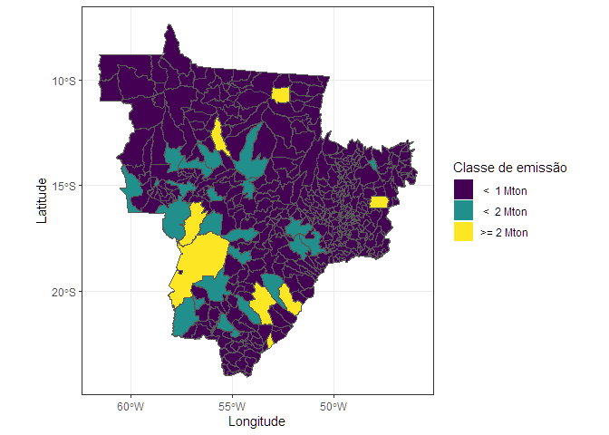<!-- -->

    #> 
    #> [[2]]

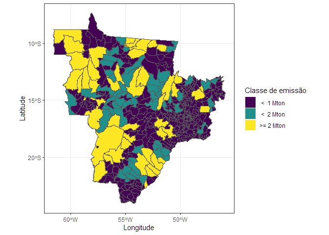<!-- -->

    #> 
    #> [[3]]

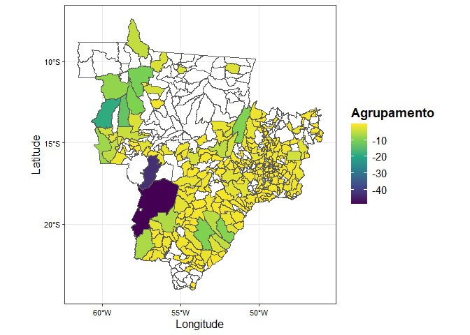<!-- -->

    #> 
    #> [[4]]

<!-- -->

    #> 
    #> [[5]]

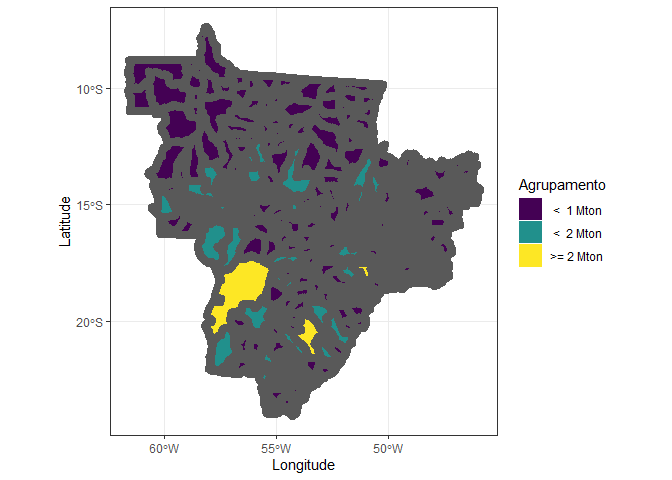<!-- -->

    #> 
    #> [[6]]

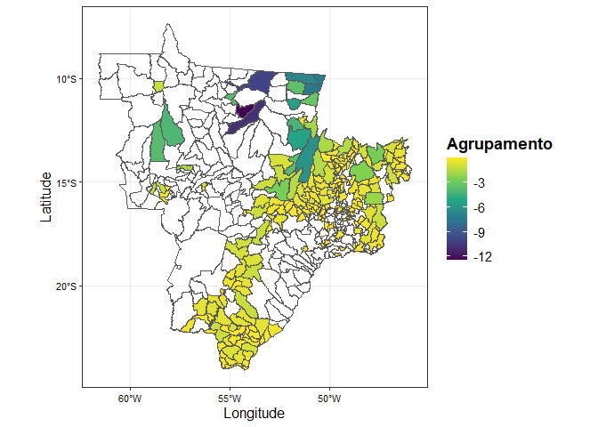<!-- -->

    #> 
    #> [[7]]

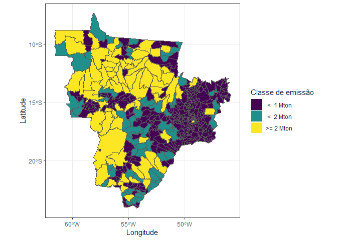<!-- -->

    #> 
    #> [[8]]

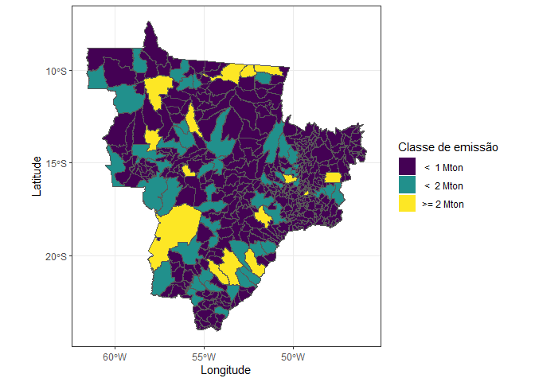<!-- -->

    #> 
    #> [[9]]

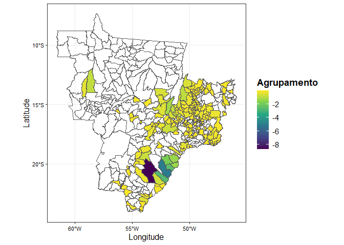<!-- --> \# teste
remoções

``` r
municipality |> 
    mutate(
      name_muni = stri_trans_general(tolower(name_muni), "Latin-ASCII"),
      name_muni = trimws(name_muni)
    )  |> 
    filter(abbrev_state %in% my_states) |> 
    left_join(
      data.frame(
        base_completa_subset |> 
          mutate(remocoes_de_carbono_sequestro = -abs(remocoes_de_carbono_sequestro)) |> #valores absolutos negativos 
          filter(
               !(city_ref %in% remov_out),
                 remocoes_de_carbono_sequestro <=0,
                 uso_liquido_de_terras_florestais<=0,
                 uso_liquido_de_areas_arbustivas_e_gramineas<=0,
                 uso_liquido_de_areas_umidas<=0) |> 
          pivot_longer(
            cols = c(remocoes_de_carbono_sequestro,uso_liquido_de_terras_florestais,uso_liquido_de_areas_arbustivas_e_gramineas,uso_liquido_de_areas_umidas),
            names_to = "subsector",
            values_to = "emission"
          ) |> 
          group_by(year, state, city_ref) |> 
          summarise(
            emission = sum(emission, na.rm = TRUE)
          ) |> 
          select(state:emission) |> 
          rename(name_muni = city_ref)
      ),by = "name_muni", relationship = "many-to-many"
    ) |> drop_na()
#> Simple feature collection with 2264 features and 7 fields
#> Geometry type: MULTIPOLYGON
#> Dimension:     XY
#> Bounding box:  xmin: -61.63336 ymin: -24.06858 xmax: -45.90697 ymax: -7.349034
#> Geodetic CRS:  SIRGAS 2000
#> First 10 features:
#>    code_muni   name_muni code_state abbrev_state year state   emission
#> 1    5000203  agua clara         50           MS 2017    MS -5446142.9
#> 2    5000203  agua clara         50           MS 2022    MS -7017342.8
#> 3    5000203  agua clara         50           MS 2024    MS        0.0
#> 4    5000203  agua clara         50           MS 2025    MS        0.0
#> 5    5000252 alcinopolis         50           MS 2016    MS -1047930.8
#> 6    5000252 alcinopolis         50           MS 2019    MS -1445626.1
#> 7    5000252 alcinopolis         50           MS 2022    MS -2555859.2
#> 8    5000252 alcinopolis         50           MS 2024    MS        0.0
#> 9    5000252 alcinopolis         50           MS 2025    MS        0.0
#> 10   5000609     amambai         50           MS 2016    MS  -535235.3
#>                              geom
#> 1  MULTIPOLYGON (((-53.093 -20...
#> 2  MULTIPOLYGON (((-53.093 -20...
#> 3  MULTIPOLYGON (((-53.093 -20...
#> 4  MULTIPOLYGON (((-53.093 -20...
#> 5  MULTIPOLYGON (((-53.50659 -...
#> 6  MULTIPOLYGON (((-53.50659 -...
#> 7  MULTIPOLYGON (((-53.50659 -...
#> 8  MULTIPOLYGON (((-53.50659 -...
#> 9  MULTIPOLYGON (((-53.50659 -...
#> 10 MULTIPOLYGON (((-54.92462 -...
```

## Instruções - feitas ✅

1- Na incorporação retirar os subsetores (para não contar duas vezes) 2-
fazer a soma de emissão por setor 3- pivto_wider com as emissão para os
diferentes setores nas colunas
