<!-- README.md is generated from README.Rmd. Please edit that file -->

# MODELAGEM COMPUTACIONAL DA CONCENTRAÇÃO ATMOSFÉRICA DE CO<sub>2</sub> e CH<sub>4</sub> NO BRASIL CENTRAL

**Resumo**: As mudanças climáticas globais são uma preocupação mundial
constante, sendo a principal causa o aumento da concentração de gases de
efeito estufa (GEE) na atmosfera, especialmente o dióxido de carbono
(CO<sub>2</sub>) e o metano (CH<sub>4</sub>). Para implementar medidas
eficientes de mitigação das emissões de GEE, é fundamental compreender a
dinâmica desses gases na atmosfera e estabelecer relações com outras
variáveis associadas ao sistema solo-planta-atmosfera. Nesse contexto,
diversos esforços têm sido realizados para aprimorar as técnicas de
monitoramento de GEE em escala global e regional. Esta proposta tem como
objetivo descrever a variabilidade espaçotemporal das concentrações
atmosféricas de CO<sub>2</sub> e CH<sub>4</sub> em áreas do Brasil
Central, identificando fontes e possíveis sumidouros desses gases ao
longo dos anos de 2015 a 2023. Serão adquiridos dados das concentrações
atmosféricas de CO<sub>2</sub> (X<sub>CO2</sub>) e CH<sub>4</sub>
(X<sub>CH4</sub>) a partir dos sensores orbitais GOSAT e OCO-2. Em
adição, dados das variáveis climáticas serão obtidos na plataforma da
Agência Espacial Americana (NASA). Para todos os setores emissores de
GEE, os dados serão obtidos a partir dos relatórios da plataforma
Climate TRACE, coalizão sem fins lucrativos capaz de rastrear e fornecer
informações sobre as emissões de GEE globalmente. A aquisição dos dados
será sistematizada para redução das diferenças entre as resoluções
espaciais dos dados de sensoriamento remoto, com posterior remoção da
tendência mundial de X<sub>CO2</sub> e X<sub>CH4</sub>. Para exploração
dos dados adquiridos, serão utilizadas técnicas exploratórias
multivariadas e análise geoestatística, implementadas em linguagem R. A
interrelação entre as variáveis analisadas será descrita por de
reconhecimento de padrão, que incluíram análises de agrupamento
hierárquico e não-hierárquico, análise de componentes principais
associadas aos padrões de variabilidade espacial. Espera-se que essa
abordagem contribua para melhorar a compreensão da dinâmica dos gases de
efeito estufa na atmosfera e suas interações com variáveis climáticas e
de uso da terra no Brasil Central, auxiliando na formulação de políticas
públicas voltadas para a mitigação das emissões de GEE e,
principalmente, a adaptação às mudanças climáticas.

**Objetivo**: Analisar a variabilidade espaçotemporal das concentrações
atmosféricas de CO<sub>2</sub> e CH<sub>4</sub> em áreas do Brasil
Central, identificando fontes e possíveis sumidouros desses gases ao
longo dos anos de 2015 a 2023, bem como suas relações com índices
vegetativos e climáticos, por meio de dados de GOSAT, OCO-2 e Climate
TRACE.

## 👨‍🔬 Autores

- **Pedro Henrique Marucio de Oliveira**  
  Graduando em Agronomia - FCAV/Unesp  
  Email: [pedro.marucio@unesp.br](mailto:pedro.marucio@unesp.b)

- **Prof. Dr. Alan Rodrigo Panosso**  
  Coorientador — Departamento de Ciências Exatas - FCAV/Unesp  
  Email: <alan.panosso@unesp.br>

## 📁 Etapas do Projeto

Os scripts abaixo foram desenvolvidos em RMarkdown e estão disponíveis
em formato HTML:

- **Aquisição e download dos dados brutos**
  - [GOSAT](https://data.ceda.ac.uk/neodc/gosat/data/ch4/nceov1.0/CH4_GOS_OCPR/):
    Dados de concentração de CH<sub>4</sub> 2009 a 2021  
  - [OCO-2](https://disc.gsfc.nasa.gov): Dados de concentração de
    XCO<sub>2</sub>
    (<https://disc.gsfc.nasa.gov/datasets/OCO2_L2_Lite_FP_11.2r/summary?keywords=OCO2>)
    e SIF (<a
    href="https://disc.gsfc.nasa.gov/datasets/OCO2_L2_Lite_SIF_11r/summary?keywords=OCO2\"
    class="uri">https://disc.gsfc.nasa.gov/datasets/OCO2_L2_Lite_SIF_11r/summary?keywords=OCO2\</a>
  - [Climate TRACE](https://climatetrace.org/): Dados de emissões de GEE
    de 2015 a 2022  
  - [AppEEARS](https://appeears.earthdatacloud.nasa.gov/task/point):
    Variáveis climáticas e vegetativas  
  - [nasapower](https://power.larc.nasa.gov/): Variáveis climáticas
    (Temperatura; precipitação; radiação solar; umidade relativa;
    velocidade do vento e pressão) de 2015 a 2024  
  - [DETER](https://terrabrasilis.dpi.inpe.br/downloads/): Dados de
    focos de fogo (cicatriz de queimadas)  
  - [Desmatamento - INPE - PRODES - Plataforma
    Terrabrasilis](https://terrabrasilis.dpi.inpe.br/geonetwork/srv/eng/catalog.search#/metadata/fe02f2bf-2cc0-49d5-ab72-a3954f997408):
    Dados sobre desmatamento de 31/07/2000 a 30/07/2023  
- **Dados adicionais adquiridos (não utilizados no trabalho)**
  - [NASA](https://climate.nasa.gov/): Dados climáticos  
  - [NASA-FIRMS](https://firms.modaps.eosdis.nasa.gov): Dados de focos
    de incêndio de 2015 a 2025  
  - [BDQUEIMADAS](https://terrabrasilis.dpi.inpe.br/queimadas/bdqueimadas/#exportar-dados):
    Dados de focos de incêndio de 2015 a 2025  
  - [Programa Queimadas - INPE - Plataforma
    Terrabrasilis](https://terrabrasilis.dpi.inpe.br/queimadas/portal/):
    Dados de focos de queimadas x Supressão da vegetação nativa de
    08/2018 a 01/2025 & Dados de focos de fogo ativo de 1998 a
    21/01/2025  

## 🧹 Faxina e Tratamento [script_geral](https://arpanosso.github.io//projeto-oliveiraphm//01_faxina_tratamento_dados.html)

Nessa etapa foi realizada a faxina, filtragem e organização inicial dos
dados. Os dados de concentração atmosférica de dióxido de carbono (XCO2)
e metano (XCH4) foram devidamente processados e filtrados para o
território brasileiro, incluindo:

Filtro geográfico (apenas medições dentro do Brasil);  
Controle de qualidade (baseado nos flags de qualidade dos dados
originais);  
Organização por regiões (Norte, Nordeste, Sudeste, Sul e Centro-Oeste);

### 🔗 Scripts de tratamentos e Links para Download dos dados processados:

| Script de Tratamento | Dados Processados Para Download |
|:--:|:--:|
| [nasa-xco2](https://arpanosso.github.io//projeto-oliveiraphm//nasa-xco2.html) | ⬇️ [nasa-xco2.rds](https://drive.google.com/file/d/1sVsLvBLxUB1YbqWyDUg177Eua2oREvgH/view?usp=sharing) |
| [gosat-xch4](https://arpanosso.github.io//projeto-oliveiraphm//gosat-xch4.html) | ⬇️ [gosat-xch4.rds](https://drive.google.com/file/d/1Rj-jcHOblEEb1ARMyJ1Jyfo4wCJnGliB/view?usp=drive_link) |
| [oco2-sif](https://arpanosso.github.io//projeto-oliveiraphm//oco2-sif.html) | ⬇️ [oco2-sif.rds](https://drive.google.com/file/d/1c4WlEmgnwu7R_ENjzMTTg2a4mP1IaiG_/view?usp=sharing) |
| [appeears-modis](https://arpanosso.github.io//projeto-oliveiraphm//appeears-modis.html) | ⬇️ [appeears-modis.rds](https://drive.google.com/file/d/15bpg2r2_XSWveyWrFu6oumt79UUlxzJr/view?usp=sharing) |
| [emissions-sources](https://arpanosso.github.io//projeto-oliveiraphm//emissions-sources.html) | ⬇️ [emissions-sources.rds](https://drive.google.com/file/d/17erldRlIlTiB5sVtLWjsv4E--zZ3gmH-/view?usp=sharing) |
| [nasa-power](https://arpanosso.github.io//projeto-oliveiraphm//nasa-xco2.html) | ⬇️ [nasa-power.rds](https://drive.google.com/file/d/13_PR3bQ9-ga_Wiv7jEv-GhYpAJwhmyTN/view?usp=sharing) |
| [prodes-deforestation](https://arpanosso.github.io//projeto-oliveiraphm//prodes-deforestation.html) | ⬇️ [prodes-deforestation.rds](https://drive.google.com/file/d/1X4KJ_XK3GRcrwNCwWVEihJQBMGb72Z3S/view?usp=sharing) |
| [deter-queimadas](https://arpanosso.github.io//projeto-oliveiraphm//deter-queimadas.html) | ⬇️ [deter-queimadas.rds](https://drive.google.com/file/d/1cmikkge6MtLJXuPBYeV-ZuMYoaNKP967/view?usp=sharing) |
| [nasa-firms](https://arpanosso.github.io//projeto-oliveiraphm//nasa-firms.html) | ⬇️ [nasa-firms.rds](https://drive.google.com/file/d/1aMsbg35-QRBs-xiS8jl6lQ6feUySxM3e/view?usp=sharing) |

Formato dos arquivos:

> .rds (formato nativo do R para rápido carregamento)

> salve os arquivos na pasta `data` do seu projeto

#### 🛠️ Pré-processameto [script](https://arpanosso.github.io//projeto-oliveiraphm//02_preprocessamento.html)

#### ⛓️ Incorporação das bases

[script](adicionar%20link)

### 🛠 Preparação dos dados para análise.

``` r
library(tidyverse)
library(dplyr)
library(purrr) # criar funções
library(tibble)
library(corrplot)
library(vegan)
library(stringi)
source("R/my-function.R") 
#> List of polygons loaded [list_pol]
```

#### Definindo estados

``` r
my_states <- c("MS","MT","GO","DF")
```

## 💨 Entrada com todas as bases atualizadas com os setores `base_completa_setores.rds`

``` r
base_completa_setores <- read_rds('data/base_completa_setores.rds')

base_completa_setores |> 
  filter(year%in%2021:2024) |> 
  select(year, state,city_ref,florestas_e_uso_da_terra) |> arrange(desc(florestas_e_uso_da_terra))
#>      year state                                              city_ref
#> 1    2021    MS                                               corumba
#> 2    2021    MT                                          nova ubirata
#> 3    2021    MT                                          nova maringa
#> 4    2021    MT                                             querencia
#> 5    2021    MT                                               sorriso
#> 6    2021    MT                                     sao jose do xingu
#> 7    2021    MT                                            nova mutum
#> 8    2021    MT                                          uniao do sul
#> 9    2021    MT                                               colniza
#> 10   2021    MT                                           marcelandia
#> 11   2021    MT                                       gaucha do norte
#> 12   2021    MS                                        porto murtinho
#> 13   2021    MT                                           feliz natal
#> 14   2021    MT                                                pocone
#> 15   2021    MT                                           paranatinga
#> 16   2023    MS                                            aquidauana
#> 17   2021    MT                                              aripuana
#> 18   2023    MT                                                 juara
#> 19   2023    MT                                                pocone
#> 20   2021    MT                                vera municipality vera
#> 21   2021    MT                                               tapurah
#> 22   2021    MT                                     porto dos gauchos
#> 23   2021    MT                                              canarana
#> 24   2023    MS                                               corumba
#> 25   2021    MS                                    ribas do rio pardo
#> 26   2021    MT                                    lucas do rio verde
#> 27   2021    MT                                             itanhanga
#> 28   2021    MT                                               claudia
#> 29   2023    MT                                               caceres
#> 30   2021    MT                               santa rita do trivelato
#> 31   2023    MT                                          nova maringa
#> 32   2023    MT                                             querencia
#> 33   2022    MT                                    peixoto de azevedo
#> 34   2021    MT                                      tangara da serra
#> 35   2021    MT                                               sapezal
#> 36   2022    MT                                   santa cruz do xingu
#> 37   2021    MT                                     nova bandeirantes
#> 38   2023    MT                                           marcelandia
#> 39   2021    MT                                     ipiranga do norte
#> 40   2021    MT                                 sao jose do rio claro
#> 41   2021    MT                                       campos de julio
#> 42   2023    MT                                    peixoto de azevedo
#> 43   2021    MT                                               caceres
#> 44   2021    MT                                              agua boa
#> 45   2021    MT                                              tabapora
#> 46   2021    MT                                    peixoto de azevedo
#> 47   2021    MT                                      barao de melgaco
#> 48   2022    MT                                                 juara
#> 49   2021    MT sao felix do araguaia municipality canabrava do norte
#> 50   2021    MT                                          santa carmem
#> 51   2023    MT sao felix do araguaia municipality canabrava do norte
#> 52   2021    MS                                          campo grande
#> 53   2021    GO                                               jussara
#> 54   2021    MT                                  ribeirao cascalheira
#> 55   2021    MT                                 bom jesus do araguaia
#> 56   2021    MT                                                 sinop
#> 57   2023    MT                                     porto dos gauchos
#> 58   2021    MT                                                 juara
#> 59   2023    MT                                     sao jose do xingu
#> 60   2021    MT                                   nova canaa do norte
#> 61   2023    MT                                                 juina
#> 62   2023    MT                                      barao de melgaco
#> 63   2021    MT                                       barra do bugres
#> 64   2021    MT                                         alta floresta
#> 65   2021    MT                                            araguaiana
#> 66   2021    MT                                             brasnorte
#> 67   2022    GO                                                 goias
#> 68   2023    MT                                               apiacas
#> 69   2021    MS                                        nova andradina
#> 70   2022    MT                                             vila rica
#> 71   2021    MT                                              confresa
#> 72   2021    MS                                            aquidauana
#> 73   2023    MT                                              aripuana
#> 74   2021    MS                                           alcinopolis
#> 75   2023    MT                                      nova monte verde
#> 76   2023    MT                                              tabapora
#> 77   2021    MT                                               apiacas
#> 78   2021    MS                                            bela vista
#> 79   2021    MT                                              comodoro
#> 80   2021    MS                                            agua clara
#> 81   2021    MT                           nossa senhora do livramento
#> 82   2021    MS                                               amambai
#> 83   2021    MT                                    canabrava do norte
#> 84   2021    MT                                           rondolandia
#> 85   2021    MS                                               caracol
#> 86   2021    GO                                             porangatu
#> 87   2021    DF                                              brasilia
#> 88   2021    MS                                              maracaju
#> 89   2021    MT                                        nova xavantina
#> 90   2021    MS                                             figueirao
#> 91   2021    MS                                            ponta pora
#> 92   2021    MT                                 porto alegre do norte
#> 93   2021    MS                                             bodoquena
#> 94   2021    GO                                montes claros de goias
#> 95   2021    MT                                             paranaita
#> 96   2021    MT                                             cocalinho
#> 97   2021    MS                                               miranda
#> 98   2021    MT                                   terra nova do norte
#> 99   2021    MT                                    primavera do leste
#> 100  2023    MT                                           feliz natal
#> 101  2022    MT                                           rondolandia
#> 102  2023    MT                                               sorriso
#> 103  2021    MS                                              iguatemi
#> 104  2023    MT                                               luciara
#> 105  2021    MS                                                bonito
#> 106  2022    MT                                            cotriguacu
#> 107  2021    MT                                       barra do garcas
#> 108  2021    MT                                           campo verde
#> 109  2021    MT                                              carlinda
#> 110  2021    MT                             santo antonio do leverger
#> 111  2022    MT                                   nova canaa do norte
#> 112  2021    GO                                           nova crixas
#> 113  2022    GO                                                crixas
#> 114  2022    GO                                                 faina
#> 115  2021    MT                                     nova santa helena
#> 116  2022    MT                                         alta floresta
#> 117  2022    GO                                             rubiataba
#> 118  2023    MT                                      tangara da serra
#> 119  2023    MT                             santo antonio do leverger
#> 120  2021    GO                                 alto paraiso de goias
#> 121  2022    MT                                                 juina
#> 122  2023    MT                                          nova ubirata
#> 123  2021    MS                                          aral moreira
#> 124  2023    MT                                          santa carmem
#> 125  2021    GO                                              britania
#> 126  2023    MT                                     ipiranga do norte
#> 127  2022    GO                                          fazenda nova
#> 128  2021    MT                                     guaranta do norte
#> 129  2021    MT                                           castanheira
#> 130  2021    MT                                            novo mundo
#> 131  2021    MS                                             bataypora
#> 132  2022    GO                                               jaragua
#> 133  2023    MT                                              confresa
#> 134  2023    MT                                     nova bandeirantes
#> 135  2023    MT                                   santa cruz do xingu
#> 136  2021    MS                                         rio brilhante
#> 137  2023    MT                                             brasnorte
#> 138  2022    GO                                            itapirapua
#> 139  2023    MT                                       barra do bugres
#> 140  2023    MT                                                itauba
#> 141  2021    GO                                            montividiu
#> 142  2022    MT                                               juruena
#> 143  2021    MT                                                itauba
#> 144  2023    MT                                          uniao do sul
#> 145  2022    GO                                            itapuranga
#> 146  2023    MT                                             vila rica
#> 147  2021    MT                                      pontes e lacerda
#> 148  2021    MS                                         laguna carapa
#> 149  2022    GO                                              itaberai
#> 150  2023    MT                                            novo mundo
#> 151  2021    MS                                                 jatei
#> 152  2022    MT                                               colider
#> 153  2022    GO                                              silvania
#> 154  2022    MT                                                matupa
#> 155  2021    MS                                                tacuru
#> 156  2022    GO                                            mossamedes
#> 157  2021    MT                                      nova monte verde
#> 158  2021    MT                                        alto boa vista
#> 159  2023    MT                                                denise
#> 160  2023    MT                                         alta floresta
#> 161  2021    MT                                    reserva do cabacal
#> 162  2023    MT                                       santa terezinha
#> 163  2022    MT                                           feliz natal
#> 164  2022    GO                                montes claros de goias
#> 165  2021    GO                                          sao domingos
#> 166  2021    MT                                           nova nazare
#> 167  2021    MS                                             rio verde
#> 168  2021    MT                                       santa terezinha
#> 169  2023    MT                                     guaranta do norte
#> 170  2022    GO                                             mara rosa
#> 171  2023    MT                                  ribeirao cascalheira
#> 172  2021    MS                                  nova alvorada do sul
#> 173  2023    MT                                             paranaita
#> 174  2022    MT                                              confresa
#> 175  2021    MS                         dourados municipality itapora
#> 176  2023    MT                                           castanheira
#> 177  2021    MT                                       nova marilandia
#> 178  2023    MT                                               tapurah
#> 179  2022    GO                                       corrego do ouro
#> 180  2022    GO                                              luziania
#> 181  2021    MS                                                 coxim
#> 182  2023    MT                                    novo santo antonio
#> 183  2022    GO                              sao luis de montes belos
#> 184  2022    GO                                           israelandia
#> 185  2021    MT                                 campo novo do parecis
#> 186  2022    GO                                               anicuns
#> 187  2021    MT                                          salto do ceu
#> 188  2021    MT                                          nova olimpia
#> 189  2022    MT                                     guaranta do norte
#> 190  2021    MT                                      novo sao joaquim
#> 191  2021    GO                                            cristalina
#> 192  2022    GO                                   bom jardim de goias
#> 193  2021    MT                                   santa cruz do xingu
#> 194  2021    MS                                               camapua
#> 195  2021    MT                               novo horizonte do norte
#> 196  2023    MT                      vila bela da santissima trindade
#> 197  2021    MT                                               luciara
#> 198  2022    MT                                                itauba
#> 199  2021    MS                                             itaquirai
#> 200  2021    MT                                             vila rica
#> 201  2023    MT                                                 sinop
#> 202  2021    MS                                               navirai
#> 203  2023    MT                                     nova santa helena
#> 204  2022    GO                                        pilar de goias
#> 205  2023    MT                                            nova mutum
#> 206  2023    MT                                               claudia
#> 207  2021    MT                                                denise
#> 208  2021    GO                                                aruana
#> 209  2021    GO                                               formosa
#> 210  2022    GO                                               jaupaci
#> 211  2021    GO                                            mundo novo
#> 212  2022    GO                                              piranhas
#> 213  2021    MT                                         alto araguaia
#> 214  2022    GO                                    petrolina de goias
#> 215  2023    MT                                          nova lacerda
#> 216  2022    GO                      moipora municipality israelandia
#> 217  2021    MT                                            dom aquino
#> 218  2021    MS                                               caarapo
#> 219  2021    MS                                          anaurilandia
#> 220  2021    MS                                            bataguassu
#> 221  2021    GO                                sao miguel do araguaia
#> 222  2022    GO                                   cocalzinho de goias
#> 223  2022    MT                                    serra nova dourada
#> 224  2023    MT                                vera municipality vera
#> 225  2023    MT                                 porto alegre do norte
#> 226  2021    GO                                         novo planalto
#> 227  2021    MS                                 novo horizonte do sul
#> 228  2022    GO                                               diorama
#> 229  2021    GO                                    sao joao d'alianca
#> 230  2023    MT                                                matupa
#> 231  2021    MS                                            taquarussu
#> 232  2023    MT                                              carlinda
#> 233  2023    MT                                          nova olimpia
#> 234  2021    MS                                juti municipality juti
#> 235  2021    MS                                              paranhos
#> 236  2022    GO                                          santa isabel
#> 237  2021    GO                                             matrincha
#> 238  2022    GO                                            arenopolis
#> 239  2023    MT                                     conquista d'oeste
#> 240  2022    GO                                         sanclerlandia
#> 241  2023    MT                                    lucas do rio verde
#> 242  2022    GO                                              heitorai
#> 243  2021    MT                                    serra nova dourada
#> 244  2021    MS                                                sonora
#> 245  2022    GO                                     santa fe de goias
#> 246  2021    MS             paraiso das aguas municipality agua clara
#> 247  2022    GO                                                itaucu
#> 248  2021    MS                                      coronel sapucaia
#> 249  2022    MT                                     nova bandeirantes
#> 250  2021    MT                                       lambari d'oeste
#> 251  2021    GO                                             aragarcas
#> 252  2021    MS                                            costa rica
#> 253  2022    GO                                         vila propicio
#> 254  2022    GO                                     taquaral de goias
#> 255  2023    MT                                   nova canaa do norte
#> 256  2022    GO                                               orizona
#> 257  2022    MT                                            arenapolis
#> 258  2023    MS                                               nioaque
#> 259  2021    MS                                              ivinhema
#> 260  2022    GO                                    carmo do rio verde
#> 261  2021    MT                                               juruena
#> 262  2021    MT                                santo antonio do leste
#> 263  2022    GO                                              guarinos
#> 264  2021    MS                                           sidrolandia
#> 265  2022    MT                                      nova monte verde
#> 266  2022    GO                                            cabeceiras
#> 267  2022    GO                                              uirapuru
#> 268  2022    MT                                              aripuana
#> 269  2022    GO                                sao francisco de goias
#> 270  2022    MS                                  guia lopes da laguna
#> 271  2022    GO                                              itaguaru
#> 272  2022    MS                         dourados municipality itapora
#> 273  2022    GO                                           pirenopolis
#> 274  2022    GO                              santa terezinha de goias
#> 275  2021    GO                                            planaltina
#> 276  2021    MT                                                matupa
#> 277  2023    MT                                 bom jesus do araguaia
#> 278  2021    MS                                               itapora
#> 279  2021    MT                                          santo afonso
#> 280  2021    MT                                     conquista d'oeste
#> 281  2021    GO                                                 jatai
#> 282  2024    MS                                             bataypora
#> 283  2022    GO                                             amaralina
#> 284  2022    GO                                   leopoldo de bulhoes
#> 285  2021    GO                                             rio verde
#> 286  2022    GO                                        alto horizonte
#> 287  2023    MT                                            diamantino
#> 288  2022    GO                                             goianesia
#> 289  2023    MT                                            araputanga
#> 290  2023    MT                                  vale de sao domingos
#> 291  2021    MS                                              eldorado
#> 292  2021    MS                                              angelica
#> 293  2022    MT                                           castanheira
#> 294  2022    GO                                                uruana
#> 295  2023    GO                                                mambai
#> 296  2023    MT                                      pontes e lacerda
#> 297  2022    GO                                              guaraita
#> 298  2022    GO                                           novo brasil
#> 299  2021    MS                                                jardim
#> 300  2022    GO                                  nova iguacu de goias
#> 301  2023    MT                                               juruena
#> 302  2022    MT                                 porto alegre do norte
#> 303  2021    GO                                    agua fria de goias
#> 304  2022    GO                                      corumba de goias
#> 305  2023    MT                                             itanhanga
#> 306  2021    MS                                           sete quedas
#> 307  2022    GO                                                 ipora
#> 308  2021    GO                                     santa fe de goias
#> 309  2023    MT                                    reserva do cabacal
#> 310  2023    MS                                            bela vista
#> 311  2022    MT                                    novo santo antonio
#> 312  2024    MS                                              selviria
#> 313  2022    GO                                               itapaci
#> 314  2023    MT                                      porto esperidiao
#> 315  2022    GO                                     ipiranga de goias
#> 316  2023    MT                                       lambari d'oeste
#> 317  2022    GO                                               inhumas
#> 318  2021    MT                                          nova guarita
#> 319  2024    GO                                        colinas do sul
#> 320  2023    MT                                       nova marilandia
#> 321  2023    MT                                      general carneiro
#> 322  2022    GO                                            aurilandia
#> 323  2022    MT                                    canabrava do norte
#> 324  2021    MT                                               jaciara
#> 325  2022    GO                                       flores de goias
#> 326  2021    GO                                               iaciara
#> 327  2022    GO                                                 guapo
#> 328  2021    GO                                               parauna
#> 329  2023    MT                                      mirassol d'oeste
#> 330  2022    MS                                               itapora
#> 331  2022    GO                                     alvorada do norte
#> 332  2022    GO                                               formoso
#> 333  2021    GO                                             bonopolis
#> 334  2021    MT                      vila bela da santissima trindade
#> 335  2022    GO                                        padre bernardo
#> 336  2022    GO                                                varjao
#> 337  2021    GO                                   bom jardim de goias
#> 338  2022    GO                                           nova crixas
#> 339  2021    GO                                       corrego do ouro
#> 340  2021    GO                                            perolandia
#> 341  2023    MS                                  guia lopes da laguna
#> 342  2022    GO                                            mundo novo
#> 343  2023    MT                                    serra nova dourada
#> 344  2023    MS                                         rio brilhante
#> 345  2023    MT                                   terra nova do norte
#> 346  2023    MT                            sao jose dos quatro marcos
#> 347  2022    GO                                                rialma
#> 348  2021    MS                                             anastacio
#> 349  2023    MS                                             anastacio
#> 350  2023    MS                                              paranhos
#> 351  2023    MS                                                japora
#> 352  2023    GO                                          sao domingos
#> 353  2021    GO                                        sitio d'abadia
#> 354  2022    GO                                          sao patricio
#> 355  2022    GO                                               caturai
#> 356  2021    MS                                          antonio joao
#> 357  2022    GO                                    campestre de goias
#> 358  2022    GO                                            cristalina
#> 359  2022    GO                                         campos verdes
#> 360  2022    GO                                        sitio d'abadia
#> 361  2022    GO                                              cezarina
#> 362  2022    GO                   ivolandia municipality amorinopolis
#> 363  2021    MT                                      general carneiro
#> 364  2022    GO                                   ouro verde de goias
#> 365  2023    GO                                             itumbiara
#> 366  2022    GO                                  morro agudo de goias
#> 367  2022    MS                                               ladario
#> 368  2022    GO                                   santa rosa de goias
#> 369  2021    GO                                       chapadao do ceu
#> 370  2022    GO                                               nazario
#> 371  2022    GO                                               indiara
#> 372  2021    GO                                           mozarlandia
#> 373  2023    MT                                              indiavai
#> 374  2023    MT                                              itiquira
#> 375  2022    GO                                            caldazinha
#> 376  2023    MT                                          salto do ceu
#> 377  2023    MS                                             bataypora
#> 378  2021    GO                                       flores de goias
#> 379  2022    GO                                          campos belos
#> 380  2022    GO                                    palmeiras de goias
#> 381  2022    GO                                            vianopolis
#> 382  2022    GO                                            simolandia
#> 383  2022    GO                                             sao simao
#> 384  2023    GO                                        colinas do sul
#> 385  2023    MT                                            dom aquino
#> 386  2022    GO                                             jesupolis
#> 387  2023    MT                                                 jauru
#> 388  2023    MS                                              maracaju
#> 389  2021    GO                                            cabeceiras
#> 390  2021    MS                                            mundo novo
#> 391  2024    GO                                             sao simao
#> 392  2023    MS                                               amambai
#> 393  2021    GO                                      guarani de goias
#> 394  2022    GO                                          bonfinopolis
#> 395  2023    MS                                             bodoquena
#> 396  2022    GO                                               jandaia
#> 397  2023    MS                                               caracol
#> 398  2023    MS                                               miranda
#> 399  2021    MT                                      nova brasilandia
#> 400  2023    MT                                           nortelandia
#> 401  2022    GO                                             araguapaz
#> 402  2021    MT                                      mirassol d'oeste
#> 403  2022    GO                                             itumbiara
#> 404  2022    GO                                       buriti de goias
#> 405  2023    MT                                         alto paraguai
#> 406  2023    MT                                 figueiropolis d'oeste
#> 407  2023    MT                               santa rita do trivelato
#> 408  2021    MS                                            deodapolis
#> 409  2021    GO                                              vila boa
#> 410  2023    MT                                           rondolandia
#> 411  2022    GO                                             bonopolis
#> 412  2023    GO                                            cavalcante
#> 413  2023    GO                                        sitio d'abadia
#> 414  2023    MT                                 sao jose do rio claro
#> 415  2022    GO                                             abadiania
#> 416  2023    GO                                    sao joao d'alianca
#> 417  2022    GO                                    gameleira de goias
#> 418  2022    MT                                           nortelandia
#> 419  2023    MT                                           curvelandia
#> 420  2021    GO                                             sao simao
#> 421  2021    GO                                           mutunopolis
#> 422  2022    GO                                             neropolis
#> 423  2022    GO                                              goianira
#> 424  2021    GO                                              turvania
#> 425  2022    GO                                            damolandia
#> 426  2021    GO                                      cidade ocidental
#> 427  2023    MT                                        alto boa vista
#> 428  2022    GO                                                 aracu
#> 429  2022    GO                                                 ceres
#> 430  2021    GO                                               anicuns
#> 431  2021    GO                                                 posse
#> 432  2021    GO                                                mambai
#> 433  2022    GO                                              anapolis
#> 434  2021    MT                                            juscimeira
#> 435  2023    GO                                               corumba
#> 436  2021    MS                                  sao gabriel do oeste
#> 437  2022    MS                   fatima do sul municipality dourados
#> 438  2021    GO                                               corumba
#> 439  2022    GO                                             pontalina
#> 440  2024    GO                                               corumba
#> 441  2023    GO                                         buriti alegre
#> 442  2022    GO                                               corumba
#> 443  2021    GO                                               diorama
#> 444  2022    GO                                santo antonio de goias
#> 445  2022    GO                                      estrela do norte
#> 446  2023    MT                                          santo afonso
#> 447  2023    GO                                 alto paraiso de goias
#> 448  2021    MT                                         varzea grande
#> 449  2022    GO                                   bela vista de goias
#> 450  2021    GO                                          paranaiguara
#> 451  2022    GO                                santa barbara de goias
#> 452  2022    GO                                             adelandia
#> 453  2022    GO                                           hidrolandia
#> 454  2022    MT                                         alto paraguai
#> 455  2022    GO                                       professor jamil
#> 456  2023    MS                                            deodapolis
#> 457  2023    MT                               novo horizonte do norte
#> 458  2023    MT                                    canabrava do norte
#> 459  2022    GO                                                 posse
#> 460  2021    MS                                                japora
#> 461  2022    GO                                               acreuna
#> 462  2022    GO                                             morrinhos
#> 463  2021    GO                           santo antonio do descoberto
#> 464  2022    GO                                             hidrolina
#> 465  2021    MS                                          bandeirantes
#> 466  2022    GO                                                panama
#> 467  2022    GO                                  aparecida de goiania
#> 468  2024    MT                                 chapada dos guimaraes
#> 469  2021    MT                                     sao pedro da cipa
#> 470  2023    GO                                    campestre de goias
#> 471  2022    GO                                                urutai
#> 472  2023    MS                                          aral moreira
#> 473  2022    GO                                          avelinopolis
#> 474  2021    GO                                            aurilandia
#> 475  2022    MT                                                 jauru
#> 476  2023    MS                                          antonio joao
#> 477  2023    MS                                              iguatemi
#> 478  2022    MT                                            rio branco
#> 479  2022    GO                                   americano do brasil
#> 480  2022    GO                            sao miguel do passa quatro
#> 481  2022    MS                                 dois irmaos do buriti
#> 482  2023    GO                                              goiatuba
#> 483  2022    GO                                           goianapolis
#> 484  2023    GO                                            planaltina
#> 485  2022    GO                                        vicentinopolis
#> 486  2022    GO                                            campinorte
#> 487  2023    MT                                            rio branco
#> 488  2022    GO                                              alexania
#> 489  2022    GO                                          firminopolis
#> 490  2022    GO                           santo antonio do descoberto
#> 491  2022    GO                                           gouvelandia
#> 492  2021    GO                                    cachoeira de goias
#> 493  2022    GO                                              vila boa
#> 494  2023    MS                                            mundo novo
#> 495  2022    GO                                            barro alto
#> 496  2022    GO                                      cidade ocidental
#> 497  2022    GO                                          paranaiguara
#> 498  2022    GO                                 santa tereza de goias
#> 499  2023    MT                                            arenapolis
#> 500  2021    MS                                       chapadao do sul
#> 501  2023    MT                                                cuiaba
#> 502  2021    GO                                             novo gama
#> 503  2022    GO                                              turvania
#> 504  2021    MT                                     planalto da serra
#> 505  2022    GO                                   santa cruz de goias
#> 506  2023    GO                                            perolandia
#> 507  2021    GO                                 santa tereza de goias
#> 508  2023    MS                                              angelica
#> 509  2021    MS                                             douradina
#> 510  2024    GO                                               catalao
#> 511  2021    GO                        itaja municipality lagoa santa
#> 512  2023    MT                                         porto estrela
#> 513  2021    MS                                    gloria de dourados
#> 514  2022    GO                                          amorinopolis
#> 515  2022    GO                                          brazabrantes
#> 516  2021    MS                                             rio negro
#> 517  2022    GO                                          nova america
#> 518  2021    GO                                 campo alegre de goias
#> 519  2021    MS                   fatima do sul municipality dourados
#> 520  2021    MT                                              indiavai
#> 521  2023    MS                                         laguna carapa
#> 522  2023    GO                                 aguas lindas de goias
#> 523  2021    MT                                            rio branco
#> 524  2023    GO                                             rio verde
#> 525  2022    GO                                            rio quente
#> 526  2022    GO                                   sao joao da parauna
#> 527  2022    GO                                           castelandia
#> 528  2023    MS                                               itapora
#> 529  2022    GO                                          damianopolis
#> 530  2022    GO                                              goiatuba
#> 531  2023    GO                                    agua fria de goias
#> 532  2022    GO                                        cristianopolis
#> 533  2024    GO                                                minacu
#> 534  2022    GO                                santo antonio da barra
#> 535  2022    GO                                              trindade
#> 536  2022    GO                                           turvelandia
#> 537  2021    GO                                 aguas lindas de goias
#> 538  2023    MT                                           nova nazare
#> 539  2023    GO                                     cachoeira dourada
#> 540  2022    GO                                              crominia
#> 541  2022    GO                                              itaguari
#> 542  2023    MS                                    gloria de dourados
#> 543  2022    GO                                               goiania
#> 544  2022    MT                                          nova lacerda
#> 545  2023    GO                                  divinopolis de goias
#> 546  2023    GO                                 santa helena de goias
#> 547  2022    MS                                             douradina
#> 548  2021    MT                                             torixoreu
#> 549  2021    GO                                              luziania
#> 550  2023    MS                                             douradina
#> 551  2022    GO                                        senador canedo
#> 552  2021    GO                                             adelandia
#> 553  2022    GO                                  campo limpo de goias
#> 554  2024    DF                                              brasilia
#> 555  2023    MS                                              ivinhema
#> 556  2022    GO                                          inaciolandia
#> 557  2021    GO                                           gouvelandia
#> 558  2021    MT                                                 jauru
#> 559  2022    GO                                               palmelo
#> 560  2022    GO                                            rianapolis
#> 561  2023    GO                                           goianapolis
#> 562  2024    GO                                     cachoeira dourada
#> 563  2023    GO                                          damianopolis
#> 564  2022    GO                                           nova veneza
#> 565  2021    MT                                          alto taquari
#> 566  2022    GO                                           mutunopolis
#> 567  2021    GO                                   americano do brasil
#> 568  2021    MS                                             vicentina
#> 569  2023    GO                                               anicuns
#> 570  2021    GO                                               nazario
#> 571  2023    MS                                                sonora
#> 572  2021    GO                                    campestre de goias
#> 573  2024    GO                                            corumbaiba
#> 574  2021    GO                                     cachoeira dourada
#> 575  2022    GO                                                mambai
#> 576  2022    GO                                     cachoeira dourada
#> 577  2023    MS                                             vicentina
#> 578  2021    GO                                   valparaiso de goias
#> 579  2023    MT                                     sao pedro da cipa
#> 580  2022    GO                                           nova gloria
#> 581  2021    GO                                  terezopolis de goias
#> 582  2021    GO                                           goianapolis
#> 583  2021    GO                                            damolandia
#> 584  2022    GO                                       mimoso de goias
#> 585  2023    GO                                         buritinopolis
#> 586  2021    GO                                            itapirapua
#> 587  2022    GO                                    bom jesus de goias
#> 588  2022    GO                                           maurilandia
#> 589  2023    GO                                                 aracu
#> 590  2024    MT                                              itiquira
#> 591  2024    MS                                    ribas do rio pardo
#> 592  2021    GO                                          avelinopolis
#> 593  2023    MS                                             rio negro
#> 594  2022    MS                                          antonio joao
#> 595  2023    GO                                           turvelandia
#> 596  2023    GO                                              marzagao
#> 597  2021    GO                                          fazenda nova
#> 598  2024    GO                                        cachoeira alta
#> 599  2024    MT                                            araputanga
#> 600  2021    GO                                             porteirao
#> 601  2024    GO                                       abadia de goias
#> 602  2024    GO                                             abadiania
#> 603  2024    GO                                               acreuna
#> 604  2024    GO                                             adelandia
#> 605  2024    GO                                    agua fria de goias
#> 606  2024    GO                                            agua limpa
#> 607  2024    GO                                 aguas lindas de goias
#> 608  2024    GO                                              alexania
#> 609  2024    GO                                              aloandia
#> 610  2024    GO                                        alto horizonte
#> 611  2024    GO                                 alto paraiso de goias
#> 612  2024    GO                                     alvorada do norte
#> 613  2024    GO                                             amaralina
#> 614  2024    GO                                   americano do brasil
#> 615  2024    GO                                          amorinopolis
#> 616  2024    GO                                              anapolis
#> 617  2024    GO                                            anhanguera
#> 618  2024    GO                                               anicuns
#> 619  2024    GO                                  aparecida de goiania
#> 620  2024    GO                                 aparecida do rio doce
#> 621  2024    GO                                                 apore
#> 622  2024    GO                                                 aracu
#> 623  2024    GO                                             aragarcas
#> 624  2024    GO                                            aragoiania
#> 625  2024    GO                                             araguapaz
#> 626  2024    GO                                            arenopolis
#> 627  2024    GO                                                aruana
#> 628  2024    GO                                            aurilandia
#> 629  2024    GO                                          avelinopolis
#> 630  2024    GO                                                baliza
#> 631  2024    GO                                            barro alto
#> 632  2024    GO                                   bela vista de goias
#> 633  2024    GO                                   bom jardim de goias
#> 634  2024    GO                                    bom jesus de goias
#> 635  2024    GO                                          bonfinopolis
#> 636  2024    GO                                             bonopolis
#> 637  2024    GO                                          brazabrantes
#> 638  2024    GO                                              britania
#> 639  2024    GO                                         buriti alegre
#> 640  2024    GO                                       buriti de goias
#> 641  2024    GO                                         buritinopolis
#> 642  2024    GO                                            cabeceiras
#> 643  2024    GO                                    cachoeira de goias
#> 644  2024    GO                                cacu municipality cacu
#> 645  2024    GO                                             caiaponia
#> 646  2024    GO                                          caldas novas
#> 647  2024    GO                                            caldazinha
#> 648  2024    GO                                    campestre de goias
#> 649  2024    GO                                             campinacu
#> 650  2024    GO                                            campinorte
#> 651  2024    GO                                 campo alegre de goias
#> 652  2024    GO                                  campo limpo de goias
#> 653  2024    GO                                          campos belos
#> 654  2024    GO                                         campos verdes
#> 655  2024    GO                                    carmo do rio verde
#> 656  2024    GO                                           castelandia
#> 657  2024    GO                                               caturai
#> 658  2024    GO                                            cavalcante
#> 659  2024    GO                                                 ceres
#> 660  2024    GO                                              cezarina
#> 661  2024    GO                                       chapadao do ceu
#> 662  2024    GO                                      cidade ocidental
#> 663  2024    GO                                   cocalzinho de goias
#> 664  2024    GO                                       corrego do ouro
#> 665  2024    GO                                      corumba de goias
#> 666  2024    GO                                            cristalina
#> 667  2024    GO                                        cristianopolis
#> 668  2024    GO                                                crixas
#> 669  2024    GO                                              crominia
#> 670  2024    GO                                                cumari
#> 671  2024    GO                                          damianopolis
#> 672  2024    GO                                            damolandia
#> 673  2024    GO                                           davinopolis
#> 674  2024    GO                                               diorama
#> 675  2024    GO                                  divinopolis de goias
#> 676  2024    GO                                           doverlandia
#> 677  2024    GO                           edealina municipality edeia
#> 678  2024    GO                                                 edeia
#> 679  2024    GO                                      estrela do norte
#> 680  2024    GO                                                 faina
#> 681  2024    GO                                          fazenda nova
#> 682  2024    GO                                          firminopolis
#> 683  2024    GO                                       flores de goias
#> 684  2024    GO                                               formosa
#> 685  2024    GO                                               formoso
#> 686  2024    GO                                    gameleira de goias
#> 687  2024    GO                                           goianapolis
#> 688  2024    GO                                             goiandira
#> 689  2024    GO                                             goianesia
#> 690  2024    GO                                               goiania
#> 691  2024    GO                                              goianira
#> 692  2024    GO                                                 goias
#> 693  2024    GO                                              goiatuba
#> 694  2024    GO                                           gouvelandia
#> 695  2024    GO                                                 guapo
#> 696  2024    GO                                              guaraita
#> 697  2024    GO                                      guarani de goias
#> 698  2024    GO                                              guarinos
#> 699  2024    GO                                              heitorai
#> 700  2024    GO                                           hidrolandia
#> 701  2024    GO                                             hidrolina
#> 702  2024    GO                                               iaciara
#> 703  2024    GO                                          inaciolandia
#> 704  2024    GO                                               indiara
#> 705  2024    GO                                               inhumas
#> 706  2024    GO                                               ipameri
#> 707  2024    GO                                     ipiranga de goias
#> 708  2024    GO                                                 ipora
#> 709  2024    GO                                           israelandia
#> 710  2024    GO                                              itaberai
#> 711  2024    GO                                              itaguari
#> 712  2024    GO                                              itaguaru
#> 713  2024    GO                        itaja municipality lagoa santa
#> 714  2024    GO                                               itapaci
#> 715  2024    GO                                            itapirapua
#> 716  2024    GO                                            itapuranga
#> 717  2024    GO                                               itaruma
#> 718  2024    GO                                                itaucu
#> 719  2024    GO                                             itumbiara
#> 720  2024    GO                   ivolandia municipality amorinopolis
#> 721  2024    GO                                               jandaia
#> 722  2024    GO                                               jaragua
#> 723  2024    GO                                                 jatai
#> 724  2024    GO                                               jaupaci
#> 725  2024    GO                                             jesupolis
#> 726  2024    GO                                              joviania
#> 727  2024    GO                                               jussara
#> 728  2024    GO                                           lagoa santa
#> 729  2024    GO                                   leopoldo de bulhoes
#> 730  2024    GO                                              luziania
#> 731  2024    GO                     mairipotaba municipality crominia
#> 732  2024    GO                                                mambai
#> 733  2024    GO                                             mara rosa
#> 734  2024    GO                                              marzagao
#> 735  2024    GO                                             matrincha
#> 736  2024    GO                                           maurilandia
#> 737  2024    GO                                       mimoso de goias
#> 738  2024    GO                           mineiros municipality other
#> 739  2024    GO                      moipora municipality israelandia
#> 740  2024    GO                                 monte alegre de goias
#> 741  2024    GO                                montes claros de goias
#> 742  2024    GO                                            montividiu
#> 743  2024    GO                                             morrinhos
#> 744  2024    GO                                  morro agudo de goias
#> 745  2024    GO                                            mossamedes
#> 746  2024    GO                                           mozarlandia
#> 747  2024    GO                                            mundo novo
#> 748  2024    GO                                           mutunopolis
#> 749  2024    GO                                               nazario
#> 750  2024    GO                                             neropolis
#> 751  2024    GO                                           niquelandia
#> 752  2024    GO                                          nova america
#> 753  2024    GO                                           nova aurora
#> 754  2024    GO                                           nova crixas
#> 755  2024    GO                                           nova gloria
#> 756  2024    GO                                  nova iguacu de goias
#> 757  2024    GO                                             nova roma
#> 758  2024    GO                                           nova veneza
#> 759  2024    GO                                           novo brasil
#> 760  2024    GO                                             novo gama
#> 761  2024    GO                                         novo planalto
#> 762  2024    GO                                               orizona
#> 763  2024    GO                                   ouro verde de goias
#> 764  2024    GO                                               ouvidor
#> 765  2024    GO                                        padre bernardo
#> 766  2024    GO                                    palestina de goias
#> 767  2024    GO                                    palmeiras de goias
#> 768  2024    GO                                               palmelo
#> 769  2024    GO                                          palminopolis
#> 770  2024    GO                                                panama
#> 771  2024    GO                                          paranaiguara
#> 772  2024    GO                                               parauna
#> 773  2024    GO                                            perolandia
#> 774  2024    GO                                    petrolina de goias
#> 775  2024    GO                                        pilar de goias
#> 776  2024    GO                                           piracanjuba
#> 777  2024    GO                                              piranhas
#> 778  2024    GO                                           pirenopolis
#> 779  2024    GO                     pires do rio municipality palmelo
#> 780  2024    GO                                            planaltina
#> 781  2024    GO                                             pontalina
#> 782  2024    GO                                             porangatu
#> 783  2024    GO                                             porteirao
#> 784  2024    GO                                           portelandia
#> 785  2024    GO                                                 posse
#> 786  2024    GO                                       professor jamil
#> 787  2024    GO                                          quirinopolis
#> 788  2024    GO                                                rialma
#> 789  2024    GO                                            rianapolis
#> 790  2024    GO                                            rio quente
#> 791  2024    GO                                             rio verde
#> 792  2024    GO                                             rubiataba
#> 793  2024    GO                                         sanclerlandia
#> 794  2024    GO                                santa barbara de goias
#> 795  2024    GO                                   santa cruz de goias
#> 796  2024    GO                                     santa fe de goias
#> 797  2024    GO                                 santa helena de goias
#> 798  2024    GO                                          santa isabel
#> 799  2024    GO                                santa rita do araguaia
#> 800  2024    GO                            santa rita do novo destino
#> 801  2024    GO                                   santa rosa de goias
#> 802  2024    GO                                 santa tereza de goias
#> 803  2024    GO                              santa terezinha de goias
#> 804  2024    GO                                santo antonio da barra
#> 805  2024    GO                                santo antonio de goias
#> 806  2024    GO                           santo antonio do descoberto
#> 807  2024    GO                                          sao domingos
#> 808  2024    GO                                sao francisco de goias
#> 809  2024    GO                                    sao joao d'alianca
#> 810  2024    GO                                   sao joao da parauna
#> 811  2024    GO                              sao luis de montes belos
#> 812  2024    GO                                     sao luiz do norte
#> 813  2024    GO                                sao miguel do araguaia
#> 814  2024    GO                            sao miguel do passa quatro
#> 815  2024    GO                                          sao patricio
#> 816  2024    GO                                        senador canedo
#> 817  2024    GO                                          serranopolis
#> 818  2024    GO                                              silvania
#> 819  2024    GO                                            simolandia
#> 820  2024    GO                                        sitio d'abadia
#> 821  2024    GO                                     taquaral de goias
#> 822  2024    GO                                     teresina de goias
#> 823  2024    GO                                  terezopolis de goias
#> 824  2024    GO                                          tres ranchos
#> 825  2024    GO                                              trindade
#> 826  2024    GO                                               trombas
#> 827  2024    GO                                              turvania
#> 828  2024    GO                                           turvelandia
#> 829  2024    GO                                              uirapuru
#> 830  2024    GO                                                uruacu
#> 831  2024    GO                                                uruana
#> 832  2024    GO                                                urutai
#> 833  2024    GO                                   valparaiso de goias
#> 834  2024    GO                                                varjao
#> 835  2024    GO                                            vianopolis
#> 836  2024    GO                                        vicentinopolis
#> 837  2024    GO                                              vila boa
#> 838  2024    GO                                         vila propicio
#> 839  2024    MS                                            agua clara
#> 840  2024    MS                                           alcinopolis
#> 841  2024    MS                                               amambai
#> 842  2024    MS                                             anastacio
#> 843  2024    MS                                          anaurilandia
#> 844  2024    MS                                              angelica
#> 845  2024    MS                                          antonio joao
#> 846  2024    MS                                  aparecida do taboado
#> 847  2024    MS                                            aquidauana
#> 848  2024    MS                                          aral moreira
#> 849  2024    MS                                          bandeirantes
#> 850  2024    MS                                            bataguassu
#> 851  2024    MS                                            bela vista
#> 852  2024    MS                                             bodoquena
#> 853  2024    MS                                                bonito
#> 854  2024    MS                                           brasilandia
#> 855  2024    MS                                               caarapo
#> 856  2024    MS                                               camapua
#> 857  2024    MS                                          campo grande
#> 858  2024    MS                                               caracol
#> 859  2024    MS                                           cassilandia
#> 860  2024    MS                                       chapadao do sul
#> 861  2024    MS                                             corguinho
#> 862  2024    MS                                      coronel sapucaia
#> 863  2024    MS                                               corumba
#> 864  2024    MS                                            costa rica
#> 865  2024    MS                                                 coxim
#> 866  2024    MS                                            deodapolis
#> 867  2024    MS                                 dois irmaos do buriti
#> 868  2024    MS                                             douradina
#> 869  2024    MS                         dourados municipality itapora
#> 870  2024    MS                                              eldorado
#> 871  2024    MS                   fatima do sul municipality dourados
#> 872  2024    MS                                             figueirao
#> 873  2024    MS                                    gloria de dourados
#> 874  2024    MS                                  guia lopes da laguna
#> 875  2024    MS                                              iguatemi
#> 876  2024    MS                                             inocencia
#> 877  2024    MS                                               itapora
#> 878  2024    MS                                             itaquirai
#> 879  2024    MS                                              ivinhema
#> 880  2024    MS                                                japora
#> 881  2024    MS                                               jaragua
#> 882  2024    MS                                                jardim
#> 883  2024    MS                                                 jatei
#> 884  2024    MS                                juti municipality juti
#> 885  2024    MS                                               ladario
#> 886  2024    MS                                         laguna carapa
#> 887  2024    MS                                              maracaju
#> 888  2024    MS                                               miranda
#> 889  2024    MS                                            mundo novo
#> 890  2024    MS                                               navirai
#> 891  2024    MS                                               nioaque
#> 892  2024    MS                                  nova alvorada do sul
#> 893  2024    MS                                        nova andradina
#> 894  2024    MS                                 novo horizonte do sul
#> 895  2024    MS             paraiso das aguas municipality agua clara
#> 896  2024    MS                                             paranaiba
#> 897  2024    MS                                              paranhos
#> 898  2024    MS                                           pedro gomes
#> 899  2024    MS                                            ponta pora
#> 900  2024    MS                                        porto murtinho
#> 901  2024    MS                                         rio brilhante
#> 902  2024    MS                                             rio negro
#> 903  2024    MS                                             rio verde
#> 904  2024    MS                                               rochedo
#> 905  2024    MS                                   santa rita do pardo
#> 906  2024    MS                                  sao gabriel do oeste
#> 907  2024    MS                                           sete quedas
#> 908  2024    MS                                           sidrolandia
#> 909  2024    MS                                                sonora
#> 910  2024    MS                                                tacuru
#> 911  2024    MS                                            taquarussu
#> 912  2024    MS                                               terenos
#> 913  2024    MS                                           tres lagoas
#> 914  2024    MS                                             vicentina
#> 915  2024    MT                                              acorizal
#> 916  2024    MT                                              agua boa
#> 917  2024    MT                                         alta floresta
#> 918  2024    MT                                         alto araguaia
#> 919  2024    MT                                        alto boa vista
#> 920  2024    MT                                           alto garcas
#> 921  2024    MT                                         alto paraguai
#> 922  2024    MT                                          alto taquari
#> 923  2024    MT                                               apiacas
#> 924  2024    MT                                            araguaiana
#> 925  2024    MT                                            araguainha
#> 926  2024    MT                                            arenapolis
#> 927  2024    MT                                              aripuana
#> 928  2024    MT                                      barao de melgaco
#> 929  2024    MT                                       barra do bugres
#> 930  2024    MT                                       barra do garcas
#> 931  2024    MT                                 bom jesus do araguaia
#> 932  2024    MT                                             brasnorte
#> 933  2024    MT                                               caceres
#> 934  2024    MT                                          campinapolis
#> 935  2024    MT                                 campo novo do parecis
#> 936  2024    MT                                           campo verde
#> 937  2024    MT                                       campos de julio
#> 938  2024    MT                                    canabrava do norte
#> 939  2024    MT                                              canarana
#> 940  2024    MT                                              carlinda
#> 941  2024    MT                                           castanheira
#> 942  2024    MT                                               claudia
#> 943  2024    MT                                             cocalinho
#> 944  2024    MT                                               colider
#> 945  2024    MT                                               colniza
#> 946  2024    MT                                              comodoro
#> 947  2024    MT                                              confresa
#> 948  2024    MT                                     conquista d'oeste
#> 949  2024    MT                                            cotriguacu
#> 950  2024    MT                                                cuiaba
#> 951  2024    MT                                           curvelandia
#> 952  2024    MT                                                denise
#> 953  2024    MT                                            diamantino
#> 954  2024    MT                                            dom aquino
#> 955  2024    MT                                           feliz natal
#> 956  2024    MT                                 figueiropolis d'oeste
#> 957  2024    MT                                       gaucha do norte
#> 958  2024    MT                                      general carneiro
#> 959  2024    MT                                        gloria d'oeste
#> 960  2024    MT                                     guaranta do norte
#> 961  2024    MT                                            guiratinga
#> 962  2024    MT                                              indiavai
#> 963  2024    MT                                     ipiranga do norte
#> 964  2024    MT                                             itanhanga
#> 965  2024    MT                                                itauba
#> 966  2024    MT                                               jaciara
#> 967  2024    MT                                               jangada
#> 968  2024    MT                                                 jauru
#> 969  2024    MT                                                 juara
#> 970  2024    MT                                                 juina
#> 971  2024    MT                                               juruena
#> 972  2024    MT                                            juscimeira
#> 973  2024    MT                                       lambari d'oeste
#> 974  2024    MT                                    lucas do rio verde
#> 975  2024    MT                                               luciara
#> 976  2024    MT                                           marcelandia
#> 977  2024    MT                                                matupa
#> 978  2024    MT                                      mirassol d'oeste
#> 979  2024    MT                                                nobres
#> 980  2024    MT                                           nortelandia
#> 981  2024    MT                           nossa senhora do livramento
#> 982  2024    MT                                     nova bandeirantes
#> 983  2024    MT                                      nova brasilandia
#> 984  2024    MT                                   nova canaa do norte
#> 985  2024    MT                                          nova guarita
#> 986  2024    MT                                          nova lacerda
#> 987  2024    MT                                       nova marilandia
#> 988  2024    MT                                          nova maringa
#> 989  2024    MT                                      nova monte verde
#> 990  2024    MT                                            nova mutum
#> 991  2024    MT                                           nova nazare
#> 992  2024    MT                                          nova olimpia
#> 993  2024    MT                                     nova santa helena
#> 994  2024    MT                                          nova ubirata
#> 995  2024    MT                                        nova xavantina
#> 996  2024    MT                               novo horizonte do norte
#> 997  2024    MT                                            novo mundo
#> 998  2024    MT                                    novo santo antonio
#> 999  2024    MT                                      novo sao joaquim
#> 1000 2024    MT                                             paranaita
#> 1001 2024    MT                                           paranatinga
#> 1002 2024    MT                                           pedra preta
#> 1003 2024    MT                                    peixoto de azevedo
#> 1004 2024    MT                                     planalto da serra
#> 1005 2024    MT                                                pocone
#> 1006 2024    MT                                    pontal do araguaia
#> 1007 2024    MT                                          ponte branca
#> 1008 2024    MT                                      pontes e lacerda
#> 1009 2024    MT                                 porto alegre do norte
#> 1010 2024    MT                                     porto dos gauchos
#> 1011 2024    MT                                      porto esperidiao
#> 1012 2024    MT                                         porto estrela
#> 1013 2024    MT                                               poxoreo
#> 1014 2024    MT                                    primavera do leste
#> 1015 2024    MT                                             querencia
#> 1016 2024    MT                                    reserva do cabacal
#> 1017 2024    MT                                  ribeirao cascalheira
#> 1018 2024    MT                                         ribeiraozinho
#> 1019 2024    MT                                            rio branco
#> 1020 2024    MT                                           rondolandia
#> 1021 2024    MT                                          rondonopolis
#> 1022 2024    MT                                         rosario oeste
#> 1023 2024    MT                                          salto do ceu
#> 1024 2024    MT                                          santa carmem
#> 1025 2024    MT                                   santa cruz do xingu
#> 1026 2024    MT                               santa rita do trivelato
#> 1027 2024    MT                                       santa terezinha
#> 1028 2024    MT                                          santo afonso
#> 1029 2024    MT                                santo antonio do leste
#> 1030 2024    MT                             santo antonio do leverger
#> 1031 2024    MT sao felix do araguaia municipality canabrava do norte
#> 1032 2024    MT                                      sao jose do povo
#> 1033 2024    MT                                 sao jose do rio claro
#> 1034 2024    MT                                     sao jose do xingu
#> 1035 2024    MT                            sao jose dos quatro marcos
#> 1036 2024    MT                                     sao pedro da cipa
#> 1037 2024    MT                                               sapezal
#> 1038 2024    MT                                    serra nova dourada
#> 1039 2024    MT                                                 sinop
#> 1040 2024    MT                                               sorriso
#> 1041 2024    MT                                              tabapora
#> 1042 2024    MT                                      tangara da serra
#> 1043 2024    MT                                               tapurah
#> 1044 2024    MT                                   terra nova do norte
#> 1045 2024    MT                                               tesouro
#> 1046 2024    MT                                             torixoreu
#> 1047 2024    MT                                          uniao do sul
#> 1048 2024    MT                                  vale de sao domingos
#> 1049 2024    MT                                         varzea grande
#> 1050 2024    MT                                vera municipality vera
#> 1051 2024    MT                      vila bela da santissima trindade
#> 1052 2024    MT                                             vila rica
#> 1053 2023    GO                                   valparaiso de goias
#> 1054 2023    GO                                  terezopolis de goias
#> 1055 2023    GO                                     teresina de goias
#> 1056 2022    GO                     mairipotaba municipality crominia
#> 1057 2022    GO                                  terezopolis de goias
#> 1058 2022    GO                           edealina municipality edeia
#> 1059 2023    GO                                              aloandia
#> 1060 2023    GO                                            agua limpa
#> 1061 2023    GO                                   santa rosa de goias
#> 1062 2021    GO                                santa barbara de goias
#> 1063 2023    GO                                            damolandia
#> 1064 2022    GO                                              joviania
#> 1065 2023    GO                                               nazario
#> 1066 2021    GO                                            mossamedes
#> 1067 2023    GO                                    petrolina de goias
#> 1068 2021    GO                                          sao patricio
#> 1069 2023    GO                                santa barbara de goias
#> 1070 2023    GO                                               goiania
#> 1071 2023    GO                                               caturai
#> 1072 2023    GO                                          avelinopolis
#> 1073 2023    MS                                      coronel sapucaia
#> 1074 2022    MT                                      sao jose do povo
#> 1075 2023    MS                   fatima do sul municipality dourados
#> 1076 2023    MT                                        gloria d'oeste
#> 1077 2023    MT                                              acorizal
#> 1078 2023    GO                                            anhanguera
#> 1079 2021    GO                                          inaciolandia
#> 1080 2023    GO                                  aparecida de goiania
#> 1081 2023    GO                                               palmelo
#> 1082 2023    GO                                          sao patricio
#> 1083 2023    GO                                santo antonio da barra
#> 1084 2021    MT                                            diamantino
#> 1085 2021    MT                                    novo santo antonio
#> 1086 2023    GO                                          campos belos
#> 1087 2022    GO                                           piracanjuba
#> 1088 2021    GO                                            anhanguera
#> 1089 2023    GO                                    bom jesus de goias
#> 1090 2022    GO                                           mozarlandia
#> 1091 2022    GO                                   valparaiso de goias
#> 1092 2023    GO                                              joviania
#> 1093 2022    GO                                              aloandia
#> 1094 2022    GO                                 aparecida do rio doce
#> 1095 2023    GO                                             jesupolis
#> 1096 2023    GO                                   americano do brasil
#> 1097 2023    GO                                              itaguari
#> 1098 2023    GO                                             adelandia
#> 1099 2022    MS                                             vicentina
#> 1100 2023    GO                                    gameleira de goias
#> 1101 2023    GO                                       buriti de goias
#> 1102 2023    GO                                                panama
#> 1103 2022    GO                                 santa helena de goias
#> 1104 2023    GO                                           maurilandia
#> 1105 2021    MT                                         porto estrela
#> 1106 2021    GO                                   sao joao da parauna
#> 1107 2021    GO                                              itaberai
#> 1108 2021    GO                                           nova gloria
#> 1109 2022    GO                                         buritinopolis
#> 1110 2022    GO                                            aragoiania
#> 1111 2021    GO                                         buritinopolis
#> 1112 2023    GO                                              goianira
#> 1113 2021    GO                                                 aracu
#> 1114 2023    GO                                santo antonio de goias
#> 1115 2023    GO                                           nova veneza
#> 1116 2023    GO                                             neropolis
#> 1117 2022    GO                                            anhanguera
#> 1118 2023    MS                                           sete quedas
#> 1119 2021    GO                                              itaguari
#> 1120 2022    GO                     pires do rio municipality palmelo
#> 1121 2023    MS                                               ladario
#> 1122 2023    GO                                             novo gama
#> 1123 2023    GO                                      estrela do norte
#> 1124 2022    GO                                       abadia de goias
#> 1125 2021    GO                                   ouro verde de goias
#> 1126 2021    GO                                       buriti de goias
#> 1127 2023    GO                                          brazabrantes
#> 1128 2021    GO                                     sao luiz do norte
#> 1129 2023    GO                                             porteirao
#> 1130 2023    GO                                                itaucu
#> 1131 2021    GO                                          firminopolis
#> 1132 2023    GO                                        senador canedo
#> 1133 2022    GO                                 aguas lindas de goias
#> 1134 2023    GO                                          bonfinopolis
#> 1135 2023    MT                                          alto taquari
#> 1136 2021    MT                                                nobres
#> 1137 2023    GO                                     taquaral de goias
#> 1138 2023    GO                                       abadia de goias
#> 1139 2021    GO                                santo antonio de goias
#> 1140 2021    MT                                    pontal do araguaia
#> 1141 2023    GO                                            rio quente
#> 1142 2023    GO                                   ouro verde de goias
#> 1143 2023    GO                                            mossamedes
#> 1144 2021    GO                                                itaucu
#> 1145 2021    MS                                           cassilandia
#> 1146 2021    GO                                          brazabrantes
#> 1147 2021    MT                                          nova lacerda
#> 1148 2021    GO                                               palmelo
#> 1149 2023    GO                                  campo limpo de goias
#> 1150 2022    MS                                                jardim
#> 1151 2023    GO                                        cristianopolis
#> 1152 2021    MT                                           alto garcas
#> 1153 2022    GO                                             porteirao
#> 1154 2021    GO                                           lagoa santa
#> 1155 2022    MT                                          nova guarita
#> 1156 2021    GO                                     ipiranga de goias
#> 1157 2023    GO                                              itaguaru
#> 1158 2021    GO                                           nova veneza
#> 1159 2023    MS                                               caarapo
#> 1160 2023    GO                                   sao joao da parauna
#> 1161 2022    GO                                          caldas novas
#> 1162 2022    MS                                               caarapo
#> 1163 2021    GO                                     taquaral de goias
#> 1164 2021    GO                                                baliza
#> 1165 2023    GO                                        vicentinopolis
#> 1166 2021    GO                                             jesupolis
#> 1167 2023    GO                                            aragoiania
#> 1168 2023    GO                                         campos verdes
#> 1169 2023    GO                                             nova roma
#> 1170 2023    GO                                           castelandia
#> 1171 2023    GO                                       chapadao do ceu
#> 1172 2023    GO                                              guaraita
#> 1173 2023    GO                                     ipiranga de goias
#> 1174 2021    MT                                         ribeiraozinho
#> 1175 2023    GO                                            rianapolis
#> 1176 2023    GO                                               ouvidor
#> 1177 2022    GO                                             matrincha
#> 1178 2021    GO                                           maurilandia
#> 1179 2021    GO                                            agua limpa
#> 1180 2023    GO                            santa rita do novo destino
#> 1181 2022    GO                                             novo gama
#> 1182 2023    GO                                                 ceres
#> 1183 2023    GO                                  nova iguacu de goias
#> 1184 2021    GO                                              joviania
#> 1185 2023    GO                                sao francisco de goias
#> 1186 2021    GO                                          palminopolis
#> 1187 2021    GO                                           castelandia
#> 1188 2021    GO                                 santa helena de goias
#> 1189 2021    GO                                  campo limpo de goias
#> 1190 2021    GO                                  aparecida de goiania
#> 1191 2023    GO                                              trindade
#> 1192 2023    GO                                        alto horizonte
#> 1193 2021    GO                                   santa rosa de goias
#> 1194 2023    GO                                   leopoldo de bulhoes
#> 1195 2023    GO                                                rialma
#> 1196 2021    GO                                    gameleira de goias
#> 1197 2021    GO                                             neropolis
#> 1198 2021    GO                                              aloandia
#> 1199 2021    GO                              sao luis de montes belos
#> 1200 2023    GO                                            caldazinha
#> 1201 2021    GO                                               caturai
#> 1202 2023    GO                                           nova aurora
#> 1203 2023    GO                                           novo brasil
#> 1204 2023    GO                                              turvania
#> 1205 2021    MT                                            araputanga
#> 1206 2021    GO                                              marzagao
#> 1207 2022    GO                                  divinopolis de goias
#> 1208 2021    GO                                          tres ranchos
#> 1209 2023    GO                                               formoso
#> 1210 2021    GO                                       abadia de goias
#> 1211 2023    GO                                           mutunopolis
#> 1212 2022    GO                                    palestina de goias
#> 1213 2023    GO                                          nova america
#> 1214 2021    MS                                             corguinho
#> 1215 2021    GO                                    bom jesus de goias
#> 1216 2022    GO                                     sao luiz do norte
#> 1217 2021    MT                                        gloria d'oeste
#> 1218 2021    GO                                              goianira
#> 1219 2023    GO                                               inhumas
#> 1220 2021    GO                                          bonfinopolis
#> 1221 2021    GO                                                 apore
#> 1222 2023    GO                                            simolandia
#> 1223 2023    GO                                                 edeia
#> 1224 2023    GO                                      cidade ocidental
#> 1225 2023    GO                                               diorama
#> 1226 2021    GO                                            rianapolis
#> 1227 2022    GO                                               trombas
#> 1228 2023    GO                                         sanclerlandia
#> 1229 2021    GO                                              itaguaru
#> 1230 2023    MT                                               jangada
#> 1231 2023    MT                                          ponte branca
#> 1232 2021    GO                                           portelandia
#> 1233 2023    MT                                         varzea grande
#> 1234 2021    GO                      moipora municipality israelandia
#> 1235 2021    GO                                         sanclerlandia
#> 1236 2023    GO                                             sao simao
#> 1237 2021    GO                                    carmo do rio verde
#> 1238 2023    MS                                 novo horizonte do sul
#> 1239 2021    MT                                            arenapolis
#> 1240 2023    MS                                             itaquirai
#> 1241 2023    GO                                 santa tereza de goias
#> 1242 2021    GO                                               jaupaci
#> 1243 2023    GO                                               trombas
#> 1244 2023    GO                                            vianopolis
#> 1245 2021    GO                                        senador canedo
#> 1246 2022    GO                                          quirinopolis
#> 1247 2021    MS                                               rochedo
#> 1248 2021    GO                                          damianopolis
#> 1249 2023    GO                                              guarinos
#> 1250 2023    GO                            sao miguel do passa quatro
#> 1251 2022    GO                                           portelandia
#> 1252 2021    GO                                            aragoiania
#> 1253 2021    GO                                                rialma
#> 1254 2023    GO                                            montividiu
#> 1255 2023    MT                                               colider
#> 1256 2023    MS                                  nova alvorada do sul
#> 1257 2023    GO                                                uruana
#> 1258 2022    GO                                            planaltina
#> 1259 2023    GO                                           portelandia
#> 1260 2023    GO                                    carmo do rio verde
#> 1261 2023    GO                                       corrego do ouro
#> 1262 2023    GO                           edealina municipality edeia
#> 1263 2021    GO                                             amaralina
#> 1264 2023    GO                                       professor jamil
#> 1265 2021    GO                                                uruana
#> 1266 2022    MS                                         laguna carapa
#> 1267 2023    GO                                          inaciolandia
#> 1268 2021    GO                                                 ceres
#> 1269 2022    GO                                              marzagao
#> 1270 2023    GO                                           nova gloria
#> 1271 2023    MT                                         ribeiraozinho
#> 1272 2023    GO                                  morro agudo de goias
#> 1273 2021    GO                                    petrolina de goias
#> 1274 2023    GO                                               jaupaci
#> 1275 2023    GO                                          palminopolis
#> 1276 2021    GO                                          campos belos
#> 1277 2023    MS                                                jardim
#> 1278 2021    GO                                              heitorai
#> 1279 2023    MS                                              eldorado
#> 1280 2021    GO                                        cristianopolis
#> 1281 2023    MS                                                bonito
#> 1282 2021    GO                                          nova america
#> 1283 2023    GO                                             morrinhos
#> 1284 2023    GO                                          firminopolis
#> 1285 2023    GO                                          amorinopolis
#> 1286 2023    MT                                      sao jose do povo
#> 1287 2022    GO                                           davinopolis
#> 1288 2021    GO                                  divinopolis de goias
#> 1289 2023    GO                                    palmeiras de goias
#> 1290 2023    GO                                              crominia
#> 1291 2022    GO                                               ouvidor
#> 1292 2023    GO                                             rubiataba
#> 1293 2021    GO                                              guaraita
#> 1294 2023    GO                                              anapolis
#> 1295 2022    GO                                          palminopolis
#> 1296 2023    GO                                     sao luiz do norte
#> 1297 2023    GO                                              cezarina
#> 1298 2021    MT                                           nortelandia
#> 1299 2023    GO                              sao luis de montes belos
#> 1300 2022    MS                                                japora
#> 1301 2021    GO                                               goiania
#> 1302 2023    GO                              santa terezinha de goias
#> 1303 2023    GO                                      guarani de goias
#> 1304 2022    GO                                     teresina de goias
#> 1305 2023    GO                     mairipotaba municipality crominia
#> 1306 2023    GO                      moipora municipality israelandia
#> 1307 2021    GO                            santa rita do novo destino
#> 1308 2022    MS                                             itaquirai
#> 1309 2021    MS                                             inocencia
#> 1310 2021    GO                                                panama
#> 1311 2021    GO                                           novo brasil
#> 1312 2023    GO                                                 guapo
#> 1313 2023    MT                                          campinapolis
#> 1314 2022    MT                                           curvelandia
#> 1315 2023    GO                                            campinorte
#> 1316 2021    GO                                            simolandia
#> 1317 2023    GO                                           davinopolis
#> 1318 2021    GO                                santo antonio da barra
#> 1319 2023    MS                                juti municipality juti
#> 1320 2022    MT                                          ponte branca
#> 1321 2021    GO                                          amorinopolis
#> 1322 2021    GO                                              cezarina
#> 1323 2021    GO                                        vicentinopolis
#> 1324 2021    GO                                               jandaia
#> 1325 2021    MS                                               jaragua
#> 1326 2021    MT                                           curvelandia
#> 1327 2023    GO                                            cabeceiras
#> 1328 2021    GO                                               inhumas
#> 1329 2021    MT                                            araguainha
#> 1330 2021    GO                                             abadiania
#> 1331 2021    GO                                      estrela do norte
#> 1332 2023    GO                                     alvorada do norte
#> 1333 2022    GO                                           nova aurora
#> 1334 2021    MS                                               ladario
#> 1335 2021    GO                                           turvelandia
#> 1336 2023    MS                         dourados municipality itapora
#> 1337 2022    GO                                             goiandira
#> 1338 2023    GO                                 monte alegre de goias
#> 1339 2023    GO                                            aurilandia
#> 1340 2023    MS                                           sidrolandia
#> 1341 2022    GO                                        colinas do sul
#> 1342 2021    GO                                           israelandia
#> 1343 2021    MT                                  vale de sao domingos
#> 1344 2023    GO                                             hidrolina
#> 1345 2023    GO                                             abadiania
#> 1346 2023    GO                                             pontalina
#> 1347 2021    GO                                           davinopolis
#> 1348 2023    GO                                             aragarcas
#> 1349 2023    GO                           santo antonio do descoberto
#> 1350 2022    GO                                               iaciara
#> 1351 2021    GO                                    palmeiras de goias
#> 1352 2023    GO                                           israelandia
#> 1353 2021    GO                                  morro agudo de goias
#> 1354 2023    GO                                      corumba de goias
#> 1355 2023    MT                                            araguainha
#> 1356 2023    GO                                             goiandira
#> 1357 2023    GO                                                 posse
#> 1358 2023    GO                                                cumari
#> 1359 2023    GO                                                varjao
#> 1360 2023    GO                                              alexania
#> 1361 2023    GO                                 aparecida do rio doce
#> 1362 2023    GO                                   santa cruz de goias
#> 1363 2023    GO                                            arenopolis
#> 1364 2023    MT                                           pedra preta
#> 1365 2021    GO                                               trombas
#> 1366 2021    GO                                   leopoldo de bulhoes
#> 1367 2023    GO                                               jandaia
#> 1368 2021    GO                                               itaruma
#> 1369 2021    GO                                            caldazinha
#> 1370 2023    MT                                          nova guarita
#> 1371 2021    GO                                                 guapo
#> 1372 2021    GO                                         buriti alegre
#> 1373 2021    GO                           edealina municipality edeia
#> 1374 2023    GO                                              heitorai
#> 1375 2022    GO                                        cachoeira alta
#> 1376 2023    GO                                                urutai
#> 1377 2023    MS                                        nova andradina
#> 1378 2022    GO                                                 edeia
#> 1379 2023    GO                                          fazenda nova
#> 1380 2023    GO                                                 ipora
#> 1381 2022    MS                                             bataypora
#> 1382 2023    GO                                    cachoeira de goias
#> 1383 2023    GO                                           hidrolandia
#> 1384 2021    GO                                              anapolis
#> 1385 2021    MT                                      sao jose do povo
#> 1386 2023    GO                                                 jatai
#> 1387 2023    GO                                            itapuranga
#> 1388 2021    GO                                               acreuna
#> 1389 2023    GO                                       mimoso de goias
#> 1390 2021    GO                                      corumba de goias
#> 1391 2021    GO                                                 edeia
#> 1392 2022    MT                                  vale de sao domingos
#> 1393 2023    MS                                            ponta pora
#> 1394 2023    GO                                              itaberai
#> 1395 2023    GO                                               itapaci
#> 1396 2021    GO                                 aparecida do rio doce
#> 1397 2022    MS                                            taquarussu
#> 1398 2021    GO                                              alexania
#> 1399 2021    GO                                             nova roma
#> 1400 2022    GO                                    agua fria de goias
#> 1401 2023    GO                                   bela vista de goias
#> 1402 2023    GO                                              silvania
#> 1403 2023    GO                                              uirapuru
#> 1404 2021    MT                                          ponte branca
#> 1405 2022    GO                            santa rita do novo destino
#> 1406 2021    MS                                  guia lopes da laguna
#> 1407 2022    MT                                 figueiropolis d'oeste
#> 1408 2021    GO                                                 ipora
#> 1409 2023    GO                                               indiara
#> 1410 2023    GO                                          tres ranchos
#> 1411 2021    GO                                               ouvidor
#> 1412 2021    GO                                             hidrolina
#> 1413 2023    MS                                 dois irmaos do buriti
#> 1414 2021    GO                                         campos verdes
#> 1415 2023    GO                                              vila boa
#> 1416 2023    GO                                          caldas novas
#> 1417 2023    MT                                              canarana
#> 1418 2022    GO                                          tres ranchos
#> 1419 2023    GO                                               parauna
#> 1420 2021    GO                                              goiatuba
#> 1421 2021    GO                                            rio quente
#> 1422 2022    MS                                 novo horizonte do sul
#> 1423 2023    MT                                    primavera do leste
#> 1424 2023    MT                                               colniza
#> 1425 2021    GO                                            vianopolis
#> 1426 2023    GO                                            corumbaiba
#> 1427 2023    GO                                               acreuna
#> 1428 2022    MT                                          alto taquari
#> 1429 2022    GO                                         buriti alegre
#> 1430 2022    GO                                           lagoa santa
#> 1431 2021    GO                                           nova aurora
#> 1432 2023    GO                                           piracanjuba
#> 1433 2022    GO                                      guarani de goias
#> 1434 2021    GO                                cacu municipality cacu
#> 1435 2023    GO                                                uruacu
#> 1436 2021    GO                                               catalao
#> 1437 2021    MT                                               colider
#> 1438 2021    GO                                        alto horizonte
#> 1439 2021    GO                                             araguapaz
#> 1440 2022    GO                                                cumari
#> 1441 2021    GO                            sao miguel do passa quatro
#> 1442 2021    GO                                              trindade
#> 1443 2022    MS                                    gloria de dourados
#> 1444 2023    GO                                 campo alegre de goias
#> 1445 2023    GO                                             porangatu
#> 1446 2022    MT                                              indiavai
#> 1447 2021    GO                                sao francisco de goias
#> 1448 2023    GO                     pires do rio municipality palmelo
#> 1449 2023    GO                                           gouvelandia
#> 1450 2023    GO                                          santa isabel
#> 1451 2021    GO                                                varjao
#> 1452 2023    GO                                        pilar de goias
#> 1453 2023    GO                                santa rita do araguaia
#> 1454 2022    GO                                 monte alegre de goias
#> 1455 2021    GO                                       professor jamil
#> 1456 2023    MT                                santo antonio do leste
#> 1457 2022    MT                               novo horizonte do norte
#> 1458 2022    MS                                      coronel sapucaia
#> 1459 2022    MS                                           sete quedas
#> 1460 2021    GO                                            arenopolis
#> 1461 2022    GO                                             nova roma
#> 1462 2021    GO                                santa rita do araguaia
#> 1463 2023    GO                                                baliza
#> 1464 2023    MS                                            bataguassu
#> 1465 2023    MS                                            costa rica
#> 1466 2021    GO                                               indiara
#> 1467 2021    MT                                 figueiropolis d'oeste
#> 1468 2021    GO                                           doverlandia
#> 1469 2021    GO                                     teresina de goias
#> 1470 2022    MT                                         ribeiraozinho
#> 1471 2023    GO                                          paranaiguara
#> 1472 2022    GO                                    cachoeira de goias
#> 1473 2021    MS                                           pedro gomes
#> 1474 2023    MS                                               rochedo
#> 1475 2023    MT                                 chapada dos guimaraes
#> 1476 2021    GO                                            barro alto
#> 1477 2022    MT                            sao jose dos quatro marcos
#> 1478 2023    MT                                                nobres
#> 1479 2023    GO                                             araguapaz
#> 1480 2023    MT                                            juscimeira
#> 1481 2021    GO                                             itumbiara
#> 1482 2021    GO                                                cumari
#> 1483 2023    GO                                               orizona
#> 1484 2021    GO                                     alvorada do norte
#> 1485 2023    GO                                           lagoa santa
#> 1486 2022    GO                                cacu municipality cacu
#> 1487 2023    GO                                             amaralina
#> 1488 2022    GO                                            agua limpa
#> 1489 2022    GO                                             aragarcas
#> 1490 2023    MT                                     planalto da serra
#> 1491 2023    GO                                                 faina
#> 1492 2022    MS                                               nioaque
#> 1493 2023    GO                                               jaragua
#> 1494 2022    MT                                               jangada
#> 1495 2023    GO                                   bom jardim de goias
#> 1496 2021    GO                                             rubiataba
#> 1497 2023    GO                   ivolandia municipality amorinopolis
#> 1498 2023    GO                                         novo planalto
#> 1499 2021    MS                                               nioaque
#> 1500 2023    MS                                           pedro gomes
#> 1501 2021    GO                                       mimoso de goias
#> 1502 2023    GO                                    palestina de goias
#> 1503 2022    GO                                 campo alegre de goias
#> 1504 2023    GO                                            barro alto
#> 1505 2021    GO                     mairipotaba municipality crominia
#> 1506 2023    GO                                            cristalina
#> 1507 2021    MT                            sao jose dos quatro marcos
#> 1508 2023    MT                                               jaciara
#> 1509 2023    GO                                               iaciara
#> 1510 2023    GO                                        cachoeira alta
#> 1511 2023    MT                                      novo sao joaquim
#> 1512 2021    GO                   ivolandia municipality amorinopolis
#> 1513 2022    GO                                               parauna
#> 1514 2023    GO                                             matrincha
#> 1515 2021    MT                                      porto esperidiao
#> 1516 2021    GO                                                urutai
#> 1517 2021    GO                                  nova iguacu de goias
#> 1518 2023    MT                                             torixoreu
#> 1519 2021    MT                                               poxoreo
#> 1520 2021    GO                                          santa isabel
#> 1521 2022    MS                                            mundo novo
#> 1522 2022    MT                                    pontal do araguaia
#> 1523 2022    MT                                            araguainha
#> 1524 2023    GO                                         vila propicio
#> 1525 2022    GO                                                baliza
#> 1526 2023    MS                                          anaurilandia
#> 1527 2021    GO                                              crominia
#> 1528 2021    GO                                              piranhas
#> 1529 2023    GO                                             mara rosa
#> 1530 2022    MS                                            ponta pora
#> 1531 2021    GO                                            campinorte
#> 1532 2023    MT                                               tesouro
#> 1533 2022    MT                                            araputanga
#> 1534 2022    MT                                         varzea grande
#> 1535 2023    GO                                              piranhas
#> 1536 2022    MT                                              acorizal
#> 1537 2021    GO                                            cavalcante
#> 1538 2021    GO                                               itapaci
#> 1539 2023    GO                                             goianesia
#> 1540 2022    MT                                     sao pedro da cipa
#> 1541 2022    MS                                            deodapolis
#> 1542 2023    GO                                               catalao
#> 1543 2022    GO                                                uruacu
#> 1544 2022    GO                                               formosa
#> 1545 2023    MT                           nossa senhora do livramento
#> 1546 2021    GO                                              silvania
#> 1547 2021    MT                                              acorizal
#> 1548 2021    MT                                            cotriguacu
#> 1549 2022    GO                                santa rita do araguaia
#> 1550 2023    MT                                      nova brasilandia
#> 1551 2023    GO                                                minacu
#> 1552 2021    GO                                               ipameri
#> 1553 2023    MS                                             corguinho
#> 1554 2023    GO                                   cocalzinho de goias
#> 1555 2021    GO                                              guarinos
#> 1556 2022    GO                                            perolandia
#> 1557 2021    GO                                          quirinopolis
#> 1558 2022    MS                                              eldorado
#> 1559 2021    GO                                            corumbaiba
#> 1560 2021    GO                     pires do rio municipality palmelo
#> 1561 2023    MS                                               terenos
#> 1562 2022    MT                                               tesouro
#> 1563 2021    GO                                   santa cruz de goias
#> 1564 2023    MT                                    pontal do araguaia
#> 1565 2022    MT                                          santo afonso
#> 1566 2022    GO                                               catalao
#> 1567 2023    MS                                       chapadao do sul
#> 1568 2021    GO                                        pilar de goias
#> 1569 2023    MS                                            taquarussu
#> 1570 2021    GO                                             mara rosa
#> 1571 2023    GO                                             bonopolis
#> 1572 2023    GO                                             campinacu
#> 1573 2022    GO                                         novo planalto
#> 1574 2023    MT                                           campo verde
#> 1575 2022    MS                                              paranhos
#> 1576 2021    MT                                          campinapolis
#> 1577 2021    GO                                           hidrolandia
#> 1578 2021    GO                                             goiandira
#> 1579 2021    MT                                               jangada
#> 1580 2023    MT                                               poxoreo
#> 1581 2023    GO                                       flores de goias
#> 1582 2023    GO                                           mozarlandia
#> 1583 2021    GO                                   bela vista de goias
#> 1584 2023    MT                                            guiratinga
#> 1585 2022    MS                                          aral moreira
#> 1586 2023    MS                                                tacuru
#> 1587 2022    MS                                             anastacio
#> 1588 2023    GO                                        padre bernardo
#> 1589 2021    GO                                            itapuranga
#> 1590 2023    MT                                           alto garcas
#> 1591 2023    MS                                        porto murtinho
#> 1592 2021    GO                                        colinas do sul
#> 1593 2023    GO                                     santa fe de goias
#> 1594 2022    GO                                                minacu
#> 1595 2023    MS                                          bandeirantes
#> 1596 2022    MS                                juti municipality juti
#> 1597 2021    MS                                 dois irmaos do buriti
#> 1598 2022    MS                                  aparecida do taboado
#> 1599 2023    MT                                            cotriguacu
#> 1600 2022    MT                                      mirassol d'oeste
#> 1601 2023    GO                                cacu municipality cacu
#> 1602 2021    MT                                           pedra preta
#> 1603 2022    MS                                             paranaiba
#> 1604 2022    MT                                           pedra preta
#> 1605 2022    MS                                           sidrolandia
#> 1606 2023    DF                                              brasilia
#> 1607 2023    GO                                                 apore
#> 1608 2021    GO                              santa terezinha de goias
#> 1609 2021    GO                                   cocalzinho de goias
#> 1610 2023    MT                                         rosario oeste
#> 1611 2022    MT                                   terra nova do norte
#> 1612 2021    GO                                        cachoeira alta
#> 1613 2022    MS                                               terenos
#> 1614 2021    GO                                             goianesia
#> 1615 2023    MS                                          campo grande
#> 1616 2022    GO                                    sao joao d'alianca
#> 1617 2022    MT                                             torixoreu
#> 1618 2022    MT                                        gloria d'oeste
#> 1619 2022    GO                                            corumbaiba
#> 1620 2023    GO                                                crixas
#> 1621 2023    MS                                                 jatei
#> 1622 2022    MS                                              angelica
#> 1623 2023    GO                                              luziania
#> 1624 2023    MS                                             figueirao
#> 1625 2021    GO                                    palestina de goias
#> 1626 2022    MS                                               rochedo
#> 1627 2021    GO                                               formoso
#> 1628 2023    MS                                  sao gabriel do oeste
#> 1629 2021    GO                                             pontalina
#> 1630 2021    MT                                         alto paraguai
#> 1631 2023    GO                                           niquelandia
#> 1632 2022    MT                                     nova santa helena
#> 1633 2021    GO                                           pirenopolis
#> 1634 2021    GO                                                minacu
#> 1635 2023    GO                                           pirenopolis
#> 1636 2023    MS                                               jaragua
#> 1637 2023    GO                                               ipameri
#> 1638 2023    MT                                          rondonopolis
#> 1639 2022    MT                                              tabapora
#> 1640 2021    GO                                              uirapuru
#> 1641 2023    GO                                            mundo novo
#> 1642 2021    GO                                                uruacu
#> 1643 2023    GO                                               formosa
#> 1644 2022    MT                                         porto estrela
#> 1645 2022    MS                                                tacuru
#> 1646 2022    MT                                                denise
#> 1647 2021    GO                           mineiros municipality other
#> 1648 2022    MT                                           nova nazare
#> 1649 2023    MT                                           paranatinga
#> 1650 2023    MT                                         alto araguaia
#> 1651 2021    MS                                               terenos
#> 1652 2023    GO                                           doverlandia
#> 1653 2021    GO                                          caldas novas
#> 1654 2021    MS                                  aparecida do taboado
#> 1655 2022    MT                                       lambari d'oeste
#> 1656 2021    GO                                             campinacu
#> 1657 2023    GO                                            itapirapua
#> 1658 2022    GO                                sao miguel do araguaia
#> 1659 2021    GO                                         vila propicio
#> 1660 2023    GO                                                 goias
#> 1661 2021    GO                                               orizona
#> 1662 2021    MT                                          rondonopolis
#> 1663 2022    GO                                           doverlandia
#> 1664 2023    GO                                          quirinopolis
#> 1665 2022    GO                                               ipameri
#> 1666 2022    GO                                                aruana
#> 1667 2022    GO                                       chapadao do ceu
#> 1668 2023    MT                                       campos de julio
#> 1669 2022    GO                                             campinacu
#> 1670 2023    MS                                           alcinopolis
#> 1671 2021    GO                                           piracanjuba
#> 1672 2023    GO                                          serranopolis
#> 1673 2021    MS                                             paranaiba
#> 1674 2022    MS                                            bela vista
#> 1675 2022    MT                                 bom jesus do araguaia
#> 1676 2023    MT                                        nova xavantina
#> 1677 2022    MS                                              ivinhema
#> 1678 2021    GO                                               jaragua
#> 1679 2022    MS                                                bonito
#> 1680 2022    MS                                         rio brilhante
#> 1681 2021    GO                                          serranopolis
#> 1682 2023    GO                        itaja municipality lagoa santa
#> 1683 2021    GO                                        padre bernardo
#> 1684 2022    MT                                              carlinda
#> 1685 2022    MT                                            guiratinga
#> 1686 2022    MT                                          nova olimpia
#> 1687 2022    MS                                              maracaju
#> 1688 2022    MS                                               navirai
#> 1689 2023    MT                                 campo novo do parecis
#> 1690 2023    GO                                               itaruma
#> 1691 2022    MT                                       santa terezinha
#> 1692 2021    GO                                                 faina
#> 1693 2022    GO                                              britania
#> 1694 2022    GO                        itaja municipality lagoa santa
#> 1695 2023    MS                                               navirai
#> 1696 2022    MT                                        alto boa vista
#> 1697 2021    MS                                   santa rita do pardo
#> 1698 2022    MS                                                 jatei
#> 1699 2023    GO                                              britania
#> 1700 2023    MS                                           cassilandia
#> 1701 2021    GO                                 monte alegre de goias
#> 1702 2023    GO                           mineiros municipality other
#> 1703 2022    MT                                     conquista d'oeste
#> 1704 2021    MT                                         rosario oeste
#> 1705 2022    MS                                               caracol
#> 1706 2022    GO                                            cavalcante
#> 1707 2022    MT                                             paranaita
#> 1708 2022    MT                                       nova marilandia
#> 1709 2023    MS             paraiso das aguas municipality agua clara
#> 1710 2022    MS                                              iguatemi
#> 1711 2023    MT                                       barra do garcas
#> 1712 2023    GO                                                aruana
#> 1713 2022    MT                                            novo mundo
#> 1714 2021    MT                                               tesouro
#> 1715 2021    MT                                            guiratinga
#> 1716 2022    MT                                santo antonio do leste
#> 1717 2023    MS                                                 coxim
#> 1718 2022    MT                                      pontes e lacerda
#> 1719 2023    GO                                sao miguel do araguaia
#> 1720 2022    GO                                                 apore
#> 1721 2023    MT                                              agua boa
#> 1722 2022    GO                                 alto paraiso de goias
#> 1723 2021    MT                                 chapada dos guimaraes
#> 1724 2022    GO                                            montividiu
#> 1725 2022    GO                                                 jatai
#> 1726 2022    DF                                              brasilia
#> 1727 2023    GO                                montes claros de goias
#> 1728 2021    GO                                             morrinhos
#> 1729 2022    MT                                               jaciara
#> 1730 2022    MS                                       chapadao do sul
#> 1731 2022    MT                                                cuiaba
#> 1732 2022    GO                                          sao domingos
#> 1733 2022    MT                                           alto garcas
#> 1734 2022    GO                                               jussara
#> 1735 2022    MT                                          salto do ceu
#> 1736 2022    GO                                               itaruma
#> 1737 2022    MT                                      general carneiro
#> 1738 2022    MT                                            juscimeira
#> 1739 2022    MT                                    reserva do cabacal
#> 1740 2023    MS                                   santa rita do pardo
#> 1741 2022    MS                                             rio negro
#> 1742 2021    MT                                                cuiaba
#> 1743 2022    MT sao felix do araguaia municipality canabrava do norte
#> 1744 2022    MT                                     planalto da serra
#> 1745 2021    MS                                              selviria
#> 1746 2022    MS                                  nova alvorada do sul
#> 1747 2023    MT                                              comodoro
#> 1748 2022    MS                                            bataguassu
#> 1749 2022    MT                                          campinapolis
#> 1750 2022    MT                                             itanhanga
#> 1751 2023    GO                                             caiaponia
#> 1752 2021    GO                                             caiaponia
#> 1753 2023    MS                                               camapua
#> 1754 2022    GO                                             rio verde
#> 1755 2022    MT                                            dom aquino
#> 1756 2022    MT                                  ribeirao cascalheira
#> 1757 2022    MT                                      nova brasilandia
#> 1758 2022    MT                      vila bela da santissima trindade
#> 1759 2021    MT                                              itiquira
#> 1760 2022    GO                                             caiaponia
#> 1761 2022    MT                                                nobres
#> 1762 2022    MS                                               amambai
#> 1763 2022    MS                                             bodoquena
#> 1764 2021    GO                                                 goias
#> 1765 2022    MT                                         rosario oeste
#> 1766 2023    GO                                               jussara
#> 1767 2022    MS                                          anaurilandia
#> 1768 2022    MS                                               jaragua
#> 1769 2023    MS                                             rio verde
#> 1770 2023    MT                                               sapezal
#> 1771 2022    MS                                  sao gabriel do oeste
#> 1772 2021    MS                                           tres lagoas
#> 1773 2022    MT                                            araguaiana
#> 1774 2021    GO                                           niquelandia
#> 1775 2022    MS                                           pedro gomes
#> 1776 2022    MT                                               luciara
#> 1777 2023    GO                                           nova crixas
#> 1778 2022    MT                                    primavera do leste
#> 1779 2022    MT                                        nova xavantina
#> 1780 2022    MS                                          bandeirantes
#> 1781 2022    MT                                       barra do garcas
#> 1782 2023    MT                                             cocalinho
#> 1783 2022    GO                                          serranopolis
#> 1784 2022    MS                                           cassilandia
#> 1785 2022    GO                                           niquelandia
#> 1786 2022    GO                                             porangatu
#> 1787 2022    MT                                      novo sao joaquim
#> 1788 2021    GO                                                crixas
#> 1789 2022    MT                                          rondonopolis
#> 1790 2022    MT                                           campo verde
#> 1791 2022    MS                                             corguinho
#> 1792 2022    MS                                            costa rica
#> 1793 2022    MT                                           marcelandia
#> 1794 2022    MT                                            diamantino
#> 1795 2023    MT                                            araguaiana
#> 1796 2022    MT                                             cocalinho
#> 1797 2022    MT                                      porto esperidiao
#> 1798 2023    MS                                  aparecida do taboado
#> 1799 2022    MT                                     porto dos gauchos
#> 1800 2023    MS                                             paranaiba
#> 1801 2022    MT                                 chapada dos guimaraes
#> 1802 2023    MT                                       gaucha do norte
#> 1803 2022    MT                                               claudia
#> 1804 2022    MS                                        nova andradina
#> 1805 2022    MS                                               miranda
#> 1806 2022    MT                                         alto araguaia
#> 1807 2022    MT                                              itiquira
#> 1808 2022    MS             paraiso das aguas municipality agua clara
#> 1809 2022    MT                                               poxoreo
#> 1810 2022    MS                                                sonora
#> 1811 2022    MT                                          uniao do sul
#> 1812 2022    MT                                       barra do bugres
#> 1813 2023    MS                                             inocencia
#> 1814 2022    MT                                              canarana
#> 1815 2021    MT                                                 juina
#> 1816 2022    MS                                                 coxim
#> 1817 2022    GO                           mineiros municipality other
#> 1818 2022    MT                                                 sinop
#> 1819 2022    MT                                              agua boa
#> 1820 2022    MT                           nossa senhora do livramento
#> 1821 2022    MS                                          campo grande
#> 1822 2022    MT                                          santa carmem
#> 1823 2022    MT                                               colniza
#> 1824 2022    MT                                vera municipality vera
#> 1825 2022    MT                                 sao jose do rio claro
#> 1826 2022    MT                                               apiacas
#> 1827 2022    MS                                        porto murtinho
#> 1828 2022    MT                                             brasnorte
#> 1829 2023    MS                                              selviria
#> 1830 2023    MS                                            agua clara
#> 1831 2022    MS                                           alcinopolis
#> 1832 2022    MT                                             querencia
#> 1833 2022    MT                                     sao jose do xingu
#> 1834 2022    MT                                     ipiranga do norte
#> 1835 2022    MS                                               camapua
#> 1836 2022    MT                                       campos de julio
#> 1837 2022    MS                                              selviria
#> 1838 2022    MS                                             rio verde
#> 1839 2022    MT                                              comodoro
#> 1840 2022    MT                                    lucas do rio verde
#> 1841 2022    MS                                            aquidauana
#> 1842 2023    MS                                           brasilandia
#> 1843 2022    MT                                               tapurah
#> 1844 2022    MT                                          nova ubirata
#> 1845 2022    MS                                             figueirao
#> 1846 2022    MT                               santa rita do trivelato
#> 1847 2022    MT                                 campo novo do parecis
#> 1848 2022    MT                                       gaucha do norte
#> 1849 2022    MS                                   santa rita do pardo
#> 1850 2022    MS                                             inocencia
#> 1851 2022    MT                                          nova maringa
#> 1852 2022    MT                             santo antonio do leverger
#> 1853 2022    MT                                      tangara da serra
#> 1854 2021    MS                                           brasilandia
#> 1855 2022    MT                                           paranatinga
#> 1856 2023    MS                                           tres lagoas
#> 1857 2022    MT                                      barao de melgaco
#> 1858 2022    MT                                               sorriso
#> 1859 2022    MT                                               sapezal
#> 1860 2022    MS                                            agua clara
#> 1861 2022    MT                                            nova mutum
#> 1862 2022    MS                                           tres lagoas
#> 1863 2023    MS                                    ribas do rio pardo
#> 1864 2022    MS                                           brasilandia
#> 1865 2022    MT                                               caceres
#> 1866 2022    MT                                                pocone
#> 1867 2022    MS                                    ribas do rio pardo
#> 1868 2022    MS                                               corumba
#> 1869 2021    GO                                                  cacu
#> 1870 2021    GO                                              edealina
#> 1871 2021    GO                                                 itaja
#> 1872 2021    GO                                             ivolandia
#> 1873 2021    GO                                           mairipotaba
#> 1874 2021    GO                                              mineiros
#> 1875 2021    GO                                               moipora
#> 1876 2021    GO                                   montividiu do norte
#> 1877 2021    GO                                                 other
#> 1878 2021    GO                                                parana
#> 1879 2021    GO                                          pires do rio
#> 1880 2021    MS                                              dourados
#> 1881 2021    MS                                         fatima do sul
#> 1882 2021    MS                                             jaraguari
#> 1883 2021    MS                                                  juti
#> 1884 2021    MS                                                 other
#> 1885 2021    MS                              rio verde de mato grosso
#> 1886 2021    MT                                              altamira
#> 1887 2021    MT                                        novo progresso
#> 1888 2021    MT                                                 other
#> 1889 2021    MT                                   santana do araguaia
#> 1890 2021    MT                                 sao felix do araguaia
#> 1891 2021    MT                                                  vera
#> 1892 2021    MT                                               vilhena
#> 1893 2022    DF                                                 other
#> 1894 2022    GO                                                  cacu
#> 1895 2022    GO                                              edealina
#> 1896 2022    GO                                                 itaja
#> 1897 2022    GO                                             ivolandia
#> 1898 2022    GO                                           mairipotaba
#> 1899 2022    GO                                              mineiros
#> 1900 2022    GO                                               moipora
#> 1901 2022    GO                                   montividiu do norte
#> 1902 2022    GO                                                 other
#> 1903 2022    GO                                                parana
#> 1904 2022    GO                                          pires do rio
#> 1905 2022    MS                                              dourados
#> 1906 2022    MS                                         fatima do sul
#> 1907 2022    MS                                             jaraguari
#> 1908 2022    MS                                                  juti
#> 1909 2022    MS                                                 other
#> 1910 2022    MS                              rio verde de mato grosso
#> 1911 2022    MT                                              altamira
#> 1912 2022    MT                                        novo progresso
#> 1913 2022    MT                                                 other
#> 1914 2022    MT                                 sao felix do araguaia
#> 1915 2022    MT                                                  vera
#> 1916 2023    DF                                             novo gama
#> 1917 2023    GO                                                  cacu
#> 1918 2023    GO                                              edealina
#> 1919 2023    GO                                                 itaja
#> 1920 2023    GO                                             ivolandia
#> 1921 2023    GO                                           mairipotaba
#> 1922 2023    GO                                              mineiros
#> 1923 2023    GO                                               moipora
#> 1924 2023    GO                                   montividiu do norte
#> 1925 2023    GO                                                 other
#> 1926 2023    GO                                                parana
#> 1927 2023    GO                                          pires do rio
#> 1928 2023    MS                                              dourados
#> 1929 2023    MS                                         fatima do sul
#> 1930 2023    MS                                             jaraguari
#> 1931 2023    MS                                                  juti
#> 1932 2023    MS                                                 other
#> 1933 2023    MS                              rio verde de mato grosso
#> 1934 2023    MT                                              altamira
#> 1935 2023    MT                                 sao felix do araguaia
#> 1936 2023    MT                                                  vera
#> 1937 2021    DF                                               amambai
#> 1938 2021    DF                                            planaltina
#> 1939 2021    GO                                               amambai
#> 1940 2021    GO                                                jardim
#> 1941 2021    GO                                                  <NA>
#> 1942 2021    MS                                              agua boa
#> 1943 2021    MS                                               jussara
#> 1944 2021    MS                                                  <NA>
#> 1945 2021    MT                                                jardim
#> 1946 2021    MT                                                  <NA>
#> 1947 2022    DF                                               amambai
#> 1948 2022    DF                                            planaltina
#> 1949 2022    GO                                               amambai
#> 1950 2022    GO                                                jardim
#> 1951 2022    GO                                                  <NA>
#> 1952 2022    MS                                              agua boa
#> 1953 2022    MS                                               jussara
#> 1954 2022    MS                                                  <NA>
#> 1955 2022    MT                                                jardim
#> 1956 2022    MT                                                  <NA>
#> 1957 2023    DF                                               amambai
#> 1958 2023    DF                                            planaltina
#> 1959 2023    GO                                               amambai
#> 1960 2023    GO                                                jardim
#> 1961 2023    GO                                                  <NA>
#> 1962 2023    MS                                              agua boa
#> 1963 2023    MS                                               jussara
#> 1964 2023    MS                                                  <NA>
#> 1965 2023    MT                                                jardim
#> 1966 2023    MT                                                  <NA>
#> 1967 2024    DF                                               amambai
#> 1968 2024    DF                                            planaltina
#> 1969 2024    GO                                               amambai
#> 1970 2024    GO                                                jardim
#> 1971 2024    GO                                                  <NA>
#> 1972 2024    MS                                              agua boa
#> 1973 2024    MS                                               jussara
#> 1974 2024    MS                                                  <NA>
#> 1975 2024    MT                                                jardim
#> 1976 2024    MT                                                  <NA>
#>      florestas_e_uso_da_terra
#> 1                1.473766e+07
#> 2                1.293126e+07
#> 3                1.267657e+07
#> 4                9.445382e+06
#> 5                9.362362e+06
#> 6                8.951346e+06
#> 7                8.565919e+06
#> 8                8.303204e+06
#> 9                8.074037e+06
#> 10               8.053276e+06
#> 11               7.717670e+06
#> 12               7.154221e+06
#> 13               7.062575e+06
#> 14               6.854539e+06
#> 15               6.284627e+06
#> 16               5.444834e+06
#> 17               5.439790e+06
#> 18               5.381541e+06
#> 19               5.154764e+06
#> 20               4.975556e+06
#> 21               4.844248e+06
#> 22               4.661723e+06
#> 23               4.528483e+06
#> 24               4.402696e+06
#> 25               4.357334e+06
#> 26               4.255108e+06
#> 27               4.233890e+06
#> 28               4.196010e+06
#> 29               4.187732e+06
#> 30               4.104302e+06
#> 31               4.073740e+06
#> 32               4.000052e+06
#> 33               3.956665e+06
#> 34               3.953225e+06
#> 35               3.951991e+06
#> 36               3.945314e+06
#> 37               3.637370e+06
#> 38               3.505003e+06
#> 39               3.329178e+06
#> 40               3.166089e+06
#> 41               3.148760e+06
#> 42               3.019686e+06
#> 43               2.866576e+06
#> 44               2.865624e+06
#> 45               2.861278e+06
#> 46               2.854725e+06
#> 47               2.846043e+06
#> 48               2.835736e+06
#> 49               2.787744e+06
#> 50               2.582175e+06
#> 51               2.575574e+06
#> 52               2.508602e+06
#> 53               2.461281e+06
#> 54               2.434925e+06
#> 55               2.427804e+06
#> 56               2.372337e+06
#> 57               2.290310e+06
#> 58               2.228214e+06
#> 59               2.204393e+06
#> 60               2.145614e+06
#> 61               2.144254e+06
#> 62               2.113466e+06
#> 63               2.108504e+06
#> 64               2.045006e+06
#> 65               2.036110e+06
#> 66               2.012088e+06
#> 67               1.959669e+06
#> 68               1.954878e+06
#> 69               1.935088e+06
#> 70               1.922207e+06
#> 71               1.902296e+06
#> 72               1.893558e+06
#> 73               1.820468e+06
#> 74               1.733909e+06
#> 75               1.711457e+06
#> 76               1.699724e+06
#> 77               1.645029e+06
#> 78               1.638399e+06
#> 79               1.477394e+06
#> 80               1.448352e+06
#> 81               1.445991e+06
#> 82               1.393287e+06
#> 83               1.376449e+06
#> 84               1.371378e+06
#> 85               1.335014e+06
#> 86               1.282114e+06
#> 87               1.278960e+06
#> 88               1.278499e+06
#> 89               1.262487e+06
#> 90               1.256325e+06
#> 91               1.228149e+06
#> 92               1.193635e+06
#> 93               1.189523e+06
#> 94               1.180902e+06
#> 95               1.172771e+06
#> 96               1.168016e+06
#> 97               1.162846e+06
#> 98               1.160048e+06
#> 99               1.157410e+06
#> 100              1.154407e+06
#> 101              1.136303e+06
#> 102              1.125517e+06
#> 103              1.111792e+06
#> 104              1.105915e+06
#> 105              1.097166e+06
#> 106              1.073217e+06
#> 107              1.066846e+06
#> 108              1.058333e+06
#> 109              1.057527e+06
#> 110              1.047763e+06
#> 111              1.047685e+06
#> 112              1.036245e+06
#> 113              1.030260e+06
#> 114              1.020156e+06
#> 115              1.015120e+06
#> 116              1.002361e+06
#> 117              9.687161e+05
#> 118              9.638598e+05
#> 119              9.556228e+05
#> 120              9.525080e+05
#> 121              9.480106e+05
#> 122              9.434314e+05
#> 123              9.333809e+05
#> 124              9.205594e+05
#> 125              9.091828e+05
#> 126              8.594057e+05
#> 127              8.559899e+05
#> 128              8.438650e+05
#> 129              8.414865e+05
#> 130              8.307667e+05
#> 131              8.277966e+05
#> 132              8.277318e+05
#> 133              8.233150e+05
#> 134              7.901599e+05
#> 135              7.890125e+05
#> 136              7.872421e+05
#> 137              7.852063e+05
#> 138              7.550847e+05
#> 139              7.513082e+05
#> 140              7.512494e+05
#> 141              7.415684e+05
#> 142              7.389888e+05
#> 143              7.386194e+05
#> 144              7.372008e+05
#> 145              7.309191e+05
#> 146              7.229056e+05
#> 147              7.204505e+05
#> 148              7.190844e+05
#> 149              7.085566e+05
#> 150              6.973841e+05
#> 151              6.923857e+05
#> 152              6.850478e+05
#> 153              6.829584e+05
#> 154              6.827092e+05
#> 155              6.791444e+05
#> 156              6.759564e+05
#> 157              6.639388e+05
#> 158              6.631451e+05
#> 159              6.492698e+05
#> 160              6.445641e+05
#> 161              6.404461e+05
#> 162              6.365543e+05
#> 163              6.342949e+05
#> 164              6.237902e+05
#> 165              6.189104e+05
#> 166              6.154279e+05
#> 167              6.049890e+05
#> 168              5.994048e+05
#> 169              5.931288e+05
#> 170              5.896346e+05
#> 171              5.859134e+05
#> 172              5.750772e+05
#> 173              5.677894e+05
#> 174              5.660811e+05
#> 175              5.629336e+05
#> 176              5.602387e+05
#> 177              5.531224e+05
#> 178              5.482272e+05
#> 179              5.400546e+05
#> 180              5.396341e+05
#> 181              5.334195e+05
#> 182              5.302456e+05
#> 183              5.254677e+05
#> 184              5.231426e+05
#> 185              5.220013e+05
#> 186              5.131765e+05
#> 187              5.128207e+05
#> 188              5.110436e+05
#> 189              5.001286e+05
#> 190              4.971632e+05
#> 191              4.912890e+05
#> 192              4.895376e+05
#> 193              4.738902e+05
#> 194              4.737663e+05
#> 195              4.722245e+05
#> 196              4.707884e+05
#> 197              4.693006e+05
#> 198              4.685249e+05
#> 199              4.654617e+05
#> 200              4.566560e+05
#> 201              4.493328e+05
#> 202              4.489847e+05
#> 203              4.403035e+05
#> 204              4.365473e+05
#> 205              4.339054e+05
#> 206              4.233282e+05
#> 207              4.177644e+05
#> 208              4.174188e+05
#> 209              4.150280e+05
#> 210              4.121130e+05
#> 211              4.118012e+05
#> 212              4.047293e+05
#> 213              3.974712e+05
#> 214              3.969682e+05
#> 215              3.918298e+05
#> 216              3.873679e+05
#> 217              3.863134e+05
#> 218              3.825729e+05
#> 219              3.821656e+05
#> 220              3.782974e+05
#> 221              3.775498e+05
#> 222              3.772476e+05
#> 223              3.750328e+05
#> 224              3.735280e+05
#> 225              3.702268e+05
#> 226              3.694937e+05
#> 227              3.682451e+05
#> 228              3.661468e+05
#> 229              3.641245e+05
#> 230              3.638152e+05
#> 231              3.637346e+05
#> 232              3.637165e+05
#> 233              3.546507e+05
#> 234              3.508393e+05
#> 235              3.493711e+05
#> 236              3.463798e+05
#> 237              3.428520e+05
#> 238              3.403806e+05
#> 239              3.310873e+05
#> 240              3.306413e+05
#> 241              3.305350e+05
#> 242              3.276449e+05
#> 243              3.259510e+05
#> 244              3.234813e+05
#> 245              3.215035e+05
#> 246              3.195319e+05
#> 247              3.181376e+05
#> 248              3.179650e+05
#> 249              3.136450e+05
#> 250              3.132221e+05
#> 251              3.124644e+05
#> 252              3.106407e+05
#> 253              3.032812e+05
#> 254              3.024561e+05
#> 255              3.016805e+05
#> 256              3.003712e+05
#> 257              2.996085e+05
#> 258              2.988303e+05
#> 259              2.980733e+05
#> 260              2.965467e+05
#> 261              2.922797e+05
#> 262              2.894802e+05
#> 263              2.890589e+05
#> 264              2.872169e+05
#> 265              2.861918e+05
#> 266              2.855556e+05
#> 267              2.815611e+05
#> 268              2.814583e+05
#> 269              2.718182e+05
#> 270              2.716125e+05
#> 271              2.660019e+05
#> 272              2.654037e+05
#> 273              2.653737e+05
#> 274              2.624878e+05
#> 275              2.612170e+05
#> 276              2.595349e+05
#> 277              2.578805e+05
#> 278              2.564837e+05
#> 279              2.549593e+05
#> 280              2.543473e+05
#> 281              2.538993e+05
#> 282              2.537701e+05
#> 283              2.523899e+05
#> 284              2.456533e+05
#> 285              2.397628e+05
#> 286              2.350121e+05
#> 287              2.346202e+05
#> 288              2.319869e+05
#> 289              2.306709e+05
#> 290              2.304320e+05
#> 291              2.291900e+05
#> 292              2.291830e+05
#> 293              2.263043e+05
#> 294              2.225873e+05
#> 295              2.199857e+05
#> 296              2.181244e+05
#> 297              2.174228e+05
#> 298              2.172334e+05
#> 299              2.155621e+05
#> 300              2.119070e+05
#> 301              2.115606e+05
#> 302              2.093522e+05
#> 303              2.089639e+05
#> 304              2.072749e+05
#> 305              2.021272e+05
#> 306              2.018172e+05
#> 307              1.987353e+05
#> 308              1.971153e+05
#> 309              1.970920e+05
#> 310              1.966328e+05
#> 311              1.913219e+05
#> 312              1.890130e+05
#> 313              1.886898e+05
#> 314              1.832955e+05
#> 315              1.739429e+05
#> 316              1.738852e+05
#> 317              1.714900e+05
#> 318              1.709918e+05
#> 319              1.692673e+05
#> 320              1.687519e+05
#> 321              1.678499e+05
#> 322              1.676569e+05
#> 323              1.660701e+05
#> 324              1.655388e+05
#> 325              1.612008e+05
#> 326              1.576853e+05
#> 327              1.576490e+05
#> 328              1.537712e+05
#> 329              1.521098e+05
#> 330              1.518528e+05
#> 331              1.500701e+05
#> 332              1.463505e+05
#> 333              1.449450e+05
#> 334              1.429421e+05
#> 335              1.428063e+05
#> 336              1.424063e+05
#> 337              1.421919e+05
#> 338              1.372052e+05
#> 339              1.348409e+05
#> 340              1.333571e+05
#> 341              1.333009e+05
#> 342              1.326903e+05
#> 343              1.317058e+05
#> 344              1.316483e+05
#> 345              1.311264e+05
#> 346              1.308646e+05
#> 347              1.308214e+05
#> 348              1.297639e+05
#> 349              1.280292e+05
#> 350              1.277872e+05
#> 351              1.272932e+05
#> 352              1.269592e+05
#> 353              1.266832e+05
#> 354              1.266238e+05
#> 355              1.231853e+05
#> 356              1.185054e+05
#> 357              1.185039e+05
#> 358              1.175049e+05
#> 359              1.174344e+05
#> 360              1.167106e+05
#> 361              1.139999e+05
#> 362              1.114102e+05
#> 363              1.093979e+05
#> 364              1.092809e+05
#> 365              1.084971e+05
#> 366              1.060069e+05
#> 367              1.054088e+05
#> 368              1.051988e+05
#> 369              1.050459e+05
#> 370              1.048249e+05
#> 371              1.028459e+05
#> 372              1.027489e+05
#> 373              1.024949e+05
#> 374              1.018584e+05
#> 375              1.012475e+05
#> 376              1.010500e+05
#> 377              1.002007e+05
#> 378              9.951737e+04
#> 379              9.951259e+04
#> 380              9.700386e+04
#> 381              9.257060e+04
#> 382              9.223756e+04
#> 383              9.100890e+04
#> 384              9.027340e+04
#> 385              8.958067e+04
#> 386              8.894264e+04
#> 387              8.886535e+04
#> 388              8.876310e+04
#> 389              8.831577e+04
#> 390              8.770764e+04
#> 391              8.544046e+04
#> 392              8.534299e+04
#> 393              8.506358e+04
#> 394              8.441278e+04
#> 395              8.433932e+04
#> 396              8.413877e+04
#> 397              8.391215e+04
#> 398              8.348000e+04
#> 399              8.241229e+04
#> 400              8.115456e+04
#> 401              8.039067e+04
#> 402              8.014670e+04
#> 403              7.889912e+04
#> 404              7.870122e+04
#> 405              7.832026e+04
#> 406              7.786335e+04
#> 407              7.779071e+04
#> 408              7.638372e+04
#> 409              7.632333e+04
#> 410              7.630950e+04
#> 411              7.509907e+04
#> 412              7.296617e+04
#> 413              7.106965e+04
#> 414              7.099248e+04
#> 415              7.085154e+04
#> 416              7.037356e+04
#> 417              6.785973e+04
#> 418              6.688760e+04
#> 419              6.555654e+04
#> 420              6.512892e+04
#> 421              6.492778e+04
#> 422              6.491490e+04
#> 423              6.440121e+04
#> 424              6.371855e+04
#> 425              6.189903e+04
#> 426              6.143743e+04
#> 427              6.039267e+04
#> 428              6.032013e+04
#> 429              5.975339e+04
#> 430              5.956328e+04
#> 431              5.901077e+04
#> 432              5.727017e+04
#> 433              5.710907e+04
#> 434              5.704515e+04
#> 435              5.696237e+04
#> 436              5.647659e+04
#> 437              5.636440e+04
#> 438              5.486329e+04
#> 439              5.485481e+04
#> 440              5.484835e+04
#> 441              5.445286e+04
#> 442              5.443357e+04
#> 443              5.390455e+04
#> 444              5.294172e+04
#> 445              5.279209e+04
#> 446              5.163062e+04
#> 447              5.124691e+04
#> 448              5.100189e+04
#> 449              5.099319e+04
#> 450              4.999848e+04
#> 451              4.998506e+04
#> 452              4.920415e+04
#> 453              4.889097e+04
#> 454              4.726698e+04
#> 455              4.725393e+04
#> 456              4.648663e+04
#> 457              4.644109e+04
#> 458              4.569947e+04
#> 459              4.475850e+04
#> 460              4.459382e+04
#> 461              4.445817e+04
#> 462              4.409623e+04
#> 463              4.373530e+04
#> 464              4.033139e+04
#> 465              3.961564e+04
#> 466              3.910791e+04
#> 467              3.849431e+04
#> 468              3.837244e+04
#> 469              3.837181e+04
#> 470              3.765805e+04
#> 471              3.728312e+04
#> 472              3.724068e+04
#> 473              3.721414e+04
#> 474              3.625120e+04
#> 475              3.597871e+04
#> 476              3.571561e+04
#> 477              3.569394e+04
#> 478              3.493399e+04
#> 479              3.492911e+04
#> 480              3.458355e+04
#> 481              3.453034e+04
#> 482              3.451821e+04
#> 483              3.443142e+04
#> 484              3.425886e+04
#> 485              3.352029e+04
#> 486              3.314134e+04
#> 487              3.267436e+04
#> 488              3.170114e+04
#> 489              3.161650e+04
#> 490              3.054666e+04
#> 491              3.022339e+04
#> 492              3.004035e+04
#> 493              2.940792e+04
#> 494              2.901062e+04
#> 495              2.873889e+04
#> 496              2.873056e+04
#> 497              2.827686e+04
#> 498              2.794564e+04
#> 499              2.789855e+04
#> 500              2.754872e+04
#> 501              2.721845e+04
#> 502              2.720794e+04
#> 503              2.694260e+04
#> 504              2.629749e+04
#> 505              2.606301e+04
#> 506              2.579800e+04
#> 507              2.576932e+04
#> 508              2.576641e+04
#> 509              2.507398e+04
#> 510              2.491154e+04
#> 511              2.467337e+04
#> 512              2.449814e+04
#> 513              2.405520e+04
#> 514              2.400531e+04
#> 515              2.319344e+04
#> 516              2.286352e+04
#> 517              2.231862e+04
#> 518              2.171230e+04
#> 519              2.115865e+04
#> 520              2.024607e+04
#> 521              1.960895e+04
#> 522              1.944201e+04
#> 523              1.927117e+04
#> 524              1.921480e+04
#> 525              1.919616e+04
#> 526              1.918439e+04
#> 527              1.894646e+04
#> 528              1.876907e+04
#> 529              1.846646e+04
#> 530              1.770048e+04
#> 531              1.707536e+04
#> 532              1.692072e+04
#> 533              1.650993e+04
#> 534              1.580077e+04
#> 535              1.570378e+04
#> 536              1.514553e+04
#> 537              1.494208e+04
#> 538              1.466550e+04
#> 539              1.439836e+04
#> 540              1.426303e+04
#> 541              1.400841e+04
#> 542              1.389962e+04
#> 543              1.358251e+04
#> 544              1.299978e+04
#> 545              1.282882e+04
#> 546              1.270057e+04
#> 547              1.267821e+04
#> 548              1.263602e+04
#> 549              1.260024e+04
#> 550              1.212076e+04
#> 551              1.200983e+04
#> 552              1.158239e+04
#> 553              1.119286e+04
#> 554              1.103749e+04
#> 555              1.095531e+04
#> 556              1.047542e+04
#> 557              9.290860e+03
#> 558              8.918560e+03
#> 559              8.851174e+03
#> 560              8.306934e+03
#> 561              8.225274e+03
#> 562              8.178957e+03
#> 563              7.780580e+03
#> 564              7.770626e+03
#> 565              7.224167e+03
#> 566              7.047900e+03
#> 567              6.931667e+03
#> 568              6.629319e+03
#> 569              6.474378e+03
#> 570              6.360911e+03
#> 571              6.255280e+03
#> 572              6.123473e+03
#> 573              5.829815e+03
#> 574              5.737943e+03
#> 575              5.695256e+03
#> 576              5.061008e+03
#> 577              4.971916e+03
#> 578              4.818747e+03
#> 579              3.665011e+03
#> 580              3.631645e+03
#> 581              3.444172e+03
#> 582              3.426511e+03
#> 583              3.377695e+03
#> 584              3.251676e+03
#> 585              2.665070e+03
#> 586              2.635770e+03
#> 587              2.588670e+03
#> 588              2.452136e+03
#> 589              2.393786e+03
#> 590              1.697682e+03
#> 591              1.559014e+03
#> 592              1.336397e+03
#> 593              1.330812e+03
#> 594              1.115727e+03
#> 595              1.096976e+03
#> 596              1.014330e+03
#> 597              8.442640e+02
#> 598              6.144762e+02
#> 599              3.899777e+02
#> 600              3.077450e+02
#> 601              0.000000e+00
#> 602              0.000000e+00
#> 603              0.000000e+00
#> 604              0.000000e+00
#> 605              0.000000e+00
#> 606              0.000000e+00
#> 607              0.000000e+00
#> 608              0.000000e+00
#> 609              0.000000e+00
#> 610              0.000000e+00
#> 611              0.000000e+00
#> 612              0.000000e+00
#> 613              0.000000e+00
#> 614              0.000000e+00
#> 615              0.000000e+00
#> 616              0.000000e+00
#> 617              0.000000e+00
#> 618              0.000000e+00
#> 619              0.000000e+00
#> 620              0.000000e+00
#> 621              0.000000e+00
#> 622              0.000000e+00
#> 623              0.000000e+00
#> 624              0.000000e+00
#> 625              0.000000e+00
#> 626              0.000000e+00
#> 627              0.000000e+00
#> 628              0.000000e+00
#> 629              0.000000e+00
#> 630              0.000000e+00
#> 631              0.000000e+00
#> 632              0.000000e+00
#> 633              0.000000e+00
#> 634              0.000000e+00
#> 635              0.000000e+00
#> 636              0.000000e+00
#> 637              0.000000e+00
#> 638              0.000000e+00
#> 639              0.000000e+00
#> 640              0.000000e+00
#> 641              0.000000e+00
#> 642              0.000000e+00
#> 643              0.000000e+00
#> 644              0.000000e+00
#> 645              0.000000e+00
#> 646              0.000000e+00
#> 647              0.000000e+00
#> 648              0.000000e+00
#> 649              0.000000e+00
#> 650              0.000000e+00
#> 651              0.000000e+00
#> 652              0.000000e+00
#> 653              0.000000e+00
#> 654              0.000000e+00
#> 655              0.000000e+00
#> 656              0.000000e+00
#> 657              0.000000e+00
#> 658              0.000000e+00
#> 659              0.000000e+00
#> 660              0.000000e+00
#> 661              0.000000e+00
#> 662              0.000000e+00
#> 663              0.000000e+00
#> 664              0.000000e+00
#> 665              0.000000e+00
#> 666              0.000000e+00
#> 667              0.000000e+00
#> 668              0.000000e+00
#> 669              0.000000e+00
#> 670              0.000000e+00
#> 671              0.000000e+00
#> 672              0.000000e+00
#> 673              0.000000e+00
#> 674              0.000000e+00
#> 675              0.000000e+00
#> 676              0.000000e+00
#> 677              0.000000e+00
#> 678              0.000000e+00
#> 679              0.000000e+00
#> 680              0.000000e+00
#> 681              0.000000e+00
#> 682              0.000000e+00
#> 683              0.000000e+00
#> 684              0.000000e+00
#> 685              0.000000e+00
#> 686              0.000000e+00
#> 687              0.000000e+00
#> 688              0.000000e+00
#> 689              0.000000e+00
#> 690              0.000000e+00
#> 691              0.000000e+00
#> 692              0.000000e+00
#> 693              0.000000e+00
#> 694              0.000000e+00
#> 695              0.000000e+00
#> 696              0.000000e+00
#> 697              0.000000e+00
#> 698              0.000000e+00
#> 699              0.000000e+00
#> 700              0.000000e+00
#> 701              0.000000e+00
#> 702              0.000000e+00
#> 703              0.000000e+00
#> 704              0.000000e+00
#> 705              0.000000e+00
#> 706              0.000000e+00
#> 707              0.000000e+00
#> 708              0.000000e+00
#> 709              0.000000e+00
#> 710              0.000000e+00
#> 711              0.000000e+00
#> 712              0.000000e+00
#> 713              0.000000e+00
#> 714              0.000000e+00
#> 715              0.000000e+00
#> 716              0.000000e+00
#> 717              0.000000e+00
#> 718              0.000000e+00
#> 719              0.000000e+00
#> 720              0.000000e+00
#> 721              0.000000e+00
#> 722              0.000000e+00
#> 723              0.000000e+00
#> 724              0.000000e+00
#> 725              0.000000e+00
#> 726              0.000000e+00
#> 727              0.000000e+00
#> 728              0.000000e+00
#> 729              0.000000e+00
#> 730              0.000000e+00
#> 731              0.000000e+00
#> 732              0.000000e+00
#> 733              0.000000e+00
#> 734              0.000000e+00
#> 735              0.000000e+00
#> 736              0.000000e+00
#> 737              0.000000e+00
#> 738              0.000000e+00
#> 739              0.000000e+00
#> 740              0.000000e+00
#> 741              0.000000e+00
#> 742              0.000000e+00
#> 743              0.000000e+00
#> 744              0.000000e+00
#> 745              0.000000e+00
#> 746              0.000000e+00
#> 747              0.000000e+00
#> 748              0.000000e+00
#> 749              0.000000e+00
#> 750              0.000000e+00
#> 751              0.000000e+00
#> 752              0.000000e+00
#> 753              0.000000e+00
#> 754              0.000000e+00
#> 755              0.000000e+00
#> 756              0.000000e+00
#> 757              0.000000e+00
#> 758              0.000000e+00
#> 759              0.000000e+00
#> 760              0.000000e+00
#> 761              0.000000e+00
#> 762              0.000000e+00
#> 763              0.000000e+00
#> 764              0.000000e+00
#> 765              0.000000e+00
#> 766              0.000000e+00
#> 767              0.000000e+00
#> 768              0.000000e+00
#> 769              0.000000e+00
#> 770              0.000000e+00
#> 771              0.000000e+00
#> 772              0.000000e+00
#> 773              0.000000e+00
#> 774              0.000000e+00
#> 775              0.000000e+00
#> 776              0.000000e+00
#> 777              0.000000e+00
#> 778              0.000000e+00
#> 779              0.000000e+00
#> 780              0.000000e+00
#> 781              0.000000e+00
#> 782              0.000000e+00
#> 783              0.000000e+00
#> 784              0.000000e+00
#> 785              0.000000e+00
#> 786              0.000000e+00
#> 787              0.000000e+00
#> 788              0.000000e+00
#> 789              0.000000e+00
#> 790              0.000000e+00
#> 791              0.000000e+00
#> 792              0.000000e+00
#> 793              0.000000e+00
#> 794              0.000000e+00
#> 795              0.000000e+00
#> 796              0.000000e+00
#> 797              0.000000e+00
#> 798              0.000000e+00
#> 799              0.000000e+00
#> 800              0.000000e+00
#> 801              0.000000e+00
#> 802              0.000000e+00
#> 803              0.000000e+00
#> 804              0.000000e+00
#> 805              0.000000e+00
#> 806              0.000000e+00
#> 807              0.000000e+00
#> 808              0.000000e+00
#> 809              0.000000e+00
#> 810              0.000000e+00
#> 811              0.000000e+00
#> 812              0.000000e+00
#> 813              0.000000e+00
#> 814              0.000000e+00
#> 815              0.000000e+00
#> 816              0.000000e+00
#> 817              0.000000e+00
#> 818              0.000000e+00
#> 819              0.000000e+00
#> 820              0.000000e+00
#> 821              0.000000e+00
#> 822              0.000000e+00
#> 823              0.000000e+00
#> 824              0.000000e+00
#> 825              0.000000e+00
#> 826              0.000000e+00
#> 827              0.000000e+00
#> 828              0.000000e+00
#> 829              0.000000e+00
#> 830              0.000000e+00
#> 831              0.000000e+00
#> 832              0.000000e+00
#> 833              0.000000e+00
#> 834              0.000000e+00
#> 835              0.000000e+00
#> 836              0.000000e+00
#> 837              0.000000e+00
#> 838              0.000000e+00
#> 839              0.000000e+00
#> 840              0.000000e+00
#> 841              0.000000e+00
#> 842              0.000000e+00
#> 843              0.000000e+00
#> 844              0.000000e+00
#> 845              0.000000e+00
#> 846              0.000000e+00
#> 847              0.000000e+00
#> 848              0.000000e+00
#> 849              0.000000e+00
#> 850              0.000000e+00
#> 851              0.000000e+00
#> 852              0.000000e+00
#> 853              0.000000e+00
#> 854              0.000000e+00
#> 855              0.000000e+00
#> 856              0.000000e+00
#> 857              0.000000e+00
#> 858              0.000000e+00
#> 859              0.000000e+00
#> 860              0.000000e+00
#> 861              0.000000e+00
#> 862              0.000000e+00
#> 863              0.000000e+00
#> 864              0.000000e+00
#> 865              0.000000e+00
#> 866              0.000000e+00
#> 867              0.000000e+00
#> 868              0.000000e+00
#> 869              0.000000e+00
#> 870              0.000000e+00
#> 871              0.000000e+00
#> 872              0.000000e+00
#> 873              0.000000e+00
#> 874              0.000000e+00
#> 875              0.000000e+00
#> 876              0.000000e+00
#> 877              0.000000e+00
#> 878              0.000000e+00
#> 879              0.000000e+00
#> 880              0.000000e+00
#> 881              0.000000e+00
#> 882              0.000000e+00
#> 883              0.000000e+00
#> 884              0.000000e+00
#> 885              0.000000e+00
#> 886              0.000000e+00
#> 887              0.000000e+00
#> 888              0.000000e+00
#> 889              0.000000e+00
#> 890              0.000000e+00
#> 891              0.000000e+00
#> 892              0.000000e+00
#> 893              0.000000e+00
#> 894              0.000000e+00
#> 895              0.000000e+00
#> 896              0.000000e+00
#> 897              0.000000e+00
#> 898              0.000000e+00
#> 899              0.000000e+00
#> 900              0.000000e+00
#> 901              0.000000e+00
#> 902              0.000000e+00
#> 903              0.000000e+00
#> 904              0.000000e+00
#> 905              0.000000e+00
#> 906              0.000000e+00
#> 907              0.000000e+00
#> 908              0.000000e+00
#> 909              0.000000e+00
#> 910              0.000000e+00
#> 911              0.000000e+00
#> 912              0.000000e+00
#> 913              0.000000e+00
#> 914              0.000000e+00
#> 915              0.000000e+00
#> 916              0.000000e+00
#> 917              0.000000e+00
#> 918              0.000000e+00
#> 919              0.000000e+00
#> 920              0.000000e+00
#> 921              0.000000e+00
#> 922              0.000000e+00
#> 923              0.000000e+00
#> 924              0.000000e+00
#> 925              0.000000e+00
#> 926              0.000000e+00
#> 927              0.000000e+00
#> 928              0.000000e+00
#> 929              0.000000e+00
#> 930              0.000000e+00
#> 931              0.000000e+00
#> 932              0.000000e+00
#> 933              0.000000e+00
#> 934              0.000000e+00
#> 935              0.000000e+00
#> 936              0.000000e+00
#> 937              0.000000e+00
#> 938              0.000000e+00
#> 939              0.000000e+00
#> 940              0.000000e+00
#> 941              0.000000e+00
#> 942              0.000000e+00
#> 943              0.000000e+00
#> 944              0.000000e+00
#> 945              0.000000e+00
#> 946              0.000000e+00
#> 947              0.000000e+00
#> 948              0.000000e+00
#> 949              0.000000e+00
#> 950              0.000000e+00
#> 951              0.000000e+00
#> 952              0.000000e+00
#> 953              0.000000e+00
#> 954              0.000000e+00
#> 955              0.000000e+00
#> 956              0.000000e+00
#> 957              0.000000e+00
#> 958              0.000000e+00
#> 959              0.000000e+00
#> 960              0.000000e+00
#> 961              0.000000e+00
#> 962              0.000000e+00
#> 963              0.000000e+00
#> 964              0.000000e+00
#> 965              0.000000e+00
#> 966              0.000000e+00
#> 967              0.000000e+00
#> 968              0.000000e+00
#> 969              0.000000e+00
#> 970              0.000000e+00
#> 971              0.000000e+00
#> 972              0.000000e+00
#> 973              0.000000e+00
#> 974              0.000000e+00
#> 975              0.000000e+00
#> 976              0.000000e+00
#> 977              0.000000e+00
#> 978              0.000000e+00
#> 979              0.000000e+00
#> 980              0.000000e+00
#> 981              0.000000e+00
#> 982              0.000000e+00
#> 983              0.000000e+00
#> 984              0.000000e+00
#> 985              0.000000e+00
#> 986              0.000000e+00
#> 987              0.000000e+00
#> 988              0.000000e+00
#> 989              0.000000e+00
#> 990              0.000000e+00
#> 991              0.000000e+00
#> 992              0.000000e+00
#> 993              0.000000e+00
#> 994              0.000000e+00
#> 995              0.000000e+00
#> 996              0.000000e+00
#> 997              0.000000e+00
#> 998              0.000000e+00
#> 999              0.000000e+00
#> 1000             0.000000e+00
#> 1001             0.000000e+00
#> 1002             0.000000e+00
#> 1003             0.000000e+00
#> 1004             0.000000e+00
#> 1005             0.000000e+00
#> 1006             0.000000e+00
#> 1007             0.000000e+00
#> 1008             0.000000e+00
#> 1009             0.000000e+00
#> 1010             0.000000e+00
#> 1011             0.000000e+00
#> 1012             0.000000e+00
#> 1013             0.000000e+00
#> 1014             0.000000e+00
#> 1015             0.000000e+00
#> 1016             0.000000e+00
#> 1017             0.000000e+00
#> 1018             0.000000e+00
#> 1019             0.000000e+00
#> 1020             0.000000e+00
#> 1021             0.000000e+00
#> 1022             0.000000e+00
#> 1023             0.000000e+00
#> 1024             0.000000e+00
#> 1025             0.000000e+00
#> 1026             0.000000e+00
#> 1027             0.000000e+00
#> 1028             0.000000e+00
#> 1029             0.000000e+00
#> 1030             0.000000e+00
#> 1031             0.000000e+00
#> 1032             0.000000e+00
#> 1033             0.000000e+00
#> 1034             0.000000e+00
#> 1035             0.000000e+00
#> 1036             0.000000e+00
#> 1037             0.000000e+00
#> 1038             0.000000e+00
#> 1039             0.000000e+00
#> 1040             0.000000e+00
#> 1041             0.000000e+00
#> 1042             0.000000e+00
#> 1043             0.000000e+00
#> 1044             0.000000e+00
#> 1045             0.000000e+00
#> 1046             0.000000e+00
#> 1047             0.000000e+00
#> 1048             0.000000e+00
#> 1049             0.000000e+00
#> 1050             0.000000e+00
#> 1051             0.000000e+00
#> 1052             0.000000e+00
#> 1053            -5.711160e+00
#> 1054            -3.956603e+02
#> 1055            -5.091300e+02
#> 1056            -6.455282e+02
#> 1057            -7.782887e+02
#> 1058            -1.035993e+03
#> 1059            -1.043117e+03
#> 1060            -1.300865e+03
#> 1061            -1.374604e+03
#> 1062            -1.407399e+03
#> 1063            -1.429680e+03
#> 1064            -1.697440e+03
#> 1065            -1.843424e+03
#> 1066            -2.007257e+03
#> 1067            -2.027079e+03
#> 1068            -2.255890e+03
#> 1069            -2.740274e+03
#> 1070            -2.756958e+03
#> 1071            -2.880741e+03
#> 1072            -3.150142e+03
#> 1073            -3.587245e+03
#> 1074            -3.588060e+03
#> 1075            -3.709170e+03
#> 1076            -3.859930e+03
#> 1077            -4.147283e+03
#> 1078            -4.215811e+03
#> 1079            -4.274823e+03
#> 1080            -4.619986e+03
#> 1081            -4.730124e+03
#> 1082            -5.020586e+03
#> 1083            -5.277340e+03
#> 1084            -5.350619e+03
#> 1085            -5.363900e+03
#> 1086            -5.392395e+03
#> 1087            -5.506608e+03
#> 1088            -5.536753e+03
#> 1089            -5.561057e+03
#> 1090            -5.599840e+03
#> 1091            -5.658820e+03
#> 1092            -5.746853e+03
#> 1093            -5.960737e+03
#> 1094            -5.975961e+03
#> 1095            -5.990633e+03
#> 1096            -6.354902e+03
#> 1097            -6.404577e+03
#> 1098            -7.039099e+03
#> 1099            -7.134343e+03
#> 1100            -7.272420e+03
#> 1101            -7.278300e+03
#> 1102            -7.340508e+03
#> 1103            -7.453946e+03
#> 1104            -7.573075e+03
#> 1105            -7.731040e+03
#> 1106            -8.158505e+03
#> 1107            -8.162937e+03
#> 1108            -8.281022e+03
#> 1109            -8.394610e+03
#> 1110            -8.538983e+03
#> 1111            -8.796137e+03
#> 1112            -9.056976e+03
#> 1113            -9.467262e+03
#> 1114            -9.546375e+03
#> 1115            -9.654314e+03
#> 1116            -9.785564e+03
#> 1117            -9.970850e+03
#> 1118            -1.018892e+04
#> 1119            -1.033398e+04
#> 1120            -1.034520e+04
#> 1121            -1.046121e+04
#> 1122            -1.057837e+04
#> 1123            -1.109974e+04
#> 1124            -1.122099e+04
#> 1125            -1.137410e+04
#> 1126            -1.158030e+04
#> 1127            -1.198992e+04
#> 1128            -1.204187e+04
#> 1129            -1.220141e+04
#> 1130            -1.235579e+04
#> 1131            -1.238868e+04
#> 1132            -1.246093e+04
#> 1133            -1.250212e+04
#> 1134            -1.307176e+04
#> 1135            -1.310265e+04
#> 1136            -1.315142e+04
#> 1137            -1.316397e+04
#> 1138            -1.316857e+04
#> 1139            -1.354207e+04
#> 1140            -1.362796e+04
#> 1141            -1.380933e+04
#> 1142            -1.381737e+04
#> 1143            -1.446874e+04
#> 1144            -1.469970e+04
#> 1145            -1.510991e+04
#> 1146            -1.518126e+04
#> 1147            -1.536066e+04
#> 1148            -1.538042e+04
#> 1149            -1.573041e+04
#> 1150            -1.579866e+04
#> 1151            -1.610612e+04
#> 1152            -1.622847e+04
#> 1153            -1.682280e+04
#> 1154            -1.684384e+04
#> 1155            -1.732872e+04
#> 1156            -1.740248e+04
#> 1157            -1.741144e+04
#> 1158            -1.742819e+04
#> 1159            -1.783456e+04
#> 1160            -1.790174e+04
#> 1161            -1.834097e+04
#> 1162            -1.834239e+04
#> 1163            -1.836307e+04
#> 1164            -1.848515e+04
#> 1165            -1.857879e+04
#> 1166            -1.861440e+04
#> 1167            -1.872740e+04
#> 1168            -1.880825e+04
#> 1169            -1.893738e+04
#> 1170            -1.988631e+04
#> 1171            -1.989678e+04
#> 1172            -2.033455e+04
#> 1173            -2.069712e+04
#> 1174            -2.093802e+04
#> 1175            -2.096334e+04
#> 1176            -2.121488e+04
#> 1177            -2.127386e+04
#> 1178            -2.131268e+04
#> 1179            -2.139439e+04
#> 1180            -2.154609e+04
#> 1181            -2.160847e+04
#> 1182            -2.206007e+04
#> 1183            -2.219377e+04
#> 1184            -2.238502e+04
#> 1185            -2.260589e+04
#> 1186            -2.279907e+04
#> 1187            -2.294334e+04
#> 1188            -2.320106e+04
#> 1189            -2.344716e+04
#> 1190            -2.345991e+04
#> 1191            -2.352384e+04
#> 1192            -2.359842e+04
#> 1193            -2.393033e+04
#> 1194            -2.415646e+04
#> 1195            -2.430278e+04
#> 1196            -2.431177e+04
#> 1197            -2.437180e+04
#> 1198            -2.480569e+04
#> 1199            -2.486836e+04
#> 1200            -2.526202e+04
#> 1201            -2.560102e+04
#> 1202            -2.560282e+04
#> 1203            -2.571652e+04
#> 1204            -2.583666e+04
#> 1205            -2.594107e+04
#> 1206            -2.614084e+04
#> 1207            -2.614286e+04
#> 1208            -2.646515e+04
#> 1209            -2.646891e+04
#> 1210            -2.652301e+04
#> 1211            -2.672410e+04
#> 1212            -2.686468e+04
#> 1213            -2.715518e+04
#> 1214            -2.725054e+04
#> 1215            -2.729901e+04
#> 1216            -2.734866e+04
#> 1217            -2.747731e+04
#> 1218            -2.797208e+04
#> 1219            -2.806779e+04
#> 1220            -2.811357e+04
#> 1221            -2.815195e+04
#> 1222            -2.858455e+04
#> 1223            -2.861894e+04
#> 1224            -2.900339e+04
#> 1225            -2.909994e+04
#> 1226            -2.924901e+04
#> 1227            -2.925528e+04
#> 1228            -2.946496e+04
#> 1229            -2.977799e+04
#> 1230            -2.997459e+04
#> 1231            -3.030876e+04
#> 1232            -3.041712e+04
#> 1233            -3.049503e+04
#> 1234            -3.051592e+04
#> 1235            -3.060614e+04
#> 1236            -3.098531e+04
#> 1237            -3.117072e+04
#> 1238            -3.126882e+04
#> 1239            -3.131851e+04
#> 1240            -3.156968e+04
#> 1241            -3.224665e+04
#> 1242            -3.239995e+04
#> 1243            -3.253109e+04
#> 1244            -3.269191e+04
#> 1245            -3.274627e+04
#> 1246            -3.306489e+04
#> 1247            -3.367340e+04
#> 1248            -3.372597e+04
#> 1249            -3.387003e+04
#> 1250            -3.389732e+04
#> 1251            -3.394253e+04
#> 1252            -3.464128e+04
#> 1253            -3.480599e+04
#> 1254            -3.484265e+04
#> 1255            -3.491119e+04
#> 1256            -3.517490e+04
#> 1257            -3.535963e+04
#> 1258            -3.536780e+04
#> 1259            -3.570968e+04
#> 1260            -3.591056e+04
#> 1261            -3.611299e+04
#> 1262            -3.678513e+04
#> 1263            -3.695229e+04
#> 1264            -3.709523e+04
#> 1265            -3.720886e+04
#> 1266            -3.744600e+04
#> 1267            -3.883829e+04
#> 1268            -3.930913e+04
#> 1269            -3.932537e+04
#> 1270            -3.941378e+04
#> 1271            -3.948048e+04
#> 1272            -3.972167e+04
#> 1273            -3.991726e+04
#> 1274            -4.035639e+04
#> 1275            -4.035806e+04
#> 1276            -4.059406e+04
#> 1277            -4.065045e+04
#> 1278            -4.096013e+04
#> 1279            -4.103695e+04
#> 1280            -4.109234e+04
#> 1281            -4.113483e+04
#> 1282            -4.127696e+04
#> 1283            -4.185278e+04
#> 1284            -4.240856e+04
#> 1285            -4.307132e+04
#> 1286            -4.311137e+04
#> 1287            -4.347384e+04
#> 1288            -4.348603e+04
#> 1289            -4.354781e+04
#> 1290            -4.359257e+04
#> 1291            -4.385289e+04
#> 1292            -4.444176e+04
#> 1293            -4.463514e+04
#> 1294            -4.469198e+04
#> 1295            -4.472723e+04
#> 1296            -4.505784e+04
#> 1297            -4.507227e+04
#> 1298            -4.566540e+04
#> 1299            -4.647548e+04
#> 1300            -4.653826e+04
#> 1301            -4.739681e+04
#> 1302            -4.796833e+04
#> 1303            -4.819705e+04
#> 1304            -4.844494e+04
#> 1305            -4.854622e+04
#> 1306            -4.884705e+04
#> 1307            -4.887201e+04
#> 1308            -4.893138e+04
#> 1309            -4.901872e+04
#> 1310            -4.926509e+04
#> 1311            -4.972837e+04
#> 1312            -5.018352e+04
#> 1313            -5.034419e+04
#> 1314            -5.046948e+04
#> 1315            -5.065427e+04
#> 1316            -5.099444e+04
#> 1317            -5.102032e+04
#> 1318            -5.171560e+04
#> 1319            -5.259312e+04
#> 1320            -5.260120e+04
#> 1321            -5.270725e+04
#> 1322            -5.316466e+04
#> 1323            -5.318569e+04
#> 1324            -5.350562e+04
#> 1325            -5.368898e+04
#> 1326            -5.392186e+04
#> 1327            -5.470563e+04
#> 1328            -5.508776e+04
#> 1329            -5.562991e+04
#> 1330            -5.619489e+04
#> 1331            -5.658819e+04
#> 1332            -5.669772e+04
#> 1333            -5.675466e+04
#> 1334            -5.689125e+04
#> 1335            -5.691801e+04
#> 1336            -5.739527e+04
#> 1337            -5.750074e+04
#> 1338            -5.800958e+04
#> 1339            -5.802060e+04
#> 1340            -5.810049e+04
#> 1341            -5.830266e+04
#> 1342            -5.833774e+04
#> 1343            -5.844901e+04
#> 1344            -5.869059e+04
#> 1345            -5.875041e+04
#> 1346            -5.908064e+04
#> 1347            -5.968907e+04
#> 1348            -6.006427e+04
#> 1349            -6.014714e+04
#> 1350            -6.024229e+04
#> 1351            -6.031327e+04
#> 1352            -6.064966e+04
#> 1353            -6.067933e+04
#> 1354            -6.083901e+04
#> 1355            -6.091939e+04
#> 1356            -6.127026e+04
#> 1357            -6.135855e+04
#> 1358            -6.161859e+04
#> 1359            -6.179265e+04
#> 1360            -6.283380e+04
#> 1361            -6.290242e+04
#> 1362            -6.350544e+04
#> 1363            -6.382570e+04
#> 1364            -6.407348e+04
#> 1365            -6.409624e+04
#> 1366            -6.556259e+04
#> 1367            -6.618882e+04
#> 1368            -6.621621e+04
#> 1369            -6.676521e+04
#> 1370            -6.723267e+04
#> 1371            -6.829612e+04
#> 1372            -6.834811e+04
#> 1373            -6.859915e+04
#> 1374            -6.875550e+04
#> 1375            -6.907396e+04
#> 1376            -6.913098e+04
#> 1377            -6.920415e+04
#> 1378            -7.007991e+04
#> 1379            -7.032614e+04
#> 1380            -7.049604e+04
#> 1381            -7.064678e+04
#> 1382            -7.222592e+04
#> 1383            -7.256322e+04
#> 1384            -7.256369e+04
#> 1385            -7.411864e+04
#> 1386            -7.433931e+04
#> 1387            -7.463483e+04
#> 1388            -7.497987e+04
#> 1389            -7.579616e+04
#> 1390            -7.596206e+04
#> 1391            -7.671158e+04
#> 1392            -7.683064e+04
#> 1393            -7.711385e+04
#> 1394            -7.802053e+04
#> 1395            -7.809386e+04
#> 1396            -7.822144e+04
#> 1397            -7.874783e+04
#> 1398            -7.948944e+04
#> 1399            -8.072129e+04
#> 1400            -8.076161e+04
#> 1401            -8.090042e+04
#> 1402            -8.213178e+04
#> 1403            -8.247456e+04
#> 1404            -8.269053e+04
#> 1405            -8.300599e+04
#> 1406            -8.320146e+04
#> 1407            -8.364852e+04
#> 1408            -8.459086e+04
#> 1409            -8.471626e+04
#> 1410            -8.526607e+04
#> 1411            -8.554473e+04
#> 1412            -8.578665e+04
#> 1413            -8.579823e+04
#> 1414            -8.656228e+04
#> 1415            -8.682665e+04
#> 1416            -8.726307e+04
#> 1417            -8.757896e+04
#> 1418            -8.801642e+04
#> 1419            -8.865276e+04
#> 1420            -8.882418e+04
#> 1421            -8.892923e+04
#> 1422            -8.951708e+04
#> 1423            -8.953756e+04
#> 1424            -9.103592e+04
#> 1425            -9.165539e+04
#> 1426            -9.203842e+04
#> 1427            -9.247171e+04
#> 1428            -9.276557e+04
#> 1429            -9.353142e+04
#> 1430            -9.412145e+04
#> 1431            -9.437537e+04
#> 1432            -9.487909e+04
#> 1433            -9.534287e+04
#> 1434            -9.562935e+04
#> 1435            -9.597287e+04
#> 1436            -9.597628e+04
#> 1437            -9.727009e+04
#> 1438            -9.789110e+04
#> 1439            -9.852840e+04
#> 1440            -9.977300e+04
#> 1441            -9.997916e+04
#> 1442            -1.003653e+05
#> 1443            -1.011131e+05
#> 1444            -1.018019e+05
#> 1445            -1.021256e+05
#> 1446            -1.022745e+05
#> 1447            -1.026194e+05
#> 1448            -1.030805e+05
#> 1449            -1.031346e+05
#> 1450            -1.032101e+05
#> 1451            -1.032659e+05
#> 1452            -1.033597e+05
#> 1453            -1.047706e+05
#> 1454            -1.049100e+05
#> 1455            -1.052771e+05
#> 1456            -1.082899e+05
#> 1457            -1.085861e+05
#> 1458            -1.098661e+05
#> 1459            -1.103517e+05
#> 1460            -1.105542e+05
#> 1461            -1.110547e+05
#> 1462            -1.111970e+05
#> 1463            -1.115769e+05
#> 1464            -1.132411e+05
#> 1465            -1.135342e+05
#> 1466            -1.137745e+05
#> 1467            -1.144576e+05
#> 1468            -1.149044e+05
#> 1469            -1.152249e+05
#> 1470            -1.154090e+05
#> 1471            -1.154614e+05
#> 1472            -1.163383e+05
#> 1473            -1.174220e+05
#> 1474            -1.179641e+05
#> 1475            -1.185341e+05
#> 1476            -1.188328e+05
#> 1477            -1.198430e+05
#> 1478            -1.199338e+05
#> 1479            -1.203341e+05
#> 1480            -1.208104e+05
#> 1481            -1.234722e+05
#> 1482            -1.235192e+05
#> 1483            -1.237698e+05
#> 1484            -1.240291e+05
#> 1485            -1.241601e+05
#> 1486            -1.245223e+05
#> 1487            -1.255762e+05
#> 1488            -1.259000e+05
#> 1489            -1.264356e+05
#> 1490            -1.266171e+05
#> 1491            -1.269014e+05
#> 1492            -1.269825e+05
#> 1493            -1.273312e+05
#> 1494            -1.280173e+05
#> 1495            -1.282577e+05
#> 1496            -1.285686e+05
#> 1497            -1.290413e+05
#> 1498            -1.294721e+05
#> 1499            -1.302498e+05
#> 1500            -1.302901e+05
#> 1501            -1.307065e+05
#> 1502            -1.318047e+05
#> 1503            -1.318084e+05
#> 1504            -1.321325e+05
#> 1505            -1.332071e+05
#> 1506            -1.335207e+05
#> 1507            -1.355185e+05
#> 1508            -1.359927e+05
#> 1509            -1.368877e+05
#> 1510            -1.369947e+05
#> 1511            -1.374266e+05
#> 1512            -1.374613e+05
#> 1513            -1.374882e+05
#> 1514            -1.389807e+05
#> 1515            -1.391093e+05
#> 1516            -1.397464e+05
#> 1517            -1.398974e+05
#> 1518            -1.401942e+05
#> 1519            -1.409025e+05
#> 1520            -1.434475e+05
#> 1521            -1.438801e+05
#> 1522            -1.440753e+05
#> 1523            -1.443860e+05
#> 1524            -1.446845e+05
#> 1525            -1.461066e+05
#> 1526            -1.466807e+05
#> 1527            -1.474354e+05
#> 1528            -1.475272e+05
#> 1529            -1.486068e+05
#> 1530            -1.494743e+05
#> 1531            -1.509950e+05
#> 1532            -1.510527e+05
#> 1533            -1.537924e+05
#> 1534            -1.556238e+05
#> 1535            -1.567659e+05
#> 1536            -1.572868e+05
#> 1537            -1.578464e+05
#> 1538            -1.600433e+05
#> 1539            -1.614420e+05
#> 1540            -1.623521e+05
#> 1541            -1.629636e+05
#> 1542            -1.634904e+05
#> 1543            -1.639659e+05
#> 1544            -1.641352e+05
#> 1545            -1.658044e+05
#> 1546            -1.665941e+05
#> 1547            -1.666252e+05
#> 1548            -1.674133e+05
#> 1549            -1.680631e+05
#> 1550            -1.714039e+05
#> 1551            -1.716932e+05
#> 1552            -1.718422e+05
#> 1553            -1.722329e+05
#> 1554            -1.723298e+05
#> 1555            -1.742889e+05
#> 1556            -1.749233e+05
#> 1557            -1.749447e+05
#> 1558            -1.760999e+05
#> 1559            -1.785590e+05
#> 1560            -1.810790e+05
#> 1561            -1.839577e+05
#> 1562            -1.852940e+05
#> 1563            -1.856225e+05
#> 1564            -1.856592e+05
#> 1565            -1.863558e+05
#> 1566            -1.866828e+05
#> 1567            -1.874721e+05
#> 1568            -1.875988e+05
#> 1569            -1.879994e+05
#> 1570            -1.899022e+05
#> 1571            -1.932436e+05
#> 1572            -1.939311e+05
#> 1573            -1.945665e+05
#> 1574            -1.961178e+05
#> 1575            -1.962429e+05
#> 1576            -1.964205e+05
#> 1577            -1.999710e+05
#> 1578            -2.034758e+05
#> 1579            -2.049458e+05
#> 1580            -2.051482e+05
#> 1581            -2.054540e+05
#> 1582            -2.059060e+05
#> 1583            -2.060376e+05
#> 1584            -2.075737e+05
#> 1585            -2.100223e+05
#> 1586            -2.144029e+05
#> 1587            -2.164918e+05
#> 1588            -2.165869e+05
#> 1589            -2.166954e+05
#> 1590            -2.168079e+05
#> 1591            -2.188448e+05
#> 1592            -2.200235e+05
#> 1593            -2.207395e+05
#> 1594            -2.237697e+05
#> 1595            -2.244284e+05
#> 1596            -2.256086e+05
#> 1597            -2.267823e+05
#> 1598            -2.290576e+05
#> 1599            -2.293304e+05
#> 1600            -2.296640e+05
#> 1601            -2.308144e+05
#> 1602            -2.314992e+05
#> 1603            -2.326601e+05
#> 1604            -2.329606e+05
#> 1605            -2.348649e+05
#> 1606            -2.348955e+05
#> 1607            -2.415929e+05
#> 1608            -2.435114e+05
#> 1609            -2.472081e+05
#> 1610            -2.480029e+05
#> 1611            -2.490451e+05
#> 1612            -2.491869e+05
#> 1613            -2.492237e+05
#> 1614            -2.514824e+05
#> 1615            -2.541168e+05
#> 1616            -2.547698e+05
#> 1617            -2.574018e+05
#> 1618            -2.578612e+05
#> 1619            -2.583779e+05
#> 1620            -2.590041e+05
#> 1621            -2.592863e+05
#> 1622            -2.595357e+05
#> 1623            -2.614246e+05
#> 1624            -2.618752e+05
#> 1625            -2.627031e+05
#> 1626            -2.638060e+05
#> 1627            -2.675592e+05
#> 1628            -2.675901e+05
#> 1629            -2.703284e+05
#> 1630            -2.706613e+05
#> 1631            -2.720590e+05
#> 1632            -2.726546e+05
#> 1633            -2.748936e+05
#> 1634            -2.778370e+05
#> 1635            -2.783746e+05
#> 1636            -2.810230e+05
#> 1637            -2.863017e+05
#> 1638            -2.880317e+05
#> 1639            -2.886912e+05
#> 1640            -2.901551e+05
#> 1641            -2.917777e+05
#> 1642            -2.923839e+05
#> 1643            -2.925389e+05
#> 1644            -2.998998e+05
#> 1645            -2.999132e+05
#> 1646            -3.014649e+05
#> 1647            -3.037604e+05
#> 1648            -3.084733e+05
#> 1649            -3.088466e+05
#> 1650            -3.089952e+05
#> 1651            -3.090866e+05
#> 1652            -3.153267e+05
#> 1653            -3.179364e+05
#> 1654            -3.271269e+05
#> 1655            -3.353923e+05
#> 1656            -3.357105e+05
#> 1657            -3.421112e+05
#> 1658            -3.498257e+05
#> 1659            -3.527573e+05
#> 1660            -3.540434e+05
#> 1661            -3.574770e+05
#> 1662            -3.586996e+05
#> 1663            -3.594855e+05
#> 1664            -3.594968e+05
#> 1665            -3.643161e+05
#> 1666            -3.674383e+05
#> 1667            -3.706477e+05
#> 1668            -3.727171e+05
#> 1669            -3.766293e+05
#> 1670            -3.814760e+05
#> 1671            -3.825266e+05
#> 1672            -3.826483e+05
#> 1673            -3.838611e+05
#> 1674            -3.852406e+05
#> 1675            -3.936587e+05
#> 1676            -3.942923e+05
#> 1677            -3.963869e+05
#> 1678            -3.978375e+05
#> 1679            -3.981226e+05
#> 1680            -4.040892e+05
#> 1681            -4.065673e+05
#> 1682            -4.078638e+05
#> 1683            -4.085099e+05
#> 1684            -4.090074e+05
#> 1685            -4.141255e+05
#> 1686            -4.148420e+05
#> 1687            -4.163197e+05
#> 1688            -4.198909e+05
#> 1689            -4.207918e+05
#> 1690            -4.215397e+05
#> 1691            -4.219638e+05
#> 1692            -4.225584e+05
#> 1693            -4.242256e+05
#> 1694            -4.286715e+05
#> 1695            -4.380104e+05
#> 1696            -4.390146e+05
#> 1697            -4.394143e+05
#> 1698            -4.440374e+05
#> 1699            -4.459782e+05
#> 1700            -4.465967e+05
#> 1701            -4.565759e+05
#> 1702            -4.585205e+05
#> 1703            -4.596682e+05
#> 1704            -4.613724e+05
#> 1705            -4.662007e+05
#> 1706            -4.686241e+05
#> 1707            -4.749624e+05
#> 1708            -4.751945e+05
#> 1709            -4.768619e+05
#> 1710            -4.769331e+05
#> 1711            -4.783596e+05
#> 1712            -4.927597e+05
#> 1713            -4.938845e+05
#> 1714            -5.028217e+05
#> 1715            -5.084858e+05
#> 1716            -5.087900e+05
#> 1717            -5.092073e+05
#> 1718            -5.118770e+05
#> 1719            -5.161675e+05
#> 1720            -5.270269e+05
#> 1721            -5.406588e+05
#> 1722            -5.451408e+05
#> 1723            -5.466253e+05
#> 1724            -5.565118e+05
#> 1725            -5.571463e+05
#> 1726            -5.787695e+05
#> 1727            -5.840648e+05
#> 1728            -5.847407e+05
#> 1729            -5.902806e+05
#> 1730            -5.963135e+05
#> 1731            -5.998948e+05
#> 1732            -6.008555e+05
#> 1733            -6.026997e+05
#> 1734            -6.086712e+05
#> 1735            -6.087474e+05
#> 1736            -6.148060e+05
#> 1737            -6.273830e+05
#> 1738            -6.461265e+05
#> 1739            -6.470383e+05
#> 1740            -6.581397e+05
#> 1741            -6.586124e+05
#> 1742            -6.784533e+05
#> 1743            -6.884030e+05
#> 1744            -6.904944e+05
#> 1745            -6.937152e+05
#> 1746            -7.088821e+05
#> 1747            -7.102268e+05
#> 1748            -7.102638e+05
#> 1749            -7.137406e+05
#> 1750            -7.177449e+05
#> 1751            -7.224797e+05
#> 1752            -7.249277e+05
#> 1753            -7.280112e+05
#> 1754            -7.348950e+05
#> 1755            -7.541748e+05
#> 1756            -7.577655e+05
#> 1757            -7.605654e+05
#> 1758            -7.606667e+05
#> 1759            -7.620715e+05
#> 1760            -7.765950e+05
#> 1761            -7.890938e+05
#> 1762            -7.929449e+05
#> 1763            -7.945323e+05
#> 1764            -7.980548e+05
#> 1765            -8.007218e+05
#> 1766            -8.255538e+05
#> 1767            -8.427700e+05
#> 1768            -8.473129e+05
#> 1769            -8.607132e+05
#> 1770            -8.625766e+05
#> 1771            -8.633469e+05
#> 1772            -8.634149e+05
#> 1773            -8.668751e+05
#> 1774            -8.688859e+05
#> 1775            -8.709759e+05
#> 1776            -8.958463e+05
#> 1777            -9.127650e+05
#> 1778            -9.154655e+05
#> 1779            -9.198653e+05
#> 1780            -9.283655e+05
#> 1781            -9.284002e+05
#> 1782            -9.680610e+05
#> 1783            -9.738609e+05
#> 1784            -9.757568e+05
#> 1785            -9.892736e+05
#> 1786            -1.025458e+06
#> 1787            -1.035390e+06
#> 1788            -1.070292e+06
#> 1789            -1.079564e+06
#> 1790            -1.094149e+06
#> 1791            -1.102374e+06
#> 1792            -1.135180e+06
#> 1793            -1.190312e+06
#> 1794            -1.223642e+06
#> 1795            -1.224627e+06
#> 1796            -1.318944e+06
#> 1797            -1.334889e+06
#> 1798            -1.335532e+06
#> 1799            -1.361849e+06
#> 1800            -1.391150e+06
#> 1801            -1.404917e+06
#> 1802            -1.438237e+06
#> 1803            -1.441945e+06
#> 1804            -1.510807e+06
#> 1805            -1.517411e+06
#> 1806            -1.553104e+06
#> 1807            -1.553297e+06
#> 1808            -1.644626e+06
#> 1809            -1.663049e+06
#> 1810            -1.685711e+06
#> 1811            -1.702493e+06
#> 1812            -1.787934e+06
#> 1813            -1.796517e+06
#> 1814            -1.796893e+06
#> 1815            -1.806409e+06
#> 1816            -1.814042e+06
#> 1817            -1.854930e+06
#> 1818            -1.969720e+06
#> 1819            -1.969898e+06
#> 1820            -2.057759e+06
#> 1821            -2.058536e+06
#> 1822            -2.106497e+06
#> 1823            -2.134615e+06
#> 1824            -2.141368e+06
#> 1825            -2.203028e+06
#> 1826            -2.225088e+06
#> 1827            -2.265487e+06
#> 1828            -2.363475e+06
#> 1829            -2.389657e+06
#> 1830            -2.394030e+06
#> 1831            -2.555859e+06
#> 1832            -2.561737e+06
#> 1833            -2.568767e+06
#> 1834            -2.572422e+06
#> 1835            -2.593562e+06
#> 1836            -2.620228e+06
#> 1837            -2.624479e+06
#> 1838            -2.626959e+06
#> 1839            -2.630435e+06
#> 1840            -2.697200e+06
#> 1841            -2.709115e+06
#> 1842            -2.720093e+06
#> 1843            -2.722389e+06
#> 1844            -2.862156e+06
#> 1845            -2.903040e+06
#> 1846            -3.068617e+06
#> 1847            -3.236662e+06
#> 1848            -3.344423e+06
#> 1849            -3.630055e+06
#> 1850            -3.847603e+06
#> 1851            -3.917684e+06
#> 1852            -4.023163e+06
#> 1853            -4.321591e+06
#> 1854            -4.527381e+06
#> 1855            -4.555906e+06
#> 1856            -5.052346e+06
#> 1857            -5.214847e+06
#> 1858            -5.556338e+06
#> 1859            -6.094813e+06
#> 1860            -7.017343e+06
#> 1861            -7.721536e+06
#> 1862            -7.918288e+06
#> 1863            -8.638379e+06
#> 1864            -9.232338e+06
#> 1865            -9.664268e+06
#> 1866            -1.027086e+07
#> 1867            -1.273521e+07
#> 1868            -2.058369e+07
#> 1869                       NA
#> 1870                       NA
#> 1871                       NA
#> 1872                       NA
#> 1873                       NA
#> 1874                       NA
#> 1875                       NA
#> 1876                       NA
#> 1877                       NA
#> 1878                       NA
#> 1879                       NA
#> 1880                       NA
#> 1881                       NA
#> 1882                       NA
#> 1883                       NA
#> 1884                       NA
#> 1885                       NA
#> 1886                       NA
#> 1887                       NA
#> 1888                       NA
#> 1889                       NA
#> 1890                       NA
#> 1891                       NA
#> 1892                       NA
#> 1893                       NA
#> 1894                       NA
#> 1895                       NA
#> 1896                       NA
#> 1897                       NA
#> 1898                       NA
#> 1899                       NA
#> 1900                       NA
#> 1901                       NA
#> 1902                       NA
#> 1903                       NA
#> 1904                       NA
#> 1905                       NA
#> 1906                       NA
#> 1907                       NA
#> 1908                       NA
#> 1909                       NA
#> 1910                       NA
#> 1911                       NA
#> 1912                       NA
#> 1913                       NA
#> 1914                       NA
#> 1915                       NA
#> 1916                       NA
#> 1917                       NA
#> 1918                       NA
#> 1919                       NA
#> 1920                       NA
#> 1921                       NA
#> 1922                       NA
#> 1923                       NA
#> 1924                       NA
#> 1925                       NA
#> 1926                       NA
#> 1927                       NA
#> 1928                       NA
#> 1929                       NA
#> 1930                       NA
#> 1931                       NA
#> 1932                       NA
#> 1933                       NA
#> 1934                       NA
#> 1935                       NA
#> 1936                       NA
#> 1937                       NA
#> 1938                       NA
#> 1939                       NA
#> 1940                       NA
#> 1941                       NA
#> 1942                       NA
#> 1943                       NA
#> 1944                       NA
#> 1945                       NA
#> 1946                       NA
#> 1947                       NA
#> 1948                       NA
#> 1949                       NA
#> 1950                       NA
#> 1951                       NA
#> 1952                       NA
#> 1953                       NA
#> 1954                       NA
#> 1955                       NA
#> 1956                       NA
#> 1957                       NA
#> 1958                       NA
#> 1959                       NA
#> 1960                       NA
#> 1961                       NA
#> 1962                       NA
#> 1963                       NA
#> 1964                       NA
#> 1965                       NA
#> 1966                       NA
#> 1967                       NA
#> 1968                       NA
#> 1969                       NA
#> 1970                       NA
#> 1971                       NA
#> 1972                       NA
#> 1973                       NA
#> 1974                       NA
#> 1975                       NA
#> 1976                       NA

base_completa_setores |> pull(city_ref) |> unique()
#>   [1] "brasilia"                                             
#>   [2] "abadia de goias"                                      
#>   [3] "abadiania"                                            
#>   [4] "acreuna"                                              
#>   [5] "alexania"                                             
#>   [6] "aloandia"                                             
#>   [7] "alto horizonte"                                       
#>   [8] "alto paraiso de goias"                                
#>   [9] "alvorada do norte"                                    
#>  [10] "amaralina"                                            
#>  [11] "americano do brasil"                                  
#>  [12] "amorinopolis"                                         
#>  [13] "anicuns"                                              
#>  [14] "anapolis"                                             
#>  [15] "aparecida de goiania"                                 
#>  [16] "apore"                                                
#>  [17] "aragarcas"                                            
#>  [18] "aragoiania"                                           
#>  [19] "araguapaz"                                            
#>  [20] "arapora"                                              
#>  [21] "aracu"                                                
#>  [22] "arenopolis"                                           
#>  [23] "aruana"                                               
#>  [24] "aurilandia"                                           
#>  [25] "baliza"                                               
#>  [26] "barro alto"                                           
#>  [27] "bela vista de goias"                                  
#>  [28] "bom jardim de goias"                                  
#>  [29] "bom jesus de goias"                                   
#>  [30] "bonfinopolis"                                         
#>  [31] "bonopolis"                                            
#>  [32] "brazabrantes"                                         
#>  [33] "britania"                                             
#>  [34] "buriti alegre"                                        
#>  [35] "buritinopolis"                                        
#>  [36] "cabeceiras"                                           
#>  [37] "cachoeira alta"                                       
#>  [38] "cachoeira de goias"                                   
#>  [39] "cachoeira dourada"                                    
#>  [40] "caiaponia"                                            
#>  [41] "caldas novas"                                         
#>  [42] "caldazinha"                                           
#>  [43] "campestre de goias"                                   
#>  [44] "campinacu"                                            
#>  [45] "campinorte"                                           
#>  [46] "campo alegre de goias"                                
#>  [47] "campo limpo de goias"                                 
#>  [48] "campos belos"                                         
#>  [49] "campos verdes"                                        
#>  [50] "carmo do rio verde"                                   
#>  [51] "castelandia"                                          
#>  [52] "catalao"                                              
#>  [53] "caturai"                                              
#>  [54] "cavalcante"                                           
#>  [55] "cacu"                                                 
#>  [56] "ceres"                                                
#>  [57] "cezarina"                                             
#>  [58] "chapadao do ceu"                                      
#>  [59] "cidade ocidental"                                     
#>  [60] "cocalzinho de goias"                                  
#>  [61] "colinas do sul"                                       
#>  [62] "corumbaiba"                                           
#>  [63] "corumba de goias"                                     
#>  [64] "cristalina"                                           
#>  [65] "cristianopolis"                                       
#>  [66] "crixas"                                               
#>  [67] "crominia"                                             
#>  [68] "corrego do ouro"                                      
#>  [69] "damianopolis"                                         
#>  [70] "damolandia"                                           
#>  [71] "davinopolis"                                          
#>  [72] "diorama"                                              
#>  [73] "divinopolis de goias"                                 
#>  [74] "doverlandia"                                          
#>  [75] "edealina"                                             
#>  [76] "edeia"                                                
#>  [77] "faina"                                                
#>  [78] "fazenda nova"                                         
#>  [79] "firminopolis"                                         
#>  [80] "flores de goias"                                      
#>  [81] "formosa"                                              
#>  [82] "formoso"                                              
#>  [83] "gameleira de goias"                                   
#>  [84] "goiandira"                                            
#>  [85] "goianira"                                             
#>  [86] "goianapolis"                                          
#>  [87] "goianesia"                                            
#>  [88] "goiatuba"                                             
#>  [89] "goias"                                                
#>  [90] "goiania"                                              
#>  [91] "gouvelandia"                                          
#>  [92] "guapo"                                                
#>  [93] "guarani de goias"                                     
#>  [94] "guaraita"                                             
#>  [95] "guarinos"                                             
#>  [96] "heitorai"                                             
#>  [97] "hidrolina"                                            
#>  [98] "hidrolandia"                                          
#>  [99] "iaciara"                                              
#> [100] "inaciolandia"                                         
#> [101] "indiara"                                              
#> [102] "inhumas"                                              
#> [103] "ipameri"                                              
#> [104] "ipiranga de goias"                                    
#> [105] "ipora"                                                
#> [106] "israelandia"                                          
#> [107] "itaberai"                                             
#> [108] "itaguari"                                             
#> [109] "itaguaru"                                             
#> [110] "itaja"                                                
#> [111] "itapaci"                                              
#> [112] "itapirapua"                                           
#> [113] "itapuranga"                                           
#> [114] "itaruma"                                              
#> [115] "itaucu"                                               
#> [116] "itumbiara"                                            
#> [117] "ivolandia"                                            
#> [118] "jandaia"                                              
#> [119] "jaragua"                                              
#> [120] "jatai"                                                
#> [121] "jaupaci"                                              
#> [122] "jesupolis"                                            
#> [123] "joviania"                                             
#> [124] "jussara"                                              
#> [125] "lagoa santa"                                          
#> [126] "leopoldo de bulhoes"                                  
#> [127] "luziania"                                             
#> [128] "mairipotaba"                                          
#> [129] "mambai"                                               
#> [130] "mara rosa"                                            
#> [131] "marzagao"                                             
#> [132] "matrincha"                                            
#> [133] "maurilandia"                                          
#> [134] "mimoso de goias"                                      
#> [135] "minacu"                                               
#> [136] "mineiros"                                             
#> [137] "moipora"                                              
#> [138] "monte alegre de goias"                                
#> [139] "montes claros de goias"                               
#> [140] "montividiu"                                           
#> [141] "montividiu do norte"                                  
#> [142] "morrinhos"                                            
#> [143] "morro agudo de goias"                                 
#> [144] "mossamedes"                                           
#> [145] "mozarlandia"                                          
#> [146] "mundo novo"                                           
#> [147] "mutunopolis"                                          
#> [148] "nazario"                                              
#> [149] "neropolis"                                            
#> [150] "niquelandia"                                          
#> [151] "nova america"                                         
#> [152] "nova crixas"                                          
#> [153] "nova gloria"                                          
#> [154] "nova iguacu de goias"                                 
#> [155] "nova roma"                                            
#> [156] "nova veneza"                                          
#> [157] "novo brasil"                                          
#> [158] "novo gama"                                            
#> [159] "novo planalto"                                        
#> [160] "orizona"                                              
#> [161] "other"                                                
#> [162] "ouro verde de goias"                                  
#> [163] "ouvidor"                                              
#> [164] "padre bernardo"                                       
#> [165] "palestina de goias"                                   
#> [166] "palmeiras de goias"                                   
#> [167] "palmelo"                                              
#> [168] "panama"                                               
#> [169] "paranaiguara"                                         
#> [170] "parana"                                               
#> [171] "parauna"                                              
#> [172] "perolandia"                                           
#> [173] "petrolina de goias"                                   
#> [174] "pilar de goias"                                       
#> [175] "piracanjuba"                                          
#> [176] "piranhas"                                             
#> [177] "pirenopolis"                                          
#> [178] "planaltina"                                           
#> [179] "pontalina"                                            
#> [180] "porangatu"                                            
#> [181] "porteirao"                                            
#> [182] "portelandia"                                          
#> [183] "posse"                                                
#> [184] "professor jamil"                                      
#> [185] "quirinopolis"                                         
#> [186] "rialma"                                               
#> [187] "rianapolis"                                           
#> [188] "rio quente"                                           
#> [189] "rio verde"                                            
#> [190] "rubiataba"                                            
#> [191] "sanclerlandia"                                        
#> [192] "santa barbara de goias"                               
#> [193] "santa cruz de goias"                                  
#> [194] "santa fe de goias"                                    
#> [195] "santa helena de goias"                                
#> [196] "santa isabel"                                         
#> [197] "santa rita do novo destino"                           
#> [198] "santa rosa de goias"                                  
#> [199] "santa tereza de goias"                                
#> [200] "santa terezinha de goias"                             
#> [201] "santo antonio da barra"                               
#> [202] "santo antonio de goias"                               
#> [203] "santo antonio do descoberto"                          
#> [204] "senador canedo"                                       
#> [205] "serranopolis"                                         
#> [206] "silvania"                                             
#> [207] "simolandia"                                           
#> [208] "sao domingos"                                         
#> [209] "sao francisco de goias"                               
#> [210] "sao joao d'alianca"                                   
#> [211] "sao joao da parauna"                                  
#> [212] "sao luis de montes belos"                             
#> [213] "sao luiz do norte"                                    
#> [214] "sao miguel do araguaia"                               
#> [215] "sao miguel do passa quatro"                           
#> [216] "sao patricio"                                         
#> [217] "sao simao"                                            
#> [218] "sitio d'abadia"                                       
#> [219] "taquaral de goias"                                    
#> [220] "teresina de goias"                                    
#> [221] "terezopolis de goias"                                 
#> [222] "trindade"                                             
#> [223] "trombas"                                              
#> [224] "tres ranchos"                                         
#> [225] "turvelandia"                                          
#> [226] "turvania"                                             
#> [227] "uirapuru"                                             
#> [228] "uruana"                                               
#> [229] "uruacu"                                               
#> [230] "urutai"                                               
#> [231] "valparaiso de goias"                                  
#> [232] "varjao"                                               
#> [233] "vianopolis"                                           
#> [234] "vicentinopolis"                                       
#> [235] "vila boa"                                             
#> [236] "vila propicio"                                        
#> [237] "agua fria de goias"                                   
#> [238] "agua limpa"                                           
#> [239] "aguas lindas de goias"                                
#> [240] "alcinopolis"                                          
#> [241] "amambai"                                              
#> [242] "anastacio"                                            
#> [243] "anaurilandia"                                         
#> [244] "angelica"                                             
#> [245] "antonio joao"                                         
#> [246] "aparecida do taboado"                                 
#> [247] "aquidauana"                                           
#> [248] "aral moreira"                                         
#> [249] "bandeirantes"                                         
#> [250] "bataguassu"                                           
#> [251] "bataypora"                                            
#> [252] "bela vista"                                           
#> [253] "bodoquena"                                            
#> [254] "bonito"                                               
#> [255] "brasilandia"                                          
#> [256] "caarapo"                                              
#> [257] "camapua"                                              
#> [258] "campo grande"                                         
#> [259] "caracol"                                              
#> [260] "cassilandia"                                          
#> [261] "chapadao do sul"                                      
#> [262] "corguinho"                                            
#> [263] "coronel sapucaia"                                     
#> [264] "corumba"                                              
#> [265] "costa rica"                                           
#> [266] "coxim"                                                
#> [267] "deodapolis"                                           
#> [268] "dois irmaos do buriti"                                
#> [269] "douradina"                                            
#> [270] "dourados"                                             
#> [271] "figueirao"                                            
#> [272] "fatima do sul"                                        
#> [273] "gloria de dourados"                                   
#> [274] "guia lopes da laguna"                                 
#> [275] "iguatemi"                                             
#> [276] "inocencia"                                            
#> [277] "itapora"                                              
#> [278] "itaquirai"                                            
#> [279] "ivinhema"                                             
#> [280] "jaraguari"                                            
#> [281] "jardim"                                               
#> [282] "jatei"                                                
#> [283] "juti"                                                 
#> [284] "ladario"                                              
#> [285] "laguna carapa"                                        
#> [286] "maracaju"                                             
#> [287] "miranda"                                              
#> [288] "navirai"                                              
#> [289] "nioaque"                                              
#> [290] "nova alvorada do sul"                                 
#> [291] "nova andradina"                                       
#> [292] "novo horizonte do sul"                                
#> [293] "paranaiba"                                            
#> [294] "paranhos"                                             
#> [295] "pedro gomes"                                          
#> [296] "ponta pora"                                           
#> [297] "porto murtinho"                                       
#> [298] "ribas do rio pardo"                                   
#> [299] "rio brilhante"                                        
#> [300] "rio negro"                                            
#> [301] "rio verde de mato grosso"                             
#> [302] "rochedo"                                              
#> [303] "santa rita do pardo"                                  
#> [304] "selviria"                                             
#> [305] "sete quedas"                                          
#> [306] "sidrolandia"                                          
#> [307] "sonora"                                               
#> [308] "sao gabriel do oeste"                                 
#> [309] "tacuru"                                               
#> [310] "taquarussu"                                           
#> [311] "terenos"                                              
#> [312] "tres lagoas"                                          
#> [313] "agua clara"                                           
#> [314] "acorizal"                                             
#> [315] "alta floresta"                                        
#> [316] "alto araguaia"                                        
#> [317] "alto boa vista"                                       
#> [318] "alto garcas"                                          
#> [319] "alto paraguai"                                        
#> [320] "alto taquari"                                         
#> [321] "apiacas"                                              
#> [322] "apui"                                                 
#> [323] "araguaiana"                                           
#> [324] "araputanga"                                           
#> [325] "arenapolis"                                           
#> [326] "aripuana"                                             
#> [327] "barra do bugres"                                      
#> [328] "barra do garcas"                                      
#> [329] "barao de melgaco"                                     
#> [330] "bom jesus do araguaia"                                
#> [331] "brasnorte"                                            
#> [332] "campinapolis"                                         
#> [333] "campo novo do parecis"                                
#> [334] "campo verde"                                          
#> [335] "campos de julio"                                      
#> [336] "canabrava do norte"                                   
#> [337] "canarana"                                             
#> [338] "carlinda"                                             
#> [339] "castanheira"                                          
#> [340] "chapada dos guimaraes"                                
#> [341] "claudia"                                              
#> [342] "cocalinho"                                            
#> [343] "colniza"                                              
#> [344] "colider"                                              
#> [345] "comodoro"                                             
#> [346] "confresa"                                             
#> [347] "conquista d'oeste"                                    
#> [348] "cotriguacu"                                           
#> [349] "cuiaba"                                               
#> [350] "curvelandia"                                          
#> [351] "caceres"                                              
#> [352] "denise"                                               
#> [353] "diamantino"                                           
#> [354] "dom aquino"                                           
#> [355] "feliz natal"                                          
#> [356] "figueiropolis d'oeste"                                
#> [357] "gaucha do norte"                                      
#> [358] "general carneiro"                                     
#> [359] "gloria d'oeste"                                       
#> [360] "guaranta do norte"                                    
#> [361] "guiratinga"                                           
#> [362] "indiavai"                                             
#> [363] "ipiranga do norte"                                    
#> [364] "itanhanga"                                            
#> [365] "itauba"                                               
#> [366] "itiquira"                                             
#> [367] "jaciara"                                              
#> [368] "jauru"                                                
#> [369] "juara"                                                
#> [370] "juruena"                                              
#> [371] "juscimeira"                                           
#> [372] "juina"                                                
#> [373] "lambari d'oeste"                                      
#> [374] "lucas do rio verde"                                   
#> [375] "luciara"                                              
#> [376] "machadinho d'oeste"                                   
#> [377] "marcelandia"                                          
#> [378] "matupa"                                               
#> [379] "nobres"                                               
#> [380] "nossa senhora do livramento"                          
#> [381] "nova bandeirantes"                                    
#> [382] "nova brasilandia"                                     
#> [383] "nova canaa do norte"                                  
#> [384] "nova guarita"                                         
#> [385] "nova lacerda"                                         
#> [386] "nova marilandia"                                      
#> [387] "nova maringa"                                         
#> [388] "nova monte verde"                                     
#> [389] "nova mutum"                                           
#> [390] "nova nazare"                                          
#> [391] "nova olimpia"                                         
#> [392] "nova santa helena"                                    
#> [393] "nova ubirata"                                         
#> [394] "nova xavantina"                                       
#> [395] "novo aripuana"                                        
#> [396] "novo horizonte do norte"                              
#> [397] "novo mundo"                                           
#> [398] "novo santo antonio"                                   
#> [399] "novo sao joaquim"                                     
#> [400] "paranatinga"                                          
#> [401] "paranaita"                                            
#> [402] "pedra preta"                                          
#> [403] "peixoto de azevedo"                                   
#> [404] "planalto da serra"                                    
#> [405] "pocone"                                               
#> [406] "pontal do araguaia"                                   
#> [407] "ponte branca"                                         
#> [408] "pontes e lacerda"                                     
#> [409] "porto alegre do norte"                                
#> [410] "porto dos gauchos"                                    
#> [411] "porto esperidiao"                                     
#> [412] "porto estrela"                                        
#> [413] "poxoreo"                                              
#> [414] "primavera do leste"                                   
#> [415] "querencia"                                            
#> [416] "reserva do cabacal"                                   
#> [417] "ribeirao cascalheira"                                 
#> [418] "ribeiraozinho"                                        
#> [419] "rondolandia"                                          
#> [420] "rondonopolis"                                         
#> [421] "rosario oeste"                                        
#> [422] "salto do ceu"                                         
#> [423] "santa carmem"                                         
#> [424] "santa cruz do xingu"                                  
#> [425] "santa rita do trivelato"                              
#> [426] "santa terezinha"                                      
#> [427] "santo afonso"                                         
#> [428] "santo antonio do leste"                               
#> [429] "santo antonio do leverger"                            
#> [430] "sapezal"                                              
#> [431] "serra nova dourada"                                   
#> [432] "sinop"                                                
#> [433] "sorriso"                                              
#> [434] "sao felix do araguaia"                                
#> [435] "sao jose do povo"                                     
#> [436] "sao jose do rio claro"                                
#> [437] "sao jose do xingu"                                    
#> [438] "sao jose dos quatro marcos"                           
#> [439] "sao pedro da cipa"                                    
#> [440] "tabapora"                                             
#> [441] "tangara da serra"                                     
#> [442] "tapurah"                                              
#> [443] "terra nova do norte"                                  
#> [444] "tesouro"                                              
#> [445] "torixoreu"                                            
#> [446] "uniao do sul"                                         
#> [447] "vale de sao domingos"                                 
#> [448] "vera"                                                 
#> [449] "vila bela da santissima trindade"                     
#> [450] "vila rica"                                            
#> [451] "varzea grande"                                        
#> [452] "agua boa"                                             
#> [453] "avelinopolis"                                         
#> [454] "eldorado"                                             
#> [455] "japora"                                               
#> [456] "vicentina"                                            
#> [457] "altamira"                                             
#> [458] "jacareacanga"                                         
#> [459] "mirassol d'oeste"                                     
#> [460] "santana do araguaia"                                  
#> [461] "sao felix do xingu"                                   
#> [462] "buriti de goias"                                      
#> [463] "nortelandia"                                          
#> [464] "novo progresso"                                       
#> [465] "cumari"                                               
#> [466] "jangada"                                              
#> [467] "santa rita do araguaia"                               
#> [468] "araguainha"                                           
#> [469] "adelandia"                                            
#> [470] "aparecida do rio doce"                                
#> [471] "estrela do norte"                                     
#> [472] "palminopolis"                                         
#> [473] "pires do rio"                                         
#> [474] "anhanguera"                                           
#> [475] "nova aurora"                                          
#> [476] "rio branco"                                           
#> [477] "vilhena"                                              
#> [478] "cacu municipality cacu"                               
#> [479] "edealina municipality edeia"                          
#> [480] "itaja municipality lagoa santa"                       
#> [481] "ivolandia municipality amorinopolis"                  
#> [482] "mairipotaba municipality crominia"                    
#> [483] "mineiros municipality other"                          
#> [484] "moipora municipality israelandia"                     
#> [485] "pires do rio municipality palmelo"                    
#> [486] NA                                                     
#> [487] "dourados municipality itapora"                        
#> [488] "fatima do sul municipality dourados"                  
#> [489] "juti municipality juti"                               
#> [490] "paraiso das aguas municipality agua clara"            
#> [491] "sao felix do araguaia municipality canabrava do norte"
#> [492] "vera municipality vera"
```

### Tratando outliers dos setores

Foram considerados outliers, pois não foram encontradas bases já
consolidadas (como o
[SEEG](https://energiaeambiente.org.br/oito-dos-dez-municipios-que-mais-emitem-gases-de-efeito-estufa-estao-na-amazonia-20220617))
com tais valores de emissão para os anos

*Realizar a média das emissões dos outliers com base nas observações da
nova base*

Foram observados padrões de emissões de acordo com os anos pares e
ímpares, sendo assim, essa média será passada para os anos pares e
ímpares, separadamente, de 2015 a 2020, com o objetivo de manter este
padrão

``` r
# Fazendo média 
base_completa_set_novas_medias <- base_completa_setores |>
  filter(year %in% 2021:2024,
         city_ref %in% c("sao jose do xingu", "sorriso", "taquaral de goias", "terenos", "pocone")) |>
  # devemos caracterizar ano par e ímpar, para pareá-los:
  mutate(paridade = if_else(year %% 2 == 0, "par", "impar")) |>
  # agrupar por paridade para que as médias sejam feitas separadamente, por ano par e ímpar
  group_by(state, city_ref, paridade) |> 
  summarise(across(florestas_e_uso_da_terra:edificacoes, ~ mean(., na.rm = TRUE)), .groups = "drop")

# Atribuindo novos valores dos outliers de 2015 a 2020
base_completa_set_corrigida <- base_completa_setores |>
  mutate(paridade = if_else(year %% 2 == 0, "par", "impar")) |>
  left_join(base_completa_set_novas_medias, by = c("state", "city_ref", "paridade"), suffix = c("", "_media")) |>
  mutate(across(
    florestas_e_uso_da_terra:edificacoes,
    ~ ifelse(year < 2021 & city_ref %in% c("sao jose do xingu", "sorriso", "taquaral de goias", "terenos","pocone"),
             get(paste0(cur_column(), "_media")),
             .)
  )) |>
  select(-ends_with("_media"), -paridade)

# Verificar outliers
# base_completa_setores |>
#   pivot_longer(
#     cols = florestas_e_uso_da_terra:edificacoes,
#     names_to = "setor",
#     values_to = "emission"
#   ) |>
#   group_by(year, state, city_ref) |>
#   summarise(
#     emission = sum(emission/1e6, na.rm = TRUE)
#   ) |>
#   arrange(desc(emission)) |>
#   head(11)


# Verificar se a média foi corretamente passada
# base_completa_set_corrigida |> 
#   select(year:city_ref, agricultura:edificacoes) |> 
#   filter(year %in% 2015:2024,
#          city_ref %in% c("sao jose do xingu", "sorriso", "taquaral de goias", "terenos", "pocone"))
```

## 💨 Entrada com todas as bases atualizadas com os subsetores `base_completa_subsetores.rds`

``` r
base_completa_subsetores <- read_rds('data/base_completa_subsetores.rds')
```

### Tratando outliers dos subsetores… (ainda não refeito para anos pares e ímpares)

Mesma lógica que para os setores

``` r
# Fazendo média 
base_completa_subset_novas_medias <- base_completa_subsetores |>
  filter(year %in% 2021:2024,
         city_ref %in% c("sao jose do xingu", "sorriso", "taquaral de goias", "terenos", "pocone")) |>
  # devemos caracterizar ano par e ímpar, para pareá-los:
  mutate(paridade = if_else(year %% 2 == 0, "par", "impar")) |>
  # agrupar por paridade para que as médias sejam feitas separadamente, por ano par e ímpar
  group_by(state, city_ref, paridade) |>
  summarise(across(degradacao_em_terras_florestais:tratamento_e_descarte_de_efluentes_industriais, ~ mean(., na.rm = TRUE)), .groups = "drop")

# Atribuindo novos valores dos outliers de 2015 a 2020
  base_completa_subset <- base_completa_subsetores |>
    # devemos caracterizar ano par e ímpar, para pareá-los:
  mutate(paridade = if_else(year %% 2 == 0, "par", "impar")) |>
  # agrupar por paridade para que as médias sejam feitas separadamente, por ano par e ímpar
    left_join(base_completa_subset_novas_medias, by = c("state", "city_ref", "paridade"), suffix = c("", "_media")) |>
    mutate(across(
      degradacao_em_terras_florestais:tratamento_e_descarte_de_efluentes_industriais,
      ~ ifelse(year < 2021 & city_ref %in% c("sao jose do xingu", "sorriso", "taquaral de goias", "terenos","pocone"),
               get(paste0(cur_column(), "_media")), # "cur_column()", "_media" Pega o valor da coluna de média correspondente
               .)
  )) |>
  select(-ends_with("_media"))

  
  # Verificar outliers
# base_completa_subsetores |>
#   select(year:city_ref,degradacao_em_terras_florestais:tratamento_e_descarte_de_efluentes_industriais) |>
#   filter(city_ref %in% c("sao jose do xingu", "sorriso", "taquaral de goias", "terenos", "pocone")) |>
#   pivot_longer(
#     cols = degradacao_em_terras_florestais:tratamento_e_descarte_de_efluentes_industriais,
#     names_to = "subsetor",
#     values_to = "emission"
#   ) |>
#   group_by(year, state, city_ref) |>
#   summarise(
#     emission = sum(emission/1e6, na.rm = TRUE)
#   ) |>
#   arrange(desc(emission)) |>
#   head(11)
```

# 🔎 Análises

<!--
### 🧮 Estatística descritiva
&#10;
``` r
# variavel <- "xco2" # opcional (mudar variavel)
&#10;# Criar vetor com as variáveis
variaveis <- base_completa_setores |>
  select(-year, -state, -city_ref) |>
  names()
&#10;# names(base_completa_setores) # ver colunas
&#10;# Função de loop sobre as variáveis para facilitar processo
for (variavel in variaveis) {
  cat("Processando:", variavel, "\n")  # feedback
&#10;# df <- base_completa_setores |>
#   filter(state != 'DF') |> 
#   group_by(year,state) |>
#   summarise(
#     N = sum(!is.na(.data[[variavel]]), na.rm = TRUE), # observações
#     MIN = min(.data[[variavel]], na.rm = TRUE), # valor mínimo
#     MEAN = mean(.data[[variavel]], na.rm = TRUE), # média
#     MEDIAN = median(.data[[variavel]], na.rm = TRUE), # mediana
#     MAX = max(.data[[variavel]], na.rm = TRUE), # valor máximo
#     VARIANCIA  = var(.data[[variavel]], na.rm = TRUE),
#     STD_DV = sd(.data[[variavel]], na.rm = TRUE), # desvio padrão
#     CV = 100*STD_DV/MEAN, # coeficiete de variação
#     SKW = agricolae::skewness(.data[[variavel]]), #
#     KRT = agricolae::kurtosis(.data[[variavel]]), #
#   )
&#10;# Salvar
# writexl::write_xlsx(df, paste0("output/estat-descritiva-",variavel,"_.xlsx"))
&#10;}
&#10;```
&#10;### 📊 Histogramas
&#10;
``` r
variavel <- "xco2" # mudar
&#10;# base resumida
base_completa_setores |>
  ggplot(aes(x=.data[[variavel]])) +
  geom_histogram(color="black",fill="gray",
                 bins = 30) +
  facet_wrap(~year, scales = "free") +
  theme_bw()
```
&#10;
``` r
base_completa |>
  mutate(
  fct_year = fct_rev(as.factor(year)),
  ) |>
  ggplot(aes(y=fct_year)) +
  ggridges::geom_density_ridges(rel_min_height = 0.03,
                      aes(x=.data[[variavel]], fill=state),
                      alpha = .6, color = "black"
  ) +
  scale_fill_viridis_d() +
  ggridges::theme_ridges() +
  theme(
    legend.position = "top"
  ) +
  labs(fill="")
```
-->

### 🔄 Atualização da Base - Cáculo da Anomalia

``` r
base_completa_set <- base_completa_set_corrigida |> 
  group_by(year) |> 
  mutate(anomalia_xco2 = xco2 - median(xco2,na.rm=TRUE),
         anomalia_xch4 = xch4 - median(xch4, na.rm=TRUE)) |> 
  dplyr::ungroup() |> 
  relocate(year:city_ref, xco2, anomalia_xco2, xch4, anomalia_xch4, sif_757, temperatura, umidade, precipitacao, pressao, radiacao, vento,media_fpar:media_ndvi, desmatamento,area_queimada) |> 
    select(-media_et) |> 
  rename(queimada = area_queimada, 
         fpar = media_fpar,
         lai = media_lai,
         evi = media_evi,
         ndvi = media_ndvi)
```

### 🔎 Análise de correlação - entre setores

``` r
mc_set <- cor(base_completa_set |>
            select(florestas_e_uso_da_terra:edificacoes, -operacoes_de_combustiveis_fosseis), use = "pairwise.complete.obs")
corrplot(mc_set,method = "color",
         outline = TRUE,
         type = "upper",
         addgrid.col = "darkgray",cl.pos = "r", tl.col = "black",
         tl.cex = .7, cl.cex = 1,  bg="azure2",
         # diag = FALSE,
         # addCoef.col = "black",
         cl.ratio = 0.2,
         cl.length = 5,
         number.cex = 0.8
) 
```

### 🔎 Análise de correlação - total

``` r
mc <- cor(base_completa_set |>
                select(anomalia_xco2:queimada, -xch4, -evi,-ndvi), use = "pairwise.complete.obs") # "complete.obs" descarta totalemnte linha com qualquer NA
corrplot(mc,method = "color",
         outline = TRUE,
         type = "upper",
         addgrid.col = "darkgray",cl.pos = "r", tl.col = "black",
         tl.cex = .8, cl.cex = 1,  bg="azure2",
         # diag = FALSE,
         # addCoef.col = "black",
         cl.ratio = 0.2,
         cl.length = 5,
         number.cex = 0.8
) 
```

### 🔎 Análise de correlação - ANO

``` r
ngrp <- rep(3,9) # c(3,3,3,4,4,5,3,4, -) 
for( i in 2015:2023){
  # Análise de correlação
  base_aux <- base_completa_set |>
    filter(year == i) |> 
    select(xco2:desmatamento, -evi, -ndvi,-xco2,-xch4, -temperatura,-sif_757) 
  
  municipios <-base_completa_set |>
    filter(year == i) |> 
    pull(city_ref)
  
  mc <- cor(base_aux,use = "pairwise.complete.obs")
  fc <- !is.na(mc[1,])
  fl <- !is.na(mc[,1])
  mc <- mc[fc,fl]
  mc <- mc[1:5,-(1:5)]
  corrplot(mc,method = "color",
           outline = TRUE,
           addgrid.col = "darkgray",cl.pos = "r", tl.col = "black",
           tl.cex = 1, cl.cex = 1,  bg="azure2",
           # diag = FALSE,
           addCoef.col = "black",
           cl.ratio = 0.2,
           cl.length = 5,
           number.cex = 0.8) 
  
  # Análise de agrupamento
  da_pad <- decostand(base_aux[,fc] |> 
                        mutate(across(everything(), ~replace_na(., 0))),  # invés de passar NA = 0, não podemos passar a mediana do estado?
                      method = "standardize",
                      na.rm=TRUE)
  da_pad_euc <- vegdist(da_pad,"euclidean") 
  da_pad_euc_ward<-hclust(da_pad_euc, method="ward.D")
  da_pad_euc_ward$labels <- municipios
  grupo<-cutree(da_pad_euc_ward,ngrp[i-2014]) #### numero de agrupamentos
  d <- da_pad_euc_ward$height
  d_corte <- d[which(d |> diff() == max(diff(d)))]
  plot(da_pad_euc_ward, 
       ylab="Distância Euclidiana",
       xlab="Acessos", hang=-1,
       col="blue", las=1,
       cex=.6,lwd=1.5);box();abline(h=d_corte*1.15)
  
  # Mapaeamento dos Grupos
  plot_map_group <- municipality |> 
    mutate(
      name_muni = stri_trans_general(tolower(name_muni), "Latin-ASCII"),
      name_muni = trimws(name_muni)
    )  |> 
    filter(abbrev_state %in% my_states) |> 
    left_join(
      data.frame(
        name_muni = names(grupo),
        grupo = as_factor(grupo)
      ),by = "name_muni", relationship = "many-to-many"
    ) |> drop_na() |>      
    ggplot() +
    geom_sf(aes(fill=grupo), color="transparent",
            size=.05, show.legend = TRUE)  +
    geom_sf(data=municipality |> filter(abbrev_state %in% my_states), fill="transparent", size=3, show.legend = FALSE) +
    theme_bw() +
    theme(
      axis.text.x = element_text(size = rel(.9), color = "black"),
      axis.title.x = element_text(size = rel(1.1), color = "black"),
      axis.text.y = element_text(size = rel(.9), color = "black"),
      axis.title.y = element_text(size = rel(1.1), color = "black"),
      legend.text = element_text(size = rel(1), color = "black"),
      legend.title = element_text(face = 'bold', size = rel(1.2))
    ) +
    labs(fill = 'Agrupamento',
         x = 'Longitude',
         y = 'Latitude') +
    scale_fill_viridis_d()
  print(plot_map_group)
  
  pca <-  prcomp(da_pad,scale.=TRUE)
  # Autovalores
  eig<-pca$sdev^2
  print("==== Autovalores ====")
  print(round(eig,3))
  print("==== % da variância explicada ====")
  ve<-eig/sum(eig)
  print(round(ve,4))
  print("==== % da variância explicada acumulada ====")
  print(round(cumsum(ve),4)*100)
  print("==== Poder Discriminante ====")
  mcor<-cor(da_pad,pca$x)
  corrplot(mcor)
  
  pc1V<-cor(da_pad,pca$x)[,1]/sd(cor(da_pad,pca$x)[,1])
  pc2V<-cor(da_pad,pca$x)[,2]/sd(cor(da_pad,pca$x)[,2])
  pc3V<-cor(da_pad,pca$x)[,3]/sd(cor(da_pad,pca$x)[,3])
  pc1c<-pca$x[,1]/sd(pca$x[,1])
  pc2c<-pca$x[,2]/sd(pca$x[,2])
  pc3c<-pca$x[,3]/sd(pca$x[,3])
  nv<-ncol(mcor) # número de variáveis utilizadas na análise
      
  # gráfico biplot
  bip<-data.frame(pc1c,pc2c,pc3c,grupo)
  texto <- data.frame(
    x = pc1V,
    y = pc2V,
    z = pc3V,
    label = rownames(mcor)
  )
  for(k in 1:ngrp[i-2014]){
    cat(paste0("[Grupo ",k,"]:\n"), paste(municipios[grupo==k],collapse = "; "))
    cat("\n\n")
  }
  
  bi_plot <- bip |> 
    ggplot(aes(x=pc1c,y=pc2c,colour = as_factor(grupo))) +
    geom_point(size = 3) +
    theme_minimal() +
    # scale_shape_manual(values=16:18)+
    # scale_color_manual(values=c("#009E73", "#D55E00")) + #"#999999",
    # annotate(geom="text", x=pc1c, y=pc2c, label=cultivar,
    #             color="black",size=.25)+
    geom_vline(aes(xintercept=0),
               color="black", size=1)+
    geom_hline(aes(yintercept=0),
               color="black", size=1)+
    annotate(geom="segment",
             x=rep(0,nv),
             xend=texto$x,
             y=rep(0,nv),
             yend=texto$y,color="black",lwd=.5)+
    geom_label(data=texto,aes(x=x,y=y,label=label),
               color="black",angle=0,fontface="bold",size=3,fill="white")+
    labs(x=paste("CP1 (",round(100*ve[1],2),"%)",sep=""),
         y=paste("CP2 (",round(100*ve[2],2),"%)",sep=""),
         color="",shape="")+
    theme(legend.position = "top")+
    scale_color_viridis_d() #+
    # xlim(min(pc1c)*1.5,max(pc1c)*1.5) 
  print(bi_plot)
  
  print("==== Tabela da correlação dos atributos com cada PC ====")
      ck<-sum(pca$sdev^2>=0.98)
      tabelapca<-vector()
      for( l in 1:ck) tabelapca<-cbind(tabelapca,mcor[,l])
      colnames(tabelapca)<-paste(rep(c("PC"),ck),1:ck,sep="")
      pcat<-round(tabelapca,3)
      tabelapca<-tabelapca[order(abs(tabelapca[,1])),]
      print(tabelapca)
}
```

## 🗺️ Mapa de EMISSÃO TOTAL - setores

``` r
# Remover outliers (trecho comentado pois os outliers agora foram tratados)
# Criando vetor com os municipios que são outliers, nos anos em que são outliers
  # observação: é possível fazer um replace dos valores para estes outliers com a média dos anos seguintes (2021 a 2025)

# remov_out <- base_completa_set |> filter(
#   state %in% my_states) |>
#   # select(-florestas_e_uso_da_terra) |> 
#   pivot_longer(
#     cols = florestas_e_uso_da_terra:edificacoes,
#     names_to = "setor",
#     values_to = "emission"
#   ) |> 
#   group_by(year, state, city_ref) |> 
#   summarise(
#     emission = sum(emission/1e6, na.rm = TRUE)
#   ) |> 
#   arrange(desc(emission)) |> 
#   head(11) |> 
#   pull(city_ref, year)

# Criando vetor para extrair os municipios de todos os tipos de emissões, possibilitando a padronização dos nomes para evitar outliers aparecendo
municipios <- base_completa_set |>
  mutate(
    city_ref = stri_trans_general(tolower(city_ref), "Latin-ASCII"),
    city_ref = trimws(city_ref)) |>
  pull(city_ref) |> unique()

padrao_municipios <- paste0(municipios, collapse = "|") 

# Gerando mapa
map(2015:2023,~{municipality |> 
    mutate(
      name_muni = stri_trans_general(tolower(name_muni), "Latin-ASCII"),
      name_muni = trimws(name_muni)
    )  |> 
    filter(abbrev_state %in% my_states) |> 
    left_join(
      data.frame(
      base_completa_set |> 
        #remover edificacoes por estar presente só na nova base
        select(-edificacoes) |>
        mutate(florestas_e_uso_da_terra = ifelse(florestas_e_uso_da_terra>=0, florestas_e_uso_da_terra,0)) |> 
        filter(year == .x) |> 
        pivot_longer(
          cols = florestas_e_uso_da_terra:extracao_mineral, # não considera edificacoes porque só tem na base 2021 a 2025, e devido remoções, o de florestas 
          names_to = "setor",
          values_to = "emission"
        ) |> 
        group_by(year, state, city_ref) |> 
        summarise(
          emission = sum(emission, na.rm = TRUE)
        ) |> 
        select(state:emission) |> 
        rename(name_muni = city_ref)
       ),by = "name_muni", relationship = "many-to-many"
    ) |> drop_na() |>
    ggplot() +
    geom_sf(aes(fill=emission/1e6), color="transparent",
            size=.05, show.legend = TRUE)  +
    geom_sf(data=municipality |> filter(abbrev_state %in% my_states), fill="transparent", size=3, show.legend = FALSE) +
    theme_bw() +
    theme(
      axis.text.x = element_text(size = rel(.9), color = "black"),
      axis.title.x = element_text(size = rel(1.1), color = "black"),
      axis.text.y = element_text(size = rel(.9), color = "black"),
      axis.title.y = element_text(size = rel(1.1), color = "black"),
      legend.text = element_text(size = rel(1), color = "black"),
      legend.title = element_text(face = 'bold', size = rel(1.2))
    ) +
    labs(fill = 'Agrupamento',
         x = 'Longitude',
         y = 'Latitude') +
    scale_fill_viridis_c()})
#> [[1]]
```

<!-- -->

    #> 
    #> [[2]]

<!-- -->

    #> 
    #> [[3]]

<!-- -->

    #> 
    #> [[4]]

<!-- -->

    #> 
    #> [[5]]

<!-- -->

    #> 
    #> [[6]]

<!-- -->

    #> 
    #> [[7]]

<!-- -->

    #> 
    #> [[8]]

<!-- -->

    #> 
    #> [[9]]

<!-- -->

#### 🗺️ Mapa de EMISSÃO TOTAL - setores - Criando classe de emissão

``` r
map(2015:2023,~{municipality |> 
    mutate(
      name_muni = stri_trans_general(tolower(name_muni), "Latin-ASCII"),
      name_muni = trimws(name_muni)
    )  |> 
    filter(abbrev_state %in% my_states) |> 
    left_join(
      data.frame(
        base_completa_set |> 
          #remover edificacoes por estar presente só na nova base
          select(-edificacoes) |>
          mutate(florestas_e_uso_da_terra = ifelse(florestas_e_uso_da_terra>0, florestas_e_uso_da_terra,0)) |> 
          filter(year == .x)|> 
          pivot_longer(
            cols = florestas_e_uso_da_terra:extracao_mineral, #remove edificacoes porque só tem na base 2021 a 2023 
            names_to = "setor",
            values_to = "emission"
          ) |> 
          group_by(year, state, city_ref) |> 
          summarise(
            emission = sum(emission, na.rm = TRUE)
          ) |> 
          select(state:emission) |> 
          rename(name_muni = city_ref)
      ),by = "name_muni", relationship = "many-to-many"
    ) |> drop_na() |>  
    mutate(
      classe_emissao = case_when(
        emission <1e6 ~ ' <  1 Mton',
        emission <2e6 ~ ' <  2 Mton',
        emission >=2e6 ~ '>= 2 Mton'
      )
    ) |> 
    ggplot() +
    geom_sf(aes(fill=classe_emissao), color="transparent",
            size=.05, show.legend = TRUE)  +
    geom_sf(data=municipality |> filter(abbrev_state %in% my_states), fill="transparent", size=3, show.legend = FALSE) +
    theme_bw() +
    labs(fill = 'Classe de emissão',
         x = 'Longitude',
         y = 'Latitude') +
    scale_fill_viridis_d()})
#> [[1]]
```

<!-- -->

    #> 
    #> [[2]]

<!-- -->

    #> 
    #> [[3]]

<!-- -->

    #> 
    #> [[4]]

<!-- -->

    #> 
    #> [[5]]

<!-- -->

    #> 
    #> [[6]]

<!-- -->

    #> 
    #> [[7]]

<!-- -->

    #> 
    #> [[8]]

<!-- -->

    #> 
    #> [[9]]

<!-- --> \#### 🗺️
Mapa de EMISSÃO TOTAL - escolher setor

``` r
setor = "agricultura" #mudar
# setor = c("agricultura", "florestas_e_uso_da_terra") #escolher mais de 1 setor...

# Gerando mapa
map(2015:2023,~{municipality |> 
    mutate(
      name_muni = stri_trans_general(tolower(name_muni), "Latin-ASCII"),
      name_muni = trimws(name_muni)
    )  |> 
    filter(abbrev_state %in% my_states) |> 
    left_join(
      data.frame(
      base_completa_set |> 
        filter(year == .x) |> 
        pivot_longer(
          cols = setor, 
          names_to = "setor",
          values_to = "emission"
        ) |> 
        group_by(year, state, city_ref) |> 
        summarise(
          emission = sum(emission, na.rm = TRUE)
        ) |> 
        select(state:emission) |> 
        rename(name_muni = city_ref)
       ),by = "name_muni", relationship = "many-to-many"
    ) |> drop_na() |>  
    mutate(
       classe_emissao = case_when(
       emission <1e6 ~ ' <  1 Mton',
       emission <2e6 ~ ' <  2 Mton',
       emission >=2e6 ~ '>= 2 Mton'
     )
    ) |> 
    ggplot() +
    geom_sf(aes(fill=classe_emissao), color="transparent",
            size=.05, show.legend = TRUE)  +
    geom_sf(data=municipality |> filter(abbrev_state %in% my_states), fill="transparent", size=3, show.legend = FALSE) +
    theme_bw() +
    labs(fill = 'Agrupamento',
         x = 'Longitude',
         y = 'Latitude') +
    scale_fill_viridis_d()})
#> [[1]]
```

<!-- -->

    #> 
    #> [[2]]

<!-- -->

    #> 
    #> [[3]]

<!-- -->

    #> 
    #> [[4]]

<!-- -->

    #> 
    #> [[5]]

<!-- -->

    #> 
    #> [[6]]

<!-- -->

    #> 
    #> [[7]]

<!-- -->

    #> 
    #> [[8]]

<!-- -->

    #> 
    #> [[9]]

<!-- -->

## 🗺️ Mapa de EMISSÃO TOTAL - subsetores

Aparentemente, muitos subsetores (não consegui ver todos que são) estão
com suas metodologias alteradas, e isso esta gerando grande divergência
entre os mapas

``` r
map(2015:2023,~{municipality |> 
    mutate(
      name_muni = stri_trans_general(tolower(name_muni), "Latin-ASCII"),
      name_muni = trimws(name_muni)
    )  |> 
    filter(abbrev_state %in% my_states) |> 
    left_join(
      data.frame(
      base_completa_subset |> 
        mutate(
          # Valores não positivos para essas colunas de remoção recebem 0
            # Isso pois alguns subsetores contém remoções e emissões juntas
    uso_liquido_de_terras_florestais = ifelse(uso_liquido_de_terras_florestais > 0, uso_liquido_de_terras_florestais, 0),
    uso_liquido_de_areas_arbustivas_e_gramineas = ifelse(uso_liquido_de_areas_arbustivas_e_gramineas > 0, uso_liquido_de_areas_arbustivas_e_gramineas, 0),
    uso_liquido_de_areas_umidas = ifelse(uso_liquido_de_areas_umidas > 0, uso_liquido_de_areas_umidas, 0)
  ) |>
    # Removendo subsetores que contém remoções
        # select(-remocoes_de_carbono_sequestro,
        #        -uso_liquido_de_terras_florestais, -uso_liquido_de_areas_arbustivas_e_gramineas, -uso_liquido_de_areas_umidas) |>
        filter(year == .x) |> 
        pivot_longer(
          cols = degradacao_em_terras_florestais:tratamento_e_descarte_de_efluentes_industriais,
          names_to = "subsetor",
          values_to = "emission"
        ) |> 
        group_by(year, state, city_ref) |> 
        summarise(
          emission = sum(emission, na.rm = TRUE)
        ) |> 
        select(state:emission) |> 
        rename(name_muni = city_ref)
       ),by = "name_muni", relationship = "many-to-many"
    ) |> drop_na() |>      
    ggplot() +
    geom_sf(aes(fill=emission/1e6), color="transparent",
            size=.05, show.legend = TRUE)  +
    geom_sf(data=municipality |> filter(abbrev_state %in% my_states), fill="transparent", size=3, show.legend = FALSE) +
    theme_bw() +
    theme(
      axis.text.x = element_text(size = rel(.9), color = "black"),
      axis.title.x = element_text(size = rel(1.1), color = "black"),
      axis.text.y = element_text(size = rel(.9), color = "black"),
      axis.title.y = element_text(size = rel(1.1), color = "black"),
      legend.text = element_text(size = rel(1), color = "black"),
      legend.title = element_text(face = 'bold', size = rel(1.2))
    ) +
    labs(fill = 'Agrupamento',
         x = 'Longitude',
         y = 'Latitude') +
    scale_fill_viridis_c()})
#> [[1]]
```

<!-- -->

    #> 
    #> [[2]]

<!-- -->

    #> 
    #> [[3]]

<!-- -->

    #> 
    #> [[4]]

<!-- -->

    #> 
    #> [[5]]

<!-- -->

    #> 
    #> [[6]]

<!-- -->

    #> 
    #> [[7]]

<!-- -->

    #> 
    #> [[8]]

<!-- -->

    #> 
    #> [[9]]

<!-- -->

#### 🗺️ Mapa de EMISSÃO TOTAL - subsetores - Criando classe de emissão

*Leves diferenças do mapa de classes da emissão total dos setores*

``` r
map(2015:2023,~{municipality |> 
    mutate(
      name_muni = stri_trans_general(tolower(name_muni), "Latin-ASCII"),
      name_muni = trimws(name_muni)
    )  |> 
    filter(abbrev_state %in% my_states) |> 
    left_join(
      data.frame(
      base_completa_subset |> 
        mutate(
          # Valores não positivos para essas colunas de remoção recebem 0
            # Isso pois alguns subsetores contém remoções e emissões juntas
    uso_liquido_de_terras_florestais = ifelse(uso_liquido_de_terras_florestais > 0, uso_liquido_de_terras_florestais, 0),
    uso_liquido_de_areas_arbustivas_e_gramineas = ifelse(uso_liquido_de_areas_arbustivas_e_gramineas > 0, uso_liquido_de_areas_arbustivas_e_gramineas, 0),
    uso_liquido_de_areas_umidas = ifelse(uso_liquido_de_areas_umidas > 0, uso_liquido_de_areas_umidas, 0)
  ) |>
    # Removendo subsetores que contém remoções
        # select(-remocoes_de_carbono_sequestro,
        #        -uso_liquido_de_terras_florestais, -uso_liquido_de_areas_arbustivas_e_gramineas, -uso_liquido_de_areas_umidas) |>
        filter(year == .x) |> 
        pivot_longer(
          cols = degradacao_em_terras_florestais:tratamento_e_descarte_de_efluentes_industriais,
          names_to = "setor",
          values_to = "emission"
        ) |> 
        group_by(year, state, city_ref) |> 
        summarise(
          emission = sum(emission, na.rm = TRUE)
        ) |> 
        select(state:emission) |> 
        rename(name_muni = city_ref)
       ),by = "name_muni", relationship = "many-to-many"
    ) |> drop_na() |>  
    mutate(
       classe_emissao = case_when(
       emission <1e6 ~ ' <  1 Mton',
       emission <2e6 ~ ' <  2 Mton',
       emission >=2e6 ~ '>= 2 Mton'
     )
    ) |> 
    ggplot() +
    geom_sf(aes(fill=classe_emissao), color="transparent",
            size=.05, show.legend = TRUE)  +
    geom_sf(data=municipality |> filter(abbrev_state %in% my_states), fill="transparent", size=3, show.legend = FALSE) +
    theme_bw() +
    labs(fill = 'Classe de emissão',
         x = 'Longitude',
         y = 'Latitude') +
    scale_fill_viridis_d()})
#> [[1]]
```

<!-- -->

    #> 
    #> [[2]]

<!-- -->

    #> 
    #> [[3]]

<!-- -->

    #> 
    #> [[4]]

<!-- -->

    #> 
    #> [[5]]

<!-- -->

    #> 
    #> [[6]]

<!-- -->

    #> 
    #> [[7]]

<!-- -->

    #> 
    #> [[8]]

<!-- -->

    #> 
    #> [[9]]

<!-- -->

## 🗺️ SETOR/SUBSETOR DE MAIOR EMISSÃO DA CIDADE

``` r
# Unindo as bases climate TRACE
  # Feito caso queira visualizar os setores e subsetores de maior emissão em um mesmo mapa
# base_completa_ct <- base_completa_set |> 
#   select(year:city_ref, florestas_e_uso_da_terra:edificacoes) |> 
#   full_join(base_completa_subset |> 
#               select(year:city_ref, degradacao_em_terras_florestais:tratamento_e_descarte_de_efluentes_industriais),
#             by = c("year", "city_ref", "state"))
```

## 🗺️ SETOR DE MAIOR EMISSÃO

``` r
# Padronizar cores, criando vetor
padr_cor <- base_completa_set |> 
  select(florestas_e_uso_da_terra:edificacoes) |> 
  names()

# Paleta fixa 
cores_fixas <- viridis::viridis(length(padr_cor), option = "D")

map(2015:2024,~{municipality |> 
  mutate(
    name_muni = stri_trans_general(tolower(name_muni), "Latin-ASCII"),
    name_muni = trimws(name_muni)
  )  |> 
  filter(abbrev_state %in% my_states) |> 
  left_join(
    base_completa_set |> 
      select(year:city_ref, florestas_e_uso_da_terra:edificacoes) |> 
      mutate(florestas_e_uso_da_terra = ifelse(florestas_e_uso_da_terra>0,florestas_e_uso_da_terra,0)) |> 
      filter(year == .x) |> 
      pivot_longer(
        cols = florestas_e_uso_da_terra:edificacoes,
        names_to = "setores",
        values_to = "emission"
      ) |> 
      group_by(year, city_ref) |> 
      mutate(
        max_emission = max(emission,na.rm = TRUE),
        s_max_emission = ifelse(emission == max_emission,setores,NA)
      ) |> 
      filter(!is.na(s_max_emission)) |> 
      rename(name_muni = city_ref),
    by = "name_muni") |> 
  drop_na() |> 
  ggplot() +
    geom_sf(aes(fill=s_max_emission), color="transparent",
            size=.05, show.legend = TRUE)  +
    geom_sf(data=municipality |> filter(abbrev_state %in% my_states), fill="transparent", size=3, show.legend = FALSE) +
    theme_bw()+
    theme(
      axis.text.x = element_text(size = rel(.9), color = "black"),
      axis.title.x = element_text(size = rel(1.1), color = "black"),
      axis.text.y = element_text(size = rel(.9), color = "black"),
      axis.title.y = element_text(size = rel(1.1), color = "black"),
      legend.text = element_text(size = rel(1), color = "black"),
      legend.title = element_text(face = 'bold', size = rel(1.2))
    ) +
    labs(fill = 'Setor de Maior Emissão',
         x = 'Longitude',
         y = 'Latitude') +
      scale_fill_manual(
        values = setNames(cores_fixas, padr_cor),
      )
  
  })
#> [[1]]
```

<!-- -->

    #> 
    #> [[2]]

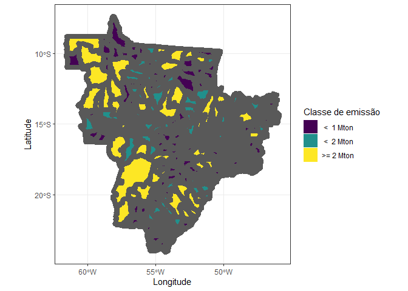<!-- -->

    #> 
    #> [[3]]

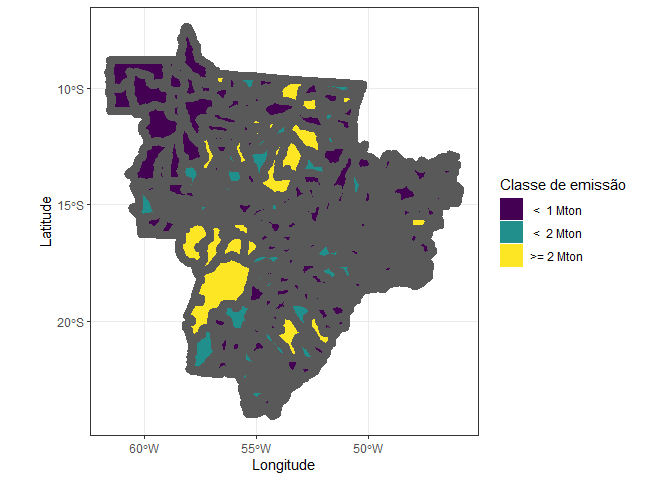<!-- -->

    #> 
    #> [[4]]

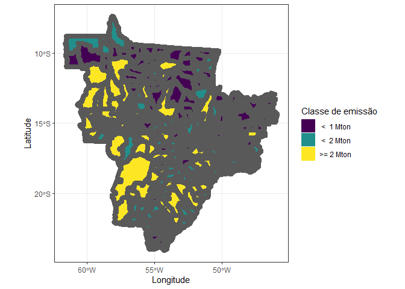<!-- -->

    #> 
    #> [[5]]

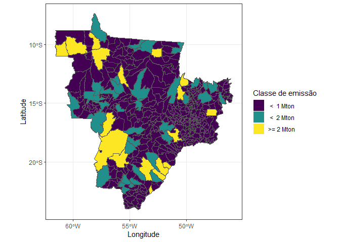<!-- -->

    #> 
    #> [[6]]

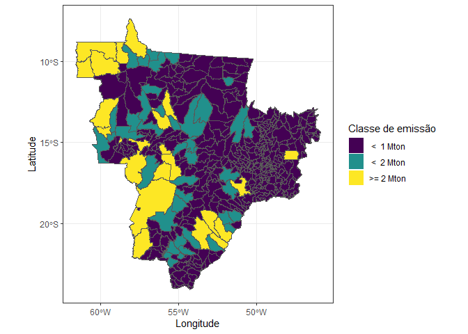<!-- -->

    #> 
    #> [[7]]

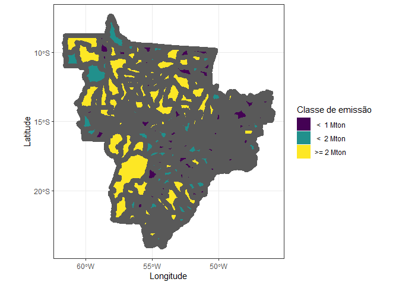<!-- -->

    #> 
    #> [[8]]

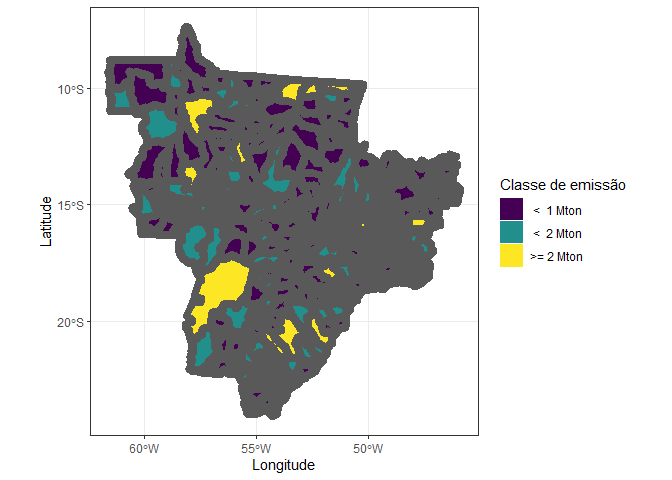<!-- -->

    #> 
    #> [[9]]

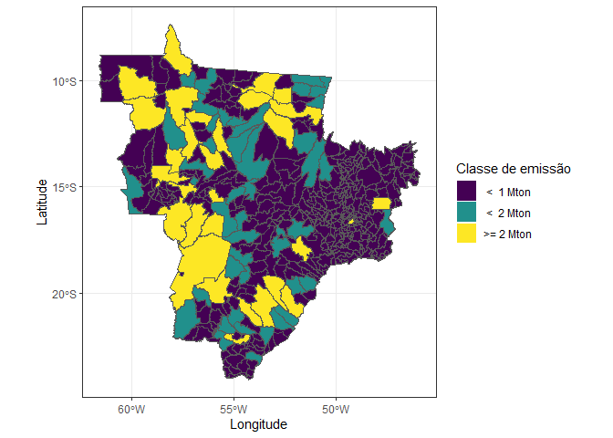<!-- -->

    #> 
    #> [[10]]

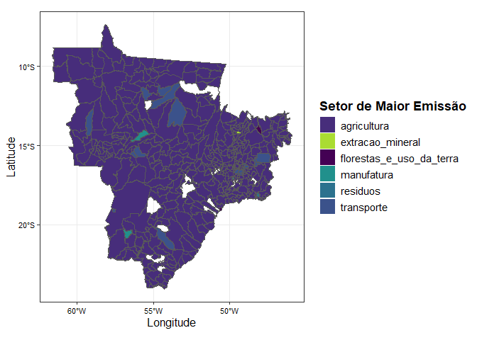<!-- --> \## 🗺️
SUBSETOR DE MAIOR EMISSÃO

``` r
# Padronizar cores, criando vetor
padr_cor <- base_completa_subset |> 
  select(degradacao_em_terras_florestais:tratamento_e_descarte_de_efluentes_industriais) |> 
  names()

# Paleta fixa 
cores_fixas <- viridis::viridis(length(padr_cor), option = "D")

map(2015:2024,~{municipality |> 
    mutate(
      name_muni = stri_trans_general(tolower(name_muni), "Latin-ASCII"),
      name_muni = trimws(name_muni)
    )  |> 
    filter(abbrev_state %in% my_states) |> 
    left_join(
      base_completa_subset |> 
        select(year:city_ref, degradacao_em_terras_florestais:tratamento_e_descarte_de_efluentes_industriais, -remocoes_de_carbono_sequestro) |>
        mutate(
          uso_liquido_de_terras_florestais = ifelse(uso_liquido_de_terras_florestais > 0, uso_liquido_de_terras_florestais, 0),
          uso_liquido_de_areas_arbustivas_e_gramineas = ifelse(uso_liquido_de_areas_arbustivas_e_gramineas > 0, uso_liquido_de_areas_arbustivas_e_gramineas, 0),
          uso_liquido_de_areas_umidas = ifelse(uso_liquido_de_areas_umidas > 0, uso_liquido_de_areas_umidas, 0)
        ) |> 
        filter(year == .x) |> 
        pivot_longer(
          cols = degradacao_em_terras_florestais:tratamento_e_descarte_de_efluentes_industriais,
          names_to = "subsetores",
          values_to = "emission"
        ) |> 
        group_by(year, city_ref) |> 
        mutate(
          max_emission = max(emission,na.rm = TRUE),
          s_max_emission = ifelse(emission == max_emission,subsetores,NA)
        ) |> 
        filter(!is.na(s_max_emission)) |> 
        rename(name_muni = city_ref),
      by = "name_muni") |> 
    drop_na() |> 
    ggplot() +
    geom_sf(aes(fill=s_max_emission), color="transparent",
            size=.05, show.legend = TRUE)  +
    geom_sf(data=municipality |> filter(abbrev_state %in% my_states), fill="transparent", size=3, show.legend = FALSE) +
    theme_bw()+
    theme(
      axis.text.x = element_text(size = rel(.9), color = "black"),
      axis.title.x = element_text(size = rel(1.1), color = "black"),
      axis.text.y = element_text(size = rel(.9), color = "black"),
      axis.title.y = element_text(size = rel(1.1), color = "black"),
      legend.text = element_text(size = rel(1), color = "black"),
      legend.title = element_text(face = 'bold', size = rel(1.2))
    ) +
    labs(fill = 'Subsetor de Maior Emissão',
         x = 'Longitude',
         y = 'Latitude') +
    scale_fill_manual(
      values = setNames(cores_fixas, padr_cor),
    )
  
})
#> [[1]]
```

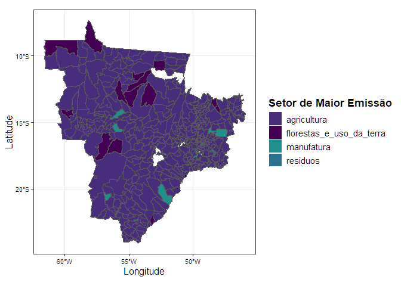<!-- -->

    #> 
    #> [[2]]

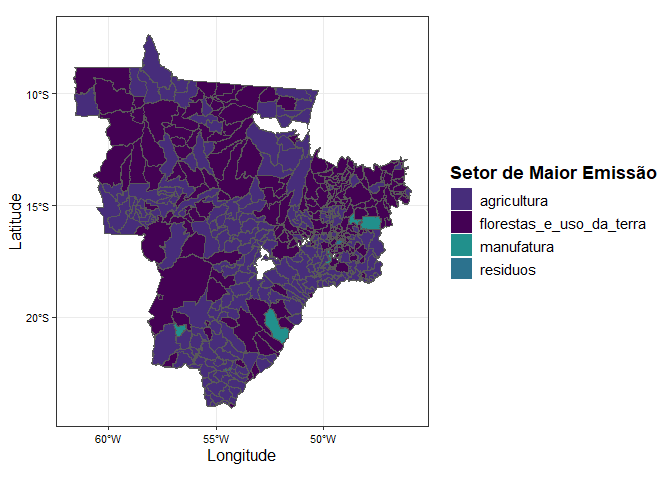<!-- -->

    #> 
    #> [[3]]

<!-- -->

    #> 
    #> [[4]]

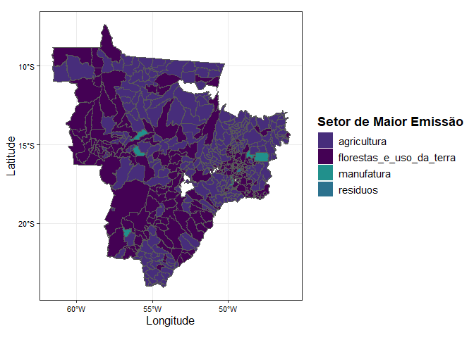<!-- -->

    #> 
    #> [[5]]

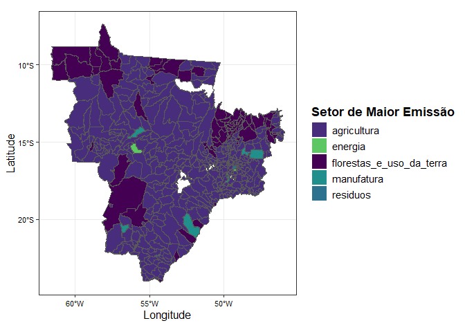<!-- -->

    #> 
    #> [[6]]

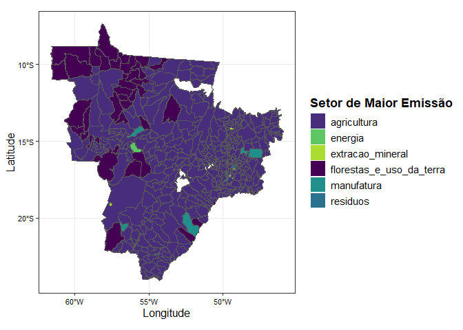<!-- -->

    #> 
    #> [[7]]

<!-- -->

    #> 
    #> [[8]]

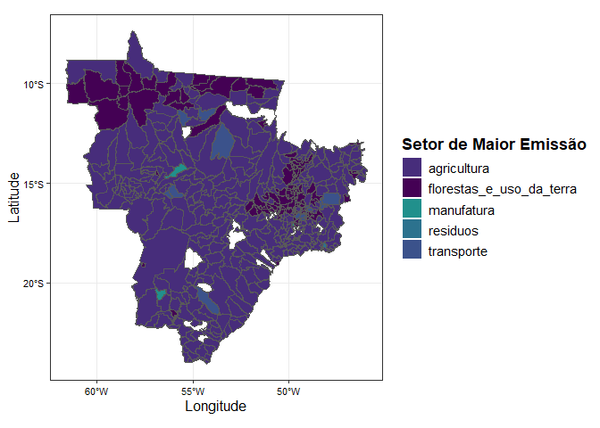<!-- -->

    #> 
    #> [[9]]

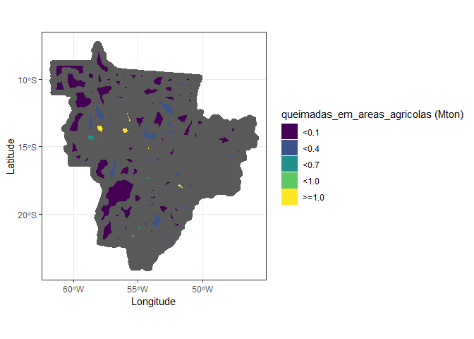<!-- -->

    #> 
    #> [[10]]

<!-- -->

## 🗺 Mapa de REMOÇÃO

Vale ressaltar que a nova metodologia do climate TRACE subdivide o
subsetor de *remocoes_de_carbono_sequestro* (as remoções) em 3 novos
subsetores:

*uso_liquido_de_terras_florestais*
*uso_liquido_de_areas_arbustivas_e_gramineas*
*uso_liquido_de_areas_umidas*

``` r
# Primeiramente, é necessário passar os valores da coluna "remocoes_de_carbono_sequestro" da nova base do climate TRACE para negativos, para tornar a análise visual entre os mapas iguais:
    # Tornando todos os valores absolutos positivos
      # base_completa_subset |>
      #   mutate(remocoes_de_carbono_sequestro = -abs(remocoes_de_carbono_sequestro)) |>  select(year,city_ref,remocoes_de_carbono_sequestro,uso_liquido_de_terras_florestais,uso_liquido_de_areas_arbustivas_e_gramineas,uso_liquido_de_areas_umidas)


map(2015:2024,~{municipality |> 
    mutate(
      name_muni = stri_trans_general(tolower(name_muni), "Latin-ASCII"),
      name_muni = trimws(name_muni)
    )  |> 
    filter(abbrev_state %in% my_states) |> 
    left_join(
      data.frame(
        base_completa_subset |> 
          mutate(remocoes_de_carbono_sequestro = -abs(remocoes_de_carbono_sequestro)) |> #valores absolutos negativos 
          filter(year == .x,
                 remocoes_de_carbono_sequestro <=0,
                 uso_liquido_de_terras_florestais<=0,
                 uso_liquido_de_areas_arbustivas_e_gramineas<=0,
                 uso_liquido_de_areas_umidas<=0) |> 
          pivot_longer(
            cols = c(remocoes_de_carbono_sequestro,uso_liquido_de_terras_florestais,uso_liquido_de_areas_arbustivas_e_gramineas,uso_liquido_de_areas_umidas),
            names_to = "subsector",
            values_to = "emission"
          ) |> 
          group_by(year, state, city_ref) |> 
          summarise(
            emission = sum(emission, na.rm = TRUE)
          ) |> 
          select(state:emission) |> 
          rename(name_muni = city_ref)
      ),by = "name_muni", relationship = "many-to-many"
    ) |> drop_na() |>      
    ggplot() +
    geom_sf(aes(fill=emission/1e6), color="transparent",
            size=.05, show.legend = TRUE)  +
    geom_sf(data=municipality |> filter(abbrev_state %in% my_states), fill="transparent", size=3, show.legend = FALSE) +
    theme_bw() +
    theme(
      axis.text.x = element_text(size = rel(.9), color = "black"),
      axis.title.x = element_text(size = rel(1.1), color = "black"),
      axis.text.y = element_text(size = rel(.9), color = "black"),
      axis.title.y = element_text(size = rel(1.1), color = "black"),
      legend.text = element_text(size = rel(1), color = "black"),
      legend.title = element_text(face = 'bold', size = rel(1.2))
    ) +
    labs(fill = 'Agrupamento',
         x = 'Longitude',
         y = 'Latitude') +
    scale_fill_viridis_c()})
#> [[1]]
```

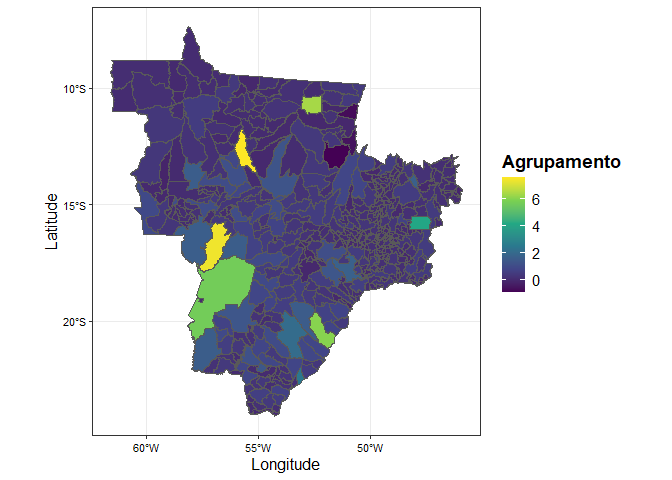<!-- -->

    #> 
    #> [[2]]

<!-- -->

    #> 
    #> [[3]]

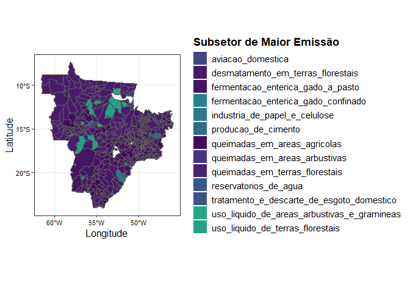<!-- -->

    #> 
    #> [[4]]

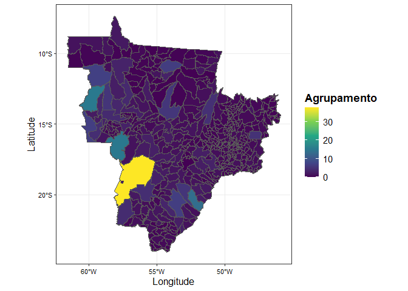<!-- -->

    #> 
    #> [[5]]

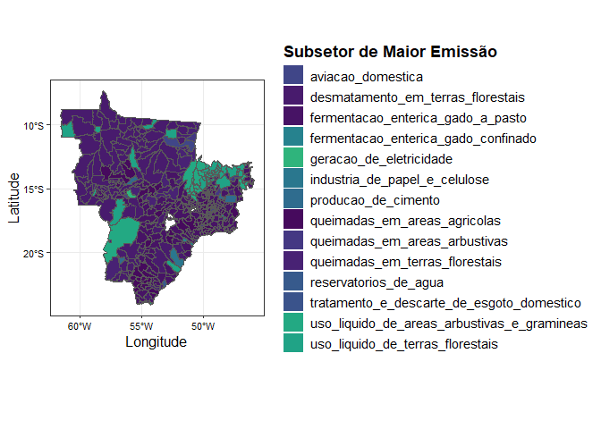<!-- -->

    #> 
    #> [[6]]

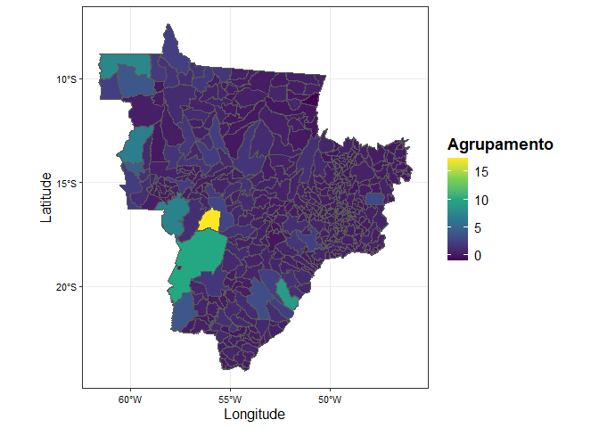<!-- -->

    #> 
    #> [[7]]

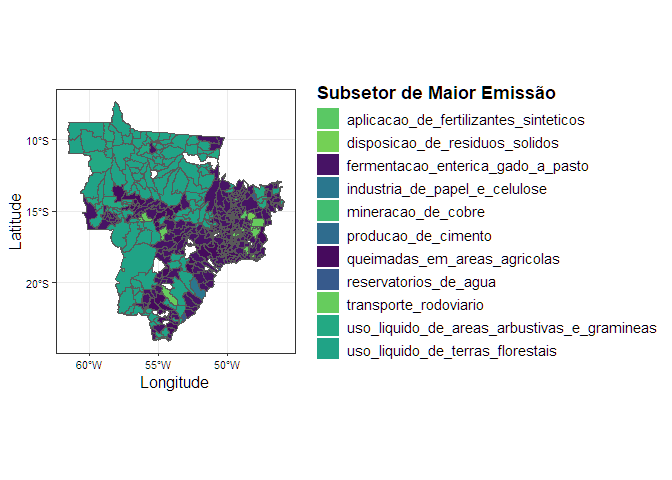<!-- -->

    #> 
    #> [[8]]

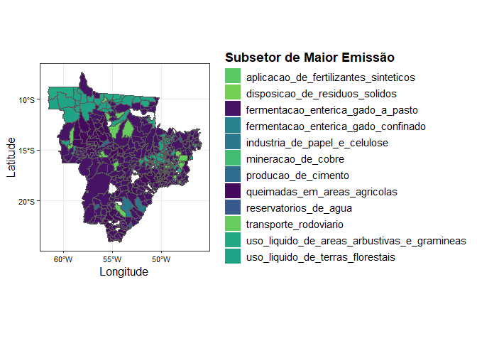<!-- -->

    #> 
    #> [[9]]

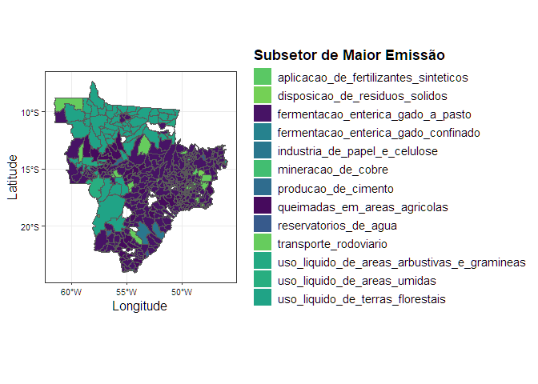<!-- -->

    #> 
    #> [[10]]

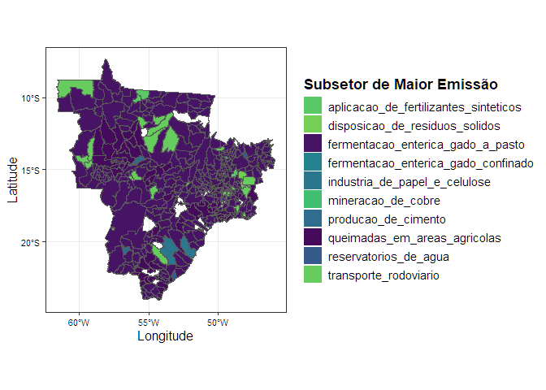<!-- -->

## Instruções - feitas ✅

1- Na incorporação retirar os subsetores (para não contar duas vezes) 2-
fazer a soma de emissão por setor 3- pivto_wider com as emissão para os
diferentes setores nas colunas
