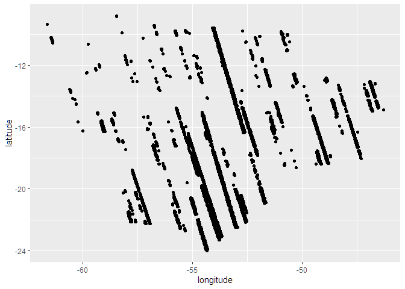
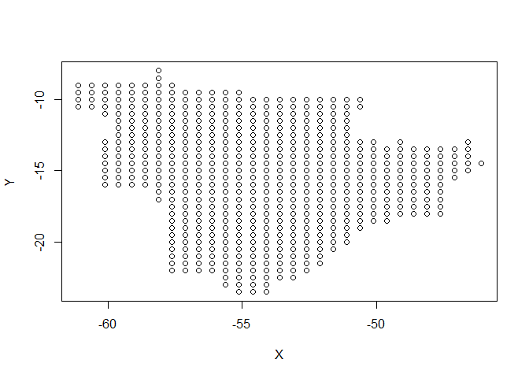

<!-- README.md is generated from README.Rmd. Please edit that file -->

# MODELAGEM COMPUTACIONAL DA CONCENTRAÇÃO ATMOSFÉRICA DE CO<sub>2</sub> e CH<sub>4</sub> NO BRASIL CENTRAL

**Resumo**: As mudanças climáticas globais são uma preocupação mundial
constante, sendo a principal causa o aumento da concentração de gases de
efeito estufa (GEE) na atmosfera, especialmente o dióxido de carbono
(CO<sub>2</sub>) e o metano (CH<sub>4</sub>). Para implementar medidas
eficientes de mitigação das emissões de GEE, é fundamental compreender a
dinâmica desses gases na atmosfera e estabelecer relações com outras
variáveis associadas ao sistema solo-planta-atmosfera. Nesse contexto,
diversos esforços têm sido realizados para aprimorar as técnicas de
monitoramento de GEE em escala global e regional. Esta proposta tem como
objetivo descrever a variabilidade espaçotemporal das concentrações
atmosféricas de CO<sub>2</sub> e CH<sub>4</sub> em áreas do Brasil
Central, identificando fontes e possíveis sumidouros desses gases ao
longo dos anos de 2015 a 2023. Serão adquiridos dados das concentrações
atmosféricas de CO<sub>2</sub> (X<sub>CO2</sub>) e CH<sub>4</sub>
(X<sub>CH4</sub>) a partir dos sensores orbitais GOSAT e OCO-2. Em
adição, dados das variáveis climáticas serão obtidos na plataforma da
Agência Espacial Americana (NASA). Para todos os setores emissores de
GEE, os dados serão obtidos a partir dos relatórios da plataforma
Climate TRACE, coalizão sem fins lucrativos capaz de rastrear e fornecer
informações sobre as emissões de GEE globalmente. A aquisição dos dados
será sistematizada para redução das diferenças entre as resoluções
espaciais dos dados de sensoriamento remoto, com posterior remoção da
tendência mundial de X<sub>CO2</sub> e X<sub>CH4</sub>. Para exploração
dos dados adquiridos, serão utilizadas técnicas exploratórias
multivariadas e análise geoestatística, implementadas em linguagem R. A
interrelação entre as variáveis analisadas será descrita por de
reconhecimento de padrão, que incluíram análises de agrupamento
hierárquico e não-hierárquico, análise de componentes principais
associadas aos padrões de variabilidade espacial. Espera-se que essa
abordagem contribua para melhorar a compreensão da dinâmica dos gases de
efeito estufa na atmosfera e suas interações com variáveis climáticas e
de uso da terra no Brasil Central, auxiliando na formulação de políticas
públicas voltadas para a mitigação das emissões de GEE e,
principalmente, a adaptação às mudanças climáticas.

**Objetivo**: Analisar a variabilidade espaçotemporal das concentrações
atmosféricas de CO<sub>2</sub> e CH<sub>4</sub> em áreas do Brasil
Central, identificando fontes e possíveis sumidouros desses gases ao
longo dos anos de 2015 a 2023, bem como suas relações com índices
vegetativos e climáticos, por meio de dados de GOSAT, OCO-2 e Climate
TRACE.

## 👨‍🔬 Autores

- **Pedro Henrique Marucio de Oliveira**  
  Graduando em Agronomia - FCAV/Unesp  
  Email: [pedro.marucio@unesp.br](mailto:pedro.marucio@unesp.b)

- **Prof. Dr. Alan Rodrigo Panosso**  
  Coorientador — Departamento de Ciências Exatas - FCAV/Unesp  
  Email: <alan.panosso@unesp.br>

## 📁 Etapas do Projeto

Os scripts abaixo foram desenvolvidos em RMarkdown e estão disponíveis
em formato HTML:

- **Aquisição e download dos dados brutos**
  - [GOSAT](https://data.ceda.ac.uk/neodc/gosat/data/ch4/nceov1.0/CH4_GOS_OCPR/):
    Dados de concentração de CH<sub>4</sub> 2009 a 2021  
  - [OCO-2](https://disc.gsfc.nasa.gov): Dados de concentração de
    XCO<sub>2</sub>
    (<https://disc.gsfc.nasa.gov/datasets/OCO2_L2_Lite_FP_11.2r/summary?keywords=OCO2>)
    e SIF (<a
    href="https://disc.gsfc.nasa.gov/datasets/OCO2_L2_Lite_SIF_11r/summary?keywords=OCO2\"
    class="uri">https://disc.gsfc.nasa.gov/datasets/OCO2_L2_Lite_SIF_11r/summary?keywords=OCO2\</a>
  - [Climate TRACE](https://climatetrace.org/): Dados de emissões de GEE
    de 2015 a 2022  
  - [AppEEARS](https://appeears.earthdatacloud.nasa.gov/task/point):
    Variáveis climáticas e vegetativas  
  - [NASA](https://climate.nasa.gov/): Dados climáticos  
  - [NASA-FIRMS](https://firms.modaps.eosdis.nasa.gov): Dados de focos
    de incêndio de 2015 to 2025  
  - [BDQUEIMADAS](https://terrabrasilis.dpi.inpe.br/queimadas/bdqueimadas/#exportar-dados):
    Dados de focos de incêndio de 2015 a 2025  
  - [DETER](https://terrabrasilis.dpi.inpe.br/downloads/): Dados de
    focos de fogo (cicatriz de queimadas)  
  - [Programa Queimadas - INPE - Plataforma
    Terrabrasilis](https://terrabrasilis.dpi.inpe.br/queimadas/portal/):
    Dados de focos de queimadas x Supressão da vegetação nativa de
    08/2018 a 01/2025 & Dados de focos de fogo ativo de 1998 a
    21/01/2025  
  - [Desmatamento - INPE - PRODES - Plataforma
    Terrabrasilis](https://terrabrasilis.dpi.inpe.br/geonetwork/srv/eng/catalog.search#/metadata/fe02f2bf-2cc0-49d5-ab72-a3954f997408):
    Dados sobre desmatamento de 31/07/2000 a 30/07/2023  
  - [nasapower](https://power.larc.nasa.gov/): Variáveis climáticas
    (Temperatura; precipitação; radiação solar; umidade relativa;
    velocidade do vento e pressão) de 2015 a 2024  

## 🧹 Faxina e Tratamento [script_geral](https://arpanosso.github.io//projeto-oliveiraphm//01_faxina_tratamento_dados.html)

Nessa etapa foi realizada a faxina, filtragem e organização inicial dos
dados. Os dados de concentração atmosférica de dióxido de carbono (XCO2)
e metano (XCH4) foram devidamente processados e filtrados para o
território brasileiro, incluindo:

Filtro geográfico (apenas medições dentro do Brasil);  
Controle de qualidade (baseado nos flags de qualidade dos dados
originais);  
Organização por regiões (Norte, Nordeste, Sudeste, Sul e Centro-Oeste);

### 🔗 Scripts de tratamentos e Links para Download dos dados processados:

| Script de Tratamento | Dados Processados Para Download |
|:--:|:--:|
| [nasa-xco2](https://arpanosso.github.io//projeto-oliveiraphm//nasa-xco2.html) | ⬇️ [nasa-xco2.rds](https://drive.google.com/file/d/1sVsLvBLxUB1YbqWyDUg177Eua2oREvgH/view?usp=sharing) |
| [gosat-xch4](https://arpanosso.github.io//projeto-oliveiraphm//gosat-xch4.html) | ⬇️ [gosat-xch4.rds](https://drive.google.com/file/d/1Rj-jcHOblEEb1ARMyJ1Jyfo4wCJnGliB/view?usp=drive_link) |
| [oco2-sif](https://arpanosso.github.io//projeto-oliveiraphm//oco2-sif.html) | ⬇️ [oco2-sif.rds](https://drive.google.com/file/d/1Y64vA2y1q_3kG3SIAKNO2DqyaL6WJC2A/view?usp=sharing) |
| [appeears-modis](https://arpanosso.github.io//projeto-oliveiraphm//appeears-modis.html) | ⬇️ [appeears-modis.rds](https://drive.google.com/file/d/15bpg2r2_XSWveyWrFu6oumt79UUlxzJr/view?usp=sharing) |
| [emissions-sources](https://arpanosso.github.io//projeto-oliveiraphm//emissions-sources.html) | ⬇️ [emissions-sources.rds](https://drive.google.com/file/d/17erldRlIlTiB5sVtLWjsv4E--zZ3gmH-/view?usp=sharing) |
| [nasa-power](https://arpanosso.github.io//projeto-oliveiraphm//nasa-xco2.html) | ⬇️ [nasa-power.rds](https://drive.google.com/file/d/13_PR3bQ9-ga_Wiv7jEv-GhYpAJwhmyTN/view?usp=sharing) |
| [prodes-deforestation](https://arpanosso.github.io//projeto-oliveiraphm//prodes-deforestation.html) | ⬇️ [prodes-deforestation.rds](https://drive.google.com/file/d/1X4KJ_XK3GRcrwNCwWVEihJQBMGb72Z3S/view?usp=sharing) |
| [deter-queimadas](https://arpanosso.github.io//projeto-oliveiraphm//deter-queimadas.html) | ⬇️ [deter-queimadas.rds](https://drive.google.com/file/d/1cmikkge6MtLJXuPBYeV-ZuMYoaNKP967/view?usp=sharing) |

Formato dos arquivos:

> .rds (formato nativo do R para rápido carregamento)

> salve os arquivos na pasta `data` do seu projeto

### 🛠️ Pré-processameto [script](https://arpanosso.github.io//projeto-oliveiraphm//02_preprocessamento.html)

### 🛠 Preparação dos dados para análise.

``` r
library(tidyverse)
states <- geobr::read_state(showProgress = FALSE)
biomes <- geobr::read_biomes(showProgress = FALSE)
conservation <- geobr::read_conservation_units(showProgress = FALSE)
indigenous <- geobr::read_indigenous_land(showProgress = FALSE)
municipality <- geobr::read_municipality(showProgress = FALSE)

source("R/my-function.R")
#> List of polygons loaded [list_pol]
```

#### Entrada com a Base: `emissions-sources.rds`

``` r
my_states <- c("MS","MT","GO","DF")
emissions_sources <- read_rds("data/emissions-sources.rds")|> 
  filter(sigla_uf %in% my_states)
glimpse(emissions_sources)
#> Rows: 265,375
#> Columns: 32
#> $ source_id                 <int> 10812934, 10812934, 10812934, 10812934, 1081…
#> $ source_name               <chr> "Abadia de Goiás", "Abadia de Goiás", "Abadi…
#> $ source_type               <chr> NA, NA, NA, NA, NA, NA, NA, NA, NA, NA, NA, …
#> $ iso3_country              <chr> "BRA", "BRA", "BRA", "BRA", "BRA", "BRA", "B…
#> $ original_inventory_sector <chr> "cropland-fires", "cropland-fires", "croplan…
#> $ start_time                <date> 2015-01-01, 2015-01-01, 2015-01-01, 2015-01…
#> $ end_time                  <date> 2015-12-31, 2015-12-31, 2015-12-31, 2015-12…
#> $ lat                       <dbl> -16.78557, -16.78557, -16.78557, -16.78557, …
#> $ lon                       <dbl> -49.4521, -49.4521, -49.4521, -49.4521, -49.…
#> $ geometry_ref              <chr> "gadm_BRA.9.1_2", "gadm_BRA.9.1_2", "gadm_BR…
#> $ gas                       <chr> "ch4", "co2", "co2e_100yr", "co2e_20yr", "n2…
#> $ emissions_quantity        <dbl> 1.469264e+00, 8.244216e+02, 8.747847e+02, 9.…
#> $ temporal_granularity      <chr> "annual", "annual", "annual", "annual", "ann…
#> $ created_date              <date> 2023-10-06, 2023-10-06, 2023-10-06, 2023-10…
#> $ modified_date             <date> NA, NA, NA, NA, NA, NA, NA, NA, NA, NA, NA,…
#> $ directory                 <chr> "data-raw/BRA/agriculture/cropland-fires_emi…
#> $ activity                  <dbl> NA, NA, NA, NA, NA, NA, NA, NA, NA, NA, NA, …
#> $ activity_units            <chr> NA, NA, NA, NA, NA, NA, NA, NA, NA, NA, NA, …
#> $ emissions_factor          <dbl> NA, NA, NA, NA, NA, NA, NA, NA, NA, NA, NA, …
#> $ emissions_factor_units    <chr> NA, NA, NA, NA, NA, NA, NA, NA, NA, NA, NA, …
#> $ capacity                  <dbl> NA, NA, NA, NA, NA, NA, NA, NA, NA, NA, NA, …
#> $ capacity_units            <chr> NA, NA, NA, NA, NA, NA, NA, NA, NA, NA, NA, …
#> $ capacity_factor           <dbl> NA, NA, NA, NA, NA, NA, NA, NA, NA, NA, NA, …
#> $ year                      <dbl> 2015, 2015, 2015, 2015, 2015, 2016, 2016, 20…
#> $ sector_name               <chr> "agriculture", "agriculture", "agriculture",…
#> $ sub_sector                <chr> "cropland-fires", "cropland-fires", "croplan…
#> $ sigla_uf                  <chr> "GO", "GO", "GO", "GO", "GO", "GO", "GO", "G…
#> $ nome_regiao               <chr> "Centro-Oeste", "Centro-Oeste", "Centro-Oest…
#> $ biome                     <chr> "CERR", "CERR", "CERR", "CERR", "CERR", "CER…
#> $ flag_indigenous           <lgl> FALSE, FALSE, FALSE, FALSE, FALSE, FALSE, FA…
#> $ flag_conservation         <lgl> FALSE, FALSE, FALSE, FALSE, FALSE, FALSE, FA…
#> $ city_ref                  <chr> "Abadia De Goiás", "Abadia De Goiás", "Abadi…
```

#### Entrada com a Base: `nasa-xco2.rds`

``` r
nasa_xco2 <- read_rds("data/nasa-xco2.rds") |> 
  filter(state %in% my_states)
glimpse(nasa_xco2)
#> Rows: 378,473
#> Columns: 15
#> $ longitude         <dbl> -53.55216, -53.53052, -53.58393, -53.57360, -53.5886…
#> $ latitude          <dbl> -17.78172, -17.66517, -17.64105, -17.55926, -17.4514…
#> $ time              <dbl> 1410110439, 1410110440, 1410110441, 1410110442, 1410…
#> $ date              <date> 2014-09-07, 2014-09-07, 2014-09-07, 2014-09-07, 201…
#> $ year              <dbl> 2014, 2014, 2014, 2014, 2014, 2014, 2014, 2014, 2014…
#> $ month             <dbl> 9, 9, 9, 9, 9, 9, 9, 9, 9, 9, 9, 9, 9, 9, 9, 9, 9, 9…
#> $ day               <int> 7, 7, 7, 7, 7, 7, 7, 7, 7, 7, 7, 7, 7, 7, 7, 7, 7, 7…
#> $ xco2              <dbl> 397.6308, 400.0303, 397.4599, 397.8412, 397.5515, 39…
#> $ xco2_quality_flag <int> 0, 0, 0, 0, 0, 0, 0, 0, 0, 0, 0, 0, 0, 0, 0, 0, 0, 0…
#> $ xco2_incerteza    <dbl> 0.5256661, 0.6178920, 0.5998411, 0.5249712, 0.551944…
#> $ path              <chr> "oco2_LtCO2_140907_B11100Ar_230523232629s.nc4", "oco…
#> $ flag_br           <lgl> TRUE, TRUE, TRUE, TRUE, TRUE, TRUE, TRUE, TRUE, TRUE…
#> $ flag_nordeste     <lgl> FALSE, FALSE, FALSE, FALSE, FALSE, FALSE, FALSE, FAL…
#> $ state             <chr> "MT", "MT", "MT", "MT", "MT", "MT", "MT", "MT", "MT"…
#> $ city_ref          <chr> "Alto Araguaia", "Alto Araguaia", "Alto Araguaia", "…
```

``` r
nasa_xco2 |> 
  filter(year == 2014) |> 
  ggplot(aes(x=longitude,y=latitude)) +
  geom_point()
```

<!-- -->

#### Filtrando os polígonos do municípios

``` r
munici_state <- municipality |> 
  filter(abbrev_state %in% my_states)
```

#### Classificando cada ponto em município

``` r
resul <- vector()

# estado <- nasa_xco2$state
# for(i in 1:nrow(nasa_xco2)){
#   if(estado[i]!="Other"){
#     my_citys_obj <- municipality %>%
#       filter(abbrev_state == estado[i])
#     n_citys <- nrow(my_citys_obj)
#     my_citys_names <- my_citys_obj %>% pull(name_muni)
#     resul[i] <- "Other"
#     for(j in 1:n_citys){
#       pol_city <- my_citys_obj$geom  %>%
#         purrr::pluck(j) %>%
#         as.matrix()
#       if(def_pol(nasa_xco2$longitude[i],
#                  nasa_xco2$latitude[i],
#                  pol_city)){
#         resul[i] <- my_citys_names[j]
#       }
#     }
#   }
# }
# nasa_xco2$city_ref <- resul
# write_rds(nasa_xco2,"data/nasa-xco2.rds")
```

``` r
my_year = 2022
municipality |> 
  filter(abbrev_state %in% my_states) |> 
  left_join(
    nasa_xco2 |> 
      group_by(year, city_ref) |> 
      summarise(
        xco2 = mean(xco2,na.rm=TRUE),
        .groups = "drop"
      ) |> 
      rename(  name_muni = city_ref),
    by = c("name_muni")
  ) |> 
  filter(year == my_year) |> 
  ggplot()  +
  geom_sf(aes(fill=xco2), color="transparent",
          size=.05, show.legend = TRUE)  +
  geom_point(data = nasa_xco2 |> 
               filter(year==my_year), 
               aes(longitude, latitude, #size = emission,
                   color="red"))+
  theme_bw() +
  theme(
    axis.text.x = element_text(size = rel(.9), color = "black"),
    axis.title.x = element_text(size = rel(1.1), color = "black"),
    axis.text.y = element_text(size = rel(.9), color = "black"),
    axis.title.y = element_text(size = rel(1.1), color = "black"),
    legend.text = element_text(size = rel(1), color = "black"),
    legend.title = element_text(face = 'bold', size = rel(1.2))
  ) +
  labs(fill = 'xco2',
       x = 'Longitude',
       y = 'Latitude') +
  scale_fill_viridis_c()
```

<!-- -->
