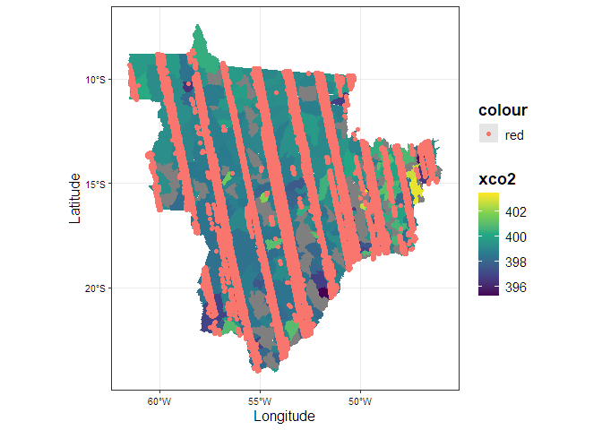
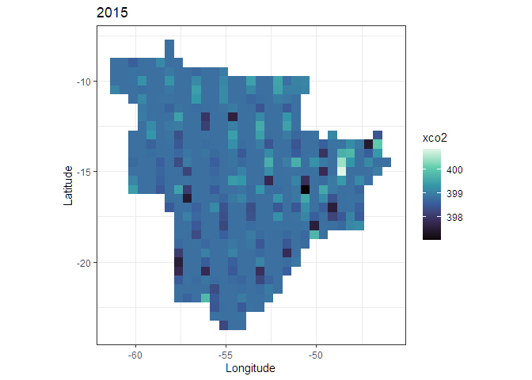

<!-- README.md is generated from README.Rmd. Please edit that file -->

# MODELAGEM COMPUTACIONAL DA CONCENTRAÇÃO ATMOSFÉRICA DE CO<sub>2</sub> e CH<sub>4</sub> NO BRASIL CENTRAL

**Resumo**: As mudanças climáticas globais são uma preocupação mundial
constante, sendo a principal causa o aumento da concentração de gases de
efeito estufa (GEE) na atmosfera, especialmente o dióxido de carbono
(CO<sub>2</sub>) e o metano (CH<sub>4</sub>). Para implementar medidas
eficientes de mitigação das emissões de GEE, é fundamental compreender a
dinâmica desses gases na atmosfera e estabelecer relações com outras
variáveis associadas ao sistema solo-planta-atmosfera. Nesse contexto,
diversos esforços têm sido realizados para aprimorar as técnicas de
monitoramento de GEE em escala global e regional. Esta proposta tem como
objetivo descrever a variabilidade espaçotemporal das concentrações
atmosféricas de CO<sub>2</sub> e CH<sub>4</sub> em áreas do Brasil
Central, identificando fontes e possíveis sumidouros desses gases ao
longo dos anos de 2015 a 2023. Serão adquiridos dados das concentrações
atmosféricas de CO<sub>2</sub> (X<sub>CO2</sub>) e CH<sub>4</sub>
(X<sub>CH4</sub>) a partir dos sensores orbitais GOSAT e OCO-2. Em
adição, dados das variáveis climáticas serão obtidos na plataforma da
Agência Espacial Americana (NASA). Para todos os setores emissores de
GEE, os dados serão obtidos a partir dos relatórios da plataforma
Climate TRACE, coalizão sem fins lucrativos capaz de rastrear e fornecer
informações sobre as emissões de GEE globalmente. A aquisição dos dados
será sistematizada para redução das diferenças entre as resoluções
espaciais dos dados de sensoriamento remoto, com posterior remoção da
tendência mundial de X<sub>CO2</sub> e X<sub>CH4</sub>. Para exploração
dos dados adquiridos, serão utilizadas técnicas exploratórias
multivariadas e análise geoestatística, implementadas em linguagem R. A
interrelação entre as variáveis analisadas será descrita por de
reconhecimento de padrão, que incluíram análises de agrupamento
hierárquico e não-hierárquico, análise de componentes principais
associadas aos padrões de variabilidade espacial. Espera-se que essa
abordagem contribua para melhorar a compreensão da dinâmica dos gases de
efeito estufa na atmosfera e suas interações com variáveis climáticas e
de uso da terra no Brasil Central, auxiliando na formulação de políticas
públicas voltadas para a mitigação das emissões de GEE e,
principalmente, a adaptação às mudanças climáticas.

**Objetivo**: Analisar a variabilidade espaçotemporal das concentrações
atmosféricas de CO<sub>2</sub> e CH<sub>4</sub> em áreas do Brasil
Central, identificando fontes e possíveis sumidouros desses gases ao
longo dos anos de 2015 a 2023, bem como suas relações com índices
vegetativos e climáticos, por meio de dados de GOSAT, OCO-2 e Climate
TRACE.

## 👨‍🔬 Autores

- **Pedro Henrique Marucio de Oliveira**  
  Graduando em Agronomia - FCAV/Unesp  
  Email: [pedro.marucio@unesp.br](mailto:pedro.marucio@unesp.b)

- **Prof. Dr. Alan Rodrigo Panosso**  
  Coorientador — Departamento de Ciências Exatas - FCAV/Unesp  
  Email: <alan.panosso@unesp.br>

## 📁 Etapas do Projeto

Os scripts abaixo foram desenvolvidos em RMarkdown e estão disponíveis
em formato HTML:

- **Aquisição e download dos dados brutos**
  - [GOSAT](https://data.ceda.ac.uk/neodc/gosat/data/ch4/nceov1.0/CH4_GOS_OCPR/):
    Dados de concentração de CH<sub>4</sub> 2009 a 2021  
  - [OCO-2](https://disc.gsfc.nasa.gov): Dados de concentração de
    XCO<sub>2</sub>
    (<https://disc.gsfc.nasa.gov/datasets/OCO2_L2_Lite_FP_11.2r/summary?keywords=OCO2>)
    e SIF (<a
    href="https://disc.gsfc.nasa.gov/datasets/OCO2_L2_Lite_SIF_11r/summary?keywords=OCO2\"
    class="uri">https://disc.gsfc.nasa.gov/datasets/OCO2_L2_Lite_SIF_11r/summary?keywords=OCO2\</a>
  - [Climate TRACE](https://climatetrace.org/): Dados de emissões de GEE
    de 2015 a 2022  
  - [AppEEARS](https://appeears.earthdatacloud.nasa.gov/task/point):
    Variáveis climáticas e vegetativas  
  - [NASA](https://climate.nasa.gov/): Dados climáticos  
  - [NASA-FIRMS](https://firms.modaps.eosdis.nasa.gov): Dados de focos
    de incêndio de 2015 to 2025  
  - [BDQUEIMADAS](https://terrabrasilis.dpi.inpe.br/queimadas/bdqueimadas/#exportar-dados):
    Dados de focos de incêndio de 2015 a 2025  
  - [DETER](https://terrabrasilis.dpi.inpe.br/downloads/): Dados de
    focos de fogo (cicatriz de queimadas)  
  - [Programa Queimadas - INPE - Plataforma
    Terrabrasilis](https://terrabrasilis.dpi.inpe.br/queimadas/portal/):
    Dados de focos de queimadas x Supressão da vegetação nativa de
    08/2018 a 01/2025 & Dados de focos de fogo ativo de 1998 a
    21/01/2025  
  - [Desmatamento - INPE - PRODES - Plataforma
    Terrabrasilis](https://terrabrasilis.dpi.inpe.br/geonetwork/srv/eng/catalog.search#/metadata/fe02f2bf-2cc0-49d5-ab72-a3954f997408):
    Dados sobre desmatamento de 31/07/2000 a 30/07/2023  
  - [nasapower](https://power.larc.nasa.gov/): Variáveis climáticas
    (Temperatura; precipitação; radiação solar; umidade relativa;
    velocidade do vento e pressão) de 2015 a 2024  

## 🧹 Faxina e Tratamento [script_geral](https://arpanosso.github.io//projeto-oliveiraphm//01_faxina_tratamento_dados.html)

Nessa etapa foi realizada a faxina, filtragem e organização inicial dos
dados. Os dados de concentração atmosférica de dióxido de carbono (XCO2)
e metano (XCH4) foram devidamente processados e filtrados para o
território brasileiro, incluindo:

Filtro geográfico (apenas medições dentro do Brasil);  
Controle de qualidade (baseado nos flags de qualidade dos dados
originais);  
Organização por regiões (Norte, Nordeste, Sudeste, Sul e Centro-Oeste);

### 🔗 Scripts de tratamentos e Links para Download dos dados processados:

| Script de Tratamento | Dados Processados Para Download |
|:--:|:--:|
| [nasa-xco2](https://arpanosso.github.io//projeto-oliveiraphm//nasa-xco2.html) | ⬇️ [nasa-xco2.rds](https://drive.google.com/file/d/1sVsLvBLxUB1YbqWyDUg177Eua2oREvgH/view?usp=sharing) |
| [gosat-xch4](https://arpanosso.github.io//projeto-oliveiraphm//gosat-xch4.html) | ⬇️ [gosat-xch4.rds](https://drive.google.com/file/d/1Rj-jcHOblEEb1ARMyJ1Jyfo4wCJnGliB/view?usp=drive_link) |
| [oco2-sif](https://arpanosso.github.io//projeto-oliveiraphm//oco2-sif.html) | ⬇️ [oco2-sif.rds](https://drive.google.com/file/d/1Y64vA2y1q_3kG3SIAKNO2DqyaL6WJC2A/view?usp=sharing) |
| [appeears-modis](https://arpanosso.github.io//projeto-oliveiraphm//appeears-modis.html) | ⬇️ [appeears-modis.rds](https://drive.google.com/file/d/15bpg2r2_XSWveyWrFu6oumt79UUlxzJr/view?usp=sharing) |
| [emissions-sources](https://arpanosso.github.io//projeto-oliveiraphm//emissions-sources.html) | ⬇️ [emissions-sources.rds](https://drive.google.com/file/d/17erldRlIlTiB5sVtLWjsv4E--zZ3gmH-/view?usp=sharing) |
| [nasa-power](https://arpanosso.github.io//projeto-oliveiraphm//nasa-xco2.html) | ⬇️ [nasa-power.rds](https://drive.google.com/file/d/13_PR3bQ9-ga_Wiv7jEv-GhYpAJwhmyTN/view?usp=sharing) |
| [prodes-deforestation](https://arpanosso.github.io//projeto-oliveiraphm//prodes-deforestation.html) | ⬇️ [prodes-deforestation.rds](https://drive.google.com/file/d/1X4KJ_XK3GRcrwNCwWVEihJQBMGb72Z3S/view?usp=sharing) |
| [deter-queimadas](https://arpanosso.github.io//projeto-oliveiraphm//deter-queimadas.html) | ⬇️ [deter-queimadas.rds](https://drive.google.com/file/d/1cmikkge6MtLJXuPBYeV-ZuMYoaNKP967/view?usp=sharing) |
| [nasa-firms](https://arpanosso.github.io//projeto-oliveiraphm//nasa-firms.html) | ⬇️ [nasa-firms.rds](https://drive.google.com/file/d/1aMsbg35-QRBs-xiS8jl6lQ6feUySxM3e/view?usp=sharing) |

Formato dos arquivos:

> .rds (formato nativo do R para rápido carregamento)

> salve os arquivos na pasta `data` do seu projeto

### 🛠️ Pré-processameto [script](https://arpanosso.github.io//projeto-oliveiraphm//02_preprocessamento.html)

### 🛠 Preparação dos dados para análise.

``` r
library(tidyverse)
library(ggridges)
library(ggpubr)
library(geobr)
library(gstat)
library(vegan)
source("R/my-function.R")
#> List of polygons loaded [list_pol]
```

#### Entrada com a Base: `emissions-sources.rds`

``` r
my_states <- c("MS","MT","GO","DF")
emissions_sources <- read_rds("data/emissions-sources.rds")|> 
  filter(sigla_uf %in% my_states)
glimpse(emissions_sources)
#> Rows: 265,375
#> Columns: 32
#> $ source_id                 <int> 10812934, 10812934, 10812934, 10812934, 1081…
#> $ source_name               <chr> "Abadia de Goiás", "Abadia de Goiás", "Abadi…
#> $ source_type               <chr> NA, NA, NA, NA, NA, NA, NA, NA, NA, NA, NA, …
#> $ iso3_country              <chr> "BRA", "BRA", "BRA", "BRA", "BRA", "BRA", "B…
#> $ original_inventory_sector <chr> "cropland-fires", "cropland-fires", "croplan…
#> $ start_time                <date> 2015-01-01, 2015-01-01, 2015-01-01, 2015-01…
#> $ end_time                  <date> 2015-12-31, 2015-12-31, 2015-12-31, 2015-12…
#> $ lat                       <dbl> -16.78557, -16.78557, -16.78557, -16.78557, …
#> $ lon                       <dbl> -49.4521, -49.4521, -49.4521, -49.4521, -49.…
#> $ geometry_ref              <chr> "gadm_BRA.9.1_2", "gadm_BRA.9.1_2", "gadm_BR…
#> $ gas                       <chr> "ch4", "co2", "co2e_100yr", "co2e_20yr", "n2…
#> $ emissions_quantity        <dbl> 1.469264e+00, 8.244216e+02, 8.747847e+02, 9.…
#> $ temporal_granularity      <chr> "annual", "annual", "annual", "annual", "ann…
#> $ created_date              <date> 2023-10-06, 2023-10-06, 2023-10-06, 2023-10…
#> $ modified_date             <date> NA, NA, NA, NA, NA, NA, NA, NA, NA, NA, NA,…
#> $ directory                 <chr> "data-raw/BRA/agriculture/cropland-fires_emi…
#> $ activity                  <dbl> NA, NA, NA, NA, NA, NA, NA, NA, NA, NA, NA, …
#> $ activity_units            <chr> NA, NA, NA, NA, NA, NA, NA, NA, NA, NA, NA, …
#> $ emissions_factor          <dbl> NA, NA, NA, NA, NA, NA, NA, NA, NA, NA, NA, …
#> $ emissions_factor_units    <chr> NA, NA, NA, NA, NA, NA, NA, NA, NA, NA, NA, …
#> $ capacity                  <dbl> NA, NA, NA, NA, NA, NA, NA, NA, NA, NA, NA, …
#> $ capacity_units            <chr> NA, NA, NA, NA, NA, NA, NA, NA, NA, NA, NA, …
#> $ capacity_factor           <dbl> NA, NA, NA, NA, NA, NA, NA, NA, NA, NA, NA, …
#> $ year                      <dbl> 2015, 2015, 2015, 2015, 2015, 2016, 2016, 20…
#> $ sector_name               <chr> "agriculture", "agriculture", "agriculture",…
#> $ sub_sector                <chr> "cropland-fires", "cropland-fires", "croplan…
#> $ sigla_uf                  <chr> "GO", "GO", "GO", "GO", "GO", "GO", "GO", "G…
#> $ nome_regiao               <chr> "Centro-Oeste", "Centro-Oeste", "Centro-Oest…
#> $ biome                     <chr> "CERR", "CERR", "CERR", "CERR", "CERR", "CER…
#> $ flag_indigenous           <lgl> FALSE, FALSE, FALSE, FALSE, FALSE, FALSE, FA…
#> $ flag_conservation         <lgl> FALSE, FALSE, FALSE, FALSE, FALSE, FALSE, FA…
#> $ city_ref                  <chr> "Abadia De Goiás", "Abadia De Goiás", "Abadi…
```

#### Entrada com a Base: `nasa-xco2.rds`

``` r
nasa_xco2 <- read_rds("data/nasa-xco2.rds") |> 
  filter(state %in% my_states)
glimpse(nasa_xco2)
#> Rows: 378,473
#> Columns: 15
#> $ longitude         <dbl> -53.55216, -53.53052, -53.58393, -53.57360, -53.5886…
#> $ latitude          <dbl> -17.78172, -17.66517, -17.64105, -17.55926, -17.4514…
#> $ time              <dbl> 1410110439, 1410110440, 1410110441, 1410110442, 1410…
#> $ date              <date> 2014-09-07, 2014-09-07, 2014-09-07, 2014-09-07, 201…
#> $ year              <dbl> 2014, 2014, 2014, 2014, 2014, 2014, 2014, 2014, 2014…
#> $ month             <dbl> 9, 9, 9, 9, 9, 9, 9, 9, 9, 9, 9, 9, 9, 9, 9, 9, 9, 9…
#> $ day               <int> 7, 7, 7, 7, 7, 7, 7, 7, 7, 7, 7, 7, 7, 7, 7, 7, 7, 7…
#> $ xco2              <dbl> 397.6308, 400.0303, 397.4599, 397.8412, 397.5515, 39…
#> $ xco2_quality_flag <int> 0, 0, 0, 0, 0, 0, 0, 0, 0, 0, 0, 0, 0, 0, 0, 0, 0, 0…
#> $ xco2_incerteza    <dbl> 0.5256661, 0.6178920, 0.5998411, 0.5249712, 0.551944…
#> $ path              <chr> "oco2_LtCO2_140907_B11100Ar_230523232629s.nc4", "oco…
#> $ flag_br           <lgl> TRUE, TRUE, TRUE, TRUE, TRUE, TRUE, TRUE, TRUE, TRUE…
#> $ flag_nordeste     <lgl> FALSE, FALSE, FALSE, FALSE, FALSE, FALSE, FALSE, FAL…
#> $ state             <chr> "MT", "MT", "MT", "MT", "MT", "MT", "MT", "MT", "MT"…
#> $ city_ref          <chr> "Alto Araguaia", "Alto Araguaia", "Alto Araguaia", "…
```

#### Filtrando os polígonos do municípios

``` r
munici_state <- municipality |> 
  filter(abbrev_state %in% my_states)
pol_ms <- states |> filter(abbrev_state == "MS") |> 
  pull(geom) |> pluck(1) |> as.matrix()
pol_mt <- states |> filter(abbrev_state == "MT") |> 
  pull(geom) |> pluck(1) |> as.matrix()
pol_go <- states |> filter(abbrev_state == "GO") |> 
  pull(geom) |> pluck(1) |> as.matrix()
pol_df <- states |> filter(abbrev_state == "DF") |> 
  pull(geom) |> pluck(1) |> as.matrix()
```

#### Classificando cada ponto em município

``` r
# resul <- vector()
# estado <- nasa_xco2$state
# for(i in 1:nrow(nasa_xco2)){
#   if(estado[i]!="Other"){
#     my_citys_obj <- municipality %>%
#       filter(abbrev_state == estado[i])
#     n_citys <- nrow(my_citys_obj)
#     my_citys_names <- my_citys_obj %>% pull(name_muni)
#     resul[i] <- "Other"
#     for(j in 1:n_citys){
#       pol_city <- my_citys_obj$geom  %>%
#         purrr::pluck(j) %>%
#         as.matrix()
#       if(def_pol(nasa_xco2$longitude[i],
#                  nasa_xco2$latitude[i],
#                  pol_city)){
#         resul[i] <- my_citys_names[j]
#       }
#     }
#   }
# }
# nasa_xco2$city_ref <- resul
# write_rds(nasa_xco2,"data/nasa-xco2.rds")
```

``` r
my_year = 2015
municipality |> 
  filter(abbrev_state %in% my_states) |> 
  left_join(
    nasa_xco2 |> 
      group_by(year, city_ref) |> 
      filter(year == my_year) |> 
      summarise(
        xco2 = mean(xco2,na.rm=TRUE),
        .groups = "drop"
      ) |> 
      rename(  name_muni = city_ref),
    by = c("name_muni")
  ) |> 
  ggplot()  +
  geom_sf(aes(fill=xco2), color="transparent",
          size=.05, show.legend = TRUE)  +
  geom_point(data = nasa_xco2 |> 
               filter(year==my_year), 
               aes(longitude, latitude, #size = emission,
                   color="red"))+
  theme_bw() +
  theme(
    axis.text.x = element_text(size = rel(.9), color = "black"),
    axis.title.x = element_text(size = rel(1.1), color = "black"),
    axis.text.y = element_text(size = rel(.9), color = "black"),
    axis.title.y = element_text(size = rel(1.1), color = "black"),
    legend.text = element_text(size = rel(1), color = "black"),
    legend.title = element_text(face = 'bold', size = rel(1.2))
  ) +
  labs(fill = 'xco2',
       x = 'Longitude',
       y = 'Latitude') +
  scale_fill_viridis_c()
```

<!-- -->

#### Criando o grid para valores não amostrados

``` r
# vetores para coordenadas x e y selecionadas da base do IBGE1
x<-nasa_xco2$longitude
y<-nasa_xco2$latitude
dis <- 0.5 # distância para o adensamento de pontos nos estados
grid_geral <- expand.grid(
  X=seq(min(x),max(x),dis),
  Y=seq(min(y),max(y),dis)) |>
  mutate(
    flag_ms = def_pol(X, Y, pol_ms),
    flag_mt = def_pol(X, Y, pol_mt),
    flag_go = def_pol(X, Y, pol_go),
    flag_df = def_pol(X, Y, pol_df)
  ) |>
  filter(flag_ms | flag_go | flag_mt | flag_df) |> 
  select(-c(flag_ms,flag_mt,flag_go,flag_df))
plot(grid_geral)
```

<!-- -->

``` r
sp::gridded(grid_geral) = ~ X + Y
```

#### Interpolação por Krigagem Ordinária

``` r
df_aux <- nasa_xco2 |> 
  group_by(longitude, latitude) |> 
  filter(year == my_year) |> 
  summarise(
    xco2 = mean(xco2,na.rm=TRUE),
    .groups = "drop"
  ) |> sample_n(10000) 
sp::coordinates(df_aux) = ~ longitude + latitude
form <- xco2 ~ 1
vari_exp <- gstat::variogram(form, data = df_aux,
                      cressie = FALSE,
                      cutoff = 1, # distância máxima 8
                      width = 0.075) # distancia entre pontos
vari_exp  |>
  ggplot(aes(x=dist, y=gamma)) +
  geom_point() +
  labs(x="lag (º)",
       y=expression(paste(gamma,"(h)")))
```

<!-- -->

``` r
patamar=1.4
alcance=0.2
epepita=0.5
modelo_1 <- fit.variogram(vari_exp,vgm(patamar,"Sph",alcance,epepita))
modelo_2 <- fit.variogram(vari_exp,vgm(patamar,"Exp",alcance,epepita))
modelo_3 <- fit.variogram(vari_exp,vgm(patamar,"Gau",alcance,epepita))
plot_my_models(modelo_1,modelo_2,modelo_3)
```

<!-- --><!-- --><!-- -->

    #>   model      psill     range
    #> 1   Nug 1.12513016  0.000000
    #> 2   Gau 0.05855026 -3.884188
    modelo <- modelo_1 ## sempre modificar

``` r
ko_variavel <- krige(formula=form, df_aux, grid_geral, model=modelo,
                     block=c(0.1,0.1),
                     nsim=0,
                     na.action=na.pass,
                     debug.level=-1
)
#> [using ordinary kriging]
#>   0% done  2% done  4% done  7% done  9% done 11% done 13% done 16% done 18% done 21% done 23% done 25% done 27% done 30% done 32% done 34% done 36% done 38% done 41% done 43% done 45% done 47% done 50% done 52% done 54% done 56% done 59% done 61% done 63% done 66% done 68% done 70% done 73% done 75% done 77% done 80% done 82% done 84% done 87% done 89% done 91% done 94% done 96% done 98% done100% done
```

``` r
ko_variavel |> 
  as_tibble() |> 
    ggplot(aes(x=X, y=Y)) +
  geom_tile(aes(fill = var1.pred)) +
  scale_fill_viridis_c(option = "mako") +
  coord_equal() +
  labs(x="Longitude",
       y="Latitude",
       fill="xco2",
       title = my_year) +
  theme_bw()
```

<!-- -->

``` r
df_kgr <- ko_variavel |> 
      as_tibble() |> 
      select(-var1.var) |> 
      rename(longitude=X,latitude=Y,xco2=var1.pred)  |> 
      mutate(city_ref = "Other",
             state = ifelse(def_pol(longitude, latitude, pol_ms),"MS",
                            ifelse(def_pol(longitude, latitude, pol_mt),"MT",
                            ifelse(def_pol(longitude, latitude, pol_go),"GO",
                            "DF"))) 
             )
resul <- vector()
estado <- df_kgr$state
for(i in 1:nrow(df_kgr)){
  if(estado[i]!="Other"){
    my_citys_obj <- municipality %>%
      filter(abbrev_state == estado[i])
    n_citys <- nrow(my_citys_obj)
    my_citys_names <- my_citys_obj %>% pull(name_muni)
    resul[i] <- "Other"
    for(j in 1:n_citys){
      pol_city <- my_citys_obj$geom  %>%
        purrr::pluck(j) %>%
        as.matrix()
      if(def_pol(df_kgr$longitude[i],
                 df_kgr$latitude[i],
                 pol_city)){
        resul[i] <- my_citys_names[j]
      }
    }
  }
}
df_kgr$city_ref <- resul
```

``` r
municipality |> 
  filter(abbrev_state %in% my_states) |> 
  left_join(
    nasa_xco2 |> 
      filter(year == my_year) |> 
      select(longitude,latitude,xco2,state,city_ref) |> 
      rbind(
        df_kgr
      ) |> 
      group_by(city_ref) |> 
      summarise(
        xco2 = mean(xco2,na.rm=TRUE),
        .groups = "drop"
      ) |> 
      rename(  name_muni = city_ref),
    by = c("name_muni")
  ) |> 
  mutate(
    xco2 = ifelse(is.na(xco2),median(xco2,na.rm = TRUE),xco2)) |>
  ggplot()  +
  geom_sf(aes(fill=xco2), color="transparent",
          size=.05, show.legend = TRUE)  +
  # geom_point(data = df_kgr, 
  #            aes(longitude, latitude, #size = emission,
  #                color="red")) +
  theme_bw() +
  theme(
    axis.text.x = element_text(size = rel(.9), color = "black"),
    axis.title.x = element_text(size = rel(1.1), color = "black"),
    axis.text.y = element_text(size = rel(.9), color = "black"),
    axis.title.y = element_text(size = rel(1.1), color = "black"),
    legend.text = element_text(size = rel(1), color = "black"),
    legend.title = element_text(face = 'bold', size = rel(1.2))
  ) +
  labs(fill = 'xco2',
       x = 'Longitude',
       y = 'Latitude') +
  scale_fill_viridis_c()
```

<!-- -->

### Estimativa de XCO2 para o Brasil Central

``` r
# nasa_xco2_kgr <- map_df(2015:2023,~{
#   set.seed(1235)
#   df_aux <- nasa_xco2 |> 
#     group_by(longitude, latitude) |> 
#     filter(year == .x) |> 
#     summarise(
#       xco2 = mean(xco2,na.rm=TRUE),
#       .groups = "drop"
#     ) |> sample_n(8000) 
#   sp::coordinates(df_aux) = ~ longitude + latitude
#   form <- xco2 ~ 1
#   vari_exp <- gstat::variogram(form, data = df_aux,
#                                cressie = FALSE,
#                                cutoff = 1, # distância máxima 8
#                                width = 0.075) # distancia entre pontos
#   vari_exp  |>
#     ggplot(aes(x=dist, y=gamma)) +
#     geom_point() +
#     labs(x="lag (º)",
#          y=expression(paste(gamma,"(h)")))
#   patamar=1.4
#   alcance=0.2
#   epepita=0.5
#   modelo <- fit.variogram(vari_exp,vgm(patamar,"Sph",alcance,epepita))
#   ko_variavel <- krige(formula=form, df_aux, grid_geral, model=modelo,
#                        block=c(0.1,0.1),
#                        nsim=0,
#                        na.action=na.pass,
#                        debug.level=-1
#   )
#   df_kgr <- ko_variavel |> 
#       as_tibble() |> 
#       select(-var1.var) |> 
#       rename(longitude=X,latitude=Y,xco2=var1.pred)  |> 
#       mutate(city_ref = "Other",
#              state = ifelse(def_pol(longitude, latitude, pol_ms),"MS",
#                             ifelse(def_pol(longitude, latitude, pol_mt),"MT",
#                             ifelse(def_pol(longitude, latitude, pol_go),"GO",
#                             "DF"))) 
#              )
#   resul <- vector()
#   estado <- df_kgr$state
#   for(i in 1:nrow(df_kgr)){
#     if(estado[i]!="Other"){
#       my_citys_obj <- municipality %>%
#         filter(abbrev_state == estado[i])
#       n_citys <- nrow(my_citys_obj)
#       my_citys_names <- my_citys_obj %>% pull(name_muni)
#       resul[i] <- "Other"
#       for(j in 1:n_citys){
#         pol_city <- my_citys_obj$geom  %>%
#           purrr::pluck(j) %>%
#           as.matrix()
#         if(def_pol(df_kgr$longitude[i],
#                    df_kgr$latitude[i],
#                    pol_city)){
#           resul[i] <- my_citys_names[j]
#         }
#       }
#     }
#   }
#   df_kgr$city_ref <- resul
#   
#   df_final <- df_kgr |> 
#         mutate(year = .x)
#   return(df_final)
# })
# write_rds(nasa_xco2_kgr,"data-raw/nasa-xco2-kgr.rds")
```

``` r
nasa_xco2_kgr <- read_rds("data-raw/nasa-xco2-kgr.rds")
```

``` r
nasa_xco2_bind <- nasa_xco2 |> 
  select(longitude,latitude,xco2,city_ref,state,year) |> 
  rbind(nasa_xco2_kgr)

map(2015:2023,~{
  municipality |> 
    filter(abbrev_state %in% my_states) |> 
    left_join(
      nasa_xco2_bind |> 
        filter(year == .x) |> 
        select(longitude,latitude,xco2,state,city_ref) |> 
        group_by(city_ref) |> 
        summarise(
          xco2 = mean(xco2,na.rm=TRUE),
          .groups = "drop"
        ) |> 
        rename(  name_muni = city_ref),
      by = c("name_muni")
    ) |> 
    mutate(
      xco2 = ifelse(is.na(xco2),median(xco2,na.rm = TRUE),xco2)) |>
    ggplot()  +
    geom_sf(aes(fill=xco2), color="transparent",
            size=.05, show.legend = TRUE)  +
    # geom_point(data = df_kgr, 
    #            aes(longitude, latitude, #size = emission,
    #                color="red")) +
    theme_bw() +
    theme(
      axis.text.x = element_text(size = rel(.9), color = "black"),
      axis.title.x = element_text(size = rel(1.1), color = "black"),
      axis.text.y = element_text(size = rel(.9), color = "black"),
      axis.title.y = element_text(size = rel(1.1), color = "black"),
      legend.text = element_text(size = rel(1), color = "black"),
      legend.title = element_text(face = 'bold', size = rel(1.2))
    ) +
    labs(fill = 'xco2',
         x = 'Longitude',
         y = 'Latitude',
         title = .x) +
    scale_fill_viridis_c()})
#> [[1]]
```

<!-- -->

    #> 
    #> [[2]]

<!-- -->

    #> 
    #> [[3]]

<!-- -->

    #> 
    #> [[4]]

<!-- -->

    #> 
    #> [[5]]

<!-- -->

    #> 
    #> [[6]]

<!-- -->

    #> 
    #> [[7]]

<!-- -->

    #> 
    #> [[8]]

<!-- -->

    #> 
    #> [[9]]

<!-- -->

<!-- 
#### Entrada com a Base: `gosat-xch4.rds`
&#10;``` r
gosat_xch4 <- read_rds("data/gosat-xch4.rds") |> 
  filter(state %in% my_states)
&#10;glimpse(gosat_xch4)
```
&#10;
&#10;``` r
gosat_xch4 |> 
  filter(year == 2021) |> 
  ggplot(aes(x=longitude,y=latitude)) +
  geom_point()
```
&#10;#### Classificando cada ponto em município
&#10;``` r
resul <- vector()
&#10;estado <- gosat_xch4$state
for(i in 1:nrow(gosat_xch4)){
  if(estado[i]!="Other"){
    my_citys_obj <- municipality %>%
      filter(abbrev_state == estado[i])
    n_citys <- nrow(my_citys_obj)
    my_citys_names <- my_citys_obj %>% pull(name_muni)
    resul[i] <- "Other"
    for(j in 1:n_citys){
      pol_city <- my_citys_obj$geom  %>%
        purrr::pluck(j) %>%
        as.matrix()
      if(def_pol(gosat_xch4$longitude[i],
                 gosat_xch4$latitude[i],
                 pol_city)){
        resul[i] <- my_citys_names[j]
      }
    }
  }
}
gosat_xch4$city_ref <- resul
# glimpse(gosat_xch4)
write_rds(gosat_xch4,"data-raw/gosat_xch4.rds")
```
&#10;
``` r
my_year = 2021
municipality |> 
  filter(abbrev_state %in% my_states) |> 
  left_join(
    gosat_xch4 |> 
      group_by(year, city_ref) |> 
      summarise(
        xch4 = mean(xch4,na.rm=TRUE),
        .groups = "drop"
      ) |> 
      rename(name_muni = city_ref),
    by = c("name_muni")
  ) |> 
  filter(year == my_year) |> 
  ggplot()  +
  geom_sf(aes(fill=xch4), color="transparent",
          size=.05, show.legend = TRUE)  +
  geom_point(data = gosat_xch4 |> 
               filter(year==my_year), 
               aes(longitude, latitude, #size = emission,
                   color="red"))+
  theme_bw() +
  theme(
    axis.text.x = element_text(size = rel(.9), color = "black"),
    axis.title.x = element_text(size = rel(1.1), color = "black"),
    axis.text.y = element_text(size = rel(.9), color = "black"),
    axis.title.y = element_text(size = rel(1.1), color = "black"),
    legend.text = element_text(size = rel(1), color = "black"),
    legend.title = element_text(face = 'bold', size = rel(1.2))
  ) +
  labs(fill = 'xch4',
       x = 'Longitude',
       y = 'Latitude') +
  scale_fill_viridis_c()
&#10;# unity ppb
```
&#10;#### Entrada com a Base: `oco2-sif.rds`
&#10;``` r
# original archive "oco-sif.rds" = 9,8mb
&#10;# DADOS DA SIF SOMENTE ATÉ O ANO DE 2020 VERIFICAR
&#10;oco2_sif <- read_rds("data/oco2-sif.rds") |> 
  filter(state %in% my_states)
glimpse(oco2_sif)
```
&#10;
``` r
oco2_sif |> 
  filter(year == 2020) |> 
  ggplot(aes(x=longitude,y=latitude)) +
  geom_point()
```
&#10;#### Classificando cada ponto em município
&#10;``` r
resul <- vector()
&#10;estado <- oco2_sif$state
for(i in 1:nrow(oco2_sif)){
  if(estado[i]!="Other"){
    my_citys_obj <- municipality %>%
      filter(abbrev_state == estado[i])
    n_citys <- nrow(my_citys_obj)
    my_citys_names <- my_citys_obj %>% pull(name_muni)
    resul[i] <- "Other"
    for(j in 1:n_citys){
      pol_city <- my_citys_obj$geom  %>%
        purrr::pluck(j) %>%
        as.matrix()
      if(def_pol(oco2_sif$longitude[i],
                 oco2_sif$latitude[i],
                 pol_city)){
        resul[i] <- my_citys_names[j]
      }
    }
  }
}
oco2_sif$city_ref <- resul
glimpse(oco2_sif)
write_rds(oco2_sif,"data-raw/oco2_sif.rds")
```
&#10;
``` r
my_year = 2020
municipality |> 
  filter(abbrev_state %in% my_states) |> 
  left_join(
    oco2_sif |> 
      group_by(year, city_ref) |> 
      summarise(
        sif = mean(sif,na.rm=TRUE),
        .groups = "drop"
      ) |> 
      rename(name_muni = city_ref),
    by = c("name_muni")
  ) |> 
  filter(year == my_year) |> 
  ggplot()  +
  geom_sf(aes(fill=sif), color="transparent",
          size=.05, show.legend = TRUE)  +
  geom_point(data = oco2_sif |> 
               filter(year==my_year), 
               aes(longitude, latitude, #size = emission,
                   color="red"))+
  theme_bw() +
  theme(
    axis.text.x = element_text(size = rel(.9), color = "black"),
    axis.title.x = element_text(size = rel(1.1), color = "black"),
    axis.text.y = element_text(size = rel(.9), color = "black"),
    axis.title.y = element_text(size = rel(1.1), color = "black"),
    legend.text = element_text(size = rel(1), color = "black"),
    legend.title = element_text(face = 'bold', size = rel(1.2))
  ) +
  labs(fill = 'Sif',
       x = 'Longitude',
       y = 'Latitude') +
  scale_fill_viridis_c()
&#10;# unity W m-2 sr-1 μm-1 
```
&#10;#### Entrada com a Base: `appeears-modis.rds`
&#10;``` r
# original archive "appeears-modis.rds" = 8,7mb
# appeears data requisited by API (project fapesp)
&#10;appeears_modis <- read_rds("data/appeears-modis.rds") 
  # don't have "state" column - previously filtred
glimpse(appeears_modis)
&#10;# variables: FPAR, LAI, TE, EVI, NDVI
```
&#10;
``` r
appeears_modis |> 
  filter(year == 2020) |> 
  ggplot(aes(x=lon,y=lat)) +
  geom_point()
```
&#10;#### Classificando cada ponto em município
&#10;``` r
library(sf)
library(dplyr)
library(lwgeom) # para st_make_valid
&#10;# 1. Garantir que shapefile de municípios está no mesmo CRS e válido
municipality_sf <- municipality %>%
  st_transform(crs = 4326) %>%
  st_make_valid()
&#10;# 2. Converter seu data frame para sf sem perder colunas
appeears_modis_sf <- st_as_sf(
  appeears_modis,
  coords = c("lon", "lat"),
  crs = 4326,
  remove = FALSE # mantém as colunas originais lon/lat
)
&#10;# 3. Fazer o join espacial
appeears_modis_sf <- st_join(
  appeears_modis_sf,
  municipality_sf %>% select(name_muni),
  join = st_within
)
&#10;# 4. Criar coluna "city_ref", substituindo NA por "Other"
appeears_modis_sf <- appeears_modis_sf %>%
  mutate(city_ref = ifelse(is.na(name_muni), "Other", name_muni)) %>%
  select(-name_muni) # remove coluna original se não quiser duplicada
&#10;# 5. Converter de volta para data frame se não quiser manter como sf
appeears_modis <- as.data.frame(appeears_modis_sf)
&#10;# Conferir
glimpse(appeears_modis)
&#10;# Salvar
write_rds(appeears_modis, "data-raw/appeears_modis.rds")
```
&#10;
&#10;``` r
my_year = 2023
municipality |> 
  filter(abbrev_state %in% my_states) |> 
  left_join(
    appeears_modis |> 
      group_by(year, city_ref) |> 
      summarise(
        media_ndvi = media_ndvi,na.rm=TRUE, # VERIFICAR - municipios em cinza ao cacular a media
        .groups = "drop"
      ) |> 
      rename(name_muni = city_ref),
    by = c("name_muni")
  ) |> 
  filter(year == my_year) |> 
  ggplot()  +
  geom_sf(aes(fill=media_ndvi), color="transparent",
          size=.05, show.legend = TRUE)  +
  geom_point(data = appeears_modis |> 
               filter(year==my_year), 
               aes(lon, lat, #size = emission,
                   color="red"))+
  theme_bw() +
  theme(
    axis.text.x = element_text(size = rel(.9), color = "black"),
    axis.title.x = element_text(size = rel(1.1), color = "black"),
    axis.text.y = element_text(size = rel(.9), color = "black"),
    axis.title.y = element_text(size = rel(1.1), color = "black"),
    legend.text = element_text(size = rel(1), color = "black"),
    legend.title = element_text(face = 'bold', size = rel(1.2))
  ) +
  labs(fill = 'NDVI',
       x = 'Longitude',
       y = 'Latitude') +
  scale_fill_viridis_c(limit = c(-1, 1))
```
&#10;#### Entrada com a Base: `nasa-power.rds`
&#10;``` r
# original archive "nasa-power.rds" = 174,6mb
&#10;nasa_power <- read_rds("data/nasa-power.rds")
  # don't have "state" column - previously filtred
glimpse(nasa_power)
&#10;# Temperatura (t2m), precipitação (prectotcorr), radiação solar (allsky) e umidade relativa a 2 m (rh2m), velocidade do vento a 2 metros (ws2m) e pressão na superfície (ps).
```
&#10;
``` r
nasa_power |> 
  filter(year == 2023) |> 
  ggplot(aes(x=lon,y=lat)) +
  geom_point()
```
&#10;#### Classificando cada ponto em município
&#10;``` r
municipality_sf <- municipality %>%
  st_transform(crs = 4326) %>%
  st_make_valid()
&#10;nasa_power_sf <- st_as_sf(
  nasa_power,
  coords = c("lon", "lat"),
  crs = 4326,
  remove = FALSE # mantém as colunas originais lon/lat
)
&#10;nasa_power_sf <- st_join(
  nasa_power_sf,
  municipality_sf %>% select(name_muni),
  join = st_within
)
&#10;nasa_power_sf <- nasa_power_sf %>%
  mutate(city_ref = ifelse(is.na(name_muni), "Other", name_muni)) %>%
  select(-name_muni)
&#10;nasa_power <- as.data.frame(nasa_power_sf)
&#10;# Conferir
glimpse(nasa_power)
&#10;# Salvar
write_rds(nasa_power, "data-raw/nasa_power.rds")
```
&#10;
``` r
my_year = 2023
municipality |> 
  filter(abbrev_state %in% my_states) |> 
  left_join(
    nasa_power |> 
      group_by(year, city_ref) |> 
      summarise(
        t2m = mean(t2m,na.rm=TRUE),
        .groups = "drop"
      ) |> 
      rename(name_muni = city_ref),
    by = c("name_muni")
  ) |> 
  filter(year == my_year) |> 
  ggplot()  +
  geom_sf(aes(fill=t2m), color="transparent",
          size=.05, show.legend = TRUE)  +
  geom_point(data = nasa_power |> 
               filter(year==my_year), 
               aes(lon, lat, #size = emission,
                   color="red"))+
  theme_bw() +
  theme(
    axis.text.x = element_text(size = rel(.9), color = "black"),
    axis.title.x = element_text(size = rel(1.1), color = "black"),
    axis.text.y = element_text(size = rel(.9), color = "black"),
    axis.title.y = element_text(size = rel(1.1), color = "black"),
    legend.text = element_text(size = rel(1), color = "black"),
    legend.title = element_text(face = 'bold', size = rel(1.2))
  ) +
  labs(fill = 'Temperatura',
       x = 'Longitude',
       y = 'Latitude') +
  scale_fill_viridis_c() #limits = c(22, 30)
```
&#10;#### Entrada com a Base: `deter-queimadas.rds`
&#10;``` r
# original archive "deter-queimadas.rds" = 122,1mb
&#10;deter_queimadas <- read_rds("data/deter-queimadas.rds") 
&#10;glimpse(deter_queimadas)
&#10;# Essa base tem os municípios definidos, no entanto alguns estão classificados como "NA" Deve-se classificá-los com base nas coordenadas de longitude e latitude
```
&#10;
``` r
deter_queimadas |> 
  # pull(ANO) |> unique()
  filter(ANO == 2023) |> 
  ggplot(aes(x=x,y=y)) +
  geom_point()
```
&#10;
#### Classificando cada ponto em município
&#10;``` r
library(sf)
library(dplyr)
library(lwgeom) # para st_make_valid
&#10;# 1. Garantir que shapefile de municípios está no mesmo CRS e válido
municipality_sf <- municipality %>%
  st_transform(crs = 4326) %>%
  st_make_valid()
&#10;# 2. Converter seu data frame para sf sem perder colunas
deter_queimadas_sf <- st_as_sf(
  deter_queimadas,
  coords = c("x", "y"),
  crs = 4326,
  remove = FALSE # mantém as colunas originais lon/lat
)
&#10;# 3. Fazer o join espacial
deter_queimadas_sf <- st_join(
  deter_queimadas_sf,
  municipality_sf %>% select(name_muni),
  join = st_within
)
&#10;# 4. Criar coluna "city_ref", substituindo NA por "Other"
deter_queimadas_sf <- deter_queimadas_sf %>%
  mutate(city_ref = ifelse(is.na(name_muni), "Other", name_muni)) %>%
  select(-name_muni) # remove coluna original se não quiser duplicada
&#10;# 5. Converter de volta para data frame se não quiser manter como sf
deter_queimadas <- as.data.frame(deter_queimadas_sf)
&#10;# Conferir
glimpse(deter_queimadas)
&#10;# Salvar
write_rds(deter_queimadas, "data-raw/deter_queimadas.rds")
```
&#10;
&#10;``` r
my_year = 2020
municipality |> 
  filter(abbrev_state %in% my_states) |> 
  left_join(
    deter_queimadas |> 
      group_by(ANO, city_ref) |> 
      summarise(
        AREAMUNKM = mean(AREAMUNKM,na.rm=TRUE), 
        .groups = "drop"
      ) |> 
      rename(name_muni = city_ref),
    by = c("name_muni")
  ) |> 
  filter(ANO == my_year) |> 
  ggplot()  +
  geom_sf(aes(fill=AREAMUNKM), color="transparent",
          size=.05, show.legend = TRUE)  +
  geom_point(data = deter_queimadas |> 
               filter(ANO==my_year), 
               aes(x, y, #size = emission,
                   color="red"))+
  theme_bw() +
  theme(
    axis.text.x = element_text(size = rel(.9), color = "black"),
    axis.title.x = element_text(size = rel(1.1), color = "black"),
    axis.text.y = element_text(size = rel(.9), color = "black"),
    axis.title.y = element_text(size = rel(1.1), color = "black"),
    legend.text = element_text(size = rel(1), color = "black"),
    legend.title = element_text(face = 'bold', size = rel(1.2))
  ) +
  labs(fill = 'Burn healing (area km)',
       x = 'Longitude',
       y = 'Latitude') +
  scale_fill_viridis_c()
```
&#10;#### Entrada com a Base: `prodes-deforestation.rds`
&#10;``` r
# original archive "prodes-deforestation.rds" = 2,2gb
&#10;prodes_deforestation <- read_rds("data/prodes-deforestation.rds")
  # "state" column previously filtred 
&#10;glimpse(prodes_deforestation)
```
&#10;
``` r
prodes_deforestation |> 
  # pull(ANO) |> unique()
  filter(ANO == 2024) |> 
  ggplot(aes(x=x,y=y)) +
  geom_point()
```
&#10;#### Classificando cada ponto em município
&#10;``` r
library(sf)
library(dplyr)
library(lwgeom) # para st_make_valid
&#10;# 1. Garantir que shapefile de municípios está no mesmo CRS e válido
municipality_sf <- municipality %>%
  st_transform(crs = 4326) %>%
  st_make_valid()
&#10;# 2. Converter seu data frame para sf sem perder colunas
prodes_deforestation_sf <- st_as_sf(
  deter_queimadas,
  coords = c("x", "y"),
  crs = 4326,
  remove = FALSE # mantém as colunas originais lon/lat
)
&#10;# 3. Fazer o join espacial
prodes_deforestation_sf <- st_join(
  deter_queimadas_sf,
  municipality_sf %>% select(name_muni),
  join = st_within
)
&#10;# 4. Criar coluna "city_ref", substituindo NA por "Other"
prodes_deforestation_sf <- prodes_deforestation_sf %>%
  mutate(city_ref = ifelse(is.na(name_muni), "Other", name_muni)) %>%
  select(-name_muni) # remove coluna original se não quiser duplicada
&#10;# 5. Converter de volta para data frame se não quiser manter como sf
prodes_deforestation <- as.data.frame(prodes_deforestation_sf)
&#10;# Conferir
glimpse(prodes_deforestation)
&#10;# Salvar
write_rds(prodes_deforestation, "data-raw/prodes_deforestation.rds")
```
&#10;
``` r
my_year = 2023 # "categorie" column
municipality |> 
  filter(abbrev_state %in% my_states) |> 
  left_join(
    prodes_deforestation |> 
      group_by(ANO, city_ref) |> 
      summarise(
        AREAMUNKM = mean(AREAMUNKM,na.rm=TRUE), 
        .groups = "drop"
      ) |> 
      rename(name_muni = city_ref),
    by = c("name_muni")
  ) |> 
  filter(ANO == my_year) |> 
  ggplot()  +
  geom_sf(aes(fill=AREAMUNKM), color="transparent",
          size=.05, show.legend = TRUE)  +
  geom_point(data = prodes_deforestation |> 
               filter(ANO==my_year), 
               aes(x, y, #size = emission,
                   color="red"))+
  theme_bw() +
  theme(
    axis.text.x = element_text(size = rel(.9), color = "black"),
    axis.title.x = element_text(size = rel(1.1), color = "black"),
    axis.text.y = element_text(size = rel(.9), color = "black"),
    axis.title.y = element_text(size = rel(1.1), color = "black"),
    legend.text = element_text(size = rel(1), color = "black"),
    legend.title = element_text(face = 'bold', size = rel(1.2))
  ) +
  labs(fill = 'Deforestation (area km)',
       x = 'Longitude',
       y = 'Latitude') +
  scale_fill_viridis_c()
```
-->
