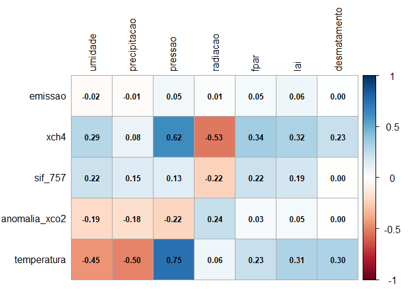
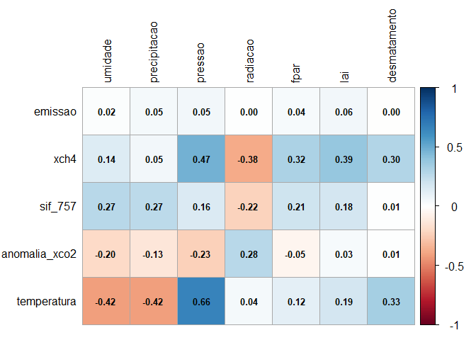
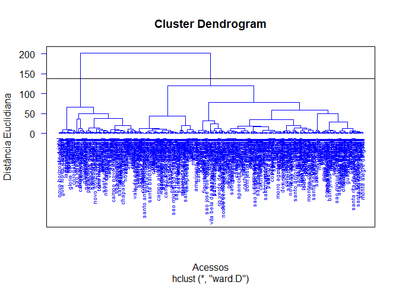
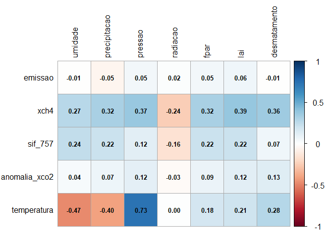
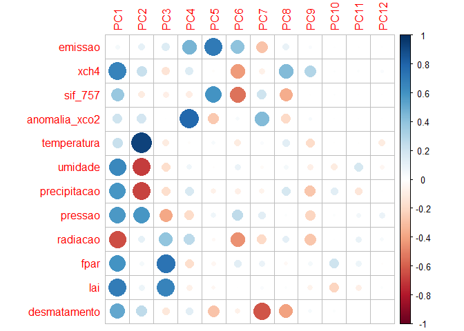
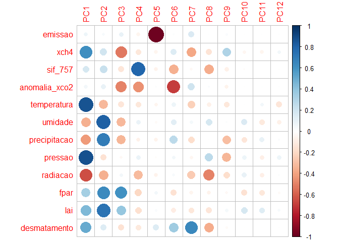
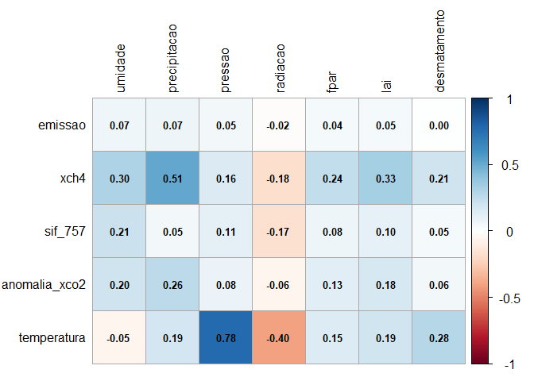
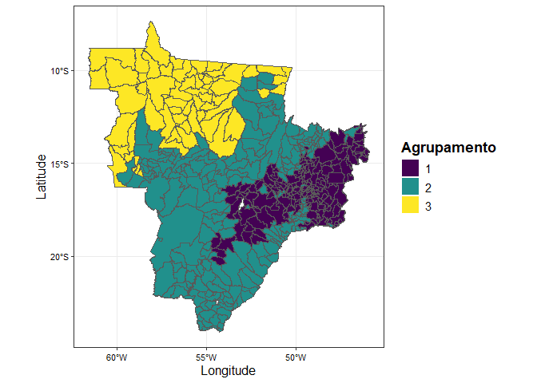

<!-- README.md is generated from README.Rmd. Please edit that file -->

# MODELAGEM COMPUTACIONAL DA CONCENTRAÇÃO ATMOSFÉRICA DE CO<sub>2</sub> e CH<sub>4</sub> NO BRASIL CENTRAL

**Resumo**: As mudanças climáticas globais são uma preocupação mundial
constante, sendo a principal causa o aumento da concentração de gases de
efeito estufa (GEE) na atmosfera, especialmente o dióxido de carbono
(CO<sub>2</sub>) e o metano (CH<sub>4</sub>). Para implementar medidas
eficientes de mitigação das emissões de GEE, é fundamental compreender a
dinâmica desses gases na atmosfera e estabelecer relações com outras
variáveis associadas ao sistema solo-planta-atmosfera. Nesse contexto,
diversos esforços têm sido realizados para aprimorar as técnicas de
monitoramento de GEE em escala global e regional. Esta proposta tem como
objetivo descrever a variabilidade espaçotemporal das concentrações
atmosféricas de CO<sub>2</sub> e CH<sub>4</sub> em áreas do Brasil
Central, identificando fontes e possíveis sumidouros desses gases ao
longo dos anos de 2015 a 2023. Serão adquiridos dados das concentrações
atmosféricas de CO<sub>2</sub> (X<sub>CO2</sub>) e CH<sub>4</sub>
(X<sub>CH4</sub>) a partir dos sensores orbitais GOSAT e OCO-2. Em
adição, dados das variáveis climáticas serão obtidos na plataforma da
Agência Espacial Americana (NASA). Para todos os setores emissores de
GEE, os dados serão obtidos a partir dos relatórios da plataforma
Climate TRACE, coalizão sem fins lucrativos capaz de rastrear e fornecer
informações sobre as emissões de GEE globalmente. A aquisição dos dados
será sistematizada para redução das diferenças entre as resoluções
espaciais dos dados de sensoriamento remoto, com posterior remoção da
tendência mundial de X<sub>CO2</sub> e X<sub>CH4</sub>. Para exploração
dos dados adquiridos, serão utilizadas técnicas exploratórias
multivariadas e análise geoestatística, implementadas em linguagem R. A
interrelação entre as variáveis analisadas será descrita por de
reconhecimento de padrão, que incluíram análises de agrupamento
hierárquico e não-hierárquico, análise de componentes principais
associadas aos padrões de variabilidade espacial. Espera-se que essa
abordagem contribua para melhorar a compreensão da dinâmica dos gases de
efeito estufa na atmosfera e suas interações com variáveis climáticas e
de uso da terra no Brasil Central, auxiliando na formulação de políticas
públicas voltadas para a mitigação das emissões de GEE e,
principalmente, a adaptação às mudanças climáticas.

**Objetivo**: Analisar a variabilidade espaçotemporal das concentrações
atmosféricas de CO<sub>2</sub> e CH<sub>4</sub> em áreas do Brasil
Central, identificando fontes e possíveis sumidouros desses gases ao
longo dos anos de 2015 a 2023, bem como suas relações com índices
vegetativos e climáticos, por meio de dados de GOSAT, OCO-2 e Climate
TRACE.

## 👨‍🔬 Autores

- **Pedro Henrique Marucio de Oliveira**  
  Graduando em Agronomia - FCAV/Unesp  
  Email: [pedro.marucio@unesp.br](mailto:pedro.marucio@unesp.b)

- **Prof. Dr. Alan Rodrigo Panosso**  
  Coorientador — Departamento de Ciências Exatas - FCAV/Unesp  
  Email: <alan.panosso@unesp.br>

## 📁 Etapas do Projeto

Os scripts abaixo foram desenvolvidos em RMarkdown e estão disponíveis
em formato HTML:

- **Aquisição e download dos dados brutos**
  - [GOSAT](https://data.ceda.ac.uk/neodc/gosat/data/ch4/nceov1.0/CH4_GOS_OCPR/):
    Dados de concentração de CH<sub>4</sub> 2009 a 2021  
  - [OCO-2](https://disc.gsfc.nasa.gov): Dados de concentração de
    XCO<sub>2</sub>
    (<https://disc.gsfc.nasa.gov/datasets/OCO2_L2_Lite_FP_11.2r/summary?keywords=OCO2>)
    e SIF (<a
    href="https://disc.gsfc.nasa.gov/datasets/OCO2_L2_Lite_SIF_11r/summary?keywords=OCO2\"
    class="uri">https://disc.gsfc.nasa.gov/datasets/OCO2_L2_Lite_SIF_11r/summary?keywords=OCO2\</a>
  - [Climate TRACE](https://climatetrace.org/): Dados de emissões de GEE
    de 2015 a 2022  
  - [AppEEARS](https://appeears.earthdatacloud.nasa.gov/task/point):
    Variáveis climáticas e vegetativas  
  - [nasapower](https://power.larc.nasa.gov/): Variáveis climáticas
    (Temperatura; precipitação; radiação solar; umidade relativa;
    velocidade do vento e pressão) de 2015 a 2024  
  - [DETER](https://terrabrasilis.dpi.inpe.br/downloads/): Dados de
    focos de fogo (cicatriz de queimadas)  
  - [Desmatamento - INPE - PRODES - Plataforma
    Terrabrasilis](https://terrabrasilis.dpi.inpe.br/geonetwork/srv/eng/catalog.search#/metadata/fe02f2bf-2cc0-49d5-ab72-a3954f997408):
    Dados sobre desmatamento de 31/07/2000 a 30/07/2023  
- **Dados adicionais adquiridos (não utilizados no trabalho)**
  - [NASA](https://climate.nasa.gov/): Dados climáticos  
  - [NASA-FIRMS](https://firms.modaps.eosdis.nasa.gov): Dados de focos
    de incêndio de 2015 a 2025  
  - [BDQUEIMADAS](https://terrabrasilis.dpi.inpe.br/queimadas/bdqueimadas/#exportar-dados):
    Dados de focos de incêndio de 2015 a 2025  
  - [Programa Queimadas - INPE - Plataforma
    Terrabrasilis](https://terrabrasilis.dpi.inpe.br/queimadas/portal/):
    Dados de focos de queimadas x Supressão da vegetação nativa de
    08/2018 a 01/2025 & Dados de focos de fogo ativo de 1998 a
    21/01/2025  

## 🧹 Faxina e Tratamento [script_geral](https://arpanosso.github.io//projeto-oliveiraphm//01_faxina_tratamento_dados.html)

Nessa etapa foi realizada a faxina, filtragem e organização inicial dos
dados. Os dados de concentração atmosférica de dióxido de carbono (XCO2)
e metano (XCH4) foram devidamente processados e filtrados para o
território brasileiro, incluindo:

Filtro geográfico (apenas medições dentro do Brasil);  
Controle de qualidade (baseado nos flags de qualidade dos dados
originais);  
Organização por regiões (Norte, Nordeste, Sudeste, Sul e Centro-Oeste);

### 🔗 Scripts de tratamentos e Links para Download dos dados processados:

| Script de Tratamento | Dados Processados Para Download |
|:--:|:--:|
| [nasa-xco2](https://arpanosso.github.io//projeto-oliveiraphm//nasa-xco2.html) | ⬇️ [nasa-xco2.rds](https://drive.google.com/file/d/1sVsLvBLxUB1YbqWyDUg177Eua2oREvgH/view?usp=sharing) |
| [gosat-xch4](https://arpanosso.github.io//projeto-oliveiraphm//gosat-xch4.html) | ⬇️ [gosat-xch4.rds](https://drive.google.com/file/d/1Rj-jcHOblEEb1ARMyJ1Jyfo4wCJnGliB/view?usp=drive_link) |
| [oco2-sif](https://arpanosso.github.io//projeto-oliveiraphm//oco2-sif.html) | ⬇️ [oco2-sif.rds](https://drive.google.com/file/d/1c4WlEmgnwu7R_ENjzMTTg2a4mP1IaiG_/view?usp=sharing) |
| [appeears-modis](https://arpanosso.github.io//projeto-oliveiraphm//appeears-modis.html) | ⬇️ [appeears-modis.rds](https://drive.google.com/file/d/15bpg2r2_XSWveyWrFu6oumt79UUlxzJr/view?usp=sharing) |
| [emissions-sources](https://arpanosso.github.io//projeto-oliveiraphm//emissions-sources.html) | ⬇️ [emissions-sources.rds](https://drive.google.com/file/d/17erldRlIlTiB5sVtLWjsv4E--zZ3gmH-/view?usp=sharing) |
| [nasa-power](https://arpanosso.github.io//projeto-oliveiraphm//nasa-xco2.html) | ⬇️ [nasa-power.rds](https://drive.google.com/file/d/13_PR3bQ9-ga_Wiv7jEv-GhYpAJwhmyTN/view?usp=sharing) |
| [prodes-deforestation](https://arpanosso.github.io//projeto-oliveiraphm//prodes-deforestation.html) | ⬇️ [prodes-deforestation.rds](https://drive.google.com/file/d/1X4KJ_XK3GRcrwNCwWVEihJQBMGb72Z3S/view?usp=sharing) |
| [deter-queimadas](https://arpanosso.github.io//projeto-oliveiraphm//deter-queimadas.html) | ⬇️ [deter-queimadas.rds](https://drive.google.com/file/d/1cmikkge6MtLJXuPBYeV-ZuMYoaNKP967/view?usp=sharing) |
| [nasa-firms](https://arpanosso.github.io//projeto-oliveiraphm//nasa-firms.html) | ⬇️ [nasa-firms.rds](https://drive.google.com/file/d/1aMsbg35-QRBs-xiS8jl6lQ6feUySxM3e/view?usp=sharing) |

Formato dos arquivos:

> .rds (formato nativo do R para rápido carregamento)

> salve os arquivos na pasta `data` do seu projeto

### 🛠️ Pré-processameto [script](https://arpanosso.github.io//projeto-oliveiraphm//02_preprocessamento.html)

### 🛠 Preparação dos dados para análise.

``` r
library(tidyverse)
library(dplyr)
library(purrr) # criar funções
library(tibble)
library(corrplot)
library(vegan)
library(stringi)
source("R/my-function.R") 
#> List of polygons loaded [list_pol]
```

#### Definindo estados

``` r
my_states <- c("MS","MT","GO","DF")
```

### 💨 Entrada com todas as bases `base_completa.rds`

``` r
base_completa <- read_rds('data/base_completa.rds')
```

## Análises

### 🧮 Estatística descritiva

``` r
# variavel <- "xco2" # opcional (mudar variavel)

# Criar vetor com as variáveis
variaveis <- base_completa |>
  select(-year, -state, -city_ref) |>
  names()

# names(base_completa) # ver colunas

# Função de loop sobre as variáveis para facilitar processo
for (variavel in variaveis) {
  cat("Processando:", variavel, "\n")  # feedback

# df <- base_completa |>
#   group_by(year,state) |>
#   summarise(
#     N = sum(!is.na(.data[[variavel]]), na.rm = TRUE), # observações
#     MIN = min(.data[[variavel]], na.rm = TRUE), # valor mínimo
#     MEAN = mean(.data[[variavel]], na.rm = TRUE), # média
#     MEDIAN = median(.data[[variavel]], na.rm = TRUE), # mediana
#     MAX = max(.data[[variavel]], na.rm = TRUE), # valor máximo
#     VARIANCIA  = var(.data[[variavel]], na.rm = TRUE), 
#     STD_DV = sd(.data[[variavel]], na.rm = TRUE), # desvio padrão
#     CV = 100*STD_DV/MEAN, # coeficiete de variação
#     SKW = agricolae::skewness(.data[[variavel]]), #
#     KRT = agricolae::kurtosis(.data[[variavel]]), #
#   )
# 
# # Salvar
# writexl::write_xlsx(df, paste0("output/estat-descritiva-",variavel,"_.xlsx"))
# 
# }
```

### 📊 Histogramas

Algumas bases apresentam histogramas inconsistentes ou errados, devido a
incorporação.

``` r
variavel <- "xco2" # mudar

# xco2
nasa_xco2 <- read_rds("data/nasa-xco2.rds")

# base original
nasa_xco2 |>
  ggplot(aes(x=xco2)) +
  geom_histogram(color="black",fill="gray",
                 bins = 30) +
  facet_wrap(~year, scales = "free") +
  theme_bw()

# base resumida
base_completa |>
  ggplot(aes(x=xco2)) +
  geom_histogram(color="black",fill="gray",
                 bins = 30) +
  facet_wrap(~year, scales = "free") +
  theme_bw()

# xch4
gosat_xch4 <- read_rds("data/gosat_xch4.rds")

# base original
gosat_xch4 |>
  ggplot(aes(x=xch4)) +
  geom_histogram(color="black",fill="gray",
                 bins = 30) +
  facet_wrap(~year, scales = "free") +
  theme_bw()

# base resumida
base_completa |>
  ggplot(aes(x=xch4)) +
  geom_histogram(color="black",fill="gray",
                 bins = 30) +
  facet_wrap(~year, scales = "free")  +
  scale_x_continuous(
    limits = c(1800, 1900),  
  ) +
  theme_bw()

# sif_757
oco2_sif <- read_rds("data/oco2-sif.rds")

# base original
# oco2_sif |>
#   ggplot(aes(x=SIF_757)) +
#   geom_histogram(color="black",fill="gray",
#                  bins = 30) +
#   facet_wrap(~year, scales = "free") +
#   theme_bw()

# base resumida
base_completa |>
  ggplot(aes(x=sif_757)) +
  geom_histogram(color="black",fill="gray",
                 bins = 30) +
  facet_wrap(~year, scales = "free") +
  theme_bw()


# appeears_modis - ndvi (correto)
# appeears_modis <- read_rds("data/appeears_modis_final.rds")

# base resumida
base_completa |>
  ggplot(aes(x = media_ndvi)) +
  geom_histogram(color="black",fill = "#2E8B57",     # verde-vegetação
    bins = 30          # transparência leve
  ) +
  facet_wrap(~year, scales = "free") +
  scale_x_continuous(
    limits = c(-0.2, 1),  # intervalo NDVI típico
  ) +
  theme_bw()

# nasa_power
nasa_power <- read_rds("data/nasa_power.rds")

# base original
nasa_power |>
  ggplot(aes(x=t2m)) +
  geom_histogram(color="black",fill="gray",
                 bins = 30) +
  facet_wrap(~year, scales = "free") +
  theme_bw()

# base resumida
base_completa |>
  ggplot(aes(x=temperatura)) +
  geom_histogram(color="black",fill="gray",
                 bins = 30) +
  facet_wrap(~year, scales = "free") +
  theme_bw()


# desmatamento - arrumar
# prodes_deforestation <- read_rds("data/prodes_deforestation.rds")

# base original
# prodes_deforestation |>
#   ggplot(aes(x=categorie)) +
#   geom_histogram(color="black",fill="gray",
#                  bins = 30) +
#   facet_wrap(~categorie, scales = "free") +
#   theme_bw()

# base resumida
base_completa |>
  ggplot(aes(x=desmatamento)) +
  geom_histogram(color="black",fill="gray",
                 bins = 30) +
  facet_wrap(~year, scales = "free") +
  theme_bw()


# queimadas
# base original
deter_queimadas <- read_rds("data/deter_queimadas.rds")

deter_queimadas |>
  ggplot(aes(x=AREAMUNKM)) +
  geom_histogram(color="black",fill="gray",
                 bins = 30) +
  facet_wrap(~ANO, scales = "free") +
  theme_bw()

# base resumida
  
base_completa |>
  ggplot(aes(x=area_queimada)) +
  geom_histogram(color="black",fill="gray",
                 bins = 30) +
  facet_wrap(~year, scales = "free") +
  theme_bw()
```

``` r
base_completa |>
  mutate(
  fct_year = fct_rev(as.factor(year)),
  ) |>
  ggplot(aes(y=fct_year)) +
  ggridges::geom_density_ridges(rel_min_height = 0.03,
                      aes(x=sif_757, fill=state),
                      alpha = .6, color = "black"
  ) +
  scale_fill_viridis_d() +
  ggridges::theme_ridges() +
  theme(
    legend.position = "top"
  ) +
  labs(fill="")
```

### Atualização da Base - Cáculo da Anomalia

``` r
base_completa <- base_completa |> 
  group_by(year) |> 
  mutate(anomalia_xco2 = xco2 - median(xco2,na.rm=TRUE),
         .after = xco2) |> 
  dplyr::ungroup() |> 
  relocate(year:city_ref, emissions_quantity, xco2, xch4, sif_757,
           anomalia_xco2, temperatura, umidade, precipitacao, pressao, radiacao, vento,media_fpar:media_ndvi, desmatamento,area_queimada) |> 
    select(-media_et) |> 
  rename(ano = year, estado = state, municipio = city_ref,
         emissao = emissions_quantity,queimada = area_queimada,
         fpar = media_fpar,
         lai = media_lai,
         evi = media_evi,
         ndvi = media_ndvi)
```

### Análise de correlação - total

``` r
mc <- cor(base_completa |> 
            select(emissao:queimada), use = "complete.obs")
corrplot(mc,method = "color",
         outline = TRUE,
         addgrid.col = "darkgray",cl.pos = "r", tl.col = "black",
         tl.cex = 1, cl.cex = 1,  bg="azure2",
         # diag = FALSE,
         # addCoef.col = "black",
         cl.ratio = 0.2,
         cl.length = 5,
         number.cex = 0.8
) 
```

<!-- -->

### Análise de correlação - ANO

``` r
ngrp <- rep(3,8) # c(3,3,3,4,4,5,3,4)
for( i in 2015:2022){
  # Análise de correlação
  base_aux <- base_completa |>
    filter(ano ==i) |> 
    select(emissao:queimada, -vento, -ndvi, -xco2, -queimada, - evi) 
  
  municipios <-base_completa |>
    filter(ano ==i) |> 
    pull(municipio)
  
  mc <- cor(base_aux,use = "pairwise.complete.obs")
  fc <- !is.na(mc[1,])
  fl <- !is.na(mc[,1])
  mc <- mc[fc,fl]
  mc <- mc[1:5,-(1:5)]
  corrplot(mc,method = "color",
           outline = TRUE,
           addgrid.col = "darkgray",cl.pos = "r", tl.col = "black",
           tl.cex = 1, cl.cex = 1,  bg="azure2",
           # diag = FALSE,
           addCoef.col = "black",
           cl.ratio = 0.2,
           cl.length = 5,
           number.cex = 0.8) 
  
  # Análise de agrupamento
  da_pad <- decostand(base_aux[,fc] |> 
                        mutate(across(everything(), ~replace_na(., 0))),  
                      method = "standardize",
                      na.rm=TRUE)
  da_pad_euc <- vegdist(da_pad,"euclidean") 
  da_pad_euc_ward<-hclust(da_pad_euc, method="ward.D")
  da_pad_euc_ward$labels <- municipios
  grupo<-cutree(da_pad_euc_ward,ngrp[i-2014]) #### numero de agrupamentos
  d <- da_pad_euc_ward$height
  d_corte <- d[which(d |> diff() == max(diff(d)))]
  plot(da_pad_euc_ward, 
       ylab="Distância Euclidiana",
       xlab="Acessos", hang=-1,
       col="blue", las=1,
       cex=.6,lwd=1.5);box();abline(h=d_corte*1.15)
  
  # Mapaeamento dos Grupos
  plot_map_group <- municipality |> 
    mutate(
      name_muni = stri_trans_general(tolower(name_muni), "Latin-ASCII"),
      name_muni = trimws(name_muni)
    )  |> 
    filter(abbrev_state %in% my_states) |> 
    left_join(
      data.frame(
        name_muni = names(grupo),
        grupo = as_factor(grupo)
      ),by = "name_muni", relationship = "many-to-many"
    ) |> drop_na() |>      
    ggplot() +
    geom_sf(aes(fill=grupo), color="transparent",
            size=.05, show.legend = TRUE)  +
    geom_sf(data=municipality |> filter(abbrev_state %in% my_states), fill="transparent", size=3, show.legend = FALSE) +
    theme_bw() +
    theme(
      axis.text.x = element_text(size = rel(.9), color = "black"),
      axis.title.x = element_text(size = rel(1.1), color = "black"),
      axis.text.y = element_text(size = rel(.9), color = "black"),
      axis.title.y = element_text(size = rel(1.1), color = "black"),
      legend.text = element_text(size = rel(1), color = "black"),
      legend.title = element_text(face = 'bold', size = rel(1.2))
    ) +
    labs(fill = 'Agrupamento',
         x = 'Longitude',
         y = 'Latitude') +
    scale_fill_viridis_d()
  print(plot_map_group)
  
  pca <-  prcomp(da_pad,scale.=TRUE)
  # Autovalores
  eig<-pca$sdev^2
  print("==== Autovalores ====")
  print(round(eig,3))
  print("==== % da variância explicada ====")
  ve<-eig/sum(eig)
  print(round(ve,4))
  print("==== % da variância explicada acumulada ====")
  print(round(cumsum(ve),4)*100)
  print("==== Poder Discriminante ====")
  mcor<-cor(da_pad,pca$x)
  corrplot(mcor)
  
  pc1V<-cor(da_pad,pca$x)[,1]/sd(cor(da_pad,pca$x)[,1])
  pc2V<-cor(da_pad,pca$x)[,2]/sd(cor(da_pad,pca$x)[,2])
  pc3V<-cor(da_pad,pca$x)[,3]/sd(cor(da_pad,pca$x)[,3])
  pc1c<-pca$x[,1]/sd(pca$x[,1])
  pc2c<-pca$x[,2]/sd(pca$x[,2])
  pc3c<-pca$x[,3]/sd(pca$x[,3])
  nv<-ncol(mcor) # número de variáveis utilizadas na análise
      
  # gráfico biplot
  bip<-data.frame(pc1c,pc2c,pc3c,grupo)
  texto <- data.frame(
    x = pc1V,
    y = pc2V,
    z = pc3V,
    label = rownames(mcor)
  )
  for(k in 1:ngrp[i-2014]){
    cat(paste0("[Grupo ",k,"]:\n"), paste(municipios[grupo==k],collapse = "; "))
    cat("\n\n")
  }
  
  bi_plot <- bip |> 
    ggplot(aes(x=pc1c,y=pc2c,colour = as_factor(grupo))) +
    geom_point(size = 3) +
    theme_minimal() +
    # scale_shape_manual(values=16:18)+
    # scale_color_manual(values=c("#009E73", "#D55E00")) + #"#999999",
    # annotate(geom="text", x=pc1c, y=pc2c, label=cultivar,
    #             color="black",size=.25)+
    geom_vline(aes(xintercept=0),
               color="black", size=1)+
    geom_hline(aes(yintercept=0),
               color="black", size=1)+
    annotate(geom="segment",
             x=rep(0,nv),
             xend=texto$x,
             y=rep(0,nv),
             yend=texto$y,color="black",lwd=.5)+
    geom_label(data=texto,aes(x=x,y=y,label=label),
               color="black",angle=0,fontface="bold",size=3,fill="white")+
    labs(x=paste("CP1 (",round(100*ve[1],2),"%)",sep=""),
         y=paste("CP2 (",round(100*ve[2],2),"%)",sep=""),
         color="",shape="")+
    theme(legend.position = "top")+
    scale_color_viridis_d() #+
    # xlim(min(pc1c)*1.5,max(pc1c)*1.5) 
  print(bi_plot)
  
  print("==== Tabela da correlação dos atributos com cada PC ====")
      ck<-sum(pca$sdev^2>=0.98)
      tabelapca<-vector()
      for( l in 1:ck) tabelapca<-cbind(tabelapca,mcor[,l])
      colnames(tabelapca)<-paste(rep(c("PC"),ck),1:ck,sep="")
      pcat<-round(tabelapca,3)
      tabelapca<-tabelapca[order(abs(tabelapca[,1])),]
      print(tabelapca)
}
```

<!-- --><!-- --><!-- -->

    #> [1] "==== Autovalores ===="
    #>  [1] 3.120 2.576 1.586 1.015 0.942 0.904 0.810 0.441 0.357 0.142 0.088 0.019
    #> [1] "==== % da variância explicada ===="
    #>  [1] 0.2600 0.2146 0.1321 0.0846 0.0785 0.0753 0.0675 0.0368 0.0298 0.0119
    #> [11] 0.0073 0.0016
    #> [1] "==== % da variância explicada acumulada ===="
    #>  [1]  26.00  47.47  60.68  69.14  76.99  84.52  91.27  94.95  97.92  99.11
    #> [11]  99.84 100.00
    #> [1] "==== Poder Discriminante ===="

<!-- -->

    #> [Grupo 1]:
    #>  brasilia; abadia de goias; abadiania; acreuna; alexania; aloandia; alto horizonte; alto paraiso de goias; alvorada do norte; americano do brasil; amorinopolis; anicuns; anapolis; aparecida de goiania; apore; aragarcas; aragoiania; arapora; aracu; arenopolis; aurilandia; baliza; barro alto; bela vista de goias; bom jardim de goias; bom jesus de goias; bonfinopolis; brazabrantes; buriti alegre; buritinopolis; cabeceiras; cachoeira alta; cachoeira de goias; cachoeira dourada; caiaponia; caldas novas; caldazinha; campestre de goias; campinacu; campinorte; campo alegre de goias; campo limpo de goias; campos belos; carmo do rio verde; castelandia; catalao; caturai; cavalcante; cacu; ceres; cezarina; chapadao do ceu; cidade ocidental; cocalzinho de goias; colinas do sul; corumbaiba; corumba de goias; cristalina; cristianopolis; crixas; crominia; corrego do ouro; damianopolis; damolandia; davinopolis; diorama; divinopolis de goias; doverlandia; edealina; edeia; fazenda nova; firminopolis; flores de goias; formosa; formoso; gameleira de goias; goiandira; goianira; goianapolis; goianesia; goiatuba; goias; goiania; gouvelandia; guapo; guarani de goias; guaraita; guarinos; heitorai; hidrolina; hidrolandia; iaciara; inaciolandia; indiara; inhumas; ipameri; ipiranga de goias; ipora; israelandia; itaberai; itaguari; itaguaru; itaja; itapaci; itapuranga; itaruma; itaucu; itumbiara; ivolandia; jandaia; jaragua; jatai; jaupaci; jesupolis; joviania; jussara; lagoa santa; leopoldo de bulhoes; luziania; mairipotaba; mambai; marzagao; maurilandia; mimoso de goias; minacu; mineiros; moipora; monte alegre de goias; montes claros de goias; montividiu; montividiu do norte; morrinhos; morro agudo de goias; mossamedes; mutunopolis; nazario; neropolis; niquelandia; nova america; nova gloria; nova iguacu de goias; nova roma; nova veneza; novo brasil; novo gama; orizona; other; ouro verde de goias; ouvidor; padre bernardo; palestina de goias; palmeiras de goias; palmelo; panama; paranaiguara; parana; parauna; perolandia; petrolina de goias; pilar de goias; piracanjuba; piranhas; pirenopolis; planaltina; pontalina; porangatu; porteirao; portelandia; posse; professor jamil; quirinopolis; rialma; rianapolis; rio quente; rio verde; rubiataba; sanclerlandia; santa barbara de goias; santa cruz de goias; santa fe de goias; santa helena de goias; santa isabel; santa rita do novo destino; santa rosa de goias; santa tereza de goias; santo antonio da barra; santo antonio de goias; santo antonio do descoberto; senador canedo; serranopolis; silvania; simolandia; sao domingos; sao francisco de goias; sao joao d'alianca; sao joao da parauna; sao luis de montes belos; sao luiz do norte; sao miguel do passa quatro; sao patricio; sao simao; sitio d'abadia; taquaral de goias; teresina de goias; terezopolis de goias; trindade; trombas; tres ranchos; turvelandia; turvania; uruana; uruacu; urutai; valparaiso de goias; varjao; vianopolis; vicentinopolis; vila boa; vila propicio; agua fria de goias; agua limpa; aguas lindas de goias; alcinopolis; aparecida do taboado; bandeirantes; camapua; campo grande; cassilandia; chapadao do sul; costa rica; douradina; figueirao; inocencia; jaraguari; maracaju; paranaiba; ribas do rio pardo; sao gabriel do oeste; tres lagoas; agua clara; alto araguaia; alto garcas; alto taquari; apui; araguaiana; aruana; campo novo do parecis; campo verde; canarana; diamantino; dom aquino; general carneiro; itiquira; jaciara; juscimeira; lucas do rio verde; machadinho d'oeste; nova mutum; novo aripuana; other; ponte branca; primavera do leste; ribeiraozinho; santa rita do trivelato; santo antonio do leste; sao jose do rio claro; sao jose do xingu; torixoreu
    #> 
    #> [Grupo 2]:
    #>  amaralina; araguapaz; aruana; bonopolis; britania; campos verdes; faina; itapirapua; mara rosa; matrincha; mozarlandia; mundo novo; nova crixas; novo planalto; santa terezinha de goias; sao miguel do araguaia; uirapuru; anastacio; aquidauana; bodoquena; bonito; brasilandia; caracol; corguinho; corumba; coxim; dois irmaos do buriti; ladario; miranda; nioaque; pedro gomes; porto murtinho; rio negro; rio verde de mato grosso; rochedo; selviria; sidrolandia; sonora; terenos; acorizal; alta floresta; alto boa vista; alto paraguai; apiacas; araputanga; arenapolis; aripuana; barra do bugres; barra do garcas; barao de melgaco; bom jesus do araguaia; brasnorte; campinapolis; campos de julio; canabrava do norte; carlinda; castanheira; chapada dos guimaraes; claudia; cocalinho; colniza; colider; comodoro; confresa; conquista d'oeste; cotriguacu; cuiaba; curvelandia; caceres; denise; feliz natal; figueiropolis d'oeste; gaucha do norte; gloria d'oeste; guaranta do norte; guiratinga; indiavai; ipiranga do norte; itanhanga; itauba; jauru; juara; juruena; juina; lambari d'oeste; luciara; marcelandia; matupa; nobres; nossa senhora do livramento; nova bandeirantes; nova brasilandia; nova canaa do norte; nova guarita; nova lacerda; nova marilandia; nova maringa; nova monte verde; nova nazare; nova olimpia; nova santa helena; nova ubirata; nova xavantina; novo horizonte do norte; novo mundo; novo santo antonio; novo sao joaquim; paranatinga; paranaita; pedra preta; peixoto de azevedo; planalto da serra; pocone; pontal do araguaia; pontes e lacerda; porto alegre do norte; porto dos gauchos; porto esperidiao; porto estrela; poxoreo; querencia; reserva do cabacal; ribeirao cascalheira; rondolandia; rondonopolis; rosario oeste; salto do ceu; santa carmem; santa cruz do xingu; santa terezinha; santo afonso; santo antonio do leverger; sapezal; serra nova dourada; sinop; sorriso; sao felix do araguaia; sao jose do povo; sao jose dos quatro marcos; sao pedro da cipa; tabapora; tangara da serra; tapurah; terra nova do norte; tesouro; uniao do sul; vale de sao domingos; vera; vila bela da santissima trindade; vila rica; varzea grande; agua boa
    #> 
    #> [Grupo 3]:
    #>  amambai; anaurilandia; angelica; antonio joao; aral moreira; bataguassu; bataypora; bela vista; caarapo; coronel sapucaia; deodapolis; dourados; fatima do sul; gloria de dourados; guia lopes da laguna; iguatemi; itapora; itaquirai; ivinhema; jardim; jatei; juti; laguna carapa; mundo novo; navirai; nova alvorada do sul; nova andradina; novo horizonte do sul; paranhos; ponta pora; rio brilhante; santa rita do pardo; sete quedas; tacuru; taquarussu

<!-- -->

    #> [1] "==== Tabela da correlação dos atributos com cada PC ===="
    #>                       PC1         PC2         PC3          PC4
    #> emissao        0.05357147  0.09309648  0.04875190 -0.846319947
    #> desmatamento   0.26366337  0.36964209  0.02621943  0.351046219
    #> temperatura    0.26522324  0.86615854 -0.31955934 -0.026341845
    #> sif_757        0.32736206 -0.13713278 -0.01493901 -0.370666492
    #> anomalia_xco2 -0.33643193  0.13772643  0.21637141  0.158610871
    #> precipitacao   0.45550889 -0.77438321  0.05916835  0.052663130
    #> fpar           0.46570339  0.24985421  0.78884758  0.002513904
    #> lai            0.49649252  0.37569300  0.73434895 -0.007572288
    #> umidade        0.60452222 -0.71276655  0.03942974  0.076879799
    #> pressao        0.73077210  0.41350053 -0.42421149  0.004065028
    #> xch4           0.75451839  0.24606287 -0.22113334  0.037958372
    #> radiacao      -0.78570964  0.31569525  0.19471578 -0.044526407

<!-- --><!-- --><!-- -->

    #> [1] "==== Autovalores ===="
    #>  [1] 3.161 2.348 1.536 1.229 0.988 0.842 0.735 0.603 0.308 0.127 0.095 0.029
    #> [1] "==== % da variância explicada ===="
    #>  [1] 0.2634 0.1957 0.1280 0.1024 0.0823 0.0702 0.0612 0.0503 0.0257 0.0106
    #> [11] 0.0079 0.0024
    #> [1] "==== % da variância explicada acumulada ===="
    #>  [1]  26.34  45.91  58.71  68.95  77.18  84.19  90.32  95.34  97.91  98.97
    #> [11]  99.76 100.00
    #> [1] "==== Poder Discriminante ===="

<!-- -->

    #> [Grupo 1]:
    #>  brasilia; abadia de goias; abadiania; acreuna; alexania; aloandia; americano do brasil; amorinopolis; anicuns; anapolis; aparecida de goiania; aragarcas; aragoiania; arenopolis; aurilandia; avelinopolis; barro alto; bela vista de goias; bom jardim de goias; bom jesus de goias; bonfinopolis; brazabrantes; buriti alegre; cabeceiras; cachoeira alta; cachoeira de goias; cachoeira dourada; caiaponia; caldas novas; caldazinha; campestre de goias; campinacu; campinorte; campo alegre de goias; campo limpo de goias; carmo do rio verde; castelandia; catalao; caturai; cacu; cezarina; chapadao do ceu; cidade ocidental; cocalzinho de goias; colinas do sul; corumbaiba; corumba de goias; cristalina; cristianopolis; crixas; crominia; corrego do ouro; damolandia; davinopolis; diorama; edealina; edeia; fazenda nova; firminopolis; flores de goias; formosa; gameleira de goias; goiandira; goianira; goianapolis; goianesia; goias; goiania; gouvelandia; guapo; guaraita; guarinos; heitorai; hidrolina; hidrolandia; inaciolandia; indiara; inhumas; ipameri; ipiranga de goias; ipora; israelandia; itaberai; itaguari; itaguaru; itapaci; itapuranga; itaruma; itaucu; itumbiara; jandaia; jaragua; jatai; jesupolis; joviania; lagoa santa; leopoldo de bulhoes; luziania; marzagao; maurilandia; mineiros; montes claros de goias; montividiu; morrinhos; morro agudo de goias; mossamedes; mundo novo; nazario; neropolis; niquelandia; nova america; nova gloria; nova veneza; novo brasil; novo gama; orizona; ouro verde de goias; padre bernardo; palestina de goias; palmeiras de goias; palmelo; panama; paranaiguara; parauna; petrolina de goias; pilar de goias; piracanjuba; piranhas; pirenopolis; planaltina; pontalina; porteirao; portelandia; professor jamil; quirinopolis; rialma; rianapolis; rio quente; rio verde; rubiataba; sanclerlandia; santa barbara de goias; santa cruz de goias; santa isabel; santa rita do novo destino; santa rosa de goias; santo antonio de goias; santo antonio do descoberto; senador canedo; silvania; sao francisco de goias; sao joao d'alianca; sao joao da parauna; sao luis de montes belos; sao luiz do norte; sao miguel do araguaia; sao miguel do passa quatro; sao patricio; sao simao; taquaral de goias; terezopolis de goias; trindade; tres ranchos; turvelandia; turvania; uruana; urutai; valparaiso de goias; varjao; vianopolis; vicentinopolis; vila boa; vila propicio; agua fria de goias; agua limpa; alto taquari; novo santo antonio
    #> 
    #> [Grupo 2]:
    #>  alto horizonte; alto paraiso de goias; alvorada do norte; amaralina; apore; araguapaz; aruana; baliza; bonopolis; britania; buritinopolis; campos belos; campos verdes; cavalcante; ceres; damianopolis; divinopolis de goias; doverlandia; faina; formoso; goiatuba; guarani de goias; iaciara; itaja; itapirapua; ivolandia; jaupaci; jussara; mairipotaba; mambai; mara rosa; matrincha; mimoso de goias; minacu; moipora; monte alegre de goias; montividiu do norte; mozarlandia; mutunopolis; nova crixas; nova iguacu de goias; nova roma; novo planalto; other; parana; perolandia; porangatu; posse; santa fe de goias; santa helena de goias; santa tereza de goias; santa terezinha de goias; santo antonio da barra; serranopolis; simolandia; sao domingos; sitio d'abadia; teresina de goias; trombas; uirapuru; uruacu; alcinopolis; aparecida do taboado; aquidauana; bataypora; bodoquena; bonito; camapua; cassilandia; chapadao do sul; corguinho; corumba; costa rica; coxim; dois irmaos do buriti; figueirao; inocencia; ladario; miranda; nova andradina; other; paranaiba; pedro gomes; porto murtinho; rio negro; rio verde de mato grosso; rochedo; sonora; sao gabriel do oeste; taquarussu; terenos; tres lagoas; agua clara; acorizal; alta floresta; altamira; alto araguaia; alto boa vista; alto garcas; alto paraguai; apiacas; apui; araguaiana; araputanga; arenapolis; aripuana; barra do bugres; barra do garcas; barao de melgaco; bom jesus do araguaia; brasnorte; campinapolis; campo novo do parecis; campo verde; campos de julio; canabrava do norte; canarana; carlinda; castanheira; chapada dos guimaraes; claudia; cocalinho; colniza; colider; comodoro; confresa; conquista d'oeste; cotriguacu; cuiaba; curvelandia; caceres; denise; diamantino; dom aquino; feliz natal; figueiropolis d'oeste; gaucha do norte; general carneiro; gloria d'oeste; guaranta do norte; guiratinga; indiavai; ipiranga do norte; itanhanga; itauba; itiquira; jacareacanga; jaciara; jauru; juara; juruena; juscimeira; juina; lambari d'oeste; lucas do rio verde; luciara; marcelandia; matupa; mirassol d'oeste; nobres; nossa senhora do livramento; nova bandeirantes; nova brasilandia; nova canaa do norte; nova guarita; nova lacerda; nova marilandia; nova maringa; nova monte verde; nova mutum; nova nazare; nova olimpia; nova santa helena; nova ubirata; nova xavantina; novo aripuana; novo horizonte do norte; novo mundo; novo sao joaquim; other; paranatinga; paranaita; pedra preta; peixoto de azevedo; planalto da serra; pocone; pontal do araguaia; ponte branca; pontes e lacerda; porto alegre do norte; porto dos gauchos; porto esperidiao; porto estrela; poxoreo; primavera do leste; querencia; reserva do cabacal; ribeirao cascalheira; ribeiraozinho; rondolandia; rondonopolis; rosario oeste; salto do ceu; santa carmem; santa cruz do xingu; santa rita do trivelato; santa terezinha; santana do araguaia; santo afonso; santo antonio do leste; santo antonio do leverger; sapezal; serra nova dourada; sinop; sorriso; sao felix do araguaia; sao felix do xingu; sao jose do povo; sao jose do rio claro; sao jose do xingu; sao jose dos quatro marcos; sao pedro da cipa; tabapora; tangara da serra; tapurah; terra nova do norte; tesouro; torixoreu; uniao do sul; vale de sao domingos; vera; vila bela da santissima trindade; vila rica; varzea grande; agua boa
    #> 
    #> [Grupo 3]:
    #>  amambai; anastacio; anaurilandia; angelica; antonio joao; aral moreira; bandeirantes; bataguassu; bela vista; brasilandia; caarapo; campo grande; caracol; coronel sapucaia; deodapolis; douradina; dourados; eldorado; fatima do sul; gloria de dourados; guia lopes da laguna; iguatemi; itapora; itaquirai; ivinhema; japora; jaraguari; jardim; jatei; juti; laguna carapa; maracaju; mundo novo; navirai; nioaque; nova alvorada do sul; novo horizonte do sul; paranhos; ponta pora; ribas do rio pardo; rio brilhante; santa rita do pardo; selviria; sete quedas; sidrolandia; tacuru; vicentina

<!-- -->

    #> [1] "==== Tabela da correlação dos atributos com cada PC ===="
    #>                       PC1         PC2         PC3         PC4         PC5
    #> anomalia_xco2  0.01159132  0.50714241 -0.34909882  0.44142065 -0.04134827
    #> emissao        0.08906623  0.06843307 -0.12990231  0.11291236  0.97432363
    #> temperatura    0.30174433  0.88982541  0.15600978  0.09941448 -0.02390536
    #> sif_757        0.38786516 -0.13133130 -0.17617443  0.43073786 -0.09805491
    #> desmatamento   0.42663266  0.28698848  0.23784235 -0.25259331 -0.05074150
    #> umidade        0.48845702 -0.79951650  0.05545969  0.17988778  0.02696483
    #> precipitacao   0.49433978 -0.36980701 -0.14786365  0.57941845 -0.09376147
    #> fpar           0.59175165 -0.01728313 -0.62764650 -0.44823295 -0.01753815
    #> radiacao      -0.62546409  0.44003802 -0.41976092  0.22333722 -0.05656822
    #> lai            0.68791753  0.09286302 -0.60817259 -0.28577339 -0.04345742
    #> pressao        0.71005262  0.18928002  0.53897329 -0.06980808  0.08028669
    #> xch4           0.72613736  0.42490730  0.17344629  0.23730518 -0.05280492

<!-- --><!-- --><!-- -->

    #> [1] "==== Autovalores ===="
    #>  [1] 3.411 2.376 1.502 1.059 1.007 0.867 0.740 0.465 0.396 0.113 0.044 0.019
    #> [1] "==== % da variância explicada ===="
    #>  [1] 0.2843 0.1980 0.1252 0.0883 0.0839 0.0723 0.0617 0.0387 0.0330 0.0094
    #> [11] 0.0036 0.0016
    #> [1] "==== % da variância explicada acumulada ===="
    #>  [1]  28.43  48.23  60.74  69.57  77.97  85.19  91.36  95.23  98.53  99.47
    #> [11]  99.84 100.00
    #> [1] "==== Poder Discriminante ===="

<!-- -->

    #> [Grupo 1]:
    #>  brasilia; abadia de goias; abadiania; acreuna; alexania; aloandia; alto horizonte; alto paraiso de goias; alvorada do norte; amaralina; amorinopolis; anicuns; anapolis; aparecida de goiania; apore; aragarcas; aragoiania; araguapaz; arenopolis; aruana; aurilandia; baliza; barro alto; bela vista de goias; bom jardim de goias; bom jesus de goias; bonfinopolis; bonopolis; brazabrantes; britania; buriti alegre; buriti de goias; buritinopolis; cabeceiras; cachoeira alta; cachoeira de goias; cachoeira dourada; caiaponia; caldas novas; caldazinha; campinacu; campinorte; campo alegre de goias; campo limpo de goias; campos belos; campos verdes; carmo do rio verde; castelandia; catalao; caturai; cavalcante; cacu; ceres; cezarina; chapadao do ceu; cidade ocidental; cocalzinho de goias; colinas do sul; corumbaiba; corumba de goias; cristalina; cristianopolis; crixas; crominia; corrego do ouro; damianopolis; damolandia; davinopolis; diorama; divinopolis de goias; doverlandia; edealina; edeia; faina; fazenda nova; firminopolis; flores de goias; formosa; formoso; gameleira de goias; goiandira; goianira; goianapolis; goianesia; goiatuba; goias; goiania; gouvelandia; guapo; guarani de goias; guarinos; heitorai; hidrolina; hidrolandia; iaciara; inaciolandia; indiara; inhumas; ipameri; ipiranga de goias; ipora; israelandia; itaberai; itaguari; itaguaru; itaja; itapaci; itapirapua; itapuranga; itaruma; itaucu; itumbiara; ivolandia; jandaia; jaragua; jatai; jaupaci; jesupolis; joviania; jussara; leopoldo de bulhoes; luziania; mairipotaba; mambai; mara rosa; marzagao; matrincha; maurilandia; mimoso de goias; minacu; mineiros; moipora; monte alegre de goias; montes claros de goias; montividiu; montividiu do norte; morrinhos; mossamedes; mozarlandia; mundo novo; mutunopolis; nazario; neropolis; niquelandia; nova america; nova crixas; nova gloria; nova iguacu de goias; nova roma; nova veneza; novo brasil; novo planalto; orizona; other; ouro verde de goias; ouvidor; padre bernardo; palestina de goias; palmeiras de goias; palmelo; panama; paranaiguara; parana; parauna; perolandia; petrolina de goias; pilar de goias; piracanjuba; piranhas; pirenopolis; planaltina; pontalina; porangatu; porteirao; portelandia; posse; professor jamil; quirinopolis; rialma; rianapolis; rio quente; rio verde; rubiataba; sanclerlandia; santa barbara de goias; santa cruz de goias; santa fe de goias; santa helena de goias; santa isabel; santa rita do novo destino; santa rosa de goias; santa tereza de goias; santa terezinha de goias; santo antonio da barra; santo antonio de goias; santo antonio do descoberto; senador canedo; serranopolis; silvania; simolandia; sao domingos; sao francisco de goias; sao joao d'alianca; sao joao da parauna; sao luis de montes belos; sao luiz do norte; sao miguel do araguaia; sao miguel do passa quatro; sao patricio; sao simao; sitio d'abadia; taquaral de goias; teresina de goias; terezopolis de goias; trindade; trombas; tres ranchos; turvelandia; turvania; uirapuru; uruana; uruacu; urutai; varjao; vianopolis; vicentinopolis; vila boa; vila propicio; agua fria de goias; agua limpa; aguas lindas de goias; camapua; cassilandia; chapadao do sul; costa rica; other; paranaiba; sonora; alto araguaia; alto garcas; alto taquari; araguaiana; guiratinga; novo progresso; novo santo antonio; other; pontal do araguaia; ponte branca; primavera do leste; ribeiraozinho; santana do araguaia; sao jose do povo; torixoreu
    #> 
    #> [Grupo 2]:
    #>  alcinopolis; aquidauana; bodoquena; bonito; caracol; corguinho; corumba; coxim; dois irmaos do buriti; figueirao; ladario; miranda; pedro gomes; porto murtinho; rio negro; rio verde de mato grosso; rochedo; sao gabriel do oeste; terenos; tres lagoas; acorizal; alta floresta; alto boa vista; alto paraguai; apiacas; apui; araputanga; arenapolis; aripuana; barra do bugres; barra do garcas; barao de melgaco; bom jesus do araguaia; brasnorte; campinapolis; campo novo do parecis; campo verde; campos de julio; canabrava do norte; canarana; carlinda; castanheira; chapada dos guimaraes; claudia; cocalinho; colniza; colider; comodoro; confresa; conquista d'oeste; cotriguacu; cuiaba; curvelandia; caceres; denise; diamantino; dom aquino; feliz natal; figueiropolis d'oeste; gaucha do norte; general carneiro; gloria d'oeste; guaranta do norte; indiavai; ipiranga do norte; itanhanga; itauba; itiquira; jaciara; jauru; juara; juruena; juscimeira; juina; lambari d'oeste; lucas do rio verde; luciara; marcelandia; matupa; nobres; nortelandia; nossa senhora do livramento; nova bandeirantes; nova brasilandia; nova canaa do norte; nova guarita; nova lacerda; nova marilandia; nova maringa; nova monte verde; nova mutum; nova nazare; nova olimpia; nova santa helena; nova ubirata; nova xavantina; novo horizonte do norte; novo mundo; novo sao joaquim; paranatinga; paranaita; pedra preta; peixoto de azevedo; planalto da serra; pocone; pontes e lacerda; porto alegre do norte; porto dos gauchos; porto esperidiao; porto estrela; poxoreo; querencia; reserva do cabacal; ribeirao cascalheira; rondolandia; rondonopolis; rosario oeste; salto do ceu; santa carmem; santa cruz do xingu; santa rita do trivelato; santa terezinha; santo afonso; santo antonio do leste; santo antonio do leverger; sapezal; serra nova dourada; sinop; sorriso; sao felix do araguaia; sao jose do rio claro; sao jose do xingu; sao jose dos quatro marcos; tabapora; tangara da serra; terra nova do norte; tesouro; uniao do sul; vale de sao domingos; vera; vila bela da santissima trindade; vila rica; varzea grande; agua boa
    #> 
    #> [Grupo 3]:
    #>  amambai; anastacio; anaurilandia; angelica; antonio joao; aparecida do taboado; aral moreira; bandeirantes; bataguassu; bataypora; bela vista; brasilandia; caarapo; campo grande; coronel sapucaia; deodapolis; douradina; dourados; fatima do sul; gloria de dourados; guia lopes da laguna; iguatemi; inocencia; itapora; itaquirai; ivinhema; japora; jaraguari; jardim; jatei; laguna carapa; maracaju; mundo novo; navirai; nioaque; nova alvorada do sul; nova andradina; novo horizonte do sul; paranhos; ponta pora; ribas do rio pardo; rio brilhante; santa rita do pardo; selviria; sete quedas; sidrolandia; tacuru; taquarussu; agua clara; tapurah

<!-- -->

    #> [1] "==== Tabela da correlação dos atributos com cada PC ===="
    #>                       PC1         PC2         PC3         PC4         PC5
    #> emissao        0.06748297  0.02888877  0.04221203 -0.46907668  0.82605960
    #> temperatura    0.12520828  0.93464263 -0.18748469 -0.04837750  0.05217466
    #> anomalia_xco2 -0.26637374  0.15020199  0.27315824 -0.63111023 -0.47209677
    #> desmatamento   0.31843066  0.43493583  0.03606510  0.09099731 -0.14618149
    #> sif_757        0.38293058 -0.09880488 -0.07323960 -0.56619227 -0.05149191
    #> xch4           0.54042286  0.55371616 -0.08728294 -0.18070938 -0.19627988
    #> fpar           0.56914511  0.06179456  0.74399390  0.18100390  0.10101987
    #> precipitacao   0.62201988 -0.60532463 -0.09260344 -0.14323481 -0.08735685
    #> lai            0.62504565  0.17395168  0.71327615  0.05144941  0.02835943
    #> pressao        0.65458890  0.47354948 -0.43395846  0.08581172  0.09348946
    #> umidade        0.76282321 -0.57201220 -0.16389331 -0.04620776 -0.09097668
    #> radiacao      -0.81743726  0.14664967  0.30028492 -0.10776654  0.03470902

<!-- --><!-- --><!-- -->

    #> [1] "==== Autovalores ===="
    #>  [1] 3.349 2.035 1.601 1.172 1.015 0.907 0.712 0.534 0.471 0.112 0.061 0.030
    #> [1] "==== % da variância explicada ===="
    #>  [1] 0.2791 0.1696 0.1334 0.0977 0.0846 0.0756 0.0594 0.0445 0.0392 0.0094
    #> [11] 0.0051 0.0025
    #> [1] "==== % da variância explicada acumulada ===="
    #>  [1]  27.91  44.87  58.21  67.98  76.44  83.99  89.93  94.38  98.30  99.24
    #> [11]  99.75 100.00
    #> [1] "==== Poder Discriminante ===="

<!-- -->

    #> [Grupo 1]:
    #>  brasilia; abadiania; alexania; americano do brasil; anapolis; aparecida de goiania; bela vista de goias; bonfinopolis; brazabrantes; buriti alegre; cabeceiras; caiaponia; caldas novas; caldazinha; campestre de goias; campo alegre de goias; campo limpo de goias; catalao; cezarina; cidade ocidental; cocalzinho de goias; corumbaiba; corumba de goias; cristalina; cristianopolis; crominia; cumari; damolandia; diorama; edeia; formosa; gameleira de goias; goiandira; goianira; goianapolis; goianesia; goias; goiania; guapo; hidrolandia; inhumas; ipameri; itaberai; itaguaru; jaragua; jesupolis; joviania; leopoldo de bulhoes; luziania; marzagao; montividiu; morrinhos; neropolis; nova america; nova veneza; orizona; ouro verde de goias; padre bernardo; palmelo; panama; petrolina de goias; piracanjuba; pirenopolis; planaltina; pontalina; professor jamil; rianapolis; rio quente; santa barbara de goias; santa cruz de goias; santa rosa de goias; santo antonio de goias; santo antonio do descoberto; senador canedo; serranopolis; silvania; sao francisco de goias; sao miguel do passa quatro; taquaral de goias; terezopolis de goias; tres ranchos; urutai; varjao; vila boa; vila propicio; agua fria de goias; agua limpa; japora
    #> 
    #> [Grupo 2]:
    #>  acreuna; aloandia; alto horizonte; alto paraiso de goias; alvorada do norte; amaralina; amorinopolis; anicuns; apore; aragarcas; araguapaz; arenopolis; aruana; aurilandia; baliza; barro alto; bom jardim de goias; bom jesus de goias; bonopolis; britania; buriti de goias; buritinopolis; cachoeira alta; cachoeira de goias; cachoeira dourada; campinacu; campinorte; campos belos; campos verdes; carmo do rio verde; castelandia; cavalcante; cacu; ceres; chapadao do ceu; colinas do sul; crixas; corrego do ouro; damianopolis; davinopolis; divinopolis de goias; doverlandia; edealina; faina; fazenda nova; firminopolis; flores de goias; formoso; goiatuba; gouvelandia; guarani de goias; guarinos; hidrolina; iaciara; inaciolandia; indiara; ipiranga de goias; ipora; israelandia; itaja; itapaci; itapirapua; itapuranga; itaruma; itaucu; itumbiara; ivolandia; jandaia; jatai; jaupaci; jussara; mairipotaba; mambai; mara rosa; matrincha; maurilandia; mimoso de goias; minacu; moipora; monte alegre de goias; montes claros de goias; montividiu do norte; morro agudo de goias; mossamedes; mozarlandia; mundo novo; mutunopolis; nazario; niquelandia; nova crixas; nova gloria; nova iguacu de goias; nova roma; novo brasil; novo planalto; other; palestina de goias; palmeiras de goias; paranaiguara; parana; parauna; perolandia; pilar de goias; piranhas; porangatu; porteirao; portelandia; posse; quirinopolis; rialma; rio verde; rubiataba; sanclerlandia; santa fe de goias; santa helena de goias; santa isabel; santa rita do novo destino; santa tereza de goias; santa terezinha de goias; santo antonio da barra; simolandia; sao domingos; sao joao d'alianca; sao joao da parauna; sao luis de montes belos; sao luiz do norte; sao miguel do araguaia; sao simao; sitio d'abadia; teresina de goias; trindade; trombas; turvelandia; turvania; uirapuru; uruana; uruacu; vianopolis; vicentinopolis; alcinopolis; anastacio; anaurilandia; aparecida do taboado; aquidauana; bandeirantes; bataguassu; bodoquena; brasilandia; camapua; campo grande; cassilandia; chapadao do sul; corguinho; corumba; costa rica; coxim; dois irmaos do buriti; figueirao; inocencia; jaraguari; ladario; maracaju; miranda; nioaque; nova alvorada do sul; nova andradina; paranaiba; pedro gomes; porto murtinho; ribas do rio pardo; rio brilhante; rio negro; rio verde de mato grosso; rochedo; santa rita do pardo; selviria; sidrolandia; sonora; sao gabriel do oeste; terenos; tres lagoas; agua clara; alto araguaia; alto boa vista; alto garcas; alto taquari; araputanga; barra do bugres; barra do garcas; barao de melgaco; bom jesus do araguaia; campinapolis; canarana; cocalinho; colniza; conquista d'oeste; curvelandia; caceres; figueiropolis d'oeste; general carneiro; gloria d'oeste; guiratinga; indiavai; jauru; juscimeira; lambari d'oeste; nossa senhora do livramento; nova nazare; nova xavantina; novo progresso; novo santo antonio; novo sao joaquim; other; paranatinga; pocone; pontal do araguaia; ponte branca; pontes e lacerda; porto alegre do norte; porto esperidiao; porto estrela; poxoreo; primavera do leste; querencia; ribeirao cascalheira; ribeiraozinho; rondonopolis; rosario oeste; salto do ceu; santo afonso; santo antonio do leste; santo antonio do leverger; serra nova dourada; sao felix do araguaia; sao felix do xingu; sao jose do povo; sao jose dos quatro marcos; sao pedro da cipa; tesouro; torixoreu; vila bela da santissima trindade; agua boa
    #> 
    #> [Grupo 3]:
    #>  mineiros; amambai; angelica; antonio joao; aral moreira; bataypora; bela vista; bonito; caarapo; caracol; coronel sapucaia; deodapolis; douradina; dourados; eldorado; fatima do sul; gloria de dourados; guia lopes da laguna; iguatemi; itapora; itaquirai; ivinhema; jardim; jatei; juti; laguna carapa; mundo novo; navirai; novo horizonte do sul; paranhos; ponta pora; sete quedas; tacuru; taquarussu; acorizal; alta floresta; alto paraguai; apiacas; araguaiana; arenapolis; aripuana; brasnorte; campo novo do parecis; campo verde; campos de julio; canabrava do norte; carlinda; castanheira; chapada dos guimaraes; claudia; colider; comodoro; confresa; cotriguacu; cuiaba; denise; diamantino; dom aquino; feliz natal; gaucha do norte; guaranta do norte; ipiranga do norte; itanhanga; itauba; itiquira; jaciara; jangada; juara; juruena; juina; lucas do rio verde; luciara; marcelandia; matupa; nobres; nortelandia; nova bandeirantes; nova brasilandia; nova canaa do norte; nova guarita; nova lacerda; nova marilandia; nova maringa; nova monte verde; nova mutum; nova olimpia; nova santa helena; nova ubirata; novo horizonte do norte; novo mundo; paranaita; pedra preta; peixoto de azevedo; planalto da serra; porto dos gauchos; reserva do cabacal; rondolandia; santa carmem; santa cruz do xingu; santa rita do trivelato; santa terezinha; sapezal; sinop; sorriso; sao jose do rio claro; sao jose do xingu; tabapora; tangara da serra; tapurah; terra nova do norte; uniao do sul; vale de sao domingos; vera; vila rica; varzea grande

<!-- -->

    #> [1] "==== Tabela da correlação dos atributos com cada PC ===="
    #>                       PC1         PC2         PC3          PC4          PC5
    #> anomalia_xco2 -0.06782631  0.05057189 -0.53082261  0.703084993  0.009237348
    #> emissao        0.07367400  0.04192177 -0.09113948 -0.078075886  0.908582997
    #> temperatura    0.12779803  0.90112256 -0.14314646  0.154485261  0.077503418
    #> sif_757        0.25937036 -0.25047871  0.01750180  0.122312116  0.381039916
    #> desmatamento   0.42335886  0.37953332 -0.15036437  0.290248715 -0.156686624
    #> fpar           0.56829134 -0.06330490 -0.61969096 -0.474248580 -0.068820895
    #> precipitacao   0.61308086 -0.49593269 -0.04586842  0.414092763 -0.006370896
    #> lai            0.63093890 -0.02613189 -0.68027378 -0.272530766 -0.060164216
    #> xch4           0.66217506  0.30501345  0.29334526 -0.004950504 -0.020329998
    #> pressao        0.66343302  0.58171617  0.27550348  0.062073893  0.049760818
    #> umidade        0.73449091 -0.57349484  0.16592152  0.212909267 -0.023673853
    #> radiacao      -0.74919656  0.02762606 -0.47881791  0.170317128  0.039908847

<!-- --><!-- --><!-- -->

    #> [1] "==== Autovalores ===="
    #>  [1] 3.272 2.336 1.431 1.053 1.025 0.966 0.779 0.597 0.331 0.113 0.074 0.023
    #> [1] "==== % da variância explicada ===="
    #>  [1] 0.2727 0.1947 0.1193 0.0877 0.0854 0.0805 0.0649 0.0497 0.0276 0.0095
    #> [11] 0.0062 0.0019
    #> [1] "==== % da variância explicada acumulada ===="
    #>  [1]  27.27  46.73  58.66  67.43  75.97  84.02  90.51  95.49  98.24  99.19
    #> [11]  99.81 100.00
    #> [1] "==== Poder Discriminante ===="

<!-- -->

    #> [Grupo 1]:
    #>  brasilia; abadia de goias; abadiania; acreuna; alexania; aloandia; alto horizonte; alto paraiso de goias; alvorada do norte; americano do brasil; amorinopolis; anicuns; anapolis; aparecida de goiania; apore; aragarcas; aragoiania; aracu; arenopolis; aurilandia; baliza; barro alto; bela vista de goias; bom jardim de goias; bom jesus de goias; bonfinopolis; brazabrantes; buriti alegre; buritinopolis; cabeceiras; cachoeira alta; cachoeira de goias; cachoeira dourada; caiaponia; caldas novas; caldazinha; campinacu; campinorte; campo alegre de goias; campo limpo de goias; campos belos; campos verdes; carmo do rio verde; castelandia; catalao; cavalcante; cacu; ceres; cezarina; chapadao do ceu; cidade ocidental; cocalzinho de goias; colinas do sul; corumbaiba; corumba de goias; cristalina; crixas; crominia; corrego do ouro; damianopolis; damolandia; davinopolis; diorama; divinopolis de goias; doverlandia; edealina; edeia; fazenda nova; flores de goias; formosa; formoso; gameleira de goias; goiandira; goianira; goianapolis; goianesia; goiatuba; goias; goiania; gouvelandia; guapo; guarani de goias; guaraita; guarinos; heitorai; hidrolina; hidrolandia; iaciara; inaciolandia; indiara; inhumas; ipameri; ipiranga de goias; ipora; israelandia; itaberai; itaguari; itaguaru; itaja; itapaci; itapuranga; itaucu; itumbiara; ivolandia; jandaia; jaragua; jatai; jaupaci; jesupolis; joviania; leopoldo de bulhoes; luziania; mairipotaba; mambai; mara rosa; marzagao; maurilandia; mimoso de goias; minacu; mineiros; moipora; monte alegre de goias; montividiu; morrinhos; morro agudo de goias; mossamedes; nazario; neropolis; niquelandia; nova america; nova crixas; nova gloria; nova iguacu de goias; nova roma; nova veneza; novo brasil; novo gama; orizona; other; ouro verde de goias; ouvidor; padre bernardo; palestina de goias; palmeiras de goias; palmelo; panama; paranaiguara; parana; parauna; perolandia; petrolina de goias; pilar de goias; piracanjuba; piranhas; pirenopolis; planaltina; pontalina; porteirao; portelandia; posse; professor jamil; quirinopolis; rialma; rianapolis; rio quente; rio verde; rubiataba; santa barbara de goias; santa fe de goias; santa helena de goias; santa isabel; santa rita do araguaia; santa rita do novo destino; santa rosa de goias; santa tereza de goias; santa terezinha de goias; santo antonio da barra; santo antonio de goias; santo antonio do descoberto; senador canedo; serranopolis; silvania; simolandia; sao domingos; sao francisco de goias; sao joao d'alianca; sao joao da parauna; sao luis de montes belos; sao luiz do norte; sao miguel do passa quatro; sao patricio; sitio d'abadia; taquaral de goias; teresina de goias; terezopolis de goias; trindade; tres ranchos; turvelandia; turvania; uruana; uruacu; urutai; varjao; vianopolis; vicentinopolis; vila boa; vila propicio; agua fria de goias; agua limpa; aguas lindas de goias; bodoquena; bonito; cassilandia; chapadao do sul; costa rica; ladario; miranda; alto garcas; alto taquari; campo novo do parecis; campo verde; dom aquino; guiratinga; nova brasilandia; novo progresso; other; planalto da serra; reserva do cabacal; ribeiraozinho; santa rita do trivelato; santana do araguaia; sao jose do xingu; torixoreu
    #> 
    #> [Grupo 2]:
    #>  amaralina; araguapaz; aruana; bonopolis; britania; faina; itapirapua; jussara; matrincha; montividiu do norte; mozarlandia; mundo novo; novo planalto; porangatu; sao miguel do araguaia; trombas; uirapuru; aquidauana; coxim; porto murtinho; rio verde de mato grosso; sonora; alto boa vista; araguaiana; araputanga; barra do bugres; barra do garcas; barao de melgaco; bom jesus do araguaia; campinapolis; canabrava do norte; canarana; cocalinho; confresa; conquista d'oeste; curvelandia; caceres; feliz natal; figueiropolis d'oeste; gaucha do norte; general carneiro; gloria d'oeste; indiavai; jauru; lambari d'oeste; luciara; nossa senhora do livramento; nova nazare; nova olimpia; nova ubirata; nova xavantina; novo santo antonio; novo sao joaquim; paranatinga; pocone; pontal do araguaia; pontes e lacerda; porto alegre do norte; porto esperidiao; porto estrela; querencia; ribeirao cascalheira; rosario oeste; salto do ceu; santa carmem; santa terezinha; santo afonso; santo antonio do leste; santo antonio do leverger; serra nova dourada; sao felix do araguaia; sao jose dos quatro marcos; tesouro; uniao do sul; vale de sao domingos; agua boa
    #> 
    #> [Grupo 3]:
    #>  itaruma; montes claros de goias; sao simao; alcinopolis; amambai; anastacio; anaurilandia; angelica; antonio joao; aparecida do taboado; aral moreira; bandeirantes; bataguassu; bataypora; bela vista; brasilandia; caarapo; camapua; campo grande; caracol; corguinho; coronel sapucaia; corumba; deodapolis; dois irmaos do buriti; douradina; dourados; eldorado; figueirao; fatima do sul; gloria de dourados; guia lopes da laguna; iguatemi; inocencia; itapora; itaquirai; ivinhema; japora; jaraguari; jardim; jatei; juti; laguna carapa; maracaju; mundo novo; navirai; nioaque; nova alvorada do sul; nova andradina; novo horizonte do sul; paranaiba; paranhos; pedro gomes; ponta pora; ribas do rio pardo; rio brilhante; rio negro; rochedo; santa rita do pardo; selviria; sete quedas; sidrolandia; sao gabriel do oeste; tacuru; taquarussu; terenos; tres lagoas; vicentina; agua clara; acorizal; alta floresta; alto araguaia; alto paraguai; apiacas; araguainha; arenapolis; aripuana; brasnorte; campos de julio; carlinda; castanheira; chapada dos guimaraes; claudia; colniza; colider; comodoro; cotriguacu; cuiaba; denise; diamantino; guaranta do norte; ipiranga do norte; itanhanga; itauba; itiquira; jaciara; juara; juruena; juscimeira; juina; lucas do rio verde; marcelandia; matupa; nobres; nova bandeirantes; nova canaa do norte; nova guarita; nova lacerda; nova marilandia; nova maringa; nova monte verde; nova mutum; nova santa helena; novo horizonte do norte; novo mundo; paranaita; pedra preta; peixoto de azevedo; ponte branca; porto dos gauchos; poxoreo; primavera do leste; rondolandia; rondonopolis; santa cruz do xingu; sapezal; sinop; sorriso; sao jose do povo; sao jose do rio claro; sao pedro da cipa; tabapora; tangara da serra; tapurah; terra nova do norte; vera; vila bela da santissima trindade; vila rica; varzea grande

<!-- -->

    #> [1] "==== Tabela da correlação dos atributos com cada PC ===="
    #>                       PC1         PC2         PC3         PC4         PC5
    #> emissao        0.04370209  0.10653268  0.14450371  0.46525187  0.70566894
    #> anomalia_xco2  0.20944710  0.18489045  0.00148143  0.78599063 -0.26854267
    #> temperatura    0.22445646  0.92971192 -0.10834774 -0.01989684  0.03322189
    #> sif_757        0.37281497 -0.10675169 -0.08182746 -0.09936477  0.59856857
    #> desmatamento   0.51145003  0.25496600 -0.12189706  0.12417756 -0.28442266
    #> pressao        0.57645133  0.58710231 -0.38194438 -0.18692661  0.06221505
    #> precipitacao   0.58472438 -0.67124547 -0.17587519  0.16091866 -0.07034999
    #> fpar           0.59068488  0.04613208  0.73769273 -0.17178624 -0.04946282
    #> radiacao      -0.64383227  0.10129376  0.39471589  0.26822848 -0.03006836
    #> umidade        0.64416892 -0.69790765 -0.17668057  0.06557449 -0.01086128
    #> xch4           0.66453360  0.22267520 -0.14752988  0.14139259 -0.01322369
    #> lai            0.69360123  0.07346520  0.66867406 -0.07977259 -0.04155770

<!-- --><!-- --><!-- -->

    #> [1] "==== Autovalores ===="
    #>  [1] 3.213 2.450 1.325 1.075 1.002 0.884 0.796 0.661 0.364 0.113 0.080 0.036
    #> [1] "==== % da variância explicada ===="
    #>  [1] 0.2678 0.2042 0.1104 0.0896 0.0835 0.0737 0.0664 0.0551 0.0304 0.0094
    #> [11] 0.0067 0.0030
    #> [1] "==== % da variância explicada acumulada ===="
    #>  [1]  26.78  47.20  58.24  67.20  75.55  82.91  89.55  95.06  98.09  99.03
    #> [11]  99.70 100.00
    #> [1] "==== Poder Discriminante ===="

<!-- -->

    #> [Grupo 1]:
    #>  brasilia; abadia de goias; abadiania; adelandia; alexania; alvorada do norte; americano do brasil; amorinopolis; anicuns; anapolis; aracu; aurilandia; avelinopolis; barro alto; bela vista de goias; bonfinopolis; brazabrantes; buriti alegre; buritinopolis; cabeceiras; cachoeira de goias; caldas novas; caldazinha; campo alegre de goias; campo limpo de goias; campos belos; campos verdes; carmo do rio verde; catalao; caturai; ceres; cidade ocidental; cocalzinho de goias; colinas do sul; corumbaiba; corumba de goias; cristalina; cristianopolis; crominia; damianopolis; damolandia; davinopolis; divinopolis de goias; flores de goias; formosa; gameleira de goias; goiandira; goianira; goianapolis; goianesia; goias; goiania; guarani de goias; guaraita; guarinos; heitorai; hidrolina; hidrolandia; inhumas; ipameri; ipiranga de goias; itaberai; itaguari; itaguaru; itapaci; itapuranga; itaucu; jandaia; jaragua; jesupolis; leopoldo de bulhoes; luziania; mambai; marzagao; morrinhos; mossamedes; nazario; neropolis; nova america; nova gloria; nova veneza; novo gama; orizona; ouro verde de goias; ouvidor; padre bernardo; palmeiras de goias; palmelo; palminopolis; parauna; petrolina de goias; pilar de goias; piracanjuba; pirenopolis; pires do rio; planaltina; posse; professor jamil; rialma; rianapolis; rio quente; rubiataba; sanclerlandia; santa barbara de goias; santa cruz de goias; santa isabel; santa rita do novo destino; santa rosa de goias; santo antonio de goias; santo antonio do descoberto; senador canedo; silvania; sao domingos; sao francisco de goias; sao joao d'alianca; sao joao da parauna; sao luiz do norte; sao miguel do passa quatro; sao patricio; sitio d'abadia; taquaral de goias; terezopolis de goias; trindade; tres ranchos; turvania; uruana; urutai; valparaiso de goias; vianopolis; vila boa; vila propicio; agua fria de goias; agua limpa; aguas lindas de goias
    #> 
    #> [Grupo 2]:
    #>  acreuna; aloandia; alto horizonte; alto paraiso de goias; amaralina; aparecida de goiania; aparecida do rio doce; apore; aragarcas; araguapaz; arenopolis; aruana; baliza; bom jardim de goias; bom jesus de goias; bonopolis; britania; buriti de goias; cachoeira alta; cachoeira dourada; caiaponia; campestre de goias; campinacu; campinorte; castelandia; cavalcante; cacu; cezarina; chapadao do ceu; crixas; corrego do ouro; diorama; doverlandia; edealina; edeia; estrela do norte; faina; fazenda nova; firminopolis; formoso; goiatuba; gouvelandia; guapo; iaciara; inaciolandia; indiara; ipora; israelandia; itaja; itapirapua; itaruma; itumbiara; ivolandia; jatai; jaupaci; joviania; jussara; lagoa santa; mairipotaba; mara rosa; matrincha; maurilandia; mimoso de goias; minacu; mineiros; moipora; monte alegre de goias; montes claros de goias; montividiu; montividiu do norte; morro agudo de goias; mozarlandia; mundo novo; mutunopolis; niquelandia; nova crixas; nova iguacu de goias; nova roma; novo brasil; novo planalto; other; palestina de goias; panama; paranaiguara; parana; perolandia; piranhas; pontalina; porangatu; porteirao; portelandia; quirinopolis; rio verde; santa fe de goias; santa helena de goias; santa rita do araguaia; santa tereza de goias; santa terezinha de goias; santo antonio da barra; serranopolis; simolandia; sao luis de montes belos; sao miguel do araguaia; sao simao; teresina de goias; trombas; turvelandia; uirapuru; uruacu; varjao; vicentinopolis; alcinopolis; amambai; anastacio; anaurilandia; angelica; antonio joao; aparecida do taboado; aquidauana; aral moreira; bandeirantes; bataguassu; bataypora; bela vista; bodoquena; bonito; brasilandia; caarapo; camapua; campo grande; caracol; cassilandia; chapadao do sul; corguinho; coronel sapucaia; costa rica; coxim; deodapolis; dois irmaos do buriti; douradina; dourados; eldorado; figueirao; fatima do sul; gloria de dourados; guia lopes da laguna; iguatemi; inocencia; itapora; itaquirai; ivinhema; japora; jaraguari; jardim; jatei; juti; ladario; laguna carapa; maracaju; miranda; mundo novo; navirai; nioaque; nova alvorada do sul; nova andradina; novo horizonte do sul; other; paranaiba; paranhos; pedro gomes; ponta pora; porto murtinho; ribas do rio pardo; rio brilhante; rio negro; rio verde de mato grosso; rochedo; santa rita do pardo; selviria; sete quedas; sidrolandia; sonora; sao gabriel do oeste; tacuru; taquarussu; terenos; tres lagoas; vicentina; agua clara; acorizal; alto araguaia; alto boa vista; alto garcas; alto paraguai; alto taquari; araguaiana; araguainha; araputanga; arenapolis; barra do bugres; barra do garcas; barao de melgaco; bom jesus do araguaia; campinapolis; campo verde; canabrava do norte; canarana; chapada dos guimaraes; cocalinho; confresa; conquista d'oeste; cuiaba; curvelandia; caceres; denise; diamantino; dom aquino; figueiropolis d'oeste; general carneiro; gloria d'oeste; guiratinga; indiavai; itiquira; jaciara; jangada; jauru; juscimeira; lambari d'oeste; lucas do rio verde; marcelandia; mirassol d'oeste; nobres; nortelandia; nossa senhora do livramento; nova brasilandia; nova lacerda; nova marilandia; nova mutum; nova nazare; nova olimpia; nova xavantina; novo progresso; novo santo antonio; novo sao joaquim; other; paranatinga; pedra preta; peixoto de azevedo; planalto da serra; pocone; pontal do araguaia; ponte branca; pontes e lacerda; porto alegre do norte; porto esperidiao; porto estrela; poxoreo; primavera do leste; querencia; reserva do cabacal; ribeirao cascalheira; ribeiraozinho; rondonopolis; rosario oeste; salto do ceu; santa cruz do xingu; santa rita do trivelato; santo afonso; santo antonio do leste; santo antonio do leverger; serra nova dourada; sorriso; sao felix do araguaia; sao jose do povo; sao jose do rio claro; sao jose do xingu; sao jose dos quatro marcos; sao pedro da cipa; tangara da serra; tapurah; tesouro; torixoreu; uniao do sul; vera; vila bela da santissima trindade; varzea grande; agua boa
    #> 
    #> [Grupo 3]:
    #>  corumba; alta floresta; apiacas; aripuana; brasnorte; campo novo do parecis; campos de julio; carlinda; castanheira; claudia; colniza; colider; comodoro; cotriguacu; feliz natal; gaucha do norte; guaranta do norte; ipiranga do norte; itanhanga; itauba; juara; juruena; juina; luciara; matupa; nova bandeirantes; nova canaa do norte; nova guarita; nova maringa; nova monte verde; nova santa helena; nova ubirata; novo horizonte do norte; novo mundo; paranaita; porto dos gauchos; rondolandia; santa carmem; santa terezinha; sapezal; sinop; tabapora; terra nova do norte; vale de sao domingos; vila rica

<!-- -->

    #> [1] "==== Tabela da correlação dos atributos com cada PC ===="
    #>                       PC1         PC2         PC3         PC4         PC5
    #> anomalia_xco2  0.05737308  0.09591834 -0.49931487 -0.45695712  0.01594064
    #> emissao        0.07066871  0.03442915  0.09029660 -0.05947836 -0.97809726
    #> sif_757        0.17175227  0.22507968 -0.13573741  0.79303392 -0.06896708
    #> fpar           0.33812633  0.63099626  0.60543936 -0.20710131  0.05517764
    #> umidade       -0.35848024  0.81754465 -0.32072870  0.08737868 -0.02097486
    #> precipitacao  -0.42577006  0.69241366 -0.33339773 -0.07103963 -0.06605426
    #> lai            0.44065062  0.73257820  0.38147745 -0.16600755  0.02951430
    #> desmatamento   0.50131916  0.14752722 -0.15419120 -0.11531215  0.14096804
    #> xch4           0.61559495  0.19123496 -0.52607434 -0.12014674 -0.05818562
    #> radiacao      -0.64112814 -0.35035714  0.05352417 -0.31699898 -0.06764972
    #> temperatura    0.86916808 -0.32008503 -0.13685576 -0.12245789 -0.05529232
    #> pressao        0.87200934 -0.15249453 -0.03411135  0.08421823 -0.01997568

<!-- --><!-- --><!-- -->

    #> [1] "==== Autovalores ===="
    #>  [1] 3.486 1.767 1.450 1.181 1.005 0.968 0.829 0.684 0.349 0.148 0.102 0.032
    #> [1] "==== % da variância explicada ===="
    #>  [1] 0.2905 0.1473 0.1208 0.0984 0.0837 0.0806 0.0691 0.0570 0.0290 0.0124
    #> [11] 0.0085 0.0027
    #> [1] "==== % da variância explicada acumulada ===="
    #>  [1]  29.05  43.78  55.86  65.70  74.07  82.13  89.04  94.74  97.64  98.88
    #> [11]  99.73 100.00
    #> [1] "==== Poder Discriminante ===="

<!-- -->

    #> [Grupo 1]:
    #>  brasilia; abadia de goias; abadiania; acreuna; adelandia; alexania; alto horizonte; alto paraiso de goias; alvorada do norte; americano do brasil; amorinopolis; anhanguera; anicuns; anapolis; aparecida de goiania; apore; aragarcas; aragoiania; aracu; arenopolis; aurilandia; avelinopolis; baliza; barro alto; bela vista de goias; bom jardim de goias; bonfinopolis; brazabrantes; britania; buriti alegre; buriti de goias; buritinopolis; cabeceiras; cachoeira de goias; caiaponia; caldas novas; caldazinha; campestre de goias; campo alegre de goias; campo limpo de goias; campos belos; carmo do rio verde; catalao; caturai; cavalcante; ceres; cezarina; chapadao do ceu; cidade ocidental; cocalzinho de goias; colinas do sul; corumbaiba; corumba de goias; cristalina; cristianopolis; crominia; corrego do ouro; damianopolis; davinopolis; diorama; divinopolis de goias; doverlandia; edeia; fazenda nova; firminopolis; flores de goias; formosa; gameleira de goias; goiandira; goianira; goianapolis; goianesia; goias; goiania; guarani de goias; guaraita; guarinos; heitorai; hidrolina; hidrolandia; iaciara; indiara; inhumas; ipameri; ipiranga de goias; ipora; israelandia; itaberai; itaguari; itaguaru; itapaci; itapuranga; itumbiara; jandaia; jaragua; jatai; jaupaci; jesupolis; jussara; leopoldo de bulhoes; luziania; mambai; marzagao; mimoso de goias; mineiros; montes claros de goias; montividiu; morrinhos; mossamedes; nazario; neropolis; niquelandia; nova aurora; nova gloria; nova roma; nova veneza; novo brasil; novo gama; orizona; ouro verde de goias; ouvidor; padre bernardo; palestina de goias; palmeiras de goias; palmelo; palminopolis; panama; parauna; perolandia; petrolina de goias; pilar de goias; piracanjuba; pirenopolis; pires do rio; planaltina; posse; professor jamil; rialma; rianapolis; rio quente; rio verde; sanclerlandia; santa barbara de goias; santa cruz de goias; santa fe de goias; santa helena de goias; santa isabel; santa rita do novo destino; santa rosa de goias; santo antonio da barra; santo antonio de goias; santo antonio do descoberto; senador canedo; serranopolis; silvania; simolandia; sao domingos; sao francisco de goias; sao joao d'alianca; sao joao da parauna; sao luis de montes belos; sao luiz do norte; sao miguel do passa quatro; sao patricio; sitio d'abadia; taquaral de goias; terezopolis de goias; trindade; tres ranchos; turvania; uruana; urutai; vianopolis; vila boa; vila propicio; agua fria de goias; agua limpa; aguas lindas de goias; bandeirantes; camapua; cassilandia; chapadao do sul; costa rica; jaraguari; sao gabriel do oeste; alto araguaia; alto garcas; alto taquari; araguainha; guiratinga; ponte branca; ribeiraozinho; torixoreu
    #> 
    #> [Grupo 2]:
    #>  aloandia; amaralina; aparecida do rio doce; araguapaz; aruana; bom jesus de goias; bonopolis; cachoeira alta; cachoeira dourada; campinacu; campinorte; campos verdes; castelandia; cacu; crixas; cumari; edealina; estrela do norte; faina; formoso; goiatuba; gouvelandia; guapo; inaciolandia; itaja; itapirapua; itaruma; itaucu; ivolandia; joviania; lagoa santa; mairipotaba; mara rosa; matrincha; maurilandia; minacu; moipora; monte alegre de goias; montividiu do norte; morro agudo de goias; mozarlandia; mundo novo; mutunopolis; nova america; nova crixas; nova iguacu de goias; novo planalto; other; paranaiguara; parana; piranhas; pontalina; porangatu; porteirao; portelandia; quirinopolis; rubiataba; santa tereza de goias; santa terezinha de goias; sao miguel do araguaia; sao simao; teresina de goias; trombas; turvelandia; uirapuru; uruacu; varjao; vicentinopolis; alcinopolis; amambai; anastacio; anaurilandia; angelica; antonio joao; aparecida do taboado; aquidauana; aral moreira; bataguassu; bataypora; bela vista; bodoquena; bonito; brasilandia; caarapo; campo grande; caracol; corguinho; coronel sapucaia; corumba; coxim; deodapolis; dois irmaos do buriti; douradina; dourados; eldorado; figueirao; fatima do sul; gloria de dourados; guia lopes da laguna; iguatemi; inocencia; itapora; itaquirai; ivinhema; japora; jardim; jatei; juti; ladario; laguna carapa; maracaju; miranda; mundo novo; navirai; nioaque; nova alvorada do sul; nova andradina; novo horizonte do sul; other; paranaiba; paranhos; pedro gomes; ponta pora; porto murtinho; ribas do rio pardo; rio brilhante; rio negro; rio verde de mato grosso; rochedo; santa rita do pardo; selviria; sete quedas; sidrolandia; sonora; tacuru; taquarussu; terenos; tres lagoas; agua clara; acorizal; altamira; alto boa vista; alto paraguai; araguaiana; araputanga; arenapolis; barra do bugres; barra do garcas; barao de melgaco; bom jesus do araguaia; campinapolis; campo novo do parecis; campo verde; canarana; chapada dos guimaraes; cocalinho; confresa; cuiaba; curvelandia; caceres; denise; dom aquino; general carneiro; gloria d'oeste; indiavai; itiquira; jaciara; jangada; juscimeira; lambari d'oeste; mirassol d'oeste; nobres; nortelandia; nossa senhora do livramento; nova brasilandia; nova marilandia; nova nazare; nova olimpia; nova xavantina; novo progresso; novo santo antonio; novo sao joaquim; other; pedra preta; planalto da serra; pocone; pontal do araguaia; pontes e lacerda; porto alegre do norte; porto esperidiao; porto estrela; poxoreo; primavera do leste; querencia; reserva do cabacal; ribeirao cascalheira; rio branco; rondonopolis; rosario oeste; salto do ceu; santa rita do trivelato; santana do araguaia; santo afonso; santo antonio do leste; santo antonio do leverger; sapezal; serra nova dourada; sao felix do araguaia; sao jose do povo; sao jose do xingu; sao jose dos quatro marcos; sao pedro da cipa; tangara da serra; tesouro; vilhena; varzea grande; agua boa
    #> 
    #> [Grupo 3]:
    #>  alta floresta; apiacas; aripuana; brasnorte; campos de julio; canabrava do norte; carlinda; castanheira; claudia; colniza; colider; comodoro; conquista d'oeste; cotriguacu; diamantino; feliz natal; figueiropolis d'oeste; gaucha do norte; guaranta do norte; ipiranga do norte; itanhanga; itauba; jauru; juara; juruena; juina; lucas do rio verde; luciara; marcelandia; matupa; nova bandeirantes; nova canaa do norte; nova guarita; nova lacerda; nova maringa; nova monte verde; nova mutum; nova santa helena; nova ubirata; novo horizonte do norte; novo mundo; paranatinga; paranaita; peixoto de azevedo; porto dos gauchos; rondolandia; santa carmem; santa cruz do xingu; santa terezinha; sinop; sorriso; sao jose do rio claro; tabapora; tapurah; terra nova do norte; uniao do sul; vale de sao domingos; vera; vila bela da santissima trindade; vila rica

<!-- -->

    #> [1] "==== Tabela da correlação dos atributos com cada PC ===="
    #>                       PC1         PC2          PC3         PC4          PC5
    #> emissao        0.08272397 -0.03461138 -0.035241334  0.16200006 -0.925075223
    #> sif_757        0.21163109 -0.10136540 -0.032546084  0.56040260  0.319263922
    #> anomalia_xco2  0.35105037 -0.08622727  0.416888019 -0.26022684  0.156926106
    #> desmatamento   0.41275176  0.23859912 -0.115673897 -0.06146189  0.045248904
    #> fpar           0.46896959 -0.52291857 -0.596773164 -0.30581820  0.009739622
    #> temperatura    0.58726760  0.68008556  0.009540996 -0.29815696 -0.055278938
    #> xch4           0.58738757  0.03681096  0.473482568 -0.40450310  0.009454254
    #> precipitacao   0.62751148 -0.31443080  0.547949251  0.06793582 -0.113758574
    #> pressao        0.64413898  0.62531635 -0.244965513  0.14936180 -0.013200608
    #> lai            0.66391290 -0.50788261 -0.423762250 -0.24885007  0.004582816
    #> umidade        0.67187253 -0.38737760  0.276633257  0.44635505 -0.014955759
    #> radiacao      -0.72816215 -0.23662043  0.251629556 -0.36711546 -0.061017227

<!-- --><!-- --><!-- -->

    #> [1] "==== Autovalores ===="
    #>  [1] 3.286 1.686 1.314 1.241 0.989 0.845 0.736 0.541 0.203 0.103 0.055
    #> [1] "==== % da variância explicada ===="
    #>  [1] 0.2987 0.1533 0.1195 0.1128 0.0900 0.0768 0.0669 0.0492 0.0184 0.0094
    #> [11] 0.0050
    #> [1] "==== % da variância explicada acumulada ===="
    #>  [1]  29.87  45.20  57.15  68.43  77.43  85.11  91.80  96.72  98.56  99.50
    #> [11] 100.00
    #> [1] "==== Poder Discriminante ===="

<!-- -->

    #> [Grupo 1]:
    #>  brasilia; abadia de goias; abadiania; acreuna; adelandia; alexania; aloandia; alto paraiso de goias; alvorada do norte; americano do brasil; amorinopolis; anhanguera; anicuns; anapolis; aparecida de goiania; aparecida do rio doce; aragarcas; aragoiania; aracu; arenopolis; aurilandia; avelinopolis; baliza; barro alto; bela vista de goias; bom jardim de goias; bom jesus de goias; bonfinopolis; brazabrantes; buriti alegre; buriti de goias; buritinopolis; cabeceiras; cachoeira alta; cachoeira de goias; cachoeira dourada; caiaponia; caldas novas; caldazinha; campestre de goias; campo alegre de goias; campo limpo de goias; campos belos; carmo do rio verde; castelandia; catalao; caturai; cavalcante; cacu; ceres; cezarina; chapadao do ceu; cidade ocidental; cocalzinho de goias; colinas do sul; corumbaiba; corumba de goias; cristalina; cristianopolis; crixas; crominia; cumari; corrego do ouro; damianopolis; damolandia; davinopolis; diorama; divinopolis de goias; doverlandia; edealina; edeia; fazenda nova; firminopolis; flores de goias; formosa; gameleira de goias; goiandira; goianira; goianapolis; goianesia; goiatuba; goias; goiania; gouvelandia; guapo; guarani de goias; guaraita; guarinos; heitorai; hidrolina; hidrolandia; iaciara; inaciolandia; indiara; inhumas; ipameri; ipiranga de goias; ipora; israelandia; itaberai; itaguari; itaguaru; itaja; itapaci; itapuranga; itaruma; itaucu; itumbiara; jandaia; jaragua; jatai; jaupaci; joviania; lagoa santa; leopoldo de bulhoes; luziania; mambai; marzagao; maurilandia; mimoso de goias; mineiros; monte alegre de goias; montes claros de goias; montividiu; morrinhos; morro agudo de goias; mossamedes; nazario; neropolis; nova america; nova aurora; nova gloria; nova iguacu de goias; nova roma; nova veneza; novo brasil; orizona; ouro verde de goias; ouvidor; padre bernardo; palestina de goias; palmeiras de goias; palmelo; palminopolis; panama; paranaiguara; parauna; perolandia; petrolina de goias; pilar de goias; piracanjuba; piranhas; pirenopolis; pires do rio; planaltina; pontalina; porteirao; portelandia; posse; professor jamil; quirinopolis; rialma; rianapolis; rio quente; rio verde; rubiataba; sanclerlandia; santa barbara de goias; santa cruz de goias; santa fe de goias; santa helena de goias; santa isabel; santa rita do araguaia; santa rita do novo destino; santa rosa de goias; santa terezinha de goias; santo antonio da barra; santo antonio de goias; santo antonio do descoberto; senador canedo; serranopolis; silvania; simolandia; sao domingos; sao francisco de goias; sao joao d'alianca; sao joao da parauna; sao luis de montes belos; sao luiz do norte; sao miguel do passa quatro; sao patricio; sao simao; sitio d'abadia; taquaral de goias; teresina de goias; terezopolis de goias; trindade; tres ranchos; turvelandia; turvania; uruana; uruacu; urutai; valparaiso de goias; varjao; vianopolis; vicentinopolis; vila boa; vila propicio; agua fria de goias; agua limpa; aguas lindas de goias; alcinopolis; aparecida do taboado; costa rica; jaraguari; paranaiba; sao gabriel do oeste; agua clara; alto araguaia; alto garcas; alto taquari; araguainha; barra do garcas; campinapolis; general carneiro; guiratinga; itiquira; nova xavantina; novo sao joaquim; pontal do araguaia; ponte branca; poxoreo; primavera do leste; ribeiraozinho; santo antonio do leste; tesouro; torixoreu
    #> 
    #> [Grupo 2]:
    #>  other; alto horizonte; amaralina; apore; araguapaz; aruana; bonopolis; britania; campinacu; campinorte; campos verdes; estrela do norte; faina; formoso; itapirapua; ivolandia; jussara; mairipotaba; mara rosa; matrincha; minacu; moipora; montividiu do norte; mozarlandia; mundo novo; mutunopolis; niquelandia; nova crixas; novo planalto; other; parana; porangatu; santa tereza de goias; sao miguel do araguaia; trombas; uirapuru; aquidauana; cassilandia; corumba; inocencia; other; porto murtinho; rio verde de mato grosso; selviria; acorizal; altamira; alto boa vista; araguaiana; aripuana; barra do bugres; barao de melgaco; bom jesus do araguaia; canabrava do norte; canarana; cocalinho; colniza; cuiaba; caceres; jangada; juara; luciara; nossa senhora do livramento; nova bandeirantes; nova nazare; novo progresso; novo santo antonio; other; paranatinga; pocone; porto alegre do norte; ribeirao cascalheira; santa terezinha; santo antonio do leverger; serra nova dourada; sao felix do araguaia; varzea grande; agua boa
    #> 
    #> [Grupo 3]:
    #>  amambai; anastacio; anaurilandia; angelica; antonio joao; aral moreira; bandeirantes; bataguassu; bataypora; bela vista; bodoquena; bonito; brasilandia; caarapo; camapua; campo grande; caracol; chapadao do sul; corguinho; coronel sapucaia; coxim; deodapolis; dois irmaos do buriti; douradina; dourados; eldorado; figueirao; fatima do sul; gloria de dourados; guia lopes da laguna; iguatemi; itapora; itaquirai; ivinhema; japora; jardim; jatei; juti; ladario; laguna carapa; maracaju; miranda; mundo novo; navirai; nioaque; nova alvorada do sul; nova andradina; novo horizonte do sul; paranhos; pedro gomes; ponta pora; ribas do rio pardo; rio brilhante; rio negro; rochedo; santa rita do pardo; sete quedas; sidrolandia; sonora; tacuru; taquarussu; terenos; tres lagoas; vicentina; alta floresta; alto paraguai; apiacas; araputanga; brasnorte; campo novo do parecis; campo verde; campos de julio; carlinda; castanheira; chapada dos guimaraes; claudia; colider; comodoro; confresa; conquista d'oeste; cotriguacu; curvelandia; denise; diamantino; dom aquino; feliz natal; figueiropolis d'oeste; gaucha do norte; gloria d'oeste; guaranta do norte; indiavai; ipiranga do norte; itanhanga; itauba; jaciara; jauru; juruena; juscimeira; juina; lambari d'oeste; lucas do rio verde; marcelandia; matupa; mirassol d'oeste; nobres; nova brasilandia; nova canaa do norte; nova guarita; nova lacerda; nova marilandia; nova maringa; nova monte verde; nova mutum; nova olimpia; nova santa helena; nova ubirata; novo horizonte do norte; novo mundo; paranaita; pedra preta; peixoto de azevedo; planalto da serra; pontes e lacerda; porto dos gauchos; porto esperidiao; porto estrela; querencia; reserva do cabacal; rondolandia; rondonopolis; rosario oeste; salto do ceu; santa carmem; santa cruz do xingu; santa rita do trivelato; santo afonso; sapezal; sinop; sorriso; sao jose do povo; sao jose do rio claro; sao jose do xingu; sao jose dos quatro marcos; sao pedro da cipa; tabapora; tangara da serra; tapurah; terra nova do norte; uniao do sul; vale de sao domingos; vera; vila bela da santissima trindade; vila rica

<!-- -->

    #> [1] "==== Tabela da correlação dos atributos com cada PC ===="
    #>                      PC1         PC2          PC3         PC4          PC5
    #> emissao        0.1046442  0.01985563  0.062049252  0.22988665  0.950670964
    #> anomalia_xco2 -0.1850819  0.34137718  0.376373175  0.67533760 -0.220223968
    #> temperatura    0.2492742  0.88801705 -0.090082151  0.19596658  0.003984688
    #> desmatamento   0.3467589  0.45948412 -0.007052358 -0.24957976 -0.070598768
    #> sif_757        0.3796354 -0.28214656  0.056152002  0.39250761 -0.161810018
    #> precipitacao   0.4392064 -0.31085243 -0.125215479  0.57565246 -0.029413114
    #> fpar           0.6789928 -0.05702493  0.614490819 -0.26651468  0.029630618
    #> pressao        0.6951839  0.47605945 -0.435126652  0.03024014  0.017187628
    #> lai            0.7128251  0.06449373  0.638306219 -0.09655136 -0.007564978
    #> umidade        0.7863536 -0.36827417 -0.209873990  0.15948292 -0.051333415
    #> radiacao      -0.8066275  0.15441101  0.350796135  0.19817774  0.035599847
